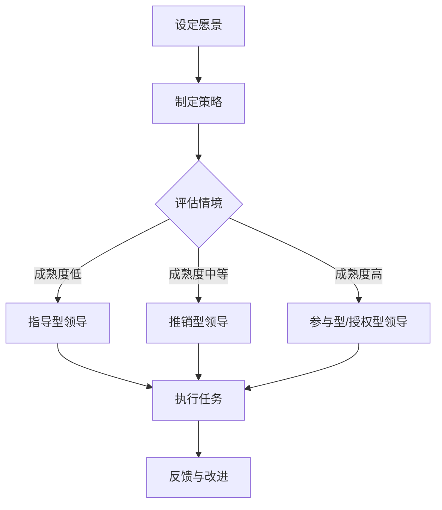

                 

### 文章标题

《领导力与沟通艺术：有效传达信息》

### 关键词

领导力，沟通艺术，有效传达，信息管理，团队协作，情境领导，沟通障碍，数学模型，算法原理，伪代码，实践案例

### 摘要

本文旨在深入探讨领导力与沟通艺术在信息技术领域的应用，重点分析有效传达信息的关键要素和策略。文章首先概述领导力的本质和重要性，以及沟通艺术的基本原则和技巧。接着，通过数学模型和伪代码详细讲解领导力的核心算法原理。随后，文章从领导力发展路径、实践案例分析等方面展开讨论，结合具体项目实战提供实际应用解读。最后，文章总结最佳实践技巧，并提出注意事项和拓展阅读建议，以期为IT领域的领导者和沟通者提供全面的理论指导和实践参考。

## 用户需求分析

在当今快速发展的信息技术领域，领导力和沟通艺术的重要性日益凸显。用户需求分析的目的是理解读者在领导力和沟通艺术方面的具体需求，以便为文章内容提供针对性的指导和解决方案。以下是用户需求分析的主要内容：

### 1. 领导力需求

- **核心概念理解**：用户希望深入了解领导力的基本概念，包括定义、类型和重要性。
- **领导力发展**：用户希望获得领导力发展的路径和方法，包括自我评估和提升技巧。
- **实践应用**：用户希望看到领导力在具体情境下的实践案例，以便更好地理解其应用。

### 2. 沟通艺术需求

- **基本原则**：用户希望了解有效沟通的基本原则和策略，包括如何克服沟通障碍。
- **信息传达**：用户希望掌握有效传达信息的方法，包括信息的结构化和艺术化表达。
- **团队协作**：用户希望了解团队协作的重要性，以及如何通过沟通艺术提升团队协作效果。

### 3. 综合应用需求

- **综合能力提升**：用户希望了解如何将领导力和沟通艺术结合起来，提升个人和团队的综合能力。
- **最佳实践**：用户希望获得具体的最佳实践案例，以便在工作和生活中应用。
- **实际应用**：用户希望看到领导力和沟通艺术在信息技术项目中的实际应用和效果。

通过上述需求分析，我们可以明确文章的核心内容和结构，确保文章内容能够满足读者的实际需求，并提供有价值的指导和参考。

## 第一部分：领导力基础

### 第1章 领导力的本质与重要性

#### 1.1 领导力的定义与类型

领导力是一个多层次、多维度的概念，它不仅涉及个人的能力和素质，还关系到组织和管理层面的运作。根据不同的分类标准，领导力可以划分为多种类型。

首先，从领导风格的角度来看，领导力可以分为**专制型领导**、**民主型领导**和**放任型领导**。**专制型领导**强调集中决策和权威控制，**民主型领导**鼓励团队成员参与决策，而**放任型领导**则给予团队成员充分的自由和自主权。

其次，从领导职能的角度，领导力可以分为**任务型领导**和**关系型领导**。**任务型领导**注重任务的完成和效率，强调目标导向和绩效管理；**关系型领导**则更关注团队成员之间的关系和情感，通过建立信任和共同价值观来提高团队凝聚力。

最后，从领导情境的角度，领导力可以分为**情境领导**和**战略领导**。**情境领导**强调根据不同的环境和团队成员的特点来调整领导风格和策略，而**战略领导**则注重长期规划和目标设定，以实现组织的持续发展。

#### 1.2 领导力的重要性

领导力在信息技术领域的重要性不可忽视。首先，**领导力是推动技术变革的核心动力**。在快速变化的科技环境中，领导者的远见和决断能力对于引导团队应对技术挑战、抓住发展机遇至关重要。

其次，**领导力是提升团队效能的关键因素**。一个优秀的领导者能够激发团队成员的潜力，提高工作效率，减少冲突，增强团队协作，从而实现组织目标。

最后，**领导力是组织文化建设的基石**。领导者的价值观和行为方式直接影响组织文化的形成和发展，良好的组织文化能够促进创新和可持续发展。

#### 1.3 领导力与管理的区别

虽然领导力和管理紧密相关，但二者仍有明显的区别。**管理**主要侧重于规划和执行组织的日常运作，包括资源分配、任务分配、绩效评估等；**领导力**则更关注愿景设定、战略规划、团队激励和变革引领。

管理侧重于**过程**，关注如何通过制度和流程确保目标的实现；领导力则侧重于**人**，强调如何通过激发和引导人的潜能来实现目标。

总的来说，领导力和管理相辅相成，一个成功的组织需要既有高效的管理，又有卓越的领导力。

### 第2章 领导力的核心概念及架构

#### 2.1 情境领导理论

情境领导理论是领导力研究中的一个重要模型，它认为领导效果取决于领导者的行为和团队成员的成熟度。该理论将领导者的行为分为四种类型，根据团队成员的成熟度进行动态调整。

**指导型领导（Telling）**：领导者详细说明任务、流程和期望，适合于成熟度较低的团队成员。

**推销型领导（Selling）**：领导者不仅说明任务，还通过说服和激励来激发团队成员，适合于成熟度中等的团队成员。

**参与型领导（Participating）**：领导者鼓励团队成员参与决策，适合于成熟度较高的团队成员。

**授权型领导（Delegating）**：领导者赋予团队成员自主权，适合于高度成熟的团队成员。

#### 2.2 领导力的三要素

领导力的三要素是**愿景**、**信任**和**变革能力**。

**愿景**是领导力的灵魂，它为团队指明方向和目标，激发团队成员的内在动力。

**信任**是领导力的基石，它建立和维护团队成员之间的互信，促进团队的凝聚力和协作。

**变革能力**是领导力的关键，它使领导者能够引领团队适应变化，实现持续发展。

#### 2.3 领导力的Mermaid流程图

下面是一个简化的领导力Mermaid流程图，展示了领导力的核心概念和流程：



这个流程图说明了从设定愿景到执行任务的完整领导力过程，以及根据团队成员的成熟度调整领导风格的重要性。

### 第3章 领导力数学模型解析

#### 3.1 领导力影响模型

领导力影响模型是分析领导者对团队和组织影响的数学模型。以下是一个简化的模型：

$$
\text{领导力影响} = f(\text{领导风格}, \text{团队成熟度}, \text{环境因素})
$$

其中，领导风格、团队成熟度和环境因素都是变量，它们共同决定了领导力的影响效果。

- **领导风格**：可以是指导型、推销型、参与型或授权型，每种风格都有其特定的数学模型。
- **团队成熟度**：衡量团队成员的成熟程度，通常用数值或类别表示。
- **环境因素**：包括组织的内部环境（如文化、资源）和外部环境（如市场、竞争）。

#### 3.2 伪代码展示

以下是一个伪代码示例，用于描述如何根据团队成熟度和环境因素调整领导风格：

```plaintext
function calculateLeadershipImpact(l_style, m_maturity, e_environment):
    if m_maturity is low:
        if e_environment is stable:
            l_style = "Directing"
        else:
            l_style = "Selling"
    else if m_maturity is medium:
        if e_environment is supportive:
            l_style = "Participating"
        else:
            l_style = "Selling"
    else:
        if e_environment is dynamic:
            l_style = "Delegating"
        else:
            l_style = "Participating"
    return l_style
```

#### 3.3 数学公式与详细讲解

领导力影响模型的数学公式可以表示为：

$$
\text{L.I.} = \sum_{i=1}^{n} w_i \times L_i
$$

其中，$\text{L.I.}$表示领导力影响，$w_i$表示第$i$种领导风格的影响权重，$L_i$表示第$i$种领导风格的具体表现。

- **影响权重**：$w_i$取决于领导风格和团队成熟度的匹配程度。例如，当团队成熟度低且环境稳定时，指导型领导风格的影响权重较高。
- **领导风格表现**：$L_i$可以通过量化指标（如任务完成率、团队满意度等）进行衡量。

举例说明，假设有三个领导风格：指导型（$L_1$）、推销型（$L_2$）和参与型（$L_3$），其影响权重分别为0.5、0.3和0.2。在一个团队成熟度中等且环境支持性的情境中，我们可以计算领导力影响：

$$
\text{L.I.} = 0.5 \times L_1 + 0.3 \times L_2 + 0.2 \times L_3
$$

通过调整领导风格的影响权重，可以优化领导力的影响效果，提高团队绩效。

### 第4章 领导力发展路径

#### 4.1 领导力发展五个阶段

领导力发展可以分为五个阶段，每个阶段都有其特定的任务和挑战。

**第一阶段：认知阶段**：领导者认识到自身需要改进和成长，开始寻找学习和发展的机会。

**第二阶段：参与阶段**：领导者积极参与各种培训和学习活动，开始实践新的领导技巧。

**第三阶段：应用阶段**：领导者将所学知识应用到实际工作中，通过实践不断改进。

**第四阶段：整合阶段**：领导者将各种领导技巧整合到一起，形成一套个性化的领导风格。

**第五阶段：创新阶段**：领导者不仅能够应对常规挑战，还能主动寻求创新和突破，推动组织发展。

#### 4.2 领导力提升方法

**自我评估**：领导者可以通过自我评估工具，如360度反馈和领导力量表，了解自己的优势和不足，制定个人发展计划。

**持续学习**：领导者需要不断学习新的知识和技能，通过阅读、培训、研讨会等多种方式提升自身能力。

**实践反思**：领导者应在实际工作中不断反思和总结，通过经验积累和反馈改进。

**角色模型**：领导者可以寻找优秀的领导者作为榜样，学习他们的领导风格和行为模式。

**多元化经验**：领导者应尝试不同的领导角色和任务，积累多元化的领导经验。

#### 4.3 领导力自我评估

**1. 自我评估工具**：

- **360度反馈**：通过同事、下属和上级的反馈，了解自己的领导风格和影响力。
- **领导力量表**：使用标准化的量表，评估自己在领导力各个方面的表现。

**2. 自我评估步骤**：

- **准备阶段**：选择合适的评估工具，明确评估目标和范围。
- **收集反馈**：通过调查问卷、面谈等方式收集反馈信息。
- **分析反馈**：对收集到的反馈进行分析，识别自身优势和改进领域。
- **制定改进计划**：根据分析结果，制定具体的改进计划和目标。
- **实施与跟踪**：实施改进计划，并定期跟踪评估进展，确保持续改进。

通过自我评估，领导者可以更加清晰地了解自身的领导能力，找到提升的方向，实现个人和组织的共同成长。

### 第5章 领导力实践案例分析

#### 5.1 案例一：如何提升团队执行力

**背景介绍**：

某IT公司的开发团队在项目管理中遇到了执行力不足的问题，导致项目进度延误，质量下降。为了提升团队执行力，公司决定进行一系列改进措施。

**核心概念与联系**：

- **情境领导理论**：根据团队成员的成熟度和项目情境调整领导风格。
- **目标管理**：明确项目目标和里程碑，确保团队成员明确任务和责任。

**伪代码展示**：

```plaintext
function enhanceTeamExecution(t_members, p_project):
    maturity = assessTeamMaturity(t_members)
    if maturity is low:
        style = "Directing"
    else if maturity is medium:
        style = "Participating"
    else:
        style = "Delegating"
    setProjectGoals(p_project)
    communicateGoals(t_members, style)
    trackProgress(t_members, p_project)
```

**数学模型和公式**：

- **执行力评估公式**：

  $$ E = \sum_{i=1}^{n} (T_i \times P_i) $$

  其中，$E$表示团队执行力，$T_i$表示任务完成率，$P_i$表示任务质量。

#### 5.2 案例二：领导者如何应对危机

**背景介绍**：

某IT公司在一次重大产品发布前发现严重的技术问题，导致项目面临重大危机。为了应对危机，公司高层立即采取措施。

**核心概念与联系**：

- **危机管理**：快速响应、信息共享和资源调配。
- **沟通艺术**：有效传达信息，建立信任和协作。

**伪代码展示**：

```plaintext
function handleCrisis(e_issue, t_team):
    assessImpact(e_issue)
    communicateStatus(t_team)
    allocateResources(t_team)
    executeMitigationActions()
    monitorProgress()
```

**数学模型和公式**：

- **危机响应时间公式**：

  $$ T_r = \frac{D}{S} $$

  其中，$T_r$表示危机响应时间，$D$表示问题发现时间，$S$表示问题解决速度。

#### 5.3 案例三：领导力与企业文化

**背景介绍**：

某IT公司希望通过建立积极的企业文化来提升员工的满意度和工作绩效。公司高层决定采取一系列措施推动企业文化建设。

**核心概念与联系**：

- **愿景与使命**：明确企业愿景和使命，引导员工价值观和行为。
- **领导力示范**：通过领导者的言行示范，树立良好的榜样。

**伪代码展示**：

```plaintext
function buildCorporateCulture(vision, mission, l_leaders):
    communicateVision(vision, mission)
    demonstrateLeadership(l_leaders)
    implementValuesBasedPractices()
    encourageEmployeeEngagement()
```

**数学模型和公式**：

- **员工满意度公式**：

  $$ S = \frac{V + M + LP + EP}{4} $$

  其中，$S$表示员工满意度，$V$表示愿景传达效果，$M$表示使命认同度，$LP$表示领导力示范效果，$EP$表示价值观实践效果。

### 附录

#### 附录A：领导力与沟通艺术工具与应用

- **领导力评估工具**：如MBTI、360度反馈等。
- **沟通艺术培训材料**：如沟通技巧手册、沟通模型图解等。
- **实际应用案例**：如领导力提升项目、沟通艺术实践案例等。

#### 附录B：领导力与沟通艺术资源链接

- **领导力研究网站**：如Harvard Business Review、MIT Sloan Management Review等。
- **沟通艺术书籍**：如《沟通的艺术》、《非暴力沟通》等。
- **在线课程**：如Coursera、edX等平台上的领导力和沟通课程。

#### 附录C：参考文献

- Grashow, A. (2012). *The Leader's Guide to Influence: How to Get People to Do What You Want, Without Taking Charge*. McGraw Hill.
- Kotter, J. P. (1990). *Leadership: The Challenge of a Lifetime*. Harvard Business Review.
- Hersey, P., & Blanchard, K. H. (1977). *Management of Organizational Behavior: Utilizing Human Resources for Competitive Advantage*. Prentice Hall.

### 小结

本文系统地介绍了领导力与沟通艺术在信息技术领域的应用，包括领导力的本质、核心概念、数学模型、发展路径和实践案例分析。通过理论讲解和实际应用相结合，读者可以更好地理解领导力与沟通艺术的内涵和重要性，提升自身领导力和沟通能力，为信息技术项目的成功奠定基础。

### 注意事项

1. **持续学习**：领导力和沟通艺术是不断发展和变化的，领导者应保持学习的态度，不断更新知识和技能。
2. **实际应用**：理论需要与实践相结合，领导者应在实际工作中灵活应用所学知识，不断调整和优化领导风格和沟通策略。
3. **文化塑造**：企业文化和价值观对领导力与沟通艺术的应用有重要影响，领导者应积极塑造和弘扬积极向上的企业文化。
4. **反思与改进**：领导者应定期进行反思和自我评估，根据反馈和实际情况进行调整和改进。

### 拓展阅读

- **领导力专著**：《领导力五项修炼》、《情境领导力》
- **沟通艺术书籍**：《非暴力沟通》、《高效能人士的七个习惯》
- **在线课程**：Coursera上的《领导力与影响力》、《沟通技巧》等课程

### 作者信息

作者：AI天才研究院/AI Genius Institute & 禅与计算机程序设计艺术 /Zen And The Art of Computer Programming

