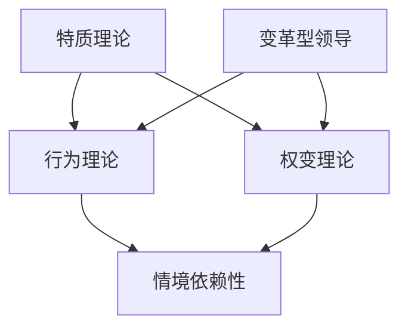

                 

### 《领导力与沟通：有效传达期望的技巧》

#### 关键词：
领导力，沟通，期望传达，反馈技巧，实践应用

#### 摘要：
本文旨在探讨领导力与沟通在有效传达期望方面的重要性。通过对领导力的定义、沟通技巧的解析，以及期望传达和反馈技巧的深入探讨，本文为读者提供了实用的实践指南，帮助领导者在实际工作中提升沟通效果，明确期望，促进团队协作和成长。

### 引言：领导力与沟通的重要性

#### 领导力的定义与作用
领导力是一种激励和影响他人实现共同目标的能力。在组织中，领导者不仅是战略的制定者，更是团队成员的引导者和支持者。有效的领导力能够激发团队的潜力，提高工作效率，推动组织发展。

#### 沟通的本质与意义
沟通是信息传递和理解的过程，是领导力的重要组成部分。良好的沟通能够确保信息的准确传达，减少误解和冲突，增强团队成员之间的信任和协作。

#### 本书结构安排
本文将分为六个部分，首先介绍领导力与沟通的基础理论，然后探讨沟通技巧和传达期望的技巧，接着通过案例分析和实践指南提供实际应用的建议，最后总结并给出拓展阅读资源。

### 第二部分：领导力核心理论

#### 第2章 领导力模型

#### 传统领导力理论
传统的领导力理论包括特质理论、行为理论和权变理论。特质理论认为领导者天生具有特定的个性特质；行为理论则关注领导者的行为模式；权变理论强调领导行为应根据情境灵活调整。

#### 现代领导力理论
现代领导力理论强调领导者的变革性作用、领导与追随的关系，以及领导力的情境依赖性。变革型领导通过激发追随者的潜力和创造力来推动组织变革。

#### 领导力模型的联系与对比
通过Mermaid流程图，展示传统领导力理论与现代领导力理论的联系与对比：

#### 核心概念与联系
领导力的核心概念包括：特质、行为、情境、变革和追随。这些概念相互关联，共同构成了领导力的多维度模型。

### 第三部分：沟通技巧

#### 第3章 沟通基础

#### 沟通的构成要素
沟通的构成要素包括信息源、信息内容、媒介、接收者和反馈。这些要素相互作用，共同完成信息的传递和理解。

#### 沟通障碍与克服
沟通障碍包括语言障碍、文化差异、心理障碍等。通过提高语言表达能力、增强文化敏感性和建立互信关系，可以克服沟通障碍。

#### 沟通中的非语言因素
非语言因素如肢体语言、面部表情和声音等在沟通过程中也起着重要作用。有效的非语言沟通能够增强信息的传达效果。

### 第四部分：传达期望的技巧

#### 第4章 明确期望

#### 期望的类型与分类
期望可以分为目标期望、行为期望和情感期望。明确不同类型的期望有助于制定有效的沟通策略。

#### 设置期望的原则
设置期望时，应遵循明确性、具体性、可行性、相关性原则。明确的原则有助于确保期望的传达和理解。

#### 期望的传达策略
有效的期望传达策略包括：提前沟通、具体描述、积极倾听和及时反馈。通过这些策略，可以提高期望的传达效果。

### 第5章 有效反馈

#### 反馈的类型与时机
反馈可以分为建设性反馈和破坏性反馈。选择适当的反馈类型和时机对于沟通效果至关重要。

#### 提供有效反馈的技巧
提供有效反馈的技巧包括：正面肯定、具体描述问题、提出改进建议、避免攻击个人。这些技巧有助于建立积极的工作氛围。

#### 反馈的艺术
反馈的艺术在于平衡建设性和破坏性，确保反馈能够促进个人和团队的发展。

### 第五部分：实践应用

#### 第6章 领导力与沟通案例分析

#### 成功案例剖析
通过成功案例的分析，我们可以看到领导力和沟通技巧在实践中的应用效果。案例中，领导者的清晰期望传达和有效的反馈机制促进了团队的成长。

#### 失败案例分析
失败案例分析揭示了期望传达不清、沟通不畅带来的负面影响。从失败中汲取教训，有助于我们在实际工作中避免重复错误。

#### 案例启示与策略
案例启示我们，领导力和沟通技巧的实践需要灵活应对不同的情境。通过制定个性化的沟通策略，可以提高期望传达的效果。

### 第六部分：领导力与沟通实践

#### 第7章 领导力与沟通实践指南

#### 领导力培养方法
领导力的培养包括自我认知、情感管理、决策能力和影响力提升等方面。通过持续学习和实践，可以不断提升领导力。

#### 沟通技巧训练
沟通技巧的训练可以通过角色扮演、模拟沟通场景和反馈机制来实现。有效的训练能够提高沟通效果。

#### 实践案例分享
通过分享实际工作中的案例，我们可以看到领导力和沟通技巧在实践中的应用效果。这些案例为我们提供了宝贵的经验和启示。

### 附录

#### 附录A 领导力与沟通工具与资源
提供一些领导力与沟通工具和资源的介绍，包括书籍、在线课程、研讨会和社区等。这些资源有助于进一步学习和提升领导力和沟通技巧。

### 结论

领导力和沟通技巧在有效传达期望方面至关重要。通过本文的探讨，我们了解了领导力和沟通的核心概念、传达期望的技巧以及实践应用的方法。在实际工作中，领导者应不断学习和实践，提升自身的领导力和沟通技巧，以实现团队的目标。

#### 最佳实践 tips
- **持续学习**：领导力和沟通技巧需要不断学习和实践。
- **积极反馈**：鼓励团队成员提供建设性反馈，促进个人和团队的发展。
- **情境适应**：灵活应对不同的沟通情境，提高期望传达的效果。

#### 注意事项
- 避免单向沟通，确保信息的双向流动。
- 注意非语言因素，提高沟通的整体效果。

#### 拓展阅读
- 《领导力五要素》by John C. Maxwell
- 《沟通的艺术》by Alan Gibson
- 《有效沟通》by Stephen R. Covey

### 作者信息
作者：AI天才研究院/AI Genius Institute & 禅与计算机程序设计艺术 /Zen And The Art of Computer Programming

### 文章关键词
领导力，沟通，期望传达，反馈技巧，实践应用

### 参考文献
[1] John C. Maxwell. Leadership Is Not a Title: It's a Commitment. [2] Alan Gibson. The Art of Communication: How to Express with Clarity and Confidence. [3] Stephen R. Covey. The 7 Habits of Highly Effective People: Restoring the Character Ethic.

