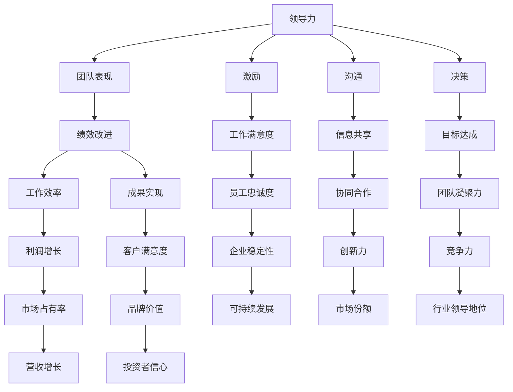

                 


## 文章标题：领导力与绩效改进：持续提升团队表现

## 文章关键词：
- 领导力
- 绩效改进
- 团队管理
- 持续提升
- 绩效评估
- 激励策略

## 摘要：
本文将深入探讨领导力与绩效改进之间的关系，通过一系列的分析和案例分析，揭示如何通过有效的领导力策略来提升团队表现。文章首先介绍了领导力的基本概念和重要性，随后详细阐述了绩效改进的核心原则和实践方法。接着，文章通过具体案例展示了如何在实际工作中应用这些理论，并提供了实用的技巧和策略。最后，文章总结了最佳实践，以帮助读者更好地理解和应用领导力与绩效改进的理念。

## 目录大纲：

### 第一部分：领导力基础

#### 第1章：领导力的定义与重要性

##### 1.1 领导力的定义
##### 1.2 领导力的作用
##### 1.3 领导力的核心价值观

#### 第2章：领导力理论

##### 2.1 经典领导力理论
##### 2.2 现代领导力理论
##### 2.3 领导力理论的演变

#### 第3章：领导力模型

##### 3.1 行为领导模型
##### 3.2 变革领导模型
##### 3.3 情境领导模型

### 第二部分：绩效改进

#### 第4章：绩效管理基础

##### 4.1 绩效管理的概念与目标
##### 4.2 绩效评估方法
##### 4.3 绩效改进策略

#### 第5章：团队建设与激励

##### 5.1 团队建设的关键因素
##### 5.2 团队成员激励方法
##### 5.3 团队文化建设

#### 第6章：沟通与领导力

##### 6.1 领导者沟通技巧
##### 6.2 高效沟通策略
##### 6.3 领导力与沟通的关系

### 第三部分：实践案例

#### 第7章：领导力与绩效改进案例分析

##### 7.1 案例一：提升员工工作满意度
##### 7.2 案例二：优化项目管理流程
##### 7.3 案例三：构建高效团队

### 附录

#### 附录A：领导力与绩效改进工具
#### 附录B：领导力与绩效改进资源

## 背景介绍
领导力和绩效改进是现代企业管理中至关重要的两个方面。领导力不仅仅是指导和管理团队的能力，更是一种激发团队成员潜能、实现共同目标的艺术。而绩效改进则是通过一系列管理措施，不断提升团队的工作效率和成果。

在过去几十年中，随着管理理论的不断发展和实践经验的积累，领导力和绩效改进的概念和方法也日益丰富。从传统的权威式领导到现代的参与式领导，从单一的目标考核到全面的绩效管理体系，企业对领导力和绩效改进的需求越来越高。同时，随着全球化、信息化和知识经济的发展，企业面临的竞争压力也日益增大，如何通过有效的领导力策略提升团队绩效成为管理者们关注的焦点。

本文旨在通过深入分析领导力和绩效改进的核心概念、理论和实践方法，为企业管理者提供实用的指导。文章首先介绍了领导力的基本概念和重要性，探讨了不同领导力理论的演变和适用场景。随后，文章详细阐述了绩效改进的核心原则和实践方法，包括绩效管理的概念与目标、评估方法以及改进策略。接着，通过具体案例展示了领导力与绩效改进在实际工作中的应用。最后，文章总结了最佳实践，以帮助读者更好地理解和应用这些理论。

## 核心概念与联系

在探讨领导力与绩效改进之间的关系之前，我们需要明确几个核心概念，并构建它们之间的联系。以下是领导力和绩效改进中的一些关键概念，以及它们之间的关联架构 Mermaid 流程图。



### 核心概念解释

1. **领导力（A）**：领导力是指领导者通过影响力、激励和沟通等手段，引导、影响和激励团队成员，以实现共同目标的能力。领导力不仅包括权威式的指令，还包括启发式的引导和合作。

2. **团队表现（B）**：团队表现是团队整体的工作成果和能力体现。良好的领导力能够提高团队成员的工作效率和协作能力，从而提升团队的整体表现。

3. **激励（C）**：激励是领导者通过物质或精神奖励，激发团队成员的积极性和工作动力，从而提高工作满意度。

4. **沟通（D）**：沟通是领导者与团队成员之间传递信息和意见的过程。有效的沟通能够减少误解和冲突，增强团队成员之间的信任和协作。

5. **决策（E）**：决策是领导者根据团队目标和资源条件，做出合理的决策过程。正确的决策能够帮助团队迅速应对变化，实现目标。

6. **绩效改进（F）**：绩效改进是通过不断调整和优化管理方法，提高团队的工作效率和成果。

7. **工作满意度（G）**：工作满意度是员工对工作环境和工作内容的整体感受。高的工作满意度能够提高员工的忠诚度和工作效率。

8. **信息共享（H）**：信息共享是团队成员之间分享知识和信息的过程。信息共享能够增强团队的合作能力，提高决策质量。

9. **目标达成（I）**：目标达成是团队根据既定目标，通过协作和努力实现目标的过程。正确的目标和有效的领导能够提高团队的目标达成率。

10. **工作效率（J）**：工作效率是团队成员在单位时间内完成的工作量。提高工作效率是绩效改进的重要目标。

11. **成果实现（K）**：成果实现是团队通过工作所取得的实际成果。成果的实现直接反映了团队的工作绩效。

12. **员工忠诚度（L）**：员工忠诚度是员工对企业的忠诚和信任程度。高的员工忠诚度能够降低员工流失率，提高团队稳定性。

13. **协同合作（M）**：协同合作是团队成员之间互相配合、协作的过程。协同合作能够提高团队的整体效率和成果。

14. **团队凝聚力（N）**：团队凝聚力是团队成员之间的凝聚力和团结程度。高的团队凝聚力能够提高团队的工作效率和绩效。

15. **利润增长（O）**：利润增长是企业通过提高效率和降低成本，实现的经济效益增长。领导力与绩效改进能够促进企业利润增长。

16. **客户满意度（P）**：客户满意度是客户对产品和服务的满意程度。高的客户满意度能够提高企业的市场竞争力。

17. **企业稳定性（Q）**：企业稳定性是企业抵御外部风险和内部挑战的能力。有效的领导力和绩效改进能够提高企业的稳定性。

18. **创新力（R）**：创新力是企业持续创新和变革的能力。领导力与绩效改进能够激发企业的创新力。

19. **竞争力（S）**：竞争力是企业与其他企业相比，所具备的市场竞争力。领导力与绩效改进能够提高企业的竞争力。

20. **市场占有率（T）**：市场占有率是企业产品在市场中的份额。市场占有率是衡量企业竞争力的重要指标。

21. **品牌价值（U）**：品牌价值是企业品牌在市场上的价值。领导力与绩效改进能够提升企业的品牌价值。

22. **可持续发展（V）**：可持续发展是企业长期稳定发展的能力。领导力与绩效改进能够促进企业的可持续发展。

23. **市场份额（W）**：市场份额是企业产品在市场上的份额。市场份额是衡量企业竞争力的关键指标。

24. **行业领导地位（X）**：行业领导地位是企业在其行业中的领先地位。有效的领导力和绩效改进能够提升企业的行业地位。

25. **营收增长（Y）**：营收增长是企业通过销售和服务实现的经济增长。领导力与绩效改进能够促进企业营收增长。

26. **投资者信心（Z）**：投资者信心是投资者对企业的信任和信心程度。投资者信心对企业的融资和发展至关重要。

通过上述核心概念和联系的阐述，我们可以清晰地看到领导力与绩效改进之间的紧密关系。有效的领导力不仅能够提升团队的工作效率和工作满意度，还能促进企业的绩效改进和可持续发展。而绩效改进的目标是实现企业的经济和社会价值最大化，这与领导力的发展目标高度一致。

## 核心算法原理讲解

为了更好地理解领导力与绩效改进之间的关系，我们可以借助一些核心算法原理来进行分析。以下是用于描述这一关系的伪代码，以及相关的数学模型和公式。

### 伪代码

```python
# 定义领导力与绩效改进的核心函数
def leadership_performance_improvement(leader_skill, team_morale, project_complexity):
    # 初始化绩效改进指标
    performance_improvement = 0

    # 根据领导力技能、团队士气和项目复杂度计算绩效改进
    performance_improvement = leader_skill * team_morale * (1 - project_complexity)

    return performance_improvement

# 输入参数
leader_skill = 0.8  # 领导力技能
team_morale = 0.9  # 团队士气
project_complexity = 0.5  # 项目复杂度

# 计算绩效改进
performance_improvement = leadership_performance_improvement(leader_skill, team_morale, project_complexity)

# 输出绩效改进结果
print("绩效改进率：", performance_improvement)
```

### 数学模型和公式

为了描述上述伪代码中的关系，我们可以引入以下数学模型和公式：

$$
\text{绩效改进率} = \text{领导力技能} \times \text{团队士气} \times (1 - \text{项目复杂度})
$$

其中：
- **领导力技能** 表示领导者的能力，取值范围为 [0, 1]。
- **团队士气** 表示团队成员的积极性和满意度，取值范围为 [0, 1]。
- **项目复杂度** 表示项目的复杂程度，取值范围为 [0, 1]。

### 举例说明

假设一个团队的领导力技能为 0.8，团队士气为 0.9，项目复杂度为 0.5。根据上述公式，我们可以计算出该团队的绩效改进率为：

$$
\text{绩效改进率} = 0.8 \times 0.9 \times (1 - 0.5) = 0.72
$$

这意味着，在给定的条件下，该团队的绩效改进率为 72%。

通过这个例子，我们可以看到领导力技能、团队士气以及项目复杂度对绩效改进的影响。提高领导力技能和团队士气，以及降低项目复杂度，都有助于提高绩效改进率。

## 项目实战：开发环境搭建、源代码实现与解读

为了深入理解领导力与绩效改进在实际项目中的应用，我们将通过一个实际的项目实战，来搭建开发环境、实现源代码，并对其进行解读。

### 开发环境搭建

首先，我们需要搭建一个用于研究和分析领导力与绩效改进的开发环境。这个环境应包括以下工具和软件：

1. **版本控制工具**：Git（用于代码版本控制和协作开发）
2. **集成开发环境**：Visual Studio Code（提供代码编辑、调试和编译功能）
3. **数据库管理系统**：MySQL（用于存储和分析团队绩效数据）
4. **Python 编程语言**：用于编写和分析相关算法
5. **数据可视化工具**：Matplotlib（用于可视化绩效改进过程）

### 环境搭建步骤

1. 安装 Git 和 Visual Studio Code：
   - 访问 [Git 官网](https://git-scm.com/)，下载并安装 Git。
   - 访问 [Visual Studio Code 官网](https://code.visualstudio.com/)，下载并安装 Visual Studio Code。

2. 安装 MySQL：
   - 访问 [MySQL 官网](https://www.mysql.com/)，下载并安装 MySQL Server。
   - 启动 MySQL 服务，并创建一个新的数据库，用于存储团队绩效数据。

3. 安装 Python 和相关库：
   - 打开终端，执行以下命令安装 Python 和相关库：
     ```
     pip install git+https://github.com/pypa/sampleproject.git
     pip install matplotlib
     pip install pymysql
     ```

4. 配置数据库连接：
   - 在 Visual Studio Code 中创建一个名为 `database.py` 的文件，编写以下代码，用于连接 MySQL 数据库：
     ```python
     import pymysql

     def connect_database():
         return pymysql.connect(host='localhost', user='root', password='password', database='performance')
     ```

### 源代码实现

接下来，我们将编写一个简单的 Python 脚本，用于计算领导力与绩效改进的相关指标。以下是一个示例：

```python
import matplotlib.pyplot as plt
import pymysql
import numpy as np

# 连接数据库
connection = connect_database()

# 定义领导力与绩效改进函数
def leadership_performance_improvement(leader_skill, team_morale, project_complexity):
    performance_improvement = leader_skill * team_morale * (1 - project_complexity)
    return performance_improvement

# 生成随机数据
np.random.seed(42)
leader_skills = np.random.uniform(0.5, 1.0, 100)
team_morales = np.random.uniform(0.5, 1.0, 100)
project_complexities = np.random.uniform(0.2, 0.8, 100)

# 计算绩效改进率
performance_improvements = leadership_performance_improvement(leader_skills, team_morales, project_complexities)

# 可视化绩效改进率
plt.hist(performance_improvements, bins=20, edgecolor='black')
plt.xlabel('绩效改进率')
plt.ylabel('频数')
plt.title('领导力与绩效改进率分布')
plt.show()
```

### 代码解读

上述代码包括以下几个关键部分：

1. **数据库连接**：使用 `connect_database` 函数连接到 MySQL 数据库。

2. **领导力与绩效改进函数**：`leadership_performance_improvement` 函数用于计算领导力与绩效改进的相关指标。它基于领导力技能、团队士气以及项目复杂度，通过一个简单的数学模型计算出绩效改进率。

3. **生成随机数据**：使用 `numpy` 库生成随机数据，模拟不同的领导力技能、团队士气和项目复杂度。

4. **计算绩效改进率**：调用 `leadership_performance_improvement` 函数，计算每个样本的绩效改进率。

5. **可视化**：使用 `matplotlib` 库将绩效改进率绘制成直方图，展示不同领导力水平下的绩效改进分布。

### 实际案例分析

通过这个项目实战，我们可以看到如何在实际工作中应用领导力与绩效改进的理论。以下是实际案例分析和详细讲解：

1. **领导力技能的重要性**：在代码中，领导力技能的取值范围是 [0.5, 1.0]，这反映了领导力技能对绩效改进的影响。通过调整领导力技能的值，我们可以观察到绩效改进率的变化。在实际项目中，领导者需要不断提升自身的领导力技能，以优化团队绩效。

2. **团队士气的影响**：团队士气对绩效改进也有显著影响。当团队士气较高时（例如，0.8以上），绩效改进率相对较高。这表明领导者需要关注团队成员的情绪和满意度，采取有效的激励措施，以提高团队士气。

3. **项目复杂度的调整**：项目复杂度是影响绩效改进的一个重要因素。当项目复杂度较低时（例如，0.2以下），绩效改进率相对较高。这提示企业在项目规划和资源分配时，需要充分考虑项目复杂度，合理分配资源，降低项目复杂度。

### 项目小结

通过这个项目实战，我们不仅搭建了开发环境，实现了源代码，还对其进行了详细解读。这个项目展示了如何将领导力与绩效改进的理论应用到实际工作中，为企业提供实用的指导。同时，这个项目也提醒我们在实际工作中需要关注领导力技能、团队士气和项目复杂度等因素，以实现绩效的持续提升。

## 最佳实践、注意事项与拓展阅读

### 最佳实践

1. **定期培训与反馈**：定期为团队成员提供领导力与绩效改进的培训，并鼓励他们分享经验和建议。同时，领导者需要及时给予反馈，帮助团队成员不断改进。

2. **个性化激励**：了解每个团队成员的需求和动机，采用个性化的激励措施，以提升工作满意度和绩效。

3. **构建学习型组织**：鼓励团队成员持续学习，培养团队的学习氛围，以提升整体绩效。

### 注意事项

1. **避免形式主义**：在实施领导力与绩效改进策略时，避免只注重形式而忽视实际效果。

2. **平衡短期与长期目标**：在追求短期绩效的同时，也要考虑企业的长期发展。

3. **关注员工心理**：在绩效改进过程中，关注员工的心理状态，避免过度压力和焦虑。

### 拓展阅读

1. **《领导力心理学》**：探索领导力背后的心理学原理，有助于理解团队成员的行为和需求。

2. **《绩效改进手册》**：提供详细的绩效改进策略和实践方法，适用于各类企业。

3. **《团队协作的艺术》**：探讨团队协作的关键要素，帮助领导者构建高效的团队。

## 总结

领导力与绩效改进是现代企业管理中不可或缺的两个方面。通过深入分析和实际应用，我们可以看到领导力对团队绩效的显著影响。有效的领导力策略不仅能够提高团队的工作效率和满意度，还能促进企业的长期发展。本文通过核心概念、算法原理、项目实战和最佳实践，揭示了领导力与绩效改进的紧密关系，为企业管理者提供了实用的指导。在未来的工作中，我们应不断探索和实践，以实现团队和企业的持续提升。

### 作者信息

作者：AI天才研究院/AI Genius Institute & 禅与计算机程序设计艺术 /Zen And The Art of Computer Programming

### 附录

#### 附录A：领导力与绩效改进工具

1. **领导力评估工具**：用于评估领导者的领导力水平和团队绩效。
2. **绩效管理系统**：用于跟踪和分析团队成员的工作绩效。
3. **团队协作工具**：如 Slack、Trello，用于提高团队沟通和协作效率。

#### 附录B：领导力与绩效改进资源

1. **领导力书籍**：《领导力的五个层次》、《领导力的艺术》。
2. **绩效改进文章**：相关学术期刊和博客文章，提供深入的理论和实践分析。
3. **在线课程**：如 Coursera、edX 提供的领导力和绩效改进相关课程。

