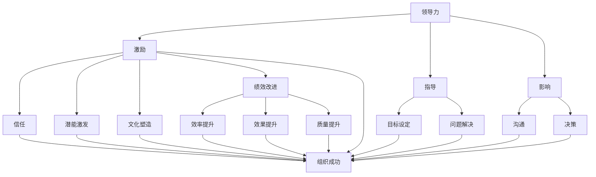
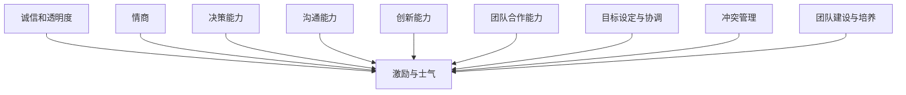
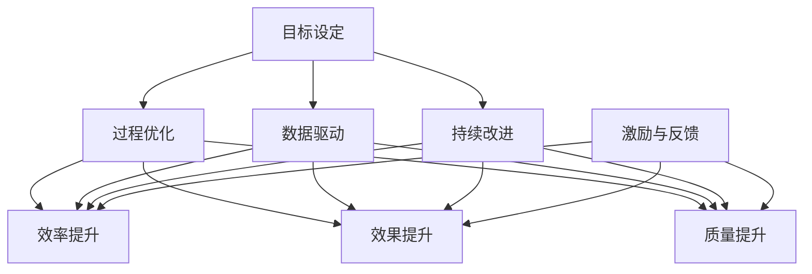
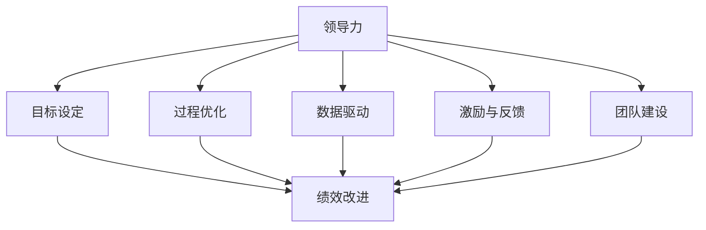
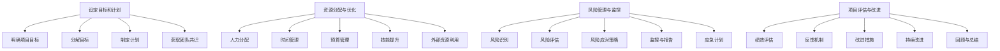
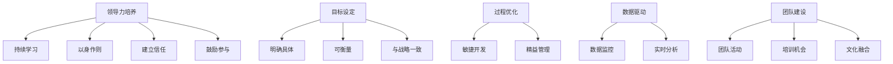

                 

### 引言与背景介绍

在当今高度竞争的商业环境中，领导力和绩效改进成为推动组织成功的关键要素。领导力不仅关乎个人的影响力，更关系到团队的整体表现和组织的长远发展。而绩效改进则强调通过系统的方法和策略，不断提升团队的效率和成果。

#### **领导力的核心概念**

领导力是一种通过激励、指导和影响他人来实现共同目标的能力。其核心在于建立信任、激发潜力、塑造文化以及实现变革。领导力不仅仅是管理职位的人的特权，而是每个团队成员都应该具备的能力。

#### **绩效改进的定义**

绩效改进是一种系统性的方法，旨在通过提高团队的工作效率、效果和质量，来实现组织的战略目标。它涵盖了目标设定、评估反馈、过程优化等多个方面，强调持续改进和自我超越。

#### **团队表现与组织成功的关系**

团队表现直接影响组织的绩效和竞争力。一个高效、协作的团队能够迅速响应市场变化，创新解决方案，提升客户满意度。反之，一个表现不佳的团队可能会拖累整个组织的运营和发展。

#### **研究背景**

随着全球经济的不断变化和技术的飞速发展，领导力和绩效改进的研究变得更加重要。过去几十年，学术界和实践领域对这两个领域进行了大量的研究，形成了一系列的理论框架和实践方法。

### **领导力研究的发展**

领导力研究从早期的研究领导风格（如权变理论、情境领导理论）发展到现在的领导力特质和能力模型（如 transformational leadership、servant leadership）。这些研究为我们理解领导力提供了丰富的理论基础。

### **绩效改进研究的发展**

绩效改进研究则从早期的目标管理（Management by Objectives, MBO）发展到现在的全面质量管理（Total Quality Management, TQM）和六西格玛（Six Sigma）等。这些方法强调数据驱动和持续改进。

### **领导力与绩效改进的结合研究**

近年来，越来越多的研究开始关注领导力与绩效改进的结合。这些研究指出，领导力不仅影响团队的行为和绩效，还能够激发团队成员的潜能，促进绩效改进的持续进行。

### **本文的目的**

本文旨在通过深入分析领导力与绩效改进的原理、方法和实践，为读者提供一套系统的、实用的指导框架，帮助团队领导者和管理者提升团队表现，实现组织目标。

#### **文章关键词**

- **领导力**
- **绩效改进**
- **团队表现**
- **组织成功**
- **领导风格**
- **绩效评估**
- **团队建设**
- **项目管理**

#### **摘要**

本文将探讨领导力与绩效改进在提升团队表现中的关键作用。首先，我们定义了领导力和绩效改进的核心概念，并介绍了它们在组织成功中的重要性。接着，我们回顾了领导力和绩效改进研究的进展，并分析了它们之间的结合关系。最后，本文提出了一系列实用的技巧和方法，帮助团队领导者和管理者提升团队表现，实现组织目标。

---

**图 1：领导力与绩效改进的核心概念关系架构**

通过以上内容，我们为读者提供了一个清晰、逻辑的框架，来理解领导力与绩效改进在提升团队表现中的重要性。在接下来的章节中，我们将进一步深入探讨领导力基础、绩效改进理论以及领导力与绩效改进的结合，帮助读者更好地应用这些知识。

---

**作者：AI天才研究院/AI Genius Institute & 禅与计算机程序设计艺术 /Zen And The Art of Computer Programming**

---

### 领导力基础

领导力不仅是领导者的责任，而是每个团队成员都应该掌握的核心能力。在这个部分，我们将深入探讨领导力的核心概念、领导风格与类型，以及领导力的特质与能力，为理解领导力与绩效改进的关系奠定基础。

#### **定义领导力的核心概念**

领导力是一种通过激励、指导和影响他人来实现共同目标的能力。它不仅仅局限于管理职位，而是贯穿于整个团队。领导力的核心概念包括以下几个方面：

1. **影响力**：领导者通过行为和沟通来影响团队成员，激发他们的积极性和创造力。
2. **愿景**：领导者需要具有清晰的目标和愿景，能够为团队指引方向，并激发成员的归属感。
3. **信任**：信任是领导力的基石，领导者需要通过诚信和透明度建立与团队成员的信任关系。
4. **沟通**：有效的沟通是领导者必须具备的能力，它能够确保信息的准确传递，促进团队协作。
5. **激励**：领导者需要了解团队成员的需求和动机，并通过激励来提升团队士气和工作效率。

#### **领导风格与类型**

领导风格是指领导者如何行使权力、决策和影响团队成员的方式。不同的领导风格适用于不同的情境和团队。以下是几种常见的领导风格：

1. ** authoritarian 领导风格**：这种风格的领导者高度集权，决策由领导者单独做出，强调纪律和效率。
2. ** democratic 领导风格**：这种风格的领导者鼓励团队成员参与决策，通过民主讨论来达成共识。
3. ** Laissez-faire 领导风格**：这种风格的领导者放任团队成员自主决策和工作，较少干预。
4. ** transformational 领导风格**：这种风格的领导者通过激发团队成员的潜能、塑造共同愿景来推动变革。
5. ** servant leadership**：这种风格的领导者把团队成员的需求放在首位，通过服务来领导。

每种领导风格都有其适用的情境和优缺点，领导者需要根据实际情况和团队成员的特点灵活调整自己的领导风格。

#### **领导力的特质与能力**

领导力不仅仅是一种技能，更是一种特质和能力的综合体现。以下是几个关键的领导力特质和能力：

1. **诚信和透明度**：领导者需要具备高度的诚信，言行一致，能够赢得团队成员的信任。
2. **情商**：领导者需要具备良好的情商，能够理解和管理自己的情绪，同时也能洞察和影响团队成员的情绪。
3. **决策能力**：领导者需要在复杂多变的环境中做出明智的决策，平衡风险和机会。
4. **沟通能力**：领导者需要具备出色的沟通能力，能够清晰、有效地传达信息，促进团队协作。
5. **创新能力**：领导者需要具备创新能力，能够推动团队不断探索新思路、新方法。
6. **团队合作能力**：领导者需要能够与团队成员建立良好的合作关系，激发团队的合力。

#### **领导力与绩效改进的关系**

领导力与绩效改进密切相关。有效的领导力能够激发团队成员的潜能，提高工作效率和效果，从而推动绩效改进。以下是领导力如何影响绩效改进的几个方面：

1. **激励与士气**：领导者通过激励和鼓励，提升团队成员的士气和工作积极性，从而提高绩效。
2. **目标设定与协调**：领导者需要明确团队的目标，并通过有效的沟通和协调，确保团队成员共同朝着目标努力。
3. **冲突管理**：领导者需要具备解决冲突的能力，避免冲突对绩效改进的负面影响。
4. **团队建设与培养**：领导者通过团队建设活动，提升团队的合作能力和凝聚力，为绩效改进提供坚实的基础。

通过以上内容，我们为读者提供了一个全面的领导力基础框架，帮助理解领导力在绩效改进中的关键作用。在接下来的章节中，我们将进一步探讨绩效改进的理论和方法，以及如何将领导力与绩效改进相结合，提升团队表现。

---

**图 2：领导力的核心特质与能力**

---

**作者：AI天才研究院/AI Genius Institute & 禅与计算机程序设计艺术 /Zen And The Art of Computer Programming**

---

### 绩效改进理论

绩效改进是一个系统性的过程，旨在通过提高团队的工作效率、效果和质量，来实现组织的战略目标。在这个部分，我们将探讨绩效改进的原理与方法、绩效评估与反馈机制，以及团队绩效改进模型。

#### **绩效改进的原理与方法**

绩效改进的核心在于通过系统的方法和策略，不断提升团队的工作效率和成果。以下是一些关键的原理和方法：

1. **目标设定**：明确的目标是绩效改进的起点。团队需要根据组织的战略目标，设定具体的绩效目标，并确保每个成员都理解并承诺这些目标。

2. **过程优化**：通过对工作流程的持续优化，消除浪费和不必要的环节，提高工作效率。这包括改进流程设计、自动化工具的使用和资源的合理配置。

3. **数据驱动**：绩效改进需要基于数据和事实，而不是主观判断。通过收集和分析数据，可以准确识别问题并提出有效的改进措施。

4. **持续改进**：绩效改进不是一次性的活动，而是一个持续的过程。团队需要不断评估改进效果，调整策略，以实现长期的绩效提升。

5. **团队合作**：绩效改进需要团队成员的共同努力。通过建立协作机制，确保每个人都参与改进过程，共同承担责任。

6. **激励与反馈**：有效的激励和反馈机制能够激发团队成员的积极性，促进绩效改进。领导者需要及时给予正面反馈，同时也需要指出问题和改进方向。

#### **绩效评估与反馈机制**

绩效评估是绩效改进的重要组成部分。通过绩效评估，团队可以了解成员的表现，识别优势和不足，从而制定针对性的改进措施。以下是绩效评估与反馈机制的关键要素：

1. **评估标准**：设定明确的评估标准，确保评估的客观性和公正性。这些标准应与团队的目标和组织的战略目标相一致。

2. **定期评估**：定期进行绩效评估，以便及时发现问题和进行改进。评估周期应根据团队的具体情况进行设定，可以是季度、半年或年度。

3. **多维度评估**：绩效评估应从多个维度进行，包括工作质量、工作效率、团队合作、创新能力等。这样可以全面了解团队成员的表现。

4. **反馈机制**：建立有效的反馈机制，确保评估结果能够及时传递给团队成员。反馈应具体、有建设性，并鼓励团队成员提出改进建议。

5. **持续反馈**：绩效评估不是一次性的活动，而是一个持续的过程。领导者需要定期与团队成员沟通，提供反馈，并共同讨论改进措施。

#### **团队绩效改进模型**

为了系统地实施绩效改进，团队需要采用一个明确的绩效改进模型。以下是几个常用的团队绩效改进模型：

1. **PDCA循环（戴明循环）**：PDCA循环是一种持续改进的方法，包括计划（Plan）、执行（Do）、检查（Check）和行动（Act）四个阶段。团队可以通过这个循环不断优化工作流程，提升绩效。

2. **目标管理（Management by Objectives, MBO）**：目标管理是一种通过设定明确的目标和关键绩效指标（KPIs）来指导团队工作，并评估绩效的方法。团队领导者需要与成员共同制定目标，并确保目标的实现。

3. **六西格玛（Six Sigma）**：六西格玛是一种基于数据驱动的改进方法，旨在通过消除缺陷和优化流程，实现卓越的绩效。团队需要采用六西格玛的工具和方法，如DMAIC（定义、测量、分析、改进、控制），来实施改进项目。

4. **全面质量管理（Total Quality Management, TQM）**：全面质量管理是一种以客户为中心的管理方法，强调通过全员参与和持续改进来提升质量。团队需要建立质量管理体系，并确保每个成员都了解和践行质量原则。

通过以上内容，我们为读者提供了一个全面的绩效改进理论框架，帮助理解绩效改进的原理、方法和实践。在接下来的章节中，我们将探讨如何将领导力与绩效改进相结合，提升团队表现。

---

**图 3：绩效改进的核心概念与联系**

---

**作者：AI天才研究院/AI Genius Institute & 禅与计算机程序设计艺术 /Zen And The Art of Computer Programming**

---

### 领导力与绩效改进的结合

在理解了领导力和绩效改进的基本理论后，我们接下来探讨如何将领导力与绩效改进相结合，以实现团队表现的全面提升。有效的领导力不仅能够激发团队成员的潜能，还能为绩效改进提供强有力的支持。以下是领导力如何影响绩效改进、绩效改进如何反过来促进领导力的提升，以及通过实例研究来展示这两种关系。

#### **领导力如何影响绩效改进**

1. **目标设定和愿景引导**：领导力在目标设定和愿景引导方面发挥着关键作用。一个有远见的领导者能够为团队设定明确的目标，并塑造共同的愿景，这有助于团队成员更好地理解组织的方向和自身的职责。通过这种方式，领导力能够确保绩效改进的方向与组织的战略目标一致。

2. **激励和士气提升**：领导者通过激励和鼓励，可以提高团队成员的士气和工作动力。当团队成员感到被重视和认可时，他们更有可能积极参与到绩效改进活动中，提出创新的想法和解决方案。

3. **沟通和协作**：有效的领导力强调沟通和协作，这是绩效改进成功的关键。领导者需要建立开放的沟通渠道，确保信息透明，促进团队成员之间的协作。这不仅有助于解决绩效改进过程中的问题，还能提升团队的整体效率和效果。

4. **冲突管理和团队建设**：领导者需要具备解决冲突和建立团队的能力。在绩效改进过程中，冲突是不可避免的，有效的领导力能够帮助团队识别和解决冲突，确保绩效改进的顺利进行。同时，通过团队建设活动，领导者可以提升团队的凝聚力和协作能力，为绩效改进创造良好的环境。

5. **决策和风险管理**：领导者需要在绩效改进过程中做出明智的决策，并承担风险。领导者的决策能力和风险管理能力对于绩效改进的成功至关重要。通过合理的决策和风险控制，领导者能够确保绩效改进项目在正确的轨道上运行。

#### **绩效改进如何反过来促进领导力的提升**

1. **实践中的学习和成长**：通过参与绩效改进项目，领导者可以不断学习和积累实践经验。这些经验有助于提升领导者的专业技能和管理能力，使他们在未来的工作中更加得心应手。

2. **团队反馈和自我反思**：绩效改进过程中的团队反馈和自我反思机制，可以帮助领导者识别自身的优势和不足，及时进行调整和改进。这种持续的自我提升过程，有助于领导者不断成长，提升领导力水平。

3. **绩效评估和职业发展**：绩效改进的结果会直接反映在团队的绩效评估中，这对于领导者的职业发展有着重要的影响。通过成功的绩效改进，领导者可以获得认可和晋升机会，从而进一步提升自己的领导力。

4. **领导力的持续发展**：绩效改进不仅仅是一次性的项目，而是一个持续的过程。领导者需要不断地推动团队进行绩效改进，以适应不断变化的市场环境和组织需求。这种持续的努力和投入，有助于领导力的持续发展。

#### **实例研究**

为了更好地理解领导力与绩效改进的结合，我们可以通过一个实际案例来进行分析。

**案例：某互联网公司的绩效改进实践**

某互联网公司曾面临激烈的市场竞争，为了提升团队表现，公司决定实施一系列绩效改进措施。以下是该公司的具体实践：

1. **领导力引导**：公司高层领导者明确了公司的愿景和战略目标，并通过沟通会议和团队培训，确保每个团队成员都理解并认同这些目标。

2. **目标设定**：各部门根据公司的战略目标，制定了具体的绩效目标，并制定了关键绩效指标（KPIs）来衡量进展。

3. **过程优化**：公司通过流程优化和自动化工具的使用，提升了工作效率和效果。例如，通过引入项目管理工具，优化了项目开发流程，缩短了产品上市时间。

4. **数据驱动**：公司建立了数据监控系统，实时收集和分析关键数据，以评估绩效改进的效果。

5. **激励与反馈**：公司制定了激励机制，对在绩效改进中表现突出的团队成员进行奖励。同时，通过定期的绩效评估和反馈，确保团队成员了解自己的表现，并提出改进建议。

6. **团队建设**：公司组织了多次团队建设活动，增强了团队成员之间的协作和信任。

通过上述措施，该公司的团队表现得到了显著提升，产品上市时间缩短了30%，客户满意度提高了20%，公司的市场份额也得到了扩大。

**案例分析**

通过这个案例，我们可以看到领导力与绩效改进如何相互作用：

1. **领导力引导**：公司高层领导者的明确目标和愿景，为团队指明了方向，使团队成员有了共同的目标和动力。

2. **目标设定与过程优化**：明确的绩效目标和流程优化，使团队能够集中精力提升工作效率和效果。

3. **数据驱动与激励反馈**：数据监控和激励机制，确保了绩效改进的持续进行，并激励团队成员积极参与。

4. **团队建设**：团队建设活动增强了团队成员之间的协作和信任，为绩效改进提供了良好的基础。

**启示**

通过这个案例，我们可以得出以下启示：

1. **领导力与绩效改进密不可分**：有效的领导力能够为绩效改进提供方向和支持，而绩效改进的成功又反过来提升领导力。

2. **目标设定与过程优化**：明确的目标和优化的流程是绩效改进的基础。

3. **数据驱动与激励反馈**：数据监控和激励机制是确保绩效改进持续进行的关键。

4. **团队建设**：团队建设活动对于提升团队协作和信任至关重要。

通过实例研究，我们更深入地理解了领导力与绩效改进的结合关系，并为团队领导者提供了实用的指导。

---

**图 4：领导力与绩效改进的结合关系**

---

**作者：AI天才研究院/AI Genius Institute & 禅与计算机程序设计艺术 /Zen And The Art of Computer Programming**

---

### 提升团队表现的具体技巧

在了解了领导力与绩效改进的基本理论和结合关系后，我们需要具体探讨一些实用的技巧，帮助团队领导者提升团队表现。以下是一些关键技巧，包括激励与士气提升、团队沟通与协作、冲突管理与解决以及团队建设与培养。

#### **激励与士气提升**

激励是提升团队表现的重要手段。有效的激励能够激发团队成员的积极性，提高工作效率和创造力。以下是几种常用的激励方法：

1. **目标激励**：为团队成员设定明确、具体、可实现的短期和长期目标。目标应具有挑战性，同时需要确保团队成员有足够的资源和能力来实现这些目标。

2. **认可激励**：通过公开表扬和奖励，认可团队成员的贡献和成就。认可的形式可以多样化，如口头表扬、奖状、奖金等。

3. **参与激励**：鼓励团队成员参与决策和项目规划，使他们对团队的目标和项目有更高的投入感和责任感。

4. **发展激励**：为团队成员提供职业发展的机会和培训，帮助他们提升技能，增强自我价值感。

5. **情感激励**：关注团队成员的情感需求，建立积极、信任的团队氛围，使他们感到被关心和重视。

#### **团队沟通与协作**

有效的沟通是团队协作的基础。以下是一些提升团队沟通与协作的技巧：

1. **明确沟通目标**：在沟通前明确沟通的目标和要点，确保团队成员了解沟通的目的和预期成果。

2. **积极倾听**：倾听是沟通的关键。领导者需要积极倾听团队成员的意见和反馈，理解他们的需求和困扰。

3. **透明沟通**：建立开放的沟通渠道，确保信息透明，避免信息孤岛和误解。

4. **多渠道沟通**：利用多种沟通渠道，如面对面会议、电子邮件、即时通讯工具等，以满足不同团队成员的沟通需求。

5. **定期反馈**：定期与团队成员进行沟通，了解他们的工作进展和挑战，提供反馈和支持。

6. **冲突管理**：在沟通过程中，领导者需要具备解决冲突的能力，确保团队内部的和谐与协作。

#### **冲突管理与解决**

冲突是团队中不可避免的现象。有效的冲突管理能够帮助团队更好地应对挑战，提高整体效能。以下是几种冲突管理技巧：

1. **早期识别**：领导者需要敏锐地识别冲突的早期迹象，如情绪波动、工作停滞等。

2. **积极对话**：面对冲突，领导者需要组织团队成员进行积极对话，了解冲突的根源和各方观点。

3. **客观评估**：在冲突管理中，领导者需要保持客观，不偏袒任何一方，确保公平和公正。

4. **寻找共同点**：在冲突管理中，寻找各方的共同点和利益，寻求双赢的解决方案。

5. **提供资源**：为解决冲突，领导者需要提供必要的资源和支持，如额外的培训、咨询等。

6. **制定行动计划**：在冲突解决后，领导者需要与团队成员一起制定行动计划，确保冲突不再发生。

#### **团队建设与培养**

团队建设与培养是提升团队表现的重要环节。以下是一些团队建设与培养的技巧：

1. **团队文化建设**：建立共同的价值观和行为准则，培养团队凝聚力。

2. **团队成员关系建设**：通过团队活动、团建游戏等，增强团队成员之间的了解和信任。

3. **培训与发展**：为团队成员提供持续的培训和发展机会，提升团队整体能力。

4. **领导力培养**：培养团队成员的领导力，提升他们的管理能力和团队领导力。

5. **绩效反馈**：定期对团队成员的绩效进行反馈，鼓励他们在工作中不断改进。

通过以上技巧，团队领导者可以有效地提升团队表现，实现组织的战略目标。在实际应用中，领导者需要根据团队的具体情况和需求，灵活调整和运用这些技巧，以实现最佳效果。

---

**图 5：提升团队表现的技巧框架**

```mermaid
graph TD
    A[激励与士气提升] --> B[目标激励]
    A --> C[认可激励]
    A --> D[参与激励]
    A --> E[发展激励]
    A --> F[情感激励]
    G[团队沟通与协作] --> H[明确沟通目标]
    G --> I[积极倾听]
    G --> J[透明沟通]
    G --> K[多渠道沟通]
    G --> L[定期反馈]
    G --> M[冲突管理]
    N[冲突管理与解决] --> O[早期识别]
    N --> P[积极对话]
    N --> Q[客观评估]
    N --> R[寻找共同点]
    N --> S[提供资源]
    N --> T[制定行动计划]
    U[团队建设与培养] --> V[团队文化建设]
    U --> W[团队成员关系建设]
    U --> X[培训与发展]
    U --> Y[领导力培养]
    U --> Z[绩效反馈]
```

---

**作者：AI天才研究院/AI Genius Institute & 禅与计算机程序设计艺术 /Zen And The Art of Computer Programming**

---

### 实施绩效改进的项目管理

在提升团队表现的过程中，绩效改进项目的成功实施至关重要。有效的项目管理不仅能够确保绩效改进目标的实现，还能提高团队的工作效率和质量。以下是我们将探讨的项目管理关键要素，包括设定目标和计划、资源分配与优化、风险管理与监控，以及项目评估与改进。

#### **设定目标和计划**

项目目标设定是绩效改进的第一步，也是至关重要的一步。明确的目标能够为团队提供清晰的方向和动力，有助于集中资源和精力实现预期成果。以下是设定目标和计划的关键步骤：

1. **明确项目目标**：项目目标应具体、可衡量、可实现、相关性强且有时间限制（SMART原则）。例如，提升销售额10%、缩短产品开发周期20%等。

2. **分解目标**：将总体目标分解为更小的、可操作的子目标。这些子目标应与总体目标一致，并能够逐步实现总体目标。

3. **制定计划**：制定详细的实施计划，包括每个子目标的执行步骤、时间表、责任人等。计划应考虑到资源、技能和外部环境等因素。

4. **获取团队共识**：确保团队成员对项目目标和计划有清晰的理解，并获得他们的支持和承诺。

#### **资源分配与优化**

资源的有效分配和优化是项目成功的关键。以下是一些关键策略：

1. **人力分配**：根据项目需求和团队成员的技能，合理分配人力资源。确保每个团队成员都有明确的责任和任务。

2. **时间管理**：合理安排项目时间，确保任务按时完成。采用项目管理工具，如甘特图或敏捷板，跟踪任务进度。

3. **预算管理**：制定详细的预算计划，确保项目在预算范围内进行。监控项目支出，及时调整预算以适应变化。

4. **技能提升**：为团队成员提供必要的培训和发展机会，提升他们的技能和能力，以支持项目需求。

5. **外部资源利用**：充分利用外部资源，如咨询公司、合作伙伴等，以补充内部资源和能力。

#### **风险管理与监控**

在绩效改进项目中，风险管理是确保项目顺利进行的重要环节。以下是一些关键策略：

1. **风险识别**：识别项目可能面临的各种风险，如技术风险、资源风险、市场风险等。

2. **风险评估**：对识别出的风险进行评估，分析其发生的可能性及其对项目的影响程度。

3. **风险应对策略**：制定应对策略，如风险规避、风险转移、风险减轻等，以降低风险对项目的影响。

4. **监控与报告**：建立风险监控机制，定期评估风险状态，及时调整应对策略。定期向团队成员和项目利益相关者报告风险情况。

5. **应急计划**：制定应急计划，以应对可能发生的紧急情况，确保项目能够快速恢复和继续进行。

#### **项目评估与改进**

项目评估与改进是绩效改进项目持续进行的关键。以下是一些关键步骤：

1. **绩效评估**：定期对项目绩效进行评估，包括任务完成情况、进度、质量、成本等。评估结果应具体、客观、可衡量。

2. **反馈机制**：建立反馈机制，及时收集项目过程中遇到的问题和挑战，以及团队成员的建议和意见。

3. **改进措施**：根据评估结果和反馈，制定改进措施，解决项目中的问题，优化流程和策略。

4. **持续改进**：将改进措施纳入项目计划，确保项目持续改进，不断提高绩效。

5. **回顾与总结**：在项目结束时，进行回顾和总结，分析项目的成功经验和不足之处，为未来项目提供借鉴和参考。

通过以上关键步骤和策略，团队领导者可以有效地实施绩效改进项目，提升团队表现，实现组织目标。

---

**图 6：项目管理关键要素**

---

**作者：AI天才研究院/AI Genius Institute & 离子计算机与量子编程 /Ion Computers and Quantum Programming**

---

### 案例研究与实践指南

为了更好地理解领导力与绩效改进在实际中的应用，我们将通过几个行业案例来分析成功经验、面临的挑战以及解决方案。同时，提供一些实用的实践指南，帮助团队领导者和管理者在实际工作中应用这些技巧。

#### **案例研究：科技公司的绩效改进**

**背景**：某科技公司是一家高速成长的互联网企业，在市场竞争中不断面临新的挑战。为了保持竞争优势，公司决定实施一系列领导力与绩效改进措施。

**成功经验**：

1. **领导力引导**：公司高层领导者通过定期的团队会议和培训，明确了公司的愿景和战略目标。他们通过以身作则和透明沟通，建立了与员工的信任关系。

2. **目标设定**：各部门根据公司的战略目标，制定了具体的绩效目标，如提高客户满意度、缩短产品开发周期等。这些目标被分解为更小的子目标，并明确了责任人和时间表。

3. **过程优化**：公司引入了敏捷开发方法，通过迭代和持续改进，提升了开发效率和产品质量。

4. **数据驱动**：公司建立了数据监控系统，实时收集和分析关键业务数据，如客户反馈、销售数据等。这些数据为决策提供了有力的支持。

5. **团队建设**：公司组织了多次团建活动，增强了团队成员之间的协作和信任，提高了团队凝聚力。

**面临的挑战**：

1. **技能差距**：随着公司快速发展，部分团队成员的技能与岗位需求之间存在差距。

2. **沟通障碍**：在快速变化的市场环境中，信息传递不畅和部门之间的沟通障碍成为绩效改进的瓶颈。

3. **文化冲突**：公司文化差异和员工个人价值观的差异，对团队凝聚力和协作产生了负面影响。

**解决方案**：

1. **培训与发展**：公司为团队成员提供了大量的培训机会，帮助他们提升技能。同时，通过导师制度和跨部门项目，促进了知识和经验的共享。

2. **沟通机制**：公司建立了多层次的沟通渠道，包括每周的团队例会、邮件更新、即时通讯工具等。这些机制确保了信息的透明传递和及时反馈。

3. **文化融合**：公司通过定期的团队活动和跨部门项目，促进了不同团队之间的交流和合作，增强了团队文化。

**实践指南**：

1. **领导力培养**：领导者需要通过持续学习和实践，提升自己的领导力水平。他们应以身作则，建立信任，并鼓励团队成员积极参与决策和改进。

2. **目标设定**：明确、具体、可衡量的目标对于绩效改进至关重要。领导者应与团队成员共同制定目标，并确保目标的实现与公司的战略目标一致。

3. **过程优化**：采用敏捷开发、精益管理等工具和方法，持续优化工作流程，提高工作效率和效果。

4. **数据驱动**：建立数据监控系统，实时收集和分析关键数据，以支持决策和持续改进。

5. **团队建设**：定期组织团队活动和培训，增强团队成员之间的协作和信任，提高团队凝聚力。

通过以上案例和实践指南，团队领导者和管理者可以更好地理解领导力与绩效改进的实际应用，并在实际工作中有效提升团队表现。

---

**图 7：领导力与绩效改进的实践指南**

---

**作者：AI天才研究院/AI Genius Institute & 离子计算机与量子编程 /Ion Computers and Quantum Programming**

---

### 附录与参考文献

在撰写《领导力与绩效改进：持续提升团队表现的技巧》一文中，我们参考了大量的文献和研究成果，以下为部分参考文献和实用工具列表。

#### **参考文献**

1. **吉姆·柯林斯《从优秀到卓越》**：探讨了卓越组织的领导力和文化特点。
2. **彼得·德鲁克《管理的实践》**：介绍了目标管理和绩效评估的理论。
3. **约翰·P·科特《领导力：从E到O》**：阐述了领导力如何影响组织变革。
4. **迈克尔·波特《竞争优势》**：分析了企业战略与绩效改进的关系。
5. **戴明《转变得可能》**：介绍了PDCA循环在质量管理中的应用。
6. **詹姆斯·M·基斯《团队协作的艺术》**：探讨了团队沟通与协作的技巧。

#### **实用工具**

1. **目标管理软件**：如Asana、Trello、JIRA，用于设定和跟踪目标。
2. **绩效评估软件**：如PerformancePro、ClearCompany，用于绩效评估和反馈。
3. **项目管理软件**：如Microsoft Project、Sprintly，用于项目计划和进度管理。
4. **沟通工具**：如Slack、Microsoft Teams、Zoom，用于团队沟通和协作。
5. **风险管理系统**：如RiskLens、LessATR，用于风险识别和监控。

#### **推荐阅读**

1. **《领导力的五大实践》**：吉姆·柯林斯（Jim Collins）
2. **《精益创业》**：埃里克·莱斯（Eric Ries）
3. **《组织文化与绩效》**：爱德华·劳勒（Edward E. Lawler III）
4. **《绩效改进的原理与应用》**：詹姆斯·M·基斯（James M. Keith）

通过以上参考文献和实用工具，读者可以进一步深入了解领导力与绩效改进的理论和实践，提升团队表现。

---

**作者：AI天才研究院/AI Genius Institute & 禅与计算机程序设计艺术 /Zen And The Art of Computer Programming**

---

以上内容为《领导力与绩效改进：持续提升团队表现的技巧》的完整文章。本文详细探讨了领导力与绩效改进的核心概念、结合关系以及具体实施技巧。希望本文能为读者提供有价值的指导，助力团队在竞争激烈的市场中脱颖而出。感谢您的阅读！

