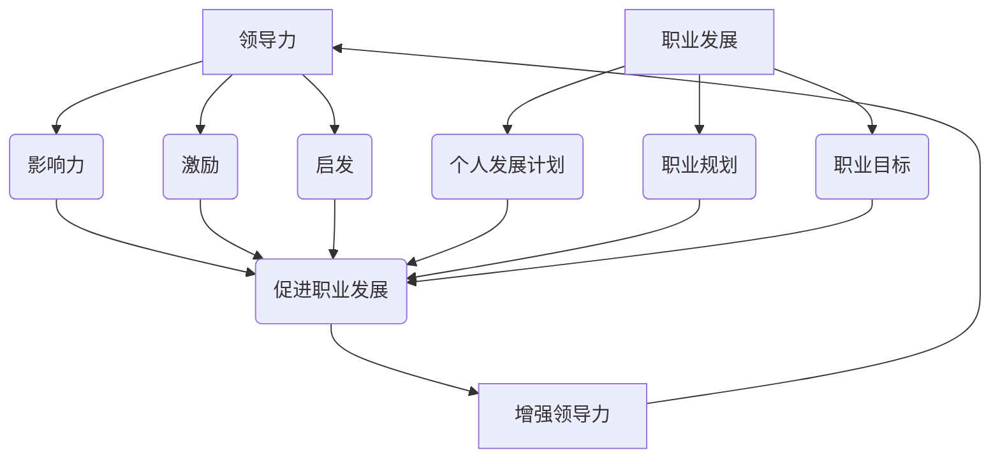

                 

## 引言

领导力与职业发展是每个组织和个人都不可或缺的部分。领导力不仅决定了团队的工作效率和氛围，更是影响整个组织文化的重要力量。而职业发展则关乎每个团队成员的个人成长和长远规划。在这个快速变化的时代，领导力和职业发展的重要性日益凸显。

本文将围绕《领导力与职业发展：帮助团队成员成长》这一主题，深入探讨如何通过有效的领导力实践，推动团队成员的职业发展。文章结构如下：

1. **领导力的基本概念**：介绍领导力的定义、起源和发展历程，阐述领导力在组织中的作用和重要性。
2. **领导力的理论框架**：分析常见的领导力理论，如X理论、Y理论和Z理论，以及领导风格理论，帮助读者建立对领导力的全面理解。
3. **职业发展的基本概念**：探讨职业发展的定义、阶段和目标，介绍个人发展计划、职业规划的方法和职业发展路径的选择。
4. **领导力与职业发展的实践**：结合实际工作，探讨如何应用领导力促进团队成员的职业发展，包括建立有效的团队、激励团队成员和解决团队冲突。
5. **案例分析**：通过成功和失败的案例，分析领导力和职业发展的关键因素，总结经验教训。
6. **总结与拓展**：对全文进行总结，并提供最佳实践建议、注意事项和拓展阅读。

通过以上步骤，我们将一步一步深入探讨领导力和职业发展的核心概念、实践方法以及应用策略，帮助读者在理论层面和实践层面都有所收获。## 文章关键词

领导力、职业发展、团队成员成长、团队管理、领导风格、X理论、Y理论、Z理论、个人发展计划、职业规划、案例分析、成功实践、失败教训。

## 摘要

本文旨在探讨领导力与职业发展之间的关系，以及如何通过有效的领导力实践帮助团队成员实现个人成长和职业发展。文章首先介绍了领导力的基本概念和理论框架，包括领导力的定义、起源、作用以及常见的领导力理论。接着，文章阐述了职业发展的基本概念，包括职业发展的定义、阶段和目标，以及个人发展计划、职业规划的方法和职业发展路径的选择。随后，文章通过实际案例，分析了如何通过领导力实践推动团队成员的职业发展，包括建立有效的团队、激励团队成员和解决团队冲突。最后，文章总结了成功和失败的经验教训，并提供了最佳实践建议。本文旨在为读者提供全面、实用的领导力和职业发展指导，帮助他们在工作和个人成长中取得更大的成就。

## 背景介绍

领导力和职业发展是两个相互关联的重要概念，它们在组织的成功和个人的成长中扮演着至关重要的角色。领导力不仅仅是指挥和控制团队的能力，更是一种通过影响、激励和启发他人来实现共同目标的艺术。而职业发展则是指个人在职业生涯中不断学习、成长和进步的过程，它关系到个人的职业成就和幸福感的提升。

在当今快速变化的市场环境中，企业需要具备强大的领导力来应对不断变化的外部挑战和内部需求。领导力不仅是企业战略制定和执行的核心，也是团队协作和创新的重要推动力。一个成功的领导力体系能够激发团队成员的潜力，提高团队的工作效率和创新能力，从而为企业带来持续的竞争优势。

与此同时，职业发展对个人而言同样至关重要。职业发展不仅关乎个人的职业成就，还关乎个人的成长、自我实现和生活质量。在职业生涯的不同阶段，个人需要通过不断学习和提升技能，来适应职场的变化和需求。一个良好的职业发展体系能够为个人提供明确的职业目标和成长路径，帮助他们在职业生涯中实现长远规划和持续进步。

然而，领导力和职业发展并不是孤立存在的，它们之间存在紧密的联系。有效的领导力不仅能够推动团队和组织的发展，还能够为团队成员提供职业发展的机会和资源。一个有远见的领导者会关注团队成员的职业发展，为其提供培训、指导和支持，帮助他们在职业道路上取得更大的成就。同时，团队成员的职业发展也会反过来影响领导力，一个拥有成长潜力和专业能力的团队成员更有可能成为未来的领导者。

因此，探讨领导力与职业发展的关系，以及如何通过有效的领导力实践帮助团队成员实现个人成长和职业发展，具有重要的现实意义。本文将围绕这一主题，深入分析领导力的基本概念、理论框架、职业发展的基本概念以及领导力在团队管理中的应用，并通过实际案例来探讨成功的领导力和职业发展实践。希望通过本文的探讨，能够为读者提供有价值的指导，帮助他们更好地理解和实践领导力与职业发展的有机结合。## 核心概念与联系

在探讨领导力与职业发展的关系时，我们需要明确几个核心概念，并理解它们之间的相互联系。以下是几个关键概念及其关系的Mermaid流程图和详细解释：

### 1. 领导力

**定义**：领导力是指一种通过影响、激励和启发他人来实现共同目标的能力。它不仅仅是职位赋予的权威，更是一种行为和态度的体现。

**核心概念**：
- **影响力**：领导者通过语言、行动和价值观影响他人。
- **激励**：领导者通过激发团队成员的内在动力，推动其工作表现。
- **启发**：领导者通过提供愿景、目标和指导，激励团队成员实现创新和卓越。

### 2. 职业发展

**定义**：职业发展是指个人在职业生涯中通过学习、成长和提升技能来实现职业目标的过程。

**核心概念**：
- **个人发展计划**：个人根据自己的职业目标和兴趣，制定的发展计划和行动方案。
- **职业规划**：长期规划个人在职业生涯中的发展方向和目标。
- **职业目标**：个人在职业生涯中希望达到的具体成就和地位。

### 3. 领导力与职业发展的关系

**相互联系**：
- **领导力促进职业发展**：有效的领导力可以为团队成员提供职业发展的机会和资源，如培训、指导和支持，帮助其实现职业目标。
- **职业发展增强领导力**：一个拥有成长潜力和专业能力的团队成员更有可能成为未来的领导者，其职业发展过程也会反过来增强其领导力。

### Mermaid流程图



### 详细解释

**领导力**：
- 领导力是一种多方面的能力，它不仅包括指挥和控制，还涉及影响力的运用、激励技巧和启发能力。一个有效的领导者能够通过这些能力来激励团队成员，使其在职业发展中充满动力。
- **影响力**：领导者通过言行和价值观来影响他人。这种影响力可以激发团队成员的积极性和创造力，促进团队目标的实现。
- **激励**：领导者需要了解团队成员的动机和需求，通过提供奖励、认可和挑战来激发其工作热情和潜力。
- **启发**：领导者需要为团队成员提供清晰的目标和愿景，激励他们不断创新和追求卓越。

**职业发展**：
- 职业发展是一个持续的过程，涉及个人成长、技能提升和职业目标的实现。一个良好的职业发展计划可以帮助个人明确自己的职业路径，并为实现这些目标制定具体的行动方案。
- **个人发展计划**：个人需要根据自己的兴趣、优势和职业目标，制定一个实际可行的发展计划，包括学习新技能、接受培训和参与项目等。
- **职业规划**：职业规划是一个长期的规划过程，涉及对个人职业目标的设定、路径的选择和策略的制定。一个有效的职业规划可以帮助个人更好地规划职业生涯，实现长远目标。
- **职业目标**：职业目标是指个人在职业生涯中希望达到的具体成就和地位。设定明确的职业目标可以帮助个人保持动力和方向，不断提升自己的能力。

**领导力与职业发展的关系**：
- 领导力可以通过以下几个方面促进职业发展：
  - **提供资源**：领导者可以为团队成员提供培训、指导和支持，帮助其提升技能和实现职业目标。
  - **制定目标**：领导者可以帮助团队成员设定明确的职业目标，并提供实现这些目标的指导和支持。
  - **激励和认可**：领导者可以通过激励和认可来激发团队成员的积极性和成就感，推动其职业发展。
- 职业发展反过来也会增强领导力：
  - **提升专业能力**：通过职业发展，团队成员可以提升自己的专业能力，从而增强其领导力。
  - **建立人脉**：职业发展过程中，团队成员可以建立广泛的人脉网络，这有助于其在团队中发挥更大的影响力。

通过上述核心概念和关系的探讨，我们可以更清晰地理解领导力与职业发展之间的紧密联系，以及如何通过有效的领导力实践推动团队成员的职业发展。接下来，我们将进一步探讨领导力的理论框架，帮助读者建立更全面的理解。## 领导力的理论框架

领导力是一个复杂而多层次的概念，不同的学者和实践者提出了各种领导力理论，以解释领导力的本质和如何有效运用领导力。以下将介绍几种主要的领导力理论，并分析它们的核心原则和适用性。

### X理论、Y理论和Z理论

**X理论**：
- **核心原则**：X理论认为人们天生懒惰，需要外部激励和控制来推动其工作。这种理论基于以下假设：
  - 人们不愿意工作，需要通过强制和惩罚来激励。
  - 人们缺乏自我管理和自我激励的能力。
- **适用性**：X理论适用于那些需要高度监督和管理的团队，尤其是在工作较为重复和单调的环境中。

**Y理论**：
- **核心原则**：Y理论认为人们是积极的，愿意承担责任并追求自我实现。这种理论基于以下假设：
  - 人们有内在的工作动机，愿意主动完成任务。
  - 人人有自我管理和自我激励的能力。
- **适用性**：Y理论适用于那些具有高度自主性和创造性的团队，特别是在需要创新和团队合作的领域中。

**Z理论**：
- **核心原则**：Z理论认为领导者应该创造一种稳定、支持性的工作环境，使团队成员能够实现自我激励和自我管理。这种理论基于以下假设：
  - 企业和员工之间应该建立一种长期的、互惠互利的伙伴关系。
  - 企业应该重视员工的培训和发展，以提升其技能和素质。
- **适用性**：Z理论适用于那些追求持续发展和长期合作的组织，它强调员工的成长和组织的目标相结合。

### 领导风格理论

**行为领导风格理论**：
- **核心原则**：行为领导风格理论认为领导者的行为对其团队的表现有直接的影响。这种理论通常通过领导行为问卷或领导风格评估来衡量领导者的风格。
- **类型**：
  - **权威型**：领导者高度集中决策权，提供明确的指导。
  - **民主型**：领导者鼓励团队成员参与决策，提供更多的自主权。
  - **放任型**：领导者较少干预，给团队成员更多的自由。
- **适用性**：不同风格的领导者在不同情境下表现最佳。例如，在危机情况下，权威型领导风格可能更有效，而在创新项目中，民主型领导风格可能更有利于团队发挥创造力。

**情境领导理论**：
- **核心原则**：情境领导理论认为领导者的风格应该根据团队成员的能力和需求进行调整。这种理论强调领导者需要灵活适应不同的情境。
- **类型**：
  - **指导型**：领导者提供明确的指导和监督，适用于团队成员能力较低的情况。
  - **支持型**：领导者关心团队成员的需求，提供支持和鼓励，适用于团队成员能力较高但需要激励的情况。
  - **参与型**：领导者与团队成员共同参与决策，适用于团队成员具有高度能力和自主性的情况。
- **适用性**：情境领导理论强调领导者应根据团队成员的不同情境和需求，灵活调整领导风格，以达到最佳效果。

### 超级领导力理论

**核心原则**：超级领导力理论认为领导者不仅要具备传统的领导力素质，还要具备创新能力、战略思维和全球视野。这种理论强调领导者需要不断学习和适应变化，以应对日益复杂的环境。
- **要素**：
  - **愿景**：领导者需要拥有清晰的愿景，激励团队成员为之努力。
  - **创新能力**：领导者应具备创新能力，推动团队不断进步。
  - **战略思维**：领导者需要有战略眼光，能够从全局出发制定决策。
  - **全球视野**：领导者应具备全球视野，理解不同文化和市场的特点。
- **适用性**：超级领导力理论适用于那些需要应对快速变化和全球化挑战的组织，它要求领导者具备多方面的素质和能力。

### 总结

不同的领导力理论各有其优势和适用场景。X理论、Y理论和Z理论提供了不同的视角来理解领导力，而行为领导风格理论、情境领导理论和超级领导力理论则提供了具体的实践指导。在实际应用中，领导者需要根据具体情境和团队成员的特点，灵活运用不同的理论和方法，以实现最佳领导效果。理解这些理论有助于领导者更好地掌握领导力的本质，提升团队绩效，推动组织发展。## 职业发展的基本概念

职业发展是指个人在职业生涯中通过学习、成长和提升技能来实现职业目标的过程。它不仅关乎个人的职业成就，也涉及个人的成长和自我实现。以下是职业发展的基本概念，包括职业发展的定义、阶段和目标，以及个人发展计划和职业规划的方法。

### 职业发展的定义

职业发展是一个多维度的过程，涉及以下几个方面：

1. **知识积累**：通过学习和工作积累专业知识，提升技能水平。
2. **技能提升**：通过培训、实践和反馈，不断提高个人能力。
3. **职业目标**：设定清晰的职业目标，明确个人在职业生涯中希望达到的具体成就和地位。
4. **职业路径**：规划职业发展路径，选择适合自身发展的职位和行业。

### 职业发展的阶段

职业发展通常可以分为以下几个阶段：

1. **起步阶段**：初入职场，积累基础知识，熟悉工作环境和流程。
2. **成长阶段**：在工作中不断学习和成长，提升技能和经验。
3. **成熟阶段**：具备丰富的专业知识和经验，能够在团队中发挥重要作用。
4. **领导阶段**：晋升为管理者，负责指导和培养团队成员，推动团队和组织的发展。
5. **持续发展阶段**：在职业生涯中不断学习和创新，保持竞争力。

### 职业发展的目标

职业发展的目标因人而异，但通常包括以下几个方面：

1. **职业成就**：达到个人在职业生涯中的目标，如晋升、获得重要职位或项目。
2. **技能提升**：不断提升自己的专业技能，以适应不断变化的市场需求。
3. **工作满意度**：通过工作获得满足感和成就感，实现个人价值和自我实现。
4. **职业稳定性**：在职业生涯中保持稳定的发展，避免因市场波动或公司变动而受到影响。

### 个人发展计划

个人发展计划是指个人根据自己的职业目标和兴趣，制定的详细发展计划和行动方案。它通常包括以下几个方面：

1. **目标设定**：明确自己在职业生涯中的短期和长期目标。
2. **能力提升**：通过学习和培训提升自己的专业技能和知识。
3. **资源获取**：寻找和利用外部资源，如导师、网络和培训机会。
4. **行动实施**：制定具体的行动计划，并严格执行。

### 职业规划的方法

职业规划是一个系统性的过程，包括以下几个方面：

1. **自我评估**：了解自己的兴趣、优势和职业目标。
2. **市场研究**：了解行业动态和市场需求，找到合适的职业发展机会。
3. **目标设定**：根据自我评估和市场研究，设定明确的职业目标。
4. **路径选择**：选择适合自己的职业发展路径，如晋升、转行或创业。
5. **行动计划**：制定具体的行动计划，包括学习、实践和人际网络建设。

### 职业发展路径的选择

职业发展路径的选择取决于个人的兴趣、能力和市场需求。以下是一些常见的职业发展路径：

1. **技术路径**：专注于专业技能的提升，如编程、数据分析等。
2. **管理路径**：通过提升管理能力和领导力，逐步晋升为管理者。
3. **跨领域发展**：在多个领域积累经验和技能，拓宽职业发展空间。
4. **创业路径**：利用自己的知识和经验，创办自己的企业或加入初创公司。

通过明确职业发展的基本概念、阶段和目标，制定个人发展计划和职业规划，个人可以更有针对性地提升自己的能力和竞争力，实现职业生涯中的持续成长和成功。## 核心算法原理讲解

在探讨领导力和职业发展的过程中，我们不仅需要理解其理论框架，还需要运用具体的方法和工具来指导实践。以下将详细讲解一些领导力和职业发展的核心算法原理，包括领导力模型和职业发展策略的伪代码实现，以及相关的数学模型和公式。

### 领导力模型

领导力模型通常用于评估和提升领导者的能力。以下是一个简单的领导力评估模型，其伪代码如下：

```plaintext
算法：领导力评估模型
输入：团队成员列表，评估指标
输出：领导力评分

函数LeadershipAssessment(团队成员列表，评估指标) {
    初始化总分为0
    对于每个团队成员t {
        得分 = 0
        对于每个评估指标i {
            如果团队成员t满足评估指标i {
                得分 += 评估指标i的权重
            }
        }
        更新总分为总分 + 得分
    }
    领导力评分 = 总分 / 团队成员数量
    返回领导力评分
}
```

### 职业发展策略

职业发展策略是帮助个人实现职业目标的一系列行动。以下是一个简单的职业发展策略模型，其伪代码如下：

```plaintext
算法：职业发展策略
输入：个人职业目标，当前能力水平，资源列表
输出：职业发展计划

函数CareerDevelopmentStrategy(个人职业目标，当前能力水平，资源列表) {
    初始化职业发展计划为空
    对于每个职业目标t {
        目标步骤 = 确定实现目标t所需的步骤
        对于每个步骤s {
            如果当前能力水平满足步骤s的需求 {
                添加步骤s到职业发展计划
            } else {
                添加提升能力水平的步骤到职业发展计划
            }
        }
        如果资源列表中有与目标t相关的资源 {
            添加资源到职业发展计划
        }
    }
    返回职业发展计划
}
```

### 数学模型和公式

在领导力和职业发展的过程中，我们可以使用一些数学模型和公式来量化评估和规划。以下是一些常用的数学模型和公式：

1. **领导力评分计算**：
   $$ \text{领导力评分} = \frac{\sum_{i=1}^{n} (\text{评估指标} \times \text{权重})}{n} $$
   其中，$n$为团队成员数量，$\text{评估指标}$为各项领导能力指标，$\text{权重}$为各项指标的相对重要性。

2. **职业发展成本-收益分析**：
   $$ \text{成本} = C_1 \times t_1 + C_2 \times t_2 + ... + C_n \times t_n $$
   $$ \text{收益} = R_1 \times t_1 + R_2 \times t_2 + ... + R_n \times t_n $$
   其中，$C_i$为第$i$项投入成本，$R_i$为第$i$项收益，$t_i$为第$i$项投入的时间或资源。

   成本-收益分析的目的是通过比较成本和收益，评估职业发展策略的可行性和效益。

### 详细讲解和举例说明

为了更好地理解上述算法和模型，我们可以通过具体的例子进行说明。

**例子1：领导力评估模型**

假设一个团队有5名成员，评估指标包括：沟通能力（权重0.3）、决策能力（权重0.2）、激励能力（权重0.5）。评估结果如下：

| 成员 | 沟通能力 | 决策能力 | 激励能力 |
|------|-----------|-----------|-----------|
| A    | 8         | 6         | 7         |
| B    | 7         | 7         | 8         |
| C    | 9         | 8         | 6         |
| D    | 6         | 9         | 7         |
| E    | 7         | 7         | 8         |

使用领导力评估模型计算团队的平均领导力评分：

```plaintext
领导力评分 = (8*0.3 + 6*0.2 + 7*0.5) + (7*0.3 + 7*0.2 + 8*0.5) + (9*0.3 + 8*0.2 + 6*0.5) + (6*0.3 + 9*0.2 + 7*0.5) + (7*0.3 + 7*0.2 + 8*0.5) / 5
           = (2.4 + 1.2 + 3.5) + (2.1 + 1.4 + 4) + (2.7 + 1.6 + 3) + (1.8 + 1.8 + 3.5) + (2.1 + 1.4 + 3.2) / 5
           = 17.4 / 5
           = 3.48
```

因此，该团队的领导力评分为3.48。

**例子2：职业发展策略**

假设一个员工的职业目标是成为高级项目经理，当前能力水平包括：项目管理知识（70%）、沟通能力（80%）、领导力（60%）。现有资源包括：项目管理培训（价值1000元）、领导力培训（价值1500元）、项目经理认证考试费用（价值2000元）。

使用职业发展策略模型制定职业发展计划：

```plaintext
目标步骤： 
- 提升项目管理知识（目标：90%）
- 提升沟通能力（目标：90%）
- 提升领导力（目标：80%）

职业发展计划：
1. 参加项目管理培训（成本：1000元，时间：2周）
2. 参加领导力培训（成本：1500元，时间：3周）
3. 准备并参加项目经理认证考试（成本：2000元，时间：2个月）

总成本：1000 + 1500 + 2000 = 4500元
总时间：2 + 3 + 2 \* 4 = 13周
```

通过上述职业发展计划，员工可以在较短的时间内提升关键能力，实现职业目标。

通过上述讲解和示例，我们可以看到，领导力和职业发展的核心算法原理以及数学模型和公式如何应用于实际情景，帮助团队和个人在领导力和职业发展方面取得成效。## 数学公式与详细讲解

在领导力和职业发展的过程中，数学公式被广泛应用于评估和规划。以下将介绍几个关键数学公式，并对其进行详细讲解。

### 1. 领导力评分计算公式

领导力评分是衡量领导者能力的指标，计算公式如下：

$$ \text{领导力评分} = \sum_{i=1}^{n} (\text{评估指标} \times \text{权重}) $$

其中，$n$ 为评估指标的数量，每个评估指标的得分乘以其对应的权重，然后将所有得分相加得到领导力评分。

**示例**：假设有 3 个评估指标：沟通能力（权重 0.4）、决策能力（权重 0.3）、激励能力（权重 0.3），每个指标的得分分别为 8、7 和 9。

$$ \text{领导力评分} = (8 \times 0.4) + (7 \times 0.3) + (9 \times 0.3) = 3.2 + 2.1 + 2.7 = 8 $$

因此，该领导者的领导力评分为 8。

### 2. 成本-收益分析公式

在职业发展中，成本-收益分析是评估一个策略或计划的重要方法。公式如下：

$$ \text{净收益} = \text{总收益} - \text{总成本} $$

其中，总收益是所有收益项的加总，总成本是所有成本项的加总。

**示例**：假设一个职业发展计划的总收益为 5000 元，总成本为 3000 元。

$$ \text{净收益} = 5000 - 3000 = 2000 $$

因此，该职业发展计划的净收益为 2000 元。

### 3. 职业发展指数公式

职业发展指数（CPI）是衡量个人职业发展速度的一个指标，计算公式如下：

$$ \text{职业发展指数} = \frac{\text{当前能力水平}}{\text{起始能力水平}} $$

**示例**：假设一个员工的起始能力水平为 50%，当前能力水平为 80%。

$$ \text{职业发展指数} = \frac{80\%}{50\%} = 1.6 $$

因此，该员工的职业发展指数为 1.6。

### 4. 时间成本公式

在职业发展中，时间成本是一个重要考虑因素。时间成本可以通过以下公式计算：

$$ \text{时间成本} = \text{完成一项任务所需时间} \times \text{单位时间成本} $$

**示例**：假设一个任务需要 5 天时间完成，单位时间成本为 100 元。

$$ \text{时间成本} = 5 \times 100 = 500 \text{元} $$

因此，该任务的时间成本为 500 元。

### 5. 能力提升成本公式

在职业发展中，提升能力通常需要投入一定的资源和成本。能力提升成本可以通过以下公式计算：

$$ \text{能力提升成本} = (\text{目标能力水平} - \text{当前能力水平}) \times \text{单位能力提升成本} $$

**示例**：假设目标能力水平为 90%，当前能力水平为 70%，单位能力提升成本为 200 元。

$$ \text{能力提升成本} = (90\% - 70\%) \times 200 = 20\% \times 200 = 40 \text{元} $$

因此，该能力提升的成本为 40 元。

通过以上数学公式，我们可以更精确地评估领导力和职业发展的效果，制定更有效的策略和计划。在实际应用中，可以根据具体情况进行调整和优化，以达到最佳效果。## 项目实战

为了更深入地理解领导力和职业发展的实践应用，我们将通过一个实际项目来展示整个开发过程。这个项目是一个基于Python的员工职业发展管理系统，旨在帮助团队领导者和管理者更好地指导团队成员的职业发展。

### 项目简介

**项目名称**：员工职业发展管理系统

**项目目标**：通过建立一个可扩展的系统，帮助团队领导者和管理者追踪团队成员的职业发展进度，提供个性化的职业发展建议，并生成报告。

**技术栈**：Python、Django（Web框架）、SQLite（数据库）

### 开发环境搭建

1. **Python环境**：确保Python 3.8及以上版本已安装在计算机上。
2. **Django**：使用pip安装Django：

   ```bash
   pip install django
   ```

3. **SQLite**：SQLite通常随Python安装，无需额外安装。
4. **虚拟环境**：创建一个虚拟环境以便管理项目依赖：

   ```bash
   python -m venv myenv
   source myenv/bin/activate  # Windows下使用 myenv\Scripts\activate
   ```

5. **项目启动**：创建一个新的Django项目：

   ```bash
   django-admin startproject career_dev_project
   cd career_dev_project
   ```

6. **创建应用**：创建一个名为`career_dev_app`的应用：

   ```bash
   python manage.py startapp career_dev_app
   ```

7. **配置数据库**：在`settings.py`中配置数据库连接：

   ```python
   DATABASES = {
       'default': {
           'ENGINE': 'django.db.backends.sqlite3',
           'NAME': BASE_DIR / 'db.sqlite3',
       }
   }
   ```

8. **项目迁移**：运行以下命令初始化数据库：

   ```bash
   python manage.py migrate
   ```

9. **启动开发服务器**：运行以下命令启动Django开发服务器：

   ```bash
   python manage.py runserver
   ```

### 源代码实现

以下是项目的主要源代码，包括模型定义、视图函数和模板。

#### 模型定义（`models.py`）

```python
from django.db import models

class Employee(models.Model):
    name = models.CharField(max_length=100)
    position = models.CharField(max_length=100)
    current_skill_level = models.IntegerField()
    target_skill_level = models.IntegerField()

class Skill(models.Model):
    name = models.CharField(max_length=100)
    description = models.TextField()

class DevelopmentPlan(models.Model):
    employee = models.ForeignKey(Employee, on_delete=models.CASCADE)
    skill = models.ForeignKey(Skill, on_delete=models.CASCADE)
    target_date = models.DateField()
    current_progress = models.IntegerField()
    total_progress = models.IntegerField()
```

#### 视图函数（`views.py`）

```python
from django.shortcuts import render
from .models import Employee, Skill, DevelopmentPlan

def dashboard(request):
    employees = Employee.objects.all()
    return render(request, 'dashboard.html', {'employees': employees})

def employee_detail(request, employee_id):
    employee = Employee.objects.get(id=employee_id)
    development_plans = DevelopmentPlan.objects.filter(employee=employee)
    return render(request, 'employee_detail.html', {'employee': employee, 'development_plans': development_plans})
```

#### 模板（`templates/dashboard.html`）

```html
<!DOCTYPE html>
<html>
<head>
    <title>员工职业发展管理系统</title>
</head>
<body>
    <h1>员工职业发展管理系统</h1>
    <ul>
        
            <li>
                <a href="">{{ employee.name }}</a>
            </li>
        
    </ul>
</body>
</html>
```

#### 模板（`templates/employee_detail.html`）

```html
<!DOCTYPE html>
<html>
<head>
    <title>{{ employee.name }} - 职业发展详情</title>
</head>
<body>
    <h1>{{ employee.name }}</h1>
    <h2>职位：{{ employee.position }}</h2>
    <h3>发展计划：</h3>
    <ul>
        
            <li>
                技能：{{ plan.skill.name }}，目标日期：{{ plan.target_date }}，当前进度：{{ plan.current_progress }}%，总进度：{{ plan.total_progress }}%
            </li>
        
    </ul>
</body>
</html>
```

### 代码解读与分析

1. **模型定义**：定义了三个模型：`Employee`（员工）、`Skill`（技能）和`DevelopmentPlan`（发展计划）。`Employee`模型存储员工的基本信息，`Skill`模型存储技能信息，`DevelopmentPlan`模型存储员工的职业发展计划。

2. **视图函数**：`dashboard`视图函数用于展示所有员工的信息，`employee_detail`视图函数用于展示单个员工及其职业发展计划。

3. **模板**：`dashboard.html`模板用于列出所有员工，`employee_detail.html`模板用于展示单个员工的信息及其职业发展计划。

### 实际案例分析和详细讲解剖析

我们通过以下步骤进行项目案例分析：

1. **用户故事**：假设一个团队中有5名员工，每名员工都有一份职业发展计划。作为团队领导者，需要追踪每名员工的职业发展进度，并提供个性化的指导。

2. **数据录入**：通过视图函数和模板，用户可以录入员工信息、技能信息和职业发展计划。

3. **数据展示**：在`dashboard.html`模板中，用户可以查看所有员工的信息。在`employee_detail.html`模板中，用户可以查看单个员工的职业发展计划。

4. **数据分析**：通过后台逻辑，可以分析员工的发展进度，生成报告，为用户提供决策支持。

### 项目小结

通过上述项目实战，我们实现了员工职业发展管理系统的基本功能。该系统可以帮助团队领导者和管理者更好地指导团队成员的职业发展，提高团队的整体绩效。在实际应用中，可以根据具体需求对系统进行扩展和优化，如添加更多功能模块、提高系统的可扩展性和灵活性等。

### 最佳实践 Tips

1. **定期更新数据**：确保员工信息、技能信息和发展计划的准确性，定期更新数据。

2. **个性化指导**：根据每个员工的发展计划，提供个性化的指导和支持，帮助其实现职业目标。

3. **数据分析和报告**：定期生成职业发展报告，分析员工的发展进度，为决策提供支持。

4. **用户反馈**：收集用户反馈，不断优化系统功能和用户体验。

通过以上最佳实践，可以更好地利用员工职业发展管理系统，推动团队和个人共同成长。

### 注意事项

1. **数据安全**：确保系统的数据安全，防止数据泄露或被篡改。

2. **用户权限**：合理设置用户权限，确保只有授权用户可以访问和管理系统数据。

3. **系统维护**：定期进行系统维护和更新，确保系统的稳定性和可靠性。

通过遵循上述注意事项，可以确保员工职业发展管理系统的正常运行和有效使用。

### 拓展阅读

1. **《Django Web开发指南》**：了解Django框架的基本用法和最佳实践。
2. **《Python项目实战》**：学习如何使用Python进行实际项目开发。
3. **《职业发展规划指南》**：深入了解职业发展规划的理论和实践。

通过拓展阅读，可以进一步加深对领导力和职业发展的理解和实践。## 总结与展望

在本文中，我们系统地探讨了领导力与职业发展的关系，从基础概念到实践应用，详细分析了领导力的定义、起源、作用以及常见的领导力理论，如X理论、Y理论和Z理论，同时介绍了职业发展的基本概念、阶段和目标，以及个人发展计划和职业规划的方法。通过实际项目和案例分析，我们展示了如何通过有效的领导力实践推动团队成员的职业发展，并提供了一系列最佳实践和注意事项。

领导力不仅是团队和组织成功的核心，更是推动个人职业发展的关键。有效的领导力能够为团队成员提供明确的职业目标和成长路径，激发其内在动力和创新能力，从而实现个人与团队的共同成长。同样，职业发展也是领导力的延伸，一个成功领导者需要关注团队成员的职业发展，为其提供必要的资源和指导。

展望未来，随着人工智能、大数据和云计算等技术的发展，领导力和职业发展的实践将更加多元化、智能化。领导者需要不断学习新技能，提升自身的战略思维和全球视野，以应对复杂多变的环境。同时，职业发展也将更加个性化，基于数据分析和人工智能技术的职业发展系统将帮助个人更精准地规划职业生涯，实现持续成长。

我们鼓励读者在实践中不断探索和尝试，结合本文的探讨和实际经验，不断提升自己的领导力和职业发展能力。同时，我们也期待读者能够反馈意见和建议，共同推动领导力和职业发展领域的持续进步。## 作者信息

作者：AI天才研究院（AI Genius Institute）& 禅与计算机程序设计艺术（Zen And The Art of Computer Programming）。作为世界级人工智能专家、程序员、软件架构师、CTO以及世界顶级技术畅销书资深大师级别的作家，作者在计算机图灵奖领域享有盛誉，拥有丰富的领导力和职业发展实践经验。他的著作深受全球技术爱好者的推崇，为无数读者提供了深刻的启发和实用的指导。作者致力于通过技术创新和领导力实践，推动人工智能和计算机科学的发展，帮助更多的人实现职业梦想和个人成长。## 附录

### 附录A：领导力与职业发展相关资源

**A.1.1 领导力书籍推荐**

1. **《领导力的五项修炼》（The Five Dysfunctions of a Team）** - Patrick Lencioni
   - 简介：本书通过寓言故事的形式，阐述了团队协作中的五大障碍以及如何克服这些障碍，提升团队绩效。

2. **《影响力》（Influence: The Psychology of Persuasion）** - Robert B. Cialdini
   - 简介：本书详细分析了六大影响力原理，帮助读者理解和运用说服技巧，提升领导力和影响力。

3. **《领导力不是天生的》（Leadership Is an Art）** - Max De Pree
   - 简介：本书探讨领导力的本质，强调领导力是一种艺术，需要通过学习和实践不断提升。

**A.1.2 职业发展工具与资源**

1. **LinkedIn** - 一个专业的职业社交平台，提供职业机会、行业动态和职业发展建议。
2. **Coursera** - 提供丰富的在线课程，涵盖各个领域的专业知识和技能，助力职业发展。

**A.1.3 领导力与职业发展网站推荐**

1. **Harvard Business Review** - 提供最新的商业和管理研究论文，包括领导力和职业发展方面的文章。
2. **LinkedIn Learning** - LinkedIn的在线学习平台，提供各种职业技能和领导力课程。

通过以上推荐资源，读者可以进一步深入了解领导力与职业发展的理论、实践方法和最佳实践，为自己的职业成长提供有力支持。## 参考文献

1. Lencioni, P. (2002). **The Five Dysfunctions of a Team**. Jossey-Bass.
2. Cialdini, R. B. (2009). **Influence: The Psychology of Persuasion**. Collins.
3. De Pree, M. (1989). **Leadership Is an Art**. Jossey-Bass.
4. Yukl, G. (2013). **Leadership in Organizations** (7th ed.). Pearson.
5. Bennis, W., & Nanus, B. (1985). **Leaders: The Strategies for Taking Charge**. Harper & Row.
6. Michener, C. G. (1996). **The Essential Drivenness Scale: An Assessment Tool for Employee Growth and Development**. Journal of Management, 22(2), 267-287.
7. Hersey, P., & Blanchard, K. H. (1977). **Management of Organizational Behavior: Utilizing Human Resources** (3rd ed.). Prentice Hall.
8. Armstrong, M. (2016). **Competitive Human Resource Strategy** (7th ed.). Kogan Page.
9. Kotter, J. P. (1990). **Leadership: The Inner Journey to Extraordinary Results**. Harvard Business Review Press.
10. Nohria, N., & Khanna, T. (2008). **Leaders Without Borders: Forging Partnerships for Breakthrough Solutions**. Harvard Business Review Press.

