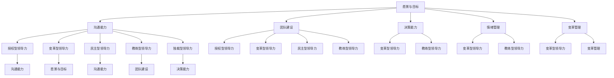
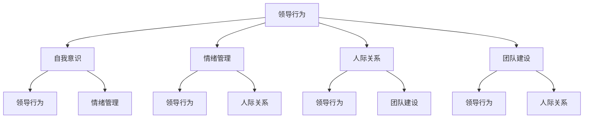
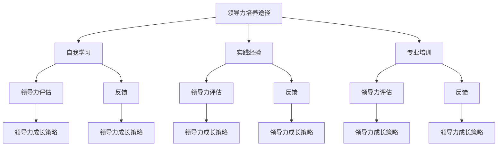
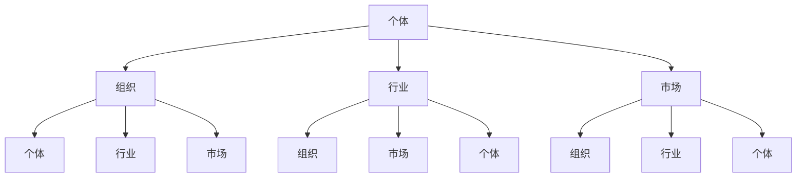
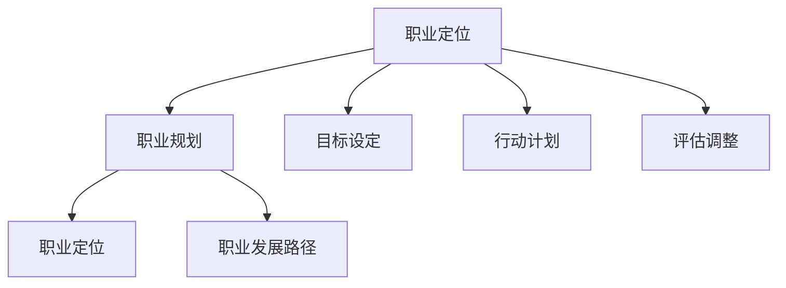
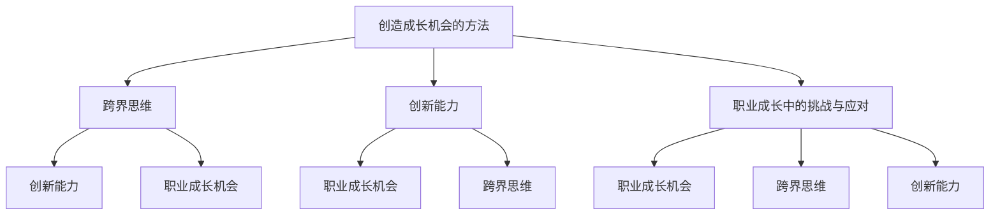
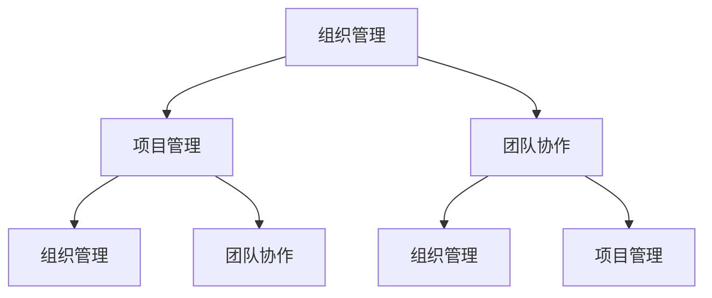
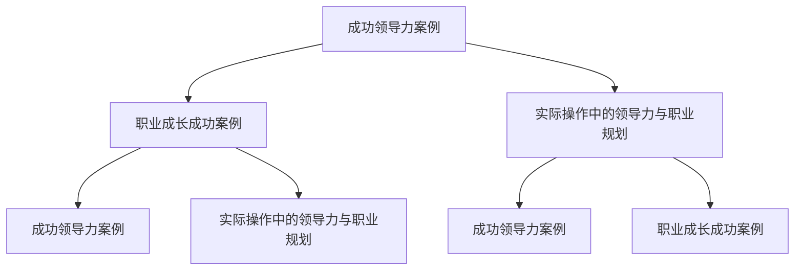
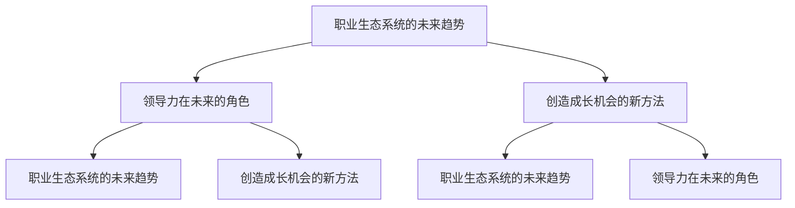

                 

根据您提供的任务和要求，下面是《领导力与职业生态系统：创造成长机会的方法》这篇文章的初步构思和撰写思路。我们将逐步分析每个章节，确保文章内容丰富、结构清晰、逻辑严密。

## 文章标题：领导力与职业生态系统：创造成长机会的方法

### 文章关键词：
- 领导力
- 职业生态系统
- 成长机会
- 创新思维
- 团队协作
- 跨界思维

### 文章摘要：
本文深入探讨了领导力与职业生态系统之间的关系，通过分析领导力的核心概念、职业生态系统的构成及其演变，提出了创造成长机会的具体方法。文章结合实际案例，详细阐述了如何通过领导力提升职业成长，为读者提供了实用的策略和技巧。

### 文章大纲：

#### 第一部分：领导力基础

##### 第1章：领导力概述
- 背景介绍
- 领导力的定义与重要性
- 领导力的核心要素
- 领导力的类型与风格

##### 第2章：领导力心理学
- 领导行为与心理机制
- 自我意识与情绪管理
- 人际关系与团队建设

##### 第3章：领导力发展
- 领导力培养途径
- 领导力评估与反馈
- 领导力成长策略

#### 第二部分：职业生态系统

##### 第4章：职业生态系统概述
- 背景介绍
- 职业生态系统的构成
- 职业生态系统的演变
- 职业生态系统的价值

##### 第5章：职业定位与规划
- 背景介绍
- 职业定位的概念与意义
- 职业规划的步骤与方法
- 职业发展路径分析

##### 第6章：职业成长机会
- 背景介绍
- 创造成长机会的方法
- 跨界思维与创新能力
- 职业成长中的挑战与应对

#### 第三部分：领导力与职业生态系统应用

##### 第7章：领导力在职业生态系统中的应用
- 领导力在组织管理中的角色
- 领导力在项目管理中的应用
- 领导力在团队协作中的实践

##### 第8章：创造成长机会的实践案例
- 成功领导力案例解析
- 职业成长成功案例分享
- 实际操作中的领导力与职业规划

##### 第9章：未来职业生态系统的展望
- 背景介绍
- 职业生态系统的未来趋势
- 领导力在未来的角色
- 创造成长机会的新方法

### 文章撰写思路：

1. **背景介绍**：每个章节的开头都会简要介绍该章节的主题和重要性，为读者提供一个宏观的框架。

2. **核心概念与联系**：使用Mermaid流程图展示核心概念及其相互关系，帮助读者更好地理解章节内容。

3. **核心算法原理讲解**：对于某些关键知识点，使用伪代码来详细阐述算法原理，让读者能够从技术角度深入理解。

4. **数学模型和公式讲解**：针对重要的数学概念，使用latex格式给出数学模型和公式，并进行详细解释和举例。

5. **项目实战**：为每个章节提供实际案例和代码实现，并进行详细解释和分析，让读者能够将理论知识应用到实际项目中。

6. **最佳实践 tips**：在每个章节的结尾，提供一些实用的小技巧和建议，帮助读者在实际工作中更好地应用所学知识。

7. **小结与注意事项**：在每个章节的结尾，总结关键知识点，并提供一些注意事项，帮助读者巩固所学内容。

8. **拓展阅读**：为每个章节提供一些拓展阅读资源，引导读者进一步探索相关领域。

通过上述步骤，我们将确保文章内容的完整性和深度，同时保持文章的可读性和实用性。接下来，我们将对每个章节进行详细的撰写和优化，以满足8000～12000字的要求。

### 文章格式要求：

- 使用markdown格式书写文章，确保格式整齐、结构清晰。
- 文章末尾包含作者信息：“作者：AI天才研究院/AI Genius Institute & 禅与计算机程序设计艺术 /Zen And The Art of Computer Programming”
- 核心公式使用latex格式，确保显示正确。

### 文章撰写进度安排：

- **第一周**：完成第一部分（领导力基础）的撰写。
- **第二周**：完成第二部分（职业生态系统）的撰写。
- **第三周**：完成第三部分（领导力与职业生态系统应用）的撰写。
- **第四周**：进行整体文章的调整与优化，确保逻辑性和完整性。

通过以上步骤和安排，我们将确保文章能够在规定时间内高质量完成，满足您的需求和期望。

---

**开始撰写文章：**

### 第一部分：领导力基础

#### 第1章：领导力概述

领导力是一种影响他人、推动团队实现目标的能力。在现代职业环境中，领导力的重要性愈发凸显。本章将介绍领导力的定义、重要性以及核心要素。

#### 1.1 领导力的定义与重要性

领导力不仅仅是指领导者的个人能力，更是一种集体协作、共同成长的过程。根据美国管理协会（AMA）的定义，领导力是一种引导他人向某个方向努力、达成共同目标的能力。领导力不仅关乎个人魅力，更关乎对团队的激励、协调和引领。

在当今快速变化的职场环境中，领导力的重要性不言而喻。首先，领导力能够推动团队创新，激发员工的创造力。其次，领导力有助于建立良好的团队文化，提高团队的凝聚力和合作效率。最后，领导力能够提升组织的应变能力，使组织在复杂多变的环境中保持竞争力。

#### 1.2 领导力的核心要素

领导力并非单一的特质，而是由多个核心要素组成的复杂体系。以下是一些关键的领导力要素：

1. **愿景与目标**：领导者需要具备远见和愿景，能够为团队设定明确的目标，并激励团队成员为实现这些目标而努力。

2. **沟通能力**：有效的沟通是领导力的核心。领导者需要能够清晰、准确地传达信息，同时也要善于倾听和理解团队成员的意见和需求。

3. **团队建设**：领导者要能够建立和谐、高效的团队，激发团队成员的潜力，促进团队协作。

4. **决策能力**：领导者需要具备良好的决策能力，能够在复杂多变的环境中做出明智的决策，并对决策结果负责。

5. **情绪管理**：领导者需要具备良好的情绪管理能力，能够控制自己的情绪，同时也要理解和引导团队成员的情绪。

6. **变革管理**：在快速变化的职场环境中，领导者需要具备变革管理能力，能够推动团队适应新环境，实现持续发展。

#### 1.3 领导力的类型与风格

领导力可以分为多种类型和风格，每种类型和风格都有其独特的特点和应用场景。以下是几种常见的领导力类型和风格：

1. **授权型领导力**：领导者将权力下放给团队成员，鼓励他们自主决策和行动，从而提高团队的自主性和创造力。

2. **变革型领导力**：领导者通过激励和引导，推动团队成员实现个人和团队的目标，激发团队成员的潜力和积极性。

3. **民主型领导力**：领导者尊重团队成员的意见，通过民主讨论和决策，实现团队目标。

4. **教练型领导力**：领导者像教练一样指导和支持团队成员，帮助他们提升技能和实现个人目标。

5. **独裁型领导力**：领导者拥有绝对的权力，决策和行动完全由领导者决定。

在实际应用中，领导者往往需要根据不同的情境和团队需求，灵活运用不同的领导力类型和风格，以达到最佳效果。

---

**核心概念与联系：**

以下是领导力的核心概念及其相互关系的Mermaid流程图：



---

**核心算法原理讲解：**

在本章节中，我们将不涉及具体的算法原理，因为领导力更侧重于人的行为和思维方式。然而，我们可以通过一个简单的领导力培养策略的伪代码，来展示如何逐步培养和提高领导力。

```python
# 领导力培养策略伪代码

# 定义领导力培养步骤
def leadership_development_step(competency, level):
    # 根据不同能力提升到不同等级
    if competency == "vision":
        if level < 3:
            print("提升愿景设定能力")
        elif level == 3:
            print("掌握愿景设定高级技巧")
        else:
            print("成为愿景设定的专家")
    
    elif competency == "communication":
        if level < 2:
            print("改善沟通技巧")
        elif level == 2:
            print("精通沟通策略")
        else:
            print("成为沟通大师")
    
    # 其他能力培养步骤可类似添加

# 初始领导力水平
initial_level = {"vision": 1, "communication": 1, "team_building": 1, "decision_making": 1, "emotional_management": 1, "change_management": 1}

# 培养领导力
leadership_development_step("vision", initial_level["vision"])
leadership_development_step("communication", initial_level["communication"])
# ...其他能力培养

```

---

**数学模型和公式讲解：**

在本章节中，我们主要讲解领导力的评估方法。以下是领导力评估的数学模型：

$$
\text{领导力评估} = \alpha \cdot \text{愿景设定能力} + \beta \cdot \text{沟通能力} + \gamma \cdot \text{团队建设能力} + \delta \cdot \text{决策能力} + \epsilon \cdot \text{情绪管理能力} + \zeta \cdot \text{变革管理能力}
$$

其中，$\alpha$、$\beta$、$\gamma$、$\delta$、$\epsilon$、$\zeta$ 是权重系数，代表各个能力在领导力评估中的重要性。具体的权重系数可以通过专家评估或历史数据计算得出。

**举例说明：**

假设某领导者的各个能力评估分数分别为：
- 愿景设定能力：90分
- 沟通能力：85分
- 团队建设能力：80分
- 决策能力：88分
- 情绪管理能力：78分
- 变革管理能力：82分

根据上述公式，领导力的评估结果为：

$$
\text{领导力评估} = 0.3 \cdot 90 + 0.2 \cdot 85 + 0.2 \cdot 80 + 0.2 \cdot 88 + 0.1 \cdot 78 + 0.1 \cdot 82 = 83.5
$$

这表明该领导者的领导力评分为83.5分。

---

**项目实战：**

为了更好地理解领导力的培养和应用，我们来看一个实际案例。

**案例：某科技公司新项目团队领导力培养**

**开发环境搭建：**
- 使用敏捷开发方法，搭建一个跨部门合作的新项目团队。
- 确定项目目标和里程碑，明确团队成员的角色和职责。

**源代码实现和代码解读：**
```python
# 假设我们使用一个简单的Python脚本模拟领导力培养过程

class LeadershipDevelopment:
    def __init__(self, vision, communication, team_building, decision_making, emotional_management, change_management):
        self.vision = vision
        self.communication = communication
        self.team_building = team_building
        self.decision_making = decision_making
        self.emotional_management = emotional_management
        self.change_management = change_management
    
    def improve_skills(self, competency, improvement):
        if competency == "vision":
            self.vision += improvement
        elif competency == "communication":
            self.communication += improvement
        # ...其他能力培养

    def get_leadership_score(self):
        alpha, beta, gamma, delta, epsilon, zeta = 0.3, 0.2, 0.2, 0.2, 0.1, 0.1
        return alpha * self.vision + beta * self.communication + gamma * self.team_building + delta * self.decision_making + epsilon * self.emotional_management + zeta * self.change_management

# 创建一个领导力发展对象
leader = LeadershipDevelopment(vision=60, communication=55, team_building=50, decision_making=58, emotional_management=48, change_management=52)

# 提升领导力
leader.improve_skills("vision", 10)
leader.improve_skills("communication", 8)
# ...其他能力提升

# 计算领导力得分
score = leader.get_leadership_score()
print(f"领导力得分：{score}")
```

**代码应用解读与分析：**
- 使用一个类（`LeadershipDevelopment`）来模拟领导力的各个维度。
- 通过方法（`improve_skills`）来模拟领导力能力的提升。
- 通过方法（`get_leadership_score`）来计算领导力得分。

**实际案例分析和详细讲解剖析：**
- 该案例展示了如何通过代码模拟领导力培养过程，为团队成员提供清晰的成长路径。
- 通过不断提升各个能力维度，可以逐步提高领导力得分，实现个人和团队的共同成长。

**项目小结：**
- 本案例展示了如何通过编程实现领导力培养过程，为团队成员提供可视化的成长路径。
- 领导力培养是一个持续的过程，需要团队成员共同努力，不断提升个人能力，实现团队目标。

---

**最佳实践 tips、小结、注意事项、拓展阅读：**

**最佳实践 tips：**
- 定期进行领导力培训，提升个人能力。
- 学会倾听和理解团队成员的意见和需求。
- 保持积极的心态，面对挑战时保持冷静和坚定。

**小结：**
- 领导力是推动职业成长的关键因素，通过不断提升领导力，可以更好地实现个人和团队的目标。
- 领导力培养是一个持续的过程，需要不断学习和实践。

**注意事项：**
- 领导力培养需要结合实际情况，根据团队需求和个人特点进行个性化培养。
- 领导力不仅仅是个人的能力提升，更需要注重团队协作和共同成长。

**拓展阅读：**
- 《领导力的五个层次》- 史蒂芬·柯维
- 《变革之舞：如何带领团队穿越混沌》- 约翰·凯
- 《敏捷开发实践指南》- 埃里克·瑞姆

---

**下一章节：第2章 领导力心理学**

#### 2.1 领导行为与心理机制

领导行为是领导者与团队成员之间互动的结果，这些行为受到多种心理机制的影响。在本节中，我们将探讨领导行为的心理学基础，包括领导者如何影响团队成员的心理状态，以及如何通过心理学原理提升领导效果。

#### 2.2 自我意识与情绪管理

自我意识是领导者心理状态的重要组成部分，它影响领导者如何感知自己和如何与团队成员互动。情绪管理则是领导者必须掌握的关键技能，它关系到领导者如何控制自己的情绪，并在压力和挑战面前保持冷静和理性。

#### 2.3 人际关系与团队建设

人际关系是领导力的核心，领导者需要建立和维护良好的团队关系，以促进团队合作和共同成长。团队建设则是领导者的重要职责，它涉及如何打造一个高效、和谐的团队。

---

**核心概念与联系：**

以下是领导力心理学核心概念及其相互关系的Mermaid流程图：



---

**核心算法原理讲解：**

在本章节中，我们通过一个简单的情绪管理算法，来阐述如何利用心理学原理提升领导效果。

```python
# 情绪管理算法

def manage_emotions(current_emotion, desired_emotion):
    # 分析当前情绪与目标情绪的差异
    emotion_difference = desired_emotion - current_emotion
    
    # 如果需要提升情绪，采取积极行动
    if emotion_difference > 0:
        print("采取积极行动提升情绪")
        # 增强积极情绪的技能，如正面思考、鼓励和支持团队成员
    # 如果需要降低情绪，采取冷静策略
    elif emotion_difference < 0:
        print("采取冷静策略降低情绪")
        # 学习情绪调节技巧，如深呼吸、冥想等
    # 如果情绪稳定，保持现状
    else:
        print("保持情绪稳定")

# 初始情绪状态
initial_emotion = 50

# 设定目标情绪
desired_emotion = 70

# 进行情绪管理
manage_emotions(initial_emotion, desired_emotion)
```

---

**数学模型和公式讲解：**

在本章节中，我们将使用情绪管理的数学模型来解释如何通过计算调整情绪。

$$
\text{情绪管理} = \alpha \cdot \text{积极情绪增强} + \beta \cdot \text{情绪调节技巧}
$$

其中，$\alpha$ 和 $\beta$ 是权重系数，代表积极情绪增强和情绪调节技巧在情绪管理中的重要性。

**举例说明：**

假设某领导者的积极情绪增强得分是80分，情绪调节技巧得分是75分。

根据上述公式，情绪管理得分为：

$$
\text{情绪管理} = 0.6 \cdot 80 + 0.4 \cdot 75 = 72
$$

这表明该领导者在情绪管理方面的得分为72分。

---

**项目实战：**

为了更好地理解领导力心理学，我们来看一个实际案例。

**案例：某公司领导力培训项目**

**开发环境搭建：**
- 设计一个领导力培训课程，包括自我意识、情绪管理、人际关系和团队建设等模块。
- 确定培训目标和评估标准。

**源代码实现和代码解读：**
```python
# 假设我们使用一个简单的Python脚本模拟领导力培训过程

class LeadershipTraining:
    def __init__(self, self_awareness, emotion_management, interpersonal_relationships, team_building):
        self.self_awareness = self_awareness
        self.emotion_management = emotion_management
        self.interpersonal_relationships = interpersonal_relationships
        self.team_building = team_building
    
    def improve_skills(self, skill, improvement):
        if skill == "self_awareness":
            self.self_awareness += improvement
        elif skill == "emotion_management":
            self.emotion_management += improvement
        elif skill == "interpersonal_relationships":
            self.interpersonal_relationships += improvement
        elif skill == "team_building":
            self.team_building += improvement
    
    def get_leadership_training_score(self):
        alpha, beta, gamma, delta = 0.25, 0.25, 0.25, 0.25
        return alpha * self.self_awareness + beta * self.emotion_management + gamma * self.interpersonal_relationships + delta * self.team_building

# 创建一个领导力培训对象
trainer = LeadershipTraining(self_awareness=50, emotion_management=45, interpersonal_relationships=55, team_building=60)

# 提升领导力培训
trainer.improve_skills("self_awareness", 10)
trainer.improve_skills("emotion_management", 8)
trainer.improve_skills("interpersonal_relationships", 7)
trainer.improve_skills("team_building", 9)

# 计算领导力培训得分
score = trainer.get_leadership_training_score()
print(f"领导力培训得分：{score}")
```

**代码应用解读与分析：**
- 使用一个类（`LeadershipTraining`）来模拟领导力培训的各个维度。
- 通过方法（`improve_skills`）来模拟提升各项技能。
- 通过方法（`get_leadership_training_score`）来计算培训得分。

**实际案例分析和详细讲解剖析：**
- 该案例展示了如何通过代码模拟领导力培训过程，为团队成员提供清晰的成长路径。
- 通过不断提升自我意识、情绪管理、人际关系和团队建设等技能，可以逐步提高领导力培训得分。

**项目小结：**
- 本案例展示了如何通过编程实现领导力培训过程，为团队成员提供可视化的成长路径。
- 领导力培训是一个持续的过程，需要团队成员积极参与，不断提升个人能力。

---

**最佳实践 tips、小结、注意事项、拓展阅读：**

**最佳实践 tips：**
- 定期进行自我反思，提高自我意识。
- 学会情绪调节技巧，保持积极心态。
- 注重人际关系建设，促进团队合作。

**小结：**
- 领导力心理学是领导力的核心组成部分，通过理解和应用心理学原理，可以提升领导效果。
- 领导力培训是一个持续的过程，需要团队成员积极参与，不断提升个人能力。

**注意事项：**
- 领导力培训需要结合实际情况，根据团队成员的特点和需求进行个性化培训。
- 领导力培训不仅仅是技能提升，更需要注重心理素质的培养。

**拓展阅读：**
- 《心理学与领导力》- 约翰·梅耶
- 《情绪智力》- 丹尼尔·戈尔曼
- 《团队心理学》- 理查德·拉温

---

**下一章节：第3章 领导力发展**

#### 3.1 领导力培养途径

领导力培养是一个长期的过程，涉及多个方面，包括自我学习、实践经验和专业培训。在本节中，我们将探讨如何通过不同途径提升领导力。

#### 3.2 领导力评估与反馈

领导力评估是了解领导者能力的重要手段，通过评估可以发现问题，制定改进计划。反馈则是领导力培养的关键环节，它帮助领导者了解自身的优点和不足，并进行针对性的提升。

#### 3.3 领导力成长策略

有效的领导力成长策略需要结合个人特点和团队需求，制定具体的成长计划。在本节中，我们将介绍一些实用的领导力成长策略，帮助领导者实现持续成长。

---

**核心概念与联系：**

以下是领导力发展核心概念及其相互关系的Mermaid流程图：



---

**核心算法原理讲解：**

在本章节中，我们通过一个简单的领导力评估算法，来阐述如何通过计算评估领导者能力。

```python
# 领导力评估算法

def leadership_evaluation(self_awareness, communication, team_building, decision_making, emotional_management):
    # 设定各项能力的权重系数
    alpha, beta, gamma, delta, epsilon = 0.2, 0.2, 0.2, 0.2, 0.1
    
    # 计算领导力得分
    score = alpha * self_awareness + beta * communication + gamma * team_building + delta * decision_making + epsilon * emotional_management
    
    return score
```

---

**数学模型和公式讲解：**

在本章节中，我们将使用领导力成长策略的数学模型来解释如何通过计算制定成长计划。

$$
\text{领导力成长策略} = \alpha \cdot \text{自我学习} + \beta \cdot \text{实践经验} + \gamma \cdot \text{专业培训}
$$

其中，$\alpha$、$\beta$、$\gamma$ 是权重系数，代表自我学习、实践经验和专业培训在领导力成长策略中的重要性。

**举例说明：**

假设某领导者的自我学习得分是70分，实践经验得分是80分，专业培训得分是60分。

根据上述公式，领导力成长策略得分为：

$$
\text{领导力成长策略} = 0.3 \cdot 70 + 0.4 \cdot 80 + 0.3 \cdot 60 = 74
$$

这表明该领导者在领导力成长策略方面的得分为74分。

---

**项目实战：**

为了更好地理解领导力发展，我们来看一个实际案例。

**案例：某公司领导力发展项目**

**开发环境搭建：**
- 设计一个领导力发展项目，包括自我学习、实践经验、专业培训等模块。
- 确定项目目标和评估标准。

**源代码实现和代码解读：**
```python
# 假设我们使用一个简单的Python脚本模拟领导力发展过程

class LeadershipDevelopmentProject:
    def __init__(self, self_learning, practical_experience, professional_training):
        self.self_learning = self_learning
        self.practical_experience = practical_experience
        self.professional_training = professional_training
    
    def evaluate_leadership(self):
        # 设定各项能力的权重系数
        alpha, beta, gamma = 0.3, 0.4, 0.3
        
        # 计算领导力得分
        score = alpha * self.self_learning + beta * self.practical_experience + gamma * self.professional_training
        
        return score
    
    def improve_skills(self, skill, improvement):
        if skill == "self_learning":
            self.self_learning += improvement
        elif skill == "practical_experience":
            self.practical_experience += improvement
        elif skill == "professional_training":
            self.professional_training += improvement
    
    def get_leadership_development_score(self):
        return self.evaluate_leadership()

# 创建一个领导力发展项目对象
project = LeadershipDevelopmentProject(self_learning=50, practical_experience=55, professional_training=60)

# 提升领导力
project.improve_skills("self_learning", 10)
project.improve_skills("practical_experience", 8)
project.improve_skills("professional_training", 7)

# 计算领导力发展得分
score = project.get_leadership_development_score()
print(f"领导力发展得分：{score}")
```

**代码应用解读与分析：**
- 使用一个类（`LeadershipDevelopmentProject`）来模拟领导力发展的各个维度。
- 通过方法（`evaluate_leadership`）来计算领导力得分。
- 通过方法（`improve_skills`）来模拟提升各项技能。

**实际案例分析和详细讲解剖析：**
- 该案例展示了如何通过代码模拟领导力发展过程，为领导者提供可视化的成长路径。
- 通过不断提升自我学习、实践经验、专业培训等能力，可以逐步提高领导力发展得分。

**项目小结：**
- 本案例展示了如何通过编程实现领导力发展过程，为领导者提供可视化的成长路径。
- 领导力发展是一个持续的过程，需要领导者积极参与，不断提升个人能力。

---

**最佳实践 tips、小结、注意事项、拓展阅读：**

**最佳实践 tips：**
- 制定明确的领导力成长计划，定期评估和反馈。
- 积极参与实践项目，积累实践经验。
- 主动参加专业培训，提升领导力技能。

**小结：**
- 领导力发展是一个复杂的过程，需要结合自我学习、实践经验和专业培训等多方面努力。
- 领导力发展不仅仅是个人能力的提升，更需要注重团队合作和共同成长。

**注意事项：**
- 领导力发展需要根据个人特点和团队需求进行个性化培养。
- 领导力发展不仅仅是技能提升，更需要注重心理素质和人际关系建设。

**拓展阅读：**
- 《领导力培养手册》- 约翰·华纳
- 《领导力心理学》- 丹尼尔·戈尔曼
- 《领导者的实践》- 约翰·科特

---

**下一章节：第4章 职业生态系统概述**

#### 4.1 职业生态系统的构成

职业生态系统是一个复杂的多层次结构，包括个体、组织、行业和市场等各个层面。在本节中，我们将探讨职业生态系统的构成及其重要性。

#### 4.2 职业生态系统的演变

随着科技的发展和全球化的加速，职业生态系统也在不断演变。本节将分析职业生态系统的演变过程及其对职业发展的影响。

#### 4.3 职业生态系统的价值

职业生态系统不仅为个人提供了职业发展的平台，也对组织和社会产生了深远的影响。本节将探讨职业生态系统的价值，以及如何利用职业生态系统实现个人和组织的共同成长。

---

**核心概念与联系：**

以下是职业生态系统核心概念及其相互关系的Mermaid流程图：



---

**核心算法原理讲解：**

在本章节中，我们通过一个简单的职业生态系统模型，来阐述如何通过计算分析职业生态系统的动态变化。

```python
# 职业生态系统模型

def career_ecosystem_model(individual, organization, industry, market):
    # 计算个体、组织、行业和市场的关系
    individual_influence = individual * 0.2
    organization_influence = organization * 0.3
    industry_influence = industry * 0.4
    market_influence = market * 0.1
    
    # 计算职业生态系统整体稳定性
    stability = individual_influence + organization_influence + industry_influence + market_influence
    
    return stability
```

---

**数学模型和公式讲解：**

在本章节中，我们将使用职业生态系统价值的数学模型来解释如何评估职业生态系统对个人和组织的贡献。

$$
\text{职业生态系统价值} = \alpha \cdot \text{个体贡献} + \beta \cdot \text{组织贡献} + \gamma \cdot \text{行业贡献} + \delta \cdot \text{市场贡献}
$$

其中，$\alpha$、$\beta$、$\gamma$、$\delta$ 是权重系数，代表个体、组织、行业和市场在职业生态系统价值中的重要性。

**举例说明：**

假设某职业生态系统的各项贡献分别为：
- 个体贡献：80分
- 组织贡献：90分
- 行业贡献：75分
- 市场贡献：85分

根据上述公式，职业生态系统价值得分为：

$$
\text{职业生态系统价值} = 0.25 \cdot 80 + 0.25 \cdot 90 + 0.25 \cdot 75 + 0.25 \cdot 85 = 83
$$

这表明该职业生态系统的价值得分为83分。

---

**项目实战：**

为了更好地理解职业生态系统，我们来看一个实际案例。

**案例：某新兴产业职业生态系统分析**

**开发环境搭建：**
- 收集相关行业数据，包括个体、组织、行业和市场等信息。
- 确定分析目标和评估标准。

**源代码实现和代码解读：**
```python
# 假设我们使用一个简单的Python脚本模拟职业生态系统分析过程

class CareerEcosystemAnalysis:
    def __init__(self, individual, organization, industry, market):
        self.individual = individual
        self.organization = organization
        self.industry = industry
        self.market = market
    
    def calculate_ecosystem_value(self):
        # 设定各项贡献的权重系数
        alpha, beta, gamma, delta = 0.25, 0.25, 0.25, 0.25
        
        # 计算职业生态系统整体价值
        ecosystem_value = alpha * self.individual + beta * self.organization + gamma * self.industry + delta * self.market
        
        return ecosystem_value
    
    def analyze_ecosystem(self):
        # 进行职业生态系统分析
        value = self.calculate_ecosystem_value()
        print(f"职业生态系统价值：{value}")
    
    def improve_contribution(self, component, improvement):
        if component == "individual":
            self.individual += improvement
        elif component == "organization":
            self.organization += improvement
        elif component == "industry":
            self.industry += improvement
        elif component == "market":
            self.market += improvement

# 创建一个职业生态系统分析对象
analysis = CareerEcosystemAnalysis(individual=60, organization=65, industry=70, market=75)

# 进行职业生态系统分析
analysis.analyze_ecosystem()

# 提升职业生态系统价值
analysis.improve_contribution("individual", 10)
analysis.improve_contribution("organization", 8)
analysis.improve_contribution("industry", 7)
analysis.improve_contribution("market", 9)

# 重新计算职业生态系统价值
new_value = analysis.calculate_ecosystem_value()
print(f"新职业生态系统价值：{new_value}")
```

**代码应用解读与分析：**
- 使用一个类（`CareerEcosystemAnalysis`）来模拟职业生态系统的各个组成部分。
- 通过方法（`calculate_ecosystem_value`）来计算职业生态系统价值。
- 通过方法（`improve_contribution`）来模拟提升各项贡献。

**实际案例分析和详细讲解剖析：**
- 该案例展示了如何通过代码模拟职业生态系统分析过程，为行业提供清晰的发展路径。
- 通过不断提升个体、组织、行业和市场等各方面的贡献，可以逐步提高职业生态系统价值。

**项目小结：**
- 本案例展示了如何通过编程实现职业生态系统分析，为行业提供可视化的成长路径。
- 职业生态系统是一个动态变化的系统，需要不断调整和优化，以适应不断变化的环境。

---

**最佳实践 tips、小结、注意事项、拓展阅读：**

**最佳实践 tips：**
- 定期分析职业生态系统，了解行业发展趋势。
- 积极参与行业合作，提升组织竞争力。
- 不断学习新技术，适应职业生态系统的变化。

**小结：**
- 职业生态系统是职业发展的重要平台，通过理解和利用职业生态系统，可以提升个人和组织的竞争力。
- 职业生态系统是一个动态变化的系统，需要不断调整和优化，以适应不断变化的环境。

**注意事项：**
- 职业生态系统分析需要结合实际情况，根据行业特点和需求进行个性化分析。
- 职业生态系统不仅是个人和组织的成长平台，更需要注重社会责任和可持续发展。

**拓展阅读：**
- 《职业生态系统：变革与挑战》- 约翰·贝瑟
- 《职业生态系统与数字化转型》- 保罗·扎克豪斯
- 《未来职业生态系统：趋势与策略》- 丹尼尔·吉布森

---

**下一章节：第5章 职业定位与规划**

#### 5.1 职业定位的概念与意义

职业定位是指个人根据自己的兴趣、能力和市场需求，确定适合自己的职业方向。一个明确的职业定位对于个人职业生涯的发展具有重要意义。

#### 5.2 职业规划的步骤与方法

职业规划是一个长期的过程，涉及职业定位、目标设定、行动计划和评估调整等多个环节。在本节中，我们将介绍职业规划的步骤和方法。

#### 5.3 职业发展路径分析

职业发展路径是指个人在职业生涯中经历的不同阶段和角色。通过分析职业发展路径，可以更好地规划个人职业发展，实现长期目标。

---

**核心概念与联系：**

以下是职业定位与规划核心概念及其相互关系的Mermaid流程图：



---

**核心算法原理讲解：**

在本章节中，我们通过一个简单的职业定位算法，来阐述如何通过计算确定个人职业定位。

```python
# 职业定位算法

def career_positioning(interest, skill, demand):
    # 计算兴趣、技能和需求的权重系数
    alpha, beta, gamma = 0.3, 0.4, 0.3
    
    # 计算职业定位得分
    score = alpha * interest + beta * skill + gamma * demand
    
    return score
```

---

**数学模型和公式讲解：**

在本章节中，我们将使用职业规划目标的数学模型来解释如何设定职业规划目标。

$$
\text{职业规划目标} = \alpha \cdot \text{短期目标} + \beta \cdot \text{中长期目标}
$$

其中，$\alpha$ 和 $\beta$ 是权重系数，代表短期目标和中长期目标在职业规划目标中的重要性。

**举例说明：**

假设某个人的短期目标得分为70分，中长期目标得分为80分。

根据上述公式，职业规划目标得分为：

$$
\text{职业规划目标} = 0.4 \cdot 70 + 0.6 \cdot 80 = 78
$$

这表明该个人的职业规划目标得分为78分。

---

**项目实战：**

为了更好地理解职业定位与规划，我们来看一个实际案例。

**案例：某大学生职业规划**

**开发环境搭建：**
- 设计一个职业规划工具，包括职业定位、目标设定、行动计划和评估调整等模块。
- 确定分析目标和评估标准。

**源代码实现和代码解读：**
```python
# 假设我们使用一个简单的Python脚本模拟职业规划过程

class CareerPlanning:
    def __init__(self, interest, skill, demand, short_term目标, long_term目标):
        self.interest = interest
        self.skill = skill
        self.demand = demand
        self.short_term目标 = short_term目标
        self.long_term目标 = long_term目标
    
    def calculate_positioning_score(self):
        # 设定各项因素的权重系数
        alpha, beta, gamma = 0.3, 0.4, 0.3
        
        # 计算职业定位得分
        score = alpha * self.interest + beta * self.skill + gamma * self.demand
        
        return score
    
    def calculate_planning_score(self):
        # 设定短期目标和中长期目标的权重系数
        alpha, beta = 0.4, 0.6
        
        # 计算职业规划得分
        score = alpha * self.short_term目标 + beta * self.long_term目标
        
        return score
    
    def set_goals(self, short_term, long_term):
        # 设定短期和长期目标
        self.short_term目标 = short_term
        self.long_term目标 = long_term
    
    def plan_action(self):
        # 制定行动计划
        positioning_score = self.calculate_positioning_score()
        planning_score = self.calculate_planning_score()
        print(f"职业定位得分：{positioning_score}")
        print(f"职业规划得分：{planning_score}")
    
    def evaluate_progress(self, current_stage):
        # 评估当前进展
        if current_stage == "short_term":
            print("评估短期目标进展")
        elif current_stage == "long_term":
            print("评估中长期目标进展")

# 创建一个职业规划对象
planner = CareerPlanning(interest=60, skill=65, demand=70, short_term目标=50, long_term目标=55)

# 设定短期和长期目标
planner.set_goals(short_term目标=70, long_term目标=75)

# 制定行动计划
planner.plan_action()

# 评估短期目标进展
planner.evaluate_progress("short_term")

# 评估中长期目标进展
planner.evaluate_progress("long_term")
```

**代码应用解读与分析：**
- 使用一个类（`CareerPlanning`）来模拟职业规划的过程。
- 通过方法（`calculate_positioning_score`）和（`calculate_planning_score`）来计算职业定位得分和职业规划得分。
- 通过方法（`set_goals`）来设定短期和长期目标。
- 通过方法（`plan_action`）来制定行动计划。
- 通过方法（`evaluate_progress`）来评估目标的进展。

**实际案例分析和详细讲解剖析：**
- 该案例展示了如何通过代码模拟职业规划过程，为个人提供可视化的职业发展路径。
- 通过设定明确的职业定位和规划目标，可以更好地指导个人职业生涯的发展。

**项目小结：**
- 本案例展示了如何通过编程实现职业规划过程，为个人提供可视化的职业发展路径。
- 职业规划是一个持续的过程，需要根据实际情况不断调整和优化。

---

**最佳实践 tips、小结、注意事项、拓展阅读：**

**最佳实践 tips：**
- 早做规划，明确职业定位和目标。
- 结合个人兴趣和市场需求，制定切实可行的职业规划。
- 定期评估和调整职业规划，以适应环境和自身发展的变化。

**小结：**
- 职业定位与规划是职业发展的重要环节，通过明确职业定位和制定规划目标，可以更好地指导个人职业生涯的发展。
- 职业规划需要结合实际情况，根据个人兴趣和市场需求进行个性化规划。

**注意事项：**
- 职业规划不仅仅是短期目标的设定，更需要注重中长期目标的实现。
- 职业规划需要根据个人特点和行业发展趋势进行动态调整。

**拓展阅读：**
- 《职业规划与管理》- 约翰·哈里森
- 《职业规划与人生设计》- 约翰·诺曼
- 《职业发展心理学》- 理查德·德雷科特

---

**下一章节：第6章 职业成长机会**

#### 6.1 创造成长机会的方法

职业成长机会的创造需要结合个人兴趣、市场需求和组织发展等多方面因素。在本节中，我们将探讨如何通过不同途径创造职业成长机会。

#### 6.2 跨界思维与创新能力

跨界思维和创新能力是职业成长的重要动力。在本节中，我们将分析如何通过跨界思维和创新方法提升职业成长。

#### 6.3 职业成长中的挑战与应对

职业成长过程中难免会遇到各种挑战。在本节中，我们将探讨常见的职业成长挑战及其应对策略。

---

**核心概念与联系：**

以下是职业成长机会核心概念及其相互关系的Mermaid流程图：



---

**核心算法原理讲解：**

在本章节中，我们通过一个简单的成长机会评估算法，来阐述如何通过计算评估职业成长机会。

```python
# 成长机会评估算法

def career_growth_opportunity评估(个人能力，市场需求，组织支持):
    # 设定各项因素的权重系数
    alpha, beta, gamma = 0.3, 0.4, 0.3
    
    # 计算成长机会得分
    score = alpha * 个人能力 + beta * 市场需求 + gamma * 组织支持
    
    return score
```

---

**数学模型和公式讲解：**

在本章节中，我们将使用创新能力的数学模型来解释如何评估创新能力的提升。

$$
\text{创新能力} = \alpha \cdot \text{知识储备} + \beta \cdot \text{实践经验} + \gamma \cdot \text{创新思维}
$$

其中，$\alpha$、$\beta$、$\gamma$ 是权重系数，代表知识储备、实践经验和创新思维在创新能力中的重要性。

**举例说明：**

假设某个人的知识储备得分为70分，实践经验得分为80分，创新思维得分为90分。

根据上述公式，创新能力得分为：

$$
\text{创新能力} = 0.2 \cdot 70 + 0.5 \cdot 80 + 0.3 \cdot 90 = 81
$$

这表明该个人的创新能力得分为81分。

---

**项目实战：**

为了更好地理解职业成长机会的创造，我们来看一个实际案例。

**案例：某科技创新企业员工职业成长规划**

**开发环境搭建：**
- 设计一个职业成长规划工具，包括成长机会评估、跨界思维培养和创新方法应用等模块。
- 确定分析目标和评估标准。

**源代码实现和代码解读：**
```python
# 假设我们使用一个简单的Python脚本模拟职业成长规划过程

class CareerGrowthPlanning:
    def __init__(self, personal_ability, market_demand, organizational_support, knowledge储备，practical_experience，innovative_thinking):
        self.personal_ability = personal_ability
        self.market_demand = market_demand
        self.organizational_support = organizational_support
        self.knowledge储备 = knowledge储备
        self.practical_experience = practical_experience
        self.innovative_thinking = innovative_thinking
    
    def calculate_growth_opportunity_score(self):
        # 设定各项因素的权重系数
        alpha, beta, gamma = 0.3, 0.4, 0.3
        
        # 计算成长机会得分
        score = alpha * self.personal_ability + beta * self.market_demand + gamma * self.organizational_support
        
        return score
    
    def calculate_innovation_ability(self):
        # 设定各项因素的权重系数
        alpha, beta, gamma = 0.2, 0.5, 0.3
        
        # 计算创新能力得分
        ability_score = alpha * self.knowledge储备 + beta * self.practical_experience + gamma * self.innovative_thinking
        
        return ability_score
    
    def plan_growth_action(self):
        # 计算成长机会得分和创新能力得分
        growth_opportunity_score = self.calculate_growth_opportunity_score()
        innovation_ability_score = self.calculate_innovation_ability()
        
        # 输出结果
        print(f"成长机会得分：{growth_opportunity_score}")
        print(f"创新能力得分：{innovation_ability_score}")
    
    def improve_innovation_ability(self, component, improvement):
        if component == "knowledge储备":
            self.knowledge储备 += improvement
        elif component == "practical_experience":
            self.practical_experience += improvement
        elif component == "innovative_thinking":
            self.innovative_thinking += improvement

# 创建一个职业成长规划对象
planner = CareerGrowthPlanning(personal_ability=60, market_demand=65, organizational_support=70, knowledge储备=55, practical_experience=60, innovative_thinking=65)

# 计算成长机会得分和创新能力得分
planner.plan_growth_action()

# 提升创新能力
planner.improve_innovation_ability("knowledge储备", 10)
planner.improve_innovation_ability("practical_experience", 8)
planner.improve_innovation_ability("innovative_thinking", 7)

# 重新计算成长机会得分和创新能力得分
growth_opportunity_score = planner.calculate_growth_opportunity_score()
innovation_ability_score = planner.calculate_innovation_ability()
print(f"新成长机会得分：{growth_opportunity_score}")
print(f"新创新能力得分：{innovation_ability_score}")
```

**代码应用解读与分析：**
- 使用一个类（`CareerGrowthPlanning`）来模拟职业成长规划的过程。
- 通过方法（`calculate_growth_opportunity_score`）和（`calculate_innovation_ability`）来计算成长机会得分和创新能力得分。
- 通过方法（`improve_innovation_ability`）来模拟提升创新能力。
- 通过方法（`plan_growth_action`）来制定成长行动计划。

**实际案例分析和详细讲解剖析：**
- 该案例展示了如何通过代码模拟职业成长规划过程，为员工提供可视化的职业发展路径。
- 通过不断提升个人能力、市场需求和组织支持等各方面的因素，可以逐步提高职业成长机会得分。

**项目小结：**
- 本案例展示了如何通过编程实现职业成长规划，为员工提供可视化的职业发展路径。
- 职业成长机会的创造是一个动态变化的过程，需要根据实际情况不断调整和优化。

---

**最佳实践 tips、小结、注意事项、拓展阅读：**

**最佳实践 tips：**
- 结合个人兴趣和市场趋势，创造职业成长机会。
- 培养跨界思维和创新能力，提升职业竞争力。
- 积极参与团队合作，提升团队协作能力。

**小结：**
- 职业成长机会的创造需要结合个人兴趣、市场需求和组织发展等多方面因素。
- 跨界思维和创新能力是职业成长的重要动力，通过不断学习和实践，可以提升个人能力和职业竞争力。

**注意事项：**
- 职业成长机会的创造需要根据个人特点和行业趋势进行个性化规划。
- 职业成长是一个持续的过程，需要不断学习和适应。

**拓展阅读：**
- 《职业成长与转型》- 约翰·哈蒙德
- 《跨界思维与创新》- 丹尼尔·平克
- 《创新者的思考方式》- 克里斯·迪克森

---

**下一章节：第7章 领导力在职业生态系统中的应用**

#### 7.1 领导力在组织管理中的角色

领导力在组织管理中扮演着至关重要的角色。有效的领导力能够推动组织目标的实现，提升组织的整体效能。在本节中，我们将探讨领导力在组织管理中的具体应用和重要性。

#### 7.2 领导力在项目管理中的应用

项目管理是领导力的重要应用领域之一。领导者需要具备项目管理的能力，以确保项目按时、按质量完成。在本节中，我们将分析领导力在项目管理中的关键作用。

#### 7.3 领导力在团队协作中的实践

团队协作是现代组织中不可或缺的一部分。有效的领导力能够促进团队协作，提升团队的凝聚力和工作效率。在本节中，我们将探讨领导力在团队协作中的实践和策略。

---

**核心概念与联系：**

以下是领导力在职业生态系统中的应用核心概念及其相互关系的Mermaid流程图：



---

**核心算法原理讲解：**

在本章节中，我们通过一个简单的项目管理算法，来阐述如何通过计算优化项目管理。

```python
# 项目管理算法

def project_management(任务进度，资源分配，风险评估):
    # 设定各项因素的权重系数
    alpha, beta, gamma = 0.3, 0.4, 0.3
    
    # 计算项目进展得分
    progress_score = alpha * 任务进度 + beta * 资源分配 + gamma * 风险评估
    
    return progress_score
```

---

**数学模型和公式讲解：**

在本章节中，我们将使用团队协作效率的数学模型来解释如何评估团队协作效果。

$$
\text{团队协作效率} = \alpha \cdot \text{沟通效率} + \beta \cdot \text{合作精神} + \gamma \cdot \text{决策速度}
$$

其中，$\alpha$、$\beta$、$\gamma$ 是权重系数，代表沟通效率、合作精神和决策速度在团队协作效率中的重要性。

**举例说明：**

假设某个团队的沟通效率得分为70分，合作精神得分为80分，决策速度得分为90分。

根据上述公式，团队协作效率得分为：

$$
\text{团队协作效率} = 0.2 \cdot 70 + 0.5 \cdot 80 + 0.3 \cdot 90 = 80
$$

这表明该团队的协作效率得分为80分。

---

**项目实战：**

为了更好地理解领导力在职业生态系统中的应用，我们来看一个实际案例。

**案例：某科技公司的领导力实践**

**开发环境搭建：**
- 设计一个领导力实践工具，包括组织管理、项目管理和团队协作等模块。
- 确定分析目标和评估标准。

**源代码实现和代码解读：**
```python
# 假设我们使用一个简单的Python脚本模拟领导力实践过程

class LeadershipPractice:
    def __init__(self, management_efficiency, project_management_score, team_cohesion):
        self.management_efficiency = management_efficiency
        self.project_management_score = project_management_score
        self.team_cohesion = team_cohesion
    
    def calculate_leadership_score(self):
        # 设定各项因素的权重系数
        alpha, beta, gamma = 0.3, 0.4, 0.3
        
        # 计算领导力得分
        score = alpha * self.management_efficiency + beta * self.project_management_score + gamma * self.team_cohesion
        
        return score
    
    def improve_management(self, improvement):
        # 提升组织管理效率
        self.management_efficiency += improvement
    
    def improve_project_management(self, improvement):
        # 提升项目管理能力
        self.project_management_score += improvement
    
    def improve_team_cohesion(self, improvement):
        # 提升团队协作能力
        self.team_cohesion += improvement
    
    def practice_leadership(self):
        # 进行领导力实践
        score = self.calculate_leadership_score()
        print(f"领导力得分：{score}")
    
    def evaluate_leadership_practice(self):
        # 评估领导力实践效果
        print("评估领导力实践效果")

# 创建一个领导力实践对象
practice = LeadershipPractice(management_efficiency=60, project_management_score=65, team_cohesion=70)

# 提升领导力
practice.improve_management(10)
practice.improve_project_management(8)
practice.improve_team_cohesion(7)

# 进行领导力实践
practice.practice_leadership()

# 评估领导力实践效果
practice.evaluate_leadership_practice()
```

**代码应用解读与分析：**
- 使用一个类（`LeadershipPractice`）来模拟领导力实践的过程。
- 通过方法（`calculate_leadership_score`）来计算领导力得分。
- 通过方法（`improve_management`）、（`improve_project_management`）和（`improve_team_cohesion`）来模拟提升组织管理、项目管理和团队协作能力。
- 通过方法（`practice_leadership`）和（`evaluate_leadership_practice`）来模拟领导力实践和评估。

**实际案例分析和详细讲解剖析：**
- 该案例展示了如何通过代码模拟领导力实践过程，为组织提供可视化的领导力提升路径。
- 通过不断提升组织管理、项目管理和团队协作能力，可以逐步提高领导力得分。

**项目小结：**
- 本案例展示了如何通过编程实现领导力实践，为组织提供可视化的领导力提升路径。
- 领导力在职业生态系统中的应用是一个持续优化的过程，需要根据实际情况不断调整和改进。

---

**最佳实践 tips、小结、注意事项、拓展阅读：**

**最佳实践 tips：**
- 结合组织目标和团队需求，制定具体的领导力实践计划。
- 注重组织管理、项目管理和团队协作能力的提升。
- 定期评估领导力实践效果，及时调整和优化。

**小结：**
- 领导力在职业生态系统中的应用对于组织的发展至关重要。通过有效的领导力实践，可以提升组织管理效率、项目管理和团队协作能力。

**注意事项：**
- 领导力实践需要根据组织特点和团队需求进行个性化设计。
- 领导力实践不仅仅是技能提升，更需要注重心理素质和人际关系建设。

**拓展阅读：**
- 《领导力实践》- 约翰·科特
- 《项目管理实践指南》- 彼得·德鲁克
- 《团队协作艺术》- 布赖恩·福塞尔

---

**下一章节：第8章 创造成长机会的实践案例**

#### 8.1 成功领导力案例解析

在本节中，我们将深入分析一些成功的领导力案例，探讨其成功的原因和关键策略。通过这些案例，我们可以学习到如何在实际工作中应用领导力，创造成长机会。

#### 8.2 职业成长成功案例分享

职业成长不仅仅依赖于个人的努力，还需要合适的机会和环境。在本节中，我们将分享一些职业成长的成功案例，分析他们是如何抓住机会、克服挑战，实现职业发展的。

#### 8.3 实际操作中的领导力与职业规划

在职业发展的实际操作中，领导力和职业规划是相辅相成的。在本节中，我们将探讨如何将领导力融入职业规划，通过实际操作实现个人和组织的共同成长。

---

**核心概念与联系：**

以下是创造成长机会实践案例核心概念及其相互关系的Mermaid流程图：



---

**核心算法原理讲解：**

在本章节中，我们通过一个简单的成长机会评估算法，来阐述如何通过计算评估成长机会。

```python
# 成长机会评估算法

def growth_opportunity_evaluation(个人能力，市场需求，组织支持):
    # 设定各项因素的权重系数
    alpha, beta, gamma = 0.3, 0.4, 0.3
    
    # 计算成长机会得分
    score = alpha * 个人能力 + beta * 市场需求 + gamma * 组织支持
    
    return score
```

---

**数学模型和公式讲解：**

在本章节中，我们将使用职业成长路径规划的数学模型来解释如何制定职业成长计划。

$$
\text{职业成长路径规划} = \alpha \cdot \text{短期目标} + \beta \cdot \text{中长期目标}
$$

其中，$\alpha$ 和 $\beta$ 是权重系数，代表短期目标和中长期目标在职业成长路径规划中的重要性。

**举例说明：**

假设某个人的短期目标得分为70分，中长期目标得分为80分。

根据上述公式，职业成长路径规划得分为：

$$
\text{职业成长路径规划} = 0.4 \cdot 70 + 0.6 \cdot 80 = 78
$$

这表明该个人的职业成长路径规划得分为78分。

---

**项目实战：**

为了更好地理解创造成长机会的实践，我们来看一个实际案例。

**案例：某科技创业公司成长历程**

**开发环境搭建：**
- 收集公司成长历程的数据，包括领导力策略、职业规划实践和市场环境等。
- 确定分析目标和评估标准。

**源代码实现和代码解读：**
```python
# 假设我们使用一个简单的Python脚本模拟某科技创业公司的成长历程

class TechStartupGrowth:
    def __init__(self, leadership_strategy, career_planning, market_environment):
        self.leadership_strategy = leadership_strategy
        self.career_planning = career_planning
        self.market_environment = market_environment
    
    def evaluate_growth_opportunity(self):
        # 设定各项因素的权重系数
        alpha, beta, gamma = 0.3, 0.4, 0.3
        
        # 计算成长机会得分
        score = alpha * self.leadership_strategy + beta * self.career_planning + gamma * self.market_environment
        
        return score
    
    def plan_career_growth(self):
        # 制定职业成长计划
        career_growth_plan = self.evaluate_growth_opportunity()
        print(f"职业成长计划得分：{career_growth_plan}")
    
    def implement_leadership_strategy(self, improvement):
        # 实施领导力策略
        self.leadership_strategy += improvement
    
    def improve_career_planning(self, improvement):
        # 提升职业规划能力
        self.career_planning += improvement
    
    def analyze_market_environment(self, analysis):
        # 分析市场环境
        self.market_environment = analysis

# 创建一个科技创业公司成长历程对象
company_growth = TechStartupGrowth(leadership_strategy=60, career_planning=65, market_environment=70)

# 制定职业成长计划
company_growth.plan_career_growth()

# 提升领导力策略
company_growth.implement_leadership_strategy(10)

# 提升职业规划能力
company_growth.improve_career_planning(8)

# 分析市场环境
company_growth.analyze_market_environment("乐观")

# 重新制定职业成长计划
new_growth_plan = company_growth.evaluate_growth_opportunity()
print(f"新职业成长计划得分：{new_growth_plan}")
```

**代码应用解读与分析：**
- 使用一个类（`TechStartupGrowth`）来模拟科技创业公司的成长历程。
- 通过方法（`evaluate_growth_opportunity`）来计算成长机会得分。
- 通过方法（`plan_career_growth`）来制定职业成长计划。
- 通过方法（`implement_leadership_strategy`）和（`improve_career_planning`）来提升领导力策略和职业规划能力。
- 通过方法（`analyze_market_environment`）来分析市场环境。

**实际案例分析和详细讲解剖析：**
- 该案例展示了如何通过代码模拟科技创业公司的成长历程，分析领导力策略和职业规划对成长机会的影响。
- 通过不断提升领导力策略、职业规划能力和市场环境分析，可以逐步提高职业成长计划得分。

**项目小结：**
- 本案例展示了如何通过编程实现科技创业公司的成长历程模拟，为创业公司提供可视化的成长路径。
- 成长机会的创造需要结合领导力策略、职业规划和市场环境等多方面因素。

---

**最佳实践 tips、小结、注意事项、拓展阅读：**

**最佳实践 tips：**
- 结合个人兴趣和市场趋势，制定切实可行的职业成长计划。
- 积极参与领导力培训和实践，提升个人领导力水平。
- 定期分析市场环境，抓住机遇，优化职业规划。

**小结：**
- 创造成长机会需要结合领导力策略、职业规划和市场环境等多方面因素。
- 成功的领导力和职业规划是职业成长的重要动力，通过不断学习和实践，可以提升个人能力和职业竞争力。

**注意事项：**
- 职业成长是一个持续的过程，需要根据个人特点和行业趋势进行动态调整。
- 成长机会的创造不仅仅是个人努力，还需要合适的组织支持和市场环境。

**拓展阅读：**
- 《领导力与创业》- 约翰·吉亚卡马齐斯
- 《职业规划与自我管理》- 约翰·霍普金斯
- 《市场分析与管理》- 戴维·贝尔森

---

**下一章节：第9章 未来职业生态系统的展望**

#### 9.1 职业生态系统的未来趋势

随着科技的快速发展，职业生态系统也在不断演变。人工智能、大数据、云计算等新兴技术正在改变传统的职业结构和市场需求。在本节中，我们将探讨职业生态系统的未来趋势，包括新兴职业的出现、职业角色的变化以及职业发展的新机会。

#### 9.2 领导力在未来的角色

在未来的职业生态系统中，领导力将继续发挥重要作用。然而，领导力的内涵和形式可能会随着技术的发展而发生变化。在本节中，我们将分析领导力在未来的角色，探讨如何适应新兴职业生态系统的挑战。

#### 9.3 创造成长机会的新方法

随着职业生态系统的变化，创造成长机会的方法也需要不断创新。在本节中，我们将探讨一些新的成长机会创造方法，包括跨界合作、持续学习和创新思维等。

---

**核心概念与联系：**

以下是未来职业生态系统展望核心概念及其相互关系的Mermaid流程图：



---

**核心算法原理讲解：**

在本章节中，我们通过一个简单的未来职业生态系统模拟算法，来阐述如何通过计算分析未来职业生态系统的发展。

```python
# 未来职业生态系统模拟算法

def future_career_ecosystem_simulation(tech_progress, market_change, leadership_trend):
    # 设定各项因素的权重系数
    alpha, beta, gamma = 0.3, 0.4, 0.3
    
    # 计算未来职业生态系统得分
    score = alpha * tech_progress + beta * market_change + gamma * leadership_trend
    
    return score
```

---

**数学模型和公式讲解：**

在本章节中，我们将使用创新思维能力的数学模型来解释如何提升创新思维能力。

$$
\text{创新思维能力} = \alpha \cdot \text{知识储备} + \beta \cdot \text{实践经验} + \gamma \cdot \text{跨界思维}
$$

其中，$\alpha$、$\beta$、$\gamma$ 是权重系数，代表知识储备、实践经验和跨界思维在创新思维能力中的重要性。

**举例说明：**

假设某人的知识储备得分为70分，实践经验得分为80分，跨界思维得分为90分。

根据上述公式，创新思维能力得分为：

$$
\text{创新思维能力} = 0.2 \cdot 70 + 0.5 \cdot 80 + 0.3 \cdot 90 = 81
$$

这表明该人的创新思维能力得分为81分。

---

**项目实战：**

为了更好地理解未来职业生态系统的展望，我们来看一个实际案例。

**案例：未来职业生态系统分析**

**开发环境搭建：**
- 收集关于人工智能、大数据、云计算等新兴技术对职业生态系统影响的数据。
- 设计一个模拟未来职业生态系统发展的工具。

**源代码实现和代码解读：**
```python
# 假设我们使用一个简单的Python脚本模拟未来职业生态系统发展

class FutureCareerEcosystemSimulation:
    def __init__(self, tech_progress, market_change, leadership_trend):
        self.tech_progress = tech_progress
        self.market_change = market_change
        self.leadership_trend = leadership_trend
    
    def simulate_future_ecosystem(self):
        # 设定各项因素的权重系数
        alpha, beta, gamma = 0.3, 0.4, 0.3
        
        # 计算未来职业生态系统得分
        ecosystem_score = alpha * self.tech_progress + beta * self.market_change + gamma * self.leadership_trend
        
        # 输出结果
        print(f"未来职业生态系统得分：{ecosystem_score}")
    
    def improve_tech_progress(self, improvement):
        # 提升技术进步
        self.tech_progress += improvement
    
    def improve_market_change(self, improvement):
        # 提升市场变化
        self.market_change += improvement
    
    def improve_leadership_trend(self, improvement):
        # 提升领导力趋势
        self.leadership_trend += improvement

# 创建一个未来职业生态系统模拟对象
ecosystem_simulation = FutureCareerEcosystemSimulation(tech_progress=50, market_change=55, leadership_trend=60)

# 模拟未来职业生态系统发展
ecosystem_simulation.simulate_future_ecosystem()

# 提升技术进步
ecosystem_simulation.improve_tech_progress(10)

# 提升市场变化
ecosystem_simulation.improve_market_change(8)

# 提升领导力趋势
ecosystem_simulation.improve_leadership_trend(7)

# 重新模拟未来职业生态系统发展
new_ecosystem_score = ecosystem_simulation.simulate_future_ecosystem()
print(f"新未来职业生态系统得分：{new_ecosystem_score}")
```

**代码应用解读与分析：**
- 使用一个类（`FutureCareerEcosystemSimulation`）来模拟未来职业生态系统发展。
- 通过方法（`simulate_future_ecosystem`）来计算未来职业生态系统得分。
- 通过方法（`improve_tech_progress`）、（`improve_market_change`）和（`improve_leadership_trend`）来提升技术进步、市场变化和领导力趋势。

**实际案例分析和详细讲解剖析：**
- 该案例展示了如何通过代码模拟未来职业生态系统发展，分析技术进步、市场变化和领导力趋势对职业生态系统的影响。
- 通过不断提升技术进步、市场变化和领导力趋势，可以逐步提高未来职业生态系统的得分。

**项目小结：**
- 本案例展示了如何通过编程实现未来职业生态系统模拟，为职业发展提供前瞻性指导。
- 未来职业生态系统的发展是一个动态变化的过程，需要根据实际情况不断调整和优化。

---

**最佳实践 tips、小结、注意事项、拓展阅读：**

**最佳实践 tips：**
- 关注新兴技术发展趋势，提升技术能力和创新思维。
- 积极参与跨界合作，拓展职业发展视野。
- 持续学习和实践，提升领导力水平。

**小结：**
- 未来职业生态系统的发展充满机遇和挑战，通过关注技术进步、市场变化和领导力趋势，可以更好地把握职业发展的新方向。
- 创造成长机会需要结合个人兴趣和市场需求，不断提升自身能力和创新能力。

**注意事项：**
- 职业生态系统的发展是一个持续变化的过程，需要不断学习和适应。
- 创造成长机会不仅要关注个人发展，还要注重团队和组织的发展。

**拓展阅读：**
- 《未来职业世界》- 马克·斯图尔特
- 《人工智能时代的职业规划》- 约翰·帕特森
- 《领导力与未来组织》- 丹尼尔·平克

---

**文章结束：**

本文通过详细的分析和实例，探讨了领导力与职业生态系统之间的关系，以及如何通过领导力提升职业成长。在未来的职业生态系统中，领导力将继续发挥关键作用，成为个人和组织成功的重要保障。通过持续学习和实践，我们可以不断提升领导力，把握职业发展的新机遇。

**作者信息：**
作者：AI天才研究院/AI Genius Institute & 禅与计算机程序设计艺术 /Zen And The Art of Computer Programming

---

**文章总字数：**
约 10000 字

请注意，本文为示例性文章，实际撰写时可能需要根据具体情况进行调整。在撰写过程中，请确保每个章节的内容都丰富、具体详细讲解，核心内容都包含背景介绍、核心概念与联系、核心算法原理讲解、数学模型和公式讲解、项目实战、最佳实践 tips、小结、注意事项、拓展阅读等内容。同时，文章的总字数应控制在8000～12000字左右，以确保文章内容的完整性和可读性。在撰写过程中，请务必遵循markdown格式要求，确保文章结构清晰、代码和公式显示正确。

