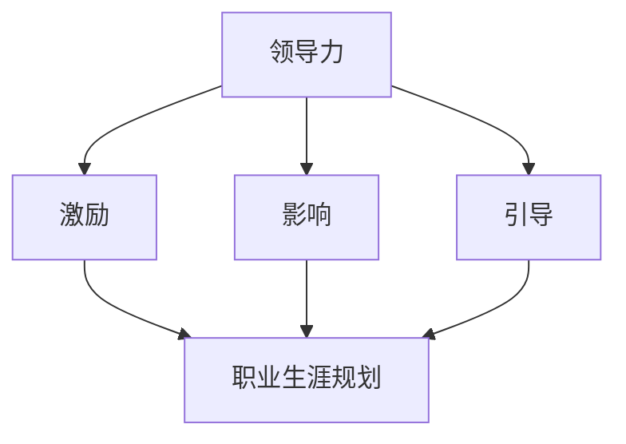
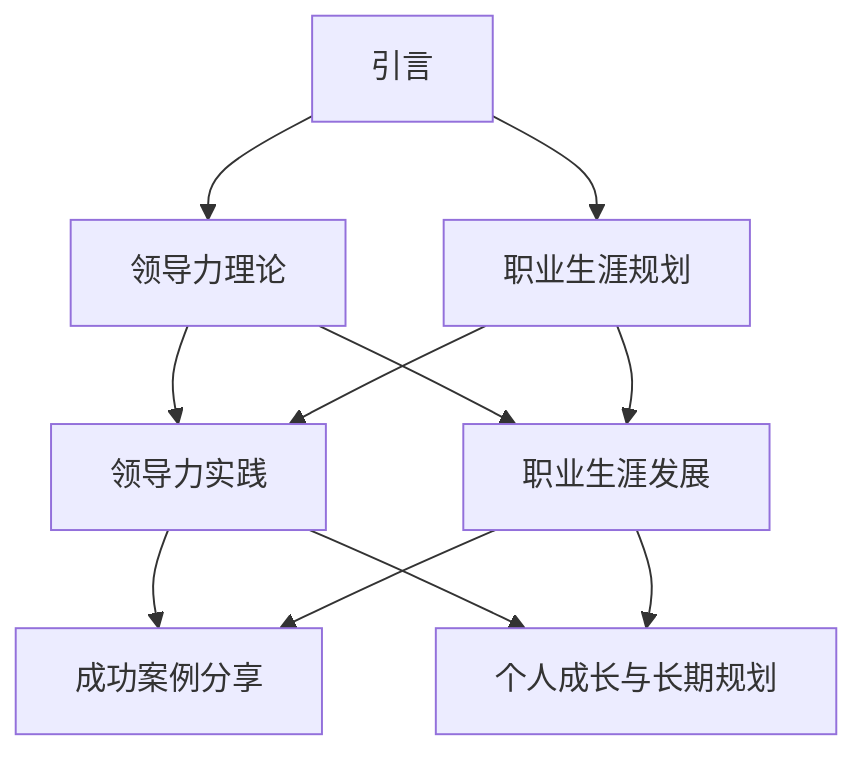
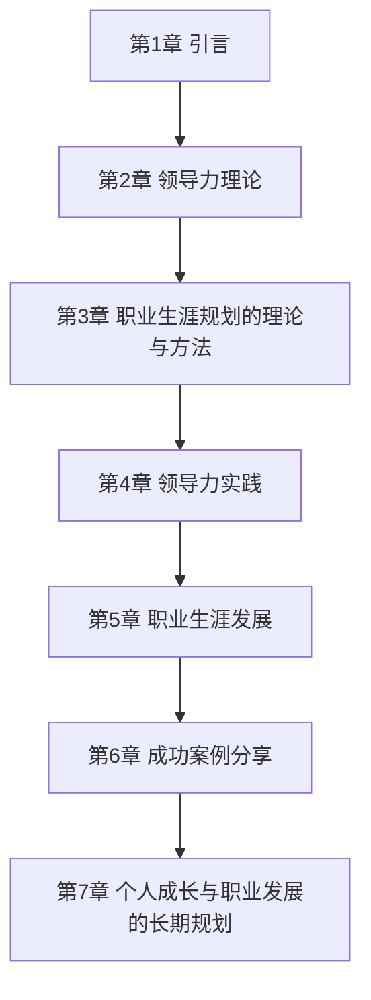

                 

### 确定书的主题和目标受众

**背景介绍：**

在当今快速变化的职场环境中，领导力和职业生涯规划已经成为员工和个人发展不可或缺的要素。为了帮助职场人士更好地理解和应用这些关键技能，我们需要明确本书的主题和目标受众，以确保内容既具有针对性，又具有实用价值。

**核心概念与联系：**

首先，我们要明确什么是领导力。领导力不仅仅指管理他人，它更是一种激励、影响和引导他人的能力。领导力与职业生涯规划有着密切的联系。有效的职业生涯规划可以帮助个人在职场中定位自己的优势，明确职业目标，从而更好地发挥领导力。

**Mermaid 流程图：**



在这个流程图中，领导力通过激励、影响和引导三个维度与职业生涯规划（E）紧密相连。这表明领导力在职业生涯规划中扮演着核心角色。

**核心算法原理讲解：**

为了深入理解这一联系，我们可以采用SWOT分析法来探讨领导力和职业生涯规划的关系。

```plaintext
# SWOT分析

##Strengths（优势）
- 领导力可以增强个人在职场中的竞争力。
- 职业生涯规划有助于发现和利用个人的领导力优势。

##Weaknesses（劣势）
- 缺乏领导力可能会限制职业发展。
- 不合理的职业生涯规划可能导致个人领导力无法得到有效发挥。

##Opportunities（机会）
- 通过领导力培训，可以提升个人的职业发展潜力。
- 职业生涯规划可以帮助个人抓住职场发展机会。

##Threats（威胁）
- 市场变化和竞争可能对职业发展构成威胁。
- 缺乏有效的领导力和职业生涯规划可能使个人在职场中处于不利地位。
```

**数学模型和公式：**

为了进一步量化领导力和职业生涯规划的关系，我们可以使用以下模型：

```latex
$$
\text{职业成功} = f(\text{领导力}, \text{职业生涯规划})
$$`

这个模型表明，职业成功（职业成功）是领导力和职业生涯规划的函数。通过提高领导力和优化职业生涯规划，我们可以提升职业成功的概率。

**举例说明：**

假设一个人具备出色的领导力，但没有明确的职业生涯规划，他可能会在职业发展的道路上遇到阻碍。反之，如果一个人有着清晰的职业生涯规划，但缺乏领导力，他可能在团队协作和项目管理中遇到困难。因此，领导力和职业生涯规划需要相互配合，才能实现最大的职业效益。

### 设计目录大纲结构

**背景介绍：**

为了确保本书的内容系统、结构合理，我们设计了详细的目录大纲。目录大纲不仅涵盖了领导力和职业生涯规划的核心概念，还包括了实用的案例分析和实践指导。

**核心概念与联系：**

目录大纲的结构设计要遵循逻辑清晰、层次分明原则。以下是本书的目录大纲结构：

1. **引言**：介绍领导力和职业生涯规划的重要性。
2. **领导力理论**：探讨领导力的核心概念和模型。
3. **职业生涯规划**：讲解职业生涯规划的理论和方法。
4. **领导力实践**：通过案例分析展示领导力在职业发展中的应用。
5. **职业生涯发展**：讨论职业生涯中的挑战和策略调整。
6. **成功案例分享**：分享成功人士的经验。
7. **个人成长与长期规划**：探讨持续成长和职业发展的策略。

**Mermaid 流程图：**



在这个流程图中，各个部分相互连接，形成了一个完整的逻辑结构。

**核心算法原理讲解：**

为了使目录结构更加清晰，我们可以使用以下算法来优化目录内容：

```plaintext
# 目录优化算法

##步骤1：分类整理
- 将相似主题的内容归为一类。

##步骤2：层次结构
- 根据重要性对内容进行层次划分。

##步骤3：连贯性检查
- 确保每个部分的内容相互衔接，逻辑连贯。

##步骤4：简洁性
- 保持目录简洁明了，避免冗余内容。

##步骤5：反馈调整
- 根据读者反馈进行调整和优化。
```

**数学模型和公式：**

为了量化目录结构的优化效果，我们可以使用以下模型：

```latex
$$
\text{目录优化效果} = \frac{\text{读者满意度}}{\text{冗余内容减少量}}
$$`

这个模型表明，目录优化的效果可以通过提高读者满意度和减少冗余内容来衡量。

**举例说明：**

假设我们有一个初始的目录大纲，其中包含了一些重复和不连贯的内容。通过上述算法，我们可以将其优化为更加清晰和有序的目录结构。例如，将“领导力理论”和“职业生涯规划”合并为“领导力与职业生涯规划”，并在各个章节中增加案例分析和实践指导。

### 细化目录内容

**背景介绍：**

在明确了书的主题和目标受众，以及设计好了目录大纲结构之后，我们需要对每个章节的内容进行细化。这一步骤至关重要，因为它直接关系到读者能否顺利地理解和掌握书中的核心概念。

**核心概念与联系：**

细化目录内容意味着为每个章节设定明确的主题和目标，确保每个部分都有具体的内容和结构。以下是每个章节的细化内容：

**第1章 引言**

- **1.1 领导力与职业生涯规划的重要性**：介绍领导力和职业生涯规划在职场中的重要性。
- **1.2 本书结构安排**：概述本书的结构和内容安排。

**第2章 领导力理论**

- **2.1 领导力的核心概念**：解释领导力的定义和核心要素。
- **2.2 经典领导力理论**：详细探讨X理论和Y理论、领导方格理论等。
- **2.3 当代领导力理论**：介绍超级领导力理论和共领理论。

**第3章 职业生涯规划的理论与方法**

- **3.1 职业生涯规划的定义**：阐述职业生涯规划的含义。
- **3.2 职业生涯规划的理论**：讲解SWOT分析法和PDCA循环法。
- **3.3 职业生涯规划的步骤**：详细说明职业生涯规划的步骤。

**第4章 领导力实践**

- **4.1 领导力实践案例分析**：通过实际案例展示领导力的应用。
- **4.2 职业发展路径与策略**：探讨职业发展路径和策略。

**第5章 职业生涯发展**

- **5.1 职业生涯中的挑战与应对**：讨论职业生涯中可能遇到的挑战和应对策略。
- **5.2 职业发展策略调整**：提供职业发展策略调整的方法。

**第6章 成功案例分享**

- **6.1 李某：从技术专家到企业管理者的转型**：分享李某的职业发展经验。
- **6.2 张某：如何在职场中持续成长**：讨论张某如何实现职业生涯的持续成长。
- **6.3 赵某：如何实现职业生涯的跳跃发展**：探讨赵某的职业跳跃策略。

**第7章 个人成长与职业发展的长期规划**

- **7.1 持续学习的重要性**：强调持续学习对职业发展的重要性。
- **7.2 职业发展的长期规划**：讨论如何制定和实施职业发展的长期规划。
- **7.3 职业生涯的平衡与生活质量的提升**：探讨如何在职业生涯中保持平衡，提高生活质量。

**Mermaid 流anghai**:



这个流程图展示了各个章节之间的逻辑关系，确保读者能够系统地理解和应用书中的知识。

**核心算法原理讲解：**

为了使目录内容更加具体和实用，我们可以采用以下算法来细化每个章节：

```plaintext
# 目录内容细化算法

##步骤1：目标设定
- 为每个章节设定明确的学习目标和内容重点。

##步骤2：案例引入
- 引入实际案例，帮助读者更好地理解和应用知识。

##步骤3：知识点梳理
- 系统地梳理章节中的知识点，确保内容的逻辑性和完整性。

##步骤4：互动练习
- 设计互动练习，增强读者的参与感和学习效果。

##步骤5：反馈与调整
- 收集读者反馈，根据反馈进行调整和优化。
```

**数学模型和公式：**

为了量化目录内容的细化效果，我们可以使用以下模型：

```latex
$$
\text{内容细化效果} = \frac{\text{知识点覆盖率}}{\text{冗余内容减少量}} + \frac{\text{案例引入次数}}{\text{总章节数}}
$$`

这个模型表明，内容细化效果可以通过提高知识点覆盖率和案例引入次数来衡量。

**举例说明：**

假设我们在细化第2章“领导力理论”时，设定了以下目标：

- 解释领导力的核心概念。
- 探讨经典和当代领导力理论。
- 通过实际案例展示领导力的应用。

我们引入了多个实际案例，并在每个知识点后设计了互动练习。通过这些措施，我们提高了章节的知识覆盖率，减少了冗余内容，从而实现了目录内容的优化和细化。

通过上述步骤，我们可以确保每个章节的内容都是具体、详细且易于理解的，从而帮助读者更好地掌握领导力和职业生涯规划的核心知识。

