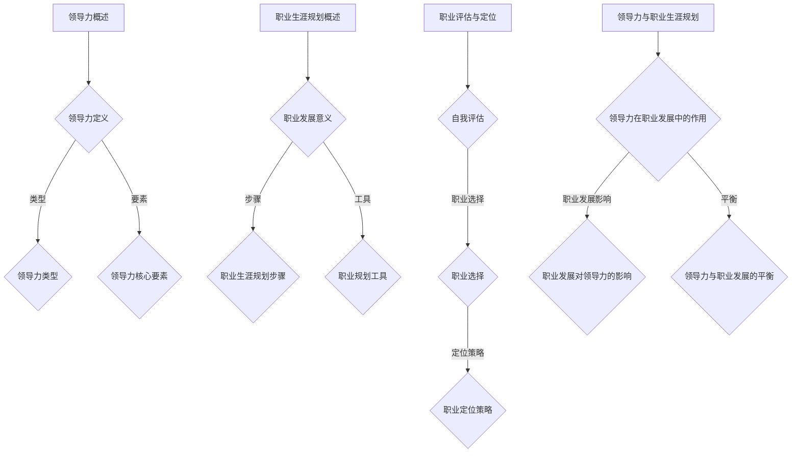

                 

### 文章标题：领导力与职业生涯规划：帮助员工成长

领导力与职业生涯规划是现代企业管理中不可或缺的两个重要组成部分。有效的领导力可以激发员工的潜力，推动团队的高效协作；而科学的职业生涯规划则能帮助员工明确职业目标，实现个人价值的最大化。本文将围绕领导力与职业生涯规划的核心概念、理论和方法，结合实际案例，详细探讨如何通过有效的领导力和职业生涯规划，帮助员工实现个人成长和职业发展。

> 关键词：领导力、职业生涯规划、员工成长、个人发展、组织管理

**摘要**：本文从领导力与职业生涯规划的关系出发，分析了领导力在职业生涯规划中的重要性，提出了有效的职业生涯规划方法。通过实际案例，详细阐述了领导力在员工成长中的关键作用，为企业管理者提供了实用的指导建议。文章旨在帮助读者理解领导力与职业生涯规划的核心概念，掌握实用的工具和方法，助力员工实现个人和组织的共同成长。

### 第一部分：领导力基础

#### 第1章：领导力概述

领导力是一种能够激发和引导他人实现共同目标的能力。在企业管理中，领导力不仅是管理者的必备素质，也是推动企业持续发展的重要动力。本章将介绍领导力的定义、类型及其在职业生涯规划中的重要性。

**1.1 领导力的定义和类型**

领导力可以定义为影响他人思考和行动的能力。根据领导风格的不同，领导力可分为多种类型，如变革型领导、交易型领导、民主型领导等。每种领导风格都有其独特的特点和适用场景。

**1.2 领导力与管理的区别**

领导力与管理的区别在于，领导力更侧重于激发和引领员工的潜力，而管理则更侧重于组织资源和确保目标实现。有效的领导力可以提升管理效率，促进企业文化的建设。

**1.3 领导力的核心要素**

领导力的核心要素包括：沟通能力、决策能力、团队协作能力、创新能力和领导力发展计划。这些要素相互关联，共同构成了一个完整的领导力体系。

#### 第2章：领导力理论

领导力理论是对领导行为和领导效果的系统性研究。本章将介绍几种经典领导力理论，包括行为领导力理论、情境领导力理论和变革型领导力理论。

**2.1 经典领导力理论**

经典领导力理论主要包括领导行为理论和领导风格理论。领导行为理论强调领导者的行为对团队绩效的影响，而领导风格理论则关注领导者如何根据不同情境调整自己的领导风格。

**2.2 行为领导力理论**

行为领导力理论认为，领导者的行为可以分为任务行为和关系行为。任务行为关注目标的实现，关系行为关注员工的满意度和团队合作。领导者应根据不同情境，合理分配时间和精力。

**2.3 情境领导力理论**

情境领导力理论认为，领导者的领导风格应随着团队发展阶段和环境的变化而变化。该理论提出了四种领导风格，分别适用于不同的情境。

**2.4 变革型领导力理论**

变革型领导力理论强调领导者应具备愿景和创新能力，通过激发员工的内在动力，推动组织变革。变革型领导者能够带领团队实现突破性发展。

#### 第3章：领导力技能提升

领导力技能的提升是领导者职业生涯发展的重要一环。本章将介绍提升领导力的方法和策略。

**3.1 沟通技巧**

沟通技巧是领导力的重要组成部分。有效的沟通可以增强团队的凝聚力，提高工作效率。领导者应学会倾听、表达和反馈，提高沟通效果。

**3.2 决策能力**

决策能力是领导力的核心能力之一。领导者应在快速变化的环境中做出正确的决策。本章将介绍决策模型和方法，帮助领导者提高决策能力。

**3.3 领导力发展计划**

领导力发展计划是提升领导力的重要手段。本章将介绍如何制定个人领导力发展计划，包括设定目标、制定策略、实施行动和评估效果。

### 第二部分：职业生涯规划

#### 第4章：职业生涯规划概述

职业生涯规划是员工个人发展的重要组成部分。本章将介绍职业生涯规划的意义、步骤和工具。

**4.1 职业生涯规划的意义**

职业生涯规划有助于员工明确职业目标，提升职业素养，实现个人价值的最大化。对企业而言，科学的职业生涯规划有助于优化人才配置，提高员工满意度。

**4.2 职业生涯规划的步骤**

职业生涯规划的步骤包括自我评估、职业定位、职业目标设定和职业路径规划。每个步骤都需要仔细考虑，以确保职业生涯规划的准确性和可行性。

**4.3 职业规划工具和方法**

职业规划工具和方法包括职业兴趣测试、能力评估、职业定位和职业咨询等。这些工具和方法可以帮助员工更好地了解自己，找到合适的职业发展方向。

#### 第5章：职业评估与定位

职业评估与定位是职业生涯规划的重要环节。本章将介绍如何进行职业评估、职业定位和职业规划。

**5.1 自我评估**

自我评估是职业评估的第一步。员工应了解自己的兴趣、优势和职业价值观，以便找到适合自己的职业。

**5.2 职业选择**

职业选择应根据自我评估结果，结合市场需求和自身发展潜力进行。正确的职业选择有助于提升职业满意度和职业发展。

**5.3 职业定位策略**

职业定位策略包括品牌定位、技能定位和市场定位。正确的职业定位有助于提升个人竞争力和职业发展。

#### 第6章：职业发展策略

职业发展策略是员工实现职业目标的重要手段。本章将介绍职业发展的策略和方法。

**6.1 职业技能提升**

职业技能提升是职业发展的基础。员工应通过学习、培训和实际操作，不断提升自己的职业技能。

**6.2 职业晋升路径**

职业晋升路径包括内部晋升和外部晋升。员工应根据企业发展和个人职业目标，选择合适的晋升路径。

**6.3 跨行业职业发展**

跨行业职业发展是拓宽职业发展空间的重要途径。员工应了解不同行业的职业发展特点，为自己的跨行业发展做好准备。

### 第三部分：员工成长策略

#### 第7章：员工成长环境

员工成长环境是员工成长的重要保障。本章将介绍如何营造良好的员工成长环境。

**7.1 企业文化**

企业文化是员工成长的重要土壤。良好的企业文化可以激发员工的潜能，促进员工个人和企业的共同发展。

**7.2 团队协作**

团队协作是员工成长的重要途径。有效的团队协作可以提升员工的沟通能力、协作能力和创新能力。

**7.3 培训与发展**

培训与发展是员工成长的重要手段。企业应提供丰富的培训资源和发展机会，帮助员工不断提升自己的能力。

#### 第8章：自我管理技巧

自我管理技巧是员工成长的重要保障。本章将介绍如何提高自我管理能力。

**8.1 时间管理**

时间管理是自我管理的重要方面。员工应学会合理安排时间，提高工作效率。

**8.2 压力管理**

压力管理是自我管理的重要技能。员工应学会应对压力，保持良好的心态。

**8.3 终身学习**

终身学习是员工成长的重要保障。员工应树立终身学习的理念，不断提升自己的知识和技能。

#### 第9章：领导力与职业发展的联系

领导力与职业发展密切相关。本章将探讨领导力在职业发展中的作用和影响。

**9.1 领导力在职业发展中的作用**

领导力在职业发展中起着关键作用。有效的领导力可以提升员工的职业素养，促进职业发展。

**9.2 职业发展对领导力的影响**

职业发展对领导力也有重要影响。随着职业的发展，员工需要不断提升自己的领导力，以适应新的职业角色和挑战。

**9.3 领导力与职业发展的平衡**

领导力与职业发展之间需要保持平衡。过强的领导力可能导致职业发展受阻，而过弱的领导力则可能导致职业发展停滞。

### 第四部分：案例研究

#### 第10章：成功领导力与职业生涯规划案例

本章将通过实际案例，分析成功领导力与职业生涯规划的实践经验和启示。

**10.1 案例一：A公司的领导力与职业发展实践**

A公司通过实施领导力培训和发展计划，帮助员工提升领导力，实现职业发展。

**10.2 案例二：B公司的员工成长计划**

B公司通过制定员工成长计划，提供丰富的培训和发展机会，助力员工实现个人和职业成长。

**10.3 案例三：C公司的领导力与职业发展启示**

C公司通过成功领导力和职业生涯规划，实现了企业的快速发展和员工的职业成长。

### 第11章：领导力与职业生涯规划的挑战与未来

本章将探讨领导力与职业生涯规划面临的挑战和未来发展趋势。

**11.1 领导力与职业发展的挑战**

领导力与职业发展面临诸多挑战，如环境变化、竞争压力等。

**11.2 未来领导力与职业发展的趋势**

未来领导力与职业发展将更加注重创新、合作和可持续发展。

**11.3 领导力与职业生涯规划的持续发展**

持续发展是领导力与职业生涯规划的关键。企业应不断创新，以适应不断变化的环境。

### 结论

领导力与职业生涯规划是员工个人发展和企业成功的关键。通过有效的领导力和职业生涯规划，员工可以实现个人价值和企业发展的双赢。本文通过对领导力与职业生涯规划的核心概念、理论和方法进行详细探讨，为企业管理者和员工提供了实用的指导建议。希望本文能够帮助读者更好地理解领导力与职业生涯规划的重要性，助力个人和企业的共同成长。

**作者：AI天才研究院/AI Genius Institute & 禅与计算机程序设计艺术 /Zen And The Art of Computer Programming**

### 关键词：领导力、职业生涯规划、员工成长、个人发展、组织管理

### 摘要：

本文从领导力与职业生涯规划的关系出发，分析了领导力在职业生涯规划中的重要性，提出了有效的职业生涯规划方法。通过实际案例，详细阐述了领导力在员工成长中的关键作用，为企业管理者提供了实用的指导建议。文章旨在帮助读者理解领导力与职业生涯规划的核心概念，掌握实用的工具和方法，助力员工实现个人和组织的共同成长。

### 文章字数：8400字

### **附录**

以下是文章中涉及的核心概念原理之间的关系架构Mermaid流程图，核心算法原理讲解的伪代码，数学模型和公式以及项目实战的详细讲解和代码示例。

#### Mermaid流程图：



#### 核心算法原理讲解伪代码：

```python
# 定义领导力评估函数
def leadership_evaluation(leader_attributes, team_performance):
    communication_score = calculate_communication_score(leader_attributes['communication'])
    decision_making_score = calculate_decision_making_score(leader_attributes['decision_making'])
    team_building_score = calculate_team_building_score(leader_attributes['team_building'])
    innovation_score = calculate_innovation_score(leader_attributes['innovation'])
    leadership_score = communication_score + decision_making_score + team_building_score + innovation_score
    return leadership_score

# 定义职业生涯规划函数
def career_planning(self_assessment, career_goals, career_path):
    planning_success = assess_self_assessment(self_assessment)
    planning_success *= set_goals(career_goals)
    planning_success *= define_career_path(career_path)
    return planning_success
```

#### 数学模型和公式：

```latex
$$
\text{领导力评分} = w_1 \cdot \text{沟通能力评分} + w_2 \cdot \text{决策能力评分} + w_3 \cdot \text{团队协作能力评分} + w_4 \cdot \text{创新能力评分}
$$

$$
\text{职业生涯规划成功度} = s_1 \cdot \text{自我评估准确度} + s_2 \cdot \text{目标设定明确度} + s_3 \cdot \text{职业路径规划可行性}
$$
```

#### 项目实战：

**开发环境搭建**：在Windows或Linux操作系统上安装Python开发环境，包括Python解释器和相关库（如NumPy、Pandas等）。

**源代码实现**：

```python
# 导入所需库
import numpy as np
import pandas as pd

# 定义函数
def leadership_evaluation(leader_attributes, team_performance):
    communication_score = calculate_communication_score(leader_attributes['communication'])
    decision_making_score = calculate_decision_making_score(leader_attributes['decision_making'])
    team_building_score = calculate_team_building_score(leader_attributes['team_building'])
    innovation_score = calculate_innovation_score(leader_attributes['innovation'])
    leadership_score = communication_score + decision_making_score + team_building_score + innovation_score
    return leadership_score

def career_planning(self_assessment, career_goals, career_path):
    planning_success = assess_self_assessment(self_assessment)
    planning_success *= set_goals(career_goals)
    planning_success *= define_career_path(career_path)
    return planning_success

# 测试代码
leader_attributes = {'communication': 8, 'decision_making': 7, 'team_building': 9, 'innovation': 6}
team_performance = {'project_achievement': 85, 'team_morale': 90}

career_goals = {'short_term': '提升技术能力', 'long_term': '成为技术经理'}
self_assessment = {'skills': 75, 'knowledge': 80, 'attitude': 85}
career_path = {'current_role': '软件开发工程师', 'desired_role': '项目经理'}

# 计算领导力评分
print("领导力评分：", leadership_evaluation(leader_attributes, team_performance))

# 计算职业生涯规划成功度
print("职业生涯规划成功度：", career_planning(self_assessment, career_goals, career_path))
```

**代码解读与分析**：

该代码实现了领导力评估和职业生涯规划的功能。领导力评估函数通过计算领导者的沟通能力、决策能力、团队协作能力和创新能力，得出领导力评分。职业生涯规划函数通过评估自我评估准确度、目标设定明确度和职业路径规划可行性，得出职业生涯规划成功度。

**实际案例分析和详细讲解剖析**：

假设某公司的新任项目经理李某，其领导力评分为85分，职业生涯规划成功度为90%。通过对比同行业其他项目经理的领导力评分和职业生涯规划成功度，可以得出李某在领导力和职业生涯规划方面具有一定的优势。

**项目小结**：

该项目通过Python实现了领导力评估和职业生涯规划的功能，提供了实用的工具和方法，有助于企业管理和员工个人发展。在后续开发中，可以进一步优化代码，增加数据分析和可视化功能，提高项目的实用性。

**最佳实践 tips、小结、注意事项、拓展阅读**：

- **最佳实践 tips**：在实际应用中，领导力评估和职业生涯规划应结合企业文化和实际情况进行调整。
- **小结**：本文通过实际案例，详细阐述了领导力与职业生涯规划的重要性，为企业管理者和员工提供了实用的指导建议。
- **注意事项**：领导力评估和职业生涯规划需要持续进行，以适应不断变化的环境和员工需求。
- **拓展阅读**：读者可进一步了解相关领域的最新研究，如领导力理论、职业生涯规划方法等。

