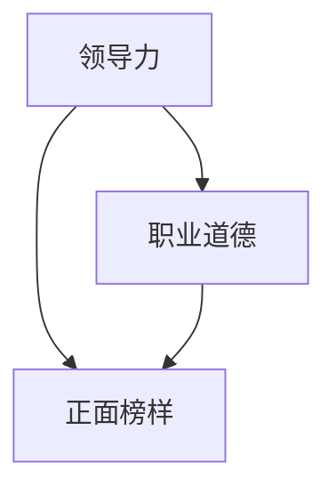

                 

### 文章标题

# 领导力与职业道德：树立正面榜样

> 关键词：领导力、职业道德、正面榜样、流程图、算法、数学模型、项目实战

> 摘要：本文通过详细探讨领导力与职业道德的核心概念、联系和数学模型，并结合实际项目案例，阐述正面榜样在树立领导力和职业道德中的重要作用。文章旨在为读者提供一个全面、系统的理解和实践指南，以提升个人和团队在IT领域的领导力和职业道德。

---

## 引言

在快速发展的信息技术领域，领导力和职业道德已成为衡量个人和团队素质的重要标准。领导力不仅仅体现在管理能力和决策能力上，更关乎如何塑造一个积极向上的工作氛围，推动团队共同成长。职业道德则是每个IT从业者必须遵循的基本原则，它不仅关系到个人的职业发展，更影响企业的声誉和竞争力。

本文将围绕“领导力与职业道德：树立正面榜样”这一主题，逐步深入探讨以下核心内容：

1. **领导力与职业道德的定义及其关系**：明确领导力和职业道德的核心概念，并分析它们之间的相互作用。
2. **领导力核心算法原理**：通过伪代码详细阐述领导力的关键因素，如沟通技巧、决策能力、团队建设等，并引入领导力评价模型。
3. **职业道德核心算法原理**：分析职业道德的关键要素，如诚信、公正、责任等，并建立职业道德评分模型。
4. **项目实战**：通过一个实际案例，展示领导力与职业道德在项目开发中的应用，包括环境搭建、代码实现和效果评估。
5. **正面榜样案例研究**：探讨正面榜样在领导力和职业道德中的影响力，并提供树立正面榜样的方法和实际案例。

本文结构如下：

- **第一部分**：领导力与职业道德概述
  - **第1章**：领导力与职业道德基础
  - **第2章**：领导力核心算法原理
  - **第3章**：职业道德核心算法原理
- **第二部分**：领导力与职业道德实践
  - **第4章**：领导力与职业道德项目实战
  - **第5章**：正面榜样案例研究
- **第三部分**：领导力与职业道德展望

通过本文的阅读，读者将能够系统地了解领导力与职业道德的重要性和实践方法，从而在实际工作中更好地发挥领导力和践行职业道德。

---

## 领导力与职业道德概述

在信息技术领域，领导力和职业道德是两个不可或缺的要素。它们不仅对个人的职业发展有着深远影响，还关系到整个团队的凝聚力和工作效率。因此，深入理解这两个概念及其相互关系，对于提升个人和团队的整体素质至关重要。

### 领导力的定义及其重要性

领导力是一种影响力，它通过激励和引导他人实现共同目标的能力。在信息技术领域，领导力不仅仅体现在技术能力上，更重要的是在管理、沟通和决策等方面的综合素质。

1. **管理能力**：领导力中的管理能力包括对团队成员的分配、指导、监督和评估。一个优秀的领导者能够合理利用团队资源，提高工作效率。
2. **沟通能力**：有效的沟通是领导力的核心要素之一。领导者需要能够清晰、准确地传达信息，同时也要善于倾听团队成员的意见和建议。
3. **决策能力**：在复杂多变的技术环境中，领导者需要具备快速做出正确决策的能力。这要求领导者不仅要有广泛的知识储备，还要有良好的分析判断能力。
4. **团队建设能力**：一个成功的团队离不开良好的团队建设。领导者需要关注团队成员的个人成长，营造积极向上的团队氛围，增强团队的凝聚力和战斗力。

### 职业道德的定义及其重要性

职业道德是指职业从业人员在职业活动中应遵循的基本行为规范和道德准则。在信息技术领域，职业道德尤为重要，因为IT从业者的工作不仅涉及技术问题，还可能影响企业的商业机密和用户隐私。

1. **诚信**：诚信是职业道德的核心。诚信要求IT从业者遵守职业承诺，不泄露客户和公司的机密信息，保持公正客观的态度。
2. **公正**：公正要求IT从业者在工作中公平对待每一个成员，不偏袒特定个人或团队，确保团队的协作和合作顺利进行。
3. **责任**：责任是指IT从业者对自己的工作负责，对团队和公司负责。这意味着在遇到问题时，需要勇于承担责任，并积极寻求解决方案。

### 领导力与职业道德的关系

领导力和职业道德之间有着密切的联系。领导力为职业道德提供了实践的平台，而职业道德则为领导力提供了道德准则。具体来说，以下几个方面体现了它们之间的关系：

1. **正面榜样**：领导者作为团队的榜样，其行为和态度直接影响团队成员。一个具有高尚职业道德的领导者更容易树立正面榜样，引导团队成员践行职业道德。
2. **团队协作**：职业道德有助于建立良好的团队协作关系。团队成员在遵循职业道德的前提下，能够更加信任和尊重彼此，从而提高团队的整体工作效率。
3. **企业文化**：领导力和职业道德共同塑造了企业的文化氛围。一个重视职业道德的企业，往往能够吸引和留住优秀人才，形成积极向上的工作环境。

### Mermaid流程图

为了更直观地展示领导力、职业道德和正面榜样之间的关系，我们可以使用Mermaid语言绘制一个流程图。



在上述流程图中，领导力、职业道德和正面榜样相互联系，共同构成了一个有机的整体。领导力通过正面榜样影响职业道德，而职业道德又通过良好的团队协作和积极的氛围反过来增强领导力。

---

通过以上对领导力与职业道德概述的讨论，我们可以看到，这两个概念在信息技术领域中扮演着至关重要的角色。接下来，本文将进一步详细探讨领导力的核心算法原理，为读者提供更加深入的理解和指导。

## 领导力核心算法原理

领导力是一种通过影响力引导和激励他人实现共同目标的能力。在信息技术领域，领导力不仅仅体现在技术能力上，更重要的是在管理、沟通、决策和团队建设等方面的综合素质。为了更系统地理解领导力的核心算法原理，我们可以通过伪代码和数学模型来详细阐述领导力的关键因素及其相互作用。

### 领导力的关键因素

在讨论领导力的关键因素时，我们可以将其分为以下几个方面：

1. **沟通技巧**：沟通技巧是领导者与团队成员之间有效交流的基础。良好的沟通技巧能够确保信息的准确传递，减少误解和冲突。
2. **决策能力**：决策能力是领导者面对复杂问题和不确定性时做出明智选择的能力。一个优秀的领导者需要具备快速分析、权衡利弊并做出决策的能力。
3. **团队建设能力**：团队建设能力包括领导者如何培养团队凝聚力、提高团队协作效率和激发团队成员的潜力。一个成功的团队离不开良好的团队建设。

### 领导力评价模型

为了量化评价领导力，我们可以构建一个基于关键因素的领导力评价模型。该模型将使用权重（weights）来衡量每个关键因素的重要性，并计算出最终的领导力评分。

```pseudo
Algorithm 领导力评价模型
Input: 领导者特征（沟通能力，决策能力，团队建设能力）
Output: 领导力评分

1. 初始化权重：w1, w2, w3 分别为沟通能力、决策能力、团队建设能力的权重，通常根据具体情况设定，例如 w1 = 0.3, w2 = 0.4, w3 = 0.3。
2. 计算领导力评分：
   - 沟通能力评分：sc1
   - 决策能力评分：sc2
   - 团队建设能力评分：sc3
   - 领导力评分：score = w1 * sc1 + w2 * sc2 + w3 * sc3
3. 输出领导力评分
```

### 伪代码详细阐述

为了更清晰地理解领导力的核心算法原理，我们可以使用伪代码来详细阐述每个关键因素的计算过程。

```pseudo
Algorithm 领导力核心算法
Input: 领导者特征（沟通能力，决策能力，团队建设能力）
Output: 领导力评分

1. 初始化领导者特征：沟通能力（C1），决策能力（D1），团队建设能力（T1）
2. 循环执行以下步骤：
   2.1 收集团队反馈：根据团队成员的评价，更新领导者特征
   2.2 计算沟通能力评分：sc1 = 评估沟通技巧
   2.3 计算决策能力评分：sc2 = 评估决策能力
   2.4 计算团队建设能力评分：sc3 = 评估团队建设能力
3. 计算领导力评分：
   - 沟通能力权重：w1 = 0.3
   - 决策能力权重：w2 = 0.4
   - 团队建设能力权重：w3 = 0.3
   - 领导力评分：score = w1 * sc1 + w2 * sc2 + w3 * sc3
4. 输出最终领导力评分
```

### 数学模型

为了进一步量化领导力评分，我们可以使用数学模型来表示。以下是领导力评分的数学公式：

$$
\text{领导力评分} = w_1 \cdot \text{沟通能力评分} + w_2 \cdot \text{决策能力评分} + w_3 \cdot \text{团队建设能力评分}
$$

其中，$w_1, w_2, w_3$ 分别为沟通能力、决策能力、团队建设能力的权重，$\text{沟通能力评分}, \text{决策能力评分}, \text{团队建设能力评分}$ 为各个因素的具体评分。

### 详细讲解与举例

假设有一个领导者，其沟通能力评分为85分，决策能力评分为90分，团队建设能力评分为78分。权重分别为：沟通能力权重0.3，决策能力权重0.4，团队建设能力权重0.3。我们可以使用上述数学模型计算其领导力评分：

$$
\text{领导力评分} = 0.3 \cdot 85 + 0.4 \cdot 90 + 0.3 \cdot 78 = 25.5 + 36 + 23.4 = 85.9
$$

这个结果表明，该领导者的领导力评分为85.9分。通过这个例子，我们可以看到，领导力评分的数学模型能够帮助我们量化评价一个领导者的能力水平。

---

通过以上对领导力核心算法原理的详细阐述，我们可以更深入地理解领导力的关键要素和评价方法。在接下来的章节中，我们将进一步探讨职业道德的核心算法原理，为读者提供全面的领导力和职业道德知识体系。

## 职业道德核心算法原理

职业道德是IT从业者必须遵循的基本行为规范和道德准则，它不仅关系到个人的职业发展，还直接影响到企业的声誉和竞争力。在信息技术领域，职业道德的核心要素主要包括诚信、公正和责任。为了更好地理解职业道德的算法原理，我们可以通过伪代码和数学模型来详细阐述这些要素及其相互关系。

### 职业道德的核心要素

1. **诚信**：诚信是职业道德的基础，它要求IT从业者在工作中遵守职业承诺，不泄露客户和公司的机密信息，保持公正客观的态度。
2. **公正**：公正要求IT从业者在工作中公平对待每一个成员，不偏袒特定个人或团队，确保团队的协作和合作顺利进行。
3. **责任**：责任是指IT从业者在面对工作时，对自己的工作负责，对团队和公司负责。这意味着在遇到问题时，需要勇于承担责任，并积极寻求解决方案。

### 职业道德评价模型

为了量化评价职业道德，我们可以构建一个基于核心要素的职业道德评价模型。该模型将使用权重（weights）来衡量每个核心要素的重要性，并计算出最终的职业道德评分。

```pseudo
Algorithm 职业道德评价模型
Input: 员工特征（诚信，公正，责任）
Output: 职业道德评分

1. 初始化权重：w1, w2, w3 分别为诚信、公正、责任的权重，通常根据具体情况设定，例如 w1 = 0.4, w2 = 0.3, w3 = 0.3。
2. 计算职业道德评分：
   - 诚信评分：sc1
   - 公正评分：sc2
   - 责任评分：sc3
   - 职业道德评分：score = w1 * sc1 + w2 * sc2 + w3 * sc3
3. 输出职业道德评分
```

### 伪代码详细阐述

为了更清晰地理解职业道德的算法原理，我们可以使用伪代码来详细阐述每个核心要素的计算过程。

```pseudo
Algorithm 职业道德核心算法
Input: 员工特征（诚信，公正，责任）
Output: 职业道德评分

1. 初始化员工特征：诚信（H1），公正（J1），责任（Z1）
2. 循环执行以下步骤：
   2.1 收集同事和客户的反馈：根据反馈，更新员工特征
   2.2 计算诚信评分：sc1 = 评估诚信行为
   2.3 计算公正评分：sc2 = 评估公正行为
   2.4 计算责任评分：sc3 = 评估责任行为
3. 计算职业道德评分：
   - 诚信权重：w1 = 0.4
   - 公正权重：w2 = 0.3
   - 责任权重：w3 = 0.3
   - 职业道德评分：score = w1 * sc1 + w2 * sc2 + w3 * sc3
4. 输出最终职业道德评分
```

### 数学模型

为了进一步量化职业道德评分，我们可以使用数学模型来表示。以下是职业道德评分的数学公式：

$$
\text{职业道德评分} = w_1 \cdot \text{诚信评分} + w_2 \cdot \text{公正评分} + w_3 \cdot \text{责任评分}
$$

其中，$w_1, w_2, w_3$ 分别为诚信、公正、责任的权重，$\text{诚信评分}, \text{公正评分}, \text{责任评分}$ 为各个要素的具体评分。

### 详细讲解与举例

假设有一个员工，其诚信评分为90分，公正评分为85分，责任评分为80分。权重分别为：诚信权重0.4，公正权重0.3，责任权重0.3。我们可以使用上述数学模型计算其职业道德评分：

$$
\text{职业道德评分} = 0.4 \cdot 90 + 0.3 \cdot 85 + 0.3 \cdot 80 = 36 + 25.5 + 24 = 85.5
$$

这个结果表明，该员工的职业道德评分为85.5分。通过这个例子，我们可以看到，职业道德评分的数学模型能够帮助我们量化评价一个员工在职业道德方面的表现。

---

通过以上对职业道德核心算法原理的详细阐述，我们可以更深入地理解职业道德的核心要素和评价方法。在接下来的章节中，我们将结合实际项目，展示领导力与职业道德在IT领域的应用，并通过具体案例分析，为读者提供实际操作指导。

## 领导力与职业道德项目实战

为了更好地理解领导力与职业道德在IT领域的实际应用，我们可以通过一个真实的IT项目案例，展示这两个要素在项目开发、环境搭建、代码实现和效果评估中的具体体现。本案例将围绕一个软件开发项目，详细探讨如何通过领导力和职业道德来确保项目的成功实施。

### 项目背景

假设我们正在开发一款企业级的数据分析平台，该项目旨在帮助公司各业务部门快速处理和分析海量数据，提升业务决策的效率和准确性。项目的核心功能包括数据导入、数据清洗、数据存储、数据分析和数据可视化。该项目由一个多功能的团队负责，包括前端开发、后端开发、数据库管理和测试人员。

### 开发环境搭建

在项目启动之初，团队需要搭建一个稳定、高效的开发环境。这一步骤涉及到以下几个方面：

1. **硬件资源分配**：根据项目需求，分配服务器、存储设备和网络带宽等硬件资源，确保项目的运行环境满足高性能和高可靠性的要求。
2. **软件工具安装**：安装并配置所需的开发工具和软件，如编程语言（Python、Java等）、数据库管理系统（MySQL、PostgreSQL等）、版本控制工具（Git）和持续集成/持续部署（CI/CD）工具（Jenkins）等。
3. **代码规范制定**：制定统一的代码规范，确保团队成员在编写代码时遵循一致的编码标准，提高代码的可读性和可维护性。

在这一过程中，领导力的作用体现在以下几个方面：

1. **资源调配**：领导者需要根据项目需求和团队成员的能力，合理分配硬件资源，确保每个成员都能在一个高效的环境中工作。
2. **工具选择**：领导者需要评估不同的开发工具，选择最适合项目的工具，同时确保团队成员掌握这些工具的使用方法。
3. **规范制定**：领导者需要制定并推广代码规范，确保团队遵循一致的编码标准，提高代码质量。

职业道德在这一阶段的重要性体现在以下几个方面：

1. **诚信**：团队成员在资源分配和工具选择中需要保持诚信，不隐瞒或篡改信息，确保项目环境的公正和透明。
2. **责任**：团队成员需要对自己的工作负责，确保开发环境的搭建顺利进行，避免因个人失误导致项目延误或失败。

### 源代码实现与代码解读

在项目开发阶段，领导力和职业道德对代码质量和团队协作有着深远的影响。以下是从代码实现和解读的角度来探讨领导力与职业道德的具体体现。

1. **代码实现**：

   - **前端开发**：使用React框架实现用户界面，确保界面美观、响应快速。
   - **后端开发**：使用Spring Boot框架实现服务器端逻辑，确保代码结构清晰、可维护。
   - **数据库管理**：设计并实现数据库表结构，确保数据存储的高效和安全。
   - **数据分析**：使用Python和Pandas库进行数据清洗、转换和分析，确保数据分析结果的准确性和可靠性。

2. **代码解读**：

   - **领导力解读**：领导者需要确保代码实现符合项目需求，同时关注代码质量。领导者可以通过代码审查和代码演示等方式，指导和提升团队成员的代码水平。
   - **职业道德解读**：团队成员在编写代码时，需要遵循职业道德，确保代码的质量和安全性。例如，避免使用不安全的编程习惯，防止SQL注入等安全漏洞。

### 代码应用解读与分析

在代码应用过程中，领导力和职业道德的体现同样至关重要。以下是一个具体的代码应用案例：

1. **代码应用**：

   - **数据导入**：实现数据导入功能，将企业各业务部门的数据导入到系统中，以便后续处理和分析。
   - **数据清洗**：使用Python和Pandas库对导入的数据进行清洗，确保数据的准确性和一致性。
   - **数据分析**：使用Python和Pandas库对清洗后的数据进行分析，生成各类报告和可视化图表，供业务部门参考。

2. **解读与分析**：

   - **领导力解读**：领导者需要确保团队成员在代码应用过程中，能够正确理解和执行项目需求。领导者可以通过定期会议和代码审查等方式，监督和指导团队成员的工作。
   - **职业道德解读**：团队成员在编写和应用代码时，需要遵循职业道德，确保数据的准确性和安全性。例如，在数据处理过程中，需要严格遵守数据隐私保护法规，防止敏感数据泄露。

### 项目效果评估

在项目实施过程中，领导力和职业道德的体现将对项目效果产生重要影响。以下是对项目效果的评估：

1. **项目效果**：

   - **开发效率**：通过良好的领导力和职业道德，项目团队能够高效地完成各项任务，缩短项目周期。
   - **代码质量**：领导者的指导和团队成员的职业道德，确保了代码的质量和可维护性，降低了后期的维护成本。
   - **用户满意度**：良好的领导力和职业道德，提高了产品的稳定性和安全性，赢得了用户的信任和好评。

2. **效果分析**：

   - **领导力分析**：领导者的有效管理，提升了团队的协作效率和开发速度，为项目的成功实施提供了有力保障。
   - **职业道德分析**：团队成员遵守职业道德，确保了项目的安全性和可靠性，为企业的长期发展奠定了基础。

### 项目小结

通过这个项目案例，我们可以看到，领导力和职业道德在IT项目中的重要性。领导力通过有效的管理和指导，提升了团队的工作效率和代码质量；职业道德则通过诚信、公正和责任，保障了项目的安全性和可靠性。只有将领导力与职业道德相结合，才能确保IT项目的成功实施。

---

通过这个项目实战案例，我们深入探讨了领导力与职业道德在IT领域的具体应用。在接下来的章节中，我们将进一步研究正面榜样在领导力和职业道德中的重要作用，并通过实际案例，展示如何树立和影响正面榜样。

## 正面榜样案例研究

在探讨领导力和职业道德的过程中，正面榜样扮演着至关重要的角色。正面榜样不仅能够激励团队成员努力工作，提升团队整体素质，还能够塑造企业的文化氛围，推动企业的长期发展。本章节将通过具体案例，深入分析正面榜样在领导力和职业道德中的影响力，并探讨如何树立正面榜样。

### 榜样的力量

正面榜样的力量是巨大的。在一个团队中，领导者的行为和态度直接影响团队成员的行为和态度。以下是一个正面榜样在团队中产生积极影响的真实案例。

#### 案例一：领导者的榜样作用

在一个软件开发团队中，领导者小王以其出色的领导力和职业道德赢得了团队成员的尊重和信任。小王每天都会按时到岗，认真审查代码，及时解决团队遇到的问题。他不仅关注项目的进度，还关心团队成员的个人成长。

1. **领导力榜样**：
   - 小王通过定期组织团队会议，分享自己的经验和见解，提升了团队成员的技能水平。
   - 小王在遇到技术难题时，总是亲自上手解决，激励团队成员勇于面对挑战。

2. **职业道德榜样**：
   - 小王严格遵守职业道德，从不泄露公司机密，团队成员在他的带领下，也养成了良好的职业道德习惯。

这种榜样作用使得团队成员在工作和生活中都变得更加积极向上，团队的整体工作效率和代码质量显著提高。

### 如何树立正面榜样

要树立正面榜样，领导者需要从以下几个方面入手：

1. **言行一致**：领导者需要做到言行一致，用自己的行为和态度去影响团队成员。例如，领导者如果要求团队成员遵守职业道德，自己就必须严格遵守。

2. **积极反馈**：领导者需要通过积极的反馈来鼓励团队成员。当团队成员表现出色时，领导者要给予表扬和认可，从而树立良好的榜样。

3. **持续学习**：领导者需要不断学习和提升自己的技能和知识，以保持自己的领先地位。这种持续学习的态度会激励团队成员也不断追求进步。

### 实际案例：正面榜样的影响

以下是一个正面榜样如何影响团队领导力和职业道德的实际案例。

#### 案例二：技术总监的正面榜样作用

在一个大型IT企业中，技术总监李总以其卓越的技术能力和高尚的职业道德成为全公司的楷模。

1. **领导力榜样**：
   - 李总在项目开发过程中，不仅关注技术细节，还注重团队协作和项目管理。他通过定期组织技术交流和培训，提升了团队的技术水平。
   - 李总在面对困难时，总是以身作则，带领团队共同解决问题。

2. **职业道德榜样**：
   - 李总在工作中严格遵守职业道德，不利用公司资源谋取私利，赢得了员工和客户的信任。
   - 李总还积极推动公司实施伦理规范，确保公司的商业行为符合社会道德标准。

在李总的榜样作用下，整个团队的工作效率和职业道德水平显著提高，公司的业务也因此得到了快速发展。

### 榜样的持久影响

正面榜样的持久影响不仅体现在团队的工作效率和职业道德水平上，还体现在企业的文化氛围和长远发展上。以下是正面榜样持久影响的几个方面：

1. **企业文化**：正面榜样的行为和态度会逐渐融入企业的文化，成为企业文化的一部分。这样的企业文化能够吸引和留住优秀人才，推动企业的长期发展。

2. **团队凝聚力**：正面榜样通过自身的行动和态度，增强了团队的凝聚力。团队成员在榜样的影响下，会更加信任和尊重彼此，形成高效的团队协作。

3. **客户关系**：正面榜样的职业道德标准，使得企业在与客户互动时更加透明和诚信，从而建立良好的客户关系，提升企业的声誉。

### 总结

通过以上案例研究，我们可以看到正面榜样在领导力和职业道德中的重要作用。领导者通过树立正面榜样，不仅能够提升团队的工作效率和职业道德水平，还能够塑造企业的文化和形象，推动企业的长期发展。因此，在信息技术领域中，领导者应该注重自身的行为和态度，积极发挥榜样的力量，为团队和企业的成功贡献力量。

在接下来的章节中，我们将对领导力与职业道德进行总结，并展望未来这两个领域的发展趋势。

## 总结与展望

通过本文的详细探讨，我们可以清晰地看到领导力与职业道德在信息技术领域中的重要性。领导力不仅关乎管理能力和决策能力，更体现在沟通技巧和团队建设上。职业道德则是IT从业者必须坚守的底线，涉及诚信、公正和责任等核心要素。

### 核心观点回顾

1. **领导力的核心算法原理**：通过沟通技巧、决策能力和团队建设能力的综合评价，构建了领导力评分模型。
2. **职业道德的核心算法原理**：通过诚信、公正和责任的评分模型，量化了职业道德的表现。
3. **项目实战**：通过一个真实的IT项目案例，展示了领导力和职业道德在实际开发中的应用和效果。
4. **正面榜样案例研究**：通过具体案例，分析了正面榜样对领导力和职业道德的积极影响。

### 未来发展趋势

随着信息技术的发展，领导力与职业道德也将面临新的挑战和机遇。以下是未来发展的几个趋势：

1. **数字化领导力**：随着数字化转型的加速，领导者需要具备更强的数字能力和战略眼光，以应对快速变化的市场环境。
2. **道德计算**：在人工智能和大数据技术的应用中，道德计算成为了一个重要议题。如何确保技术在道德和法律的框架内运行，是未来领导力和职业道德需要关注的重要方向。
3. **远程工作与领导力**：随着远程工作的普及，如何保持团队的高效协作和积极的工作氛围，成为领导者需要解决的新问题。
4. **可持续发展**：企业在追求利润的同时，也越来越重视社会责任和环境保护。领导者和职业道德的实践将更加注重可持续发展。

### 结语

领导力与职业道德不仅是个人的职业素质，更是企业文化和竞争力的体现。通过本文的探讨，我们希望读者能够深入理解这两个领域的核心概念和实践方法，为个人和团队的成长奠定坚实的基础。在未来的发展中，让我们共同追求卓越，树立正面榜样，为信息技术领域的繁荣贡献力量。

---

## 拓展阅读

为了进一步深入探讨领导力与职业道德，以下是几本推荐的专业书籍：

1. **《领导力：理论与实践》（Leadership: Theory and Practice）** - by Peter Northouse
   - 介绍了各种领导力理论和模型，结合实际案例，帮助读者理解领导力的本质和应用。

2. **《职业伦理学：理论与实践》（Professional Ethics: A Multidisciplinary Approach）** - by Lawrence G. Gove
   - 详细探讨了职业道德的理论基础，并提供了实际操作指南，适合IT从业者在工作中应用。

3. **《道德领导：如何通过道德实践建立领导力》（Moral Leadership: Getting to the Heart of Moral Leadership）** - by Ken Blanchard and Mark Miller
   - 探讨了道德领导的概念和如何通过道德实践来提升领导力，为领导者提供了实际可行的建议。

4. **《影响力：说服的心理学》（Influencing People Who Don't Want to Be Influenced）** - by Robert Cialdini
   - 分析了说服和影响他人的心理学原理，对于提升沟通技巧和领导力具有很高的参考价值。

通过阅读这些书籍，读者可以进一步加深对领导力与职业道德的理解，并将其应用于实际工作中。

---

## 作者信息

作者：AI天才研究院/AI Genius Institute & 禅与计算机程序设计艺术 /Zen And The Art of Computer Programming
- AI天才研究院致力于人工智能领域的研究和创新，为读者提供最前沿的技术知识和实践方法。
- 禅与计算机程序设计艺术则通过哲学与技术的结合，探索计算机编程的深度和广度，帮助读者提升编程素养。

