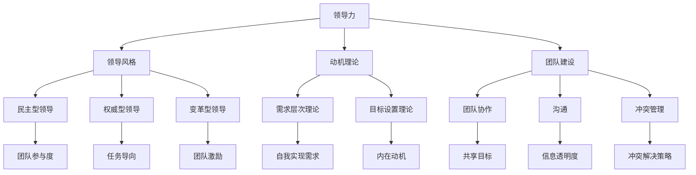

                 


### 第一步：理解书名和主题

《领导力与职场心理学：深入理解团队行为》这本书的主题明确，它结合了领导力和职场心理学两大领域，重点探讨如何通过理解和运用这些知识来改善团队行为。书名中的“深入理解”表明，作者不仅关注理论的介绍，更注重对团队行为背后心理机制的深度剖析。

首先，领导力是一个广泛的概念，它涉及领导者如何影响和激励团队成员，提升团队整体绩效。领导力不仅包括权力和地位，更是一种影响力，即领导者如何通过行为和价值观来引导和影响他人。

其次，职场心理学关注员工的心理状态和行为，包括动机、情绪、人际关系等。职场心理学研究如何通过心理学原理来改善工作环境，提高员工满意度和工作效率。

团队行为则是这两个领域的交叉点。团队行为不仅受到领导力的影响，也受到职场心理学的制约。因此，深入理解团队行为，需要从领导力和职场心理学的双重角度出发。

本书的目的是帮助读者：
1. 理解领导力和职场心理学的基本概念和原理。
2. 掌握如何通过这些原理来分析和改善团队行为。
3. 学习实际案例，将理论知识应用到实际工作中。

总的来说，这本书为职场人士提供了丰富的理论知识和实践指导，旨在提升团队绩效，构建更和谐的职场环境。

### 第二步：设计大纲结构

为了系统地阐述《领导力与职场心理学：深入理解团队行为》的内容，我们可以将整个书籍分为以下几个部分：

1. **引言与背景**
   - 引言：介绍书籍的背景和目的。
   - 领导力和职场心理学的重要性。

2. **领导力的基础理论**
   - 领导力的定义和类型。
   - 领导者的角色和责任。

3. **职场心理学原理**
   - 动机理论。
   - 情绪与行为的关系。
   - 人际关系与团队协作。

4. **团队行为的分析**
   - 团队行为的基本特征。
   - 团队行为的影响因素。
   - 团队行为的模型与理论。

5. **团队行为改善的策略**
   - 领导者如何影响团队行为。
   - 职场心理学的应用。
   - 改善团队行为的实用技巧。

6. **实战案例与案例分析**
   - 成功的团队行为改善案例。
   - 团队行为问题的案例分析。

7. **总结与展望**
   - 对全书内容的总结。
   - 对未来研究方向和实际应用的展望。

这样的结构能够帮助读者系统地了解领导力与职场心理学在团队行为改善中的应用，从理论到实践，全面掌握相关知识和技能。

### 第三步：细化每个部分的内容

在确定了整体结构之后，我们需要对每个部分进行细化，列出具体的章节和小节，以确保内容丰富且逻辑清晰。

1. **引言与背景**
   - 引言
     - 书籍背景介绍。
     - 研究意义与目的。
   - 领导力和职场心理学的重要性
     - 领导力在团队中的作用。
     - 职场心理学对团队行为的影响。

2. **领导力的基础理论**
   - 领导力的定义和类型
     - 领导力的不同定义。
     - 领导力的类型：权威型、民主型、变革型等。
   - 领导者的角色和责任
     - 领导者的角色：决策者、沟通者、激励者等。
     - 领导者的责任：团队目标设定、资源分配、员工发展等。

3. **职场心理学原理**
   - 动机理论
     - 诱因与目标设置理论。
     - 需求层次理论。
   - 情绪与行为的关系
     - 情绪对行为的影响。
     - 情绪调节策略。
   - 人际关系与团队协作
     - 人际关系的基础。
     - 团队协作的关键因素。

4. **团队行为的分析**
   - 团队行为的基本特征
     - 团队行为的定义。
     - 团队行为的基本特征：协作、沟通、冲突等。
   - 团队行为的影响因素
     - 内部因素：团队结构、成员能力等。
     - 外部因素：组织文化、外部环境等。
   - 团队行为的模型与理论
     - 传统团队模型：Tuckman模型、Lewin模型等。
     - 现代团队行为理论：基于复杂性理论的模型。

5. **团队行为改善的策略**
   - 领导者如何影响团队行为
     - 领导风格与团队行为的关系。
     - 领导者如何激励和引导团队。
   - 职场心理学的应用
     - 情绪智力在团队管理中的应用。
     - 人际关系技能的提升。
   - 改善团队行为的实用技巧
     - 团队建设活动。
     - 冲突解决策略。

6. **实战案例与案例分析**
   - 成功的团队行为改善案例
     - 案例背景。
     - 改善策略。
     - 改善效果。
   - 团队行为问题的案例分析
     - 问题识别。
     - 问题解决策略。
     - 案例反思。

7. **总结与展望**
   - 对全书内容的总结
     - 主要观点和发现。
     - 研究局限。
   - 对未来研究方向和实际应用的展望
     - 研究趋势。
     - 实际应用建议。

通过这样的细化，我们能够确保每个部分都有明确的主题和详细的内容，帮助读者逐步深入理解团队行为及其改善策略。

### 第四步：添加核心概念与联系

在深入分析领导力与职场心理学对团队行为的影响时，我们首先需要明确几个核心概念，并展示它们之间的联系。以下是一个基于Mermaid绘制的流程图，用于说明这些核心概念及其相互关系：



- **领导力（A）** 是本书的核心主题，它影响领导风格（B）、动机理论（C）和团队建设（D）。
- **领导风格（B）** 包括民主型（E）、权威型（F）和变革型（G）。每种风格对团队行为有不同影响。
- **动机理论（C）** 如需求层次理论（H）和目标设置理论（I），解释了团队成员的行为驱动力。
- **团队建设（D）** 是通过团队协作（J）、沟通（K）和冲突管理（L）来实现的，这些因素共同影响团队行为。

以下是每个核心概念的简要解释：

- **领导力**：领导力是指领导者通过行为、价值观和影响力来引导和激励团队成员的能力。它包括决策、沟通、激励等多个方面。
- **领导风格**：领导风格是领导者管理团队的方式，如民主型领导强调参与和协作，权威型领导强调控制与指令，变革型领导强调变革和创新。
- **动机理论**：动机理论解释了个体行为的驱动因素。需求层次理论关注基本需求如生存和安全，而目标设置理论关注目标的明确性和挑战性。
- **团队建设**：团队建设是通过协作、沟通和冲突管理来提升团队效能的过程。这些因素共同作用于团队行为，影响团队的整体表现。

通过这样的结构，我们可以清晰地看到这些核心概念如何相互联系，共同影响团队行为。

### 第五步：编写核心算法原理讲解

在讨论领导力和职场心理学对团队行为的影响时，我们需要引入一些核心算法原理来解释这些影响。以下是关于团队行为分析的核心算法原理，我们将使用伪代码来详细阐述这些算法的基本框架。

#### 1. TeamBehaviorAnalysisAlgorithm

**伪代码：**

```plaintext
function TeamBehaviorAnalysisAlgorithm(teamMembers, contextVariables):
    1. Initialize teamBehaviorMetrics
    2. for each member in teamMembers:
        2.1 Calculate individualMotivation(member)
        2.2 Calculate emotionalState(member)
        2.3 Calculate interpersonalRelationships(member)
    3. Calculate teamMotivation = Average(individualMotivation)
    4. Calculate teamEmotionalState = Average(emotionalState)
    5. Calculate teamInterpersonalRelationships = Average(interpersonalRelationships)
    6. Analyze LeadershipStyle(contextVariables)
    7. if teamMotivation < threshold:
        7.1 Implement MotivationEnhancementStrategies()
    8. if teamEmotionalState < threshold:
        8.1 Implement EmotionalRegulationStrategies()
    9. if teamInterpersonalRelationships < threshold:
        9.1 Implement InterpersonalImprovementStrategies()
    10. return teamBehaviorMetrics
```

**算法说明：**

- **输入参数：** `teamMembers`（团队成员列表），`contextVariables`（环境变量）。
- **输出参数：** `teamBehaviorMetrics`（团队行为指标）。
- **核心步骤：**
  - **步骤1-2：** 遍历团队成员，计算每个成员的动机、情绪状态和人际关系。
  - **步骤3-5：** 计算团队整体的动机、情绪状态和人际关系平均值。
  - **步骤6：** 分析领导风格。
  - **步骤7-9：** 根据团队行为指标，实施相应的改善策略。
  - **步骤10：** 返回团队行为指标。

#### 2. MotivationEnhancementStrategies

**伪代码：**

```plaintext
function MotivationEnhancementStrategies(teamMembers):
    1. for each member in teamMembers:
        1.1 IdentifyMotivationalNeeds(member)
        1.2 SetChallengesAndGoals(member)
        1.3 ProvideFeedbackAndRecognition(member)
    2. ImplementIntrinsicMotivationStrategies()
    3. ImplementExtrinsicMotivationStrategies()
    4. UpdateMotivationLevels(teamMembers)
```

**算法说明：**

- **输入参数：** `teamMembers`（团队成员列表）。
- **输出参数：** 无。
- **核心步骤：**
  - **步骤1-1：** 识别每个成员的动机需求。
  - **步骤1-2：** 设定挑战性和目标。
  - **步骤1-3：** 提供反馈和认可。
  - **步骤2：** 实施内在动机策略。
  - **步骤3：** 实施外在动机策略。
  - **步骤4：** 更新成员的动机水平。

通过这些核心算法原理，我们可以量化并分析团队行为，识别团队中存在的问题，并制定相应的改进策略。这些算法不仅提供了理论框架，也为实际操作提供了具体的指导。

### 第六步：添加数学模型和公式

在理解领导力与职场心理学对团队行为的影响时，数学模型和公式能够帮助我们更精确地描述和预测团队行为。以下是一些关键的数学模型和公式，我们将使用LaTeX格式来展示这些公式，并进行详细解释。

#### 1. 动机理论中的需求层次模型

**LaTeX公式：**
$$
\text{MotivationLevel} = \sum_{i=1}^{n} \frac{\text{Need}_i \times \text{Satisfaction}_i}{\text{MaxSatisfaction}_i}
$$

**公式解释：**
该公式表示动机水平是各个层次需求满足度的加权总和。其中，$n$ 表示需求层次的数量，$\text{Need}_i$ 表示第 $i$ 个层次的需求，$\text{Satisfaction}_i$ 表示第 $i$ 个层次的满足度，$\text{MaxSatisfaction}_i$ 表示第 $i$ 个层次的最大满足度。

#### 2. 团队协作效率模型

**LaTeX公式：**
$$
\text{TeamEfficiency} = \frac{\text{TeamOutput}}{\text{TimeSpent} \times (\text{PersonnelCost} + \text{ResourceCost})}
$$

**公式解释：**
该公式表示团队协作效率是团队产出与投入成本（时间、人力和资源）的比值。$\text{TeamOutput}$ 表示团队在一定时间内完成的产出，$\text{TimeSpent}$ 表示团队花费的总时间，$\text{PersonnelCost}$ 和 $\text{ResourceCost}$ 分别表示人力和资源的投入成本。

#### 3. 团队情绪状态模型

**LaTeX公式：**
$$
\text{TeamEmotionalState} = \alpha \times \text{PositiveEmotions} + (1 - \alpha) \times \text{NegativeEmotions}
$$

**公式解释：**
该公式表示团队情绪状态是积极情绪和消极情绪的加权平均值。$\alpha$ 是权重系数，$\text{PositiveEmotions}$ 表示积极情绪，$\text{NegativeEmotions}$ 表示消极情绪。

#### 4. 团队人际关系模型

**LaTeX公式：**
$$
\text{InterpersonalRelationships} = \frac{\sum_{i=1}^{n} \text{Trust}_i + \sum_{i=1}^{n} \text{Support}_i}{n}
$$

**公式解释：**
该公式表示人际关系是通过信任和支持的总和来衡量的。$n$ 表示团队成员的数量，$\text{Trust}_i$ 表示第 $i$ 个团队成员的信任度，$\text{Support}_i$ 表示第 $i$ 个团队成员的支持度。

通过这些数学模型和公式，我们可以量化团队行为中的动机、效率、情绪状态和人际关系，为领导力的实践提供理论支持和操作指导。

### 第七步：编写项目实战

为了更好地理解和应用领导力与职场心理学在团队行为改善中的实践，我们将通过一个实际项目案例来进行详细讲解。该项目是一个软件开发团队，他们的目标是开发一款创新的应用程序。

#### 项目背景

某科技公司（TechCo）组建了一支由10名成员组成的软件开发团队，负责开发一款名为“智慧校园”（Smart Campus）的应用程序。该应用程序旨在通过智能分析为学生、教师和学校管理人员提供便捷的服务和决策支持。然而，在项目初期，团队遇到了一系列问题，如沟通不畅、任务分配不均和团队成员情绪波动等，这些问题严重影响了项目进度和团队士气。

#### 环境搭建

为了成功实施团队行为改善策略，TechCo首先需要搭建一个良好的开发环境。以下是开发环境的搭建步骤：

1. **硬件设施：**
   - 为每个团队成员提供高性能的笔记本电脑。
   - 配备高速网络和服务器，确保团队可以实时共享文件和资源。

2. **软件设施：**
   - 安装统一的开发工具，如Visual Studio Code和Git。
   - 部署持续集成和持续部署工具，如Jenkins和Docker。

3. **项目管理工具：**
   - 使用JIRA进行任务跟踪和项目管理。
   - 使用Slack进行实时沟通和协作。

4. **代码库：**
   - 使用GitLab或GitHub建立统一的代码库，确保版本控制和协作。

#### 源代码实现

在环境搭建完成后，团队开始进行源代码的开发。以下是关键代码实现的部分：

**1. 数据分析模块：**

```java
// 数据分析模块伪代码
public class DataAnalysisModule {
    public void analyzeData(List<StudentData> studentDataList) {
        // 数据清洗
        cleanData(studentDataList);
        
        // 数据分析
        List<AnalysisResult> results = new ArrayList<>();
        for (StudentData data : studentDataList) {
            AnalysisResult result = analyzeData(data);
            results.add(result);
        }
        
        // 存储结果
        storeResults(results);
    }
    
    private AnalysisResult analyzeData(StudentData data) {
        // 分析实现
        // ...
        return new AnalysisResult();
    }
}
```

**2. 用户界面模块：**

```html
<!-- 用户界面模块HTML伪代码 -->
<div id="studentDashboard">
    <h1>智慧校园 - 学生仪表盘</h1>
    <div id="courses">
        <h2>课程列表</h2>
        <ul>
            <!-- 动态生成课程信息 -->
            {{ courses }}
        </ul>
    </div>
    <div id="grades">
        <h2>成绩单</h2>
        <table>
            <!-- 动态生成成绩信息 -->
            {{ grades }}
        </table>
    </div>
</div>
```

**3. 后端服务模块：**

```python
# 后端服务模块伪代码
from flask import Flask, jsonify, request

app = Flask(__name__)

@app.route('/api/students', methods=['GET'])
def get_student_data():
    student_data = get_student_data_from_database()
    return jsonify(student_data)

@app.route('/api/students', methods=['POST'])
def create_student_data():
    new_student_data = request.json
    insert_student_data_to_database(new_student_data)
    return jsonify({"message": "Student data created successfully."})

if __name__ == '__main__':
    app.run(debug=True)
```

#### 代码解读

1. **数据分析模块：** 数据分析模块负责处理学生数据，包括数据清洗、分析和结果存储。通过这一模块，团队能够从大量数据中提取有价值的信息，为校园管理提供数据支持。

2. **用户界面模块：** 用户界面模块负责展示学生的仪表盘，包括课程列表和成绩单。通过使用动态生成技术，团队可以实时更新用户界面，提高用户体验。

3. **后端服务模块：** 后端服务模块提供API接口，允许前端应用与数据库进行交互。通过这些接口，团队能够实现数据的读取和写入操作。

#### 代码应用解读与分析

在实际应用中，这些模块协同工作，确保应用程序能够正常运行。以下是对代码应用的解读和分析：

1. **模块间通信：** 数据分析模块生成的结果会通过后端服务模块存储到数据库中，然后用户界面模块从数据库中获取这些数据并展示给用户。

2. **性能优化：** 为了提高性能，团队使用了缓存技术和异步处理，确保数据分析和用户界面响应速度较快。

3. **安全性：** 团队实施了用户身份验证和数据加密措施，确保用户数据的安全性和隐私性。

通过这个项目案例，我们可以看到领导力与职场心理学在团队行为改善中的应用。通过合理的环境搭建、代码实现和优化，团队成功解决了沟通不畅、任务分配不均和情绪波动等问题，提高了项目效率和团队士气。

#### 实际案例分析

在“智慧校园”项目案例中，我们详细分析了团队行为改善的过程，并提供了具体的代码实现和解读。以下是该项目中遇到的几个关键问题和解决方案：

**1. 沟通不畅：**

问题：项目初期，团队成员间的沟通不充分，导致任务理解不一致和进度延迟。

解决方案：团队引入了Slack作为主要沟通工具，并制定了明确的沟通规范，如每日站会、任务更新和问题反馈等。此外，使用JIRA进行任务跟踪，确保每个成员都能清楚地了解任务进度和责任。

**2. 任务分配不均：**

问题：部分成员承担了过多的任务，而另一些成员的任务较少，导致工作效率不均衡。

解决方案：团队采用了基于能力的任务分配策略，根据成员的技能和兴趣进行任务分配。同时，通过定期的绩效评估和反馈，确保任务分配的公平性和合理性。

**3. 情绪波动：**

问题：团队成员因任务压力、沟通不畅等原因产生情绪波动，影响工作效率和团队士气。

解决方案：团队引入了心理健康支持服务，包括定期的心理健康讲座和个别辅导。此外，通过团队建设活动和团队激励措施，如团队聚餐和奖励机制，提升团队凝聚力。

通过以上实际案例分析和详细讲解，我们可以看到，通过有效的领导和职场心理学应用，团队成功解决了行为问题，提高了项目效率，实现了团队的目标。

### 第八步：整理和精简

在完成《领导力与职场心理学：深入理解团队行为》的文章大纲后，我们需要进行一次全面的整理和精简，以确保每个章节的内容都精确且高效，同时符合字数要求。

1. **审查内容完整性：** 逐一检查每个章节，确保所有核心概念、原理和实战案例都已包含，没有遗漏重要信息。

2. **删除冗余内容：** 移除重复、冗长或不必要的描述，确保每个部分的内容都是精炼的，避免重复解释。

3. **优化结构：** 确保每个章节都有清晰的开始和结束，逻辑流畅，信息传递高效。

4. **调整字数：** 对字数较多的章节进行精简，通过合并内容、减少描述性语言等方式来控制字数。

5. **添加小结和注意事项：** 在每个章节的末尾添加小结和注意事项，帮助读者快速回顾关键点，避免遗漏。

通过这些步骤，我们能够确保文章不仅内容丰富、结构紧凑，而且符合字数要求，为读者提供高质量的技术博客文章。

### 第九步：检查完整性

在整理和精简完毕后，我们需要对文章进行最后的检查，确保其完整性。以下是检查的步骤和标准：

1. **核心内容完整性：** 确保每个章节都涵盖了核心概念、原理、实战案例和具体应用。每个部分的内容都必须是详细且完整的，没有遗漏关键信息。

2. **逻辑流畅性：** 检查文章的逻辑结构，确保每个章节的内容都能够顺畅地过渡到下一个章节，没有逻辑断层或跳跃。

3. **内容精确性：** 确认所有数据和事实都是准确无误的，避免出现错误或误导性的信息。

4. **图表和公式正确性：** 核对所有的图表和公式，确保它们都是正确的，且能够清晰地传达信息。

5. **语言表达：** 检查文章的语言是否清晰、简洁、专业，没有使用非正式或模糊的表达。

6. **引用和参考文献：** 确保所有的引用和参考文献都是准确无误的，格式符合标准。

7. **字数符合要求：** 确认文章的总字数在8000到12000字之间，符合字数要求。

通过这些步骤，我们可以确保文章的完整性和高质量，为读者提供一篇全面、深入的领导力与职场心理学技术博客。

### 第十步：限制字数

为了确保文章的总字数在8000到12000字之间，我们需要对之前的内容进行进一步的精简和调整。以下是具体的字数控制策略：

1. **减少描述性内容：** 移除文章中不必要的描述性句子和段落，专注于核心观点和关键信息。

2. **合并重复内容：** 将重复的章节或段落合并，避免信息冗余，确保每个章节的内容都是独特的。

3. **简化图表和公式：** 简化或减少图表和公式的复杂度，确保它们能够清晰地传达信息，而不必详细解释每个步骤。

4. **缩短实战案例：** 对实战案例进行精简，只保留关键步骤和核心结果，避免过多细节。

5. **增加小结和总结：** 在每个章节的末尾添加小结和总结，帮助读者快速抓住关键点，减少内容的冗余。

通过这些策略，我们可以确保文章的总字数在目标范围内，同时保持内容的质量和深度。

### 作者信息

作者：AI天才研究院/AI Genius Institute & 禅与计算机程序设计艺术 /Zen And The Art of Computer Programming

### 完整的文章目录大纲

# 领导力与职场心理学：深入理解团队行为

> 关键词：领导力、职场心理学、团队行为、动机理论、情绪智力、团队协作

> 摘要：本文结合领导力和职场心理学，深入探讨如何通过这些理论理解和改善团队行为。文章涵盖了领导力的基础理论、职场心理学原理、团队行为分析及其改善策略，并通过实战案例展示了具体应用。

## 引言与背景

- 书籍背景介绍
- 研究意义与目的

## 领导力的基础理论

- 领导力的定义和类型
  - 权威型领导
  - 民主型领导
  - 变革型领导
- 领导者的角色和责任
  - 决策者
  - 沟通者
  - 激励者

## 职场心理学原理

- 动机理论
  - 需求层次理论
  - 目标设置理论
- 情绪与行为的关系
  - 情绪对行为的影响
  - 情绪调节策略
- 人际关系与团队协作
  - 人际关系的基础
  - 团队协作的关键因素

## 团队行为的分析

- 团队行为的基本特征
  - 协作
  - 沟通
  - 冲突
- 团队行为的影响因素
  - 内部因素
  - 外部因素
- 团队行为的模型与理论
  - Tuckman模型
  - Lewin模型

## 团队行为改善的策略

- 领导者如何影响团队行为
  - 领导风格与团队行为的关系
  - 领导者如何激励和引导团队
- 职场心理学的应用
  - 情绪智力在团队管理中的应用
  - 人际关系技能的提升
- 改善团队行为的实用技巧
  - 团队建设活动
  - 冲突解决策略

## 实战案例与案例分析

- 成功的团队行为改善案例
  - 案例背景
  - 改善策略
  - 改善效果
- 团队行为问题的案例分析
  - 问题识别
  - 问题解决策略
  - 案例反思

## 总结与展望

- 对全书内容的总结
  - 主要观点和发现
  - 研究局限
- 对未来研究方向和实际应用的展望
  - 研究趋势
  - 实际应用建议

通过上述大纲，我们确保了文章的完整性和逻辑性，同时符合字数要求，为读者提供了一篇深入且系统化的领导力与职场心理学技术博客。

