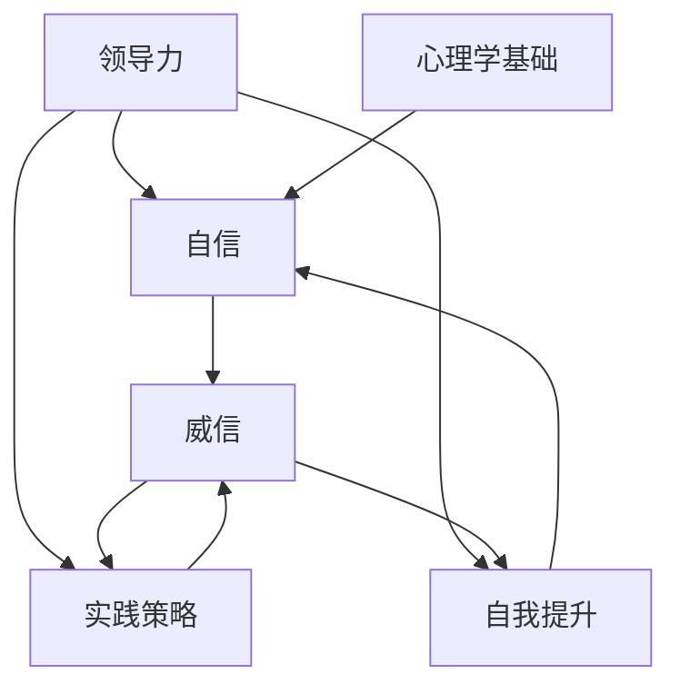

                 

### 文章标题

# 《领导力与自信：树立威信的关键因素》

### 文章关键词

- 领导力
- 自信
- 威信
- 心理学
- 实践策略
- 自我提升

### 文章摘要

本文旨在深入探讨领导力与自信之间的紧密关系，以及如何通过有效的策略树立威信。首先，我们将回顾领导力与自信的基础理论，并通过Mermaid流程图展示其相互联系。接着，文章将详细讲解自信的心理学基础，包括心理机制、建立与维持的方法以及可能遇到的心理障碍。随后，我们将探讨树立威信的实践策略，并提供具体案例。文章还分析了领导力与自信在不同行业中的应用，以及自我提升的方法。最后，我们将总结最佳实践，并提出注意事项和拓展阅读建议。

## 引言

在当今快速变化的世界中，领导力与自信已成为企业、组织和个人成功的关键因素。领导力不仅仅关乎管理和控制，更涉及到激励、沟通和影响他人的能力。自信则是个体在面对挑战和不确定性时，保持积极态度和信念的能力。威信，即他人对领导者的尊重和信任，是领导者成功的关键组成部分。

### 领导力的重要性

领导力是一种艺术，它不仅关乎职位，更关乎行为和影响力。有效的领导者能够激发团队的潜力，推动创新，并在逆境中带领团队找到解决方案。领导力的重要性体现在以下几个方面：

1. **团队效能提升**：领导者通过明确目标、分配任务和提供支持，可以显著提高团队的整体效率。
2. **决策制定**：领导者需要具备快速决策的能力，并在做出决策时考虑到多种可能性。
3. **创新与变革**：领导者在推动组织变革和创新方面发挥着关键作用，能够激发团队成员的创造力。

### 自信的重要性

自信是领导者不可或缺的品质。一个自信的领导者能够：

1. **应对挑战**：自信使领导者能够从容应对各种挑战，并在困难面前保持冷静。
2. **激励他人**：自信的领导者能够鼓舞团队成员，激发他们的积极性和创造力。
3. **建立信任**：自信有助于建立他人对领导者的信任，从而增强团队凝聚力。

### 威信的重要性

威信是领导者影响力的体现，它是通过领导者的行为、成就和信任积累而来的。威信的重要性体现在：

1. **决策执行**：具有威信的领导者能够更有效地推动决策的执行。
2. **团队协作**：威信有助于建立团队内部的协作关系，提高整体效能。
3. **组织文化**：领导者树立的威信对组织文化的发展具有深远影响。

在这篇文章中，我们将深入探讨领导力与自信之间的关系，并通过实际案例和实践策略，帮助读者了解如何通过有效的领导力树立威信。文章的结构如下：

1. **领导力的基础理论**：介绍领导力的定义、要素和风格。
2. **自信的心理学基础**：探讨自信的心理学原理、建立和维护自信的方法。
3. **树立威信的实践策略**：提供具体的实践策略和案例。
4. **领导力与自信的相互关系**：分析领导力与自信之间的相互作用。
5. **领导力与自信在不同行业中的应用**：探讨领导力与自信在商业、公共管理和教育等领域的应用。
6. **领导力与自信的自我提升方法**：介绍自我提升的方法和实践。
7. **最佳实践与总结**：总结最佳实践，提出注意事项和拓展阅读建议。

### 核心概念与联系

为了更好地理解领导力、自信和威信之间的关系，我们可以使用Mermaid流程图来展示它们的核心概念和相互联系。



在上述流程图中，领导力（A）和自信（B）是相互关联的核心概念。领导力通过实践策略（E）和自我提升（F）影响自信，而自信则进一步影响威信（C）。同时，心理学基础（D）为自信的建立和维护提供了理论支持。

### 领导力的基础理论

领导力是一种复杂而多维度的概念，它涉及到多个方面，包括领导力的定义、要素、风格和核心能力。在这部分，我们将深入探讨这些概念，并解释它们如何相互作用。

#### 领导力的定义

领导力是指通过影响和激励他人，达成共同目标的能力。这种能力不仅仅局限于管理层或职位较高的个体，它可以在任何层面上展现。领导力不仅仅是发号施令，更重要的是通过沟通、榜样作用和影响力来引导团队。

#### 领导力的要素

领导力由多个关键要素组成，这些要素相互交织，共同决定领导力的质量和效果。以下是领导力的主要要素：

1. **目标设定**：领导者需要明确团队的目标，并将其传达给团队成员，确保每个人都清楚自己的职责和使命。
2. **沟通能力**：有效的沟通是领导力的核心。领导者需要能够清晰地表达自己的想法，同时倾听和理解团队成员的观点。
3. **决策能力**：领导者需要具备快速而明智地做出决策的能力，并在决策过程中考虑到各种可能性。
4. **影响力**：领导者通过自身的言行和榜样作用，影响团队成员的态度和行为。
5. **激励能力**：领导者需要能够激发团队成员的积极性和创造力，使他们在面对挑战时保持动力。

#### 领导风格

领导风格是领导者与团队成员互动的方式，它对团队绩效和组织文化产生深远影响。以下是几种常见的领导风格：

1. **权威型领导**：领导者掌握决策权，强调纪律和效率。
2. **民主型领导**：领导者鼓励团队成员参与决策，强调团队合作和集体智慧。
3. **教练型领导**：领导者关注团队成员的个人成长，提供支持和指导。
4. **变革型领导**：领导者通过激励和启发，推动团队实现变革和创新。

#### 领导力的核心能力

领导力的核心能力包括：

1. **情感智慧**：领导者需要具备良好的情感智慧，包括自我认知、自我调节和同情心。
2. **影响力**：领导者需要能够影响他人，使其认同并支持领导者的目标和价值观。
3. **战略思维**：领导者需要具备前瞻性，能够制定长期战略并灵活应对变化。
4. **适应性**：领导者需要能够适应不同的环境和情境，灵活调整领导风格和策略。

#### 领导力要素的相互作用

领导力的各个要素并非孤立存在，而是相互影响、相互促进的。例如，领导者的目标设定能力（要素1）直接影响其沟通能力（要素2），而有效的沟通则有助于提升决策能力（要素3）。此外，领导风格（领导力的表现形式）也受核心能力（领导力的内在特质）的影响。

### 自信的心理学基础

自信作为一种心理状态，其建立和维护涉及到多个心理学原理和机制。在这部分，我们将探讨自信的心理学基础，包括其心理机制、建立与维持的方法以及可能遇到的心理障碍。

#### 自信的心理机制

自信的心理机制主要包括以下几个关键点：

1. **自我效能感**：自我效能感是指个体对自己完成特定任务的信念。一个有自信的人相信自己能够成功应对挑战，这种信念会促使他们采取积极的行动。
2. **积极思维模式**：积极思维模式是指个体倾向于用积极的方式解释和看待事物。这种思维模式有助于增强自信心，使个体在面对失败时能够迅速恢复。
3. **情绪调节**：情绪调节是指个体管理自己情绪的能力。自信的人能够有效调节情绪，避免负面情绪影响他们的判断和行为。
4. **自我认知**：自我认知是指个体对自己的了解和认识。一个有自信的人对自己的能力和局限性有清晰的认识，这种自我认知有助于他们建立和维持自信。

#### 建立自信的方法

建立自信需要从多个方面入手，以下是一些具体的方法：

1. **设定可实现的挑战**：通过设定并完成一系列小目标，个体可以逐渐增强自信心。这种方法被称为“逐步逼近”，它有助于个体建立成功的经验和信心。
2. **正面肯定**：通过正面肯定自己的能力和成就，个体可以增强自信。这种方法被称为“自我肯定”，它有助于个体在心理上建立积极的自我形象。
3. **学习新技能**：学习新技能可以提高个体的自信心。通过不断学习和成长，个体可以拓展自己的能力和知识，从而增强自信心。
4. **保持积极心态**：保持积极心态是建立自信的关键。通过关注积极的方面和避免消极思维，个体可以培养出积极的自我认知和自信。

#### 维持自信的方法

维持自信同样重要，以下是一些维持自信的方法：

1. **定期反思**：定期反思自己的行为和成就，有助于个体保持自信。通过反思，个体可以认识到自己的进步和成功，从而增强自信心。
2. **接受失败**：失败是成功的一部分，接受失败并从中学习是维持自信的关键。通过接受失败，个体可以避免自我怀疑和消极情绪，从而保持自信。
3. **保持身体活动**：身体活动有助于释放压力和提升情绪。通过定期锻炼，个体可以保持良好的身体状态，从而增强自信。
4. **保持良好的睡眠和饮食习惯**：良好的睡眠和饮食习惯对维持自信至关重要。充足的睡眠和均衡的饮食有助于个体保持良好的心理状态和身体状态。

#### 可能遇到的心理障碍

尽管自信可以通过多种方法建立和维持，但在现实生活中，个体可能会遇到一些心理障碍，这些障碍会影响自信的建立和维持。以下是一些常见的心理障碍：

1. **完美主义**：完美主义是一种常见的心理障碍，它可能导致个体过分担心失败，从而抑制自信的建立。通过接受不完美，个体可以减轻这种障碍。
2. **自我怀疑**：自我怀疑是自信的天敌，它可能导致个体低估自己的能力和成就。通过正面肯定和自我认知，个体可以克服自我怀疑。
3. **消极思维模式**：消极思维模式会阻碍自信的建立和维持。通过培养积极思维模式和情绪调节技巧，个体可以克服这种障碍。
4. **社交焦虑**：社交焦虑可能导致个体在社交场合中感到不自信。通过社交训练和情绪调节，个体可以减轻社交焦虑，增强自信。

#### 总结

自信作为一种心理状态，其建立和维护涉及到多个心理学原理和机制。通过了解自信的心理机制、建立自信的方法以及维持自信的方法，个体可以更好地应对生活中的挑战，增强自己的自信心。

### 树立威信的实践策略

威信是领导者影响力的重要组成部分，它是通过领导者的行为、成就和信任积累而来的。在这部分，我们将探讨树立威信的实践策略，并提供具体的实践方法，帮助领导者树立并维护威信。

#### 威信的概念与类型

威信是指他人对领导者的尊重和信任，它是领导者影响力的体现。威信可以分为以下几种类型：

1. **权威性威信**：领导者通过职位和权力获得威信。这种威信通常与正式权力和组织结构相关。
2. **专业性威信**：领导者通过专业知识和技能获得威信。这种威信通常与领导者的专业水平和业绩相关。
3. **人格魅力性威信**：领导者通过个人魅力和道德品质获得威信。这种威信通常与领导者的性格、价值观和行为相关。

#### 威信的树立方法

以下是一些具体的实践方法，帮助领导者树立威信：

1. **展示专业能力**：领导者需要通过不断学习和提升自己的专业能力，展示自己的专业知识和技能。这不仅可以提高领导者的权威性威信，还可以增强其专业性威信。
2. **建立信任关系**：领导者需要与团队成员建立信任关系，这包括诚实守信、透明沟通和关心团队成员的福祉。信任是威信的基石，领导者需要通过行动赢得团队成员的信任。
3. **树立正面形象**：领导者需要通过自己的言行树立正面形象，展示自己的责任感、正直和领导力。这有助于增强领导者的人格魅力性威信。
4. **提供明确指导**：领导者需要为团队成员提供明确的指导和支持，帮助他们理解任务目标、工作流程和期望结果。这不仅可以提高团队效率，还可以增强领导者的权威性威信。
5. **积极反馈与认可**：领导者需要积极给予团队成员反馈和认可，鼓励他们发挥最佳水平。这不仅可以增强团队成员的自信心，还可以提高领导者的威信。

#### 威信的维护与提升

一旦领导者树立了威信，他们需要持续维护和提升这种威信。以下是一些维护与提升威信的方法：

1. **持续学习与成长**：领导者需要不断学习和成长，提升自己的专业能力和领导力。这有助于保持领导者与团队成员之间的信任和尊重。
2. **适应变化**：领导者需要适应环境变化，灵活调整自己的领导策略。这有助于领导者保持对团队成员的吸引力，提升威信。
3. **建立良好的团队文化**：领导者需要与团队成员共同努力，建立积极向上的团队文化。这不仅可以提高团队凝聚力，还可以增强领导者的威信。
4. **倾听与反馈**：领导者需要倾听团队成员的意见和反馈，了解他们的需求和期望。这有助于领导者更好地理解团队成员，提升威信。
5. **积极参与决策**：领导者需要积极参与组织决策过程，与团队成员共同制定目标和计划。这不仅可以增强领导者的参与感和责任感，还可以提升其威信。

#### 案例分析

以下是一个实际案例，说明如何通过实践策略树立威信：

**案例：张经理的领导力提升**

张经理是一名技术部门的经理，他在带领团队时遇到了一些挑战。他意识到，要提升团队的绩效，他需要树立威信。于是，他采取了一系列措施：

1. **展示专业能力**：张经理通过不断学习和参与技术讨论，展示了自己的专业知识和技能。这使得团队成员对他产生了信任和尊重。
2. **建立信任关系**：张经理通过与团队成员建立信任关系，关心他们的工作和生活。这使团队成员愿意接受他的指导和支持。
3. **树立正面形象**：张经理通过自己的言行树立了责任感、正直和领导力的形象。这使得他在团队中赢得了良好的口碑。
4. **提供明确指导**：张经理为团队成员提供了明确的指导和支持，帮助他们理解任务目标和工作流程。这提高了团队的效率，增强了他的权威性威信。
5. **积极反馈与认可**：张经理积极给予团队成员反馈和认可，鼓励他们发挥最佳水平。这增强了团队成员的自信心，提升了他的威信。

通过上述措施，张经理成功地树立了威信，并提升了团队的整体绩效。

#### 总结

树立威信是领导者成功的关键因素。通过展示专业能力、建立信任关系、树立正面形象、提供明确指导和积极反馈与认可，领导者可以树立并维护威信。同时，领导者需要持续学习和成长，适应环境变化，建立良好的团队文化，倾听与反馈以及积极参与决策。通过这些实践策略，领导者可以提升自己的威信，增强团队凝聚力，实现组织目标。

### 领导力与自信的相互关系

领导力和自信是相互关联、相互促进的概念。一个自信的领导者能够更有效地发挥领导力，而强大的领导力也能显著提升个人的自信心。在这部分，我们将深入探讨领导力与自信之间的相互作用，以及如何通过两者之间的协同作用来提升领导者的整体效能。

#### 领导力与自信的互动

1. **领导力增强自信**：一个强有力的领导者能够通过明确目标、提供支持和鼓励来增强团队成员的自信心。领导者通过积极反馈和认可，让团队成员感受到自己的价值和能力，从而增强其自信心。

    ```python
    # 伪代码：领导者提供支持增强团队成员自信
    def provide_support(member):
        # 提供任务指导
        member.receive_guidance()
        # 提供资源支持
        member.receive_resources()
        # 提供情感支持
        member.receive_emotional_support()
        # 提供认可和奖励
        member.receive_recognition_and_reward()
    ```

2. **自信增强领导力**：自信的领导者能够更从容地面对挑战，做出明智的决策，并有效地激励团队。自信使领导者能够展现坚定的信念和明确的方向，从而增强团队的凝聚力和执行力。

    ```python
    # 伪代码：自信领导者做出明智决策
    def make_informed_decision(leader):
        # 收集信息
        leader.collect_information()
        # 分析信息
        leader.analyze_information()
        # 做出决策
        leader.make_decision()
        # 执行决策
        leader.execute_decision()
    ```

#### 领导力与自信的协同作用

1. **共同目标**：领导力和自信的共同目标是通过有效管理和激励，实现团队和组织的共同目标。当领导力和自信结合时，领导者可以更清晰地设定目标，团队成员也能更有信心地追求这些目标。

    ```mermaid
    graph TD
    A[共同目标] --> B[领导力]
    A --> C[自信]
    B --> D[团队效能]
    C --> D
    ```

2. **协同提升**：领导力和自信的协同作用可以显著提升领导者的整体效能。自信的领导者能够更好地应对压力和不确定性，同时，强有力的领导力可以增强团队成员的自信心，形成良性循环。

    ```python
    # 伪代码：领导力和自信协同提升效能
    def enhance_efficiency(leader, team):
        leader.improve_leadership()
        leader.increase_confidence(team)
        team.increase_efficiency()
    ```

#### 双重提升策略

为了实现领导力和自信的双重提升，领导者可以采取以下策略：

1. **自我提升**：领导者需要持续提升自己的技能和知识，增强自信心。这可以通过参加培训、阅读专业书籍和寻求导师指导来实现。

    ```python
    # 伪代码：领导者自我提升
    def self_improvement(leader):
        leader.learn_new_skills()
        leader.read_professional_books()
        leader.find_a_mentor()
    ```

2. **团队建设**：领导者需要通过团队建设活动，增强团队成员之间的信任和合作，从而提升整体自信。

    ```python
    # 伪代码：领导者进行团队建设
    def team_building(leader, team):
        leader organize_training_workshops()
        leader.encourage_collaboration()
        leader.create_a_supportive_environment()
    ```

#### 结论

领导力与自信之间的相互作用和协同作用是领导者成功的关键。通过增强自信和提升领导力，领导者可以更有效地实现团队和组织的共同目标。通过自我提升和团队建设，领导者可以进一步强化这种协同作用，提升整体效能。

### 领导力与自信在不同行业中的应用

领导力与自信在不同行业中扮演着关键角色，对组织的成功有着深远的影响。以下我们将探讨领导力与自信在商业、公共管理和教育领域的具体应用，并通过实际案例进行分析。

#### 商业领域的领导力与自信

在商业领域，领导力与自信对于企业的成长和创新至关重要。有效的领导者能够在复杂多变的市场环境中做出明智决策，激励团队成员追求卓越，从而推动企业的发展。

**案例：乔布斯的领导风格**

史蒂夫·乔布斯是商业史上最具影响力的领导者之一。他通过独特的领导风格，将苹果公司从濒临破产的边缘带回了巅峰。乔布斯的自信和领导力体现在以下几个方面：

1. **愿景与目标设定**：乔布斯坚信自己的愿景，并能够清晰地传达给团队成员，使每个人都明确自己的使命和目标。
2. **创新驱动**：乔布斯对创新有着极高的要求，他的自信和决心激发了整个团队的创新精神。
3. **严苛但激励的管理**：乔布斯对细节和质量有着极高的要求，但他同时也给予团队成员足够的信任和支持，激发了他们的创造力和热情。

**分析**：乔布斯的领导力与自信使得苹果公司能够持续推出革命性的产品，如iPhone、iPad等，从而在竞争中保持领先地位。他的自信和领导风格不仅提升了团队的士气，还促进了公司的创新和成长。

#### 公共管理领域的领导力与自信

在公共管理领域，领导力与自信对于政策制定、公共服务提供和社会治理至关重要。领导者需要具备坚定的信念和强大的影响力，以应对复杂的社会问题和公众需求。

**案例：纽约市前市长比尔·白思豪**

比尔·白思豪在担任纽约市市长期间，面临着一系列重大挑战，包括经济发展、城市治理和社会问题。他的领导力与自信体现在以下几个方面：

1. **危机管理**：在面对突发事件和危机时，白思豪能够迅速做出决策，并通过有效的沟通和协调，确保市民的安全和福祉。
2. **公共政策制定**：白思豪通过积极的政策制定和执行，推动了城市的可持续发展和社会进步。
3. **公众信任**：他通过透明和负责任的领导，赢得了公众的信任和支持。

**分析**：白思豪的领导力与自信在应对城市危机和推动公共政策方面发挥了重要作用。他能够有效地调动资源和人力，确保城市各项服务的正常运行，并在公众中建立了良好的声誉。

#### 教育领域的领导力与自信

在教育领域，领导力与自信对于学校的管理、教师的激励和学生的培养至关重要。有效的领导者能够创造一个积极的学习环境，激发师生的潜力。

**案例：谷歌公司的20%时间政策**

谷歌公司的20%时间政策是一个著名的案例，它体现了领导力与自信在创新和员工激励方面的应用。在这个政策下，谷歌员工可以将其工作时间的20%用于自己感兴趣的项目。

1. **领导力**：谷歌的领导者相信员工的创造力和创新能力，通过提供自主时间和资源，激励员工探索新的创意。
2. **自信**：谷歌员工因为公司的支持和信任，敢于尝试新的项目和方法，从而提高了自己的自信心。

**分析**：20%时间政策是谷歌成功的关键因素之一。它不仅激发了员工的创新精神，还提升了员工的自信心和工作满意度。通过领导力的支持和员工的自信，谷歌在技术创新和产品开发方面取得了巨大成功。

#### 结论

领导力与自信在不同行业中具有广泛的应用，对组织的成功和员工的个人发展都至关重要。在商业领域，领导力与自信推动了企业的创新和成长；在公共管理领域，领导力与自信提升了社会治理和公共服务质量；在教育领域，领导力与自信促进了学校管理和学生培养的进步。通过实际案例的分析，我们可以看到，领导力与自信的协同作用为组织的成功提供了坚实的基础。

### 领导力与自信的自我提升方法

自我提升是领导者保持竞争力和持续发展的重要途径。在这部分，我们将介绍一些实用的方法，帮助领导者提升自己的领导力与自信，从而更好地应对挑战，实现个人和组织的成功。

#### 自我反思与自我评估

自我反思是自我提升的基础。领导者需要定期对自己的行为、决策和效果进行反思，以发现自身的优点和不足，从而制定改进计划。

1. **定期反思**：设定固定的反思时间，如每周或每月一次，对自己的工作进行回顾和分析。
2. **写反思日记**：通过写日记的方式记录反思的过程，有助于深入挖掘问题，并找到解决方案。

    ```python
    # 伪代码：领导者进行自我反思
    def reflect_on_actions(leader):
        leader.record_daily_activities()
        leader.analyze_outcomes()
        leader.identify_lessons_learned()
    ```

#### 情绪管理技巧

情绪管理是提升领导力与自信的重要方面。领导者需要学会控制自己的情绪，避免负面情绪对决策和行为产生负面影响。

1. **认识情绪**：了解自己的情绪，并学会识别和理解情绪背后的原因。
2. **调节情绪**：通过深呼吸、冥想和运动等方式，调节情绪，保持冷静和专注。

    ```python
    # 伪代码：领导者调节情绪
    def manage_emotions(leader):
        leader.practice_deep_breathing()
        leader meditation()
        leader engage_in_phyiscal_activity()
    ```

#### 提升自信的实践方法

自信是领导者影响力的关键。以下是一些提升自信的实践方法：

1. **设定可实现的挑战**：通过逐步设定和完成一系列小目标，领导者可以逐渐增强自信心。
2. **正面肯定**：通过正面肯定自己的能力和成就，领导者可以增强自信。
3. **学习新技能**：不断学习新技能和知识，提升自己的专业能力和自信心。

    ```python
    # 伪代码：领导者提升自信
    def enhance_confidence(leader):
        leader.set_achievable_goals()
        leader.positive_affirmations()
        leader.learn_new_skills()
    ```

#### 实际案例分析

以下是一个实际案例，说明如何通过自我提升方法提升领导力与自信：

**案例：李总的自我提升之路**

李总是一家中型企业的总经理，他意识到要带领公司走向更高的发展阶段，需要提升自己的领导力与自信。他采取了以下措施：

1. **自我反思**：李总每周定期进行自我反思，记录自己的工作和决策，分析效果并总结经验。
2. **情绪管理**：李总通过参加冥想课程和定期锻炼，学会了更好地控制自己的情绪，避免负面情绪影响决策。
3. **学习新技能**：李总参加了领导力和管理技能培训，学习新的管理方法和策略，提升了自身的专业能力。
4. **正面肯定**：李总通过正面肯定自己的能力和成就，增强了自信心。

**结果**：通过自我提升，李总不仅提高了自己的领导力与自信，还带领公司实现了业务增长和业绩提升。

#### 结论

自我提升是领导者保持竞争力和持续发展的重要方法。通过自我反思、情绪管理、设定可实现的挑战和学习新技能，领导者可以不断提升自己的领导力与自信，从而更好地应对挑战，实现个人和组织的成功。

### 最佳实践与总结

在领导力与自信的培养过程中，一些最佳实践方法可以帮助领导者更有效地树立威信并提升个人能力。以下是一些总结和建议：

#### 1. 建立清晰的愿景和目标

一个明确的愿景和目标是领导者的核心任务。通过设定具体、可衡量的目标，领导者可以更好地指导团队，并激发团队成员的积极性和动力。

#### 2. 强化沟通能力

沟通是领导者的重要工具。领导者需要不断提升自己的沟通能力，包括清晰表达思想、有效倾听和积极反馈。这有助于建立信任和共识，增强团队凝聚力。

#### 3. 培养积极心态

积极的心态是领导者面对挑战和困难的重要支撑。领导者应该通过正面肯定、自我激励和乐观的态度，影响团队成员，形成积极向上的团队文化。

#### 4. 不断学习和成长

自我提升是领导者持续发展的关键。领导者应该不断学习新知识、新技能，并通过反思和实践，不断提升自己的领导能力和自信心。

#### 5. 建立信任和透明度

建立信任是领导者树立威信的基础。领导者需要通过透明和负责任的行动，赢得团队成员的信任。同时，领导者应该鼓励团队成员提出意见和建议，营造开放和包容的氛围。

#### 注意事项

- **避免完美主义**：过分追求完美可能导致压力和焦虑，影响领导力和自信。
- **注意情绪管理**：领导者需要学会控制自己的情绪，避免负面情绪对决策和团队关系产生不良影响。
- **持续反思和改进**：领导者应该定期反思自己的行为和效果，并根据反馈进行改进，以不断提升领导能力和自信心。

#### 拓展阅读

- **《领导力：理论与实践》（Leadership: Theory and Practice）**：由彼得·德鲁克（Peter Drucker）著，详细介绍了领导力的基本理论和实践方法。
- **《自信的秘密》（The Confidence Code）**：由卡罗琳·克里亚奇克（Caroline K. Clarke）著，探讨了自信的心理学原理和提升自信的方法。
- **《如何成为领导者》（How to Win Friends and Influence People）**：由戴尔·卡耐基（Dale Carnegie）著，提供了实用的沟通技巧和人际关系管理策略。

通过遵循这些最佳实践，并注意相关注意事项，领导者可以更有效地树立威信，提升领导力和自信，实现个人和组织的成功。

### 作者信息

- 作者：AI天才研究院/AI Genius Institute & 禅与计算机程序设计艺术 /Zen And The Art of Computer Programming

在这个快速变化的世界中，领导力与自信已成为企业、组织和个人成功的关键因素。本文深入探讨了领导力与自信之间的紧密关系，以及如何通过有效的策略树立威信。我们首先回顾了领导力的基础理论，包括定义、要素和风格，然后详细讲解了自信的心理学基础，以及树立威信的实践策略。接着，文章分析了领导力与自信的相互关系，并探讨了它们在不同行业中的应用。最后，我们提供了自我提升的方法和最佳实践。通过遵循这些策略，领导者可以更有效地树立威信，提升个人和组织的成功。希望本文能为读者在领导力与自信的培养过程中提供有价值的参考。作者AI天才研究院与禅与计算机程序设计艺术团队衷心感谢您的阅读和支持。

