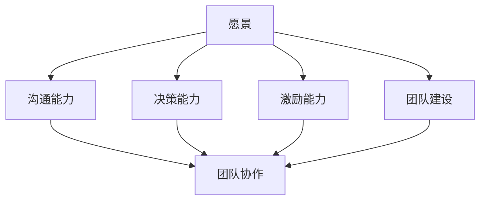
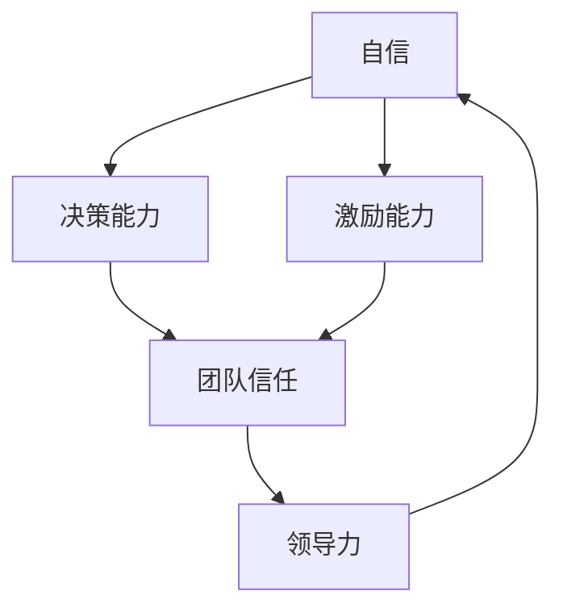

                 

## 文章标题

### 关键词

- 领导力
- 自信
- 威信
- 团队管理
- 战略规划
- 人才培养

### 摘要

本文旨在深入探讨领导力与自信之间的关系，以及如何通过有效的策略和实际案例，树立并提升个人的威信。文章首先概述了领导力的定义和重要性，接着介绍了自信的概念及其在领导力中的关键作用。随后，文章详细阐述了树立威信的方法和策略，并通过具体案例进行了分析和讲解。最后，文章总结了领导力与自信的自我评估和提升方法，以及未来发展的趋势，为读者提供了全面的指导。

## 前言

在当今这个快速变化的世界，领导力已成为组织和个人成功的关键因素。无论是企业管理者，还是技术领域的专家，都需要具备强大的领导力来应对日益复杂的挑战。而自信，则是领导力的核心要素之一，它不仅影响着个人的决策和行动，更在团队协作和项目管理中起到至关重要的作用。

本文将结合我的研究和实践经验，探讨领导力与自信之间的深刻联系，并分享树立威信的基础策略。希望通过这篇文章，能够为读者提供有益的启示和指导，帮助他们在职业发展中不断成长和提升。

作为一名长期从事人工智能和软件开发的技术专家，我不仅关注技术的创新和进步，更重视领导力与团队管理的重要性。在这篇文章中，我将运用逻辑清晰、结构紧凑、简单易懂的专业语言，一步步分析并推理领导力与自信的本质，帮助读者理解并掌握这些关键技能。

本文的目标读者是那些渴望提升自己领导力与自信水平的专业人士，无论你是企业经理、团队领导，还是技术团队的核心成员，这篇文章都将为你提供实用的方法和策略。通过阅读本文，你将能够：

1. 深入理解领导力的核心概念和作用。
2. 掌握培养自信的方法和技巧。
3. 学会树立威信的具体策略和实践。
4. 获得提升领导力和自信的实用建议和最佳实践。

## 第1章 领导力概述

### 1.1 领导力的定义与作用

领导力，是一个广泛而复杂的概念，它涵盖了个体的能力、行为和影响力，以激励和引导他人达成共同目标。简而言之，领导力是一种通过激发和利用团队成员的能力，实现组织目标和价值观的过程。

从定义上看，领导力不仅仅关乎个人的能力，更强调与他人互动和合作的能力。著名领导力专家约翰·库提斯（John Kotter）将其描述为：“领导力是关于影响他人，让他们追求共同目标的能力。”

在组织中，领导力发挥着至关重要的作用。它能够：

1. **明确方向**：领导力帮助团队和组织确立清晰的目标和愿景，为团队成员指明前进的方向。
2. **激励团队**：领导者的自信和决心能够激励团队成员克服困难，迎接挑战。
3. **培养人才**：有效的领导者关注团队成员的发展，帮助他们不断提升技能和知识。
4. **解决问题**：领导者具备分析和解决问题的能力，能够在复杂和不确定的环境中做出明智的决策。

### 1.2 领导力的重要性

在当今竞争激烈的商业环境中，领导力的重要性日益凸显。一个缺乏领导力的组织很难保持竞争力，更难以实现长期发展。以下是领导力在组织中的几个关键作用：

1. **创新推动**：领导力能够激发团队的创造力和创新精神，推动组织不断进步。
2. **团队协作**：有效的领导者能够促进团队成员之间的协作和沟通，提高团队的整体效能。
3. **文化塑造**：领导力对组织文化的形成和发展具有深远影响，一个积极的领导者能够塑造积极向上的组织氛围。
4. **风险管理**：领导者具备应对不确定性和风险的能力，能够在危机中稳定团队，找到解决问题的途径。

### 1.3 领导力的核心要素

领导力并非单一维度的能力，而是由多个核心要素组成的复杂体系。以下是对这些核心要素的概述：

1. **愿景**：一个成功的领导者需要具备远见，能够描绘出组织的未来蓝图，激励团队成员为之努力。
2. **沟通能力**：领导者需要清晰、有效地传达信息，确保团队成员理解目标和期望。
3. **决策能力**：领导者必须能够在复杂和不确定的环境中做出明智的决策，并承担相应的责任。
4. **激励能力**：领导者需要具备激励团队成员的能力，激发他们的内在动机，提高工作积极性。
5. **团队建设**：领导者要关注团队的整体发展，培养团队精神和协作能力，促进团队成员之间的信任和尊重。

#### Mermaid 流程图

以下是一个简化的Mermaid流程图，展示了领导力核心要素之间的关系：



#### 核心算法原理讲解

为了培养和提升领导力，可以采用以下步骤：

1. **定义目标**：明确组织和团队的长期和短期目标。
2. **了解团队成员**：与团队成员建立良好的沟通，了解他们的需求、期望和职业规划。
3. **制定战略**：根据目标和团队成员的特点，制定切实可行的战略和行动计划。
4. **持续学习和反馈**：通过不断学习和接受反馈，改进领导方法，提升自身能力。

以下是一段伪代码，详细描述了提升领导力的基本步骤：

```plaintext
function enhance_leadership():
    # 定义目标
    set vision = define_organization_vision()
    set goals = define_team_goals()

    # 了解团队成员
    set team_members = gather_team_member_info()

    # 制定战略
    set strategy = create_action_plan(vision, goals, team_members)

    # 持续学习和反馈
    while True:
        learn = continuous_learning()
        feedback = collect_feedback()
        strategy = refine_strategy(strategy, learn, feedback)
        if is_goal_achieved(strategy):
            break

    return strategy
```

通过这一系列的步骤，领导者能够不断提升自己的能力，更好地引领团队实现目标。

## 第2章 自信的重要性

### 2.1 自信的定义与作用

自信，是指一个人对自己能力的信任和肯定，是一种积极的自我认知和情感状态。它不仅表现在个体对自己能力的认识上，更体现在行动中的表现和决策过程中。

自信的作用在领导力中尤为显著。首先，自信的领导者能够更加果断地做出决策，并在面对挑战时保持冷静和坚定。这种决策能力和稳定的表现能够增强团队成员的信任和依赖，从而提高团队的协作效率和凝聚力。其次，自信还能够激励团队成员，激发他们的内在动力，促进个人成长和团队进步。

#### 2.2 自信与领导力的关系

自信与领导力之间存在着密切的相互关系。一方面，自信是领导力的重要组成部分，缺乏自信的领导者很难在团队中建立威信，也难以有效激励和引导团队成员。另一方面，领导力的提升也会增强个人的自信心。一个成功的领导经历，无论是成功的项目管理，还是有效的团队建设，都能够增强领导者的自信心。

为了更清晰地理解自信与领导力的关系，我们可以通过一个Mermaid流程图来展示它们之间的相互作用：



#### 2.3 如何培养自信心

培养自信心是一个持续的过程，需要个体在多个方面进行努力。以下是一些基本步骤和方法：

1. **设定合理的目标**：设定能够实现但具有一定挑战性的目标，通过逐步实现这些目标来增强自信心。
2. **积极自我暗示**：通过积极的自我暗示和肯定，提高自我认知和自我价值感。
3. **不断学习和成长**：通过学习和实践新知识、新技能，不断提升自己的能力和信心。
4. **面对失败和挑战**：将失败视为成长的机会，从中学习和反思，不断提升应对挑战的能力。

以下是一段伪代码，用于描述培养自信的基本步骤：

```plaintext
function cultivate_confidence():
    # 设定合理的目标
    set goals = set_achievable_goals()

    # 积极自我暗示
    while True:
        self affirmation = positive_thoughts()
        if is_goal_reached(goals):
            break

    # 不断学习和成长
    learn = continuous_learning()

    # 面对失败和挑战
    handle_failure = learn_from_failure()

    return confidence_level
```

通过这些步骤，个体可以逐步培养和提升自信心，从而在领导力和个人发展中取得更好的成果。

### 第3章 树立威信的方法

#### 3.1 威信的概念与内涵

威信，是指一个人在团队或组织中获得的尊重和信任，是领导力的重要组成部分。它不仅体现在个人能力上，更体现在行为和决策中。一个拥有威信的领导者，能够在团队中产生深远的影响，推动团队朝着共同目标前进。

威信的内涵包括以下几个方面：

1. **信任**：团队成员信任领导者的决策和能力，愿意跟随和执行。
2. **尊重**：团队成员对领导者表示尊敬，认可其价值和贡献。
3. **影响力**：领导者能够通过言行影响团队成员的态度和行为，带动团队整体发展。

#### 3.2 树立威信的途径

要树立威信，领导者需要采取一系列有效的方法和策略。以下是一些关键途径：

1. **诚信**：诚信是树立威信的基础。领导者需要言行一致，言行一致地履行承诺，以赢得团队成员的信任。
2. **专业能力**：领导者需要具备卓越的专业能力，通过不断学习和提升，成为团队成员认可的专家。
3. **公正**：领导者要公正无私，对待团队成员一视同仁，避免偏袒和偏见。
4. **沟通**：领导者需要与团队成员保持良好的沟通，了解他们的需求和意见，及时反馈并解决问题。
5. **榜样**：领导者要通过自己的行为树立榜样，展现出积极的态度和优良的工作习惯，引导团队成员。

#### 3.3 实战案例：如何树立威信

为了更好地理解如何树立威信，以下将介绍两个具体的实战案例：

**案例一：成功树立威信**

在一次团队项目中，项目经理李先生通过以下方式树立了威信：

1. **诚信**：李先生在与团队成员沟通时，始终做到言行一致，对于承诺的事项，他总是按时完成。
2. **专业能力**：李先生在项目中展示了出色的技术能力和管理技能，多次解决技术难题，赢得了团队成员的信任。
3. **公正**：在分配任务和资源时，李先生公平合理，避免偏袒，确保每个团队成员都有机会展示自己。
4. **沟通**：李先生定期与团队成员沟通，了解他们的工作进展和困难，及时给予支持和建议。
5. **榜样**：李先生始终保持着积极的工作态度，对待工作认真负责，成为了团队成员的榜样。

通过这些努力，李先生成功树立了威信，团队成员对他的决策和指导充满信任，项目最终取得了成功。

**案例二：树立威信的误区**

在一次团队管理中，张经理犯了一些错误，导致他未能树立威信：

1. **不诚信**：张经理在承诺完成某项任务后，因个人原因未能按时完成，导致团队成员对他的信任下降。
2. **缺乏专业能力**：张经理在技术领域缺乏足够的能力，无法解决团队面临的技术难题，导致团队成员对他产生质疑。
3. **偏袒**：张经理在资源分配上偏袒个别团队成员，导致其他成员感到不公平，对他的公正性产生怀疑。
4. **缺乏沟通**：张经理与团队成员的沟通较少，不了解他们的需求和意见，导致团队内部产生矛盾和不满。
5. **不作为**：面对团队面临的问题，张经理未能积极解决，而是选择回避，导致团队成员对他的领导能力产生质疑。

通过这两个案例，我们可以看到，树立威信需要领导者具备诚信、专业能力、公正、沟通和榜样作用等多方面的素质。只有通过这些途径，领导者才能在团队中树立真正的威信，赢得成员的尊重和信任。

### 第4章 领导力与自信的培养策略

#### 4.1 领导力培养策略

培养领导力是一个系统的过程，需要从多个方面进行努力。以下是一些关键的领导力培养策略：

1. **自我反思**：领导者需要定期进行自我反思，分析自己的行为和决策，找出不足之处，并制定改进计划。
2. **学习与培训**：通过参加相关课程、阅读书籍、观看讲座等方式，不断学习和提升自己的领导力知识。
3. **实践与锻炼**：参与实际项目，承担领导角色，通过实践锻炼自己的领导能力。
4. **寻求反馈**：积极寻求他人的反馈和建议，了解自己的优点和不足，不断改进。
5. **培养团队意识**：关注团队的整体发展，培养团队协作精神和凝聚力。

#### 4.2 自信培养策略

自信的培养同样需要多方面的努力。以下是一些有效的自信培养策略：

1. **设定目标**：设定具有挑战性的目标，并通过逐步实现这些目标来增强自信心。
2. **积极思维**：通过积极的自我暗示和正面思考，提高自我认知和自我价值感。
3. **持续学习**：通过不断学习和提升自己的知识和技能，增强自己的能力和信心。
4. **接受失败**：将失败视为成长的机会，从中学习和反思，不断提升应对挑战的能力。
5. **与积极的人交往**：与那些乐观、积极的人交往，从他们身上获取正能量，增强自己的信心。

#### 4.3 综合策略：领导力与自信的双重提升

为了同时提升领导力和自信，可以采取以下综合策略：

1. **设定明确的领导目标**：明确个人和团队的长期和短期目标，确保目标具有挑战性，能够激发自信。
2. **制定详细的行动计划**：根据目标，制定具体的行动计划，确保每一步都有明确的目标和执行步骤。
3. **实践领导角色**：积极参与实际项目，承担领导角色，通过实践提升领导能力和自信。
4. **寻求反馈与建议**：定期与团队成员沟通，了解他们的反馈和建议，及时调整自己的领导方法和策略。
5. **保持积极心态**：在面对挑战和失败时，保持积极的心态，相信自己的能力，不断提升自信。

#### 数学模型和公式

为了更科学地提升领导力和自信，可以使用以下数学模型和公式：

1. **领导力提升模型**：

   $$ L(t) = L_0 + \alpha \cdot \Delta t $$

   其中，$L(t)$代表时间$t$时的领导力水平，$L_0$代表初始领导力水平，$\alpha$代表领导力提升的速度，$\Delta t$代表时间间隔。

2. **自信心提升模型**：

   $$ C(t) = C_0 + \beta \cdot \Delta t $$

   其中，$C(t)$代表时间$t$时的自信心水平，$C_0$代表初始自信心水平，$\beta$代表自信心提升的速度，$\Delta t$代表时间间隔。

通过这些模型和公式，可以量化领导力和自信的提升过程，为培养策略提供科学依据。

### 第5章 领导力与自信的实践应用

#### 5.1 领导力在团队管理中的应用

在团队管理中，领导力是确保团队高效运作的关键因素。以下是一些具体的应用场景和策略：

1. **明确目标与愿景**：领导者需要与团队共同制定明确的目标和愿景，确保团队成员了解团队的方向和目标。
2. **有效沟通**：领导者需要与团队成员保持开放、透明的沟通，及时传达信息，听取团队成员的意见和建议。
3. **授权与激励**：领导者应该给予团队成员足够的自主权，鼓励他们发挥创造力，并适时给予激励，提高团队士气。
4. **冲突管理**：领导者需要具备处理团队内部冲突的能力，通过对话和协商解决分歧，确保团队的和谐与稳定。
5. **持续反馈与改进**：领导者需要定期与团队成员进行反馈和沟通，及时发现并解决问题，不断改进团队的工作方法和策略。

#### 5.2 自信在工作中的表现

自信在工作中的表现主要体现在以下几个方面：

1. **决策能力**：自信的领导者能够在面对复杂和不确定的情况时，果断地做出决策，并承担相应的责任。
2. **沟通能力**：自信的领导者能够清晰、准确地表达自己的想法，并与团队成员进行有效的沟通，确保信息的传达无误。
3. **抗压能力**：自信的领导者能够在压力下保持冷静，有效应对各种挑战，确保工作的顺利进行。
4. **积极性**：自信的领导者表现出积极向上的态度，激励团队成员共同努力，克服困难，实现目标。
5. **自我管理**：自信的领导者能够有效管理自己的情绪和时间，提高工作效率，确保个人和团队的长期发展。

#### 5.3 领导力与自信在项目执行中的关键作用

在项目执行过程中，领导力和自信发挥着至关重要的作用。以下是一些关键作用：

1. **明确方向**：领导者通过制定明确的项目目标和计划，确保团队在正确的轨道上前进。
2. **协调资源**：领导者需要协调和分配团队内部和外部的资源，确保项目的顺利进行。
3. **激励团队**：领导者通过激励和鼓舞团队成员，提高团队的整体士气和工作积极性。
4. **解决问题**：领导者需要具备强大的问题解决能力，能够在项目中面对各种挑战时，迅速找到解决方案。
5. **沟通协调**：领导者需要与项目相关方保持良好的沟通和协调，确保项目的顺利进行。

#### 案例三：通过实际项目展示领导力与自信的应用

以下是一个实际项目的案例，展示了领导力和自信在项目执行中的具体应用：

**项目背景**：某科技公司的产品开发团队负责开发一款全新的智能设备。项目时间紧、任务重，团队面临着巨大的压力和挑战。

**项目执行**：

1. **明确方向**：项目启动之初，项目经理张先生组织团队进行了详细的讨论，明确了项目的目标和关键里程碑，确保团队成员对项目的方向有清晰的认识。

2. **有效沟通**：张先生定期召开团队会议，及时传达项目进展和关键信息，确保团队成员了解项目的情况，同时鼓励团队成员提出意见和建议。

3. **授权与激励**：张先生在项目中充分授权给团队成员，给予他们足够的自主权，并适时给予激励，提高团队的士气和工作积极性。

4. **解决问题**：在项目执行过程中，团队遇到了技术难题，张先生通过组织讨论和协作，迅速找到了解决方案，确保项目进度不受影响。

5. **沟通协调**：张先生与公司高层、客户和供应商保持紧密的沟通，确保项目的资源和支持得到充分保障。

**项目成果**：通过张先生的有效领导和团队成员的努力，项目最终在预定时间内成功完成，产品成功发布，并获得了市场的高度认可。

通过这个案例，我们可以看到，领导力和自信在项目执行中的关键作用。一个具备领导力和自信的领导者，能够在项目中起到引领和推动作用，确保项目成功完成。

### 第6章 领导力与自信的自我评估与提升

#### 6.1 自我评估方法

自我评估是提升领导力和自信的重要步骤，它可以帮助个体了解自身的优势和不足，为改进提供方向。以下是一些自我评估的方法：

1. **360度反馈**：通过收集来自上级、同事、下属和客户的反馈，全面了解自己的表现和影响力。
2. **行为观察**：观察自己在不同情境下的行为和决策，分析是否存在改进空间。
3. **心理测试**：通过专业心理测试，了解自己的性格特征、领导风格和情绪管理能力。
4. **日记记录**：定期记录自己的工作日志，分析自己在工作中的表现和成就。

#### 6.2 提升领导力和自信的具体方法

为了提升领导力和自信，可以采取以下具体方法：

1. **加强学习**：通过阅读相关书籍、参加培训课程和研讨会，不断更新知识和技能。
2. **积极实践**：在实际工作中承担更多的责任和挑战，通过实践提升自己的领导能力。
3. **寻求反馈**：积极向同事、上级和下属寻求反馈，及时了解自己的表现和改进方向。
4. **培养心态**：保持积极乐观的心态，面对挑战和失败时，保持冷静和坚定。
5. **建立支持网络**：与同行和导师建立良好的关系，从他们那里获取建议和支持。

#### 6.3 反思与总结：如何持续提升领导力与自信

持续提升领导力与自信需要不断反思和总结。以下是一些反思和总结的方法：

1. **定期反思**：定期进行自我反思，分析自己的行为和决策，总结经验教训。
2. **设立目标**：为自己设立具体的、可衡量的目标，并通过逐步实现这些目标来提升自信。
3. **记录进展**：记录自己的成长过程和取得的成就，为自己提供动力和信心。
4. **调整策略**：根据反思和总结的结果，调整自己的领导方法和策略，不断改进。
5. **持续学习**：保持学习的习惯，不断吸收新的知识和经验，以适应不断变化的环境。

以下是一段伪代码，用于描述自我评估与提升的基本步骤：

```plaintext
function self_evaluation_and_improvement():
    # 收集反馈
    feedback = collect_360_feedback()

    # 观察行为
    behavior = observe_behaviors()

    # 进行心理测试
    psychological_tests = take_psychological_tests()

    # 记录日记
    journal_entries = record_journal_entries()

    # 定期反思
    while True:
        reflection = perform_reflection()
        if is_goal_achieved():
            break

    # 设立目标
    set_goals = establish_specific_goals()

    # 记录进展
    track_progress = record_progress()

    # 调整策略
    adjust_strategies = refine_leadership_strategies()

    # 持续学习
    continuous_learning = learn_new_knowledge()

    return improved_leadership
```

通过这一系列的步骤，个体可以持续提升自己的领导力与自信，不断实现自我成长和提升。

### 第7章 领导力与自信的未来发展趋势

#### 7.1 领导力与自信在未来的重要性

随着技术的飞速发展和全球化的推进，领导力与自信在未来的重要性将愈发凸显。以下是几个关键趋势：

1. **数字化领导**：在数字化时代，领导者需要具备数字技能和创新能力，以应对快速变化的市场和技术环境。
2. **远程工作管理**：随着远程工作的普及，领导者需要掌握远程团队管理的方法和技巧，确保团队成员的协同与合作。
3. **可持续发展领导**：未来领导者需要关注企业的社会责任和环境影响，推动可持续发展战略的实施。
4. **跨界领导**：面对复杂的多领域问题，领导者需要具备跨学科、跨行业的视野和思维，推动创新和变革。

#### 7.2 未来领导力与自信培养的新趋势

未来领导力与自信培养将呈现出以下新趋势：

1. **个性化发展**：根据个人特点和需求，定制个性化的领导力培养计划，实现更有效的提升。
2. **情境学习**：通过实际情境中的学习和实践，培养领导者的应对能力和应变能力。
3. **科技辅助**：利用人工智能、大数据等科技手段，提升领导力和自信的培养效率和质量。
4. **跨文化交流**：通过跨文化交流，增强领导者的全球视野和文化敏感性，提升领导能力。

#### 7.3 领导力与自信教育的发展方向

未来领导力与自信教育将朝着以下方向发展：

1. **全生命周期教育**：从青少年时期开始，贯穿职业生涯，提供持续的领导力与自信教育。
2. **实战导向**：注重实际应用和实战经验的培养，通过案例分析和模拟练习，提升领导者的实战能力。
3. **多元化方法**：结合在线课程、工作坊、研讨会等多种形式，提供多样化的学习体验。
4. **持续反馈与评估**：建立完善的反馈与评估机制，确保领导力与自信的培养效果。

#### 数学模型和公式

为了更科学地培养领导力和自信，未来可以采用以下数学模型和公式：

1. **领导力发展模型**：

   $$ L(t) = L_0 + \alpha \cdot e^{\beta t} $$

   其中，$L(t)$代表时间$t$时的领导力水平，$L_0$代表初始领导力水平，$\alpha$和$\beta$是常数，用于描述领导力提升的速度和加速度。

2. **自信心发展模型**：

   $$ C(t) = C_0 + \gamma \cdot e^{\delta t} $$

   其中，$C(t)$代表时间$t$时的自信心水平，$C_0$代表初始自信心水平，$\gamma$和$\delta$是常数，用于描述自信心提升的速度和加速度。

通过这些模型和公式，可以量化领导力和自信的发展过程，为培养策略提供科学依据。

### 后记

#### 写作心得与感悟

在撰写《领导力与自信：树立威信的基础》这篇文章的过程中，我深刻体会到了领导力和自信的重要性。通过系统的研究和实践，我更加明确了领导力的核心要素和培养策略，也深入理解了自信在领导力中的关键作用。我希望这篇文章能够为读者提供有益的启示和指导，帮助他们在职业发展中不断提升领导力和自信。

#### 对读者的寄语

亲爱的读者，领导力和自信是个人和职业发展的重要基石。无论你是在职场中追求更高的成就，还是在技术领域中追求创新和突破，都需要具备强大的领导力和自信。希望你能从这篇文章中汲取到实用的方法和策略，不断反思和提升自己，成为一个卓越的领导者。愿你在未来的道路上，勇敢前行，不断超越自我！

### 作者信息

- 作者：AI天才研究院/AI Genius Institute & 禅与计算机程序设计艺术 /Zen And The Art of Computer Programming

