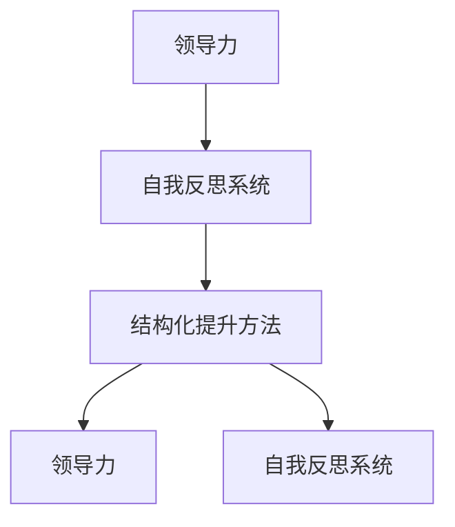

                 

## 引言

### 领导力的重要性

在当今快速变革的商业环境中，领导力的重要性愈发凸显。有效的领导力不仅能够激发团队成员的潜力，还能推动整个组织的创新与成长。领导者不仅是战略的制定者，更是团队的灵魂和方向的指引者。随着竞争的加剧和技术的迅猛发展，领导者需要不断更新自身的知识和技能，以应对日益复杂的挑战。

### 自我反思系统的理论基础

自我反思系统是领导者持续成长的重要工具。通过自我反思，领导者能够深入了解自身的优点和不足，从而进行有针对性的改进。自我反思不仅是一种自我提升的手段，更是领导者自我认知、自我调整和自我发展的过程。现代心理学和管理学的研究表明，自我反思有助于提升领导力，增强决策能力，以及促进个人和组织的发展。

### 结构化提升方法的必要性

在领导力和自我反思系统的提升过程中，结构化方法显得尤为重要。结构化方法能够帮助领导者系统性地识别问题、分析原因、制定策略，并确保实施过程中的可操作性和有效性。通过结构化提升方法，领导者可以避免盲目行动，提高工作效率，确保领导力提升的持续性和稳定性。

## 领导力概述

### 领导力的定义与发展历程

领导力，广义上是指一个人或团体在特定情境中，通过影响力、激励和协调，引导和推动他人共同达成目标的能力。其定义随着时代的变化而不断演变。传统领导力更多强调权威和控制，而现代领导力则更注重合作、共享和赋能。

领导力的发展历程可以追溯到古代的军事领导、宗教领导，以及工业革命后的企业领导。20世纪末以来，随着组织结构和商业环境的复杂化，领导力研究逐渐从单一维度向多维度发展，涵盖了情感智慧、变革领导力、全球领导力等多个方面。

### 传统领导力与现代领导力的差异

传统领导力强调权威和命令，领导者通常是决策的中心，员工更多的是执行者。而现代领导力则倡导平等和协作，领导者更多是团队成员的引导者和支持者。现代领导力强调领导者需要具备倾听、沟通、激励等多方面的能力，以及解决复杂问题和应对不确定性的能力。

### 领导力的要素

领导力的要素可以分为个人品质、行为能力和情境适应性三个方面。

1. **个人品质**：包括诚实、正直、自信、自控、坚韧、同情心等。这些品质是领导者赢得员工信任和尊重的基础。
2. **行为能力**：包括决策能力、沟通能力、团队建设能力、冲突管理能力等。这些能力决定了领导者能否有效地指导和管理团队。
3. **情境适应性**：领导者需要具备在不同情境下灵活调整自身行为和策略的能力。这要求领导者能够快速适应变化，把握机遇，应对挑战。

## 自我反思系统原理

### 自我反思的概念与重要性

自我反思是指个体在心理上对自身行为、思维和情感进行审视、分析、评价和调整的过程。通过自我反思，个体能够深入了解自己的内在世界，发现自身的长处和不足，从而实现自我提升和自我完善。

自我反思的重要性体现在以下几个方面：

1. **个人成长**：自我反思有助于个体认识自我，了解自己的需求、兴趣、价值观和目标，从而更好地规划个人发展路径。
2. **问题解决**：通过自我反思，个体能够识别和反思自身存在的问题和挑战，寻找解决方案，从而提高问题解决能力和决策水平。
3. **情感调节**：自我反思有助于个体理解和调节自己的情绪，减少焦虑和压力，提高心理韧性和幸福感。

### 自我反思的过程

自我反思的过程可以分为三个主要阶段：反思前的准备、反思中的关键步骤和反思后的行动规划。

#### 反思前的准备

在开始自我反思之前，个体需要做好充分的准备。这包括以下几个方面：

1. **明确反思目标**：个体需要明确自我反思的目的，例如解决某个问题、提升某个能力或改善某种行为。
2. **收集相关信息**：个体需要收集与反思目标相关的信息和数据，包括自己的行为记录、他人的反馈、工作成果等。
3. **创设适宜环境**：个体需要在安静、舒适的环境中开展自我反思，以减少外部干扰和压力。

#### 反思中的关键步骤

在自我反思过程中，个体需要遵循以下关键步骤：

1. **审视行为**：个体需要仔细审视自己的行为，包括具体的行为表现、行为结果以及行为背后的动机。
2. **分析原因**：个体需要分析自己行为的原因，包括个人特质、情境因素、他人影响等。
3. **评估效果**：个体需要评估自己的行为对个人和团队的影响，包括积极的和消极的后果。
4. **识别问题**：个体需要识别自己行为中的问题和不足，并分析其根源。

#### 反思后的行动规划

在完成自我反思后，个体需要制定具体的行动规划，以实现自我提升和改进。这包括以下几个方面：

1. **设定目标**：个体需要设定明确的个人发展目标，并制定可行的行动计划。
2. **制定策略**：个体需要制定实现目标的策略和方法，包括学习新知识、提升技能、改变行为习惯等。
3. **实施行动**：个体需要按照行动计划和策略，逐步实施自我提升计划，并持续跟踪和调整。
4. **反思与反馈**：个体需要定期进行反思和总结，收集他人的反馈意见，以持续改进自我。

### 自我反思的方法

自我反思的方法多种多样，常见的包括以下几种：

1. **日记法**：个体通过撰写日记，记录自己的行为、感受和思考，进行自我反思。
2. **同伴反馈**：个体通过与同事、朋友或导师进行交流，获取他人的反馈意见，进行自我反思。
3. **教练辅导**：个体通过与专业教练进行一对一辅导，深入探讨自己的行为和问题，进行自我反思。

## 结构化提升方法

### 提升领导力的步骤

提升领导力是一个系统性的过程，需要遵循以下步骤：

1. **自我评估**：领导者需要对自己的领导能力进行全面评估，包括个人品质、行为能力和情境适应性等方面。
2. **制定提升计划**：根据自我评估的结果，制定具体的提升计划，包括目标设定、策略制定、资源分配等。
3. **实施提升计划**：按照提升计划，逐步实施领导力提升行动，包括学习新知识、提升技能、改变行为习惯等。
4. **反馈与调整**：在实施过程中，领导者需要不断收集反馈意见，进行反思和调整，以确保提升计划的实施效果。

### 提升自我反思系统的步骤

提升自我反思系统也是一项重要任务，需要遵循以下步骤：

1. **建立自我反思习惯**：领导者需要养成定期自我反思的习惯，确保自我反思的持续性和有效性。
2. **提高自我反思能力**：领导者需要通过学习和实践，提高自我反思的能力，包括分析问题的能力、批判性思维能力等。
3. **运用自我反思工具**：领导者可以运用各种自我反思工具，如日记法、同伴反馈、教练辅导等，提高自我反思的效果。

### 结构化提升方法的优势与挑战

结构化提升方法具有以下优势：

1. **系统性**：结构化提升方法能够帮助领导者系统地识别问题、制定策略和实施行动，确保提升过程的有序和高效。
2. **可操作性**：结构化提升方法提供了具体的步骤和工具，使领导者能够轻松操作，实现领导力的持续提升。

然而，结构化提升方法也面临一些挑战：

1. **适应性**：不同的领导者和组织情境可能需要不同的提升方法，如何灵活运用结构化提升方法，确保其适应性，是领导者需要面对的挑战。
2. **持续性**：领导力的提升需要长期的持续努力，如何保持提升的动力和持续性，是领导者需要克服的挑战。

## 实战案例分析

### 案例一：如何提升领导力

#### 案例背景

某公司技术总监李先生在领导团队的过程中遇到了一些困难，如团队成员工作积极性不高、项目进度滞后等。为了提升领导力，李先生决定进行系统性的提升。

#### 实施步骤

1. **自我评估**：李先生通过问卷调查、同事反馈等方式，对自己的领导能力进行了全面评估，识别出沟通能力不足、决策迟缓等问题。
2. **制定提升计划**：根据评估结果，李先生制定了详细的提升计划，包括参加领导力培训、阅读相关书籍、改善沟通方式等。
3. **实施提升计划**：李先生按照提升计划，逐步实施行动，如参加领导力培训、与团队成员定期沟通、主动倾听员工意见等。
4. **反馈与调整**：在实施过程中，李先生不断收集反馈意见，进行反思和调整，如改进沟通技巧、加强团队协作等。

#### 效果评估

通过一段时间的努力，李先生发现团队的工作积极性有了明显提升，项目进度也得到了显著改善。此外，李先生也获得了同事和下属的认可，领导力得到了有效提升。

### 案例二：如何运用自我反思系统

#### 案例背景

某公司项目经理王女士在项目执行过程中遇到了一些问题，如项目延期、质量不符合预期等。为了提升自我反思能力，王女士决定运用自我反思系统。

#### 实施步骤

1. **建立自我反思习惯**：王女士每天晚上花15分钟时间进行自我反思，记录项目中的成功和失败经验。
2. **收集反馈意见**：王女士定期与团队成员、客户进行沟通，收集反馈意见，了解项目的优点和不足。
3. **分析原因**：王女士对收集到的信息进行分析，找出项目中的问题和根本原因。
4. **制定改进措施**：根据分析结果，王女士制定了具体的改进措施，如优化项目计划、加强团队协作等。

#### 效果评估

通过一段时间的自我反思，王女士发现项目质量和进度有了显著提升。同时，王女士的自我反思能力也得到了显著提高，能够更加从容地应对项目中的挑战。

### 案例三：结构化提升方法在实际中的应用

#### 案例背景

某公司CEO张先生在经营公司过程中遇到了一些挑战，如市场竞争加剧、员工流失等。为了提升领导力和管理水平，张先生决定运用结构化提升方法。

#### 实施步骤

1. **自我评估**：张先生通过360度评估、领导力测评等方式，对自己的领导能力和管理水平进行了全面评估。
2. **制定提升计划**：根据评估结果，张先生制定了详细的提升计划，包括领导力培训、管理知识学习、团队建设等。
3. **实施提升计划**：张先生按照提升计划，逐步实施行动，如参加领导力培训、学习管理知识、组织团队建设活动等。
4. **反馈与调整**：在实施过程中，张先生不断收集反馈意见，进行反思和调整，如改进管理方式、优化公司文化等。

#### 效果评估

通过一段时间的努力，张先生发现公司的运营状况有了明显改善，市场竞争能力得到了提升，员工流失率也有所降低。张先生的领导力和管理水平也得到了显著提升。

## 领导力与自我反思系统的互动

### 自我反思系统对领导力提升的影响

自我反思系统对领导力提升有着重要的影响。通过自我反思，领导者能够深入了解自身的优点和不足，从而有针对性地进行改进。自我反思有助于领导者提高自我认知，增强自我调节能力，提高决策质量和团队管理水平。

### 领导力提升如何促进自我反思系统的发展

领导力提升能够促进自我反思系统的发展。随着领导力的提升，领导者会更加重视自我反思的重要性，逐渐形成自我反思的习惯和体系。同时，领导力的提升也为领导者提供了更多的资源和机会，如培训、教练辅导等，以进一步促进自我反思系统的完善。

### 领导力与自我反思系统的协同作用

领导力与自我反思系统之间存在着协同作用。有效的领导力能够为自我反思系统提供良好的环境和条件，如开放的文化、支持和鼓励等。而完善的自我反思系统则能够为领导力提升提供持续的动力和反馈，使领导者在实践中不断成长和进步。

### 协同作用的原理

领导力与自我反思系统的协同作用基于以下几个原理：

1. **相互促进**：领导力和自我反思系统相互促进，共同推动个人和组织的成长。
2. **动态调整**：领导力和自我反思系统在不同的情境下动态调整，以适应不断变化的环境和需求。
3. **持续发展**：领导力和自我反思系统持续发展，通过不断学习和实践，实现个人和组织的持续提升。

## 持续提升的策略与技巧

### 领导力提升的策略

1. **持续学习**：领导者需要保持学习的热情，不断更新知识和技能，以适应不断变化的商业环境。
2. **培养团队协作精神**：领导者需要注重团队协作，培养员工的合作精神和团队意识，提高团队的整体绩效。
3. **关注员工需求**：领导者需要关注员工的需求，关心员工的成长和发展，提高员工的满意度和忠诚度。
4. **勇于面对挑战**：领导者需要勇于面对挑战，敢于承担风险，带领团队克服困难和挫折。

### 自我反思系统的提升策略

1. **建立反思文化**：组织需要建立反思文化，鼓励员工进行自我反思，形成良好的反思氛围。
2. **提供反思资源**：组织需要提供必要的反思资源，如反思工具、反思培训等，帮助员工提高反思能力。
3. **定期进行反思**：员工需要定期进行反思，总结工作中的成功和失败经验，不断提高自己的能力和素质。
4. **鼓励开放沟通**：组织需要鼓励开放沟通，建立有效的沟通渠道，使员工能够畅所欲言，表达自己的反思和意见。

## 结论与展望

### 总结提升领导力的关键要素

提升领导力的关键要素包括持续学习、团队协作、关注员工需求、勇于面对挑战等。领导者需要在这些方面不断努力，以提高自身的领导能力和团队绩效。

### 展望未来的领导力发展趋势

未来的领导力发展趋势将更加注重个性化和多元化。随着技术的进步和全球化的发展，领导者需要具备跨文化沟通和协调能力，以及适应快速变化的能力。同时，领导力的发展也将更加注重情感智慧和人文关怀，以实现个人和组织的可持续发展。

## 附录：核心概念与联系

### Mermaid流程图

以下是一个简化的Mermaid流程图，展示了领导力、自我反思系统和结构化提升方法三者之间的相互作用。



### 自我反思系统中的关键算法

以下是一个简化的伪代码，用于描述自我反思系统中的关键算法。

```python
def self_reflection(data):
    # 初始化变量
    insights = []
    improvements = []

    # 数据预处理
    processed_data = preprocess(data)

    # 分析数据
    for item in processed_data:
        insight = analyze_item(item)
        insights.append(insight)

    # 识别改进点
    for insight in insights:
        improvement = identify_improvement(insight)
        improvements.append(improvement)

    # 反思与反馈
    feedback = provide_feedback(improvements)

    # 更新自我认知
    update_self_awareness(feedback)

    return insights, improvements, feedback
```

### 领导力提升中的关键数学模型

以下是一个简化的数学模型，用于描述领导力提升中的权重分配和优化目标函数。

```latex
\begin{align*}
\min_{x} & \sum_{i=1}^{n} w_i (x_i - x_{i, \text{target}})^2 \\
\text{subject to} & \\
& x_i \geq 0, \quad \forall i \\
& \sum_{i=1}^{n} x_i = 1
\end{align*}
```

在这个模型中，$x_i$表示第$i$个能力提升目标的权重，$w_i$表示第$i$个目标的权重系数，$x_{i, \text{target}}$表示第$i$个目标的理想状态。

### 实际案例

#### 案例背景

某公司新上任的CEO王先生在领导公司过程中遇到了一些问题，如员工士气低落、部门间沟通不畅等。为了提升领导力和管理水平，王先生决定运用结构化提升方法。

#### 实施步骤

1. **自我评估**：王先生通过360度评估、领导力测评等方式，对自己的领导能力和管理水平进行了全面评估，识别出沟通能力不足、决策迟缓等问题。
2. **制定提升计划**：根据评估结果，王先生制定了详细的提升计划，包括领导力培训、管理知识学习、团队建设等。
3. **实施提升计划**：王先生按照提升计划，逐步实施行动，如参加领导力培训、学习管理知识、组织团队建设活动等。
4. **反馈与调整**：在实施过程中，王先生不断收集反馈意见，进行反思和调整，如改进沟通技巧、加强团队协作等。

#### 效果评估

通过一段时间的努力，王先生发现公司的运营状况有了明显改善，员工士气得到了显著提升，部门间的沟通也变得更加顺畅。王先生的领导力和管理水平也得到了显著提升。

### 项目实战：领导力提升的系统化方法

#### 开发环境搭建

为了实施领导力提升的系统化方法，我们需要搭建一个合适的项目环境，包括以下组件：

1. **领导力评估工具**：用于对领导力进行量化评估，如领导力测评问卷、360度评估等。
2. **自我反思工具**：用于支持员工的自我反思，如日记法、同伴反馈、教练辅导等。
3. **数据分析工具**：用于对评估和反思结果进行分析，如Python、R等数据分析软件。
4. **项目管理工具**：用于管理提升计划，如Jira、Trello等。

#### 源代码详细实现

以下是一个简化的Python代码示例，用于实现领导力评估和自我反思系统的核心功能。

```python
import pandas as pd
from sklearn.preprocessing import MinMaxScaler

# 评估领导力
def assess_leadership(questions, responses):
    scores = pd.DataFrame(responses).T
    scaler = MinMaxScaler()
    scaled_scores = scaler.fit_transform(scores)
    return scaled_scores

# 自我反思
def self_reflection(assessment_results):
    reflections = {}
    for i, score in enumerate(assessment_results):
        reflections[i] = input(f"请针对第{i+1}项评估结果进行自我反思：")
    return reflections

# 分析反馈
def analyze_feedback(reflections):
    feedback = {}
    for i, reflection in reflections.items():
        feedback[i] = analyze_reflection(reflection)
    return feedback

# 更新自我认知
def update_self_awareness(feedback):
    for i, feedback in feedback.items():
        print(f"针对第{i+1}项反馈，您将如何改进？请输入您的计划：")
        plan = input()
        print(f"已记录计划：{plan}")
```

#### 代码解读与分析

1. **领导力评估**：通过评估工具收集领导力测评问卷的数据，使用MinMaxScaler进行数据归一化处理，以获取一个标准化的评分。
2. **自我反思**：根据评估结果，引导员工进行自我反思，记录反思内容。
3. **分析反馈**：对自我反思内容进行分析，形成反馈意见。
4. **更新自我认知**：根据反馈意见，员工制定改进计划，更新自我认知。

#### 代码应用解读与分析

通过实际应用该代码，我们可以帮助员工进行系统化的领导力提升。以下是一个简化的应用场景：

1. **员工A进行领导力评估**：填写领导力测评问卷，得到评估结果。
2. **员工A进行自我反思**：根据评估结果，记录反思内容。
3. **分析反馈**：对反思内容进行分析，形成反馈意见。
4. **更新自我认知**：员工A根据反馈意见，制定改进计划，如提高沟通技巧、增强团队协作等。

#### 实际案例分析和详细讲解剖析

以下是一个实际案例，展示如何运用领导力提升的系统化方法：

1. **案例背景**：某公司新上任的CEO王先生在领导公司过程中遇到了一些问题，如员工士气低落、部门间沟通不畅等。
2. **实施领导力评估**：王先生通过领导力测评问卷，收集了员工对其领导能力的评估数据。
3. **自我反思**：王先生根据评估结果，进行了深入的自我反思，记录了反思内容。
4. **分析反馈**：对反思内容进行分析，形成了针对性的反馈意见，如沟通技巧不足、团队建设不够等。
5. **更新自我认知**：王先生根据反馈意见，制定了详细的改进计划，如参加领导力培训、组织团队建设活动等。
6. **实施改进计划**：王先生按照改进计划，逐步实施行动，并在实施过程中不断收集反馈意见，进行反思和调整。

#### 项目小结

通过该项目，王先生成功地提升了领导力，改善了公司的运营状况。项目实施过程中，领导力评估、自我反思和反馈分析等关键环节发挥了重要作用。未来，公司可以进一步优化和完善领导力提升系统，以实现持续发展和提升。

### 最佳实践 tips

1. **定期进行领导力评估**：定期进行领导力评估，了解领导力的优势和不足，有助于持续提升领导力。
2. **鼓励自我反思**：鼓励员工进行自我反思，形成良好的反思文化，有助于提高员工的自我认知和改进能力。
3. **提供多样化的培训资源**：提供多样化的培训资源，如线上课程、内部培训、外部专家讲座等，以满足不同员工的学习需求。
4. **建立反馈机制**：建立有效的反馈机制，确保员工能够及时获取反馈意见，并进行改进。

### 注意事项

1. **避免盲目行动**：在提升领导力的过程中，避免盲目行动，确保提升计划的可行性和有效性。
2. **注重实践**：领导力的提升需要通过实践来检验，注重将理论知识应用到实际工作中。
3. **持续关注**：领导力的提升是一个长期过程，需要持续关注和改进。

### 拓展阅读

1. **《领导力的五个层次》**：史蒂芬·柯维著，详细介绍了领导力的五个层次，为领导者提供了自我提升的路径。
2. **《自我决定理论》**：克里斯托弗·彼得森著，探讨了自我决定理论在领导力提升中的应用，为领导者提供了心理学的视角。
3. **《反思性实践》**：斯图尔特·哈特利著，介绍了反思性实践在个人和组织发展中的应用，为领导者提供了实用的工具和方法。

作者：AI天才研究院/AI Genius Institute & 禅与计算机程序设计艺术 /Zen And The Art of Computer Programming

