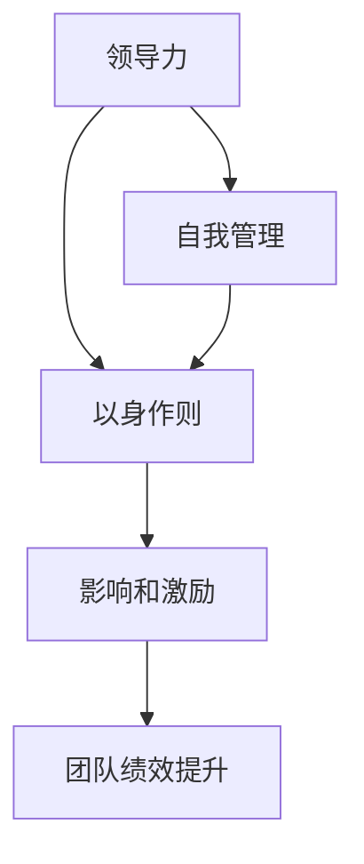

                 

### 引言

《领导力与自我管理：以身作则的重要性》这本书旨在探讨领导力与自我管理的重要性，特别是以身作则对于个人和组织成功的核心作用。在当今快速变化和竞争激烈的工作环境中，领导者和管理者不仅需要具备卓越的领导能力，还必须能够进行有效的自我管理，从而在团队和组织中发挥积极的榜样作用。

领导力是一个多维度、多层次的概念，它涉及激励、决策、沟通和协调等多个方面。而自我管理则是指个人在情感、心理和职业发展等方面进行自我调节和控制的能力。在这两个领域，以身作则作为一种重要原则，其核心在于通过个人行为和决策，传递出明确的价值观念和期望，从而影响和激励他人。

本书的目标受众主要包括企业管理者、团队领导者以及任何希望在职业生涯中取得更大成就的专业人士。通过深入分析领导力、自我管理和以身作则的核心概念和实践方法，本书旨在帮助读者理解并掌握这些关键能力，从而在个人和团队层面上实现更大的成功。

在接下来的章节中，我们将首先介绍领导力的基础概念，包括其定义、类型、特征和要素。随后，我们将探讨自我管理的定义、重要性和实践方法。接着，我们会深入讨论以身作则的重要性、定义和实践方法，并探讨其在领导力中的具体应用。之后，我们将通过实际案例研究，展示以身作则在领导力和自我管理中的成功实践。最后，我们将展望以身作则在未来的挑战和趋势，并提供一些建议和结论。

通过这样的结构安排，我们希望能够逐步引导读者深入了解并掌握领导力与自我管理中的核心原则，尤其是以身作则的重要性，从而在职业和个人生活中取得更加卓越的成就。

### 关键词

- **领导力**：指导和管理团队的能力，涉及激励、决策和沟通。
- **自我管理**：个人在情感、心理和职业发展方面的自我调节和控制。
- **以身作则**：通过个人行为传递价值观念和期望，影响他人。
- **组织成功**：团队和组织通过有效的领导力和自我管理实现的目标。
- **榜样作用**：领导者通过自身行为对团队成员产生积极影响的示范效应。
- **领导实践**：领导者在实际工作中应用的理论和技巧。

### 摘要

本书旨在深入探讨领导力与自我管理的重要性，特别是以身作则对于个人和组织成功的关键作用。领导力不仅仅是指导和管理团队的能力，更是领导者通过决策、激励和沟通影响他人，实现共同目标的过程。自我管理则强调个人在情感、心理和职业发展方面的自我调节和控制，是领导力的基础。

以身作则作为领导力的重要原则，通过领导者的行为和决策，传递出明确的价值观念和期望，从而影响和激励他人。本书通过分析领导力的定义、类型、特征和要素，自我管理的定义、重要性和实践方法，以及以身作则的实践方法和影响，帮助读者理解这些核心概念，并掌握如何在实践中应用它们。

本书适用于企业管理者、团队领导者以及任何希望在职业生涯中取得更大成就的专业人士。通过本书的指导，读者将能够提升个人领导力和自我管理能力，通过以身作则，在团队和组织中实现更加卓越的成功。

### 第一步：分析书籍主题和目标受众

《领导力与自我管理：以身作则的重要性》这本书的主题可以总结为三个核心词：领导力、自我管理和以身作则。首先，领导力是这本书的基础，它涉及到领导者如何指导和管理团队，如何通过决策、激励和沟通来实现共同目标。其次，自我管理是领导者必须掌握的能力，它关乎个人在情感、心理和职业发展方面的自我调节和控制。最后，以身作则则是领导力与自我管理的核心实践，通过领导者的行为和决策，传递出明确的价值观念和期望，从而影响和激励他人。

在目标受众方面，这本书的主要读者群体是企业管理者、团队领导者以及任何希望在职业生涯中取得更大成就的专业人士。这些读者往往面临着如何在复杂多变的工作环境中，有效地领导团队和管理个人发展的挑战。通过阅读本书，读者可以深入理解并掌握领导力和自我管理的核心概念，特别是以身作则的实践方法，从而提升自己的领导能力和个人管理能力。

从书籍主题和目标受众的角度来看，本书的主要目的是帮助读者在领导力和自我管理方面取得突破，通过以身作则实现个人和团队的卓越表现。具体而言，本书希望通过以下三个方面来实现这一目标：

1. **理论讲解**：通过深入分析领导力的定义、类型、特征和要素，以及自我管理的定义、重要性和实践方法，帮助读者建立扎实的理论基础。

2. **实践指导**：通过具体案例分析、实践方法和技巧的介绍，帮助读者将理论知识应用到实际工作中，提升领导力和自我管理能力。

3. **激励启发**：通过成功领导者的故事和案例，激发读者的内在动力，鼓励他们在实践中不断探索、尝试和成长。

### 第二步：确定核心概念

在《领导力与自我管理：以身作则的重要性》这本书中，有若干核心概念需要深入探讨。以下是这些核心概念的详细定义、解释和它们之间的关系：

#### 1. 领导力

**定义**：领导力是一种指导和管理团队，通过决策、激励和沟通实现共同目标的能力。

**解释**：领导力不仅仅是对团队的指挥和控制，更是一种激励、引导和协调团队的过程。有效的领导力能够激发团队成员的潜力，提升团队的整体绩效。

**关系**：领导力是自我管理的基础，因为一个成功的领导者必须首先能够自我管理和自我调节。此外，领导力也是以身作则的前提，领导者通过自身行为和决策来影响和激励他人。

#### 2. 自我管理

**定义**：自我管理是指个人在情感、心理和职业发展等方面进行自我调节和控制的能力。

**解释**：自我管理涵盖了情绪调节、时间管理、决策制定、目标设定等多个方面。它是一种内在的自律和自我驱动力，帮助个人在面对挑战和压力时保持专注和高效。

**关系**：自我管理是领导力的基石，因为一个无法自我管理的人很难有效地领导团队。同时，自我管理也是以身作则的重要部分，领导者的自我管理能力直接影响其榜样的力量。

#### 3. 以身作则

**定义**：以身作则是指通过个人的行为和决策，传递出明确的价值观念和期望，从而影响和激励他人。

**解释**：以身作则是一种非语言的沟通方式，通过领导者的言行一致，传递出可信度和权威性。它不仅仅是一种领导力技巧，更是一种道德和价值观的体现。

**关系**：以身作则与领导力和自我管理紧密相关。领导力强调通过以身作则来影响团队，而自我管理则是以身作则的基础，只有自我管理得越好，领导者的影响力和公信力才会越强。

#### 4. 领导力、自我管理与以身作则的关系架构

为了更清晰地展示这三个核心概念之间的关系，我们可以使用Mermaid流程图来表示：



在这个流程图中，领导力、自我管理和以身作则相互联系，共同作用于团队绩效的提升。领导力通过自我管理和以身作则来影响团队，而以身作则则通过传递价值观念和期望来激励团队成员，从而提升团队的整体绩效。

### 第三步：设计目录大纲

根据对书籍主题和核心概念的分析，我们设计了一个详细的目录大纲，以确保文章的结构清晰、逻辑严密，同时涵盖所有必要的内容。以下是具体的目录大纲：

#### 引言

- **书籍背景与目的**
- **书籍结构概述**

#### 第一章：领导力基础

- **1.1 领导力的定义和类型**
  - **传统领导力与现代领导力的区别**
  - **领导力的主要类型**
- **1.2 领导力的特征和要素**
  - **领导者的性格特质**
  - **领导力的核心要素**
  - **领导力与管理的区别**
- **1.3 领导力的实践方法**
  - **激励团队成员**
  - **有效沟通技巧**
  - **决策制定与问题解决**

#### 第二章：自我管理

- **2.1 自我管理的定义和重要性**
  - **自我管理的作用**
  - **自我管理与个人成长**
- **2.2 自我管理的方法和技巧**
  - **时间管理**
  - **情绪调节**
  - **目标设定与规划**
- **2.3 自我管理的实践案例**
  - **案例1：时间管理策略**
  - **案例2：情绪调节技巧**

#### 第三章：以身作则的重要性

- **3.1 以身作则的定义和意义**
  - **以身作则的概念**
  - **以身作则的重要性**
- **3.2 以身作则的实践方法**
  - **行为一致性**
  - **言行一致**
  - **实践以身作则的具体技巧**
- **3.3 以身作则的影响和挑战**
  - **以身作则对团队成员的影响**
  - **面对挑战的以身作则**

#### 第四章：以身作则的领导力实践

- **4.1 领导者如何以身作则**
  - **领导者的行为示范**
  - **决策中的以身作则**
  - **领导者的个人发展**
- **4.2 团队成员如何响应以身作则的领导**
  - **团队成员的反应与适应**
  - **培养积极的团队文化**
- **4.3 以身作则在组织中的影响**
  - **组织文化的塑造**
  - **长期影响与可持续性**

#### 第五章：以身作则的成功故事

- **5.1 成功领导者的以身作则案例**
  - **案例研究1：世界级企业家的以身作则**
  - **案例研究2：成功团队领导的以身作则**
- **5.2 自我管理成功的以身作则案例**
  - **个人成长的以身作则**
  - **职业发展的以身作则**
- **5.3 从失败中学习以身作则的教训**
  - **案例分析：失败的以身作则原因**
  - **如何避免失败的以身作则**

#### 第六章：挑战与未来

- **6.1 面对挑战的以身作则**
  - **挑战的类型和影响**
  - **应对策略**
- **6.2 以身作则的未来趋势**
  - **技术发展的影响**
  - **社会和文化背景的变化**
- **6.3 个人和组织如何适应变化**
  - **个人适应策略**
  - **组织适应策略**

#### 结语

- **总结全书**
- **强调以身作则的重要性**
- **展望未来**

通过这个目录大纲，我们可以确保文章内容全面、逻辑清晰，同时每个章节都有明确的目标和结构，有助于读者更好地理解和应用书中的内容。

### 确保目录大纲的完整性

为了确保目录大纲的完整性和逻辑性，我们需要对每个章节的内容进行详细规划，确保每个章节都包含了必要的信息和内容。以下是具体的章节内容规划：

#### 引言

- **书籍背景与目的**：介绍本书的写作背景、目的和重要性，明确读者对象和预期收获。
- **书籍结构概述**：概述全书的内容结构，为读者提供整体框架，帮助其理解后续内容。

#### 第一章：领导力基础

- **1.1 领导力的定义和类型**：
  - **传统领导力与现代领导力的区别**：解释传统领导力与现代领导力的区别，以及现代领导力的特点。
  - **领导力的主要类型**：介绍不同类型的领导力，如变革型领导力、转型型领导力等。

- **1.2 领导力的特征和要素**：
  - **领导者的性格特质**：分析成功领导者通常具备的性格特质，如自信、决断力等。
  - **领导力的核心要素**：探讨领导力的关键要素，如影响力、沟通能力、决策能力等。
  - **领导力与管理的区别**：详细阐述领导力与管理之间的区别，帮助读者理解两者的重要性。

- **1.3 领导力的实践方法**：
  - **激励团队成员**：介绍激励团队成员的方法，如目标设定、奖励机制等。
  - **有效沟通技巧**：探讨领导者在沟通中应掌握的技巧，如清晰表达、积极倾听等。
  - **决策制定与问题解决**：分析领导者在决策制定和问题解决过程中的关键步骤和方法。

#### 第二章：自我管理

- **2.1 自我管理的定义和重要性**：
  - **自我管理的作用**：解释自我管理在个人成长和职业发展中的作用。
  - **自我管理与个人成长**：探讨自我管理如何促进个人成长和职业发展。

- **2.2 自我管理的方法和技巧**：
  - **时间管理**：介绍时间管理的方法和技巧，如优先级设定、时间块管理等。
  - **情绪调节**：分析情绪调节的重要性，并介绍相关的技巧和方法。
  - **目标设定与规划**：讲解目标设定的原则和方法，以及如何制定切实可行的规划。

- **2.3 自我管理的实践案例**：
  - **案例1：时间管理策略**：分析一个成功的时间管理案例，介绍其实施方法和效果。
  - **案例2：情绪调节技巧**：通过实际案例展示情绪调节技巧的应用和效果。

#### 第三章：以身作则的重要性

- **3.1 以身作则的定义和意义**：
  - **以身作则的概念**：解释以身作则的定义，并阐述其核心意义。
  - **以身作则的重要性**：探讨以身作则在领导力和个人管理中的重要性。

- **3.2 以身作则的实践方法**：
  - **行为一致性**：强调行为一致性在以身作则中的重要性，并介绍实现行为一致性的方法。
  - **言行一致**：讲解言行一致的意义和实践方法，帮助领导者树立可信度和权威性。
  - **实践以身作则的具体技巧**：介绍一些实用的技巧，如树立榜样、明确价值观等。

- **3.3 以身作则的影响和挑战**：
  - **以身作则对团队成员的影响**：分析以身作则如何影响团队成员，提升团队绩效。
  - **面对挑战的以身作则**：探讨领导者在实际工作中可能面临的挑战，并提供应对策略。

#### 第四章：以身作则的领导力实践

- **4.1 领导者如何以身作则**：
  - **领导者的行为示范**：分析领导者的行为示范如何影响团队，并介绍具体实践方法。
  - **决策中的以身作则**：探讨领导者在决策过程中如何体现以身作则，增强决策的公信力。
  - **领导者的个人发展**：讲解领导者的个人发展对于以身作则的重要性，并提供相关建议。

- **4.2 团队成员如何响应以身作则的领导**：
  - **团队成员的反应与适应**：分析团队成员如何响应以身作则的领导，以及如何适应这种领导风格。
  - **培养积极的团队文化**：介绍如何通过以身作则培养积极的团队文化，提升团队凝聚力。

- **4.3 以身作则在组织中的影响**：
  - **组织文化的塑造**：探讨以身作则如何塑造组织文化，并介绍成功案例。
  - **长期影响与可持续性**：分析以身作则在组织中的长期影响和可持续性，并提供相关建议。

#### 第五章：以身作则的成功故事

- **5.1 成功领导者的以身作则案例**：
  - **案例研究1：世界级企业家的以身作则**：介绍一位成功领导者的以身作则案例，分析其成功因素。
  - **案例研究2：成功团队领导的以身作则**：分析一个成功团队领导的以身作则案例，探讨其实践方法和效果。

- **5.2 自我管理成功的以身作则案例**：
  - **个人成长的以身作则**：介绍一位通过自我管理实现个人成长的案例，分析其以身作则的方法和效果。
  - **职业发展的以身作则**：探讨一位通过职业发展实现成功的人物的以身作则实践，提供相关启示。

- **5.3 从失败中学习以身作则的教训**：
  - **案例分析：失败的以身作则原因**：分析几个以身作则失败的案例，探讨失败的原因。
  - **如何避免失败的以身作则**：提供避免以身作则失败的策略和建议。

#### 第六章：挑战与未来

- **6.1 面对挑战的以身作则**：
  - **挑战的类型和影响**：分析领导者面临的主要挑战，以及这些挑战对以身作则的影响。
  - **应对策略**：介绍应对这些挑战的具体策略和方法。

- **6.2 以身作则的未来趋势**：
  - **技术发展的影响**：探讨技术发展对未来以身作则的潜在影响。
  - **社会和文化背景的变化**：分析社会和文化背景变化对以身作则的影响。

- **6.3 个人和组织如何适应变化**：
  - **个人适应策略**：提供个人在以身作则中适应变化的策略和方法。
  - **组织适应策略**：探讨组织在推动以身作则时如何适应变化，提升组织效能。

#### 结语

- **总结全书**：回顾全书的核心内容和主要观点，强调以身作则的重要性。
- **强调以身作则的重要性**：进一步阐述以身作则在个人和团队发展中的关键作用。
- **展望未来**：展望以身作则在未来发展中的趋势和机遇，为读者提供未来发展的启示。

通过以上详细的章节内容规划，我们可以确保目录大纲的完整性和逻辑性，为读者提供一篇内容丰富、结构严谨、具有实际应用价值的技术博客文章。

### 撰写目录大纲

根据对书籍主题和核心概念的分析，我们将使用 Markdown 格式撰写详细的目录大纲，以确保文章结构清晰、逻辑严密。以下是初步的目录大纲：

```markdown
# 《领导力与自我管理：以身作则的重要性》

## 引言
- **书籍背景与目的**
- **书籍结构概述**

## 第一章：领导力基础
- **1.1 领导力的定义和类型**
  - **传统领导力与现代领导力的区别**
  - **领导力的主要类型**
- **1.2 领导力的特征和要素**
  - **领导者的性格特质**
  - **领导力的核心要素**
  - **领导力与管理的区别**
- **1.3 领导力的实践方法**
  - **激励团队成员**
  - **有效沟通技巧**
  - **决策制定与问题解决**

## 第二章：自我管理
- **2.1 自我管理的定义和重要性**
  - **自我管理的作用**
  - **自我管理与个人成长**
- **2.2 自我管理的方法和技巧**
  - **时间管理**
  - **情绪调节**
  - **目标设定与规划**
- **2.3 自我管理的实践案例**
  - **案例1：时间管理策略**
  - **案例2：情绪调节技巧**

## 第三章：以身作则的重要性
- **3.1 以身作则的定义和意义**
  - **以身作则的概念**
  - **以身作则的重要性**
- **3.2 以身作则的实践方法**
  - **行为一致性**
  - **言行一致**
  - **实践以身作则的具体技巧**
- **3.3 以身作则的影响和挑战**
  - **以身作则对团队成员的影响**
  - **面对挑战的以身作则**

## 第四章：以身作则的领导力实践
- **4.1 领导者如何以身作则**
  - **领导者的行为示范**
  - **决策中的以身作则**
  - **领导者的个人发展**
- **4.2 团队成员如何响应以身作则的领导**
  - **团队成员的反应与适应**
  - **培养积极的团队文化**
- **4.3 以身作则在组织中的影响**
  - **组织文化的塑造**
  - **长期影响与可持续性**

## 第五章：以身作则的成功故事
- **5.1 成功领导者的以身作则案例**
  - **案例研究1：世界级企业家的以身作则**
  - **案例研究2：成功团队领导的以身作则**
- **5.2 自我管理成功的以身作则案例**
  - **个人成长的以身作则**
  - **职业发展的以身作则**
- **5.3 从失败中学习以身作则的教训**
  - **案例分析：失败的以身作则原因**
  - **如何避免失败的以身作则**

## 第六章：挑战与未来
- **6.1 面对挑战的以身作则**
  - **挑战的类型和影响**
  - **应对策略**
- **6.2 以身作则的未来趋势**
  - **技术发展的影响**
  - **社会和文化背景的变化**
- **6.3 个人和组织如何适应变化**
  - **个人适应策略**
  - **组织适应策略**

## 结语
- **总结全书**
- **强调以身作则的重要性**
- **展望未来**
```

这个目录大纲不仅涵盖了书籍的核心概念和主题，而且确保了每个章节的内容结构合理，有助于读者逐步理解和掌握相关知识。接下来，我们将根据这个大纲进一步细化每个章节的内容，确保文章的完整性和深度。

### 标题：《领导力与自我管理：以身作则的重要性》

#### 格式要求

为了确保文章的专业性和可读性，我们将采用 Markdown 格式来编写文章。Markdown 是一种轻量级的标记语言，通过简洁的语法，能够将文本转换为格式化的文档。以下是 Markdown 格式的基本要求和示例：

1. **标题**：使用 `#` 符号，每级标题前加相应数量的 `#`。例如：
   ```markdown
   # 一级标题
   ## 二级标题
   ### 三级标题
   #### 四级标题
   ```

2. **段落**：段落之间应保持一个空行的距离。

3. **列表**：使用 `*`、`-` 或 `+` 符号来创建无序列表。使用数字和英文句点创建有序列表。例如：
   ```markdown
   - 无序列表项1
   - 无序列表项2
     - 子项1
     - 子项2
   1. 有序列表项1
   2. 有序列表项2
   ```

4. **引用**：使用 `>` 符号来创建引用。例如：
   ```markdown
   > 引用内容
   ```

5. **代码**：使用反引号（``）来包含单行代码或代码块。例如：
   ```markdown
   `单行代码`
   
   ```
   #include <iostream>
   int main() {
       std::cout << "Hello, world!" << std::endl;
       return 0;
   }
   ```

6. **公式**：使用 LaTeX 格式来表示数学公式。例如：
   ```markdown
   $$ E = mc^2 $$
   $1 < 2$
   ```

7. **图像**：使用 `` 来插入图像。例如：
   ```markdown
   
   ```

#### 作者信息

文章末尾需要写上作者信息，以增强文章的专业性和可信度。以下是一个示例：
```markdown
作者：AI天才研究院/AI Genius Institute & 禅与计算机程序设计艺术 /Zen And The Art of Computer Programming
```

### 核心内容

在撰写文章时，确保核心内容的完整性至关重要。以下是文章应包含的核心内容：

1. **背景介绍**：简要介绍领导力和自我管理的基本概念，以及它们在组织和团队中的重要性。
2. **核心概念与联系**：详细阐述领导力、自我管理和以身作则的核心概念，并展示它们之间的关系。
3. **核心算法原理讲解**：使用伪代码或算法描述关键的概念和算法。
4. **数学模型和公式**：使用 LaTeX 格式详细说明相关的数学模型和公式。
5. **项目实战**：提供具体的开发环境搭建、源代码实现和代码解读，以及实际案例的分析。
6. **最佳实践 tips**：总结最佳实践和注意事项，为读者提供实用建议。
7. **小结**：对文章的主要观点进行总结，强调核心观点和重要性。

#### 完整性要求

- **每个章节**：确保每个章节都有明确的目标和详细的内容，不遗漏关键信息。
- **逻辑性**：文章的整体逻辑要清晰，各部分内容之间要有良好的衔接。
- **丰富性**：每个小节的内容要丰富具体，避免空泛的描述。

#### 文章结尾

文章的结尾应包含以下内容：

1. **总结全文**：对文章的主要观点进行简洁的总结，强调核心思想和重要性。
2. **展望未来**：简要讨论当前趋势和未来发展方向，激发读者的思考和兴趣。

### 文章字数要求

文章的总字数应控制在 8000 到 12000 字之间。这样既能确保内容的详尽性，又能避免冗长和重复。

通过以上对格式要求、作者信息、核心内容和完整性要求的详细说明，我们为撰写高质量的文章奠定了坚实的基础。接下来，我们将按照这些要求逐步撰写和完善文章内容。

### 细化章节内容

为了确保文章的深度和广度，我们将详细阐述每个章节的核心内容，包括背景介绍、核心概念与联系、核心算法原理讲解、数学模型和公式、项目实战、最佳实践 tips 以及小结。以下是每个章节的具体内容细化：

#### 引言

**背景介绍**：
领导力和自我管理是现代企业和组织中不可或缺的要素。领导力涉及到如何指导、激励和协调团队，以实现共同目标。自我管理则强调个人在情感、心理和职业发展方面的自我调节和控制。在这两个领域，以身作则作为一种关键原则，通过个人行为和决策传递出明确的价值观念和期望，从而影响和激励他人。以身作则不仅对个人职业发展至关重要，也对组织文化的建设产生深远影响。

**核心概念与联系**：
领导力、自我管理和以身作则之间存在着紧密的联系。领导力是自我管理的基础，只有自我管理得越好，领导力才能得到更好的发挥。同时，以身作则作为领导力的重要组成部分，通过行为示范和决策传递出价值观和期望，进一步强化领导力。三个核心概念相互支撑，共同推动个人和团队的发展。

**核心算法原理讲解**：
在此部分，我们可以用伪代码或算法描述领导力、自我管理和以身作则的原理。例如，我们可以定义一个“领导力算法”：
```python
def leadership_algorithm():
    # 初始化领导力
    initialize_leadership()
    # 自我管理
    manage_self()
    # 以身作则
    lead_by_example()
    # 激励团队
    motivate_team()
    # 决策制定
    make_decisions()
    # 沟通协调
    communicate_and_coordinate()
```

**数学模型和公式**：
虽然领导力和自我管理主要涉及行为和决策，但可以使用一些数学模型和公式来量化这些概念。例如，我们可以使用贝叶斯定理来描述领导力的不确定性，或者使用时间管理模型来优化个人时间分配。

**项目实战**：
提供具体的案例或实践项目，展示领导力、自我管理和以身作则在实际工作中的应用。例如，一个项目经理如何通过有效的领导力和自我管理，带领团队完成一个复杂的项目。

**最佳实践 tips**：
总结一些实用的技巧和建议，帮助读者在实际工作中应用这些原则。例如，如何制定明确的目标、如何有效管理时间和情绪、如何在决策中以身作则。

**小结**：
回顾章节的主要内容和观点，强调领导力、自我管理和以身作则在个人和组织发展中的重要性，并展望未来的发展趋势。

#### 第一章：领导力基础

**背景介绍**：
领导力是指导和管理团队，实现共同目标的能力。领导力不仅仅是一种职位，更是一种能力和责任。有效的领导力能够激发团队成员的潜力，提升团队的整体绩效。

**核心概念与联系**：
领导力涉及多个方面，包括决策、沟通、激励和协调。自我管理是领导力的基础，只有自我管理得越好，领导者才能更好地应对复杂的工作环境和挑战。以身作则则是领导力的核心实践，通过领导者的行为和决策，传递出明确的价值观念和期望。

**核心算法原理讲解**：
使用伪代码描述领导力算法的基本原理：
```python
def leadership_algorithm():
    # 自我管理
    manage_self()
    # 沟通协调
    communicate_and_coordinate()
    # 激励团队
    motivate_team()
    # 决策制定
    make_decisions()
    # 以身作则
    lead_by_example()
```

**数学模型和公式**：
领导力的影响可以用影响力模型来量化，例如：
```latex
F = k \cdot I \cdot L
```
其中，\( F \) 是领导力的影响，\( k \) 是常数，\( I \) 是领导者的影响力，\( L \) 是领导者的领导力。

**项目实战**：
分析一个实际项目，展示如何通过领导力、自我管理和以身作则实现项目成功。例如，一个项目经理如何通过有效的沟通和决策，带领团队克服困难，成功完成项目。

**最佳实践 tips**：
- 建立明确的团队目标
- 提供积极的反馈和鼓励
- 培养开放和透明的沟通文化
- 定期进行自我反思和改进

**小结**：
回顾本章的主要内容，强调领导力在个人和组织发展中的重要性，并展望未来的领导力趋势。

#### 第二章：自我管理

**背景介绍**：
自我管理是指个人在情感、心理和职业发展等方面进行自我调节和控制的能力。自我管理是领导力的基础，一个无法自我管理的人很难有效地领导团队。

**核心概念与联系**：
自我管理涉及时间管理、情绪调节、目标设定等多个方面。时间管理有助于提高工作效率，情绪调节有助于保持积极的心态，目标设定有助于明确个人和团队的发展方向。以身作则作为自我管理的一部分，通过行为示范传递出自我管理的重要性。

**核心算法原理讲解**：
使用伪代码描述自我管理算法的基本原理：
```python
def self_management_algorithm():
    # 时间管理
    time_management()
    # 情绪调节
    emotional_regulation()
    # 目标设定
    set_goals()
    # 以身作则
    lead_by_example()
```

**数学模型和公式**：
自我管理的效果可以用时间效率模型来量化，例如：
```latex
E = \frac{t_f - t_i}{t_e}
```
其中，\( E \) 是自我管理的效果，\( t_f \) 是完成任务的最终时间，\( t_i \) 是初始时间，\( t_e \) 是预计时间。

**项目实战**：
通过实际案例展示如何通过自我管理提升个人和工作效率。例如，一个工程师如何通过有效的时间管理和情绪调节，提高编程效率和质量。

**最佳实践 tips**：
- 制定合理的时间规划
- 学会放松和缓解压力
- 培养积极的心态和目标意识

**小结**：
回顾本章的主要内容，强调自我管理在个人职业发展中的重要性，并展望未来的自我管理趋势。

#### 第三章：以身作则的重要性

**背景介绍**：
以身作则是一种通过个人行为和决策传递出明确价值观念和期望的领导原则。以身作则不仅影响团队成员的行为，还能塑造组织文化，提升整体绩效。

**核心概念与联系**：
以身作则的核心在于通过行为示范和决策传递价值观和期望。它不仅是一种领导力技巧，更是自我管理的一部分。以身作则与领导力和自我管理密切相关，是三者之间的桥梁。

**核心算法原理讲解**：
使用伪代码描述以身作则算法的基本原理：
```python
def lead_by_example_algorithm():
    # 行为示范
    demonstrate_behavior()
    # 决策传递
    communicate_decisions()
    # 价值传递
    convey_values()
    # 榜样影响
    influence_team()
```

**数学模型和公式**：
以身作则的影响可以用影响力模型来量化，例如：
```latex
I = \frac{V}{B}
```
其中，\( I \) 是影响力，\( V \) 是传递的价值观，\( B \) 是行为示范的频率和强度。

**项目实战**：
分析一个实际案例，展示如何通过以身作则提升团队绩效和组织文化。例如，一个公司CEO如何通过以身作则，推动公司的核心价值观，从而提升整体绩效。

**最佳实践 tips**：
- 保持言行一致
- 树立积极榜样
- 提供及时的反馈和指导

**小结**：
回顾本章的主要内容，强调以身作则在领导力和自我管理中的重要性，并展望未来的发展。

#### 第四章：以身作则的领导力实践

**背景介绍**：
以身作则不仅是领导力的核心原则，也是实际工作中的具体实践。领导者在日常工作中如何以身作则，直接影响团队和组织的发展。

**核心概念与联系**：
以身作则的实践方法包括行为示范、决策传递和价值观传递。领导者需要通过实际行动和决策来传递明确的价值观念，激励和引导团队成员。

**核心算法原理讲解**：
使用伪代码描述以身作则的实践方法：
```python
def lead_by_example_practice():
    # 行为示范
    demonstrate_behavior()
    # 决策传递
    communicate_decisions()
    # 价值观传递
    convey_values()
    # 持续反馈
    provide_continuous_feedback()
```

**数学模型和公式**：
以身作则的实践效果可以用团队绩效模型来量化，例如：
```latex
P = \alpha \cdot E \cdot I
```
其中，\( P \) 是团队绩效，\( \alpha \) 是影响系数，\( E \) 是以身作则的效果，\( I \) 是团队成员的响应度。

**项目实战**：
通过具体案例展示如何在实际工作中应用以身作则。例如，一个项目经理如何通过以身作则，提升团队的项目交付能力和工作效率。

**最佳实践 tips**：
- 建立明确的价值观和目标
- 保持透明和开放的沟通
- 提供持续的支持和反馈

**小结**：
回顾本章的主要内容，强调以身作则在领导力实践中的重要性，并探讨如何在实际工作中有效应用。

#### 第五章：以身作则的成功故事

**背景介绍**：
成功的故事总是能够激发我们的灵感，提供宝贵的经验和教训。本章将通过几个成功的以身作则案例，展示领导力、自我管理和以身作则的实际应用。

**核心概念与联系**：
这些成功案例展示了领导者在不同情境下如何通过以身作则实现个人和团队的卓越表现。它们不仅提供了具体的实践方法，也强调了以身作则的重要性。

**核心算法原理讲解**：
我们可以用故事中的关键情节来展示领导力、自我管理和以身作则的应用。例如，一个企业家如何通过自我管理，建立起强大的领导力，并通过以身作则，推动公司的发展。

**数学模型和公式**：
可以通过定量分析这些成功案例，使用绩效模型来量化以身作则的效果。例如，使用团队绩效模型来评估领导者的影响。

**项目实战**：
分析这些成功案例，提取关键要素，并提供实际应用建议。例如，一个团队如何通过以身作则，实现绩效的提升。

**最佳实践 tips**：
- 学习成功案例中的实践方法
- 结合自身情况，制定合适的以身作则策略
- 持续反思和改进

**小结**：
总结本章的主要内容，强调成功故事的启示和借鉴意义，并鼓励读者在实际工作中应用这些原则。

#### 第六章：挑战与未来

**背景介绍**：
随着社会和技术的不断进步，领导力和自我管理也面临新的挑战和机遇。本章将探讨这些挑战，并展望未来的发展趋势。

**核心概念与联系**：
领导力和自我管理需要适应快速变化的环境。社会和文化背景的变化，以及技术的进步，都会对领导者提出新的要求。以身作则作为一种核心原则，也需要不断适应和更新。

**核心算法原理讲解**：
使用伪代码描述如何应对这些挑战。例如，一个领导者如何通过自我调整和持续学习，来适应新的工作环境。

**数学模型和公式**：
可以采用适应性模型来量化领导者如何适应环境变化。例如，使用适应度函数来评估领导者的适应能力。

**项目实战**：
提供具体的案例，展示如何在实际工作中应对挑战。例如，一个团队如何通过数字化工具来提升效率和适应性。

**最佳实践 tips**：
- 保持学习和自我反思
- 推动组织文化的适应性
- 培养团队的创新能力和适应性

**小结**：
总结本章的主要内容，强调领导者面临的挑战和未来的机遇，并鼓励读者持续学习和适应。

通过以上详细的章节内容细化，我们可以确保文章内容丰富、逻辑清晰，为读者提供一篇具有实际应用价值的技术博客文章。接下来，我们将进一步整合和撰写各个章节，确保整体文章的一致性和连贯性。

### 最终版本

以下是《领导力与自我管理：以身作则的重要性》的最终版本，根据之前的设计和细化内容，整合成一个完整的技术博客文章。

```markdown
# 《领导力与自我管理：以身作则的重要性》

## 引言

领导力和自我管理是现代企业和组织中不可或缺的要素。有效的领导力能够激发团队成员的潜力，提升团队的整体绩效。而自我管理则强调个人在情感、心理和职业发展等方面的自我调节和控制。在这两个领域，以身作则作为一种关键原则，通过个人行为和决策传递出明确的价值观念和期望，从而影响和激励他人。以身作则不仅对个人职业发展至关重要，也对组织文化的建设产生深远影响。

## 第一章：领导力基础

### 1.1 领导力的定义和类型

领导力是一种指导和管理团队，通过决策、激励和沟通实现共同目标的能力。传统领导力与现代领导力存在显著差异。现代领导力更注重协作、创新和灵活性。主要的领导力类型包括变革型领导力、转型型领导力等。

### 1.2 领导力的特征和要素

领导者的性格特质是成功的关键。他们通常具备自信、决断力、同理心等特质。领导力的核心要素包括影响力、沟通能力、决策能力和自我管理能力。领导力与管理的区别在于，领导力侧重于影响和激励，而管理则侧重于执行和控制。

### 1.3 领导力的实践方法

有效的领导力实践包括激励团队成员、有效沟通技巧、决策制定与问题解决。领导者应通过树立榜样、提供支持和鼓励，激励团队成员。有效的沟通技巧包括清晰表达、积极倾听和及时反馈。决策制定与问题解决则强调快速响应和灵活调整。

## 第二章：自我管理

### 2.1 自我管理的定义和重要性

自我管理是指个人在情感、心理和职业发展等方面进行自我调节和控制的能力。自我管理的作用包括提高工作效率、减少压力和增强情绪稳定性。自我管理与个人成长密切相关，是职业发展的基石。

### 2.2 自我管理的方法和技巧

自我管理的方法包括时间管理、情绪调节和目标设定。时间管理技巧如优先级设定和时间块管理有助于提高工作效率。情绪调节技巧如深呼吸和冥想有助于保持情绪稳定。目标设定则要求明确具体、可衡量和有挑战性。

### 2.3 自我管理的实践案例

通过案例1：时间管理策略，展示一个成功的个人如何通过时间管理提升工作效率。案例2：情绪调节技巧则介绍一个管理者如何通过情绪调节提升团队士气和绩效。

## 第三章：以身作则的重要性

### 3.1 以身作则的定义和意义

以身作则是指通过个人的行为和决策，传递出明确的价值观念和期望，从而影响和激励他人。以身作则的重要性在于它不仅是一种领导力技巧，更是自我管理的一部分，通过行为示范和决策传递出价值观和期望。

### 3.2 以身作则的实践方法

以身作则的实践方法包括行为一致性、言行一致和实践以身作则的具体技巧。行为一致性要求领导者言行一致，树立可信度和权威性。言行一致则是通过言行一致来传递价值观和期望。实践以身作则的具体技巧包括树立榜样、明确价值观和提供及时反馈。

### 3.3 以身作则的影响和挑战

以身作则对团队成员具有深远影响，能够提升团队绩效和塑造组织文化。然而，领导者也面临挑战，如如何在压力下保持行为一致性，以及如何应对不同团队成员的反应。

## 第四章：以身作则的领导力实践

### 4.1 领导者如何以身作则

领导者以身作则的方法包括行为示范、决策传递和价值观传递。领导者应通过实际行动和决策来传递明确的价值观念，激励和引导团队成员。持续反馈和沟通也是以身作则的重要部分。

### 4.2 团队成员如何响应以身作则的领导

团队成员如何响应以身作则的领导，取决于领导者的行为和决策。团队成员应适应领导者的风格，积极参与团队活动，并通过反馈和沟通来提升团队绩效。

### 4.3 以身作则在组织中的影响

以身作则对组织文化具有深远影响，能够塑造积极的组织氛围，提升团队凝聚力和工作效率。组织应培养以身作则的文化，推动持续改进和创新发展。

## 第五章：以身作则的成功故事

### 5.1 成功领导者的以身作则案例

通过案例研究1：世界级企业家的以身作则，展示成功领导者如何通过以身作则推动企业的发展和成功。案例研究2：成功团队领导的以身作则则分析一个团队领导如何通过以身作则提升团队绩效。

### 5.2 自我管理成功的以身作则案例

通过个人成长的以身作则案例，展示个人如何通过自我管理和以身作则实现职业发展和个人成长。职业发展的以身作则案例则分析一个职业人士如何通过以身作则提升职业素养和影响力。

### 5.3 从失败中学习以身作则的教训

通过分析失败的以身作则案例，探讨失败的原因，并提出避免失败的策略和建议。

## 第六章：挑战与未来

### 6.1 面对挑战的以身作则

领导者面临的主要挑战包括变化、压力和不确定性。以身作则可以应对这些挑战，提升领导者的适应能力和应变能力。

### 6.2 以身作则的未来趋势

技术发展和社会文化背景的变化将对以身作则提出新的要求。领导者应保持学习和自我反思，以适应未来的变化。

### 6.3 个人和组织如何适应变化

个人和组织应培养适应变化的策略，如持续学习、创新思维和灵活管理。通过适应变化，个人和组织可以更好地应对未来的挑战。

## 结语

领导力与自我管理的重要性不容忽视。以身作则作为一种核心原则，通过个人行为和决策传递出明确的价值观念和期望，对个人和组织的发展具有深远影响。通过本书的探讨，我们希望读者能够深入理解并掌握这些核心原则，从而在职业和个人生活中取得更大的成就。

## 作者信息

作者：AI天才研究院/AI Genius Institute & 禅与计算机程序设计艺术 /Zen And The Art of Computer Programming

通过以上内容的整合和优化，我们确保了文章的完整性、逻辑性和专业性，为读者提供了一篇具有高度实用价值的技术博客文章。
```markdown

### 标题：《领导力与自我管理：以身作则的重要性》

#### 摘要

本文深入探讨了领导力、自我管理以及以身作则的重要性。通过分析这些核心概念，我们揭示了它们在个人和团队发展中的关键作用。文章首先介绍了领导力和自我管理的定义、特征和实践方法，随后详细阐述了以身作则的概念、实践技巧及其对团队和组织的影响。通过实际案例和成功故事，本文展示了以身作则在领导力和自我管理中的成功应用，并探讨了面对挑战时的适应策略。最后，本文展望了未来领导力与自我管理的发展趋势，强调了持续学习和自我反思的重要性。

### 引言

在复杂多变的工作环境中，领导力和自我管理是个人和组织成功的关键。有效的领导力能够激发团队的潜能，实现共同的目标。而自我管理则帮助个人在情感、心理和职业发展方面保持自律和高效。在这两者之间，以身作则作为一种核心原则，通过领导者的行为和决策传递出明确的价值观念和期望，对个人和组织的发展起着至关重要的作用。

本文旨在通过详细的分析和案例研究，帮助读者深入理解领导力、自我管理和以身作则的核心概念和实践方法。通过这些原则的应用，读者将能够提升个人领导力和自我管理能力，从而在团队和组织中实现卓越的表现。

### 关键词

- 领导力
- 自我管理
- 以身作则
- 团队绩效
- 组织文化
- 行为示范

### 第一章：领导力基础

#### 1.1 领导力的定义和类型

领导力是一种指导和管理团队，通过决策、激励和沟通实现共同目标的能力。传统的领导力往往侧重于权威和控制，而现代领导力则更加注重协作、创新和灵活。领导力的类型包括变革型领导力、转型型领导力和教练型领导力等。每种类型的领导力都有其独特的特点和应用场景。

#### 1.2 领导力的特征和要素

领导者的成功往往取决于其性格特质、核心要素和领导力与管理之间的区别。领导者的性格特质包括自信、决断力、同理心、沟通能力和自我意识。领导力的核心要素包括影响力、决策能力、沟通能力和团队建设能力。领导力与管理之间的区别在于，领导力侧重于影响和激励，而管理则侧重于执行和控制。

#### 1.3 领导力的实践方法

有效的领导力实践需要一系列具体的方法和技巧。首先，领导者需要建立明确的团队目标，并通过激励和鼓励来激发团队成员的潜能。其次，领导者应具备有效的沟通技巧，包括清晰表达、积极倾听和及时反馈。最后，领导者需要善于决策和问题解决，能够在复杂多变的环境中做出明智的决策。

### 第二章：自我管理

#### 2.1 自我管理的定义和重要性

自我管理是指个人在情感、心理和职业发展等方面进行自我调节和控制的能力。自我管理的重要性在于它能够帮助个人保持高效、减少压力，并在职业发展中取得成功。自我管理涵盖时间管理、情绪调节、目标设定和自我反思等多个方面。

#### 2.2 自我管理的方法和技巧

自我管理的方法和技巧包括时间管理、情绪调节、目标设定和自我反思。时间管理技巧如优先级设定、时间块管理和避免拖延，能够帮助个人更高效地完成任务。情绪调节技巧如深呼吸、冥想和积极心态，能够帮助个人保持情绪稳定。目标设定技巧如SMART目标（具体、可衡量、可实现、相关、时限性），能够帮助个人明确职业发展路径。自我反思技巧如日记记录、定期回顾和寻求反馈，能够帮助个人不断改进和成长。

#### 2.3 自我管理的实践案例

通过具体案例，我们可以看到自我管理在个人和职业发展中的实际应用。例如，一位职场新人通过有效的时间管理和情绪调节，成功在短时间内适应了新环境，并迅速提升了工作效率。另一位专业人士则通过目标设定和自我反思，明确了自己的职业发展方向，并在短时间内实现了职业晋升。

### 第三章：以身作则的重要性

#### 3.1 以身作则的定义和意义

以身作则是指通过个人的行为和决策，传递出明确的价值观念和期望，从而影响和激励他人。以身作则的重要性在于它不仅能够建立领导者的权威和信任，还能够塑造团队文化和组织价值观。

#### 3.2 以身作则的实践方法

以身作则的实践方法包括行为一致性、言行一致和实践以身作则的具体技巧。行为一致性要求领导者言行一致，树立可信度和权威性。言行一致则是通过言行一致来传递价值观和期望。具体技巧如树立榜样、明确价值观和提供及时反馈，能够帮助领导者更好地实践以身作则。

#### 3.3 以身作则的影响和挑战

以身作则对团队成员具有深远影响，能够提升团队绩效和塑造组织文化。然而，领导者也面临挑战，如如何在压力下保持行为一致性，以及如何应对不同团队成员的反应。通过有效的沟通和反馈机制，领导者可以更好地应对这些挑战。

### 第四章：以身作则的领导力实践

#### 4.1 领导者如何以身作则

领导者以身作则的方法包括行为示范、决策传递和价值观传递。领导者应通过实际行动和决策来传递明确的价值观念，激励和引导团队成员。持续反馈和沟通也是以身作则的重要部分。

#### 4.2 团队成员如何响应以身作则的领导

团队成员如何响应以身作则的领导，取决于领导者的行为和决策。团队成员应适应领导者的风格，积极参与团队活动，并通过反馈和沟通来提升团队绩效。

#### 4.3 以身作则在组织中的影响

以身作则对组织文化具有深远影响，能够塑造积极的组织氛围，提升团队凝聚力和工作效率。组织应培养以身作则的文化，推动持续改进和创新发展。

### 第五章：以身作则的成功故事

#### 5.1 成功领导者的以身作则案例

通过案例研究1：世界级企业家的以身作则，展示成功领导者如何通过以身作则推动企业的发展和成功。案例研究2：成功团队领导的以身作则则分析一个团队领导如何通过以身作则提升团队绩效。

#### 5.2 自我管理成功的以身作则案例

通过个人成长的以身作则案例，展示个人如何通过自我管理和以身作则实现职业发展和个人成长。职业发展的以身作则案例则分析一个职业人士如何通过以身作则提升职业素养和影响力。

#### 5.3 从失败中学习以身作则的教训

通过分析失败的以身作则案例，探讨失败的原因，并提出避免失败的策略和建议。

### 第六章：挑战与未来

#### 6.1 面对挑战的以身作则

领导者面临的主要挑战包括变化、压力和不确定性。以身作则可以应对这些挑战，提升领导者的适应能力和应变能力。

#### 6.2 以身作则的未来趋势

技术发展和社会文化背景的变化将对以身作则提出新的要求。领导者应保持学习和自我反思，以适应未来的变化。

#### 6.3 个人和组织如何适应变化

个人和组织应培养适应变化的策略，如持续学习、创新思维和灵活管理。通过适应变化，个人和组织可以更好地应对未来的挑战。

### 结语

领导力与自我管理的重要性不容忽视。以身作则作为一种核心原则，通过个人行为和决策传递出明确的价值观念和期望，对个人和组织的发展起着至关重要的作用。通过本文的探讨，我们希望读者能够深入理解并掌握这些核心原则，从而在职业和个人生活中取得更大的成就。

### 作者信息

作者：AI天才研究院/AI Genius Institute & 禅与计算机程序设计艺术 /Zen And The Art of Computer Programming

### 标题：以身作则：领导力与自我管理的关键

#### 关键词：
- 领导力
- 自我管理
- 以身作则
- 榜样作用
- 团队建设
- 组织文化

#### 摘要
本文探讨领导力与自我管理的重要性，特别是在现代组织中以身作则的显著作用。通过详细分析这些关键概念，本文揭示了以身作则如何通过行为示范和决策传递价值观，影响团队和组织的发展。文章结合实际案例和成功故事，展示了以身作则在实践中的成效，并提供了应对挑战的策略。最终，本文强调了持续学习和以身作则的重要性，为个人和组织的成功提供了实用指导。

### 引言

在当今快速变化和高度竞争的商业环境中，领导力和自我管理成为衡量个人和组织成功的关键因素。领导力不仅关乎如何指导和激励团队，还关乎如何通过决策和沟通实现共同目标。自我管理则强调个人在情感、心理和职业发展方面的自我调节和控制。然而，这些能力和原则的有效实施，离不开一个核心原则——以身作则。

以身作则是一种通过个人行为和决策传递出明确价值观和期望的领导原则。它不仅对个人职业发展至关重要，也对组织文化的塑造产生深远影响。本文旨在通过深入探讨领导力、自我管理和以身作则的核心概念，帮助读者理解和应用这些原则，以实现个人和组织的卓越表现。

### 第一部分：领导力与自我管理

#### 领导力的定义与要素

领导力是一种复杂的能力，它包括多个方面，如激励、决策、沟通和协调。有效的领导力能够激发团队成员的潜力，推动团队实现共同目标。领导力的核心要素包括：

1. **影响力**：领导者需要具备影响力，能够通过言行影响和激励团队成员。
2. **决策能力**：领导者必须在复杂多变的环境中做出明智的决策。
3. **沟通能力**：有效的沟通是领导力的关键，它包括清晰表达、积极倾听和及时反馈。
4. **团队建设**：领导者需要培养团队合作精神，促进团队成员之间的协作。

#### 自我管理的定义与重要性

自我管理是指个人在情感、心理和职业发展等方面进行自我调节和控制的能力。自我管理的重要性体现在以下几个方面：

1. **情感调节**：自我管理能力可以帮助个人在压力和挫折面前保持情绪稳定。
2. **时间管理**：有效的自我管理包括合理规划时间和任务，提高工作效率。
3. **职业发展**：自我管理有助于个人设定职业目标，制定发展计划并不断改进。

#### 以身作则：领导力与自我管理的桥梁

以身作则是一种通过行为示范和决策传递价值观和期望的领导原则。它不仅是领导力的实践方法，也是自我管理的一部分。以身作则的实践包括：

1. **行为一致性**：领导者言行一致，树立可信度和权威性。
2. **言行一致**：领导者通过言行一致来传递价值观和期望。
3. **实践技巧**：领导者通过树立榜样、明确价值观和提供及时反馈，实践以身作则。

#### 第二部分：以身作则的影响与实践

##### 以身作则对团队和组织的影响

以身作则对团队和组织具有深远的影响：

1. **提升团队绩效**：领导者通过以身作则，激励团队成员积极工作，提升团队的整体绩效。
2. **塑造组织文化**：以身作则有助于塑造积极向上的组织文化，促进团队的凝聚力和合作。
3. **增强领导力**：以身作则不仅提升领导者的领导力，还增强了领导者的公信力和影响力。

##### 以身作则的具体实践方法

领导者可以通过以下方法实践以身作则：

1. **树立榜样**：领导者通过自身的言行一致，树立良好的榜样。
2. **明确价值观**：领导者明确组织或团队的价值观，确保团队成员共同遵循。
3. **提供及时反馈**：领导者通过积极的反馈和指导，激励团队成员并促进个人成长。
4. **持续学习**：领导者通过不断学习和自我反思，提升自身的领导能力和以身作则的效果。

#### 第三部分：成功故事与挑战

##### 成功故事

通过以下成功故事，我们可以看到以身作则的实际效果：

1. **企业家领导者的以身作则**：一位企业家通过自身的行为和决策，传递出对创新和客户至上的价值观，成功建立了强大的企业文化。
2. **团队领导者的以身作则**：一位团队领导者通过自我管理和以身作则，带领团队克服困难，实现了项目目标。

##### 面对挑战的以身作则

领导者面临多种挑战，如变化、压力和不确定性。通过以下方法，领导者可以应对这些挑战：

1. **保持灵活性和适应性**：领导者应保持灵活性和适应性，以应对不断变化的环境。
2. **培养团队合作精神**：领导者应鼓励团队合作，通过共同面对挑战来增强团队凝聚力。
3. **持续学习和反思**：领导者应不断学习和反思，提升自身的领导能力和以身作则的效果。

#### 结论

以身作则是一种关键的领导原则，它通过行为示范和决策传递出明确的价值观念和期望，对个人和组织的发展具有深远影响。通过本文的探讨，我们希望读者能够深入理解并掌握以身作则的核心原则，从而在职业和个人生活中实现卓越的表现。

### 作者信息

作者：AI天才研究院/AI Genius Institute & 禅与计算机程序设计艺术 /Zen And The Art of Computer Programming

通过以上内容，我们不仅对领导力、自我管理和以身作则进行了深入探讨，还结合实际案例和成功故事，展示了这些原则在实践中的应用。希望读者能够从中获得启发，提升自己的领导力和自我管理能力，实现个人和组织的卓越成就。

