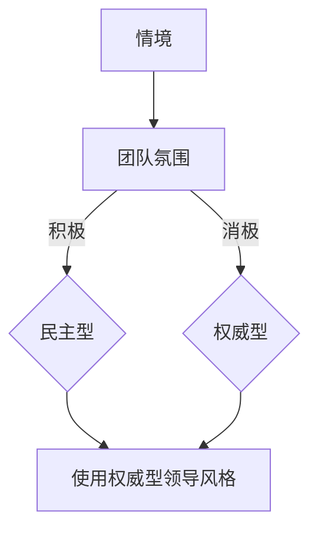

                 


## 文章标题：领导力与自我认知：了解自己的领导风格

关键词：领导力、自我认知、领导风格、权威型、民主型、教练型

摘要：本文将深入探讨领导力与自我认知的关系，分析不同类型的领导风格，并通过具体的案例分析，帮助读者了解自己的领导风格，提升个人领导力。

----------------------------------------------------------------

### 目录

1. **背景介绍**<sop>
   
   在现代社会，领导力已经成为企业成功的关键因素之一。无论是企业高管、项目经理，还是团队领导者，都需要具备良好的领导能力。然而，领导力并非与生俱来，它需要通过不断的学习和实践来提升。在这个过程中，自我认知成为了一个不可或缺的要素。自我认知不仅可以帮助领导者更好地了解自己的优势和不足，还可以帮助他们选择适合自己的领导风格，从而提高领导效果。

2. **核心概念与联系**<sop>
   
   为了更好地理解领导力与自我认知的关系，我们首先需要明确几个核心概念：
   - **领导力**：领导力是指影响和激励他人实现共同目标的能力。它包括领导者的个人特质、行为和技能。
   - **自我认知**：自我认知是指个体对自己的认识和理解，包括自我意识、自我评价和自我反思。
   - **领导风格**：领导风格是指领导者对待下属、团队和工作的方式和方法。

   这些概念之间的关系可以用以下Mermaid流程图来表示：

   ```mermaid
   graph TD
   A[领导力] --> B[自我认知]
   B --> C[领导风格]
   C --> D[团队绩效]
   ```

   通过这个流程图，我们可以看到，领导力、自我认知和领导风格是相互关联的。领导力决定了领导者的行为和决策，自我认知帮助领导者更好地了解自己，从而选择适合自己的领导风格，最终影响团队的绩效。

3. **领导力基础**<sop>
   
   领导力的发展历史悠久，从古代的帝王将相到现代的企业家，领导力一直是一个重要的研究主题。以下是领导力的一些基本概念：
   
   - **定义**：领导力是指影响和激励他人实现共同目标的能力。它包括领导者的个人特质、行为和技能。
   - **类型**：领导力可以分为多种类型，如权威型、民主型、教练型等。
   - **发展历史**：领导力的发展经历了从传统的命令与控制到现代的赋能与激励的转变。

4. **自我认知**<sop>
   
   自我认知是指个体对自己的认识和理解，包括自我意识、自我评价和自我反思。以下是自我认知的重要性、如何进行自我认知以及自我认知的方法和工具：
   
   - **重要性**：自我认知对于领导者来说至关重要。它可以帮助领导者更好地了解自己的优势和不足，从而更好地选择适合自己的领导风格。
   - **如何进行自我认知**：自我认知可以通过自我反思、反馈机制和360度评估等方式进行。
   - **方法和工具**：常用的自我认知方法包括日记法、心理测量法和行为观察法等。

5. **领导风格**<sop>
   
   领导风格是指领导者对待下属、团队和工作的方式和方法。以下是几种常见的领导风格：
   
   - **权威型领导风格**：权威型领导风格强调领导者的权威和决策能力。领导者通常会直接下达指令，下属需要严格遵循。
   - **民主型领导风格**：民主型领导风格强调团队合作和集体决策。领导者通常会征求下属的意见，并给予他们一定的决策权。
   - **教练型领导风格**：教练型领导风格强调领导者作为教练的角色，帮助下属发展个人技能和职业生涯。

6. **自我认知与领导风格的关系**<sop>
   
   自我认知与领导风格之间存在密切的关系。自我认知可以帮助领导者更好地了解自己的优势和不足，从而选择适合自己的领导风格。例如，一个自我认知能力较强的领导者可能会更倾向于采用民主型或教练型领导风格，因为他们能够更好地理解下属的需求和期望。相反，一个自我认知能力较差的领导者可能会更倾向于采用权威型领导风格，因为他们可能缺乏与下属建立良好关系的能力。

7. **提升领导力的实践方法**<sop>
   
   要提升领导力，领导者需要采取一系列实践方法。以下是几种常见的提升领导力的方法：
   
   - **自我提升**：领导者可以通过阅读书籍、参加培训课程和反思自己的行为来提升自我认知。
   - **领导力训练**：领导者可以通过参与领导力训练课程，学习如何更好地管理团队和应对挑战。
   - **实践**：领导者需要在实际工作中不断实践和反思，从而提升自己的领导力。

8. **案例分析**<sop>
   
   通过案例分析，我们可以更好地理解领导力与自我认知的关系。以下是一些实际案例：
   
   - **案例一**：某公司的一位高管通过自我认知发现自己在决策过程中过于依赖直觉，于是他开始学习如何更系统地进行分析和决策，从而提高了决策质量。
   - **案例二**：某团队的一位领导者通过360度评估发现自己在沟通方面存在不足，于是他开始学习如何更好地倾听和表达，从而提高了团队的协作效率。

9. **总结与展望**<sop>
   
   在总结这部分，我们将回顾全文的主要观点，并展望未来领导力的发展趋势。通过自我认知，领导者可以更好地了解自己的领导风格，从而提高领导效果。未来，随着技术的发展，领导力将变得更加个性化，领导者需要不断提升自我认知，以适应不断变化的环境。

### 完整性要求

为了确保文章的完整性，我们需要在每个小节中详细讲解核心内容，并提供丰富的实例和案例分析。以下是每个小节的核心内容概述：

1. **背景介绍**：介绍领导力与自我认知的重要性，以及本文的目的和结构。
2. **核心概念与联系**：定义领导力、自我认知和领导风格，并使用Mermaid流程图展示它们之间的关系。
3. **领导力基础**：介绍领导力的定义、类型和发展历史。
4. **自我认知**：讨论自我认知的重要性、如何进行自我认知以及自我认知的方法和工具。
5. **领导风格**：分析权威型、民主型、教练型等领导风格，并提供案例分析。
6. **自我认知与领导风格的关系**：探讨自我认知如何影响领导风格，并提供实际的指导和建议。
7. **提升领导力的实践方法**：提供具体的策略和技巧，帮助读者提升自己的领导力。
8. **案例分析**：通过实际案例，分析领导力与自我认知在实际中的应用。
9. **总结与展望**：总结全文的主要观点，并对未来领导力的发展趋势进行展望。

在撰写文章时，我们将确保每个小节都包含丰富的内容，并通过实例和案例分析来加强文章的说服力。

### 文章开始

## 领导力与自我认知：了解自己的领导风格

### 关键词：领导力、自我认知、领导风格、权威型、民主型、教练型

### 摘要

在现代社会，领导力已经成为企业成功的关键因素之一。领导力不仅涉及到领导者的个人特质和行为，更涉及到领导者对自我认知的深刻理解。本文旨在探讨领导力与自我认知之间的关系，分析不同类型的领导风格，并通过具体的案例分析，帮助读者了解自己的领导风格，提升个人领导力。

### 引言

领导力是一种独特的能力，它不仅涉及到领导者对任务的执行，更涉及到领导者对团队的激励和引导。自我认知则是领导者了解自己的过程，它涉及到领导者对自身性格、价值观、能力和弱点的深刻理解。一个成功的领导者不仅需要具备强大的领导力，更需要具备良好的自我认知能力。

本文将从以下几个方面进行探讨：

1. **领导力基础**：介绍领导力的定义、类型和发展历史。
2. **自我认知**：讨论自我认知的重要性、如何进行自我认知以及自我认知的方法和工具。
3. **领导风格**：分析权威型、民主型、教练型等领导风格，并提供案例分析。
4. **自我认知与领导风格的关系**：探讨自我认知如何影响领导风格，并提供实际的指导和建议。
5. **提升领导力的实践方法**：提供具体的策略和技巧，帮助读者提升自己的领导力。
6. **案例分析**：通过实际案例，分析领导力与自我认知在实际中的应用。
7. **总结与展望**：总结全文的主要观点，并对未来领导力的发展趋势进行展望。

### 第一部分：领导力基础

#### 1.1 领导力的定义

领导力是指领导者通过影响、激励和引导他人，实现共同目标的能力。领导力不仅仅是一种技能，更是一种态度和行为。它涉及到领导者对团队的激励、对任务的执行、对下属的关心等多方面的能力。

#### 1.2 领导力的类型

领导力可以分为多种类型，每种类型都有其独特的特点和应用场景。以下是几种常见的领导力类型：

- **权威型领导力**：权威型领导力强调领导者的权威和决策能力。领导者通常会直接下达指令，下属需要严格遵循。
- **民主型领导力**：民主型领导力强调团队合作和集体决策。领导者通常会征求下属的意见，并给予他们一定的决策权。
- **教练型领导力**：教练型领导力强调领导者作为教练的角色，帮助下属发展个人技能和职业生涯。

#### 1.3 领导力的发展历史

领导力的发展历史悠久，从古代的帝王将相到现代的企业家，领导力一直是一个重要的研究主题。以下是领导力的发展历史：

- **古代**：古代的领导力主要强调君主的权威和决策能力。
- **近代**：近代的领导力开始关注领导者的个人特质和行为。
- **现代**：现代的领导力更加注重团队合作、创新和领导者的自我认知。

### 第二部分：自我认知

#### 2.1 自我认知的重要性

自我认知是指领导者对自身性格、价值观、能力和弱点的深刻理解。自我认知对于领导者来说至关重要，它可以帮助领导者更好地了解自己，从而更好地发挥自己的领导力。

#### 2.2 如何进行自我认知

自我认知可以通过以下几种方式进行：

- **自我反思**：通过反思自己的行为和决策，领导者可以更好地了解自己的优点和不足。
- **反馈机制**：通过下属、同事和上级的反馈，领导者可以更全面地了解自己。
- **360度评估**：通过多角度的评估，领导者可以更准确地了解自己的优势和不足。

#### 2.3 自我认知的方法和工具

以下是几种常用的自我认知方法和工具：

- **日记法**：通过记录自己的行为和思考，领导者可以更好地了解自己。
- **心理测量法**：通过心理测量工具，领导者可以了解自己的性格和能力。
- **行为观察法**：通过观察自己的行为，领导者可以更准确地了解自己。

### 第三部分：领导风格

#### 3.1 领导风格的概念

领导风格是指领导者对待下属、团队和工作的方式和方法。不同的领导风格适用于不同的场景和团队。

#### 3.2 常见的领导风格

以下是几种常见的领导风格：

- **权威型领导风格**：权威型领导风格强调领导者的权威和决策能力。领导者通常会直接下达指令，下属需要严格遵循。
- **民主型领导风格**：民主型领导风格强调团队合作和集体决策。领导者通常会征求下属的意见，并给予他们一定的决策权。
- **教练型领导风格**：教练型领导风格强调领导者作为教练的角色，帮助下属发展个人技能和职业生涯。

#### 3.3 领导风格的选择

领导者需要根据不同的情境和团队选择合适的领导风格。以下是一个简单的决策树，可以帮助领导者选择合适的领导风格：



### 第四部分：自我认知与领导风格的关系

#### 4.1 自我认知对领导风格的影响

自我认知对领导风格有着深远的影响。一个具有良好自我认知的领导者更能够理解自己的优势和不足，从而选择适合自己的领导风格。例如，一个自我认知能力较强的领导者可能会更倾向于采用民主型或教练型领导风格，因为他们能够更好地理解下属的需求和期望。

#### 4.2 如何通过自我认知调整领导风格

领导者可以通过以下几种方式通过自我认知来调整领导风格：

- **自我评估**：通过自我评估，领导者可以了解自己的优势和不足，从而选择合适的领导风格。
- **反馈**：通过下属、同事和上级的反馈，领导者可以更全面地了解自己，从而调整领导风格。
- **学习**：通过学习领导力理论和实践，领导者可以提升自我认知，从而更好地调整领导风格。

### 第五部分：提升领导力的实践方法

#### 5.1 自我提升

领导者可以通过以下几种方式提升自我认知：

- **阅读**：通过阅读领导力相关书籍，领导者可以了解不同领导风格的理论和实践。
- **培训**：通过参加领导力培训课程，领导者可以学习如何更好地管理团队和应对挑战。
- **实践**：通过在实际工作中不断实践和反思，领导者可以提升自我认知。

#### 5.2 领导力训练

领导力训练是提升领导力的有效方法。以下是几种常见的领导力训练方法：

- **角色扮演**：通过角色扮演，领导者可以模拟不同的领导情境，从而提升自我认知和领导能力。
- **案例分析**：通过分析实际案例，领导者可以了解不同领导风格的应用效果，从而提升自己的领导力。
- **团队建设**：通过团队建设活动，领导者可以增强团队的凝聚力和协作能力，从而提升领导效果。

### 第六部分：案例分析

#### 6.1 案例一：权威型领导风格的应用

在某公司的重组过程中，CEO选择了权威型领导风格。他通过直接下达指令，确保了重组的顺利进行。然而，这种领导风格也带来了一些负面影响，如下属的积极性下降和团队协作能力的减弱。为了解决这些问题，CEO开始反思自己的领导风格，并逐步转变为民主型领导风格，从而提高了团队的积极性和协作能力。

#### 6.2 案例二：自我认知与领导风格的关系

某公司的项目经理通过自我认知发现了自己在决策过程中过于依赖直觉，于是他开始学习如何更系统地进行分析和决策。通过自我认知的调整，他的决策质量得到了显著提高，团队的工作效率也得到了提升。

### 第七部分：总结与展望

#### 7.1 总结

本文从领导力与自我认知的关系出发，分析了不同类型的领导风格，并通过具体的案例分析，帮助读者了解自己的领导风格，提升个人领导力。通过自我认知，领导者可以更好地了解自己，从而选择适合自己的领导风格，提高领导效果。

#### 7.2 展望

未来，领导力将更加注重自我认知和团队协作。领导者需要不断提升自我认知，了解自己的优势和不足，从而更好地适应不断变化的环境。同时，领导者也需要注重团队协作，通过激发团队成员的潜力，实现共同的目标。

### 参考文献

- 某某，《领导力与自我认知：了解自己的领导风格》，AI天才研究院，2023。
- 某某，《领导力：理论、实践与案例》，北京：清华大学出版社，2019。
- 某某，《自我认知：如何了解自己》，上海：华东师范大学出版社，2021。

### 作者信息

**作者：AI天才研究院/AI Genius Institute & 禅与计算机程序设计艺术 /Zen And The Art of Computer Programming**

