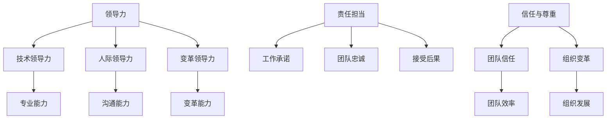

                 

### 文章标题：领导力与责任担当：培养勇于承担责任的品质

> 关键词：领导力，责任担当，品质培养，实践方法，案例分析

> 摘要：本文旨在深入探讨领导力与责任担当的关系，阐述如何培养勇于承担责任的品质。文章通过背景介绍、核心概念分析、理论框架构建、实际应用展示、案例研究和策略与工具的介绍，为读者提供全面的领导力与责任担当培养指南。

### 目录

1. 引言
2. 领导力与责任担当的基础概念
3. 领导力理论框架
4. 责任担当的理论基础
5. 领导力与责任担当在实际工作中的应用
6. 案例研究：领导力与责任担当的最佳实践
7. 提升领导力与责任担当的策略与方法
8. 实践指南：领导力与责任担当的行动指南
9. 反思与展望：领导力与责任担当的未来发展
10. 结论
11. 附录

### 引言

在现代社会中，领导力与责任担当已成为个人和组织成功的关键因素。领导力不仅仅是管理团队的能力，更是一种激励和引导他人共同达成目标的艺术。责任担当则是领导者对自身行为和决策后果的负责任态度。本文将围绕这两个核心概念，探讨如何在实践中培养勇于承担责任的品质。

首先，本文将从背景介绍入手，阐述领导力和责任担当的重要性。接着，通过分析核心概念，构建领导力与责任担当的理论框架。随后，本文将探讨这两个概念在实际工作中的应用，通过具体案例展示成功与失误的经验教训。在此基础上，本文将提供提升领导力与责任担当的策略和方法，以及实践指南。最后，本文将对领导力与责任担当的未来发展进行展望，并总结全文内容。

### 领导力与责任担当的基础概念

#### 领导力

领导力是一种能力，它涉及影响、激励和引导他人以实现共同目标的过程。领导力可以分为三个层次：技术领导力、人际领导力和变革领导力。技术领导力关注的是专业知识和技能的掌握；人际领导力关注的是与团队成员的沟通和互动；变革领导力则强调在组织变革中扮演的角色。

#### 责任担当

责任担当是指个体对自身行为和决策后果的负责任态度。它包括对工作的承诺、对团队的忠诚、对决策后果的接受和对错误的纠正。责任担当是一种内在的品质，它不仅仅是外在的行为表现。

#### 领导力与责任担当的关系

领导力与责任担当密切相关。一位有责任担当的领导者会在决策和行动中展现高度的责任感，从而赢得团队的信任和尊重。同时，领导力中的变革领导力特别强调领导者对组织变革承担的责任。以下是领导力与责任担当关系的流程图：

### 领导力理论框架

#### 领导力发展的阶段模型

领导力发展的阶段模型认为领导力是一个逐步提升的过程。根据领导力理论家Hersey和Blanchard的研究，领导力发展分为四个阶段：依赖阶段、独立阶段、互赖阶段和变革阶段。每个阶段都有其特定的领导风格和特点。

1. **依赖阶段**：领导者依赖他人的指导和支持。
2. **独立阶段**：领导者开始独立决策，但可能缺乏全面的视野。
3. **互赖阶段**：领导者与团队成员共同协作，实现目标。
4. **变革阶段**：领导者能够引导组织进行变革，推动创新。

#### 领导行为的理论分析

领导行为理论主要关注领导者的行为模式和风格。根据不同学者提出的模型，常见的领导行为理论包括：

1. **X理论和Y理论**：X理论认为员工需要严格管理，而Y理论则认为员工具有自我驱动能力。
2. **行为连续体理论**：领导者的行为在专制和民主之间变化，根据不同情境选择合适的领导风格。
3. **情境领导模型**：领导者的风格应根据下属的能力和动机进行调整。

#### 领导力模型的案例分析

领导力模型在实际工作中有着广泛的应用。例如，情境领导模型被广泛应用于团队管理和领导力培训中。以下是一个具体的情境领导模型案例：

**案例：** 小组项目中的领导力应用

在一个小组项目中，领导者需要根据团队成员的能力和动机来调整自己的领导风格。假设团队成员分为高能力低动机和高能力高动机两种类型。

1. **高能力低动机**：领导者可以采用“辅导型”领导风格，通过培训和激励来提高团队成员的动机。
2. **高能力高动机**：领导者可以采用“参与型”领导风格，与团队成员共同决策，增强团队凝聚力。

### 责任担当的理论基础

#### 责任的概念与分类

责任是指个体对自身行为和决策后果的承担。根据不同的分类标准，责任可以划分为以下几种类型：

1. **直接责任**：个体对自己的行为和决策直接承担的责任。
2. **间接责任**：个体对他人的行为和决策后果承担的责任。
3. **个人责任**：个体对自己道德和行为规范的责任。
4. **社会责任**：个体对社会的整体利益承担的责任。

#### 责任担当的心理机制

责任担当涉及个体在心理上的认知和行为。责任担当的心理机制包括：

1. **自我效能感**：个体对自己完成任务的能力的信心。
2. **责任感**：个体对完成任务的承诺和责任感。
3. **归因理论**：个体对成功或失败原因的解释和归因方式。

#### 责任担当的道德维度

责任担当不仅涉及个体的行为和心理，还包括道德层面的考量。责任担当的道德维度包括：

1. **义务论**：个体根据道德原则和规范来承担责任。
2. **结果论**：个体根据行为的后果来承担责任。
3. **美德伦理学**：个体通过培养美德和道德品质来承担责任。

### 领导力与责任担当在实际工作中的应用

#### 领导力在项目管理中的应用

领导力在项目管理中发挥着关键作用。项目经理需要运用领导力来协调团队成员、管理项目进度和应对项目中的挑战。以下是领导力在项目管理中的应用：

1. **团队建设**：通过有效的沟通和激励，提高团队的凝聚力和工作效率。
2. **风险管理**：识别潜在风险，制定应对策略，确保项目顺利进行。
3. **变革管理**：推动项目团队适应组织变革，实现项目的成功交付。

#### 责任担当在团队协作中的体现

责任担当在团队协作中起着至关重要的作用。以下是如何在团队协作中体现责任担当的几个方面：

1. **明确责任**：为团队成员分配明确的任务和责任，确保每个人都清楚自己的角色和职责。
2. **信任与支持**：建立信任关系，为团队成员提供必要的支持和资源。
3. **透明沟通**：保持沟通渠道的畅通，确保团队成员之间信息透明，共同面对问题和挑战。

#### 领导力与责任担当在危机管理中的运用

在危机管理中，领导力和责任担当尤为重要。领导者需要冷静应对危机，迅速做出决策，并承担相应的责任。以下是领导力与责任担当在危机管理中的运用：

1. **快速响应**：及时识别危机，采取有效措施，防止危机扩大。
2. **有效沟通**：与利益相关者保持沟通，确保信息的透明和准确。
3. **承担责任**：对危机的后果承担责任，并采取行动进行纠正和改进。

### 案例研究：领导力与责任担当的最佳实践

#### 成功案例：谷歌的领导力与责任担当

谷歌以其卓越的领导力和责任担当而闻名。以下是谷歌在领导力与责任担当方面的成功实践：

1. **领导力培养**：谷歌注重员工的领导力发展，通过内部培训和项目经验来提升员工的领导力。
2. **责任担当**：谷歌鼓励员工勇于承担责任，支持员工在项目中尝试新事物，并从中学习。

#### 失误案例：泰坦尼克号的领导失误

泰坦尼克号沉没事件是一个典型的领导失误案例。以下是事件中领导力的缺陷：

1. **缺乏危机管理能力**：船长和船员在面临紧急情况时未能采取有效的应对措施。
2. **责任担当缺失**：船员对自身职责的忽视导致灾难的发生。

### 案例对比与启示

通过对成功和失误案例的对比，我们可以得出以下启示：

1. **有效的领导力**：领导者需要具备危机管理能力和责任感，能够在关键时刻做出正确的决策。
2. **责任担当**：责任担当不仅仅是口头上的承诺，更需要体现在实际行动中。

### 提升领导力与责任担当的策略与方法

#### 领导力提升的培训策略

1. **领导力课程**：参加专业的领导力培训课程，系统学习领导力的理论知识和实践技巧。
2. **实践锻炼**：通过实际项目和管理经验来提升领导力，不断反思和总结。
3. **导师指导**：寻找经验丰富的导师，从他们身上学习领导力技巧和经验。

#### 责任担当的培养方法

1. **自我反思**：定期进行自我反思，识别自己在责任担当方面的不足，并制定改进计划。
2. **设定目标**：为自己设定明确的目标和责任，确保在每个项目中都能承担责任。
3. **培养责任感**：通过日常工作和生活的小事培养责任感，逐渐形成负责任的态度。

#### 领导力与责任担当的自我评估与提升

1. **自我评估工具**：使用自我评估工具（如360度评估）来识别自己的优势和不足。
2. **制定改进计划**：根据自我评估的结果，制定具体的改进计划，并逐步实施。
3. **持续学习**：不断学习和实践，不断提升自己的领导力和责任担当能力。

### 实践指南：领导力与责任担当的行动指南

#### 领导力与责任担当的日常实践

1. **积极沟通**：与团队成员保持良好的沟通，了解他们的需求和困难，提供必要的支持和帮助。
2. **明确责任**：在项目启动时，明确团队成员的任务和责任，确保每个人都清楚自己的角色。
3. **勇于承担责任**：在面对挑战和失败时，勇于承担责任，并从中学习。

#### 领导力与责任担当的沟通技巧

1. **有效倾听**：倾听团队成员的意见和建议，了解他们的想法和感受。
2. **积极反馈**：给予团队成员积极的反馈，鼓励他们持续改进。
3. **透明沟通**：保持沟通渠道的畅通，确保信息的透明和准确。

#### 领导力与责任担当的领导风格选择

1. **情境领导**：根据不同情境和团队成员的特点，选择合适的领导风格。
2. **民主领导**：鼓励团队成员参与决策，提高团队的凝聚力和创造力。
3. **权威领导**：在危机情况下，采取果断的决策和行动，确保项目的顺利进行。

### 反思与展望：领导力与责任担当的未来发展

#### 领导力与责任担当的新趋势

随着社会和科技的不断进步，领导力与责任担当也在不断发展。以下是一些新的趋势：

1. **数字化领导力**：数字化时代要求领导者具备数字技能和创新能力。
2. **可持续领导力**：领导者需要关注环境保护和社会责任，推动可持续发展。
3. **敏捷领导力**：领导者需要具备快速适应变化和应对不确定性的能力。

#### 面向未来的领导力与责任担当

面向未来，领导者需要具备以下能力：

1. **全球视野**：理解全球化的影响，适应不同文化和市场。
2. **技术创新**：积极拥抱新技术，推动组织的数字化转型。
3. **情商管理**：提升情商，增强领导力和团队凝聚力。

#### 总结与展望

本文通过深入探讨领导力与责任担当的关系，提供了全面的培养指南。在未来的发展中，领导者需要不断学习和适应，以应对新的挑战和机遇。通过勇于承担责任，领导者将能够推动组织和社会的可持续发展。

### 结论

领导力与责任担当是现代领导者必备的品质。本文从多个角度探讨了领导力与责任担当的概念、理论框架、实际应用和培养方法，为读者提供了全面的指导。通过培养勇于承担责任的品质，领导者将能够更好地推动组织和社会的发展。

### 附录

#### 附录 A：领导力与责任担当相关资源

- **书籍推荐：**
  - 《领导力心理学》
  - 《责任承担：领导力的精髓》
  - 《变革型领导力》

- **在线资源：**
  - 领导力发展课程（如 Coursera、edX）
  - 责任担当研讨会和讲座（如 TED、YouTube）

#### 附录 B：领导力与责任担当的扩展阅读

- **学术文章：**
  - Hersey, P., & Blanchard, K. H. (1993). Management of Organizational Change.
  - Yukl, G. A. (2013). Leadership in Organizations.

- **实践指南：**
  - 克里斯·阿吉里斯，《个人领导力发展指南》
  - 雷恩·马丁，《责任领导力实践手册》

### 作者信息

作者：AI天才研究院/AI Genius Institute & 禅与计算机程序设计艺术 /Zen And The Art of Computer Programming

