                 


### 文章标题：领导力与责任担当：培养负责任的团队文化

**关键词：** 领导力，责任担当，团队文化，团队管理，沟通，领导风格，职业道德，实践应用

**摘要：** 本篇文章旨在深入探讨领导力与责任担当在培养负责任的团队文化中的关键作用。通过分析领导力的核心要素、责任担当的重要性，以及如何构建和维护负责任的团队文化，文章提供了实用的策略和方法，帮助领导者提升团队效能，实现持续发展。

----------------------------------------------------------------

### 第一部分：领导力基础理论

#### 第1章：领导力的定义与核心要素

**背景介绍：** 
领导力是一种影响力和号召力，它不仅仅是职位赋予的权利，更是一种能力和艺术。在信息技术迅速发展的今天，领导力的重要性日益凸显。一个高效的团队离不开具有强大领导力的领导者。

**核心概念与联系：** 
领导力包括以下几个方面：
1. **影响力：** 领导者通过言行和决策影响团队成员的态度和行为。
2. **目标设定：** 领导者明确团队的目标和方向，激发团队成员的积极性和创造力。
3. **沟通：** 领导者通过有效的沟通建立信任，传递信息，解决问题。
4. **决策：** 领导者做出明智的决策，为团队的发展指明方向。
5. **激励：** 领导者通过激励手段激发团队成员的内在动力。

**Mermaid 流程图：** 

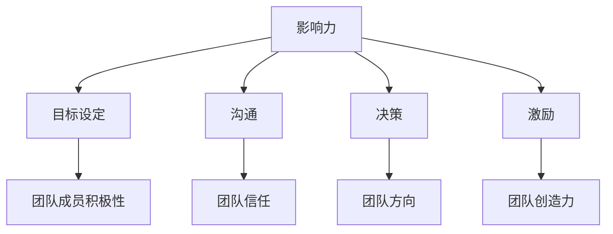

#### 第2章：领导力的发展阶段

**核心概念与联系：** 
领导力的发展可以分为以下几个阶段：
1. **成长阶段：** 领导者通过学习和实践提升自己的能力。
2. **授权阶段：** 领导者开始将权力下放，培养团队成员的自主性。
3. **成熟阶段：** 领导者具备了全面的领导能力，能够有效管理团队。

**Mermaid 流程图：** 

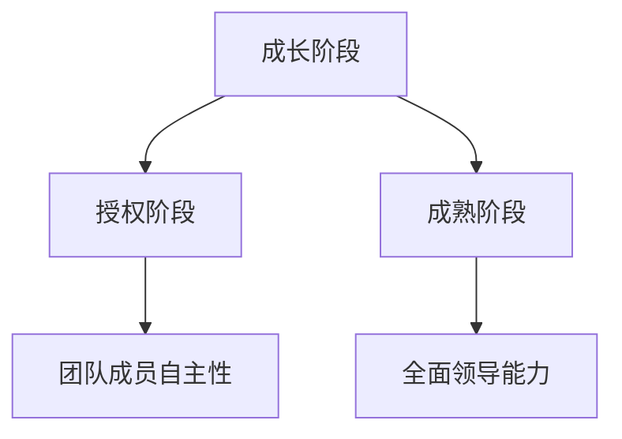

#### 第3章：领导风格与团队文化

**核心概念与联系：** 
领导风格包括：
1. **权威型：** 领导者决策迅速，强调权威。
2. **民主型：** 领导者重视团队成员的意见，共同决策。
3. **参与型：** 领导者鼓励团队成员参与决策，提高团队凝聚力。

团队文化是团队共同价值观和行为的体现，良好的团队文化有助于提升团队效能。

**Mermaid 流程图：** 

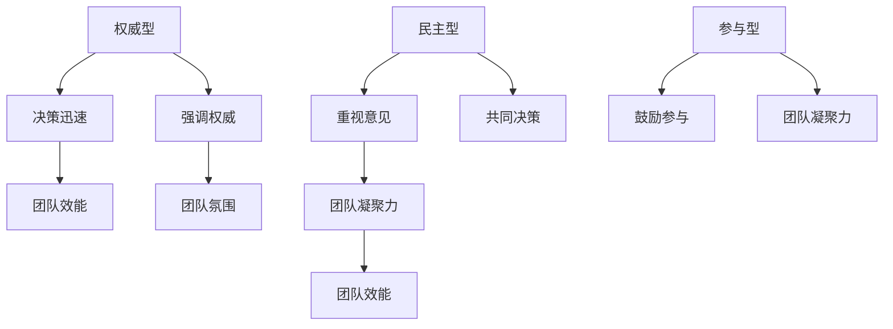

---

### 第二部分：责任担当与团队管理

#### 第4章：责任担当的概念与重要性

**背景介绍：** 
责任担当是指个体或团队在行动中承担责任，对自己、对团队、对组织负责的态度和行为。

**核心概念与联系：** 
1. **个人责任：** 每个团队成员都应该对自己的行为负责。
2. **团队责任：** 团队成员共同承担团队的任务和目标。
3. **职业道德：** 责任担当与职业道德密切相关，良好的职业道德有助于培养负责任的团队文化。

**Mermaid 流程图：** 

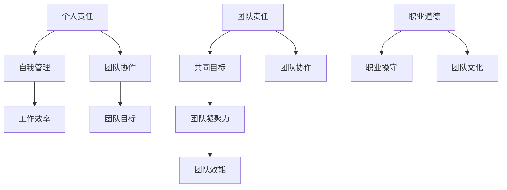

#### 第5章：构建负责任的团队文化

**核心概念与联系：** 
构建负责任的团队文化需要以下几个步骤：
1. **明确责任：** 确定每个团队成员的职责和任务。
2. **建立信任：** 通过透明、开放和诚实的沟通建立信任。
3. **培养责任感：** 提供培训和支持，培养团队成员的责任感。

**Mermaid 流steady```mermaid
graph TD
A[明确责任] --> B[职责划分]
A --> C[任务分配]
B --> D[工作效率]
C --> E[团队协作]
F[建立信任] --> G[透明沟通]
F --> H[开放沟通]
G --> I[团队信任]
H --> J[团队协作]
I --> K[团队凝聚力]
L[培养责任感] --> M[培训支持]
L --> N[责任意识]
M --> O[团队效能]
N --> P[团队协作]
```

#### 第6章：团队沟通与责任担当

**核心概念与联系：** 
沟通在团队中起着至关重要的作用。有效的沟通有助于建立信任，促进责任担当。

**Mermaid 流程图：** 

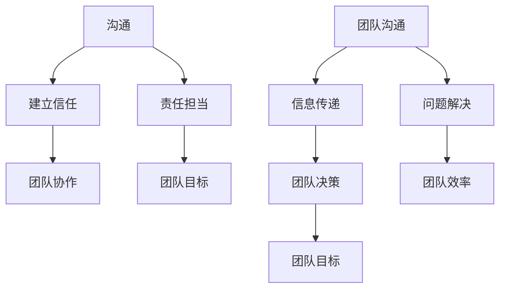

#### 第7章：领导者在责任担当中的角色

**核心概念与联系：** 
领导者是团队责任的担当者，他们需要承担以下角色：
1. **榜样：** 以身作则，树立良好的榜样。
2. **推动者：** 推动团队成员承担责任。
3. **协调者：** 协调团队内部和外部的资源，确保责任得到履行。

**Mermaid 流程图：** 

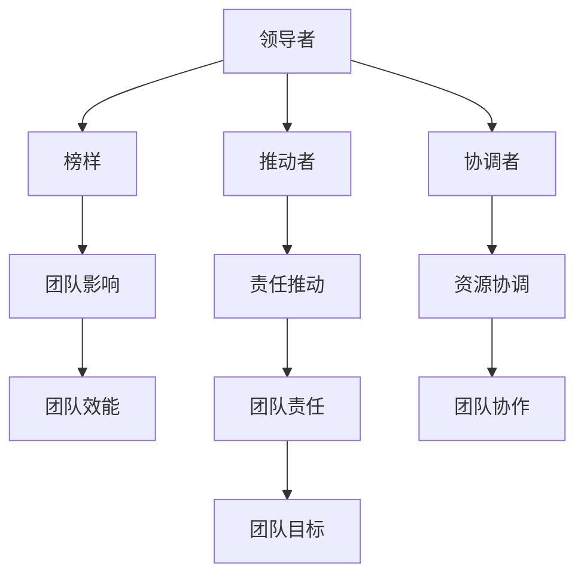

---

### 第三部分：实践与案例

#### 第8章：责任担当与领导力提升

**核心概念与联系：** 
责任担当与领导力提升密切相关。领导者通过责任担当，可以提升自己的领导能力，同时培养负责任的团队文化。

**Mermaid 流程图：** 

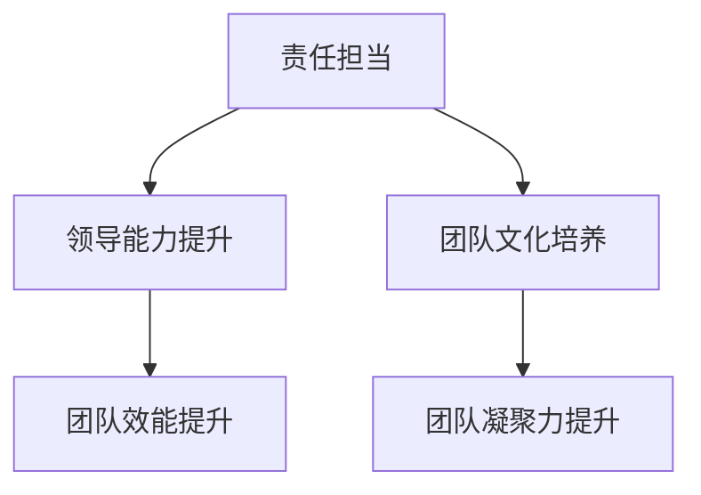

#### 第9章：领导力与责任担当的实践应用

**核心概念与联系：** 
领导力与责任担当在实践中需要具体的应用。通过以下策略，领导者可以提升团队的效能：

1. **明确目标和责任：** 确保团队成员了解目标，并明确各自的职责。
2. **提供支持和资源：** 为团队成员提供必要的支持和资源，帮助他们履行责任。
3. **激励和反馈：** 通过激励和反馈机制，鼓励团队成员承担责任。

**Mermaid 流程图：** 

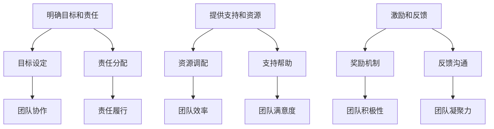

#### 第10章：培养负责任的团队文化

**核心概念与联系：** 
培养负责任的团队文化是一个长期的过程，需要领导者持续的努力。以下策略可以帮助领导者实现这一目标：

1. **制定明确的价值观：** 明确团队的价值观，并将其融入到日常工作中。
2. **建立信任：** 通过开放、透明和诚实的沟通建立信任。
3. **提供培训和支持：** 为团队成员提供相关的培训和支持，帮助他们更好地承担责任。

**Mermaid 流程图：** 

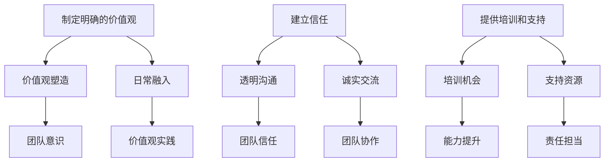

---

### 附录：领导力与责任担当的工具与方法

**核心概念与联系：** 
为了更好地理解和应用领导力与责任担当，以下是几个实用的工具和方法：

1. **领导力评估工具：** 用于评估领导者的领导能力，包括自我评估和团队评估。
2. **责任担当评估工具：** 用于评估团队成员的责任担当水平。
3. **团队文化建设工具：** 用于帮助领导者建立和维护负责任的团队文化。

**Mermaid 流程图：** 

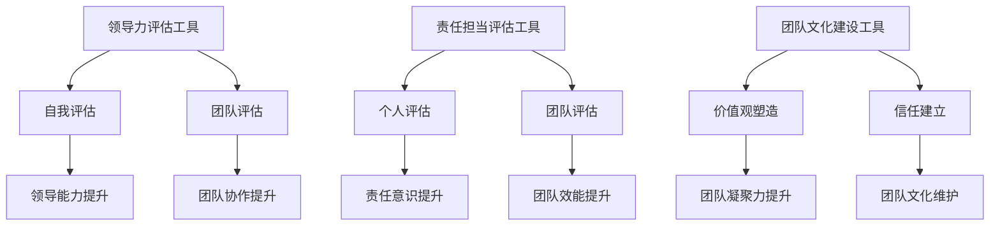

---

### 小结与注意事项

**核心概念与联系：** 
通过本文的探讨，我们可以看到领导力与责任担当在团队管理中的重要性。领导者需要不断提升自己的领导能力，同时培养团队成员的责任担当。以下是一些最佳实践的小结和注意事项：

1. **持续学习：** 领导者需要不断学习和提升自己的能力，以适应不断变化的环境。
2. **以身作则：** 领导者要以身作则，树立良好的榜样。
3. **透明沟通：** 建立透明、开放和诚实的沟通机制，增强团队的信任。
4. **提供支持：** 为团队成员提供必要的支持和资源，帮助他们更好地承担责任。
5. **激励机制：** 通过激励和反馈机制，鼓励团队成员承担责任。

**Mermaid 流程图：** 

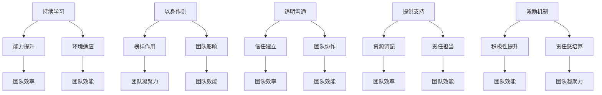

---

### 拓展阅读

**核心概念与联系：** 
以下是一些扩展阅读资源，可以帮助读者更深入地了解领导力与责任担当的相关知识：

1. **《领导力的五个层次》** - 史蒂夫·科维
2. **《责任心理学》** - 斯蒂芬·罗宾斯
3. **《团队协作的艺术》** - 罗伯特·斯拉特金
4. **《敏捷领导力》** - 杰夫·萨塞尔
5. **《团队领导力》** - 詹姆斯·M·凯瑟

**Mermaid 流程图：** 

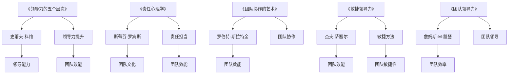

---

**作者：** AI天才研究院/AI Genius Institute & 禅与计算机程序设计艺术 /Zen And The Art of Computer Programming

---

通过本文的探讨，我们可以看到领导力与责任担当在团队管理中的重要性。领导者需要不断提升自己的领导能力，同时培养团队成员的责任担当，以实现团队的高效运作和持续发展。希望本文能为您提供有益的启示和实用的策略。

