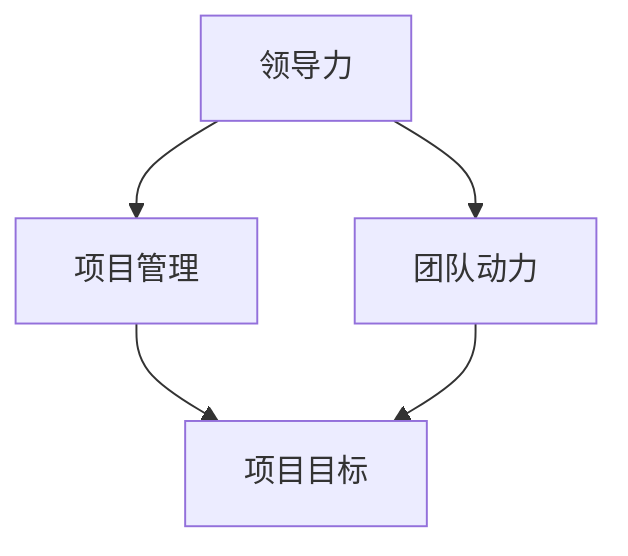
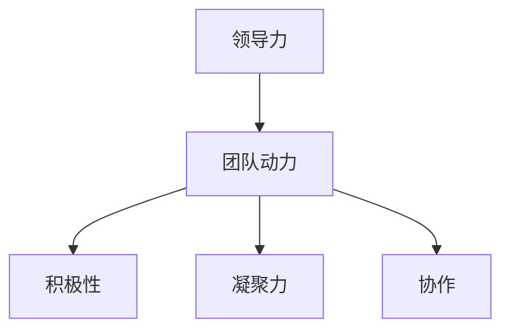
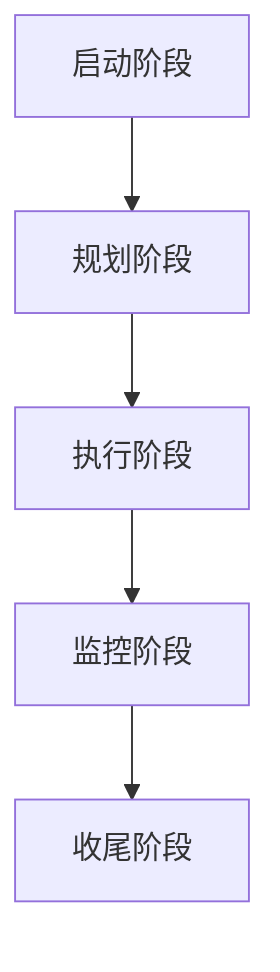

                 

### 引言

在当今快速变化的技术和商业环境中，领导力和项目推进能力已成为组织成功的关键因素。高效的项目管理和团队领导不仅是IT行业从业者必备的技能，也是企业中高层管理人员的重要素质。本文旨在探讨领导力与项目推进之间的关系，以及如何通过有效的领导力来确保团队任务的高效完成。

#### 背景介绍

项目推进是一个复杂的过程，涉及到多个环节和多个角色的协作。在IT行业中，项目推进往往涉及软件开发、系统集成、项目管理等多个方面。领导力则是贯穿于项目整个生命周期中的一种核心能力，它不仅影响项目的成功与否，也决定了团队士气和工作效率。有效的领导力能够激发团队成员的潜力，促进创新，减少冲突，提高团队的凝聚力。

#### 核心概念与联系

为了更好地理解领导力与项目推进的关系，我们需要先明确几个核心概念：

1. **领导力**：领导力是一种影响和激励他人达成共同目标的能力。根据不同的情境和团队需求，领导力可以表现为不同的风格和策略。
2. **项目管理**：项目管理是指通过规划、执行、监控和收尾过程，确保项目目标得以实现的一系列活动和行动。
3. **团队动力**：团队动力是指团队成员之间的相互影响和互动，它对项目的成功至关重要。

以下是领导力、项目管理和团队动力之间的关系架构 Mermaid 流程图：



#### 文章摘要

本文将深入探讨领导力在项目推进中的重要性，分析不同领导力模型在项目中的应用，介绍项目管理的核心原理，并提供一系列高效任务执行的方法。通过实战案例分析，读者将能够了解如何在实际项目中运用这些方法和原则，提高团队效率和项目成功率。文章最后还将总结领导力和项目推进的最佳实践，并提出未来趋势和挑战。

### 领导力基础

领导力是推动团队向前发展的关键动力。在本节中，我们将探讨领导力的定义、分类以及常见的领导力模型。

#### 领导力的定义

领导力是一种能够影响和激励他人朝着共同目标努力的能力。它不仅仅是指导和指挥，更是一种引导和激励他人的艺术。领导力不仅仅存在于高层管理人员中，每个团队成员都可以通过自己的行为和态度展现出领导力。

#### 领导力的分类

领导力可以根据不同的维度和标准进行分类。以下是一些常见的领导力分类：

1. **变革型领导**：变革型领导注重激发团队成员的潜力和创造力，通过愿景和激励来引导团队。这种领导风格通常在项目面临重大变革或创新时最为有效。
2. **情境领导**：情境领导理论认为，领导风格应该根据团队成员的成熟度和项目的具体情况来调整。它强调领导者需要根据不同情境采取不同的领导方式。
3. **服务型领导**：服务型领导强调领导者为团队成员提供服务，关注团队成员的需求和成长。这种领导风格有助于建立信任和团队合作。

#### 领导力模型

以下是几种常见的领导力模型：

1. **变革型领导**

   变革型领导通过以下方式影响团队成员：

   - **激励与鼓励**：领导者鼓励团队成员发挥自己的潜力，提供正面的反馈和奖励。
   - **创新与愿景**：领导者通过描绘愿景和创新思维来激发团队成员的创造力。
   - **影响与领导**：领导者通过个人魅力和影响力来引导团队成员。

   **核心算法原理讲解**：

   ```plaintext
   function 变革型领导(团队成员，愿景，奖励机制) {
       if (团队成员潜力未发挥) {
           激励团队成员，增加奖励；
           展示愿景，激发创造力；
       }
       if (团队成员面临挑战) {
           通过个人魅力和影响力引导；
       }
   }
   ```

2. **情境领导**

   情境领导模型根据团队成员的成熟度调整领导风格：

   - **指导型**：在团队成员成熟度较低时，领导者提供明确的指导和监督。
   - **支持型**：在团队成员成熟度中等时，领导者提供支持和鼓励，帮助成员自我管理。
   - **委托型**：在团队成员成熟度较高时，领导者将权力下放，让成员自主决策。

   **伪代码**：

   ```plaintext
   function 情境领导(团队成员成熟度) {
       if (成熟度低) {
           指导并监督；
       } else if (成熟度中等) {
           提供支持和鼓励；
       } else if (成熟度高) {
           委托权力，自主决策；
       }
   }
   ```

3. **服务型领导**

   服务型领导关注团队成员的需求和成长：

   - **倾听与理解**：领导者倾听团队成员的需求，理解他们的挑战。
   - **支持与发展**：领导者提供资源和支持，帮助团队成员发展技能。
   - **建立信任**：领导者通过建立信任关系，增强团队凝聚力。

   **数学模型和公式**：

   设定信任度函数 $T$，领导者的行为对信任度的影响可以表示为：

   $$ T = f(\frac{S}{C}) $$

   其中，$S$ 表示领导者为团队成员提供的服务，$C$ 表示团队成员的需求。

   **举例说明**：

   假设某团队领导者每周与团队成员进行一次沟通，提供技术支持和培训，团队成员对领导者的信任度逐渐增加。通过公式计算，信任度 $T$ 会随着 $S$ 的增加而提高。

#### 领导力与团队动力

领导力对团队动力有着深远的影响。有效的领导力能够激发团队成员的积极性，提高团队凝聚力，促进团队协作。以下是一个简单的 Mermaid 流程图，展示了领导力与团队动力的关系：



通过有效的领导力，领导者可以建立积极的团队文化，促进团队成员之间的相互支持与合作，从而提高整个团队的工作效率。

### 项目管理基础知识

项目管理是确保项目按时、按预算、按质量完成的系统过程。它涉及到多个关键阶段，每个阶段都有其特定的目标和任务。以下是项目管理的基础知识，包括项目生命周期、关键阶段和常见方法。

#### 项目生命周期

项目生命周期是项目从开始到结束的完整过程。一般来说，项目生命周期可以分为以下几个阶段：

1. **启动阶段**：项目的启动阶段包括项目立项、制定项目章程和初步计划。这一阶段的主要任务是确定项目的目标和范围，明确项目的可行性。
   
2. **规划阶段**：在规划阶段，项目团队制定详细的项目计划，包括工作分解结构（WBS）、进度计划、资源分配和预算等。这一阶段的目标是确保项目在合理的范围内进行。

3. **执行阶段**：执行阶段是项目计划的实际实施过程。项目团队根据计划开展工作，确保各项工作按时、按质量完成。这一阶段的关键是有效沟通和团队协作。

4. **监控阶段**：在监控阶段，项目团队对项目的进度、质量和成本进行跟踪和监控。通过定期的项目评审和进度报告，项目团队可以及时发现和解决问题。

5. **收尾阶段**：项目收尾阶段包括项目交付、验收和总结。这一阶段的目标是确保项目成果满足预期要求，并从项目中总结经验教训，为未来的项目提供参考。

以下是项目生命周期的 Mermaid 流程图：



#### 关键阶段

在项目生命周期中，每个阶段都有其特定的任务和目标。以下是每个关键阶段的详细介绍：

1. **启动阶段**：主要任务是确定项目的目标和范围，明确项目的可行性。这一阶段的关键输出包括项目章程和初步项目计划。

2. **规划阶段**：主要任务是制定详细的项目计划，包括工作分解结构（WBS）、进度计划、资源分配和预算等。这一阶段的关键输出是详细的项目计划文档。

3. **执行阶段**：主要任务是按照项目计划执行项目工作，确保各项工作按时、按质量完成。这一阶段的关键是有效的团队协作和沟通。

4. **监控阶段**：主要任务是监控项目的进度、质量和成本，及时发现和解决问题。这一阶段的关键是定期的项目评审和进度报告。

5. **收尾阶段**：主要任务是完成项目交付、验收和总结。这一阶段的关键是确保项目成果满足预期要求，并从项目中总结经验教训。

#### 常见方法

项目管理中常用的方法包括：

1. **敏捷开发**：敏捷开发是一种迭代和增量的软件开发方法，强调灵活性和响应变化。它通过短周期的迭代（Sprint）来快速交付可用的软件，并进行持续的反馈和调整。

2. **六西格玛**：六西格玛是一种质量管理方法，旨在通过减少过程变异来提高产品质量。它通过统计分析工具和方法，对项目过程进行监控和改进。

3. **项目管理框架**：常见的项目管理框架包括PMBOK（项目管理知识体系）和PRINCE2（项目管理方法和流程）。这些框架提供了系统的项目管理方法和流程，帮助项目团队更好地规划、执行和监控项目。

#### 项目管理工具与技术

项目管理工具和技术有助于项目团队更高效地规划和执行项目。以下是一些常见的管理工具和技术：

1. **甘特图**：甘特图是一种用于表示项目进度和任务的图形工具。它通过条形图来展示项目的时间线和进度，帮助项目团队直观地了解项目状态。

2. **看板（Kanban）**：看板是一种可视化工具，用于展示项目的工作流程和进度。它通过卡片和看板板来管理任务，确保任务有序进行，并帮助团队识别和解决瓶颈。

3. **敏捷工具**：如JIRA、Trello和Asana等，这些工具支持敏捷开发方法，帮助团队进行任务管理、进度跟踪和协作。

4. **风险管理工具**：如RiskM Hexagon、RiskLens等，这些工具用于识别、评估和管理项目风险，确保项目顺利进行。

通过以上项目管理的核心知识和方法，项目团队可以更好地规划和执行项目，提高项目成功的可能性。接下来，我们将进一步探讨项目推进的具体方法和策略。

### 项目生命周期与阶段划分

项目生命周期是项目管理的重要组成部分，它定义了项目从启动到结束的整个流程。项目生命周期的阶段划分有助于明确项目各个阶段的目标和任务，确保项目有条不紊地进行。以下将详细介绍项目生命周期的各个阶段及其主要活动。

#### 启动阶段

启动阶段是项目的开始，其主要目标是确定项目的目标和范围，确保项目的可行性。以下是启动阶段的主要活动：

1. **项目立项**：在项目立项过程中，项目发起人或管理层对项目进行初步评估，确定项目的目标、范围和预期成果。

2. **制定项目章程**：项目章程是项目的正式文件，它概述了项目的目标、范围、主要利益相关者和管理结构。项目章程为项目的启动提供了法律依据和指导。

3. **初步项目计划**：在初步项目计划阶段，项目团队制定一个简化的项目计划，包括项目的主要里程碑、关键交付物和时间表。

4. **资源评估**：评估项目所需的资源，包括人力、资金、技术和材料等，以确保项目能够顺利进行。

#### 规划阶段

规划阶段是项目生命周期的关键阶段，其主要目标是详细规划项目的工作、资源、时间和成本。以下是规划阶段的主要活动：

1. **工作分解结构（WBS）**：工作分解结构是将项目工作分解为可管理的小任务的过程。WBS有助于明确项目的任务和责任，确保所有工作都被涵盖。

2. **项目计划**：项目计划是详细描述项目如何进行、何时进行和由谁进行的文档。项目计划包括进度计划、资源计划、成本计划和风险管理计划等。

3. **风险识别**：在规划阶段，项目团队识别可能影响项目成功的潜在风险，并制定相应的应对策略。

4. **沟通计划**：沟通计划定义了项目团队内部以及与外部利益相关者的沟通方法和频率，以确保信息的有效传递。

5. **质量计划**：质量计划描述了项目如何确保交付的成果满足预定的质量标准。

#### 执行阶段

执行阶段是项目计划的实施过程，项目团队按照项目计划开展工作，确保各项任务按时、按质量完成。以下是执行阶段的主要活动：

1. **任务分配**：将项目任务分配给合适的团队成员，明确每个成员的责任和任务。

2. **进度跟踪**：项目团队定期检查项目进度，确保项目按计划进行。如果发现进度偏差，需要及时调整计划。

3. **资源管理**：管理项目所需的资源，确保资源得到有效利用，避免资源浪费。

4. **质量管理**：项目团队执行质量计划，确保项目交付物符合质量标准。

5. **风险管理**：根据风险管理计划，项目团队监测风险，并采取措施来降低风险对项目的影响。

#### 监控阶段

监控阶段是对项目执行过程中的进度、质量和成本进行监控和调整的阶段。以下是监控阶段的主要活动：

1. **项目评审**：定期进行项目评审，评估项目的进展情况和成果质量，确保项目按照预期进行。

2. **进度报告**：项目团队编写并提交进度报告，详细描述项目的当前状态、完成的任务和未来的计划。

3. **变更管理**：监控项目变更，确保所有变更都经过适当的审批和记录。

4. **问题解决**：识别和解决项目中出现的问题，确保项目能够继续顺利执行。

#### 收尾阶段

收尾阶段是项目的结束阶段，其主要目标是确保项目的所有交付物都符合要求，并从项目中总结经验教训。以下是收尾阶段的主要活动：

1. **项目交付**：确保项目交付物经过验收，满足项目要求。

2. **项目验收**：项目团队和客户共同验收项目交付物，确认项目成功完成。

3. **项目总结**：编写项目总结报告，记录项目的成功经验和教训，为未来的项目提供参考。

4. **项目评估**：对项目进行评估，确定项目的整体绩效和成本效益。

通过以上项目生命周期各阶段的详细描述，项目团队可以更好地理解和执行项目的各个环节，确保项目成功完成。接下来，我们将探讨项目推进的具体方法和策略。

### 高效任务执行

在项目推进过程中，高效的任务执行是确保项目成功的关键。以下将从团队建设、任务分解与分配、时间管理与优先级设定、质量控制与风险管理等方面，介绍高效任务执行的方法和策略。

#### 高效团队建设

高效团队建设是项目成功的基础。一个高效团队需要具备以下特征：

1. **明确的角色与责任**：每个团队成员都应该清楚自己的角色和责任，确保团队成员之间有明确的分工。

2. **良好的沟通与协作**：团队成员之间应该保持良好的沟通，确保信息的透明和及时传递。使用适当的协作工具，如团队聊天软件、项目管理平台等，有助于提高团队协作效率。

3. **冲突管理**：在团队中，冲突难以避免。有效的冲突管理策略可以帮助团队化解矛盾，促进合作。冲突管理包括开放沟通、寻求共同目标、调解和仲裁等方法。

4. **激励机制**：适当的激励机制可以激发团队成员的积极性和创造力。激励机制可以是奖励、晋升机会、培训等。

#### 任务分解与分配

任务分解与分配是确保任务高效完成的重要环节。以下是一些关键步骤：

1. **任务分解**：将项目目标分解为具体的任务，明确每个任务的输入、输出和交付标准。

2. **任务分配**：根据团队成员的技能和经验，合理分配任务。确保每个成员都有足够的时间和资源来完成任务。

3. **任务跟进**：定期检查任务的进度，确保任务按时、按质量完成。使用任务管理工具，如JIRA、Trello等，有助于跟踪任务进度。

#### 时间管理与优先级设定

时间管理和优先级设定是确保任务按时完成的关键。以下是一些策略：

1. **制定详细的时间计划**：为每个任务分配明确的时间框架，制定详细的进度计划。

2. **优先级排序**：根据任务的重要性和紧急性，对任务进行优先级排序。紧急且重要的任务应优先处理。

3. **时间管理工具**：使用时间管理工具，如日历、时间追踪软件等，有助于更好地管理时间和任务。

4. **定期回顾和调整**：定期回顾任务进度和时间计划，根据实际情况进行调整。

#### 质量控制与风险管理

质量控制与风险管理是确保项目交付物符合质量要求和降低风险的关键。以下是一些策略：

1. **质量标准**：制定明确的质量标准，确保所有交付物都符合预定的质量要求。

2. **质量控制**：在项目执行过程中，定期进行质量控制检查，确保项目交付物符合质量标准。

3. **风险管理**：识别项目中的潜在风险，并制定相应的应对策略。风险管理包括风险识别、评估、应对和监控。

4. **风险监控**：定期监控项目风险，及时采取措施来降低风险对项目的影响。

通过以上方法，项目团队可以高效地完成各项任务，确保项目成功推进。接下来，我们将通过实际案例来分析这些方法在项目中的应用。

### 实战案例分析

为了更好地理解领导力与项目推进在现实中的具体应用，我们将分析两个成功的项目案例，并探讨其成功背后的关键因素。

#### 案例一：项目A的成功推进

**项目背景**：项目A是一家大型科技公司开发的一款新型移动应用，旨在提供智能家居解决方案。项目团队由20名成员组成，包括软件工程师、产品经理、设计师和市场专家。

**领导力应用**：项目经理采用了变革型领导风格，通过以下方式推动项目进展：

1. **愿景与激励**：项目经理为团队描绘了清晰的愿景，并定期举行团队会议，强调项目的目标和重要性，激发团队成员的创造力和积极性。

2. **个性化领导**：项目经理根据团队成员的个性和技能，调整领导方式。对于具有创新思维的工程师，项目经理提供了更多的自主权；对于需要监督和支持的设计师，项目经理提供了额外的资源和支持。

3. **冲突管理**：在项目进行过程中，项目经理有效地解决了团队内部的冲突，通过开放沟通和调解，确保团队成员能够和谐合作。

**项目管理方法**：

1. **敏捷开发**：项目团队采用了敏捷开发方法，通过短周期的迭代（Sprint）来快速交付可用的功能，并进行持续的反馈和调整。

2. **风险管理**：项目团队在规划阶段就识别了潜在的风险，并制定了详细的风险管理计划。通过定期评估和调整，项目团队有效地降低了风险对项目的影响。

**成功因素**：

1. **有效的领导力**：变革型领导风格激发了团队成员的创造力和积极性，确保了项目的顺利进行。

2. **敏捷开发**：敏捷方法提高了团队的工作效率和灵活性，确保了项目的快速迭代和持续改进。

3. **风险管理**：有效的风险管理策略帮助项目团队提前识别和应对潜在的风险，确保了项目的稳定性。

#### 案例二：团队B的高效执行

**项目背景**：团队B是一个负责开发企业级软件的团队，其项目B旨在为一家大型金融机构提供一个全面的数据分析平台。项目团队由15名成员组成，包括数据科学家、软件开发工程师和项目经理。

**领导力应用**：项目经理采用了服务型领导风格，通过以下方式推动项目进展：

1. **倾听与理解**：项目经理在项目启动阶段花时间与团队成员沟通，了解他们的需求和期望，确保团队成员感到被重视。

2. **支持与发展**：项目经理提供了丰富的培训资源，帮助团队成员提高技能，并鼓励他们参与行业会议和研讨会，以保持对最新技术的了解。

3. **建立信任**：项目经理通过透明的沟通和公平的决策，建立了团队成员之间的信任，增强了团队的凝聚力。

**项目管理方法**：

1. **六西格玛**：项目团队采用了六西格玛质量管理方法，通过过程优化和数据驱动的决策，提高了项目交付物的质量和可靠性。

2. **看板管理**：项目团队使用了看板（Kanban）方法来管理任务和进度，确保任务有序进行，并快速识别和解决瓶颈。

**成功因素**：

1. **服务型领导**：项目经理通过倾听和支持团队成员，建立了信任和团队合作，提高了团队的士气和效率。

2. **六西格玛**：六西格玛方法帮助项目团队优化了工作流程，减少了过程变异，提高了项目交付物的质量。

3. **看板管理**：看板方法提高了任务管理的可视化和透明度，确保了项目的顺利进行。

通过以上两个案例，我们可以看到，成功的项目推进不仅需要有效的领导力，还需要合适的项目管理方法和工具。有效的领导力激发了团队成员的潜力，促进了创新和协作，而科学的项目管理方法确保了项目的顺利进行和高质量交付。这些案例为其他项目团队提供了宝贵的经验和启示。

### 总结与展望

在本文中，我们探讨了领导力与项目推进之间的关系，分析了不同领导力模型在项目中的应用，介绍了项目管理的基础知识，并提供了高效任务执行的方法。通过案例分析和实战经验，我们了解了如何在实际项目中运用这些方法和原则，提高团队效率和项目成功率。

#### 领导力与项目推进的最佳实践

1. **变革型领导**：通过愿景和激励，激发团队成员的创造力和积极性。
2. **情境领导**：根据团队成员的成熟度和项目需求，灵活调整领导风格。
3. **服务型领导**：关注团队成员的需求和成长，建立信任和团队合作。
4. **敏捷开发**：快速迭代和反馈，提高项目的灵活性和响应能力。
5. **六西格玛**：通过过程优化和数据驱动，提高项目交付物的质量。
6. **看板管理**：可视化任务管理，确保任务有序进行。

#### 小结

有效的领导力是项目成功的关键，它能够激发团队成员的潜力，促进创新和协作。科学的项目管理方法和工具则确保了项目的顺利进行和高质量交付。通过本文的探讨，我们相信读者能够更好地理解领导力与项目推进的重要性，并在实际工作中运用这些方法和原则。

#### 注意事项

1. 领导力应结合具体项目情境和团队特点，灵活应用不同的领导风格。
2. 项目管理方法应根据项目规模和复杂性选择，不要盲目追求复杂的工具和方法。
3. 定期进行项目评审和风险监控，确保项目按计划进行，及时调整策略。

#### 拓展阅读

1. 《敏捷软件开发：实践指南》 - 布鲁克斯（Brooks），详细介绍了敏捷开发的方法和实践。
2. 《六西格玛管理指南》 - 霍尔（Hole），阐述了六西格玛质量管理的方法和工具。
3. 《领导力的五个层次》 - 史蒂文·柯维（Covey），深入探讨了领导力的本质和层次。

通过本文的总结与展望，我们希望能够为读者提供有价值的思考和实际操作的指导，帮助他们在项目推进中取得更大的成功。

### 附录

在本附录中，我们将提供一些有用的工具、资源和技术文档，以帮助读者深入理解并实践领导力与项目推进的相关知识和方法。

#### 附录A：领导力与项目管理工具列表

1. **JIRA**：一款流行的项目管理工具，适用于敏捷开发方法，提供任务管理、进度跟踪和团队协作功能。
2. **Trello**：一个简单直观的看板工具，适合小团队和项目管理工作，支持任务分配和进度可视化。
3. **Asana**：一款功能丰富的项目管理平台，支持任务分配、进度跟踪、时间管理和团队协作。
4. **Notion**：一个多功能的笔记和组织工具，可以用于创建团队文档、任务清单和项目管理。
5. **Microsoft Teams**：微软的团队协作平台，提供实时通信、视频会议和文件共享功能，适用于远程团队。

#### 附录B：推荐阅读书目与资源

1. 《敏捷软件开发：实践指南》 - 克里斯·布鲁克斯（Chris Brooks），详细介绍了敏捷开发的方法和实践。
2. 《六西格玛管理指南》 - 斯蒂芬·霍夫曼（Stephen Hofmann），阐述了六西格玛质量管理的方法和工具。
3. 《领导力的五个层次》 - 史蒂文·柯维（Stephen R. Covey），深入探讨了领导力的本质和层次。
4. 《项目管理知识体系指南（PMBOK指南）》 - 项目管理协会（Project Management Institute），提供了全面的项目管理理论和实践。
5. 《敏捷项目管理：实践指南》 - 布鲁斯·麦克卡恩（Bruce MacEwan），介绍了敏捷项目管理的方法和最佳实践。

#### 附录C：技术文档与参考资料

1. **敏捷开发框架**：Scrum、Kanban、XP等敏捷开发框架的官方文档和指南。
2. **六西格玛工具与方法**：六西格玛协会（Six Sigma Academy）提供的在线教程和工具包。
3. **项目管理工具文档**：JIRA、Trello、Asana等项目管理工具的官方用户手册和教程。

通过这些工具、资源和技术文档，读者可以更好地应用本文中介绍的方法和原则，在实际项目中提升领导力和项目管理能力。

### 作者信息

作者：AI天才研究院/AI Genius Institute & 禅与计算机程序设计艺术 /Zen And The Art of Computer Programming

本文由AI天才研究院（AI Genius Institute）和《禅与计算机程序设计艺术》（Zen And The Art of Computer Programming）的作者共同撰写，旨在探讨领导力与项目推进在IT领域的应用。作者具有丰富的项目管理和领导力经验，致力于推动高效的技术实践和团队协作。

