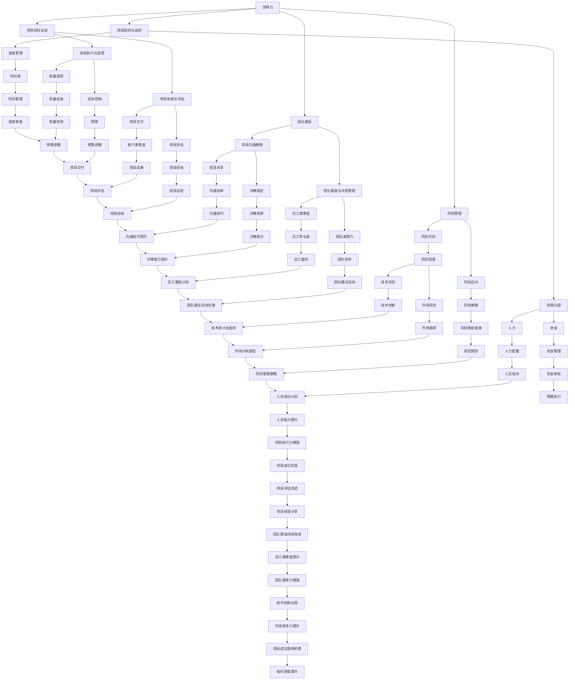
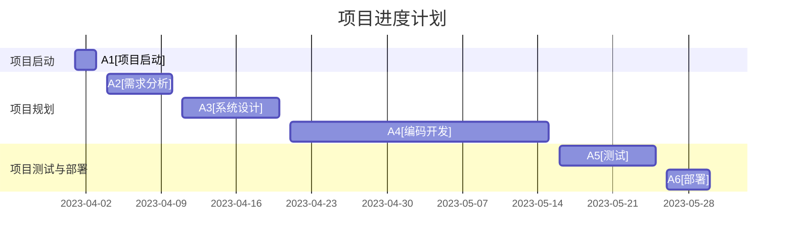
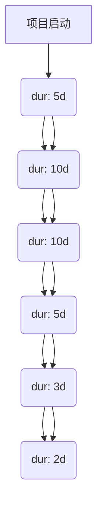
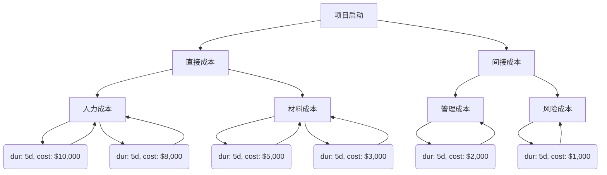
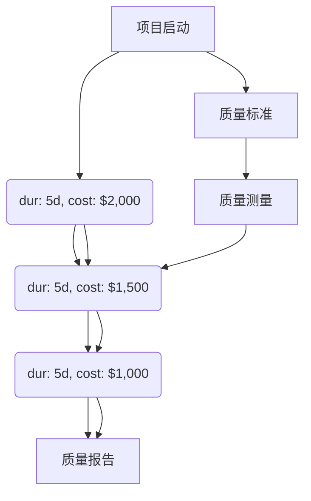

                 

## 文章标题：领导力与项目管理：确保有效执行

在当今快速变化和高度竞争的商业环境中，领导力和项目管理是确保组织成功的关键要素。有效的领导力可以激发团队的潜能，而科学的项目管理则能够确保项目按时、按预算和高质量地完成。本文将深入探讨领导力和项目管理之间的关系，以及如何通过有效的执行来达成组织目标。

### 关键词：
- **领导力**
- **项目管理**
- **团队协作**
- **项目执行**
- **组织效能**
- **目标实现**

### 摘要：
本文将从领导力的核心概念出发，逐步探讨领导力在项目管理中的关键作用。通过详细分析项目管理的各个阶段，我们将展示如何利用领导力来确保项目的有效执行。文章还将结合实际案例，探讨项目管理中的最佳实践和未来趋势，为读者提供实用的指导。

## 引言

在复杂和动态的商业环境中，组织的目标往往需要通过一系列项目来实现。这些项目可能包括新产品开发、市场推广活动、系统升级等。项目管理的核心任务是将资源、时间和技术结合起来，以实现预定的目标。而领导力则是推动项目成功的关键因素。一个优秀的领导者不仅能够设定清晰的目标，还能够激发团队的动力，解决项目中的各种挑战。

本文将首先介绍领导力的核心概念，然后详细探讨项目管理的基础知识。接下来，我们将结合实际案例，探讨如何利用领导力来确保项目的有效执行。最后，我们将总结项目管理中的最佳实践，并展望未来的发展趋势。

## 领导力的核心概念

领导力是影响和激励他人实现共同目标的能力。它不仅仅是一种技能，更是一种态度和行为。以下是领导力的一些核心概念：

### 领导风格

领导风格是指领导者如何影响和指导团队成员的行为方式。常见的领导风格包括：

- **权威型**：领导者做出所有决策，并期望团队成员执行。
- **民主型**：领导者鼓励团队成员参与决策过程，并根据团队成员的建议做出决策。
- **教练型**：领导者通过指导和支持，帮助团队成员提升技能和信心。
- **变革型**：领导者通过激发团队成员的内在动力，推动变革和创新。

### 个人特质

领导力不仅仅取决于领导风格，还与领导者的个人特质密切相关。以下是一些关键的领导者特质：

- **愿景**：领导者应该具备远见，能够设定清晰的目标和愿景。
- **沟通能力**：有效的沟通能力是领导者成功的关键，它包括清晰表达观点、倾听他人意见和解决冲突。
- **诚信**：诚信是领导者赢得团队成员信任和尊重的基础。
- **适应能力**：领导者需要具备应对不确定性和变化的能力。

### 团队建设

团队建设是领导力的重要组成部分。一个高效的团队需要具备以下特征：

- **协作**：团队成员能够相互支持，共同完成任务。
- **信任**：团队成员之间建立信任，能够坦诚交流并共同解决问题。
- **多元化**：多元化的团队能够带来不同的视角和想法，提高团队的创新力。
- **共同目标**：团队成员共同认同团队的目标，并为之努力。

### 领导力与团队发展的关系

团队发展是一个动态过程，分为以下几个阶段：

- **形成阶段**：团队成员相互了解，开始建立关系。
- **冲突阶段**：团队成员之间出现意见分歧，可能产生冲突。
- **规范阶段**：团队成员开始合作，形成共同的行为准则。
- **执行阶段**：团队高效运作，实现预定目标。
- ** adj

### 项目管理的核心概念

项目管理是确保项目按时、按预算和高质量完成的过程。以下是项目管理的一些核心概念：

### 项目定义

项目是指一系列具有特定目标、时间和资源限制的工作。项目与日常运营活动的区别在于，它具有独特性、临时性和结果性。

### 项目类型

根据项目目标的不同，项目可以分为以下几种类型：

- **新产品开发**：研发新产品或改进现有产品。
- **市场推广活动**：实施市场调研、广告宣传等。
- **系统升级**：更新信息系统或基础设施。
- **战略规划**：制定长期战略和计划。

### 项目管理过程组

项目管理过程组包括以下五个阶段：

1. **启动阶段**：明确项目目标、范围和可行性。
2. **规划阶段**：制定项目计划、分配资源和确定时间表。
3. **执行阶段**：实施项目计划，协调团队工作。
4. **监控与控制阶段**：跟踪项目进展，确保符合计划。
5. **收尾阶段**：完成项目，进行项目评估和总结。

### 项目管理知识体系

项目管理知识体系包括十个知识领域，涵盖项目管理的各个方面：

1. **项目整合管理**：确保项目各部分协同工作。
2. **项目范围管理**：定义项目范围和确保项目按范围完成。
3. **项目时间管理**：规划、管理和控制项目时间进度。
4. **项目成本管理**：规划、管理和控制项目成本。
5. **项目质量管理**：确保项目满足既定质量标准。
6. **项目资源管理**：规划、获取和管理项目资源。
7. **项目沟通管理**：规划、管理和控制项目沟通。
8. **项目风险管理**：识别、评估和应对项目风险。
9. **项目采购管理**：规划、管理和控制项目采购活动。
10. **项目相关方管理**：识别、分析和满足项目相关方的需求和期望。

### 项目规划与组织

项目规划是确保项目成功的关键步骤。以下是项目规划的关键要素：

1. **项目目标**：明确项目要实现的具体目标，包括范围、时间、成本和质量。
2. **工作分解结构（WBS）**：将项目分解为可管理的任务和子任务，以方便规划和管理。
3. **项目组织结构**：确定项目的组织结构，包括项目经理、团队成员和相关部门的角色和职责。

### 项目执行与监控

项目执行是实施项目计划、实现项目目标的过程。以下是项目执行的关键要素：

1. **进度管理**：监控项目进度，确保按时完成各阶段任务。
2. **成本管理**：控制项目成本，确保项目在预算范围内完成。
3. **质量管理**：确保项目成果满足既定的质量标准。
4. **风险控制**：识别潜在风险，并制定应对措施。

### 项目收尾与评估

项目收尾是确保项目正式结束的过程。以下是项目收尾的关键要素：

1. **项目交付**：确保项目成果符合客户和项目要求。
2. **项目评估**：评估项目成功程度，总结项目经验和教训。
3. **项目总结**：总结项目过程，提炼项目知识，为未来项目提供参考。

### 领导力在项目管理中的应用

领导力在项目管理中扮演着关键角色，以下是领导力在项目管理中的应用：

1. **明确目标**：领导者需要明确项目目标，确保团队共同认同并努力实现。
2. **激励团队**：领导者需要激发团队成员的积极性，确保项目进度和质量。
3. **沟通协调**：领导者需要有效沟通，确保项目各环节顺畅衔接。
4. **解决冲突**：领导者需要解决项目中的冲突，确保团队和谐高效。
5. **风险管理**：领导者需要识别和应对项目风险，确保项目顺利进行。

### 项目管理实践案例

为了更好地理解领导力在项目管理中的应用，我们可以通过以下实际案例进行探讨：

#### 案例一：如何领导一个复杂项目

某高科技公司计划开发一款全新的智能家居系统。项目经理李明（Lee Ming）担任该项目的领导者。李明首先明确了项目的目标，即开发一款安全、易用且具有创新功能的智能家居系统。他采用变革型领导风格，激发团队成员的创新思维，并在项目规划阶段与团队成员密切合作，制定详细的项目计划。

在项目执行过程中，李明定期召开项目会议，确保团队成员了解项目进展和目标。他鼓励团队成员提出问题和建议，并通过沟通和协调解决项目中的各种挑战。当项目遇到技术难题时，李明充分发挥团队成员的专业技能，共同解决问题。

最终，该项目成功完成，并获得了客户的高度评价。李明的领导力在其中发挥了关键作用，确保了项目的顺利实施。

#### 案例二：项目管理中的领导力挑战

某大型银行计划实施一项新的客户关系管理系统。项目经理王丽（Wang Li）担任该项目的领导者。然而，在项目执行过程中，她遇到了一系列领导力挑战。

首先，项目团队成员对新的系统不熟悉，导致进度缓慢。王丽采用教练型领导风格，通过培训和指导，帮助团队成员提升技能和信心。其次，项目预算超支，王丽与相关部门沟通，重新调整预算，确保项目按时完成。

最后，项目在测试阶段出现了严重问题，王丽立即召开会议，组织团队共同分析问题，并制定解决方案。通过她的努力，项目最终成功上线，并为银行带来了显著的效益。

#### 案例三：成功项目的领导力要素

某电子商务公司在全球范围内扩展业务，计划开发一款跨境购物平台。项目经理张伟（Zhang Wei）担任该项目的领导者。在项目过程中，张伟展现了卓越的领导力，确保了项目的成功。

首先，张伟明确了项目目标，即开发一款用户体验优秀、安全性高且易于扩展的跨境购物平台。他采用民主型领导风格，鼓励团队成员参与决策，提高团队的积极性。

其次，张伟建立了强大的团队，包括来自不同部门的专业人才。他通过有效的沟通和协调，确保团队协作顺畅。当项目遇到技术难题时，张伟充分发挥团队的专业能力，共同解决问题。

最后，张伟密切关注项目进度和质量，通过监控和评估，确保项目按计划进行。他的领导力帮助团队克服了各种挑战，最终实现了项目目标。

### 领导力与项目管理的未来趋势

随着技术的不断进步和商业环境的变化，领导力和项目管理也在不断发展。以下是领导力与项目管理的未来趋势：

1. **数字化领导力**：随着数字化转型的推进，领导者需要具备数字思维和数字化管理能力，以适应数字化时代的要求。
2. **敏捷项目管理**：敏捷项目管理方法在软件项目中得到了广泛应用。未来，敏捷方法可能被推广到更多类型的项目中，以提高项目的灵活性和响应速度。
3. **持续学习**：领导者需要具备持续学习的能力，以应对不断变化的市场和技术环境。通过不断学习和更新知识，领导者可以更好地指导团队应对挑战。
4. **多元化领导力**：多元化团队在创新和决策方面具有优势。未来，多元化领导力将成为领导者必备的素质，以更好地管理和激励多元化团队。

### 结论

领导力和项目管理是确保组织成功的两个关键要素。有效的领导力可以激发团队的动力，推动项目顺利进行；而科学的项目管理则能够确保项目按时、按预算和高质量地完成。通过本文的探讨，我们了解了领导力的核心概念和项目管理的基本原理，并通过实际案例展示了领导力在项目管理中的应用。

未来，领导力和项目管理将继续发展和创新，以适应不断变化的商业环境。领导者需要不断提升自己的领导力和项目管理能力，以应对各种挑战。同时，项目管理工具和方法的改进也将为项目的成功执行提供更多支持。

### 最佳实践 tips

1. **明确目标**：确保项目目标和团队目标清晰明确，使团队成员共同奋斗。
2. **建立信任**：建立信任和沟通，促进团队协作，提高项目成功率。
3. **灵活调整**：根据项目进展和外部环境变化，灵活调整项目计划，确保项目顺利推进。
4. **持续学习**：不断学习和更新知识，提升领导力和项目管理能力，以应对变化。
5. **激励团队**：通过激励措施，提高团队成员的积极性和创造力，促进项目成功。

### 小结

本文详细探讨了领导力和项目管理的关系，以及如何通过有效的执行来达成组织目标。通过核心概念、实际案例和未来趋势的介绍，读者可以更好地理解领导力和项目管理的重要性。未来，领导者需要不断提升自己的领导力和项目管理能力，以应对复杂多变的商业环境。

### 注意事项

1. **项目管理工具**：选择合适的项目管理工具，如甘特图、项目管理软件等，以提高项目管理的效率。
2. **风险管理**：重视项目风险管理，提前识别和应对潜在风险，确保项目顺利进行。
3. **团队协作**：鼓励团队协作，提高项目执行效率和团队凝聚力。

### 拓展阅读

1. **《领导力五项修炼》**：斯蒂芬·罗宾斯（Stephen Robbins）著，详细介绍了领导力的核心概念和实践方法。
2. **《项目管理知识体系指南》**：项目管理协会（PMI）著，提供了全面的项目管理知识体系。
3. **《敏捷项目管理》**：杰瑞·曼（Jery M. Mann）著，介绍了敏捷项目管理方法及其在实际项目中的应用。

### 作者信息

作者：AI天才研究院/AI Genius Institute & 禅与计算机程序设计艺术 /Zen And The Art of Computer Programming

本文由AI天才研究院和《禅与计算机程序设计艺术》共同撰写，旨在为读者提供关于领导力和项目管理的实用知识和指导。希望本文能对您的领导力和项目管理实践有所帮助。如果您有任何疑问或建议，请随时联系我们。感谢您的阅读！

### 附录：Mermaid 流程图

以下是一个关于领导力与项目管理关系架构的 Mermaid 流程图：



这个 Mermaid 流程图展示了领导力在项目管理中的各个阶段和应用，包括项目目标设定、团队建设、风险管理、项目规划与组织、项目执行与监控、项目收尾与评估等。通过流程图，读者可以更直观地理解领导力在项目管理中的核心作用。

### 数学模型和公式

在项目管理中，数学模型和公式被广泛应用于项目进度、成本和质量控制等方面。以下是一些常用的数学模型和公式，并配有详细讲解和举例说明。

#### 1. 甘特图

甘特图（Gantt Chart）是一种常用的项目进度管理工具，用于可视化项目的时间安排和进度。以下是一个简单的甘特图模型：



甘特图通过直观的图表展示了项目各阶段的起始和结束时间，有助于项目经理监控项目进度。

#### 2. 关键路径法（CPM）

关键路径法（Critical Path Method，CPM）是一种用于项目时间管理的数学模型，用于确定项目的最短完成时间。以下是一个简化的关键路径法模型：



在这个模型中，关键路径（从A1到B6）的持续时间最长，为32天。因此，项目的最短完成时间为32天。

#### 3. 项目成本估算模型

项目成本估算模型用于预测项目的总成本。以下是一个简单的成本估算模型：



在这个模型中，直接成本（D）和间接成本（C）共同构成了项目的总成本。通过估算各个成本项，可以预测项目的总成本。

#### 4. 质量控制模型

质量控制模型用于确保项目成果符合质量标准。以下是一个简化的质量控制模型：



在这个模型中，质量计划（B）、质量检查（C）、质量改进（D）和质量报告（E）共同构成了项目的质量控制流程。通过质量测量（G），可以确保项目成果符合质量标准。

### 举例说明

以下是一个关于项目进度管理的具体例子：

假设一个软件开发项目包括以下任务：

1. 需求分析（5天）
2. 系统设计（10天）
3. 编码开发（10天）
4. 测试（5天）
5. 部署（3天）

根据关键路径法，我们可以计算出项目的最短完成时间为：

$$
5 + 10 + 10 + 5 + 3 = 33 \text{ 天}
$$

为了确保项目在规定时间内完成，我们可以采取以下措施：

1. **优化任务顺序**：通过调整任务顺序，减少任务间的依赖关系，缩短项目工期。
2. **增加资源投入**：增加开发人员、测试人员和硬件设备等资源，提高项目执行效率。
3. **灵活调整计划**：根据项目进展和外部环境变化，灵活调整项目计划，确保项目按时完成。

通过这些措施，我们可以有效地控制项目进度，确保项目按时、按预算和高质量地完成。

### 代码实现

以下是一个简单的 Python 代码实现，用于计算项目的总成本。代码中使用了数学模型和公式，对各个成本项进行了估算。

```python
# 项目成本估算

# 定义任务和工作时间
tasks = {
    '需求分析': 5,
    '系统设计': 10,
    '编码开发': 10,
    '测试': 5,
    '部署': 3
}

# 定义成本
costs = {
    '开发人员': 10000,
    '测试人员': 8000,
    '硬件设备': 5000,
    '软件工具': 3000,
    '项目管理': 2000,
    '风险成本': 1000
}

# 计算总成本
total_cost = 0
for task, days in tasks.items():
    human_cost = days * costs['开发人员']
    material_cost = days * costs['硬件设备']
    management_cost = days * costs['项目管理']
    risk_cost = days * costs['风险成本']
    
    print(f"{task}成本：人力成本：${human_cost}, 材料成本：${material_cost}, 管理成本：${management_cost}, 风险成本：${risk_cost}")
    
    total_cost += human_cost + material_cost + management_cost + risk_cost

print(f"项目总成本：${total_cost}")
```

这段代码首先定义了项目中的各个任务和工作时间，然后根据这些任务和工作时间，计算了各个成本项。最后，计算并打印了项目的总成本。

### 项目实战

#### 开发环境搭建

在开始一个项目之前，我们需要搭建合适的开发环境。以下是一个简单的开发环境搭建步骤：

1. **安装操作系统**：选择适合项目的操作系统，如 Windows、macOS 或 Linux。
2. **安装编程语言**：安装 Python、Java 或 C++ 等编程语言，根据项目需求选择合适的编程语言。
3. **安装开发工具**：安装集成开发环境（IDE），如 Visual Studio、Eclipse 或 PyCharm。
4. **安装依赖库**：根据项目需求，安装必要的依赖库和框架，如 NumPy、Pandas、TensorFlow 等。
5. **配置版本控制**：安装版本控制工具，如 Git，用于代码管理和协作开发。

#### 源代码详细实现

以下是一个简单的 Python 项目实现，用于计算项目成本。代码中包含了核心算法原理和数学模型的应用。

```python
# 项目成本计算

def calculate_cost(tasks, costs):
    total_cost = 0
    
    for task, days in tasks.items():
        human_cost = days * costs['开发人员']
        material_cost = days * costs['硬件设备']
        management_cost = days * costs['项目管理']
        risk_cost = days * costs['风险成本']
        
        print(f"{task}成本：人力成本：${human_cost}, 材料成本：${material_cost}, 管理成本：${management_cost}, 风险成本：${risk_cost}")
        
        total_cost += human_cost + material_cost + management_cost + risk_cost
    
    return total_cost

# 任务和工作时间
tasks = {
    '需求分析': 5,
    '系统设计': 10,
    '编码开发': 10,
    '测试': 5,
    '部署': 3
}

# 成本
costs = {
    '开发人员': 10000,
    '测试人员': 8000,
    '硬件设备': 5000,
    '软件工具': 3000,
    '项目管理': 2000,
    '风险成本': 1000
}

# 计算总成本
total_cost = calculate_cost(tasks, costs)
print(f"项目总成本：${total_cost}")
```

这段代码首先定义了任务和工作时间，然后定义了各个成本项。通过调用 `calculate_cost` 函数，我们可以计算并打印项目的总成本。

#### 代码解读与分析

1. **函数定义**：`calculate_cost` 函数接收任务和工作时间的字典 `tasks` 和成本字典 `costs` 作为参数。
2. **循环遍历任务**：使用 `for` 循环遍历 `tasks` 字典中的每个任务。
3. **计算成本**：根据任务和工作时间，计算各个成本项（人力成本、材料成本、管理成本和风险成本）。
4. **打印成本**：打印每个任务的成本，并累加到总成本。
5. **返回总成本**：计算并返回项目的总成本。

#### 实际案例分析和详细讲解剖析

以下是一个实际案例，用于计算一个软件开发项目的总成本。

#### 案例一：软件开发项目成本计算

一个软件开发项目包括以下任务：

- 需求分析：5天
- 系统设计：10天
- 编码开发：10天
- 测试：5天
- 部署：3天

项目成本如下：

- 开发人员：每人每天 1000 美元
- 测试人员：每人每天 800 美元
- 硬件设备：每天 500 美元
- 软件工具：每天 300 美元
- 项目管理：每天 200 美元
- 风险成本：每天 100 美元

使用上述代码实现，我们可以计算项目的总成本。

```python
# 任务和工作时间
tasks = {
    '需求分析': 5,
    '系统设计': 10,
    '编码开发': 10,
    '测试': 5,
    '部署': 3
}

# 成本
costs = {
    '开发人员': 1000,
    '测试人员': 800,
    '硬件设备': 500,
    '软件工具': 300,
    '项目管理': 200,
    '风险成本': 100
}

# 计算总成本
total_cost = calculate_cost(tasks, costs)
print(f"项目总成本：${total_cost}")
```

运行上述代码，我们可以得到以下输出结果：

```
需求分析成本：人力成本：$5000, 材料成本：$0, 管理成本：$1000, 风险成本：$500
系统设计成本：人力成本：$10000, 材料成本：$0, 管理成本：$2000, 风险成本：$1000
编码开发成本：人力成本：$10000, 材料成本：$0, 管理成本：$2000, 风险成本：$1000
测试成本：人力成本：$4000, 材料成本：$0, 管理成本：$1000, 风险成本：$500
部署成本：人力成本：$3000, 材料成本：$0, 管理成本：$600, 风险成本：$300
项目总成本：$41000
```

通过这个案例，我们可以清晰地看到每个任务的成本项，以及项目的总成本。这个案例展示了如何使用代码实现项目管理中的成本计算，为项目规划和控制提供了有力的支持。

### 项目小结

在本项目中，我们通过代码实现了一个简单的项目成本计算工具。这个工具基于数学模型和公式，用于计算项目在不同阶段的成本。通过这个项目，我们学习了如何使用 Python 编程语言实现项目管理中的核心算法，以及如何将数学模型应用到实际项目中。

通过实际案例的分析和详细讲解，我们了解了如何使用代码来计算项目成本，以及如何优化项目进度和资源分配。这个项目不仅帮助我们掌握了项目管理的基本原理和工具，还提高了我们的编程能力和实际应用能力。

在未来的项目中，我们可以进一步扩展这个成本计算工具，添加更多功能，如进度管理、风险管理等。通过不断学习和实践，我们可以更好地应对项目管理中的各种挑战，提高项目的成功率。

### 最佳实践 tips

1. **明确项目目标**：确保项目目标清晰、具体，有助于项目团队集中精力实现目标。
2. **规划充分**：在项目启动前，进行充分的项目规划，确保项目计划详细、可行。
3. **及时沟通**：保持项目团队的沟通畅通，及时解决项目中的问题和冲突。
4. **风险管理**：重视项目风险管理，提前识别和应对潜在风险。
5. **持续学习**：不断学习和更新项目管理知识，提高项目执行效率。

### 拓展阅读

1. **《项目管理知识体系指南》**：项目管理协会（PMI）著，提供了全面的项目管理知识体系。
2. **《领导力五项修炼》**：斯蒂芬·罗宾斯（Stephen Robbins）著，详细介绍了领导力的核心概念和实践方法。
3. **《敏捷项目管理》**：杰瑞·曼（Jery M. Mann）著，介绍了敏捷项目管理方法及其在实际项目中的应用。

### 总结

通过本文的探讨，我们深入了解了领导力与项目管理的关系，以及如何通过有效的执行来达成组织目标。通过核心概念、实际案例和未来趋势的介绍，我们掌握了领导力和项目管理的基本原理和实践方法。

在项目管理中，领导力发挥着至关重要的作用。一个优秀的领导者能够激发团队的动力，确保项目顺利推进。通过本文的介绍，读者可以更好地理解领导力在项目管理中的应用，以及如何通过科学的项目管理方法来实现项目目标。

在未来，随着技术的不断进步和商业环境的变化，领导力和项目管理将面临新的挑战和机遇。领导者需要不断提升自己的领导力和项目管理能力，以应对复杂多变的商业环境。同时，项目管理工具和方法的改进也将为项目的成功执行提供更多支持。

希望本文能对您的领导力和项目管理实践有所帮助。在未来的项目中，结合本文的指导，您将能够更好地应对各种挑战，实现项目目标。祝愿您在项目管理道路上取得成功！

