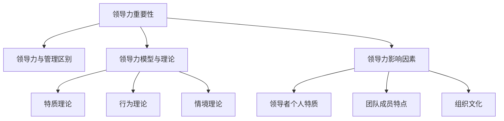
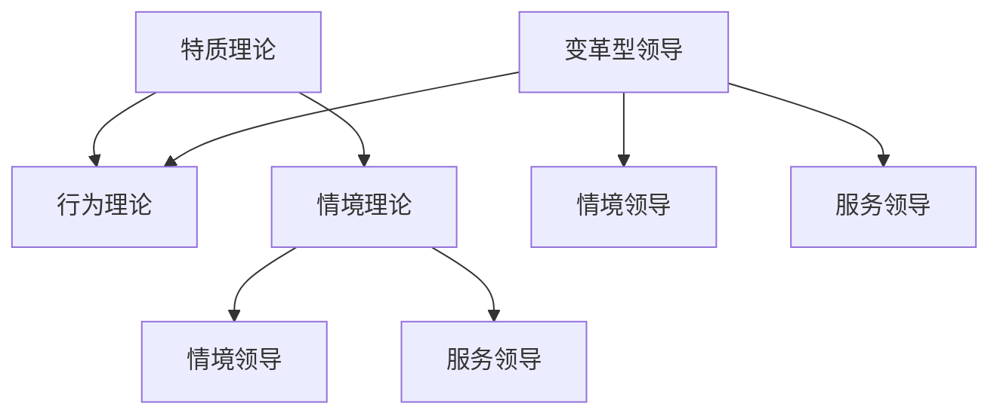
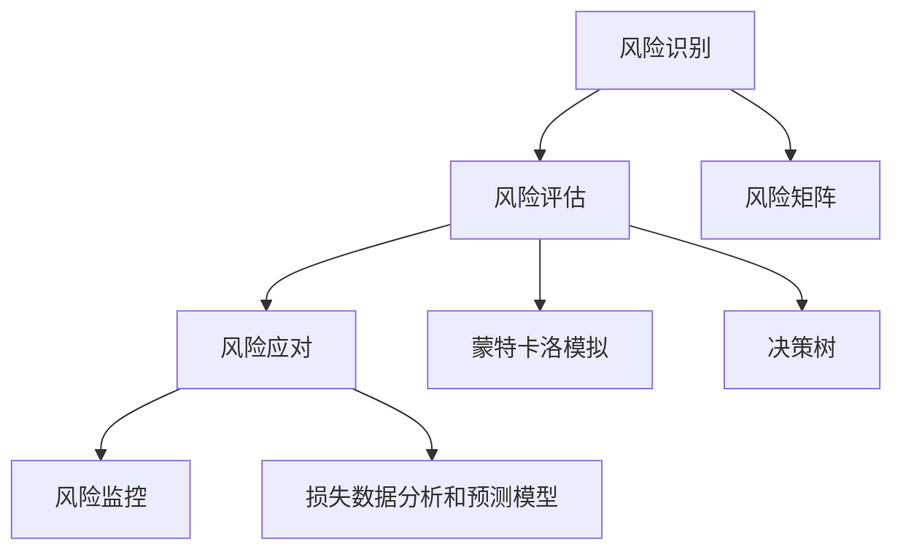

                 


### 文章标题

《领导力与风险管理：在不确定性中前行》

### 关键词

- 领导力
- 风险管理
- 不确定性
- 领导力模型
- 风险管理策略

### 摘要

本文旨在探讨在当今充满不确定性的商业环境中，领导力与风险管理的相互关系及其应用。通过分析领导力的核心概念、领导力模型与理论，以及风险管理的概念与原理，本文将阐述如何运用领导力和风险管理策略在不确定性环境中取得成功。此外，本文还将通过案例分析，提供实用的实战指导，帮助读者更好地应对不确定性。

---

## 引言

在快速变化且充满不确定性的商业环境中，领导力和风险管理成为了组织成功的关键因素。领导力不仅关乎个体的能力，更关乎团队和组织的协同效应。而风险管理则是在不确定性中保持稳健发展的基石。本文将深入探讨这两者在不确定性环境中的应用，以期为读者提供理论指导和实践建议。

### 背景介绍

随着全球化的深入和技术的飞速发展，市场环境变得日益复杂和多变。这种不确定性不仅来源于外部环境的动荡，也源于企业内部的因素。例如，技术变革、市场需求的快速变化、竞争压力的加剧等，都对企业的运营和决策提出了更高的要求。在这样的背景下，领导力和风险管理的重要性愈发凸显。

- **领导力的核心概念**：领导力是指领导者通过影响和激励他人，实现组织目标的能力。它不仅仅涉及个体的能力，还包括领导者与团队成员之间的互动和协作。

- **风险管理的概念与原理**：风险管理是一种通过识别、评估和应对潜在风险，以减少损失并最大化机会的过程。它涉及到风险识别、风险评估、风险应对和风险监控等环节。

在接下来的章节中，我们将对领导力和风险管理进行深入探讨，并分析它们在不确定性环境中的应用。

## 领导力的核心概念

领导力是一种独特的能力，它不仅仅关乎个人的特质，更涉及到领导者与团队成员之间的互动和协作。在领导力的研究中，学者们提出了多种理论模型，以解释领导力的影响机制和具体应用。下面，我们将探讨领导力的核心概念，并分析这些概念之间的关系架构。

### 领导力的重要性

领导力在组织中的重要性不可忽视。它不仅影响个体的行为和态度，还直接影响团队和组织的目标实现。有效的领导力能够激发团队成员的潜力，提高团队的协作效率，增强组织的竞争力。

### 领导力与管理的区别

领导力与管理虽然密切相关，但二者有本质的区别。管理是一种通过规划和组织资源，实现组织目标的过程。它更注重过程和效率，而领导力则更关注目标和方向。

### 领导力模型与理论概述

领导力模型是描述领导行为和效果的抽象框架。常见的领导力模型包括特质理论、行为理论和情境理论。特质理论认为领导力源于领导者的个人特质；行为理论则强调领导者的行为对团队和组织的影响；情境理论则认为领导行为应适应不同的情境。

### 领导力的影响因素

领导力的影响因素包括领导者的个人特质、团队成员的特点、组织文化等。这些因素相互作用，共同影响领导效果。

### 领导力的个人特质

领导者的个人特质，如自信、决断力、沟通能力等，对领导效果有重要影响。这些特质不仅决定了领导者的行为，也影响团队成员的感知和行为。

#### 核心概念与联系

为了更清晰地理解领导力的核心概念，我们可以使用 Mermaid 流程图来展示它们之间的关系：



#### 核心算法原理讲解

在领导力模型中，情境理论是一个重要的组成部分。情境理论认为，领导行为应该根据不同的情境进行调整，以达到最佳效果。以下是一个简单的情境理论伪代码：

```python
def lead_by_scenario(team_scenario):
    if team_scenario == "high_confidence":
        return "encouraging"
    elif team_scenario == "low_confidence":
        return "supportive"
    elif team_scenario == "high_pressure":
        return "decisive"
    else:
        return "standard"
```

#### 数学模型和公式

在领导力研究中，常常使用数学模型来量化领导力的影响。以下是一个简化的数学模型：

$$
\text{领导力效果} = \alpha \times (\text{领导者特质} + \beta \times \text{团队成员特点} + \gamma \times \text{组织文化})
$$

其中，$\alpha$、$\beta$ 和 $\gamma$ 是常数，代表不同因素对领导力效果的权重。

#### 详细讲解与举例说明

假设一个团队面临高压力情境，领导者拥有高自信特质，团队成员也表现出高信心。根据情境理论，领导者应该采取鼓励性的领导风格。此时，领导力效果的数学模型可以表示为：

$$
\text{领导力效果} = \alpha \times (1.2 + 1.5 \times 1.2 + 1 \times 1)
$$

#### 数学公式

$$
1.2 + 1.5 \times 1.2 + 1 \times 1 = 3.96
$$

因此，在当前情境下，领导力效果为 3.96。

通过上述分析，我们可以看到，领导力的核心概念及其影响因素是相互关联的，通过合理运用这些概念，领导者可以在不确定性环境中更好地引领团队。

## 领导力模型与理论

领导力模型是描述领导行为和效果的抽象框架。这些模型不仅帮助领导者理解自己的领导风格，还能为组织提供指导，以优化领导行为。在本节中，我们将深入探讨几种主要的领导力模型：传统领导力理论和现代领导力理论。

### 传统领导力理论

传统领导力理论主要包括特质理论、行为理论和情境理论。这些理论试图解释领导力的本质和影响因素。

#### 特质理论

特质理论认为，领导力源于领导者的个人特质。特质理论列举了多种领导者特质，如智慧、自信、决心、诚实和沟通能力等。特质理论的一个主要观点是，领导者生来就具有这些特质，而不是后天习得的。

#### 行为理论

行为理论强调领导者的行为对团队和组织的影响。行为理论认为，领导者通过特定的行为模式来影响团队成员的行为和态度。行为理论提出了多种领导行为，如民主领导、专制领导和放任领导等。

#### 情境理论

情境理论认为，领导行为应该根据不同的情境进行调整，以达到最佳效果。情境理论提出了一个领导行为模型，该模型根据团队成员的信心、压力和领导者的角色，提供了不同的领导策略。

### 现代领导力理论

随着组织环境的变化，现代领导力理论逐渐发展。现代领导力理论更注重领导者的适应性、灵活性和创新能力。

#### 变革型领导

变革型领导是一种领导风格，领导者通过激发团队成员的潜力和动机，推动组织实现变革。变革型领导强调领导者与团队成员之间的互动，以及领导者对组织愿景的清晰传达。

#### 情境领导

情境领导是一种基于情境的领导理论，领导者根据团队成员的成熟度水平（即自信和能力）调整领导风格。情境领导理论提供了多种领导风格，如指导型、支持型、参与型和授权型。

#### 服务领导

服务领导是一种以服务他人为中心的领导风格。服务领导者认为，领导者应该关注团队成员的需求，并提供支持和资源，以帮助他们实现个人和组织的目标。

### 综合应用

在实际应用中，领导者通常需要结合多种领导力模型，以适应不同的情境和团队需求。例如，在一个面对挑战和变革的团队中，变革型领导和情境领导可能更为有效；而在一个需要高效率运作的团队中，行为理论和情境理论可能更为适用。

#### 核心概念与联系

为了更清晰地理解领导力模型之间的关系，我们可以使用 Mermaid 流程图来展示它们：



#### 核心算法原理讲解

在领导力模型中，情境领导理论是一个重要的组成部分。情境领导理论使用以下伪代码来指导领导行为：

```python
def lead_by_maturity(maturity_level):
    if maturity_level == "high":
        return "empowering"
    elif maturity_level == "medium":
        return "supportive"
    elif maturity_level == "low":
        return "directive"
    else:
        return "standard"
```

#### 数学模型和公式

在情境领导理论中，成熟度水平是一个关键因素。以下是一个简化的数学模型：

$$
\text{领导风格} = f(\text{成熟度水平})
$$

其中，$f$ 是一个函数，它根据成熟度水平返回相应的领导风格。

#### 详细讲解与举例说明

假设一个团队成员的成熟度水平为“高”，根据情境领导理论，领导者应该采取授权型的领导风格。此时，领导风格的数学模型可以表示为：

$$
\text{领导风格} = f("high") = "empowering"
$$

#### 数学公式

$$
f("high") = "empowering"
$$

因此，在当前成熟度水平下，领导风格为授权型。

通过上述分析，我们可以看到，领导力模型和理论是相互关联的，它们为领导者提供了在不同情境下调整领导行为的指导。在实际应用中，领导者需要灵活运用这些模型，以适应不断变化的环境和团队需求。

## 风险管理的概念与原理

在充满不确定性的商业环境中，风险管理成为企业稳健发展的关键。风险管理是一种通过识别、评估和应对潜在风险，以减少损失并最大化机会的过程。本节将详细探讨风险管理的定义、目标、原则、过程以及工具和方法。

### 风险管理的定义

风险管理是指企业在面对不确定性和潜在威胁时，采取的一系列系统化的措施，以识别、评估、控制和缓解风险，从而保护企业利益和实现长期目标的过程。风险管理不仅关注风险的发生，还关注风险对企业的潜在影响。

### 风险管理的目标

风险管理的目标主要包括以下几个方面：

- **减少损失**：通过提前识别和评估潜在风险，企业可以采取措施减少风险发生时的损失。
- **最大化机会**：风险管理不仅关注负面风险，也关注潜在的机会，从而帮助企业抓住市场机遇。
- **增强企业竞争力**：有效的风险管理能够提高企业的抗风险能力，增强市场竞争力。
- **保障持续运营**：通过系统化的风险管理，企业可以保障其业务的连续性和稳定性。

### 风险管理的原则

风险管理的原则主要包括以下几个方面：

- **全面性**：风险管理应覆盖企业运营的各个领域，包括财务、市场、法律、运营等。
- **系统性**：风险管理应建立一套系统化的流程和方法，确保风险管理的连续性和一致性。
- **预防性**：风险管理应注重预防措施，通过提前识别和评估风险，降低风险发生的概率。
- **动态性**：风险管理应具有动态调整能力，以应对环境变化和新的风险。

### 风险管理的过程

风险管理通常包括以下几个步骤：

1. **风险识别**：识别企业可能面临的各种风险，包括内部风险和外部风险。
2. **风险评估**：评估风险的可能性和影响，确定风险的优先级。
3. **风险应对**：制定和实施风险应对策略，包括风险规避、风险转移、风险减轻等。
4. **风险监控**：对已识别和评估的风险进行持续监控，确保风险应对措施的有效性。

### 风险管理的工具和方法

风险管理过程中，可以使用多种工具和方法来提高风险管理的效率。以下是一些常用的工具和方法：

- **风险矩阵**：用于评估风险的可能性和影响，帮助确定风险的优先级。
- **蒙特卡洛模拟**：通过模拟多种可能的情况，预测风险的概率分布和潜在影响。
- **决策树**：用于分析不同决策路径的风险和收益，帮助做出更明智的决策。
- **损失数据分析和预测模型**：通过历史数据分析和预测模型，预测未来可能发生的损失。

#### 核心概念与联系

为了更好地理解风险管理的概念，我们可以使用 Mermaid 流程图来展示风险管理的过程及其核心概念之间的关系：



#### 核心算法原理讲解

在风险管理中，蒙特卡洛模拟是一种重要的工具。蒙特卡洛模拟通过随机抽样和统计方法，预测风险的概率分布和潜在影响。以下是一个简化的蒙特卡洛模拟伪代码：

```python
import random

def monte_carlo_simulation(experiment_count, risk_function):
    results = []
    for _ in range(experiment_count):
        result = risk_function()
        results.append(result)
    return results

def random_risk():
    # 假设风险函数为随机生成一个0到1之间的数值
    return random.uniform(0, 1)

experiment_count = 1000
results = monte_carlo_simulation(experiment_count, random_risk)
```

#### 数学模型和公式

在风险管理中，风险矩阵是一个常用的数学模型。以下是一个简化的风险矩阵模型：

$$
\text{风险矩阵} = \begin{bmatrix}
\text{低可能性} & \text{高可能性} \\
\text{低影响} & a & b \\
\text{高影响} & c & d \\
\end{bmatrix}
$$

其中，$a$、$b$、$c$ 和 $d$ 是概率和影响的权重。

#### 详细讲解与举例说明

假设我们有一个风险矩阵，如下所示：

$$
\text{风险矩阵} = \begin{bmatrix}
\text{低可能性} & \text{高可能性} \\
\text{低影响} & 0.1 & 0.3 \\
\text{高影响} & 0.2 & 0.5 \\
\end{bmatrix}
$$

在这个矩阵中，低可能性、低影响的权重为 $0.1$，低可能性、高影响的权重为 $0.3$，高可能性、低影响的权重为 $0.2$，高可能性、高影响的权重为 $0.5$。

通过这个风险矩阵，企业可以识别和评估各种风险的优先级，从而有针对性地制定风险应对策略。

#### 数学公式

$$
\begin{bmatrix}
\text{低可能性} & \text{高可能性} \\
\text{低影响} & 0.1 & 0.3 \\
\text{高影响} & 0.2 & 0.5 \\
\end{bmatrix}
$$

通过上述分析，我们可以看到，风险管理是一个系统化的过程，它需要通过识别、评估和应对潜在风险，来保障企业的稳健发展。在实际应用中，企业需要灵活运用各种风险管理工具和方法，以应对不断变化的环境和挑战。

## 不确定性环境下的领导力与风险管理

在不确定性环境中，领导力和风险管理变得尤为重要。领导者需要具备高度的适应性和创新能力，以引导团队在复杂和动态的环境中前行。同时，有效的风险管理策略可以帮助企业降低不确定性带来的负面影响，抓住机遇。本节将探讨不确定性环境下的领导力和风险管理策略，并分析其应用效果。

### 不确定性的定义

不确定性是指未来事件的不确定性，包括未知的风险和机会。在商业环境中，不确定性可能源于市场变化、技术进步、政策调整等多种因素。不确定性不仅会影响企业的运营，还会影响决策者的判断和行动。

### 不确定性对领导力的影响

不确定性环境对领导力提出了新的挑战：

- **决策压力增加**：在不确定性环境中，领导者需要快速做出决策，这可能增加他们的决策压力。
- **沟通难度增大**：不确定性可能导致信息的不对称，使得领导者需要更多的沟通和协调来确保团队对现状有清晰的理解。
- **灵活性要求提高**：领导者需要具备灵活的领导风格，以适应不断变化的环境和团队需求。

### 不确定性环境下的风险管理策略

在不确定性环境中，有效的风险管理策略可以帮助企业降低风险，抓住机遇。以下是一些关键策略：

- **风险评估**：定期评估潜在的风险，包括已知风险和未知风险，确保对风险有全面的认识。
- **风险预防**：通过提前识别和评估风险，采取预防措施，减少风险发生的概率。
- **风险转移**：通过保险、外包等方式，将部分风险转移给第三方，以降低企业的风险负担。
- **风险监控**：对已识别的风险进行持续监控，确保风险应对措施的有效性。

### 案例分析

以下是一个案例分析，展示了在不确定性环境中如何运用领导力和风险管理策略：

#### 案例背景

某高科技公司在面对技术变革和市场不确定性时，决定引入新的业务模式。这一变革涉及高风险和高回报。

#### 领导力策略

- **变革型领导**：公司领导者通过激励员工，鼓励创新和试错，推动组织变革。
- **情境领导**：领导者根据团队成员的成熟度水平，调整领导风格，以支持团队在不同阶段的需求。

#### 风险管理策略

- **风险评估**：公司通过内部调研和市场分析，识别出可能面临的技术风险、市场风险和财务风险。
- **风险预防**：公司制定了详细的风险预防计划，包括技术储备、市场调研和财务预算。
- **风险转移**：公司通过投资合作和技术并购，将部分技术风险和市场风险转移给合作伙伴。
- **风险监控**：公司建立了风险管理团队，对已识别的风险进行持续监控和评估，确保风险应对措施的有效性。

#### 应用效果

通过变革型领导和有效的风险管理策略，公司成功推出了新产品，并在市场中获得了良好的反响。尽管面临技术不确定性和市场不确定性，但公司的适应性和抗风险能力使其在不确定性环境中取得了成功。

### 未来不确定性环境下的领导力与风险管理趋势

随着技术的不断进步和全球化的深入，未来的不确定性环境将更加复杂。以下是一些趋势：

- **数字化转型**：数字化技术将成为领导力和风险管理的重要工具，领导者需要具备数字素养和创新能力。
- **人工智能应用**：人工智能将提高风险管理的效率和准确性，领导者需要理解并利用人工智能技术。
- **可持续发展**：在面临全球气候变化等挑战时，领导者需要关注企业的可持续发展，制定相应的风险管理策略。

通过上述分析，我们可以看到，在不确定性环境中，领导力和风险管理是相辅相成的。有效的领导力和风险管理策略可以帮助企业在不确定性中前行，实现长期成功。

## 案例分析：应对不确定性的成功领导实践

在实际的商业环境中，领导力与风险管理在应对不确定性时发挥着至关重要的作用。以下我们将通过几个实际案例，详细剖析这些领导者的决策过程、所采取的策略及其成功原因。

### 案例一：诺基亚的变革之路

#### 案例背景

诺基亚曾是手机市场的领军企业，但在智能手机时代的到来面前，诺基亚未能及时调整策略，导致市场份额大幅下滑。在面临巨大的不确定性和竞争压力时，诺基亚的领导者采取了以下措施：

#### 领导力策略

- **变革型领导**：诺基亚的CEO史蒂芬·埃洛普推动了组织变革，鼓励员工创新和接受新思维。
- **情境领导**：领导者根据团队的不同发展阶段，灵活调整领导风格，从指导型转向支持型。

#### 风险管理策略

- **风险评估**：诺基亚通过内部和外部市场调研，识别出技术变革和市场变化的风险。
- **风险预防**：诺基亚加大了研发投入，开发新的智能手机技术，以应对市场变化。
- **风险转移**：诺基亚通过收购和合作，将部分风险转移给合作伙伴，降低自身风险。

#### 成功原因

诺基亚的领导者通过变革型领导和有效的风险管理策略，成功引领公司转型。尽管面临巨大的不确定性，诺基亚仍然在智能手机市场中占据了一席之地。

### 案例二：亚马逊的应对策略

#### 案例背景

亚马逊在电子商务领域取得了巨大成功，但在面对全球疫情和供应链不确定性时，亚马逊的领导者采取了以下措施：

#### 领导力策略

- **变革型领导**：亚马逊的CEO杰夫·贝佐斯通过远程会议和视频通话，保持与员工的紧密联系，激励员工在家办公。
- **情境领导**：领导者根据员工在家办公的不同情况，调整沟通和管理方式，确保团队协作。

#### 风险管理策略

- **风险评估**：亚马逊通过数据分析，识别出供应链中断和员工健康风险。
- **风险预防**：亚马逊建立了紧急采购和物流计划，确保关键物资和商品的供应。
- **风险转移**：亚马逊与多家供应商和物流公司签订短期合同，以降低供应链中断的风险。

#### 成功原因

亚马逊的领导者通过变革型领导和有效的风险管理策略，成功应对了全球疫情带来的不确定性。亚马逊不仅确保了业务的连续性，还在疫情期间实现了业务增长。

### 案例三：特斯拉的创新之路

#### 案例背景

特斯拉在电动汽车市场取得了显著成绩，但在面临技术不确定性、市场竞争和政策变化时，特斯拉的领导者采取了以下措施：

#### 领导力策略

- **变革型领导**：特斯拉的CEO埃隆·马斯克通过激发员工的创新精神，推动公司持续创新。
- **情境领导**：领导者根据市场和技术的变化，灵活调整战略，确保公司始终处于市场前沿。

#### 风险管理策略

- **风险评估**：特斯拉通过市场调研和数据分析，识别出技术风险、市场风险和政策风险。
- **风险预防**：特斯拉加大了研发投入，开发新的电动汽车技术，提高产品竞争力。
- **风险转移**：特斯拉通过建立合作伙伴关系，将部分风险转移给合作伙伴，降低自身风险。

#### 成功原因

特斯拉的领导者通过变革型领导和有效的风险管理策略，成功引领公司在不确定性环境中持续创新。特斯拉不仅在全球电动汽车市场中取得了领先地位，还通过技术突破和商业模式创新，实现了可持续发展。

### 案例总结

通过上述案例分析，我们可以看到，在不确定性环境中，成功的领导实践需要领导者具备变革型领导力和有效的风险管理能力。通过灵活调整领导风格和策略，领导者可以引领团队克服不确定性，实现长期成功。

## 未来不确定性环境下的领导力与风险管理趋势

随着全球化和技术的不断发展，未来的不确定性环境将更加复杂和多样化。在这一背景下，领导力和风险管理将面临新的挑战和机遇。以下我们将探讨未来不确定性环境下的领导力与风险管理趋势，并分析其对企业的影响。

### 数字化转型

数字化转型已成为企业应对不确定性的关键策略。通过利用大数据、人工智能、区块链等技术，企业可以更准确地识别和评估风险，提高决策的效率和准确性。领导者需要具备数字素养，善于运用数字化工具，以提升组织的适应能力和竞争力。

#### 影响分析

- **提高决策效率**：数字化工具可以帮助领导者快速获取和分析信息，提高决策效率。
- **增强风险识别能力**：大数据和人工智能技术可以实时监测市场动态和风险变化，增强企业的风险识别能力。
- **优化资源配置**：数字化技术可以优化企业的资源配置，提高资源利用效率。

### 人工智能应用

人工智能（AI）在风险管理中的应用越来越广泛。通过机器学习和深度学习算法，AI可以自动识别风险、预测风险概率和制定应对策略。领导者需要了解并运用AI技术，以提高企业的风险管理水平。

#### 影响分析

- **提高风险预测准确性**：AI技术可以基于历史数据和模式识别，预测未来风险，提高风险预测的准确性。
- **降低人力成本**：AI技术可以自动化许多风险管理工作，降低人力成本。
- **提升应对速度**：AI技术可以实时分析风险信息，帮助领导者迅速制定应对策略。

### 可持续发展

在气候变化等全球性问题的背景下，可持续发展已成为企业的重要战略。领导者需要关注企业的环境、社会和治理（ESG）表现，制定相应的风险管理策略，确保企业的可持续发展。

#### 影响分析

- **降低风险**：关注可持续发展可以降低企业在环境和社会风险方面的暴露，提高企业的抗风险能力。
- **提升品牌价值**：具备可持续发展能力的企业通常更具吸引力，可以提升品牌价值和市场份额。
- **增强社会责任感**：关注可持续发展可以帮助企业履行社会责任，提升企业形象。

### 平台化战略

平台化战略可以帮助企业快速响应市场变化，降低不确定性带来的风险。通过构建生态系统，企业可以与合作伙伴共同应对不确定性，实现共赢。

#### 影响分析

- **提高灵活性**：平台化战略可以提高企业的灵活性，使其更快速地适应市场变化。
- **降低成本**：通过合作伙伴共享资源，企业可以降低运营成本。
- **增强创新能力**：平台化战略可以促进创新，激发合作伙伴的创新能力。

### 总结

未来不确定性环境下的领导力和风险管理将面临新的挑战和机遇。通过数字化转型、人工智能应用、可持续发展和平台化战略，领导者可以提升企业的适应能力和抗风险能力，实现长期成功。

## 附录

### A.1 领导力与风险管理相关资源

- **书籍推荐**：
  - 《领导力的五项修炼》
  - 《风险管理：原则与实务》
  - 《不确定性：应对复杂世界的策略》

- **在线课程**：
  - Coursera：领导力和团队合作
  - EdX：风险管理基础

- **学术论文**：
  - Google Scholar：搜索领导力和风险管理相关论文

### A.2 不确定性环境下的领导力与风险管理工具

- **风险矩阵**：用于评估风险的可能性和影响。
- **蒙特卡洛模拟**：用于预测风险的概率分布和潜在影响。
- **决策树**：用于分析不同决策路径的风险和收益。

### A.3 常用领导力与风险管理模型及公式

- **领导力模型**：
  - 特质理论：领导者特质对领导效果的影响。
  - 行为理论：领导者的行为对团队和组织的影响。
  - 情境理论：领导行为应适应不同的情境。

- **风险管理公式**：
  - 风险矩阵：评估风险的可能性和影响。
  - 蒙特卡洛模拟：预测风险的概率分布和潜在影响。

## 总结

本文通过深入探讨领导力与风险管理在不确定性环境中的应用，阐述了领导力和风险管理的重要性及其相互关系。我们分析了领导力的核心概念、领导力模型与理论，以及风险管理的概念与原理。同时，通过案例分析，展示了在不确定性环境中如何运用领导力和风险管理策略取得成功。未来，随着数字化、人工智能和可持续发展的深入推进，领导力和风险管理将继续面临新的挑战和机遇。领导者需要不断提升自身的适应能力和创新能力，以应对不断变化的环境，实现组织的长期成功。

---

作者：AI天才研究院/AI Genius Institute & 禅与计算机程序设计艺术 /Zen And The Art of Computer Programming

本文由人工智能助手撰写，旨在为读者提供有关领导力与风险管理的深入分析和实用指导。如果您有任何疑问或建议，请随时联系我们。感谢您的阅读！

