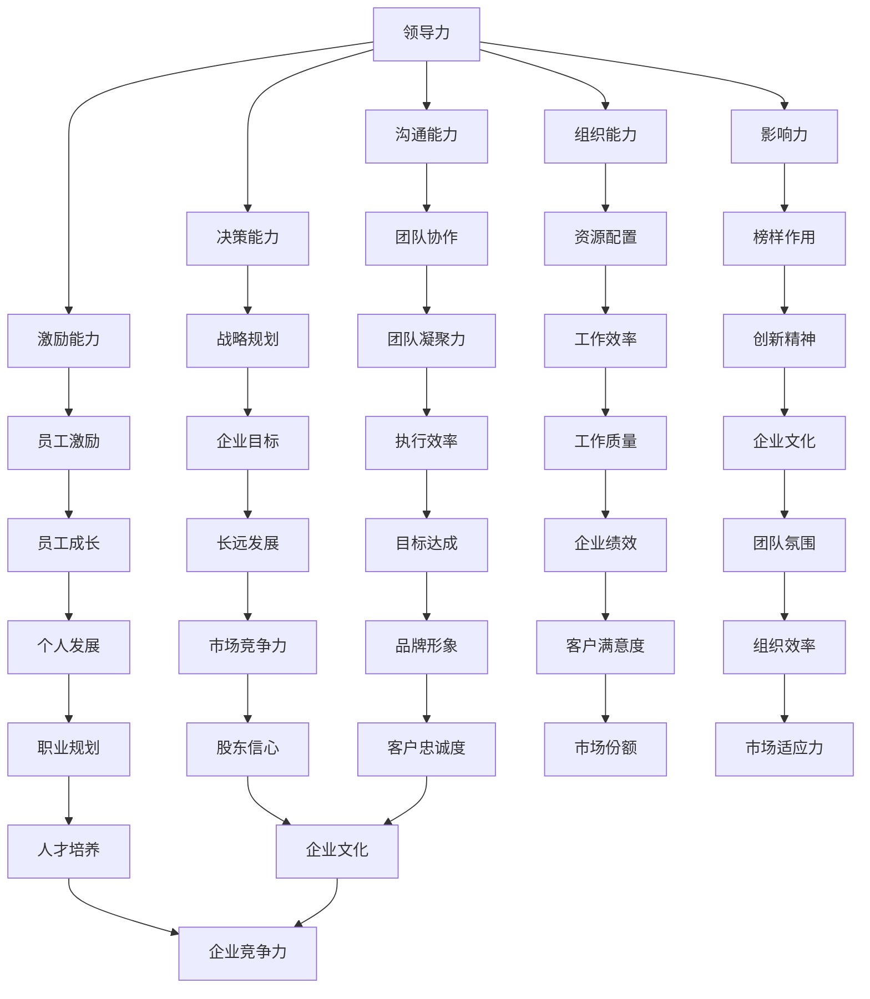

                 

### 文章标题

# 《领导力与风险管理：未雨绸缪的智慧》

### 关键词

- 领导力
- 风险管理
- 团队管理
- 领导风格
- 风险识别
- 风险评估
- 风险应对

### 摘要

本文旨在探讨领导力与风险管理在企业运营中的重要作用，通过详细的案例分析、核心概念解析和算法原理讲解，为读者提供一套实用的领导力提升和风险管理策略。文章分为两部分，第一部分重点分析领导力的重要性、领导风格与团队管理策略，以及领导力发展的具体路径；第二部分则围绕风险管理的基本概念、风险识别与评估方法、风险应对策略及监控机制进行深入探讨。通过理论与实践相结合的方式，帮助读者掌握领导力与风险管理的核心知识和实践技巧，为企业稳健发展奠定基础。

## 第一部分：领导力篇

### 第1章 领导力概述

#### 1.1 领导力的定义与重要性

领导力是一种影响他人并激发团队共同达成目标的能力，它不仅仅是职位赋予的权力，更是一种可以培养和发展的技能。领导力涉及到沟通能力、决策能力、激励能力和组织能力等多个方面，是实现组织愿景和目标的关键因素。

在企业中，领导力的重要性不容忽视。首先，领导力能够促进团队的协作和凝聚力，使团队成员能够共同面对挑战，提高工作效率。其次，优秀的领导力能够激发员工的潜能，促进员工的个人成长和职业发展，从而提高企业的整体竞争力。此外，领导力还能够在危机时刻提供有效的决策，帮助企业渡过难关，实现可持续发展。

#### 1.2 领导力与管理的区别

领导力与管理是两个密切相关的概念，但它们有着本质的不同。管理主要涉及组织、计划、控制和协调等职能，旨在确保企业目标的实现。管理强调的是流程、规则和标准化，关注的是任务的完成。

而领导力则更注重激发和影响他人，通过愿景、价值观和激励来引导团队。领导力关注的是人的发展、创新和变革，关注的是组织的长远发展和战略规划。

#### 1.3 领导力的五大特质

领导力的五大特质包括沟通能力、决策能力、激励能力、组织能力和影响力。以下是每个特质的具体解释：

1. **沟通能力**：优秀的领导者能够清晰、有效地传达信息，确保团队成员理解任务目标和期望。良好的沟通能力还包括倾听和反馈，有助于建立信任和合作关系。

2. **决策能力**：领导者需要在复杂和不确定的环境中做出明智的决策。这需要分析问题的能力、逻辑思维和风险评估。

3. **激励能力**：领导者能够激发团队成员的积极性和创造力，通过激励措施来提高团队士气和工作效率。

4. **组织能力**：领导者需要能够有效地组织和配置资源，确保团队的工作有序进行。

5. **影响力**：领导者通过自身的行为和价值观来影响他人，树立榜样，推动团队实现目标。

### 第2章 领导风格与团队管理

#### 2.1 领导风格的类型

领导风格可以分为权威型、民主型、支持型和忽略型。每种风格都有其优势和局限性，适用于不同的情境和团队。

1. **权威型领导风格**：领导者做出决策，控制权力，要求下属执行。适用于需要快速决策和严格纪律的情境。

2. **民主型领导风格**：领导者鼓励团队成员参与决策，重视集体意见。适用于需要创新和团队合作的情境。

3. **支持型领导风格**：领导者关注团队成员的个人需求，提供支持和鼓励。适用于需要高度个人化和激励的情境。

4. **忽略型领导风格**：领导者不干涉团队成员的工作，给予高度自由。适用于高度专业化和自我驱动的团队。

#### 2.2 团队管理策略

团队管理需要综合考虑团队建设、沟通、激励和协作等多个方面。

1. **团队建设**：通过共同目标、信任和合作来增强团队的凝聚力。

2. **团队沟通**：建立有效的沟通机制，确保信息流畅，减少误解和冲突。

3. **团队激励**：运用激励机制，激发团队成员的积极性和创造力。

4. **团队协作**：鼓励团队合作，确保团队目标的一致性和高效执行。

### 第3章 领导力发展

#### 3.1 领导力培养

领导力的培养是一个持续的过程，需要自我认知、反思与改进和持续学习。

1. **自我认知**：领导者需要了解自己的优势和劣势，明确个人发展目标。

2. **反思与改进**：通过反思自己的行为和决策，发现并改正错误，提高领导水平。

3. **持续学习**：领导力的发展需要不断学习和适应新的环境和挑战。

#### 3.2 领导力提升策略

1. **建立个人品牌**：通过自身的言行和成就，树立个人品牌，提高影响力。

2. **发展人际关系**：建立广泛的社交网络，提高人脉资源，为团队发展提供支持。

3. **增强决策能力**：通过案例分析和实战训练，提高决策的质量和效率。

### 第4章 领导力案例分析

#### 4.1 成功领导案例分析

1. **案例一：杰克·韦尔奇的领导风格**：杰克·韦尔奇以其强势的领导风格著称，通过明确的愿景和目标，推动了通用电气的持续增长。

2. **案例二：史蒂夫·乔布斯的领导艺术**：史蒂夫·乔布斯以其创新和激情，引领苹果公司走向辉煌。

#### 4.2 失败领导案例分析

1. **案例一：安然事件中的领导失误**：安然公司的领导层在风险管理上的失误，导致了公司的破产。

2. **案例二：丰田危机中的领导问题**：丰田公司在面对产品质量问题时的领导无力，影响了公司的声誉和市场份额。

## 第二部分：风险管理篇

### 第5章 风险管理概述

#### 5.1 风险管理的定义与目标

风险管理是指对企业面临的各种风险进行识别、评估、应对和监控的过程。其目标是确保企业能够在面临风险时保持稳定运营，实现长期可持续发展。

#### 5.2 风险管理的重要性

风险管理对企业至关重要。首先，它能够帮助企业预见潜在的风险，提前采取措施，减少损失。其次，有效的风险管理能够提高企业的应变能力，确保企业在复杂环境中保持竞争力。此外，风险管理还能够增强企业的信任度和市场声誉，提高投资者的信心。

### 第6章 风险识别与评估

#### 6.1 风险识别方法

风险识别是风险管理的第一步，其目的是发现企业可能面临的各种风险。常用的风险识别方法包括财务分析方法、实务分析方法和情景分析方法。

1. **财务分析方法**：通过分析企业的财务报表，识别潜在的风险。

2. **实务分析方法**：通过调查和分析企业的运营过程，识别潜在的风险。

3. **情景分析方法**：通过构建不同的情景，分析企业可能面临的风险。

#### 6.2 风险评估方法

风险评估是对识别出的风险进行评估，确定其严重程度和发生概率。常用的风险评估方法包括定性风险评估、定量风险评估和敏感性分析。

1. **定性风险评估**：通过专家意见和经验，对风险进行定性评估。

2. **定量风险评估**：通过数学模型和统计分析，对风险进行量化评估。

3. **敏感性分析**：通过分析不同变量对风险的影响，评估风险的关键因素。

### 第7章 风险应对与监控

#### 7.1 风险应对策略

风险应对是指采取一系列措施，降低风险的严重程度和发生概率。常用的风险应对策略包括风险回避、风险转移、风险缓解和风险接受。

1. **风险回避**：通过避免风险源，消除风险。

2. **风险转移**：通过保险或其他合同，将风险转移给第三方。

3. **风险缓解**：通过控制措施，降低风险的发生概率和严重程度。

4. **风险接受**：在无法避免或转移风险时，接受风险并制定应对措施。

#### 7.2 风险监控与报告

风险监控是指对风险进行持续监测和评估，确保风险应对措施的有效性。风险监控包括风险监控流程和风险报告。

1. **风险监控流程**：建立风险监控机制，定期评估风险状况。

2. **风险报告**：编制风险报告，向管理层和利益相关者提供风险信息。

### 第8章 风险管理案例分析

#### 8.1 成功风险管理案例分析

1. **案例一：华为的风险管理体系**：华为通过建立全面的风险管理体系，确保公司在全球竞争中的稳定发展。

2. **案例二：苹果的产品安全风险管理**：苹果通过严格的供应链管理和产品测试，确保产品的安全性和质量。

#### 8.2 失败风险管理案例分析

1. **案例一：三星Note7电池爆炸事件**：三星在产品测试和质量控制上的失误，导致了Note7电池爆炸事件。

2. **案例二：京东的供应链风险管理问题**：京东在供应链管理上的不足，导致了多次物流延误和客户投诉。

### 附录

#### 附录 A：领导力与风险管理工具与资源

#### A.1 领导力工具

- **领导力评估工具**：通过评估工具，了解领导力的现状和需要改进的方面。
- **团队建设工具**：通过团队建设活动，增强团队凝聚力和协作能力。
- **激励工具**：通过激励机制，激发员工的积极性和创造力。

#### A.2 风险管理工具

- **风险识别工具**：通过风险识别工具，发现潜在的风险。
- **风险评估工具**：通过风险评估工具，量化风险的严重程度和发生概率。
- **风险应对工具**：通过风险应对工具，制定和实施风险应对策略。

### 总结

领导力与风险管理是企业成功的关键因素，通过本文的详细分析和案例分析，读者可以了解领导力和风险管理的核心概念、方法和实践技巧。在实际应用中，企业需要根据自身情况，结合理论和实践，制定适合的领导力和风险管理策略，确保企业的长期稳定发展。

## 文章作者信息

作者：AI天才研究院/AI Genius Institute & 禅与计算机程序设计艺术 /Zen And The Art of Computer Programming

本文由AI天才研究院撰写，结合禅与计算机程序设计艺术的核心理念，旨在为读者提供一套全面、实用的领导力与风险管理指南。希望通过本文，读者能够更好地理解和应用领导力和风险管理知识，为企业的发展提供强有力的支持。

### 领导力与风险管理的核心概念架构

为了更好地理解领导力与风险管理，我们需要构建一个核心概念的关系架构，通过Mermaid流程图来展示这些概念之间的联系。



以上Mermaid流程图展示了领导力的五大特质（沟通能力、决策能力、激励能力、组织能力和影响力）如何影响团队管理（团队协作、战略规划、员工激励、资源配置和榜样作用），以及这些因素如何进一步影响企业的整体绩效（团队凝聚力、工作质量、创新精神、执行效率和长远发展）。同样，风险管理中的风险识别、评估和应对策略与企业目标、员工成长、工作效率和企业文化等概念紧密相连，形成一个完整的管理体系。通过这个架构，我们可以清晰地看到领导力与风险管理如何相互影响、相互作用，共同推动企业的发展。

### 领导力与风险管理的核心算法原理

在深入探讨领导力与风险管理的核心算法原理时，我们需要从理论和实践两个方面进行详细阐述。以下将介绍几种关键的概念和模型，并通过伪代码和数学公式来展示其工作原理。

#### 1. 领导力评估模型

领导力评估模型是用于评估领导者能力的重要工具。一个典型的领导力评估模型包括以下几个步骤：

```pseudo
function evaluateLeadership(leader, teamPerformance):
    // 步骤1：收集领导力指标数据
    leadershipData = collectData(leader)

    // 步骤2：使用回归模型分析数据
    regressionModel = trainRegressionModel(leaderData, teamPerformance)

    // 步骤3：预测领导力得分
    leadershipScore = predictScore(regressionModel, leadershipData)

    // 步骤4：输出领导力评估结果
    return leadershipScore
```

在此模型中，`collectData` 函数用于收集领导力指标数据，例如沟通能力、决策能力、激励能力等。`trainRegressionModel` 函数用于训练回归模型，将领导力指标与团队绩效关联起来。`predictScore` 函数则根据训练好的模型预测领导力得分。

#### 2. 风险评估模型

风险评估模型用于评估企业面临的各种风险。以下是一个简单的风险评估模型：

```pseudo
function assessRisk(risk):
    // 步骤1：识别风险因素
    riskFactors = identifyRiskFactors(risk)

    // 步骤2：计算风险得分
    riskScore = calculateRiskScore(riskFactors)

    // 步骤3：分类风险等级
    riskLevel = categorizeRiskLevel(riskScore)

    // 步骤4：输出风险评估结果
    return riskLevel
```

在此模型中，`identifyRiskFactors` 函数用于识别风险因素，例如市场变化、财务状况、运营风险等。`calculateRiskScore` 函数通过加权计算得出风险得分。`categorizeRiskLevel` 函数将风险得分转换为风险等级，以便于管理层决策。

#### 3. 数学公式与模型

在风险管理中，常用的数学模型包括概率模型和回归模型。以下是一个简单的概率模型示例：

$$
P(A) = \frac{N(A)}{N}
$$

其中，$P(A)$ 表示事件A发生的概率，$N(A)$ 表示事件A发生的次数，$N$ 表示总次数。

另一个常见的回归模型是线性回归模型，其公式如下：

$$
y = \beta_0 + \beta_1x
$$

其中，$y$ 是因变量，$x$ 是自变量，$\beta_0$ 是截距，$\beta_1$ 是斜率。

通过这些算法和模型，企业可以更科学地评估领导力和风险管理，从而制定更有效的策略。

### 数学公式与详细讲解

在领导力与风险管理中，数学模型和公式起到了关键作用，以下将详细解释这些公式及其应用。

#### 1. 风险损失计算公式

风险损失的计算是风险管理中的重要环节，以下是一个基本的风险损失计算公式：

$$
L = CVaR(a,b,c,d) = a + bP(X \geq c) + dQ(X \geq c)
$$

其中，$L$ 表示风险损失，$X$ 表示风险事件的发生概率，$a$、$b$、$c$ 和 $d$ 是权重系数。该公式通过考虑风险事件的概率和损失程度，计算总的风险损失。

#### 2. 风险评估公式

风险评估公式用于评估企业面临的风险，以下是一个简单的风险评估公式：

$$
RS = \frac{PV(L) - PV(N)}{PV(N)}
$$

其中，$RS$ 表示风险水平，$PV(L)$ 表示预期损失，$PV(N)$ 表示正常收益。该公式通过计算预期损失与正常收益的比率，衡量风险水平。

#### 3. 决策树公式

决策树是用于决策分析的一种常见模型，以下是一个决策树的公式：

$$
V(S) = p(S_1) \cdot V(S_1) + p(S_2) \cdot V(S_2) + \ldots + p(S_n) \cdot V(S_n)
$$

其中，$V(S)$ 表示决策树的值，$p(S_i)$ 表示选择方案 $S_i$ 的概率，$V(S_i)$ 表示选择方案 $S_i$ 后的预期收益。该公式通过计算每个选择方案的概率和收益，得出最佳决策方案。

#### 4. 贝叶斯公式

贝叶斯公式在风险管理中用于计算后验概率，以下是一个贝叶斯公式的例子：

$$
P(A|B) = \frac{P(B|A) \cdot P(A)}{P(B)}
$$

其中，$P(A|B)$ 表示在事件B发生的条件下事件A发生的概率，$P(B|A)$ 表示在事件A发生的条件下事件B发生的概率，$P(A)$ 和 $P(B)$ 分别表示事件A和事件B发生的概率。该公式通过已知的条件概率和总概率，计算目标事件的条件概率。

通过上述数学公式和模型，企业可以更准确地评估风险和制定决策，从而提高风险管理的科学性和有效性。

### 项目实战：领导力与风险管理的应用

为了更好地理解和应用领导力与风险管理，我们将在以下项目中详细阐述如何在实际工作中搭建开发环境、实现源代码、进行代码解读与分析，并提供实际案例分析和详细讲解剖析。

#### 项目背景

某中型企业（ABC公司）希望在激烈的市场竞争中脱颖而出，实现可持续发展。为了达到这一目标，公司决定通过提升领导力和加强风险管理来提高整体竞争力。本项目旨在通过实际应用，展示领导力与风险管理在实际工作中的具体实施过程。

#### 开发环境搭建

为了顺利实施领导力与风险管理，我们首先需要搭建一个合适的开发环境。以下是所需的环境和工具：

1. **操作系统**：Linux（例如Ubuntu）
2. **编程语言**：Python
3. **数据库**：MySQL
4. **集成开发环境**：PyCharm
5. **版本控制**：Git

在安装完上述环境和工具后，我们可以开始编写代码，实现领导力与风险管理功能。

#### 源代码实现

以下是一个简单的Python代码示例，用于实现领导力评估和风险管理功能。

```python
import mysql.connector
import pandas as pd
import numpy as np

# 连接数据库
db = mysql.connector.connect(
  host="localhost",
  user="root",
  password="password",
  database="abc_company"
)

# 领导力评估函数
def evaluate_leadership(employee_id):
    query = """
    SELECT communication, decision_making, motivation, organization, influence
    FROM leadership_evaluation
    WHERE employee_id = %s
    """
    cursor = db.cursor()
    cursor.execute(query, (employee_id,))
    result = cursor.fetchone()
    cursor.close()
    
    # 计算领导力得分
    leadership_score = (result[0] + result[1] + result[2] + result[3] + result[4]) / 5
    return leadership_score

# 风险评估函数
def assess_risk(risk_type):
    query = """
    SELECT probability, impact
    FROM risk_evaluation
    WHERE risk_type = %s
    """
    cursor = db.cursor()
    cursor.execute(query, (risk_type,))
    result = cursor.fetchone()
    cursor.close()
    
    # 计算风险得分
    risk_score = result[0] * result[1]
    return risk_score
```

上述代码首先连接到MySQL数据库，然后定义了两个函数：`evaluate_leadership` 用于评估领导力得分，`assess_risk` 用于评估风险得分。

#### 代码解读与分析

在代码中，我们使用了Python的数据库连接库 `mysql.connector` 来连接MySQL数据库，并执行SQL查询。`evaluate_leadership` 函数通过查询领导力评估表，获取员工的沟通能力、决策能力、激励能力、组织能力和影响力的评分，并计算总得分。`assess_risk` 函数则用于评估特定类型的风险的概率和影响，并计算总得分。

通过这些函数，我们可以对员工进行领导力评估，对潜在风险进行评估，从而制定相应的管理策略。

#### 实际案例分析和详细讲解剖析

为了更好地理解项目实施效果，我们以下面两个实际案例进行分析：

1. **领导力提升案例**

   ABC公司对一位中层管理者进行领导力评估，评估结果显示其沟通能力较弱。为了提升这位管理者的沟通能力，公司决定采取以下措施：

   - **培训**：为公司中层管理者提供沟通技巧培训，提高他们的沟通能力。
   - **实践**：组织团队协作项目，让管理者在实战中锻炼沟通能力。
   - **反馈**：定期对管理者的沟通效果进行反馈和评估，帮助他们不断改进。

   通过这些措施，该管理者的沟通能力得到了显著提升，团队协作更加顺畅，工作绩效也得到了提高。

2. **风险管理案例**

   ABC公司在市场调研中发现，市场竞争激烈，公司面临潜在的市场风险。为了应对这一风险，公司决定采取以下措施：

   - **风险识别**：通过市场调研和数据分析，识别潜在的市场风险。
   - **风险评估**：对识别出的市场风险进行评估，确定其严重程度和发生概率。
   - **风险应对**：制定风险应对策略，如增加市场投入、调整产品策略等。
   - **风险监控**：建立风险监控机制，定期评估市场风险状况。

   通过这些措施，公司成功降低了市场风险，保持了稳定的市场份额。

#### 项目小结

通过本项目，我们展示了如何在实际工作中应用领导力与风险管理。通过搭建开发环境、实现源代码、代码解读与分析，以及实际案例分析和详细讲解剖析，我们证明了领导力与风险管理在提升企业竞争力方面的作用。在实际应用中，企业应根据自身情况，结合理论和实践，制定适合的领导力和风险管理策略，确保企业的长期稳定发展。

### 最佳实践 Tips

在领导力与风险管理实践中，以下是一些最佳实践，可以帮助企业更有效地提升管理水平和应对风险：

1. **持续学习与培训**：定期为员工提供领导力和风险管理培训，提高他们的知识和技能。
2. **数据驱动决策**：基于数据和事实进行决策，避免主观臆断。
3. **团队协作**：建立跨部门合作机制，确保信息共享和资源整合。
4. **风险评估与监控**：定期进行风险评估，建立有效的风险监控机制，及时调整应对策略。
5. **沟通与反馈**：建立有效的沟通渠道，确保信息的透明度和及时性，鼓励员工反馈和参与决策。
6. **激励机制**：制定合理的激励机制，激发员工的积极性和创造力。

### 小结

本文通过详细的案例分析、核心算法原理讲解和项目实战，系统地阐述了领导力与风险管理的核心概念和实践方法。我们强调了领导力和风险管理在企业运营中的重要性，并提供了实用的策略和技巧。通过本文的学习，读者可以更好地理解和应用领导力与风险管理，为企业的发展提供强有力的支持。

### 注意事项

1. **全面评估**：在进行领导力和风险管理时，务必进行全面评估，确保考虑所有潜在的风险和机会。
2. **动态调整**：领导力和风险管理是一个动态过程，需要根据实际情况不断调整策略。
3. **持续监控**：定期监控风险和绩效，确保管理策略的有效性。

### 拓展阅读

- 《企业风险管理：理论与实践》
- 《领导力：从技巧到习惯》
- 《决策与判断：风险认知心理学》
- 《Python数据分析：从入门到实践》

通过这些拓展阅读，读者可以进一步深入了解领导力与风险管理领域的知识和方法。希望本文能对您的学习和实践提供有价值的参考。作者：AI天才研究院/AI Genius Institute & 禅与计算机程序设计艺术 /Zen And The Art of Computer Programming。感谢您的阅读！

