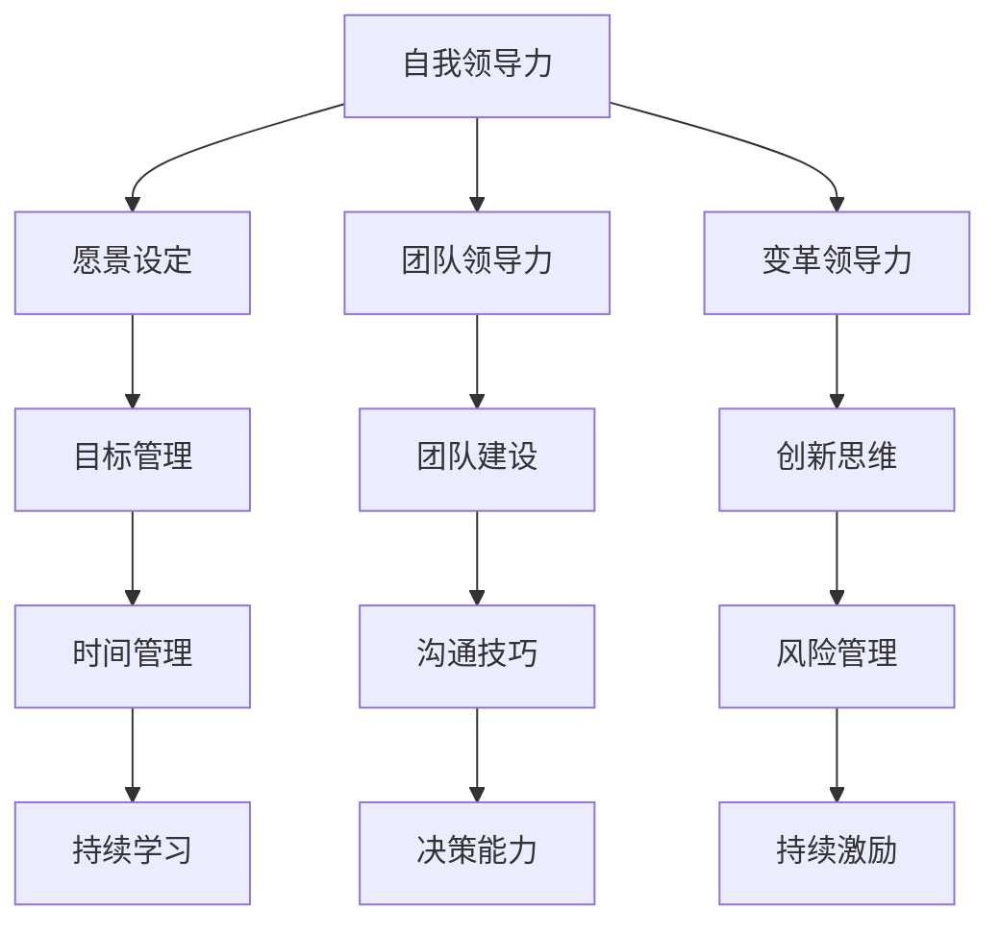

                 

## 文章标题

### 领导力修炼手册：从测试工程师到管理者的逆袭宝典

### 关键词：领导力、测试工程师、管理者、职业发展、角色转变、技能提升

### 摘要：
本文旨在探讨测试工程师如何从技术专才转型为管理人才，解析领导力的核心概念及其在职业发展中的重要性。文章通过深入分析领导力与管理的区别、从技术专家到管理者的角色转变、领导力修炼的方法和实践，为测试工程师提供一套系统的领导力提升方案。通过具体案例解析、变革与创新管理实践，以及测试团队中的应用，帮助读者理解领导力的多维度应用，最终实现从技术专家到管理者的成功逆袭。

## 目录大纲

1. **领导力的核心概念与测试工程师的过渡**
    1.1.1 领导力的定义与重要性
    1.1.2 测试工程师的职责与挑战
    1.1.3 领导力与测试工程师的职业发展

2. **从技术专家到管理者的角色转变**
    2.1.1 技术专家与管理者的区别
    2.1.2 管理者所需的核心技能
    2.1.3 技术背景对管理角色的优势与局限

3. **领导力修炼之道**
    3.1.1 自我领导力的培养
    3.1.2 团队领导力的提升
    3.1.3 情绪管理与领导力

4. **领导力实践案例解析**
    4.1.1 成功领导力案例
    4.1.2 领导力失败案例分析
    4.1.3 领导力实践中的难点与对策

5. **管理者的变革与创新**
    5.1.1 领导者与创新的关系
    5.1.2 创新管理的实践方法
    5.1.3 变革领导力

6. **领导力在测试团队中的应用**
    6.1.1 测试团队的管理
    6.1.2 测试项目管理
    6.1.3 测试团队领导力建设

7. **领导力修炼的持续之路**
    7.1.1 领导力的自我评估与提升
    7.1.2 职业发展规划
    7.1.3 领导力修炼的终极目标

## 附录
- 附录A：领导力相关书籍与资源推荐
- 附录B：Mermaid 流程图
- 附录C：核心算法原理讲解

接下来，我们将详细探讨每一个章节，通过逻辑清晰的分析，帮助测试工程师深入理解领导力的本质，掌握提升领导力的方法和实践。

## 第1章：领导力的核心概念与测试工程师的过渡

### 1.1.1 领导力的定义与重要性

领导力是一个广泛讨论但定义多样的概念。简而言之，领导力指的是个体或集体引导他人实现共同目标的能力。与领导相比，管理更侧重于组织资源的分配和任务执行，而领导力则更多地关注激发团队成员的潜能、塑造组织文化和推动创新。

领导力在个人职业发展中扮演着至关重要的角色。对于测试工程师来说，具备领导力不仅能够提升个人的职业价值，还能帮助他们更有效地管理团队、推动项目进展，并实现职业的跨越式发展。

#### 领导力与管理的区别

理解领导力与管理的区别是领导力修炼的第一步。管理主要关注目标设定、资源分配、流程优化和绩效监控，侧重于确保任务高效完成。而领导力则更关注激发团队成员的热情和动力，通过塑造愿景、提供指导和支持，推动团队向着更高目标迈进。

- **管理**：侧重于流程、规则和效率。管理者通常负责制定策略、分配资源、监督进度和质量。
- **领导力**：侧重于愿景、文化和动力。领导者通常负责树立目标、激发潜能、建立信任和推动创新。

#### 领导力的核心要素

领导力并非单一的能力，而是由多个要素构成的复合体。以下是领导力的核心要素：

1. **愿景与目标**：领导者需要具备明确且激励人心的愿景，并设定具体可行的目标，以此引领团队前进。
2. **沟通与激励**：有效的沟通和激励是领导者的重要职责，通过倾听和反馈，领导者能够建立信任、提升团队的士气和效率。
3. **团队建设**：领导者需要构建高效团队，明确团队成员的角色和职责，促进合作与协作。
4. **决策能力**：领导者必须具备快速而明智的决策能力，能够在不确定和压力下做出正确的选择。
5. **变革与创新**：在快速变化的环境中，领导者需要推动变革，鼓励创新，以保持组织的竞争力和适应性。

### 1.1.2 测试工程师的职责与挑战

测试工程师在软件开发过程中扮演着至关重要的角色。他们的主要职责包括：

- **编写测试用例**：设计并编写测试用例，以确保软件功能满足需求。
- **执行测试**：运行测试用例，发现并报告缺陷。
- **性能测试**：评估软件的性能和稳定性。
- **自动化测试**：开发自动化测试脚本，提高测试效率和可靠性。

尽管测试工程师的工作意义重大，但他们也面临着诸多挑战：

- **技术压力**：测试工程师需要不断学习新技术、新工具，以应对快速变化的软件环境。
- **沟通障碍**：与开发团队、产品经理等不同角色的沟通协作是测试工程师的一大挑战。
- **时间紧迫**：在紧迫的项目周期内，测试工程师需要高效地完成大量测试工作。

### 1.1.3 领导力与测试工程师的职业发展

测试工程师在职业发展中面临一个关键选择：继续深耕技术领域，成为高级测试工程师，还是转型为管理者，担任测试团队或部门的领导角色。具备领导力的测试工程师有以下优势：

- **更高的职业价值**：领导力能够提升测试工程师的职业地位，增加收入和职业发展机会。
- **更广泛的影响**：作为领导者，测试工程师能够影响整个项目的方向和进程，而不仅仅是具体的测试工作。
- **更丰富的技能组合**：领导力与测试技术的结合，使得测试工程师能够更全面地掌握项目管理和团队协作技能。

然而，转型为管理者也并非没有挑战。测试工程师需要：

- **提升管理技能**：从技术专才转变为管理者，需要掌握沟通、团队建设和决策等管理技能。
- **适应角色转变**：管理者需要从关注具体任务转变为关注整体项目和团队目标。

综上所述，领导力是测试工程师职业发展的重要推手。通过修炼领导力，测试工程师不仅能够提升个人职业价值，还能更好地引领团队，实现职业的跨越式发展。

## 第2章：从技术专家到管理者的角色转变

### 2.1.1 技术专家与管理者的区别

从技术专家到管理者的转变，不仅仅是职位名称的变化，更是职责和角色的重大转变。理解这两者之间的区别，对于测试工程师来说至关重要。

#### 技术专家的职责

技术专家主要关注技术领域，具体职责包括：

1. **技术研究和开发**：深入研究和开发特定的技术或工具，提升个人技术能力。
2. **技术问题的解决**：针对项目中出现的技术难题，提供有效的解决方案。
3. **技术文档的编写**：撰写详细的技术文档，以便团队成员理解和学习。
4. **代码审查与优化**：对团队成员的代码进行审查，提供优化建议。

#### 管理者的职责

管理者则更侧重于团队和项目的整体管理，具体职责包括：

1. **目标设定与规划**：制定项目目标和规划，确保项目按时完成。
2. **资源分配**：合理分配人力、时间和资金等资源，确保项目顺利进行。
3. **团队协作**：促进团队内部的有效沟通和协作，解决团队中的冲突。
4. **绩效评估**：对团队成员的绩效进行评估，提供反馈和改进建议。
5. **决策制定**：在面对不确定性和挑战时，快速做出决策，推动项目进展。

#### 技术能力的定位

作为技术专家，技术能力是核心竞争力。技术专家需要：

- **深厚的技术功底**：掌握所负责技术领域的核心原理和最新动态。
- **解决问题能力**：具备快速定位和解决问题的能力。
- **持续学习**：技术领域不断发展，技术专家需要不断学习新技术、新工具。

#### 管理能力的培养

作为管理者，管理能力同样重要。管理者需要：

- **领导力**：具备激励和引导团队成员的能力，塑造团队文化。
- **沟通技巧**：能够有效沟通，传达项目目标，解决团队中的沟通障碍。
- **决策能力**：在面对复杂问题时，能够做出快速而明智的决策。
- **团队建设**：构建高效的团队，提升团队的整体绩效。

#### 技术背景对管理角色的优势与局限

技术背景对管理角色具有独特的优势：

- **技术理解**：作为技术专家，管理者能够更深入地理解项目的技术细节，有助于做出更准确的决策。
- **权威性**：技术背景赋予管理者在团队中的权威性，更容易被团队成员接受。
- **问题解决**：管理者能够运用技术思维，高效地解决项目中的技术难题。

然而，技术背景也可能带来一些局限：

- **思维局限**：过度关注技术细节可能导致管理者忽视了项目管理和团队建设的重要性。
- **角色转变**：从技术专家到管理者，需要调整思维方式和工作重点，这一转变可能带来一定的挑战。
- **时间分配**：管理角色需要投入大量时间在团队管理和项目协调上，可能影响到技术研究和开发的时间。

#### 应对局限的策略

为了克服技术背景带来的局限，管理者可以采取以下策略：

- **持续学习**：不断学习管理知识和技能，提升整体管理能力。
- **分工协作**：明确团队成员的职责，发挥各自的优势，提升团队整体效率。
- **开放沟通**：鼓励团队成员提出意见和建议，建立开放的沟通环境。
- **灵活调整**：根据项目需求和个人特点，灵活调整工作重点，实现技术与管理的平衡。

总之，从技术专家到管理者的转变，需要测试工程师具备深厚的技术背景，同时掌握管理技能。通过不断学习和实践，测试工程师可以成功地实现这一转变，为团队和项目带来更大的价值。

### 2.1.2 管理者所需的核心技能

作为管理者，不仅需要具备技术背景，还需要掌握一系列核心技能，这些技能对于有效地领导团队和推动项目进展至关重要。

#### 沟通技能

沟通是管理者的核心能力之一。有效的沟通不仅能够确保团队成员明确项目目标和职责，还能促进团队成员之间的合作与信任。以下是几个关键点：

1. **清晰传达信息**：管理者需要能够清晰、简洁地传达项目目标、工作计划和期望成果，避免信息传递过程中的误解和混淆。
2. **积极倾听**：倾听是沟通的基础。管理者需要积极倾听团队成员的意见、建议和反馈，理解他们的需求和困惑，从而做出更合理的决策。
3. **反馈与指导**：管理者需要及时给予团队成员反馈，指出他们的优点和改进空间，提供具体的指导和建议，帮助他们提升个人能力和团队整体绩效。

#### 团队建设与管理

团队建设是管理者的重要职责之一。一个高效的团队能够更好地实现项目目标，提升整体绩效。以下是几个关键点：

1. **角色明确**：管理者需要明确团队成员的角色和职责，确保每个成员都清楚自己的工作内容和目标，避免工作重叠和责任不清。
2. **分工协作**：根据团队成员的技能和特点，合理分配任务，确保团队资源得到最优配置，提高工作效率。
3. **协作与支持**：管理者需要促进团队成员之间的协作，建立支持性的团队氛围，鼓励成员之间相互帮助、共同进步。
4. **团队激励**：管理者需要采取适当的激励措施，如表彰、奖励和培训，激发团队成员的积极性和创造力，提高团队的士气和凝聚力。

#### 决策能力

决策能力是管理者的重要素质之一。有效的决策能够确保项目按计划进行，快速应对突发情况，减少项目风险。以下是几个关键点：

1. **信息收集与分析**：管理者需要广泛收集项目相关的信息，进行深入分析，确保决策基于充分的事实和数据支持。
2. **快速反应**：在面对突发事件和挑战时，管理者需要能够快速反应，做出及时而明智的决策，确保项目不受影响。
3. **风险评估**：管理者需要具备风险评估能力，分析决策可能带来的正面和负面影响，制定应对策略，减少风险。
4. **沟通与执行**：管理者需要将决策结果清晰传达给团队成员，确保决策得到有效执行，并监督执行过程中的进度和效果。

#### 技术背景的优势与局限

技术背景对管理者来说是一把双刃剑。一方面，深厚的专业技术背景可以帮助管理者更好地理解项目的技术细节，提供技术指导和支持；另一方面，过度关注技术细节可能导致管理者忽视管理和团队建设的重要性。以下是技术背景的优势与局限：

- **优势**：技术背景赋予管理者权威性和信任，使管理者在团队中更容易被接受；技术背景有助于管理者更深入地理解项目的技术挑战，提供有效的解决方案。
- **局限**：技术背景可能使管理者过度关注技术细节，忽视管理和团队建设；技术背景可能限制管理者在管理和决策方面的视野，导致决策过于技术导向。

#### 应对策略

为了充分发挥技术背景的优势，同时克服其局限，管理者可以采取以下策略：

1. **持续学习**：不断学习管理知识和技能，提升整体管理能力，不仅关注技术细节，还要关注管理和团队建设。
2. **分工协作**：明确团队成员的职责，合理分配任务，确保技术工作和管理工作得到有效分工，避免职责重叠和冲突。
3. **开放沟通**：鼓励团队成员提出意见和建议，建立开放的沟通环境，促进团队成员之间的交流和合作。
4. **角色调整**：在必要时，管理者可以适当调整自己的工作重点，从技术专家向管理者角色转变，专注于团队管理和项目协调。

总之，管理者所需的核心技能涵盖了沟通、团队建设和决策等多个方面。通过不断提升这些技能，测试工程师可以成功地从技术专家转型为管理者，为团队和项目带来更大的价值。

### 第3章：领导力修炼之道

领导力的修炼是一个持续的过程，涉及自我领导力的培养、团队领导力的提升以及情绪管理等多方面内容。在这一章中，我们将详细探讨这些关键要素，帮助测试工程师逐步提升自己的领导力。

#### 3.1.1 自我领导力的培养

自我领导力是领导力修炼的基础。它涉及到自我认知、目标设定和时间管理等方面。

**自我认知**：自我认知是自我领导力的核心。测试工程师需要深入了解自己的价值观、优势和劣势。通过自我反思和反馈，可以更好地理解自己在团队中的角色和责任。以下是几种有效的自我认知方法：

- **定期反思**：每天或每周花时间反思自己的工作表现，思考哪些做得好，哪些需要改进。
- **寻求反馈**：主动向同事、上级和下属寻求反馈，了解他们在你工作中的看法，从而更全面地认识自己。
- **记录日志**：记录自己的工作日志，包括完成的任务、遇到的问题和解决方案，有助于长期观察自己的成长和进步。

**目标设定**：设定明确的目标是自我领导力的关键。测试工程师需要为自己设定短期和长期目标，确保自己在职业发展中不断进步。以下是一些目标设定的建议：

- **具体和可衡量**：目标应具体、可衡量，以便跟踪进度和评估成果。例如，“提高测试覆盖率到90%”比“提高测试质量”更具体。
- **分阶段实现**：将大目标分解为小目标，分阶段实现，有助于保持动力和持续性。
- **定期评估**：定期评估目标的进展情况，根据实际情况进行调整，确保目标始终与个人职业发展相匹配。

**时间管理**：有效的时间管理是自我领导力的重要组成部分。测试工程师需要合理安排时间，确保工作效率和效果。以下是一些时间管理的策略：

- **制定日程**：每天或每周制定详细的日程，包括工作内容和时间安排，有助于提高时间利用效率。
- **优先级排序**：根据任务的重要性和紧急性，对任务进行优先级排序，确保关键任务优先完成。
- **避免拖延**：设定明确的截止日期，避免拖延，确保任务按时完成。

#### 3.1.2 团队领导力的提升

团队领导力是领导者影响和激励团队成员的能力。提升团队领导力需要关注团队构建、团队潜能的激发以及冲突管理等方面。

**构建高效团队**：一个高效的团队是实现项目目标的关键。测试工程师作为团队领导者，需要从以下几个方面构建高效团队：

- **明确团队目标**：确保团队成员清楚团队的目标和期望，建立共同的愿景。
- **分工协作**：根据团队成员的技能和兴趣，合理分配任务，促进分工协作。
- **沟通与反馈**：建立开放的沟通环境，鼓励团队成员提出意见和建议，及时给予反馈和指导。
- **团队建设活动**：组织团队建设活动，增强团队成员之间的信任和合作。

**激发团队潜能**：领导者需要激发团队的潜能，帮助成员发挥最大潜力。以下是一些激发团队潜能的方法：

- **鼓励创新**：创造一个鼓励创新和尝试的环境，让团队成员勇于提出新的想法和解决方案。
- **提供培训和支持**：为团队成员提供必要的培训和资源支持，提升他们的技能和知识。
- **认可与奖励**：及时认可和奖励团队成员的成就，激发他们的积极性和创造力。

**冲突管理**：冲突在团队中难以避免，但有效的冲突管理能够将冲突转化为积极的动力。以下是一些冲突管理的策略：

- **及时沟通**：及时沟通是解决冲突的关键。当出现冲突时，领导者需要尽快介入，通过沟通了解冲突的原因和双方的观点。
- **公平公正**：在解决冲突时，领导者需要保持公平公正，避免偏袒任何一方，确保冲突得到公正处理。
- **寻求共识**：通过对话和妥协，寻求共识和解决方案，将冲突转化为团队前进的动力。

#### 3.1.3 情绪管理与领导力

情绪管理是领导者的重要能力之一。情绪管理不仅影响个人的心理健康，还影响团队的氛围和效率。以下是一些情绪管理的技巧：

**情绪识别与调控**：领导者需要学会识别和管理自己的情绪，避免情绪波动影响决策和团队氛围。以下是一些技巧：

- **自我意识**：了解自己的情绪触发点，当情绪出现波动时，能够及时意识到并采取措施。
- **情绪调控**：通过深呼吸、冥想等方法，缓解情绪波动，保持冷静和理性。
- **积极心态**：培养积极的心态，将挑战视为成长的机会，而不是负担。

**领导力中的情商**：情商在领导力中扮演着重要角色。高情商的领导者能够更好地理解和管理团队成员的情绪，提升团队的整体效能。以下是一些提高情商的方法：

- **同理心**：设身处地地理解团队成员的感受和需求，增强沟通和合作的氛围。
- **倾听与反馈**：积极倾听团队成员的意见和建议，给予真诚的反馈，建立信任和尊重。
- **情绪共鸣**：在与团队成员交流时，表达共鸣和关怀，增强团队的凝聚力和归属感。

总之，领导力的修炼是一个系统的过程，需要从自我领导力、团队领导力和情绪管理等多个方面进行提升。通过持续学习和实践，测试工程师可以逐步提升自己的领导力，为团队和项目的成功奠定坚实的基础。

### 第4章：领导力实践案例解析

领导力并非抽象的理论，而是需要通过实践来验证和提升的能力。在本章中，我们将通过成功和失败的领导力案例，深入分析领导力在实践中的应用，探讨其中的关键要素和教训，帮助读者更好地理解和应用领导力。

#### 4.1.1 成功领导力案例

一个成功领导力案例是某大型互联网公司的测试团队。该团队的领导者通过一系列有效的领导力实践，成功推动了团队的发展和项目的顺利进行。

**案例背景**：该团队在项目初期遇到了一系列技术挑战，包括复杂的测试场景和紧迫的项目交付时间。团队士气低落，项目进展缓慢。

**领导力实践**：

1. **愿景与目标设定**：领导者首先明确了团队的愿景和目标，即通过提升测试效率和质量，确保项目按时交付。这一目标不仅激励了团队成员，还为团队的工作提供了明确的方向。

2. **沟通与协作**：领导者建立了开放的沟通渠道，鼓励团队成员提出意见和建议。通过定期的团队会议和一对一沟通，领导者及时了解团队成员的需求和问题，并提供解决方案。

3. **团队建设与激励**：领导者组织了一系列团队建设活动，如团建活动、技能培训和表彰大会，增强了团队成员之间的信任和合作，提升了团队的士气。

4. **技术创新与应用**：领导者鼓励团队成员学习新技术，引入自动化测试工具，提高了测试效率和准确性。同时，领导者积极推动团队成员之间的技术交流，促进了知识共享和创新。

**结果与经验借鉴**：

- **明确愿景和目标**：成功的领导力始于明确的愿景和目标，这有助于激发团队的士气和动力。
- **沟通与协作**：建立开放的沟通渠道，鼓励团队成员积极参与和贡献，是提升团队效率和协作的关键。
- **团队建设与激励**：通过团队建设活动和激励措施，增强团队成员的凝聚力和归属感，有助于提升团队的整体绩效。
- **技术创新与应用**：鼓励团队成员学习新技术，引入创新工具和方法，提高团队的技术能力和竞争力。

#### 4.1.2 领导力失败案例分析

另一个典型案例是一家初创公司的测试团队。该团队在项目推进过程中遇到了一系列领导力问题，最终导致了项目的失败。

**案例背景**：该团队在项目初期表现良好，但随着项目进展，团队逐渐出现了一系列问题，包括进度延误、质量不稳定和团队成员流失。

**领导力失败原因**：

1. **缺乏明确的目标与方向**：领导者没有明确地设定团队的目标和期望，导致团队成员缺乏方向和动力。

2. **沟通不足**：领导者与团队成员之间的沟通不畅，导致信息传递错误和团队协作困难。

3. **缺乏有效的激励机制**：领导者没有建立有效的激励机制，团队成员的积极性和创造力受到限制。

4. **忽视团队建设**：领导者忽视了团队建设的重要性，团队成员之间的信任和合作不足。

**教训总结**：

- **明确目标与方向**：领导者需要明确地设定团队的目标和期望，确保团队成员有明确的工作方向和动力。
- **加强沟通**：建立有效的沟通机制，确保信息准确传递，提升团队协作效率。
- **建立激励机制**：通过有效的激励机制，激发团队成员的积极性和创造力。
- **重视团队建设**：通过团队建设活动，增强团队成员之间的信任和合作，提升团队的凝聚力。

#### 4.1.3 领导力实践中的难点与对策

在实际的领导力实践中，测试工程师可能会遇到各种挑战和难点。以下是一些常见的难点及其对策：

1. **团队协作困难**：对策：建立明确的团队目标和角色分工，通过定期的团队会议和沟通，确保团队成员之间的协作顺畅。

2. **技术压力**：对策：鼓励团队成员持续学习新技术，提供培训和支持，提升团队的整体技术能力。

3. **时间管理**：对策：制定详细的项目计划和日程安排，合理分配任务，确保项目按计划进行。

4. **冲突管理**：对策：建立冲突解决机制，通过对话和妥协，寻求共识和解决方案，将冲突转化为团队前进的动力。

5. **激励不足**：对策：建立有效的激励机制，如表彰和奖励，激发团队成员的积极性和创造力。

总之，通过成功和失败案例的分析，我们可以看到领导力在实践中的应用和重要性。通过不断学习和实践，测试工程师可以提升自己的领导力，为团队和项目的成功奠定坚实的基础。

### 第5章：管理者的变革与创新

在快速变化的市场和技术环境中，管理者不仅需要维持现状，更需具备推动变革和创新的能力。这一章节将探讨领导者与创新的关系、创新管理的实践方法以及变革领导力，帮助测试工程师在管理和领导中有效推进变革与创新。

#### 5.1.1 领导者与创新的关系

创新是现代企业保持竞争力和持续发展的重要驱动力。领导者作为变革的推动者和创新文化的塑造者，其角色至关重要。以下是领导者与创新关系的几个关键点：

1. **愿景引导**：领导者需要具备远见，明确组织未来的发展方向和目标，通过愿景引导创新。

2. **文化塑造**：领导者通过塑造开放、包容和鼓励创新的文化，激发团队成员的创造力。

3. **资源分配**：领导者需要合理分配资源，确保创新项目得到充足的资金和人力支持。

4. **风险管理**：领导者需具备承担风险的能力，鼓励团队成员大胆尝试，从失败中学习。

5. **持续激励**：领导者通过持续的激励和认可，保持团队成员的创新热情和动力。

#### 5.1.2 创新管理的实践方法

创新管理是一套系统的方法，涉及从创意的产生、评估、实施到管理的全过程。以下是创新管理的几个实践方法：

1. **创意收集**：建立有效的创意收集机制，鼓励团队成员提出创新想法，可以通过定期的创意会议、创意提案箱等方式实现。

2. **创意评估**：对收集到的创意进行筛选和评估，考虑其可行性、市场需求和潜在收益。可以通过团队评审、市场调研等方式进行评估。

3. **项目立项**：将评估通过的创意转化为具体的项目，明确项目的目标、资源和时间表。

4. **资源分配**：为创新项目提供充足的资源支持，包括资金、人力和技术支持。

5. **项目管理**：采用项目管理方法，确保创新项目按计划进行，通过定期跟踪和评估，及时调整项目方向。

6. **知识共享**：鼓励团队成员分享创新经验和知识，促进团队间的学习和交流，提高创新效率。

#### 5.1.3 变革领导力

变革领导力是指领导者推动组织变革，实现战略目标和组织转型的能力。以下是一些变革领导力的关键要素：

1. **变革愿景**：领导者需要明确变革的愿景和目标，确保团队成员理解变革的重要性和意义。

2. **领导力示范**：领导者通过自身的言行示范，展示对变革的支持和承诺，影响团队成员的态度和行为。

3. **沟通策略**：有效的沟通策略是变革成功的关键。领导者需要通过多种渠道和方式，与团队成员沟通变革的背景、目标和进展，建立信任和共识。

4. **激励与支持**：领导者通过激励和支持，帮助团队成员克服变革中的困难和挑战，保持积极性和参与度。

5. **风险管理**：领导者需要识别和管理变革过程中的风险，制定应对策略，确保变革的顺利进行。

6. **持续跟进**：变革是一个长期过程，领导者需要持续跟进变革的进展，及时调整策略和措施，确保变革目标的实现。

通过掌握变革领导力，测试工程师可以在组织内部推动创新和变革，为团队和组织的持续发展奠定坚实基础。

### 第6章：领导力在测试团队中的应用

领导力在测试团队中的应用至关重要，它不仅影响团队的整体绩效，还决定了测试项目的成功与否。在这一章节中，我们将深入探讨如何将领导力应用于测试团队的管理、测试项目管理和测试团队领导力建设。

#### 6.1.1 测试团队的管理

测试团队的管理涉及到多个方面，包括团队角色与职责的明确、工作流程的优化和团队成员之间的协作。

**团队角色与职责**

明确团队角色和职责是团队管理的基础。测试团队通常包括以下角色：

1. **测试经理**：负责整体测试团队的管理，包括人员分配、项目规划和绩效评估。
2. **测试开发人员**：负责编写测试脚本、执行自动化测试和优化测试工具。
3. **测试工程师**：负责设计测试用例、执行手工测试和报告缺陷。
4. **性能测试工程师**：专注于评估系统的性能和稳定性。
5. **测试分析员**：负责分析测试结果，提供测试报告和改进建议。

**工作流程优化**

优化工作流程可以提高测试团队的工作效率和测试质量。以下是一些常见的工作流程优化方法：

1. **自动化测试**：引入自动化测试工具，提高测试执行的速度和准确性，减少重复性工作。
2. **持续集成**：通过持续集成（CI）工具，将测试自动化集成到开发流程中，实现快速反馈和迭代。
3. **测试管理工具**：使用测试管理工具（如JIRA、TestRail）来跟踪测试进度、缺陷和测试用例。
4. **缺陷管理**：建立高效的缺陷管理流程，确保缺陷能够及时报告、跟踪和解决。
5. **知识共享**：通过文档共享、技术交流和培训，促进团队成员之间的知识共享和技能提升。

**团队成员之间的协作**

团队成员之间的协作是测试团队成功的关键。以下是一些促进协作的方法：

1. **定期会议**：定期召开团队会议，讨论项目进展、问题解决方案和团队目标。
2. **交叉培训**：鼓励团队成员学习其他角色的技能，提高团队的整体能力。
3. **沟通工具**：使用沟通工具（如Slack、Microsoft Teams）来实时交流和协作。
4. **团队建设活动**：组织团队建设活动，增强团队成员之间的信任和凝聚力。

#### 6.1.2 测试项目管理

测试项目管理是确保测试活动按照计划进行的重要环节。以下是测试项目管理中的关键要素：

**项目规划与监控**

1. **需求分析**：明确项目的需求和目标，为测试活动提供明确的指导。
2. **测试策略**：制定详细的测试策略，包括测试类型、测试阶段、测试用例设计等。
3. **测试计划**：编写详细的测试计划，明确测试活动的时间表、资源和责任。
4. **监控与调整**：通过定期监控测试进展，及时识别和解决问题，确保测试活动按计划进行。

**风险管理**

1. **风险识别**：识别项目中的潜在风险，包括技术风险、时间风险和资源风险。
2. **风险分析**：对识别出的风险进行分析，评估其可能的影响和发生的概率。
3. **风险应对**：制定风险应对策略，包括风险规避、风险转移和风险接受。
4. **风险监控**：持续监控风险的变化，及时调整应对策略。

**测试质量保证**

1. **测试标准**：建立统一的测试标准，确保测试活动的质量和一致性。
2. **测试覆盖**：确保测试覆盖关键功能和重要的业务场景。
3. **缺陷管理**：建立有效的缺陷管理流程，确保缺陷能够及时报告、跟踪和解决。
4. **测试结果分析**：分析测试结果，提供改进建议，提升测试质量。

#### 6.1.3 测试团队领导力建设

测试团队领导力建设是提升团队整体能力和绩效的关键。以下是几个关键方面：

**团队激励**

1. **目标激励**：明确团队的目标和期望，激发团队成员的积极性和动力。
2. **认可激励**：及时认可和奖励团队成员的成就和贡献，增强团队凝聚力。
3. **成长激励**：提供培训和机会，帮助团队成员提升技能和职业发展。

**能力提升**

1. **技能培训**：定期组织技能培训，提升团队成员的专业技能。
2. **知识共享**：鼓励团队成员分享经验和知识，促进团队整体能力的提升。
3. **创新能力**：鼓励团队成员提出创新想法，推动团队在测试方法和工具上的改进。

**文化建设**

1. **价值观**：建立共同的价值观，确保团队成员在行为和决策上保持一致。
2. **协作精神**：培养团队成员之间的协作精神，促进团队内部的沟通和合作。
3. **团队氛围**：营造积极、开放和包容的团队氛围，增强团队成员的归属感和满意度。

通过在测试团队中有效应用领导力，测试工程师可以提升团队的整体绩效，确保测试项目的成功交付，并为个人的职业发展奠定坚实基础。

### 第7章：领导力修炼的持续之路

领导力的修炼并非一蹴而就，而是一个持续的过程，需要不断地自我评估、学习和提升。在这一章节中，我们将探讨如何进行领导力的自我评估与提升，如何规划职业发展，以及领导力修炼的终极目标。

#### 7.1.1 领导力的自我评估与提升

自我评估是领导力修炼的重要环节，它帮助测试工程师了解自己的优势与不足，从而有针对性地进行提升。

**自我评估方法**

1. **360度评估**：通过收集来自同事、下属和上级的反馈，全面了解自己在领导力方面的表现。
2. **自我反思日志**：定期记录自己的工作经历和反思，识别成功和失败的原因，总结经验教训。
3. **领导力评估工具**：使用专业的领导力评估工具，如领导力测评问卷、领导力模型等，进行系统评估。

**提升策略**

1. **技能培训**：参加领导力培训课程，学习最新的领导力理论和实践方法。
2. **实践锻炼**：通过实际项目中的领导实践，锻炼和提升自己的领导力。
3. **导师指导**：寻找经验丰富的导师，从他们身上学习和借鉴领导力经验。
4. **持续学习**：保持对新知识、新技术的学习，不断提升自己的综合能力。

#### 7.1.2 职业发展规划

职业发展规划是领导力修炼的重要组成部分，它帮助测试工程师明确自己的职业目标和路径，有计划地提升自己的能力。

**职业路径规划**

1. **短期目标**：设定1-2年内可实现的短期目标，如提升某项领导力技能、参与重要项目等。
2. **长期目标**：设定3-5年内的长期目标，如晋升为团队领导、参与公司战略规划等。
3. **能力提升**：根据职业目标，制定详细的能力提升计划，包括学习新技能、获取认证等。

**晋升策略**

1. **展现成果**：通过实际工作成果，展示自己的能力和价值，赢得上级和同事的认可。
2. **建立网络**：积极参与行业活动和社区，建立广泛的人际网络，获取职业发展的机会。
3. **领导力培养**：参与领导力培养项目，如管理培训、领导力工作坊等，提升自己的领导力和管理能力。
4. **职业辅导**：寻求职业辅导，如职业规划咨询、导师辅导等，获取专业的指导和建议。

#### 7.1.3 领导力修炼的终极目标

领导力修炼的终极目标是实现个人价值与团队发展的双赢。通过不断提升自己的领导力，测试工程师可以实现以下目标：

1. **个人成长**：通过领导力修炼，测试工程师可以提升自己的综合素质，实现个人职业成长和人生价值。
2. **团队效能**：通过有效的领导力，测试工程师可以激发团队的潜能，提升团队的整体绩效和协作效率。
3. **组织发展**：领导力不仅影响团队，还影响整个组织的文化和氛围。优秀的领导力可以推动组织的发展和创新，提升组织的竞争力。

总之，领导力的修炼是一个持续的过程，需要测试工程师不断自我评估、学习和提升。通过明确的职业发展规划和有效的领导力实践，测试工程师可以实现个人与团队的共同成长，为组织的持续发展做出贡献。

### 附录A：领导力相关书籍与资源推荐

为了帮助读者深入理解和应用领导力，以下推荐一些经典的领导力书籍和在线资源。

#### A.1.1 推荐书籍

1. **《领导力五项修炼》**：作者史蒂芬·柯维，详细阐述了个人领导力发展的五个关键要素，包括自我领导、团队领导、领导力与管理的平衡等。
2. **《智能时代》**：作者周鸿祎，探讨人工智能时代下的领导力挑战和变革，为领导者提供应对智能时代的策略和思维。
3. **《领导力的第一课》**：作者本·霍洛维茨，通过真实案例，深入分析了领导力的核心要素和实践方法，适用于各个层次的领导者。

#### A.1.2 在线资源

1. **领导力在线课程**：许多在线教育平台（如Coursera、Udemy、edX）提供丰富的领导力课程，包括领导力基础、团队管理、沟通技巧等。
2. **行业报告与白皮书**：行业分析和研究机构（如Gartner、Forbes）定期发布关于领导力和管理的白皮书和报告，为领导者提供深入的行业洞察和策略建议。

通过阅读这些书籍和利用在线资源，读者可以系统地学习领导力的核心概念和实践方法，为自己的领导力提升奠定坚实的基础。

### 附录B：Mermaid 流程图

以下是一个用于展示领导力核心概念的Mermaid流程图：



通过这个流程图，可以清晰地看到领导力从自我领导力到团队领导力，再到变革领导力的多维度应用和核心要素。

### 附录C：核心算法原理讲解

在领导力提升过程中，可以使用一种简单的算法模型来评估和提升领导力。以下是一个基于领导力核心要素的算法模型：

```markdown
// 领导力评估算法模型
function LeadershipAssessment(quality, communication, teamwork, innovation, empathy) {
    // 质量评分：每个要素的权重分别为 0.25
    qualityScore = quality * 0.25;
    // 沟通技巧评分
    communicationScore = communication * 0.25;
    // 团队合作评分
    teamworkScore = teamwork * 0.25;
    // 创新能力评分
    innovationScore = innovation * 0.25;
    // 同理心评分
    empathyScore = empathy * 0.25;

    // 总评分
    totalScore = qualityScore + communicationScore + teamworkScore + innovationScore + empathyScore;

    // 评估等级
    if (totalScore >= 4.0) {
        return "优秀领导者";
    } else if (totalScore >= 3.0) {
        return "合格领导者";
    } else {
        return "需提升领导者";
    }
}
```

这个算法模型通过评估五个核心要素（质量、沟通、团队合作、创新能力和同理心）的得分，计算出总评分，并根据总评分给出领导力的评估等级。读者可以根据实际情况调整权重和评分标准，以适应不同的领导力评估需求。

### 总结与建议

本文通过详细探讨领导力的核心概念、测试工程师的角色转变、领导力修炼的方法和实践，为测试工程师提供了从技术专家到管理者的全面指导。领导力不仅提升了个人的职业价值，还增强了团队和组织的整体效能。以下是一些总结和建议：

**总结**：
1. 领导力是测试工程师职业发展的重要推手，通过修炼领导力，测试工程师可以实现职业跨越。
2. 从技术专家到管理者的角色转变，需要测试工程师提升管理技能，同时保持技术专长。
3. 领导力修炼涉及自我领导力、团队领导力和情绪管理等多个方面，需要持续学习和实践。
4. 成功的领导力实践案例和失败案例都为我们提供了宝贵的经验和教训。

**建议**：
1. 定期进行自我评估，识别自身的优势和不足，制定提升计划。
2. 积极参与领导力培训和研讨会，提升领导力和管理能力。
3. 建立有效的团队沟通机制，增强团队成员之间的信任和协作。
4. 在实际工作中，勇于尝试新的方法和工具，推动团队的创新和变革。
5. 关注行业动态，持续学习新技术，保持技术领域的领先地位。

通过不断修炼和提升领导力，测试工程师可以更好地引领团队，推动项目的成功，实现个人和组织的共同成长。希望本文能够为测试工程师的领导力提升提供有益的指导和启示。作者：AI天才研究院/AI Genius Institute & 禅与计算机程序设计艺术 /Zen And The Art of Computer Programming。

