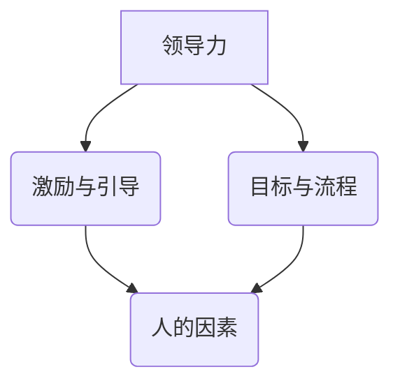

                 

# 文章标题：领导力修炼手册：从项目经理到管理者的蜕变宝典

关键词：领导力、项目管理、管理技能、团队协作、项目执行

摘要：本文旨在为项目经理们提供一本全面且实用的领导力修炼手册，帮助他们在从项目经理向管理者角色转变的过程中，掌握必要的领导力和管理技能，提升团队协作能力，从而更高效地完成项目目标。

## 引言

在当今快速发展的信息技术领域，项目经理的角色正逐渐从执行者转变为领导者。他们不仅要具备优秀的项目管理能力，还需具备卓越的领导力，以便在复杂多变的环境中引导团队，实现项目的成功。然而，如何从项目经理成功转型为管理者，成为许多专业人士面临的一大挑战。

本文将围绕这一主题，深入探讨领导力的核心概念与模型、项目经理的角色与技能、管理者的转变与角色定位、团队管理与领导技巧、沟通策略与团队协作、项目规划与执行以及领导力提升与持续学习等关键领域，为广大项目经理提供一份实用的蜕变宝典。

## 领导力核心概念与模型

### 领导力定义与重要性

领导力是一种影响力，它能够激发人们的潜能，推动团队实现共同目标。与权力不同，领导力更侧重于引导和激励他人，而非通过强制手段来实现目标。

在项目管理中，领导力至关重要。项目经理不仅需要确保项目按计划进行，还需要调动团队的积极性，解决冲突，提升团队效率。因此，具备领导力是项目经理成功转型的关键。

### 领导力与管理的区别

领导力与管理的区别在于，领导力更侧重于激励和引导，而管理则更关注目标和流程。领导力关注的是人的因素，而管理则关注任务的完成。

为了更好地理解这一点，我们可以使用Mermaid流程图来展示领导力与管理的差异：

### 领导力模型介绍

在领导力领域，有多种模型被广泛运用，如情境领导理论、变革领导力等。这些模型为领导者提供了不同的工具和策略，以应对不同的环境和挑战。

#### 情境领导理论

情境领导理论是由保罗·赫塞和肯尼斯·布兰查德提出的，该理论认为领导者的风格应该根据下属的能力和动机进行调整。

情境领导理论的核心概念是领导风格与下属成熟度之间的关系。根据下属的成熟度，领导者可以采用不同的领导风格：

1. **指示式领导（命令型）**：适用于成熟度低的下属。
2. **推销式领导**：适用于成熟度较低的下属。
3. **参与式领导**：适用于成熟度较高的下属。
4. **授权式领导**：适用于成熟度高的下属。

#### 变革领导力

变革领导力是由约翰·科特提出的，该理论强调领导者如何在组织变革过程中发挥关键作用。

变革领导力的关键步骤包括：

1. **建立紧迫感**：让团队成员认识到变革的必要性。
2. **形成有影响力团队**：组建一个能够推动变革的团队。
3. **制定变革愿景和策略**：明确变革的目标和路径。
4. **沟通与传达**：确保团队成员理解并支持变革。
5. **授权与支持**：给予团队成员足够的权力和资源，以推动变革。
6. **巩固变革成果**：确保变革持续进行，并成为组织文化的一部分。

## 项目经理的角色与技能

### 项目经理的角色与职责

项目经理是项目成功的核心推动者。他们的主要职责包括：

1. **规划与组织**：制定项目计划，确保项目目标清晰，资源得到合理分配。
2. **执行与监控**：确保项目按照计划进行，及时发现并解决问题。
3. **沟通与协作**：与团队成员、利益相关者保持良好的沟通，确保信息畅通。
4. **风险管理**：识别潜在风险，制定应对策略。

### 项目管理的知识体系

项目管理知识体系（PMBOK）为项目经理提供了一个全面的工作框架。PMBOK主要包括以下十大知识领域：

1. **项目整合管理**：确保项目目标的实现，资源合理分配。
2. **项目范围管理**：明确项目范围，确保项目目标达成。
3. **项目时间管理**：制定项目计划，确保项目按期完成。
4. **项目成本管理**：控制项目成本，确保项目财务可行。
5. **项目质量管理**：确保项目交付的产品或服务符合质量标准。
6. **项目资源管理**：管理和分配项目资源，包括人力、物力、财力。
7. **项目沟通管理**：确保项目信息畅通，确保利益相关者满意。
8. **项目风险管理**：识别、评估和应对项目风险。
9. **项目采购管理**：管理和控制项目采购活动。
10. **项目相关方管理**：确保项目相关方参与，并满足他们的需求和期望。

### 项目计划与执行

项目计划是项目成功的关键。一个良好的项目计划应包括以下关键要素：

1. **项目目标**：明确项目的目标，确保所有团队成员都明确自己的职责和任务。
2. **项目范围**：明确项目的范围，确保项目交付的产品或服务符合客户需求。
3. **项目进度计划**：制定项目进度计划，确保项目按期完成。
4. **资源计划**：分配项目所需的资源，包括人力、物力、财力。
5. **成本预算**：制定项目成本预算，确保项目财务可行。
6. **质量标准**：明确项目的质量标准，确保项目交付的产品或服务符合质量要求。
7. **风险应对计划**：识别潜在风险，并制定应对策略。

项目执行是项目计划的具体实施。项目经理需要确保项目按照计划进行，及时发现并解决问题，确保项目目标的实现。

### 风险管理

风险管理是项目管理的重要组成部分。项目经理需要识别项目中的潜在风险，评估风险的影响和可能性，并制定应对策略。

以下是一个简单的风险管理流程：

1. **识别风险**：列出项目可能面临的所有风险。
2. **评估风险**：评估风险的影响和可能性。
3. **制定应对策略**：根据风险的影响和可能性，制定相应的应对策略。
4. **监控与更新**：持续监控项目风险，并根据实际情况更新应对策略。

### 项目团队管理

项目团队管理是项目经理的重要职责之一。项目经理需要确保团队高效协同工作，提升团队整体绩效。

以下是一些团队管理技巧：

1. **明确目标**：确保所有团队成员都明确项目的目标，并了解自己的职责和任务。
2. **沟通与协作**：建立良好的沟通渠道，确保团队信息畅通，促进协作。
3. **激励与奖励**：通过激励和奖励机制，提升团队成员的积极性和工作效率。
4. **解决冲突**：及时发现并解决团队中的冲突，确保团队稳定和谐。

## 管理者的转变与角色定位

### 从项目经理到管理者的转变

项目经理与管理者的区别在于，项目经理更关注项目的执行，而管理者则更关注团队的整体绩效和战略规划。为了成功转型为管理者，项目经理需要掌握以下关键技能：

1. **领导力**：提升领导力，学会激励和引导团队。
2. **决策能力**：学会在复杂的环境中做出明智的决策。
3. **战略思维**：培养战略思维，关注团队和项目的长期发展。
4. **沟通能力**：提升沟通能力，确保团队内部和与外部利益相关者的良好沟通。

### 管理者的关键技能

管理者的关键技能包括：

1. **团队领导能力**：学会如何带领和管理团队，提升团队的整体绩效。
2. **时间管理**：学会高效地安排时间和任务，确保项目按期完成。
3. **决策能力**：在复杂的环境中做出明智的决策，以实现项目目标。
4. **问题解决能力**：学会分析和解决项目中遇到的各种问题。
5. **沟通能力**：提升沟通能力，确保信息畅通，减少误解和冲突。

### 领导风格与团队影响

领导风格对团队的影响至关重要。根据情境领导理论，领导者应根据团队的不同阶段和成员的不同需求，采用不同的领导风格。

1. **指示式领导**：适用于团队初期，成员对目标和任务不明确时。
2. **推销式领导**：适用于团队中期，成员需要更多的激励和支持时。
3. **参与式领导**：适用于团队后期，成员需要参与决策和承担责任时。
4. **授权式领导**：适用于团队成熟期，成员有能力独立完成任务时。

### 领导者的自我认知

领导者的自我认知是领导力提升的关键。领导者需要了解自己的优势和不足，不断提升自我，以更好地服务于团队和项目。

以下是一些自我认知的方法：

1. **反思**：定期进行自我反思，了解自己在项目中的表现和改进方向。
2. **反馈**：寻求团队成员和上级的反馈，了解自己在团队中的影响和表现。
3. **培训与发展**：参加领导力培训，学习先进的领导理念和技能。
4. **阅读与研究**：阅读相关书籍和研究，了解领导力的最新趋势和最佳实践。

## 团队管理与领导技巧

### 团队建设策略

团队建设是提升团队绩效的重要手段。以下是一些团队建设策略：

1. **共同目标**：确保团队成员都明确共同的目标，并为此努力。
2. **团队沟通**：建立良好的沟通渠道，促进团队内部的协作和合作。
3. **团队协作**：鼓励团队成员相互协作，共同完成任务。
4. **团队激励**：通过激励和奖励机制，提升团队成员的积极性和工作效率。

### 激励与员工发展

激励和员工发展是提升团队绩效的关键。以下是一些激励和员工发展的方法：

1. **目标设定**：为团队成员设定明确的目标，并鼓励他们努力实现。
2. **奖励机制**：建立奖励机制，对表现优异的员工进行奖励。
3. **培训与发展**：为员工提供培训和发展机会，提升他们的技能和知识。
4. **反馈与沟通**：定期与员工沟通，了解他们的需求和期望，并提供反馈。

### 冲突管理与解决

冲突管理是团队管理中的重要环节。以下是一些冲突管理和解决的方法：

1. **预防冲突**：通过沟通和协作，预防冲突的发生。
2. **识别冲突**：及时发现冲突的迹象，并采取相应的措施。
3. **解决冲突**：通过对话和协商，解决冲突，确保团队和谐。
4. **冲突后处理**：对冲突进行总结和反思，防止类似冲突的再次发生。

### 团队决策与领导技巧

团队决策是团队管理中的重要环节。以下是一些团队决策和领导技巧：

1. **民主决策**：鼓励团队成员参与决策，确保决策的民主性和公正性。
2. **共识决策**：通过对话和协商，达成团队共识，确保决策的可行性和执行性。
3. **快速决策**：在紧急情况下，能够迅速做出决策，确保项目的顺利进行。
4. **领导决策**：在必要时，领导者要做出决策，确保项目的顺利进行。

## 沟通策略与团队协作

### 有效沟通技巧

有效沟通是团队协作的关键。以下是一些有效沟通技巧：

1. **倾听**：倾听是沟通的重要部分，确保理解对方的观点和需求。
2. **表达**：清晰、准确地表达自己的想法和观点。
3. **反馈**：及时给予反馈，确保沟通的双向性。
4. **非言语沟通**：注意非言语沟通，如肢体语言、面部表情等，确保沟通的效果。

### 跨部门沟通与合作

跨部门沟通与合作是项目成功的关键。以下是一些跨部门沟通与合作的方法：

1. **建立沟通渠道**：建立跨部门的沟通渠道，确保信息畅通。
2. **明确职责和权限**：明确各部门的职责和权限，确保工作的顺利进行。
3. **共同目标**：确保跨部门的团队成员都明确共同的目标，并为此努力。
4. **定期会议**：定期召开跨部门的会议，讨论项目进展和问题，确保协作的顺利进行。

### 会议管理与组织

会议管理是团队协作的重要组成部分。以下是一些会议管理与组织的方法：

1. **明确会议目的**：在会议前明确会议的目的和议程。
2. **准备充分**：确保会议参与者都提前做好准备。
3. **控制会议时间**：控制会议的时间，确保会议的高效。
4. **记录和跟进**：会议后记录会议内容和决定，并跟进决定的执行情况。

### 非言语沟通的重要性

非言语沟通在团队协作中同样重要。以下是一些非言语沟通的技巧：

1. **肢体语言**：注意肢体语言，如点头、微笑等，以表达支持和鼓励。
2. **面部表情**：注意面部表情，以表达情感和态度。
3. **语调**：注意语调，以表达语气和情感。
4. **环境布置**：合理布置会议环境，如舒适的座椅、明亮的光线等，以提升沟通效果。

## 项目规划与执行

### 项目启动与规划

项目启动是项目执行的第一步。以下是一些项目启动和规划的方法：

1. **项目立项**：明确项目的目标和范围，确保项目立项的合理性和可行性。
2. **项目计划**：制定详细的项目计划，包括项目进度、资源分配、成本预算等。
3. **项目团队组建**：组建项目团队，明确团队成员的职责和角色。
4. **风险评估**：识别项目中的潜在风险，并制定相应的应对策略。

### 项目监控与控制

项目监控与控制是确保项目按照计划进行的关键。以下是一些项目监控与控制的方法：

1. **项目进度监控**：定期检查项目进度，确保项目按计划进行。
2. **项目成本监控**：监控项目成本，确保项目财务可行。
3. **项目质量监控**：确保项目交付的产品或服务符合质量标准。
4. **项目风险监控**：监控项目风险，确保潜在风险得到及时处理。

### 项目风险管理

项目风险管理是项目管理的重要组成部分。以下是一些项目风险管理的方法：

1. **风险识别**：识别项目中的潜在风险，包括项目内部和外部风险。
2. **风险评估**：评估风险的影响和可能性，确定风险等级。
3. **风险应对**：制定风险应对策略，包括风险规避、风险转移、风险减轻等。
4. **风险监控**：持续监控项目风险，确保风险得到及时处理。

### 项目收尾与评估

项目收尾是项目执行的最后一个阶段。以下是一些项目收尾和评估的方法：

1. **项目验收**：确保项目交付的产品或服务符合客户需求，进行项目验收。
2. **项目总结**：总结项目经验，评估项目绩效，提出改进建议。
3. **项目评估**：评估项目的成功程度，包括项目目标实现情况、成本效益等。
4. **项目文档归档**：将项目文档整理归档，以备后续参考。

## 领导力提升与持续学习

### 终身学习的理念

终身学习是领导者不断提升自己的关键。以下是一些终身学习的理念：

1. **持续学习**：不断学习新知识和技能，以适应不断变化的环境。
2. **反思与总结**：定期反思自己的行为和决策，总结经验教训。
3. **主动学习**：主动寻求学习机会，如参加培训、阅读书籍、参加研讨会等。

### 领导力发展计划

领导力发展计划是提升领导力的有效途径。以下是一些领导力发展计划的方法：

1. **制定目标**：明确自己的领导力发展目标，制定具体的行动计划。
2. **培训与发展**：参加领导力培训，提升自己的领导力和管理技能。
3. **导师指导**：寻求导师的指导，获取宝贵的经验和建议。
4. **实践与反思**：在实际工作中应用所学知识，不断反思和总结，提升领导力。

### 领导力培训与指导

领导力培训与指导是提升领导力的有效方法。以下是一些领导力培训与指导的方法：

1. **内部培训**：组织内部培训，提升团队成员的领导力和管理技能。
2. **外部培训**：参加外部培训，学习先进的领导力和管理理念。
3. **导师指导**：寻求导师的指导，获取宝贵的经验和建议。
4. **实践与反思**：在实际工作中应用所学知识，不断反思和总结，提升领导力。

### 个人反思与成长

个人反思与成长是提升领导力的关键。以下是一些个人反思与成长的方法：

1. **定期反思**：定期反思自己的行为和决策，了解自己的优点和不足。
2. **寻求反馈**：主动寻求团队成员和上级的反馈，了解自己在团队中的影响和表现。
3. **制定改进计划**：根据反思和反馈，制定具体的改进计划，不断提升自己。
4. **持续学习**：不断学习新知识和技能，以适应不断变化的环境。

## 结论

从项目经理到管理者的转变是一个长期且复杂的过程。本文通过深入探讨领导力的核心概念与模型、项目经理的角色与技能、管理者的转变与角色定位、团队管理与领导技巧、沟通策略与团队协作、项目规划与执行以及领导力提升与持续学习等关键领域，为广大项目经理提供了一份实用的蜕变宝典。

通过不断学习和实践，项目经理可以逐步提升自己的领导力和管理技能，成为一名优秀的领导者，带领团队实现项目的成功。让我们一起努力，成为更好的领导者！

## 附录 A：相关领导力工具与资源

### 领导力评估工具

1. **360度反馈**：一种全面的评估方法，通过收集来自团队成员、上级、利益相关者的反馈，帮助领导者了解自己的优点和不足。
2. **领导力仪表盘**：一种可视化工具，用于跟踪领导力的各个方面，如沟通能力、团队管理、决策能力等。

### 项目管理系统推荐

1. **Microsoft Project**：一款功能强大的项目管理软件，可用于项目计划、进度跟踪、资源管理等。
2. **Jira**：一款适用于敏捷开发的工具，可用于任务管理、进度跟踪、团队协作等。

### 领导力发展网站与书籍推荐

1. **Harvard Business Review**：提供丰富的领导力文章和案例研究，帮助读者了解最新的领导力趋势和最佳实践。
2. **《领导力五要素》**：作者约翰·科特，详细阐述了领导力的五个关键要素，为领导者提供了实用的指导。
3. **《领导力心理学》**：作者丹尼尔·戈尔曼，通过心理学角度分析领导力，帮助领导者更好地理解和运用领导力。

## 参考文献

1. 赫塞，K., & 布兰查德，F. H.（1976）。情境领导理论。纽约：麦克格劳-希尔。
2. 科特，J. P.（1990）。领导者变革模式。纽约：哈珀商业出版社。
3. PMI（2017）。项目管理知识体系指南（第六版）。美国项目管理协会。
4. 戈尔曼，D.（1998）。领导力心理学。纽约：利特尔，布朗和公司。
5. 汉迪，C.（2007）。第五项修炼：学习型组织的艺术与实务。纽约：纽约出版社。

## 作者信息

作者：AI天才研究院/AI Genius Institute & 禅与计算机程序设计艺术 /Zen And The Art of Computer Programming

