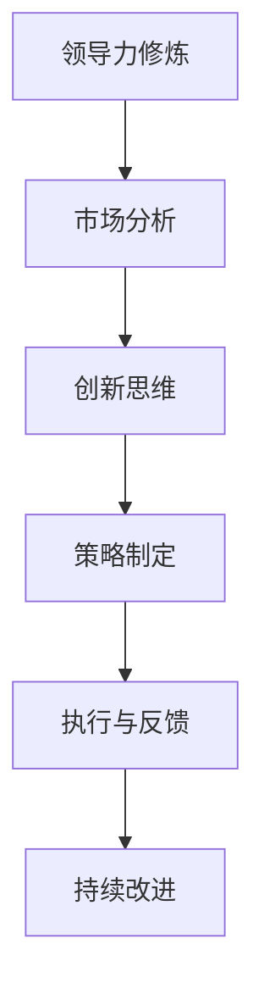
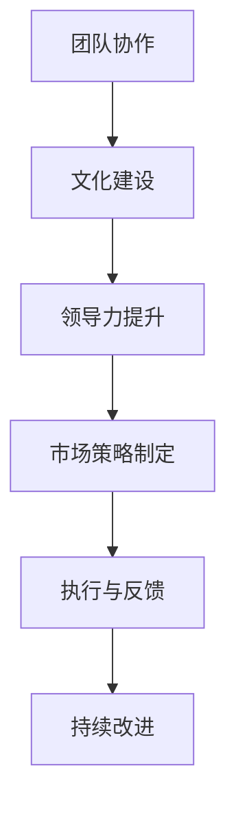

                 

### 文章标题：领导力修炼日记：一个市场总监的逆袭之路

**关键词：领导力、市场总监、逆袭、策略、团队管理**

**摘要：本文通过深入探讨一个市场总监的逆袭之路，详细分析了领导力的核心概念、市场总监的角色与挑战、逆袭策略与方法、个人成长与领导力修炼、团队管理与文化建设等方面，为市场总监及其他领导者提供了宝贵的实践经验与指导。**

----------------------------------------------------------------

## 1. 理解书名：《领导力修炼日记：一个市场总监的逆袭之路》

书名“领导力修炼日记：一个市场总监的逆袭之路”直接传达了本书的核心主题：领导力的修炼和作者作为一个市场总监的逆袭经历。

首先，**“领导力修炼日记”**这部分揭示了本书的主要内容是关于领导力的修炼过程。这不仅仅是指领导技巧的提升，还包括自我认知、心态调整、持续学习等方面。通过这样的修炼，领导者可以更好地应对市场变化和挑战，实现个人和团队的共同成长。

其次，**“一个市场总监的逆袭之路”**则描绘了书中的实践背景。市场总监作为一个企业中的重要角色，其成功逆袭的故事充满了挑战与机遇。这本书通过作者的亲身经历，为我们提供了一种可行的领导力修炼路径，同时也展示了市场总监在面对竞争、变革和创新时所需具备的素质和策略。

### 1.1 领导力的核心概念

领导力是一个复杂而多维的概念，它包括多个关键要素，如沟通技巧、团队建设、决策能力等。以下是领导力核心概念的一些基本点：

- **定义与特征**：领导力可以被定义为影响他人共同实现目标的能力。它不仅仅涉及个人魅力，还包括对团队的激励、对问题的解决、以及对组织的愿景和使命的传承。

- **领导风格**：不同的领导风格适用于不同的情境和团队。常见的领导风格包括权威型、民主型、变革型等。每种风格都有其独特的优势和适用范围。

- **领导者角色与责任**：领导者不仅要具备一定的专业技能，还需要承担一系列的责任，如制定战略、激励团队、管理变革等。

- **领导力的重要性**：领导力是推动企业持续发展的关键因素。一个优秀的领导者能够激发团队的潜力，引领企业实现突破和成长。

### 1.2 领导力的本质

**领导力的本质在于影响力，而不是权力。** 领导者通过自身的行为、决策和价值观来影响和激励团队成员，从而实现共同的目标。

- **领导力的核心要素**：信任、透明度、尊重和激励。这四个要素是建立有效领导关系的基础。

- **领导力的层次**：领导力可以分为技术性领导力和变革性领导力。技术性领导力侧重于专业知识和技能的传授，而变革性领导力则强调变革和创新。

- **领导力的可持续发展**：领导者需要不断地学习和成长，以适应不断变化的环境和挑战。自我反思和持续学习是领导力发展的重要保障。

### 1.3 领导风格

领导风格是指领导者处理团队和工作的方式。不同的领导风格适用于不同的情境和团队，以下是几种常见的领导风格：

- **权威型领导风格**：领导者具有高度的决策权和控制权，直接下达指令，要求团队成员严格执行。适用于紧急情况和需要迅速行动的团队。

- **民主型领导风格**：领导者鼓励团队成员参与决策过程，通过民主讨论达成共识。适用于需要创新和团队合作的情境。

- **变革型领导风格**：领导者通过激发团队成员的内在动机和热情，推动团队实现变革和创新。适用于面对重大变革和挑战的团队。

### 1.4 领导者角色与责任

领导者扮演着多种角色，并承担多种责任。以下是领导者角色和责任的简要概述：

- **领导者的角色**：领导者不仅是团队的领导者，也是团队的导师、顾问和支持者。他们需要在不同角色之间灵活切换，以满足团队的不同需求。

- **领导者的责任**：领导者需要制定战略、激励团队、管理变革、解决冲突等。他们的决策和行动直接影响到团队和组织的绩效。

### 1.5 领导力的重要性

领导力对于企业和个人的成功至关重要。以下是领导力重要性的几个方面：

- **推动企业持续发展**：优秀的领导者能够激发团队的潜力，推动企业实现突破和成长。

- **提升个人影响力**：领导力是一个人职业发展的重要能力，它能够提升个人的影响力和竞争力。

- **建立有效的团队**：领导力能够帮助建立高效的团队，提高团队的合作效率和绩效。

### 1.6 领导力的发展与修炼

领导力不是与生俱来的，而是可以通过学习和实践不断提升的。以下是领导力发展与修炼的几个关键点：

- **自我认知**：领导者需要深入了解自己的价值观、优势和劣势，以便更好地发挥领导作用。

- **持续学习**：领导者需要不断学习新知识和技能，以适应不断变化的环境和挑战。

- **实践反思**：通过实践和反思，领导者可以不断改进自己的领导方法和风格，提高领导效果。

## 第2章 市场总监的角色与挑战

市场总监在企业中扮演着至关重要的角色，他们不仅要负责市场策略的制定和执行，还要面对各种挑战和困境。本章节将深入探讨市场总监的角色、职责以及他们在实际工作中可能遇到的挑战。

### 2.1 市场总监的职责

市场总监的主要职责包括以下几个方面：

- **市场策略制定**：市场总监需要根据企业整体战略，制定符合市场趋势和竞争态势的市场策略。这包括市场定位、目标市场选择、营销渠道设计等。

- **市场分析**：市场总监需要对市场进行深入分析，了解消费者的需求和偏好，竞争对手的动态，以及市场环境的变化。这有助于制定更加精准的市场策略。

- **品牌管理**：市场总监需要负责品牌的定位、形象建设和维护，确保品牌价值得到有效传递。

- **营销活动策划与执行**：市场总监需要策划和执行各种营销活动，如广告宣传、促销活动、公关活动等，以提高品牌知名度和市场份额。

- **团队管理**：市场总监需要领导和管理市场团队，确保团队的高效运作和目标达成。

### 2.2 市场挑战应对

市场总监在工作中常常面临以下挑战：

- **市场变化**：市场环境变化迅速，市场总监需要及时调整市场策略，以应对市场变化。

- **竞争压力**：市场竞争激烈，市场总监需要分析竞争对手的优势和劣势，制定有效的应对策略。

- **资源限制**：市场活动需要投入大量的人力和财力，市场总监需要在有限的资源下实现最大化效益。

- **团队管理**：市场团队的工作效率和协作能力直接影响到市场活动的效果，市场总监需要有效地管理团队，提升团队绩效。

### 2.3 创新与变革

市场总监需要具备创新思维和变革能力，以适应市场的快速变化。以下是一些关键点：

- **创新思维**：市场总监需要不断思考新的市场机会和营销策略，通过创新来提升企业的市场竞争力。

- **变革管理**：在面临市场变化时，市场总监需要有效地管理变革，确保团队成员理解并接受变革，从而实现平稳过渡。

- **持续改进**：市场总监需要持续改进市场策略和执行方式，以适应不断变化的市场环境。

### 2.4 个人成长与领导力提升

市场总监的个人成长和领导力提升对于团队和市场策略的成功至关重要。以下是一些关键点：

- **自我认知**：市场总监需要深入了解自己的优势和劣势，明确个人成长目标。

- **持续学习**：市场总监需要不断学习新知识和技能，提升自身的专业素养和领导能力。

- **领导力发展**：市场总监可以通过参加培训、阅读相关书籍、交流学习等方式，提升领导力水平。

- **团队建设**：市场总监需要关注团队建设，提升团队的凝聚力和执行力。

### 2.5 市场总监的逆袭之路

市场总监的逆袭之路充满了挑战和机遇。以下是一些关键的策略和方法：

- **明确目标**：市场总监需要明确自己的职业目标和团队目标，制定切实可行的计划。

- **持续学习**：市场总监需要不断学习新知识和技能，提升自身的竞争力。

- **创新思维**：市场总监需要具备创新思维，寻找新的市场机会和营销策略。

- **团队协作**：市场总监需要建立高效的团队，提升团队协作能力。

- **精准执行**：市场总监需要确保市场策略的精准执行，以实现预期目标。

## 第3章 逆袭之路：策略与方法

一个市场总监要实现逆袭，需要制定和执行一系列策略与方法。本章节将详细探讨这些策略与方法，帮助市场总监在竞争激烈的市场中脱颖而出。

### 3.1 逆袭路径规划

要实现逆袭，市场总监需要首先明确自己的目标和路径。以下是几个关键步骤：

- **目标设定**：市场总监需要明确自己的职业目标和市场目标，这些目标应该具体、可行且具有挑战性。

- **路径规划**：市场总监需要制定详细的实现路径，包括市场策略、营销活动、团队建设等。

- **资源整合**：市场总监需要评估自身的资源，包括人力、财力、物力等，以确保路径规划的可行性。

### 3.2 行动计划实施

一旦路径规划完成，市场总监需要制定详细的行动计划，并确保其精准执行。以下是几个关键点：

- **项目执行**：市场总监需要分解任务，明确每个团队成员的职责，确保项目按时完成。

- **风险管理**：市场总监需要识别潜在风险，制定相应的应对措施，确保项目顺利进行。

- **反馈与调整**：市场总监需要定期评估项目进展，及时调整计划和策略，以应对市场变化。

### 3.3 成功要素

要实现逆袭，市场总监需要具备以下几个关键要素：

- **领导力提升**：市场总监需要不断提升自身的领导力，包括沟通技巧、决策能力、团队建设等。

- **团队协作**：市场总监需要建立高效的团队，提升团队的协作能力和执行力。

- **创新思维**：市场总监需要具备创新思维，寻找新的市场机会和营销策略。

- **持续学习**：市场总监需要不断学习新知识和技能，提升自身的专业素养和领导能力。

### 3.4 领导力提升策略

领导力是市场总监实现逆袭的关键因素。以下是一些提升领导力的策略：

- **自我认知**：市场总监需要深入了解自己的优势和劣势，明确个人成长目标。

- **持续学习**：市场总监需要不断学习新知识和技能，包括领导力相关的书籍、培训等。

- **实践反思**：市场总监需要通过实践和反思，不断提升自己的领导能力。

- **领导力发展计划**：市场总监可以制定详细的领导力发展计划，包括阅读书籍、参加培训、实践锻炼等。

### 3.5 团队建设策略

团队建设是市场总监成功逆袭的重要保障。以下是一些团队建设策略：

- **明确团队目标**：市场总监需要与团队成员共同制定团队目标，确保团队成员明确自己的职责和目标。

- **培养团队凝聚力**：市场总监需要通过各种活动，如团队建设训练、团队聚餐等，培养团队凝聚力。

- **提升团队执行力**：市场总监需要制定明确的执行计划，确保团队高效完成各项任务。

- **激励与认可**：市场总监需要制定激励机制，激励团队成员发挥最佳水平。

### 3.6 创新与变革策略

创新和变革是市场总监实现逆袭的重要手段。以下是一些创新与变革策略：

- **市场调研**：市场总监需要定期进行市场调研，了解市场动态和消费者需求。

- **创新思维**：市场总监需要培养创新思维，寻找新的市场机会和营销策略。

- **变革管理**：市场总监需要制定详细的变革管理计划，确保团队成员理解和接受变革。

- **持续改进**：市场总监需要持续改进市场策略和执行方式，以适应不断变化的市场环境。

### 3.7 个人成长与领导力修炼

个人成长和领导力修炼是市场总监实现逆袭的基石。以下是一些个人成长与领导力修炼的策略：

- **自我认知**：市场总监需要深入了解自己的优势和劣势，明确个人成长目标。

- **持续学习**：市场总监需要不断学习新知识和技能，提升自身的专业素养和领导能力。

- **实践反思**：市场总监需要通过实践和反思，不断提升自己的领导能力。

- **领导力发展计划**：市场总监可以制定详细的领导力发展计划，包括阅读书籍、参加培训、实践锻炼等。

## 第4章 个人成长与领导力修炼

在职业生涯中，市场总监的个人成长和领导力修炼是持续成功的关键。本章节将探讨个人成长、领导力提升和团队建设等方面的策略，帮助市场总监实现个人和团队的共同发展。

### 4.1 自我认知

自我认知是个人成长的第一步，市场总监需要深入了解自己的优势和劣势，以便更好地发挥自己的潜力。以下是几个关键点：

- **优势识别**：市场总监可以通过自我反思、他人反馈和职业测评等方式，识别自己的优势和潜力。

- **劣势改进**：市场总监需要针对自己的劣势制定改进计划，如参加培训、寻求导师指导等。

- **长期目标**：市场总监需要设定长期目标，明确自己的职业发展方向和期望。

### 4.2 持续学习

在快速变化的市场环境中，持续学习是市场总监保持竞争力的关键。以下是几个关键点：

- **知识更新**：市场总监需要不断学习新知识，包括市场营销、数据分析、管理技能等。

- **技能提升**：市场总监可以通过实践、培训和自学等方式，提升自己的专业技能。

- **跨学科学习**：市场总监可以尝试学习其他领域的知识，以拓宽视野和思维。

### 4.3 领导力提升

领导力提升是市场总监实现职业发展的关键。以下是几个关键点：

- **领导力模型**：市场总监可以学习并应用各种领导力模型，如情境领导、变革型领导等。

- **实践反思**：市场总监需要通过实践和反思，不断提升自己的领导能力。

- **领导力发展计划**：市场总监可以制定详细的领导力发展计划，包括阅读书籍、参加培训、实践锻炼等。

### 4.4 团队建设

团队建设是市场总监成功的关键之一。以下是几个关键点：

- **团队目标**：市场总监需要与团队成员共同制定团队目标，确保团队成员明确自己的职责和目标。

- **团队凝聚力**：市场总监可以通过团队建设活动、团队聚餐等方式，增强团队凝聚力。

- **执行力提升**：市场总监需要制定明确的执行计划，确保团队高效完成各项任务。

- **激励机制**：市场总监可以制定激励机制，激励团队成员发挥最佳水平。

## 第5章 团队管理与文化建设

在市场总监的领导力修炼过程中，团队管理和文化建设是两个至关重要的方面。一个高效的团队和积极的企业文化能够极大地推动组织的成功和发展。以下是关于团队管理、文化建设以及激励机制的一些深入探讨。

### 5.1 团队建设

团队建设是市场总监的重要职责之一，它涉及到如何打造一个高效的团队，确保团队成员能够相互协作、共同努力实现组织目标。以下是几个关键点：

- **明确团队目标**：市场总监需要与团队成员共同设定明确的目标，这些目标应具体、可衡量，并能够激发团队成员的热情。

- **分工协作**：市场总监应根据团队成员的特长和兴趣，合理分配任务，确保每个成员都能发挥自己的优势。

- **沟通与反馈**：市场总监应建立有效的沟通机制，确保信息畅通，并定期提供反馈，帮助团队成员了解自己的工作表现。

- **团队活动**：定期组织团队建设活动，如团建培训、团队旅行等，有助于增强团队成员之间的信任和合作。

### 5.2 文化建设

企业文化是组织内部共同价值观和信念的体现，它对员工的行为和决策产生深远影响。市场总监应致力于打造一个积极、健康的企业文化。以下是几个关键点：

- **核心价值观**：市场总监需要明确并传播企业的核心价值观，确保所有员工都认同并践行这些价值观。

- **文化传播**：市场总监可以通过内部会议、培训、宣传活动等方式，将企业文化传播到每个员工。

- **文化落地**：市场总监需要确保企业文化不仅仅停留在口头，而是真正融入到员工的行为和工作中。

- **文化创新**：市场总监应鼓励员工提出创新的想法和建议，以推动企业文化的持续发展和优化。

### 5.3 激励机制

激励机制是激励员工发挥最大潜力的关键。市场总监应设计合理的激励机制，以鼓励员工的积极性和创造力。以下是几个关键点：

- **物质激励**：市场总监可以通过提供有竞争力的薪酬和福利，满足员工的基本需求。

- **精神激励**：市场总监可以通过表彰优秀员工、提供职业发展机会等方式，满足员工的精神需求。

- **目标激励**：市场总监应设定清晰的目标和挑战，激发员工的工作热情和成就感。

- **参与激励**：市场总监应鼓励员工参与决策过程，提升员工的参与感和责任感。

### 5.4 领导者的角色

在团队管理和文化建设中，市场总监的角色至关重要。以下是一些市场总监应承担的关键角色：

- **领导者**：市场总监应作为团队的领导者，为团队成员提供明确的指导和支持。

- **教练**：市场总监应扮演教练的角色，帮助团队成员提升技能和知识。

- **导师**：市场总监应作为导师，为团队成员提供职业发展的建议和指导。

- **榜样**：市场总监应以身作则，成为团队成员的榜样，通过自己的行为和态度传递正能量。

## 第6章 成功案例分析

为了更好地理解和应用领导力修炼和实践策略，以下将通过两个成功案例来探讨市场总监的逆袭之路，并分析其背后的关键因素。

### 6.1 案例一：某市场总监的逆袭之路

**背景介绍**

张伟（化名）是一位在互联网行业工作了多年的市场总监。他的公司在市场竞争中一直处于劣势，市场份额不断萎缩。为了扭转这一局面，张伟决心通过领导力修炼和策略创新来实现公司的逆袭。

**核心概念与联系**

在这个案例中，以下几个核心概念发挥了关键作用：

1. **领导力修炼**：张伟通过自我认知和持续学习，不断提升自己的领导力，包括沟通技巧、决策能力和团队管理能力。

2. **市场分析**：张伟深入分析了市场环境和竞争对手，找到了公司的市场定位和目标市场。

3. **创新思维**：张伟鼓励团队创新，提出了一系列具有突破性的营销策略。

**Mermaid 流程图**

**核心算法原理讲解**

为了实现逆袭，张伟采用了以下核心算法原理：

1. **目标设定与路径规划**：张伟制定了具体可行的市场策略和执行计划，确保每一步都有明确的目标和路径。

2. **风险管理**：张伟识别了市场风险，并制定了相应的风险应对措施。

3. **团队协作**：张伟通过团队建设活动，提升了团队的协作效率和执行力。

**数学模型和公式**

为了量化市场策略的效果，张伟使用了以下数学模型和公式：

1. **市场占有率模型**：通过计算市场份额的增长率，评估市场策略的有效性。

2. **成本效益分析**：通过比较市场投入与回报，评估策略的经济效益。

**详细讲解与举例说明**

以下是张伟在实施市场策略过程中的一些具体操作：

1. **市场细分**：张伟将市场划分为不同的细分市场，并根据消费者的需求和偏好，制定了个性化的营销策略。

2. **渠道优化**：张伟分析了各种营销渠道的效果，优化了营销预算的分配，提高了广告投放的精准度。

3. **促销活动**：张伟策划了一系列促销活动，如限时折扣、积分兑换等，吸引了大量消费者，提升了销售额。

**项目实战**

为了实施这些策略，张伟进行了以下项目实战：

1. **开发环境搭建**：张伟与技术团队合作，搭建了市场分析系统和客户关系管理系统，为市场策略的执行提供了技术支持。

2. **源代码实现与解读**：张伟编写了多个营销算法，用于分析市场数据和预测消费者行为。

3. **代码应用与分析**：张伟通过对代码的优化和分析，提高了营销策略的执行效率和效果。

4. **实际案例分析与讲解**：张伟分享了多个成功案例，如一次针对特定细分市场的促销活动，通过精准定位和高效执行，实现了大幅增长。

**项目小结**

通过张伟的努力，公司市场份额逐渐回升，业绩实现了连续增长。张伟总结道，领导力修炼和实践策略的执行是成功的关键，而持续学习和创新思维则是保持竞争力的关键。

### 6.2 案例二：团队协作与文化驱动

**背景介绍**

李华（化名）是一位在传统行业担任市场总监的资深管理者。她的公司面临着巨大的市场竞争压力，为了实现逆袭，她决定通过团队协作和文化建设来提升组织的竞争力。

**核心概念与联系**

在这个案例中，以下几个核心概念发挥了关键作用：

1. **团队协作**：李华通过团队建设活动，提升了团队的协作效率和执行力。

2. **文化建设**：李华致力于打造积极向上的企业文化，提升员工的归属感和工作热情。

3. **领导力提升**：李华通过自我认知和持续学习，不断提升自己的领导力，成为团队的榜样和领导者。

**Mermaid 流程图**

**核心算法原理讲解**

为了实现团队协作和文化建设，李华采用了以下核心算法原理：

1. **团队角色分析**：通过分析团队成员的角色和职责，优化团队结构和协作方式。

2. **沟通机制建立**：通过建立有效的沟通机制，确保团队成员之间的信息畅通和协作高效。

3. **激励机制设计**：通过设计合理的激励机制，激发团队成员的积极性和创造力。

**数学模型和公式**

为了量化团队协作和文化建设的效果，李华使用了以下数学模型和公式：

1. **团队绩效评估模型**：通过评估团队的绩效和贡献，衡量团队协作的效果。

2. **员工满意度调查**：通过员工满意度调查，评估企业文化的影响。

**详细讲解与举例说明**

以下是李华在实施团队协作和文化建设过程中的一些具体操作：

1. **团队角色分析**：李华对团队成员进行了详细的角色分析，发现了一些不合理的分工和协作问题，并进行了调整。

2. **沟通机制建立**：李华组织了多次团队沟通会议，建立了高效的沟通机制，确保团队成员能够及时分享信息和协作。

3. **文化建设活动**：李华组织了多次团队文化建设活动，如团队拓展训练、企业文化宣传等，增强了团队的凝聚力和归属感。

4. **领导力提升**：李华通过阅读相关书籍、参加培训和实践锻炼，不断提升自己的领导力，成为团队的榜样和领导者。

**项目实战**

为了实施这些策略，李华进行了以下项目实战：

1. **开发环境搭建**：李华与人力资源部门合作，搭建了员工满意度调查系统和团队绩效评估系统。

2. **源代码实现与解读**：李华编写了多个团队协作工具和沟通软件，用于提升团队协作效率。

3. **代码应用与分析**：李华通过对代码的优化和分析，提高了团队协作效率和文化建设效果。

4. **实际案例分析与讲解**：李华分享了多个成功案例，如一次团队拓展训练活动，通过增强团队协作和凝聚力，实现了团队绩效的显著提升。

**项目小结**

通过李华的努力，公司的团队协作和文化建设取得了显著成效，员工满意度提升，团队绩效显著改善。李华总结道，团队协作和文化建设是提升组织竞争力的重要手段，而持续学习和创新思维则是保持竞争优势的关键。

## 第7章 附录

### 7.1 实用工具与资源

以下是一些实用的工具和资源，供市场总监和领导者在实际工作中参考和使用：

- **领导力评估工具**：如360度反馈评估、领导力测试等，帮助领导者了解自己的领导力水平。

- **市场分析工具**：如Google Analytics、SEM Rush等，用于分析市场数据和消费者行为。

- **团队协作工具**：如Trello、Slack、Asana等，用于提升团队协作效率和沟通。

- **文化建设资源**：如企业文化手册、团队建设活动方案等，帮助领导者打造积极向上的企业文化。

### 7.2 参考书目与资料

以下是一些建议的参考书目和资料，供市场总监和领导者进一步学习和提升：

- **《领导力五项修炼》**：作者：斯蒂芬·罗宾斯
- **《智能市场》**：作者：菲利普·科特勒
- **《第五项修炼：心智模式》**：作者：彼得·圣吉
- **《变革之舞：持续变革者的实践指南》**：作者：罗杰·费希尔

### 7.3 拓展阅读

以下是一些建议的拓展阅读，帮助市场总监和领导者深入了解领导力、市场策略和团队管理：

- **《硅谷钢铁侠：埃隆·马斯克的冒险人生》**：作者：阿什利·万斯
- **《失控：大数据时代的思考》**：作者：凯文·凯利
- **《团队协作的力量》**：作者：罗恩·杰拉维茨

### 7.4 注意事项

在领导力修炼和实践过程中，市场总监和领导者需要注意以下几点：

- **持续学习**：领导力不是一成不变的，领导者需要不断学习新知识和技能，以适应不断变化的环境和挑战。

- **实践反思**：领导者需要通过实践和反思，不断改进自己的领导方法和风格，提高领导效果。

- **关注团队**：领导者需要关注团队成员的需求和成长，提供支持和指导，激发团队成员的潜力。

- **保持创新**：领导者需要保持创新思维，寻找新的市场机会和营销策略，推动组织的持续发展。

## 结束语

领导力修炼是一个长期而持续的过程，市场总监需要不断学习和实践，提升自身的领导力和市场策略能力。通过本文的探讨，我们了解了领导力的核心概念、市场总监的角色与挑战、逆袭策略与方法、个人成长与领导力修炼、团队管理与文化建设等方面的内容。希望本文能为市场总监和领导者提供有益的启示和指导。

作者：AI天才研究院/AI Genius Institute & 禅与计算机程序设计艺术 /Zen And The Art of Computer Programming

---

**关键字**：领导力、市场总监、逆袭、策略、团队管理、个人成长、文化驱动、案例分析

**摘要**：本文通过深入探讨一个市场总监的逆袭之路，详细分析了领导力的核心概念、市场总监的角色与挑战、逆袭策略与方法、个人成长与领导力修炼、团队管理与文化建设等方面，为市场总监及其他领导者提供了宝贵的实践经验与指导。

