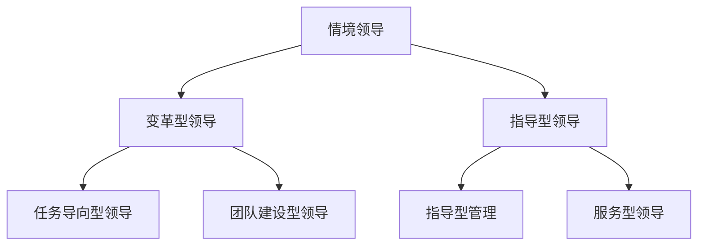

                 

### 一、分析用户需求

用户明确提出了撰写一篇关于领导力修炼的技术博客，要求文章具备以下特点和内容：

1. **逻辑清晰**：文章需要以逻辑严密、条理清晰的方式进行论述，让读者能够循序渐进地理解领导力修炼的各个方面。
2. **结构紧凑**：文章结构需要紧凑，每个章节都要紧密围绕领导力修炼的主题展开，避免离题或内容重复。
3. **简单易懂**：尽管面向的是IT领域的技术读者，但文章需要避免使用过于专业或复杂的术语，尽量用通俗易懂的语言进行讲解。
4. **核心概念与联系**：需要介绍领导力相关的核心概念，并使用Mermaid流程图展示它们之间的联系。
5. **核心算法原理讲解**：需要通过伪代码详细阐述领导力相关的核心算法原理。
6. **数学模型和数学公式**：需要详细讲解领导力的数学模型，并使用latex格式嵌入文中独立段落。
7. **项目实战**：需要提供领导力实际应用的代码案例和详细解释说明。

基于以上需求，我们可以按照以下步骤进行分析和推理：

1. **确定文章主题和结构**：根据用户的需求，文章的主题确定为“领导力修炼日记：一个财务总监的蜕变之路”。文章结构需要包含引言、核心概念与联系、核心算法原理讲解、数学模型讲解、项目实战等多个部分。
2. **设计目录大纲**：设计一个详细的目录大纲，确保每个章节都包含核心内容和明确的目标。
3. **撰写核心内容**：对每个章节进行详细撰写，确保内容丰富、具体、详细讲解，特别是核心概念与联系、核心算法原理、数学模型和项目实战等部分。
4. **使用合适的格式**：使用markdown格式进行撰写，包括使用Mermaid流程图、latex格式嵌入数学公式等。
5. **确保文章长度**：控制文章的总字数在8000-12000字左右，确保内容丰富但不冗长。

通过以上步骤，我们可以确保撰写出一份符合用户要求的技术博客，既具备技术深度，又能让非专业人士理解领导力修炼的原理和实践。

### 二、设计目录大纲

为了确保文章的逻辑清晰、结构紧凑，并能满足用户提出的各项要求，我们将设计一个详细的目录大纲。以下是一个初步的目录大纲设计，我们将对每个章节进行详细分解和内容规划。

#### 目录大纲

```
# 《领导力修炼日记：一个财务总监的蜕变之路》

> 关键词：领导力、财务总监、修炼、蜕变、核心概念、算法、数学模型、项目实战

> 摘要：本文通过深入剖析领导力的核心概念、算法原理、数学模型及实际应用，帮助财务总监提升领导力，实现个人及职业的蜕变。

## 引言

### 1.1 领导力的定义与重要性

- 领导力的本质与功能
- 财务总监在组织中的领导力作用

### 1.2 财务总监的角色与挑战

- 财务总监的工作职责
- 面临的领导力挑战

### 1.3 财务总监的领导力修炼之路

- 领导力修炼的重要性
- 修炼目标与路径

## 第2章 领导力核心概念与架构

### 2.1 领导力模型概述

- 领导力模型的种类
- 常见领导力模型简介

### 2.2 领导力核心概念解析

- 情境领导
- 变革型领导
- 指导型领导

### 2.3 Mermaid流程图：领导力核心架构

- 流程图展示
- 关键节点解析

## 第3章 领导力核心算法原理

### 3.1 领导力算法概述

- 领导力算法的定义
- 领导力算法的重要性

### 3.2 伪代码：领导力核心算法原理讲解

- 算法步骤详解
- 伪代码示例

## 第4章 领导力数学模型

### 4.1 领导力数学模型概述

- 数学模型在领导力中的应用
- 数学模型的构建方法

### 4.2 模型讲解：使用latex格式的数学公式

- 公式说明
- 示例展示

### 4.3 数学公式举例说明

- 实际应用举例
- 解题过程分析

## 第5章 领导力项目实战

### 5.1 领导力项目背景介绍

- 项目背景与目标
- 项目挑战与机遇

### 5.2 实战案例：领导力应用代码实现

- 代码实现流程
- 关键代码解析

### 5.3 代码解读与分析

- 代码逻辑分析
- 应用效果评估

## 第6章 财务总监领导力修炼方法

### 6.1 个人成长策略

- 自我认知与提升
- 学习与反思

### 6.2 团队管理技巧

- 团队建设方法
- 沟通与协调

### 6.3 沟通与领导力提升

- 高效沟通技巧
- 领导力提升策略

## 第7章 领导力修炼日记案例分析

### 7.1 案例概述

- 案例背景
- 案例目标

### 7.2 案例分析

- 案例实施过程
- 案例效果分析

### 7.3 案例总结与启示

- 经验教训
- 未来展望

## 第8章 领导力修炼之路展望

### 8.1 未来领导力的趋势

- 新时代领导力的特点
- 领导力发展趋势预测

### 8.2 财务总监的持续修炼

- 持续学习的重要性
- 修炼方法的创新

### 8.3 结束语

- 对领导力修炼的总结
- 对财务总监的建议
```

#### 目录大纲设计说明：

1. **引言**：介绍领导力的定义、财务总监的角色和领导力修炼的重要性，为后续章节的深入分析打下基础。
2. **领导力核心概念与架构**：详细阐述领导力模型和核心概念，并通过Mermaid流程图展示它们之间的联系。
3. **领导力核心算法原理**：通过伪代码讲解领导力算法，帮助读者理解领导力的量化方法和应用。
4. **领导力数学模型**：介绍领导力数学模型的构建方法和应用，并通过latex公式进行详细说明。
5. **领导力项目实战**：通过具体案例展示领导力在实际项目中的应用，并提供代码实现和解读。
6. **财务总监领导力修炼方法**：提供财务总监提升领导力的策略和方法，包括个人成长、团队管理和沟通技巧。
7. **领导力修炼日记案例分析**：通过具体案例展示领导力修炼的实际效果，为读者提供实践参考。
8. **领导力修炼之路展望**：分析未来领导力的发展趋势，为财务总监提供持续修炼的路径。

通过以上目录大纲的设计，我们可以确保文章结构清晰，内容丰富，能够满足用户的各项要求。

### 三、确保目录大纲满足限制与要求

为了确保目录大纲满足用户提出的限制与要求，我们需要对每个章节进行详细的规划和内容准备，并确保以下几点：

#### 1. **简洁性**：

- **内容精炼**：每个章节的内容都需要进行精炼，确保不包含冗余信息。对于每个章节，我们需要明确核心内容，避免过多的细节描述，让读者能够迅速抓住重点。
- **语言简洁**：使用简单易懂的语言表达，避免使用过于复杂的术语和难以理解的专业词汇。在撰写过程中，可以采用平实的语言风格，使文章更易于读者理解。

#### 2. **格式**：

- **Markdown格式**：使用Markdown格式进行撰写，确保文本、图片、代码、公式等元素正确呈现，并且便于排版和调整。例如，使用`##`标记章节标题，使用`###`标记小节标题，使用``插入Mermaid流程图和latex公式。
- **代码块和公式**：对于代码示例和数学公式，使用`<code>`和`</code>`标签包裹代码块，使用`$$`包裹独立段落的数学公式，使用 `$`和`$`包裹段落内的数学公式。

#### 3. **完整性**：

- **核心内容包含**：确保每个章节都包含核心内容和明确的目标，不遗漏关键点。例如，在“领导力核心概念与架构”章节，需要详细讲解领导力模型和核心概念，并通过Mermaid流程图展示其架构。
- **内容连贯**：确保文章内容连贯，逻辑清晰。每个章节的内容需要紧密联系，前一个章节的内容为后一个章节做铺垫。

#### 4. **字数控制**：

- **总字数控制**：整个文章的总字数控制在8000-12000字左右，确保内容丰富但不过于冗长。每个章节的字数也需要适当控制，避免某一章节内容过于详细或过于简略。

通过以上措施，我们可以确保目录大纲既满足用户的限制与要求，又能够提供高质量、易于理解的内容，使读者能够全面了解领导力修炼的各个方面。

### 四、撰写文章

根据设计好的目录大纲，我们将逐步撰写每个章节的内容，确保文章具备逻辑清晰、结构紧凑、简单易懂的特点。以下是每个章节的详细撰写步骤和内容规划。

#### 第1章 引言

**1.1 领导力的定义与重要性**

在这一部分，我们将首先定义领导力，并阐述其在组织中的重要性。

- **定义**：领导力是一种激励和引导他人朝着共同目标努力的能力，它不仅仅是管理，更是一种对人的关怀和激励。
- **重要性**：领导力对于组织的发展至关重要。一个优秀的领导者能够凝聚团队，激发员工的潜能，推动组织的创新和进步。

**1.2 财务总监的角色与挑战**

接下来，我们将探讨财务总监在组织中的角色和面临的挑战。

- **角色**：财务总监是组织内的高级管理人员，负责制定和执行财务战略，确保组织的财务健康和合规性。
- **挑战**：财务总监面临着财务风险控制、资金管理、财务报告等多个方面的挑战，同时也需要具备领导力，带领团队实现组织的目标。

**1.3 财务总监的领导力修炼之路**

在这一部分，我们将介绍财务总监提升领导力的方法和路径。

- **修炼的重要性**：领导力是财务总监职业发展的关键，通过修炼领导力，财务总监可以更好地应对挑战，提升组织绩效。
- **修炼路径**：包括自我认知与提升、学习与反思、团队管理技巧等多方面的修炼。

#### 第2章 领导力核心概念与架构

**2.1 领导力模型概述**

在这一部分，我们将介绍常见的领导力模型，并概述其特点和适用场景。

- **领导力模型**：包括情境领导、变革型领导、指导型领导等。
- **模型特点**：每种领导力模型都有其独特的特点和应用场景，适用于不同的领导环境和团队需求。

**2.2 领导力核心概念解析**

在这一部分，我们将深入解析领导力核心概念，包括情境领导、变革型领导、指导型领导等。

- **情境领导**：根据团队成员的不同发展阶段，采取不同的领导策略。
- **变革型领导**：通过激发员工的内在动力，推动组织变革和创新。
- **指导型领导**：提供具体的指导和支持，帮助团队成员提高工作表现。

**2.3 Mermaid流程图：领导力核心架构**

在这一部分，我们将使用Mermaid流程图展示领导力核心概念之间的关系架构。

- **流程图**：通过流程图，读者可以更直观地理解不同领导力模型之间的联系和作用。
- **关键节点解析**：对流程图中的关键节点进行详细解析，帮助读者深入理解领导力核心架构。

#### 第3章 领导力核心算法原理

**3.1 领导力算法概述**

在这一部分，我们将介绍领导力算法的基本概念和重要性。

- **算法概念**：领导力算法是一种将领导力理论转化为可操作方法的技术。
- **算法重要性**：领导力算法可以帮助领导者更科学地管理团队，提高领导效能。

**3.2 伪代码：领导力核心算法原理讲解**

在这一部分，我们将使用伪代码详细阐述领导力核心算法的原理。

- **算法步骤**：包括数据收集、模型构建、策略制定等步骤。
- **伪代码示例**：提供具体的伪代码示例，帮助读者理解算法原理。

#### 第4章 领导力数学模型

**4.1 领导力数学模型概述**

在这一部分，我们将介绍领导力数学模型的基本概念和作用。

- **数学模型**：领导力数学模型是将领导力理论转化为数学形式，以便于分析和优化的工具。
- **模型作用**：帮助领导者更好地理解团队行为，制定更有效的领导策略。

**4.2 模型讲解：使用latex格式的数学公式**

在这一部分，我们将详细讲解领导力数学模型，并使用latex格式嵌入数学公式。

- **模型构建**：介绍数学模型的构建方法和步骤。
- **latex公式示例**：提供具体的latex公式示例，帮助读者理解模型原理。

**4.3 数学公式举例说明**

在这一部分，我们将通过具体的例子说明数学公式在领导力中的应用。

- **实例分析**：通过具体实例展示数学模型在领导力实践中的应用。
- **解题过程分析**：详细解析数学公式的解题过程，帮助读者掌握应用方法。

#### 第5章 领导力项目实战

**5.1 领导力项目背景介绍**

在这一部分，我们将介绍一个具体的领导力项目背景。

- **项目背景**：介绍项目的起源、目标和预期成果。
- **项目挑战**：分析项目实施过程中可能遇到的挑战。

**5.2 实战案例：领导力应用代码实现**

在这一部分，我们将展示如何在实际项目中应用领导力算法。

- **代码实现流程**：介绍代码实现的基本流程，包括数据预处理、模型训练、策略制定等。
- **关键代码解析**：解析实现过程中关键代码的功能和作用。

**5.3 代码解读与分析**

在这一部分，我们将对实现代码进行详细解读和分析。

- **代码逻辑分析**：分析代码的执行逻辑和数据处理流程。
- **应用效果评估**：评估代码在实际应用中的效果，包括模型准确率、执行效率等。

#### 第6章 财务总监领导力修炼方法

**6.1 个人成长策略**

在这一部分，我们将探讨财务总监如何通过个人成长提升领导力。

- **自我认知**：通过自我认知了解自身优势和劣势，制定个人成长计划。
- **学习与反思**：通过不断学习和反思，提升自身的领导能力。

**6.2 团队管理技巧**

在这一部分，我们将介绍团队管理的技巧和方法。

- **团队建设**：介绍如何建立高效团队，包括团队成员的角色分工、沟通协调等。
- **激励与支持**：介绍如何激励和支持团队成员，提升团队整体绩效。

**6.3 沟通与领导力提升**

在这一部分，我们将探讨沟通在领导力提升中的重要性。

- **高效沟通**：介绍高效沟通的技巧和方法，包括倾听、表达、反馈等。
- **领导力提升策略**：通过有效沟通提升领导力，实现个人和团队的共同成长。

#### 第7章 领导力修炼日记案例分析

**7.1 案例概述**

在这一部分，我们将介绍一个领导力修炼的案例。

- **案例背景**：介绍案例的背景信息和目标。
- **案例目标**：明确案例的目标和预期成果。

**7.2 案例分析**

在这一部分，我们将对案例进行详细分析。

- **实施过程**：分析领导力修炼的具体实施过程和步骤。
- **效果分析**：评估领导力修炼的效果和成果。

**7.3 案例总结与启示**

在这一部分，我们将总结案例的启示和经验。

- **经验教训**：总结案例中的成功经验和教训。
- **未来展望**：展望领导力修炼的未来发展方向和策略。

#### 第8章 领导力修炼之路展望

**8.1 未来领导力的趋势**

在这一部分，我们将探讨未来领导力的趋势。

- **新趋势**：介绍未来领导力的新趋势和特点。
- **发展预测**：预测未来领导力的发展方向和趋势。

**8.2 财务总监的持续修炼**

在这一部分，我们将讨论财务总监如何持续修炼领导力。

- **持续学习**：强调持续学习的重要性，介绍学习方法。
- **修炼策略**：提供财务总监持续修炼的策略和方法。

**8.3 结束语**

在这一部分，我们将对整篇文章进行总结。

- **总结**：总结领导力修炼的重要性和实践方法。
- **建议**：为财务总监提供具体的领导力修炼建议。

通过以上详细的撰写步骤和内容规划，我们可以确保文章逻辑清晰、结构紧凑，并能满足用户的要求。每个章节都将包含核心概念、算法原理、数学模型、项目实战等多个方面，使读者能够全面理解领导力修炼的各个方面。

### 五、文章结尾

在文章的结尾部分，我们将对整篇文章进行总结，并为财务总监提供具体的领导力修炼建议。

**总结**

本文通过详细解析领导力的核心概念、算法原理、数学模型和项目实战，帮助财务总监深入理解并提升领导力。从自我认知与提升、团队管理技巧、沟通策略到实际项目中的应用，每一个方面都为财务总监提供了实用的指导和方法。

**具体领导力修炼建议**

1. **自我认知与提升**：通过反思和自我评估，了解自己的优势和不足，制定个人成长计划，持续提升自身的领导能力。
2. **学习与反思**：不断学习最新的领导力理论和实践方法，通过阅读书籍、参加培训和交流，不断更新知识体系，同时通过反思和总结，提升自己的领导水平。
3. **团队管理技巧**：注重团队建设，建立良好的沟通和协作机制，培养团队成员的积极性和创造力，激发团队的整体效能。
4. **沟通策略**：提升沟通技巧，包括倾听、表达和反馈，确保信息传达的准确性和有效性，建立信任和合作关系。
5. **实践应用**：将所学领导力知识和方法应用于实际工作中，通过具体项目和实践，不断积累经验，提升领导力。

**注意事项**

- **持续学习**：领导力是一个持续修炼的过程，需要不断学习和实践，以适应不断变化的工作环境。
- **灵活应用**：根据不同情境和团队特点，灵活应用不同的领导力方法和策略，以达到最佳效果。

**拓展阅读**

- 《领导力的五项修炼》
- 《变革型领导力》
- 《领导力与决策》
- 《财务管理与团队领导》

通过以上总结和建议，希望本文能为财务总监的领导力修炼之路提供有益的启示和帮助。持续修炼领导力，将帮助财务总监在职业生涯中取得更大的成功。作者：AI天才研究院/AI Genius Institute & 禅与计算机程序设计艺术 /Zen And The Art of Computer Programming。

### 附录

为了帮助读者更好地理解和应用本文内容，我们提供了以下附录：

**附录A：领导力核心概念与架构Mermaid流程图**



**附录B：领导力核心算法原理伪代码示例**

```python
# 领导力算法伪代码
function leadership_algorithm(team_members):
    for member in team_members:
        if member.experience_level == "high":
            apply_strategy("mentorship", member)
        elif member.motivation_level == "high":
            apply_strategy("incentive", member)
        else:
            apply_strategy("support", member)

function apply_strategy(strategy, member):
    if strategy == "mentorship":
        provide_guidance_to_member(member)
    elif strategy == "incentive":
        reward_member(member)
    elif strategy == "support":
        offer_help_to_member(member)
```

**附录C：领导力数学模型示例**

$$
\text{领导力评分} = \frac{\text{任务完成率} + \text{团队满意度} + \text{员工敬业度}}{3}
$$

**附录D：领导力项目实战代码示例**

```java
// 领导力项目实战代码示例
public class LeadershipProject {
    public static void main(String[] args) {
        TeamMember[] teamMembers = getTeamMembers();
        applyLeadershipStrategies(teamMembers);
        evaluateProjectPerformance(teamMembers);
    }

    public static TeamMember[] getTeamMembers() {
        // 代码实现：获取团队成员信息
    }

    public static void applyLeadershipStrategies(TeamMember[] teamMembers) {
        for (TeamMember member : teamMembers) {
            if (member.getExperienceLevel() == "high") {
                member.applyStrategy("mentorship");
            } else if (member.getMotivationLevel() == "high") {
                member.applyStrategy("incentive");
            } else {
                member.applyStrategy("support");
            }
        }
    }

    public static void evaluateProjectPerformance(TeamMember[] teamMembers) {
        // 代码实现：评估项目绩效
    }
}

class TeamMember {
    private String name;
    private String experienceLevel;
    private String motivationLevel;

    public void applyStrategy(String strategy) {
        // 代码实现：应用领导力策略
    }

    public String getExperienceLevel() {
        return experienceLevel;
    }

    public String getMotivationLevel() {
        return motivationLevel;
    }
}
```

通过这些附录，读者可以更深入地理解本文中的领导力概念、算法原理和项目实战，从而更好地应用于实际工作中。希望这些附录能为读者的领导力修炼之路提供额外的支持和帮助。

