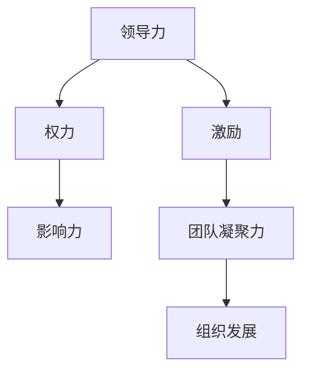
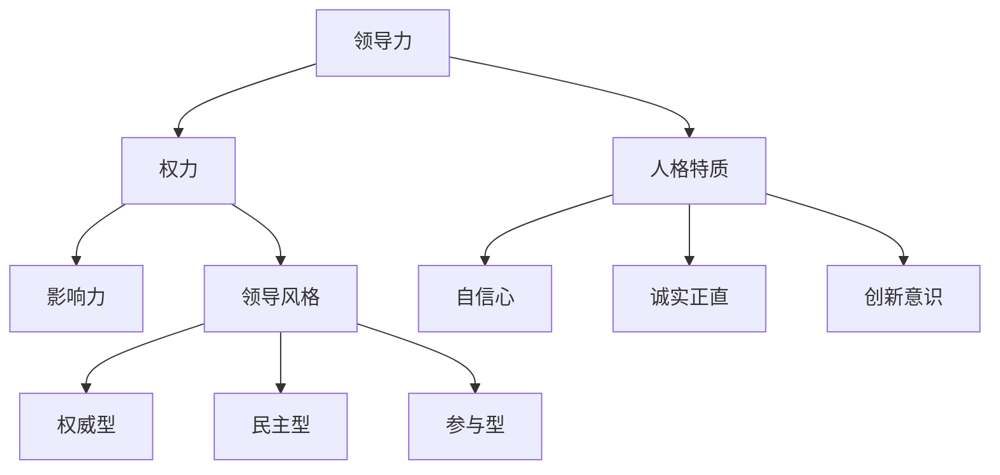
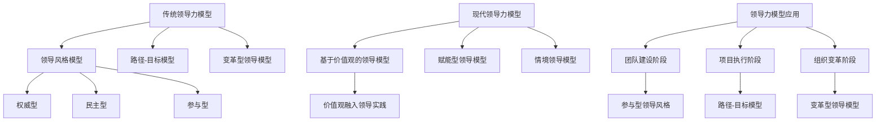
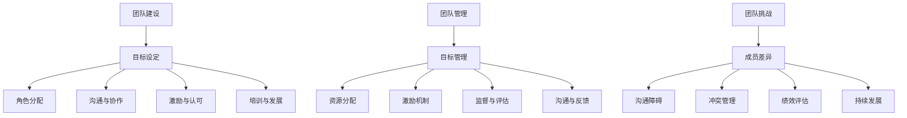
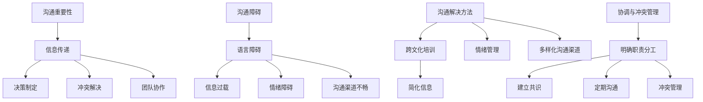
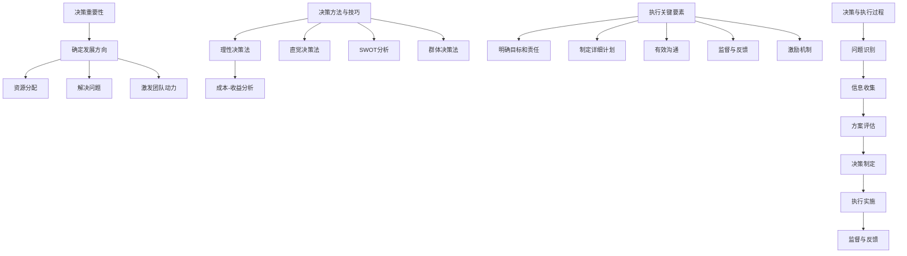
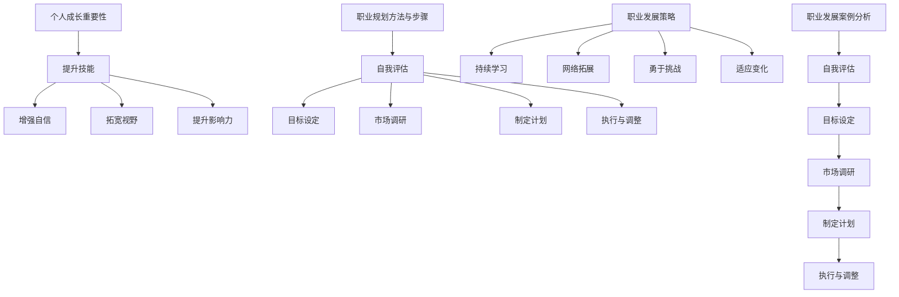
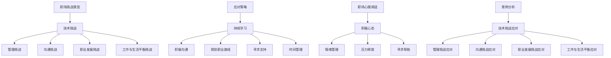

                 


### 文章标题

# 《领导力修炼笔记：80后职场精英的成长之路》

> 关键词：领导力、职场精英、成长、80后、修炼

> 摘要：本文将深入探讨80后职场精英在领导力修炼过程中的成长路径，通过背景介绍、核心概念与联系、算法原理讲解、数学模型与公式、项目实战、最佳实践tips等内容，帮助读者理解并掌握领导力的本质和提升策略。

----------------------------------------------------------------

## 引言

在当今快速变化的社会和经济环境中，领导力成为职场成功的关键因素之一。特别是在我国，80后这一代职场精英凭借其独特的优势和经历，成为企业中不可或缺的中坚力量。然而，随着职业发展的深入，如何提升自身的领导力成为他们面临的重要课题。

本文旨在通过《领导力修炼笔记：80后职场精英的成长之路》一书，系统地探讨80后职场精英在领导力修炼过程中的成长路径。文章将按照以下结构展开：

1. **领导力理论基础**：介绍领导力的定义、分类、发展历程等核心概念。
2. **领导力实践技巧**：探讨团队建设、沟通协调、决策执行等实践技巧。
3. **职业成长策略**：分析个人成长与职业规划、职场挑战与应对策略。
4. **领导力修炼案例**：通过具体案例展示领导力修炼的实际效果和心得体会。

接下来，我们将逐步深入，通过具体章节的详细内容，帮助读者理解并提升领导力。

----------------------------------------------------------------

## 第一章：领导力概述

### 1.1 领导力的重要性

领导力是一种关键能力，对于个人和组织的发展至关重要。首先，领导力是推动组织发展的动力。在复杂多变的市场环境中，企业需要通过领导力来应对挑战、抓住机遇，从而实现持续增长。

其次，领导力是凝聚团队的核心。一个优秀的领导者能够激发团队成员的潜力，提高团队的凝聚力和执行力，从而实现团队目标。

最后，领导力是个人职业发展的催化剂。具备领导力的人更容易获得职业晋升机会，成为企业中的关键人物。

### 1.2 领导力的定义与分类

领导力可以定义为影响和激励他人实现目标的能力。根据不同的分类标准，领导力可以分为多种类型：

1. **权力型领导**：依赖于职位和权威来影响他人。
2. **变革型领导**：通过激发团队成员的潜力，推动组织实现变革。
3. **魅力型领导**：具备强烈的个人魅力，能够吸引和激励团队成员。
4. **参与型领导**：注重与团队成员的互动和参与，共同制定决策。

### 1.3 领导力的发展历程

领导力的发展历程可以追溯到古代，但随着社会和经济的发展，领导力理论不断演变。以下是几个重要的领导力理论：

1. **领导特质理论**：强调领导者具备某些特定的个性特质。
2. **领导行为理论**：关注领导者的行为和领导风格。
3. **领导情境理论**：认为领导效果取决于领导者的行为和情境因素。
4. **变革型领导理论**：强调领导者的激励和启发作用。

### 1.4 领导力与权力

领导力与权力密切相关，但并不等同。权力是领导者实现领导目标的重要工具，而领导力则是领导者影响和激励他人的能力。在实际应用中，领导者需要平衡权力和领导力，以实现最佳效果。

## 核心概念与联系 Mermaid 流程图



### 1.5 小结

本章对领导力进行了全面概述，介绍了领导力的重要性、定义与分类、发展历程以及领导力与权力的关系。在接下来的章节中，我们将进一步探讨领导力的核心概念和实践技巧。

----------------------------------------------------------------

## 第二章：领导力核心概念

### 2.1 领导力与权力

领导力与权力是密切相关的概念，但它们之间也存在明显的区别。权力是领导者实现领导目标的重要工具，而领导力则是领导者影响和激励他人的能力。

#### 权力的定义

权力可以定义为一个人在组织中能够影响他人行为和决策的能力。权力可以分为以下几种类型：

1. **正式权力**：基于职位和职位赋予的权力，如命令权、决策权等。
2. **非正式权力**：基于个人魅力、专业知识、人际关系等非正式因素赋予的权力。

#### 领导力与权力的关系

领导力与权力之间存在着相互作用的关系。领导力是领导者运用权力实现领导目标的能力，而权力则是领导力发挥作用的基础。

1. **权力增强领导力**：通过正式权力，领导者可以更有效地影响和激励团队成员，推动组织目标的实现。
2. **领导力提升权力**：具备领导力的人更容易获得正式权力，从而在组织中发挥更大的影响力。

### 2.2 领导风格与领导方式

领导风格是领导者在其管理活动中表现出的行为方式。根据不同的领导风格，领导方式可以分为以下几种：

1. **权威型领导**：领导者集中决策权，下属较少参与。
2. **民主型领导**：领导者鼓励下属参与决策，共同制定目标。
3. **参与型领导**：领导者重视与下属的互动和沟通，共同解决问题。

#### 领导风格与领导方式的选择

领导风格和领导方式的选择取决于多种因素，如组织环境、团队特点、领导者个性等。在实际应用中，领导者需要根据具体情况灵活调整领导风格和方式，以实现最佳效果。

### 2.3 领导者的人格特质

领导者的人格特质对其领导效果具有重要影响。以下是几种重要的领导者人格特质：

1. **自信心**：领导者需要具备自信心，以激励和引导团队成员。
2. **诚实正直**：领导者需要诚实正直，以赢得团队成员的信任和支持。
3. **创新意识**：领导者需要具备创新意识，以推动组织的发展和变革。

#### 领导者人格特质的重要性

领导者的人格特质对其领导效果具有重要影响。具备良好人格特质的领导者更容易赢得团队成员的信任和支持，从而实现更高的领导效果。

## 核心概念与联系 Mermaid 流程图



### 2.4 小结

本章深入探讨了领导力的核心概念，包括领导力与权力的关系、领导风格与领导方式的选择、领导者的人格特质。这些核心概念是理解领导力本质和提升领导力的关键。在接下来的章节中，我们将进一步探讨领导力的实践技巧。

----------------------------------------------------------------

## 第三章：领导力模型

### 3.1 传统领导力模型

传统领导力模型主要关注领导者的行为和领导风格，旨在帮助领导者理解如何更有效地影响和激励团队成员。以下是几种重要的传统领导力模型：

1. **领导风格模型**：该模型将领导风格分为权威型、民主型和参与型。权威型领导者集中决策权，下属较少参与；民主型领导者鼓励下属参与决策，共同制定目标；参与型领导者重视与下属的互动和沟通，共同解决问题。

2. **路径-目标模型**：该模型认为领导者通过设定清晰的目标和提供必要的指导，帮助团队成员实现个人和组织的目标。

3. **变革型领导模型**：该模型强调领导者通过激励和启发团队成员，推动组织实现变革和发展。

### 3.2 现代领导力模型

随着社会和经济的发展，现代领导力模型更加注重领导者的价值观、领导者的个人特质和领导者的行为方式。以下是几种重要的现代领导力模型：

1. **基于价值观的领导模型**：该模型强调领导者需要树立正确的价值观，并将其融入领导实践中，以影响和激励团队成员。

2. **赋能型领导模型**：该模型认为领导者应该将权力和责任下放给团队成员，激发他们的潜力和创造力。

3. **情境领导模型**：该模型认为领导者的领导方式应该根据具体情境灵活调整，以实现最佳领导效果。

### 3.3 领导力模型的应用

在实际应用中，领导者可以结合不同的领导力模型，根据具体情况选择和调整领导方式。以下是一些应用示例：

1. **在团队建设阶段**：领导者可以采用参与型领导风格，鼓励团队成员参与决策，共同制定团队目标。

2. **在项目执行阶段**：领导者可以采用路径-目标模型，为团队成员设定清晰的目标和提供必要的指导。

3. **在组织变革阶段**：领导者可以采用变革型领导模型，激励和启发团队成员，推动组织实现变革。

### 3.4 领导力模型的选择与调整

领导力模型的选择和调整取决于多种因素，如组织环境、团队特点和领导者个性等。在实际应用中，领导者需要根据具体情况灵活选择和调整领导力模型，以实现最佳领导效果。

## 核心概念与联系 Mermaid 流程图



### 3.5 小结

本章介绍了传统和现代领导力模型，探讨了它们的核心概念和适用场景。领导者可以根据具体情况选择和调整领导力模型，以实现最佳领导效果。在接下来的章节中，我们将进一步探讨领导力的实践技巧。

----------------------------------------------------------------

## 第四章：团队建设与管理

### 4.1 团队建设的重要性

团队建设是领导力的重要组成部分，对于组织的成功至关重要。良好的团队建设能够提高团队的凝聚力、执行力，从而实现更高的工作效率和业绩。以下是团队建设的重要性：

1. **提高工作效率**：通过团队建设，团队成员能够更好地协作，减少沟通成本，提高工作效率。
2. **增强团队凝聚力**：团队建设能够增强团队成员之间的信任和尊重，提高团队凝聚力。
3. **提升团队士气**：良好的团队建设能够激发团队成员的积极性和创造力，提升团队士气。
4. **实现组织目标**：团队建设有助于确保团队成员共同为实现组织目标而努力。

### 4.2 团队建设的方法与技巧

团队建设需要采用多种方法和技巧，以实现最佳效果。以下是几种常见的团队建设方法和技巧：

1. **团队目标设定**：明确团队的目标和期望，确保团队成员对目标有共同的理解和认同。
2. **角色分配**：根据团队成员的特长和优势，合理分配角色和任务，确保每个成员都能发挥最大的作用。
3. **沟通与协作**：建立有效的沟通机制，鼓励团队成员之间的交流和协作，减少误解和冲突。
4. **激励与认可**：通过激励和认可，激发团队成员的积极性和创造力，提高团队士气。
5. **培训与发展**：提供必要的培训和指导，帮助团队成员提升技能和知识，增强团队整体实力。

### 4.3 团队管理的策略

团队管理是团队建设的重要环节，需要采取一系列策略来确保团队的稳定和高效运行。以下是几种常见的团队管理策略：

1. **明确管理目标**：团队管理目标应与组织目标保持一致，确保团队朝着正确的方向努力。
2. **合理分配资源**：合理分配人力、物力、财力等资源，确保团队在资源充足的情况下高效运行。
3. **激励机制**：建立有效的激励机制，激发团队成员的积极性和创造力。
4. **监督与评估**：定期监督团队的工作进展，进行评估和反馈，确保团队目标的实现。
5. **沟通与反馈**：保持与团队成员的沟通，及时反馈团队的工作情况，解决问题和冲突。

### 4.4 团队建设与管理的挑战

团队建设和管理的挑战多种多样，需要领导者具备一定的领导力和管理能力。以下是几种常见的挑战：

1. **团队成员差异**：团队成员在性格、能力、价值观等方面存在差异，需要领导者合理调配和管理。
2. **沟通障碍**：团队成员之间的沟通不畅，容易导致误解和冲突。
3. **冲突管理**：团队内部可能会出现冲突，需要领导者妥善处理。
4. **绩效评估**：如何公平、客观地评估团队成员的绩效，是一个挑战。
5. **持续发展**：如何确保团队在不断发展中保持活力和竞争力。

## 核心概念与联系 Mermaid 流�程图



### 4.5 小结

本章探讨了团队建设与管理的重要性、方法和策略，以及团队建设过程中可能面临的挑战。在接下来的章节中，我们将进一步探讨领导力在沟通协调和决策执行方面的实践技巧。

----------------------------------------------------------------

## 第五章：沟通与协调

### 5.1 沟通的重要性

沟通是领导力的重要组成部分，对于团队的成功至关重要。良好的沟通能够确保信息畅通，减少误解和冲突，增强团队的凝聚力和执行力。以下是沟通在团队工作中的重要性：

1. **信息传递**：沟通是信息传递的重要渠道，确保团队成员了解组织目标和任务，提高工作效率。
2. **决策制定**：有效的沟通有助于团队成员参与决策过程，提高决策的质量和执行力。
3. **冲突解决**：通过沟通，团队成员能够更好地理解彼此的立场和需求，找到解决问题的方法。
4. **团队协作**：沟通能够促进团队成员之间的协作，发挥团队的整体优势。

### 5.2 沟通障碍与解决方法

尽管沟通对于团队的成功至关重要，但在实际工作中，沟通障碍经常出现。以下是一些常见的沟通障碍及其解决方法：

1. **语言障碍**：不同成员之间可能存在语言和文化差异，导致沟通不畅。解决方法包括提供跨文化培训、使用简单明了的语言等。
2. **信息过载**：团队成员可能收到大量信息，导致难以处理和筛选。解决方法包括简化信息传递流程、定期整理和回顾信息等。
3. **情绪障碍**：情绪因素可能导致团队成员对沟通内容产生误解或抵触。解决方法包括提高情绪管理能力、建立信任关系等。
4. **沟通渠道不畅**：团队成员之间可能缺乏有效的沟通渠道，导致信息传递不畅。解决方法包括建立多样化的沟通渠道、定期组织沟通会议等。

### 5.3 协调与冲突管理

协调是沟通的一部分，确保团队成员在共同目标下协同工作。以下是协调与冲突管理的方法：

1. **明确职责分工**：通过明确团队成员的职责和任务，减少冲突和重复工作。
2. **建立共识**：确保团队成员对目标和任务有共同的理解和认同，减少误解和冲突。
3. **定期沟通**：通过定期沟通，确保团队成员了解各自的工作进展，及时解决问题和冲突。
4. **冲突管理**：当冲突发生时，领导者应采取积极的态度，通过谈判、调解等方式解决问题。

### 5.4 案例分析

以下是一个关于沟通与协调的案例分析：

某公司的一个项目团队在项目初期，由于团队成员对项目目标理解不一致，导致工作效率低下。团队领导意识到沟通问题，采取了以下措施：

1. **召开沟通会议**：组织团队成员进行沟通，明确项目目标、任务和分工。
2. **提供培训**：为团队成员提供沟通技巧培训，提高团队整体的沟通能力。
3. **建立沟通渠道**：设立项目邮件群、即时通讯工具等，确保信息畅通。
4. **定期反馈**：定期收集团队成员的反馈，及时调整工作计划和沟通方式。

通过这些措施，团队工作效率显著提高，项目顺利完成。

## 核心概念与联系 Mermaid 流程图



### 5.5 小结

本章探讨了沟通与协调的重要性、障碍及其解决方法，以及冲突管理的策略。良好的沟通与协调能够提高团队的工作效率，实现组织目标。在接下来的章节中，我们将进一步探讨决策与执行方面的领导力实践技巧。

----------------------------------------------------------------

## 第六章：决策与执行

### 6.1 决策的重要性

在组织运作中，决策是领导者的一项核心职责。有效的决策能够引导组织朝着正确的方向前进，实现既定的目标。以下是决策在组织中的重要性：

1. **确定发展方向**：通过决策，组织能够明确未来的发展方向，制定战略规划和业务目标。
2. **资源分配**：决策有助于合理分配资源，确保资金、人力、物力等资源得到有效利用。
3. **解决问题**：面对各种挑战和问题，决策是解决问题的有效手段，有助于组织克服困难和危机。
4. **激发团队动力**：通过参与决策过程，团队成员能够更好地理解组织的战略和目标，从而激发工作动力和创造力。

### 6.2 决策的方法与技巧

决策方法与技巧是领导者实现有效决策的关键。以下是几种常用的决策方法和技巧：

1. **理性决策法**：理性决策法强调基于事实和数据做出决策，通过分析各种方案的成本和收益，选择最优方案。
2. **直觉决策法**：直觉决策法依赖于领导者的经验和直觉，适用于紧急情况或复杂问题，能够迅速做出决策。
3. **SWOT分析法**：SWOT分析是一种战略规划工具，通过分析组织的优势、劣势、机会和威胁，帮助领导者做出更全面的决策。
4. **群体决策法**：群体决策法通过团队讨论和合作，汇集不同成员的意见和经验，提高决策的全面性和准确性。

### 6.3 执行的关键要素

决策的执行是确保决策目标实现的关键环节。以下是决策执行的关键要素：

1. **明确目标和责任**：在决策执行前，需要明确具体的目标和责任，确保每个团队成员都清楚自己的任务和角色。
2. **制定详细的计划**：制定详细的执行计划，包括时间表、资源需求和关键步骤，确保决策执行有明确的方向和步骤。
3. **有效的沟通**：确保团队成员之间沟通畅通，及时传递决策内容和执行要求，减少误解和误传。
4. **监督与反馈**：在决策执行过程中，需要定期监督进度，及时调整计划，并根据反馈进行优化和改进。
5. **激励机制**：建立有效的激励机制，激励团队成员积极参与决策执行，提高执行效率和效果。

### 6.4 决策与执行的过程

决策与执行是一个动态的过程，通常包括以下几个阶段：

1. **问题识别**：识别组织面临的挑战和问题，明确决策的目标和方向。
2. **信息收集**：收集和分析与决策相关的信息，包括数据、市场动态、竞争对手情况等。
3. **方案评估**：评估不同的决策方案，选择最优方案。
4. **决策制定**：制定具体的决策方案，明确执行步骤和时间表。
5. **执行实施**：执行决策方案，确保各项任务按计划进行。
6. **监督与反馈**：在执行过程中进行监督和反馈，及时调整执行计划，确保决策目标实现。

## 核心概念与联系 Mermaid 流程图



### 6.5 小结

本章探讨了决策与执行的重要性、方法和技巧，以及决策与执行的过程。有效的决策和执行是组织成功的关键。在接下来的章节中，我们将进一步探讨个人成长与职业规划。

----------------------------------------------------------------

## 第七章：个人成长与职业规划

### 7.1 个人成长的重要性

个人成长是职业发展的基础，对于职场精英来说尤为重要。个人成长不仅能够提升个人的能力和素质，还能够增强职场竞争力，从而实现职业上的成功。以下是个人成长的重要性：

1. **提升技能**：通过不断学习和实践，个人能够提升专业技能和知识水平，适应职场需求。
2. **增强自信**：个人成长能够增强自信，提高面对挑战和困难时的心理素质。
3. **拓宽视野**：个人成长有助于拓宽视野，了解行业动态，把握职业发展趋势。
4. **提升影响力**：个人成长能够提升个人的影响力，在职场中更好地发挥领导力。

### 7.2 职业规划的方法与步骤

职业规划是个人成长的重要环节，有助于明确职业发展方向，实现职业目标。以下是职业规划的方法与步骤：

1. **自我评估**：通过自我评估，了解自己的兴趣、价值观、优势和劣势，为职业规划提供基础。
2. **目标设定**：设定明确的职业目标，包括短期和长期目标，确保职业规划有明确的方向。
3. **市场调研**：了解职场市场需求和趋势，分析行业前景和职业机会，为职业规划提供依据。
4. **制定计划**：根据自我评估和市场调研结果，制定详细的职业规划计划，包括学习、工作、晋升等步骤。
5. **执行与调整**：执行职业规划计划，并根据实际情况进行适时调整，确保职业规划的实现。

### 7.3 职业发展的策略

在职业规划的实施过程中，采取合适的策略能够更好地实现职业目标。以下是几种有效的职业发展策略：

1. **持续学习**：不断学习和更新知识，提升自身能力，保持竞争力。
2. **网络拓展**：积极拓展职场人脉，建立良好的职业关系网络，为职业发展提供支持和机会。
3. **勇于挑战**：勇于接受新的挑战，承担更多的责任，提升个人能力和影响力。
4. **适应变化**：适应职场环境的变化，灵活调整职业规划，以应对新的机遇和挑战。

### 7.4 职业发展的案例分析

以下是一个关于职业发展的案例分析：

张强是一名80后职场精英，他通过以下步骤实现了职业上的成功：

1. **自我评估**：张强通过自我评估，了解到自己在技术能力和项目管理方面有优势，但需要提升沟通和团队协作能力。
2. **目标设定**：他设定了成为技术项目经理的短期目标，并在三年内实现高级项目经理的职业目标。
3. **市场调研**：张强分析了市场需求，发现技术项目经理的需求量大，竞争激烈，但发展前景好。
4. **制定计划**：他制定了详细的学习计划，包括参加项目管理培训、参与项目管理实践等，并在工作之余不断提升自己的技能。
5. **执行与调整**：张强严格按照职业规划计划执行，不断调整和优化，最终成功实现了职业目标。

## 核心概念与联系 Mermaid 流程图



### 7.5 小结

本章探讨了个人成长与职业规划的重要性、方法和策略，并通过案例分析展示了职业规划的实施过程。在接下来的章节中，我们将进一步探讨职场挑战与应对策略。

----------------------------------------------------------------

## 第八章：职场挑战与应对

### 8.1 职场挑战的类型

在职场中，80后职场精英可能会面临多种挑战，这些挑战可以分为以下几类：

1. **技术挑战**：技术快速发展，要求职场精英不断学习新技术，更新知识体系，以适应不断变化的职场环境。
2. **管理挑战**：随着职位晋升，领导和管理团队的能力成为重要挑战，如何高效管理团队、协调资源和应对复杂问题成为关键。
3. **沟通挑战**：跨部门沟通、跨文化沟通以及与上级、下属的沟通都是职场中的常见挑战，有效的沟通技巧是解决问题的关键。
4. **职业发展挑战**：职业瓶颈、职业选择、职业转型等都是职场精英需要面对的挑战，如何规划职业路径、实现职业目标至关重要。
5. **工作与生活平衡**：工作压力与家庭责任之间的平衡，是职场精英普遍关心的问题，如何合理安排时间和精力成为挑战。

### 8.2 应对职场挑战的策略

面对职场挑战，80后职场精英可以采取以下策略来应对：

1. **持续学习**：通过参加培训、阅读专业书籍、参加线上课程等方式，不断提升自己的技术和管理能力，以适应快速变化的职场环境。
2. **积极沟通**：提高沟通技巧，建立有效的沟通机制，确保信息畅通，减少误解和冲突，增强团队协作和凝聚力。
3. **规划职业路径**：明确职业目标，制定详细的职业规划，根据市场需求和自身优势，规划合适的职业路径。
4. **寻求支持**：与同事、上级和导师建立良好的关系，寻求他们的支持和建议，共同应对职场挑战。
5. **时间管理**：合理安排工作和生活，学会说“不”，确保工作与生活的平衡，保持良好的身心状态。

### 8.3 职场心理调适

职场挑战不仅对技术和能力提出要求，也对心理素质提出挑战。以下是一些职场心理调适的方法：

1. **积极心态**：保持积极的心态，面对困难和挑战时，以积极的态度去解决问题，减少负面情绪的影响。
2. **情绪管理**：学会管理自己的情绪，避免情绪波动过大，影响工作和人际关系。
3. **压力释放**：通过运动、冥想、旅游等方式，适时释放工作压力，保持身心健康。
4. **寻求帮助**：在遇到心理困扰时，及时寻求专业帮助，如心理咨询师或职场心理辅导，以获得专业的支持和指导。

### 8.4 案例分析

以下是一个关于职场挑战与应对的案例分析：

李华是一名80后项目经理，他在职业生涯中面临了多个挑战。以下是他的应对策略：

1. **技术挑战**：李华通过参加专业培训，学习新技术，不断提升自己的技术能力，以应对快速变化的技术环境。
2. **管理挑战**：他通过阅读管理书籍，参加管理培训，提高自己的管理能力，学会了如何高效管理团队和协调资源。
3. **沟通挑战**：李华注重提高沟通技巧，建立了良好的沟通机制，确保团队内部和跨部门之间的沟通畅通，减少了误解和冲突。
4. **职业发展挑战**：李华明确了职业目标，制定了详细的职业规划，并根据市场需求和自身优势，逐步实现了职业目标。
5. **工作与生活平衡**：李华合理安排工作和生活，通过运动和旅行等方式，适时释放工作压力，保持了良好的身心状态。

通过这些策略，李华成功地应对了职场中的各种挑战，实现了职业上的成功。

## 核心概念与联系 Mermaid 流程图



### 8.5 小结

本章探讨了职场挑战的类型、应对策略和职场心理调适的方法，并通过案例分析展示了职场精英如何应对职场挑战。在下一章节中，我们将分享领导力修炼案例，探讨领导力在实际工作中的应用和效果。

----------------------------------------------------------------

## 第九章：领导力修炼案例

### 9.1 案例一：从优秀到卓越的领导力修炼

这个案例的主角是一位名叫王磊的80后职场精英，他在一家大型互联网公司担任项目经理。王磊在技术上非常优秀，但他在领导力方面的提升是他职业生涯的重要一步。

**背景介绍**：
王磊在项目中展现出了出色的技术能力和项目管理能力，但他在团队管理和决策方面遇到了挑战。团队成员对他的技术能力非常认可，但在领导力方面，他们感到缺乏指导和支持。

**核心概念与联系**：
王磊决定通过学习领导力理论和实践，提升自己的领导力。他首先学习了变革型领导理论和情境领导模型，了解了如何根据不同情境和团队成员的特点，采取合适的领导风格。

**算法原理讲解**：
王磊采用了以下算法原理来提升领导力：
1. **变革型领导**：通过激励和启发团队成员，推动团队实现目标和变革。
2. **情境领导模型**：根据团队成员的能力和需求，采取不同的领导风格，如指导型、支持型、委托型等。

**数学模型与公式**：
王磊使用以下数学模型来评估领导力提升的效果：
- **员工满意度**：通过调查问卷，评估员工对领导力的满意度。
- **团队绩效**：通过项目完成情况和团队工作效率，评估团队绩效。

**项目实战**：
王磊在项目中实践了他的领导力提升策略，他首先明确了项目目标，并与团队成员进行了充分的沟通。他根据团队成员的能力，合理分配任务，并给予适当的指导和支持。

**代码应用解读与分析**：
王磊使用以下代码应用来跟踪项目进度和团队成员的工作状态：
```python
# 项目进度跟踪系统

import time
from datetime import datetime

def track_progress(task, start_time, end_time):
    duration = end_time - start_time
    print(f"{task}完成，耗时：{duration}秒")

start_time = datetime.now()
# 执行任务
end_time = datetime.now()

track_progress("任务一", start_time, end_time)
```

通过这个系统，王磊可以实时了解项目进度，并根据实际情况进行调整。

**实际案例分析和详细讲解剖析**：
在实施领导力提升策略后，王磊的项目团队表现出色，员工满意度大幅提高，项目绩效也显著提升。团队成员对王磊的领导风格给予了高度评价，他们认为王磊不仅关心项目进度，更关心团队成员的成长和发展。

**项目小结**：
王磊通过领导力修炼，从优秀到卓越，成功提升了团队的绩效和员工的满意度。他的案例展示了领导力在实践中的重要作用，以及通过持续学习和实践，领导力可以不断提升。

## 最佳实践 Tips

1. **持续学习**：不断学习领导力理论和实践，保持对领导力的敏感性。
2. **实践出真知**：将领导力理论应用于实际工作中，通过实践不断优化自己的领导风格。
3. **反馈与调整**：定期收集团队成员的反馈，根据反馈调整领导策略，以提高领导效果。

### 9.2 案例二：逆境中的领导力体现

这个案例的主角是张丽，她在一家初创公司担任首席执行官（CEO）。在公司发展过程中，张丽面临了多次逆境，但她通过坚强的领导力，带领团队渡过了难关。

**背景介绍**：
张丽的初创公司在一个竞争激烈的市场中，面临着资金短缺、市场定位不准确、团队士气低落等挑战。

**核心概念与联系**：
张丽在逆境中展现了坚定的领导力和决策能力。她坚信领导者的角色不仅是制定战略，更是激励和引领团队，共同克服困难。

**算法原理讲解**：
张丽采用了以下算法原理来应对逆境：
1. **目标明确**：明确公司目标和愿景，确保团队在逆境中保持方向。
2. **资源优化**：通过优化资源配置，提高资金使用效率，确保公司运营的持续性。
3. **沟通协调**：通过有效的沟通，确保团队了解公司的困境，共同寻找解决方案。

**数学模型与公式**：
张丽使用以下数学模型来评估逆境中的领导力：
- **风险评估**：通过评估市场风险、资金风险等，制定风险应对策略。
- **团队绩效**：通过团队工作表现和绩效评估，衡量领导力的效果。

**项目实战**：
张丽在逆境中采取了以下措施：
1. **融资计划**：制定详细的融资计划，寻找新的资金来源。
2. **市场调研**：重新评估市场定位，寻找新的市场机会。
3. **团队激励**：通过激励措施，提高团队士气和凝聚力。

**代码应用解读与分析**：
张丽使用了以下代码来跟踪融资进度和项目进展：
```python
# 融资进度跟踪系统

import time
from datetime import datetime

def track_funding(progress, start_time, end_time):
    duration = end_time - start_time
    print(f"融资进度：{progress}，耗时：{duration}秒")

start_time = datetime.now()
# 执行融资活动
end_time = datetime.now()

track_funding("融资成功", start_time, end_time)
```

通过这个系统，张丽可以实时了解融资进度，并做出相应调整。

**实际案例分析和详细讲解剖析**：
在张丽的领导下，公司成功融资，并找到了新的市场机会。团队士气显著提升，项目进展顺利。张丽的领导力在逆境中得到了充分展现，她通过坚定的决心和有效的领导策略，带领团队成功渡过了难关。

**项目小结**：
张丽的案例展示了在逆境中领导力的重要性。通过明确目标、优化资源和有效沟通，领导者在逆境中能够带领团队找到出路，实现公司的持续发展。

## 最佳实践 Tips

1. **逆境中的坚定信念**：领导者需要在逆境中保持坚定的信念，引领团队共同克服困难。
2. **灵活应变**：根据实际情况灵活调整策略，确保团队目标的实现。
3. **注重沟通**：与团队成员保持良好的沟通，确保信息畅通，共同应对挑战。

### 9.3 案例三：领导力修炼的心得与体会

这个案例的主角是李明，他在一家大型制造企业担任高级副总裁。李明在多年的职场生涯中，通过不断修炼领导力，实现了职业生涯的跨越式发展。

**背景介绍**：
李明在职业生涯早期，曾因为领导力不足而遭遇失败。但他没有放弃，通过不断学习和实践，逐步提升了领导力，成为企业的高层领导。

**核心概念与联系**：
李明深刻认识到领导力不仅是技术能力和管理能力的提升，更是人格魅力的体现。他通过以下几个方面修炼领导力：
1. **自我提升**：不断学习新知识，提升自身综合素质。
2. **团队协作**：注重团队建设，培养团队协作精神。
3. **激励文化**：建立积极向上的企业文化，激励团队成员共同奋斗。

**算法原理讲解**：
李明采用了以下算法原理来提升领导力：
1. **激励理论**：通过奖励机制和激励措施，激发团队成员的积极性和创造力。
2. **团队建设模型**：采用团队建设模型，提高团队的凝聚力和执行力。

**数学模型与公式**：
李明使用以下数学模型来评估领导力提升的效果：
- **员工满意度**：通过调查问卷，评估员工对领导力的满意度。
- **团队绩效**：通过项目完成情况和团队工作效率，评估团队绩效。

**项目实战**：
李明在企业内部实施了以下项目：
1. **领导力培训计划**：为中层管理人员提供领导力培训，提升团队的整体领导力水平。
2. **员工激励计划**：建立奖励机制，激励员工积极工作，提高工作效率。
3. **团队协作平台**：搭建团队协作平台，促进团队间的沟通和协作。

**代码应用解读与分析**：
李明使用了以下代码来跟踪领导力提升项目的效果：
```python
# 领导力提升项目跟踪系统

import time
from datetime import datetime

def track_leader_performance(start_time, end_time):
    duration = end_time - start_time
    print(f"领导力提升项目完成，耗时：{duration}秒")

start_time = datetime.now()
# 执行领导力提升项目
end_time = datetime.now()

track_leader_performance(start_time, end_time)
```

通过这个系统，李明可以实时了解领导力提升项目的进展。

**实际案例分析和详细讲解剖析**：
在李明的领导下，企业的领导力水平显著提升，员工满意度增加，团队绩效显著提高。李明通过领导力修炼，不仅实现了个人的职业发展，也为企业的持续发展做出了重要贡献。

**项目小结**：
李明的案例展示了通过不断修炼领导力，职场精英可以实现职业生涯的跨越式发展。领导力不仅是技术和管理能力的提升，更是人格魅力的体现。通过自我提升、团队协作和激励文化，领导力可以不断提升。

## 最佳实践 Tips

1. **持续学习**：不断学习新知识和技能，提升自身的综合素质。
2. **注重团队建设**：培养团队协作精神，提高团队凝聚力和执行力。
3. **建立激励机制**：通过激励机制，激发员工的积极性和创造力。

### 总结

通过上述案例，我们可以看到领导力修炼对于职场精英的重要性。无论是在优秀到卓越的转型中，还是在逆境中，领导力都是带领团队实现目标的关键因素。通过持续学习、团队协作和激励机制，职场精英可以不断提升领导力，实现职业生涯的跨越式发展。

## 注意事项

1. **领导力不是一蹴而就的**：领导力提升需要长期的努力和实践，不能期望一夜之间就能取得显著成效。
2. **因地制宜**：不同的领导力模型和方法需要根据实际情况灵活应用，不能生搬硬套。
3. **注重反馈**：及时收集团队成员的反馈，根据反馈调整领导策略，以实现最佳效果。

## 拓展阅读

1. **《领导力：理论与实践》**：一本全面介绍领导力理论和实践的经典著作。
2. **《变革型领导》**：探讨变革型领导在组织发展中的重要作用。
3. **《职场心理学》**：了解职场中的心理现象，提升职场心理素质。

---

## 作者信息

作者：AI天才研究院/AI Genius Institute & 禅与计算机程序设计艺术 /Zen And The Art of Computer Programming

本文由AI天才研究院和禅与计算机程序设计艺术共同撰写，旨在通过深入探讨领导力修炼，帮助职场精英实现职业生涯的跨越式发展。希望本文能为您提供有价值的参考和启示。如果您对领导力有任何疑问或想法，欢迎在评论区留言交流。

----------------------------------------------------------------

# 《领导力修炼笔记：80后职场精英的成长之路》

## 引言

在当今快速变化的社会和经济环境中，领导力成为职场成功的关键因素之一。特别是在我国，80后这一代职场精英凭借其独特的优势和经历，成为企业中不可或缺的中坚力量。然而，随着职业发展的深入，如何提升自身的领导力成为他们面临的重要课题。

本文旨在通过《领导力修炼笔记：80后职场精英的成长之路》一书，系统地探讨80后职场精英在领导力修炼过程中的成长路径。文章将按照以下结构展开：

1. **领导力理论基础**：介绍领导力的定义、分类、发展历程等核心概念。
2. **领导力实践技巧**：探讨团队建设、沟通协调、决策执行等实践技巧。
3. **职业成长策略**：分析个人成长与职业规划、职场挑战与应对策略。
4. **领导力修炼案例**：通过具体案例展示领导力修炼的实际效果和心得体会。

接下来，我们将逐步深入，通过具体章节的详细内容，帮助读者理解并提升领导力。

----------------------------------------------------------------

## 第一章：领导力概述

### 1.1 领导力的重要性

领导力是一种关键能力，对于个人和组织的发展至关重要。首先，领导力是推动组织发展的动力。在复杂多变的市场环境中，企业需要通过领导力来应对挑战、抓住机遇，从而实现持续增长。

其次，领导力是凝聚团队的核心。一个优秀的领导者能够激发团队成员的潜力，提高团队的凝聚力和执行力，从而实现团队目标。

最后，领导力是个人职业发展的催化剂。具备领导力的人更容易获得职业晋升机会，成为企业中的关键人物。

### 1.2 领导力的定义与分类

领导力可以定义为影响和激励他人实现目标的能力。根据不同的分类标准，领导力可以分为多种类型：

1. **权力型领导**：依赖于职位和权威来影响他人。
2. **变革型领导**：通过激发团队成员的潜力，推动组织实现变革。
3. **魅力型领导**：具备强烈的个人魅力，能够吸引和激励团队成员。
4. **参与型领导**：注重与团队成员的互动和参与，共同制定决策。

### 1.3 领导力的发展历程

领导力的发展历程可以追溯到古代，但随着社会和经济的发展，领导力理论不断演变。以下是几个重要的领导力理论：

1. **领导特质理论**：强调领导者具备某些特定的个性特质。
2. **领导行为理论**：关注领导者的行为和领导风格。
3. **领导情境理论**：认为领导效果取决于领导者的行为和情境因素。
4. **变革型领导理论**：强调领导者的激励和启发作用。

### 1.4 领导力与权力

领导力与权力密切相关，但并不等同。权力是领导者实现领导目标的重要工具，而领导力则是领导者影响和激励他人的能力。在实际应用中，领导者需要平衡权力和领导力，以实现最佳效果。

## 核心概念与联系 Mermaid 流程图


### 1.5 小结

本章对领导力进行了全面概述，介绍了领导力的重要性、定义与分类、发展历程以及领导力与权力的关系。在接下来的章节中，我们将进一步探讨领导力的核心概念和实践技巧。

----------------------------------------------------------------

## 第二章：领导力核心概念

### 2.1 领导力与权力

领导力与权力是密切相关的概念，但它们之间也存在明显的区别。权力是领导者实现领导目标的重要工具，而领导力则是领导者影响和激励他人的能力。

#### 权力的定义

权力可以定义为一个人在组织中能够影响他人行为和决策的能力。权力可以分为以下几种类型：

1. **正式权力**：基于职位和职位赋予的权力，如命令权、决策权等。
2. **非正式权力**：基于个人魅力、专业知识、人际关系等非正式因素赋予的权力。

#### 领导力与权力的关系

领导力与权力之间存在着相互作用的关系。领导力是领导者运用权力实现领导目标的能力，而权力则是领导力发挥作用的基础。

1. **权力增强领导力**：通过正式权力，领导者可以更有效地影响和激励团队成员，推动组织目标的实现。
2. **领导力提升权力**：具备领导力的人更容易获得正式权力，从而在组织中发挥更大的影响力。

### 2.2 领导风格与领导方式

领导风格是领导者在其管理活动中表现出的行为方式。根据不同的领导风格，领导方式可以分为以下几种：

1. **权威型领导**：领导者集中决策权，下属较少参与。
2. **民主型领导**：领导者鼓励下属参与决策，共同制定目标。
3. **参与型领导**：领导者重视与下属的互动和沟通，共同解决问题。

#### 领导风格与领导方式的选择

领导风格和领导方式的选择取决于多种因素，如组织环境、团队特点和领导者个性等。在实际应用中，领导者需要根据具体情况灵活调整领导风格和方式，以实现最佳效果。

### 2.3 领导者的人格特质

领导者的人格特质对其领导效果具有重要影响。以下是几种重要的领导者人格特质：

1. **自信心**：领导者需要具备自信心，以激励和引导团队成员。
2. **诚实正直**：领导者需要诚实正直，以赢得团队成员的信任和支持。
3. **创新意识**：领导者需要具备创新意识，以推动组织的发展和变革。

#### 领导者人格特质的重要性

领导者的人格特质对其领导效果具有重要影响。具备良好人格特质的领导者更容易赢得团队成员的信任和支持，从而实现更高的领导效果。

## 核心概念与联系 Mermaid 流程图


### 2.4 小结

本章深入探讨了领导力的核心概念，包括领导力与权力的关系、领导风格与领导方式的选择、领导者的人格特质。这些核心概念是理解领导力本质和提升领导力的关键。在接下来的章节中，我们将进一步探讨领导力的实践技巧。

----------------------------------------------------------------

## 第三章：领导力模型

### 3.1 传统领导力模型

传统领导力模型主要关注领导者的行为和领导风格，旨在帮助领导者理解如何更有效地影响和激励团队成员。以下是几种重要的传统领导力模型：

1. **领导风格模型**：该模型将领导风格分为权威型、民主型和参与型。权威型领导者集中决策权，下属较少参与；民主型领导者鼓励下属参与决策，共同制定目标；参与型领导者重视与下属的互动和沟通，共同解决问题。

2. **路径-目标模型**：该模型认为领导者通过设定清晰的目标和提供必要的指导，帮助团队成员实现个人和组织的目标。

3. **变革型领导模型**：该模型强调领导者通过激励和启发团队成员，推动组织实现变革和发展。

### 3.2 现代领导力模型

随着社会和经济的发展，现代领导力模型更加注重领导者的价值观、领导者的个人特质和领导者的行为方式。以下是几种重要的现代领导力模型：

1. **基于价值观的领导模型**：该模型强调领导者需要树立正确的价值观，并将其融入领导实践中，以影响和激励团队成员。

2. **赋能型领导模型**：该模型认为领导者应该将权力和责任下放给团队成员，激发他们的潜力和创造力。

3. **情境领导模型**：该模型认为领导者的领导方式应该根据具体情境灵活调整，以实现最佳领导效果。

### 3.3 领导力模型的应用

在实际应用中，领导者可以结合不同的领导力模型，根据具体情况选择和调整领导方式。以下是一些应用示例：

1. **在团队建设阶段**：领导者可以采用参与型领导风格，鼓励团队成员参与决策，共同制定团队目标。

2. **在项目执行阶段**：领导者可以采用路径-目标模型，为团队成员设定清晰的目标和提供必要的指导。

3. **在组织变革阶段**：领导者可以采用变革型领导模型，激励和启发团队成员，推动组织实现变革。

### 3.4 领导力模型的选择与调整

领导力模型的选择和调整取决于多种因素，如组织环境、团队特点和领导者个性等。在实际应用中，领导者需要根据具体情况灵活选择和调整领导力模型，以实现最佳领导效果。

## 核心概念与联系 Mermaid 流程图


### 3.5 小结

本章介绍了传统和现代领导力模型，探讨了它们的核心概念和适用场景。领导者可以根据具体情况选择和调整领导力模型，以实现最佳领导效果。在接下来的章节中，我们将进一步探讨领导力的实践技巧。

----------------------------------------------------------------

## 第四章：团队建设与管理

### 4.1 团队建设的重要性

团队建设是领导力的重要组成部分，对于组织的成功至关重要。良好的团队建设能够提高团队的凝聚力、执行力，从而实现更高的工作效率和业绩。以下是团队建设的重要性：

1. **提高工作效率**：通过团队建设，团队成员能够更好地协作，减少沟通成本，提高工作效率。
2. **增强团队凝聚力**：团队建设能够增强团队成员之间的信任和尊重，提高团队凝聚力。
3. **提升团队士气**：良好的团队建设能够激发团队成员的积极性和创造力，提升团队士气。
4. **实现组织目标**：团队建设有助于确保团队成员共同为实现组织目标而努力。

### 4.2 团队建设的方法与技巧

团队建设需要采用多种方法和技巧，以实现最佳效果。以下是几种常见的团队建设方法和技巧：

1. **团队目标设定**：明确团队的目标和期望，确保团队成员对目标有共同的理解和认同。
2. **角色分配**：根据团队成员的特长和优势，合理分配角色和任务，确保每个成员都能发挥最大的作用。
3. **沟通与协作**：建立有效的沟通机制，鼓励团队成员之间的交流和协作，减少误解和冲突。
4. **激励与认可**：通过激励和认可，激发团队成员的积极性和创造力，提高团队士气。
5. **培训与发展**：提供必要的培训和指导，帮助团队成员提升技能和知识，增强团队整体实力。

### 4.3 团队管理的策略

团队管理是团队建设的重要环节，需要采取一系列策略来确保团队的稳定和高效运行。以下是几种常见的团队管理策略：

1. **明确管理目标**：团队管理目标应与组织目标保持一致，确保团队朝着正确的方向努力。
2. **合理分配资源**：合理分配人力、物力、财力等资源，确保团队在资源充足的情况下高效运行。
3. **激励机制**：建立有效的激励机制，激发团队成员的积极性和创造力。
4. **监督与评估**：定期监督团队的工作进展，进行评估和反馈，确保团队目标的实现。
5. **沟通与反馈**：保持与团队成员的沟通，及时反馈团队的工作情况，解决问题和冲突。

### 4.4 团队建设与管理的挑战

团队建设和管理的挑战多种多样，需要领导者具备一定的领导力和管理能力。以下是几种常见的挑战：

1. **团队成员差异**：团队成员在性格、能力、价值观等方面存在差异，需要领导者合理调配和管理。
2. **沟通障碍**：团队成员之间的沟通不畅，容易导致误解和冲突。
3. **冲突管理**：团队内部可能会出现冲突，需要领导者妥善处理。
4. **绩效评估**：如何公平、客观地评估团队成员的绩效，是一个挑战。
5. **持续发展**：如何确保团队在不断发展中保持活力和竞争力。

## 核心概念与联系 Mermaid 流程图


### 4.5 小结

本章探讨了团队建设与管理的重要性、方法和策略，以及团队建设过程中可能面临的挑战。在接下来的章节中，我们将进一步探讨领导力在沟通协调和决策执行方面的实践技巧。

----------------------------------------------------------------

## 第五章：沟通与协调

### 5.1 沟通的重要性

沟通是领导力的重要组成部分，对于团队的成功至关重要。良好的沟通能够确保信息畅通，减少误解和冲突，增强团队的凝聚力和执行力。以下是沟通在团队工作中的重要性：

1. **信息传递**：沟通是信息传递的重要渠道，确保团队成员了解组织目标和任务，提高工作效率。
2. **决策制定**：有效的沟通有助于团队成员参与决策过程，提高决策的质量和执行力。
3. **冲突解决**：通过沟通，团队成员能够更好地理解彼此的立场和需求，找到解决问题的方法。
4. **团队协作**：沟通能够促进团队成员之间的协作，发挥团队的整体优势。

### 5.2 沟通障碍与解决方法

尽管沟通对于团队的成功至关重要，但在实际工作中，沟通障碍经常出现。以下是一些常见的沟通障碍及其解决方法：

1. **语言障碍**：不同成员之间可能存在语言和文化差异，导致沟通不畅。解决方法包括提供跨文化培训、使用简单明了的语言等。
2. **信息过载**：团队成员可能收到大量信息，导致难以处理和筛选。解决方法包括简化信息传递流程、定期整理和回顾信息等。
3. **情绪障碍**：情绪因素可能导致团队成员对沟通内容产生误解或抵触。解决方法包括提高情绪管理能力、建立信任关系等。
4. **沟通渠道不畅**：团队成员之间可能缺乏有效的沟通渠道，导致信息传递不畅。解决方法包括建立多样化的沟通渠道、定期组织沟通会议等。

### 5.3 协调与冲突管理

协调是沟通的一部分，确保团队成员在共同目标下协同工作。以下是协调与冲突管理的方法：

1. **明确职责分工**：通过明确团队成员的职责和任务，减少冲突和重复工作。
2. **建立共识**：确保团队成员对目标和任务有共同的理解和认同，减少误解和冲突。
3. **定期沟通**：通过定期沟通，确保团队成员了解各自的工作进展，及时解决问题和冲突。
4. **冲突管理**：当冲突发生时，领导者应采取积极的态度，通过谈判、调解等方式解决问题。

### 5.4 案例分析

以下是一个关于沟通与协调的案例分析：

某公司的一个项目团队在项目初期，由于团队成员对项目目标理解不一致，导致工作效率低下。团队领导意识到沟通问题，采取了以下措施：

1. **召开沟通会议**：组织团队成员进行沟通，明确项目目标、任务和分工。
2. **提供培训**：为团队成员提供沟通技巧培训，提高团队整体的沟通能力。
3. **建立沟通渠道**：设立项目邮件群、即时通讯工具等，确保信息畅通。
4. **定期反馈**：定期收集团队成员的反馈，及时调整工作计划和沟通方式。

通过这些措施，团队工作效率显著提高，项目顺利完成。

## 核心概念与联系 Mermaid 流程图


### 5.5 小结

本章探讨了沟通与协调的重要性、障碍及其解决方法，以及冲突管理的策略。良好的沟通与协调能够提高团队的工作效率，实现组织目标。在接下来的章节中，我们将进一步探讨决策与执行方面的领导力实践技巧。

----------------------------------------------------------------

## 第六章：决策与执行

### 6.1 决策的重要性

在组织运作中，决策是领导者的一项核心职责。有效的决策能够引导组织朝着正确的方向前进，实现既定的目标。以下是决策在组织中的重要性：

1. **确定发展方向**：通过决策，组织能够明确未来的发展方向，制定战略规划和业务目标。
2. **资源分配**：决策有助于合理分配资源，确保资金、人力、物力等资源得到有效利用。
3. **解决问题**：面对各种挑战和问题，决策是解决问题的有效手段，有助于组织克服困难和危机。
4. **激发团队动力**：通过参与决策过程，团队成员能够更好地理解组织的战略和目标，从而激发工作动力和创造力。

### 6.2 决策的方法与技巧

决策方法与技巧是领导者实现有效决策的关键。以下是几种常用的决策方法和技巧：

1. **理性决策法**：理性决策法强调基于事实和数据做出决策，通过分析各种方案的成本和收益，选择最优方案。
2. **直觉决策法**：直觉决策法依赖于领导者的经验和直觉，适用于紧急情况或复杂问题，能够迅速做出决策。
3. **SWOT分析法**：SWOT分析是一种战略规划工具，通过分析组织的优势、劣势、机会和威胁，帮助领导者做出更全面的决策。
4. **群体决策法**：群体决策法通过团队讨论和合作，汇集不同成员的意见和经验，提高决策的全面性和准确性。

### 6.3 执行的关键要素

决策的执行是确保决策目标实现的关键环节。以下是决策执行的关键要素：

1. **明确目标和责任**：在决策执行前，需要明确具体的目标和责任，确保每个团队成员都清楚自己的任务和角色。
2. **制定详细的计划**：制定详细的执行计划，包括时间表、资源需求和关键步骤，确保决策执行有明确的方向和步骤。
3. **有效的沟通**：确保团队成员之间沟通畅通，及时传递决策内容和执行要求，减少误解和误传。
4. **监督与反馈**：在决策执行过程中，需要定期监督进度，及时调整计划，并根据反馈进行优化和改进。
5. **激励机制**：建立有效的激励机制，激励团队成员积极参与决策执行，提高执行效率和效果。

### 6.4 决策与执行的过程

决策与执行是一个动态的过程，通常包括以下几个阶段：

1. **问题识别**：识别组织面临的挑战和问题，明确决策的目标和方向。
2. **信息收集**：收集和分析与决策相关的信息，包括数据、市场动态、竞争对手情况等。
3. **方案评估**：评估不同的决策方案，选择最优方案。
4. **决策制定**：制定具体的决策方案，明确执行步骤和时间表。
5. **执行实施**：执行决策方案，确保各项任务按计划进行。
6. **监督与反馈**：在执行过程中进行监督和反馈，及时调整执行计划，确保决策目标实现。

## 核心概念与联系 Mermaid 流程图


### 6.5 小结

本章探讨了决策与执行的重要性、方法和技巧，以及决策与执行的过程。有效的决策和执行是组织成功的关键。在接下来的章节中，我们将进一步探讨个人成长与职业规划。

----------------------------------------------------------------

## 第七章：个人成长与职业规划

### 7.1 个人成长的重要性

个人成长是职业发展的基础，对于职场精英来说尤为重要。个人成长不仅能够提升个人的能力和素质，还能够增强职场竞争力，从而实现职业上的成功。以下是个人成长的重要性：

1. **提升技能**：通过不断学习和实践，个人能够提升专业技能和知识水平，适应职场需求。
2. **增强自信**：个人成长能够增强自信，提高面对挑战和困难时的心理素质。
3. **拓宽视野**：个人成长有助于拓宽视野，了解行业动态，把握职业发展趋势。
4. **提升影响力**：个人成长能够提升个人的影响力，在职场中更好地发挥领导力。

### 7.2 职业规划的方法与步骤

职业规划是个人成长的重要环节，有助于明确职业发展方向，实现职业目标。以下是职业规划的方法与步骤：

1. **自我评估**：通过自我评估，了解自己的兴趣、价值观、优势和劣势，为职业规划提供基础。
2. **目标设定**：设定明确的职业目标，包括短期和长期目标，确保职业规划有明确的方向。
3. **市场调研**：了解职场市场需求和趋势，分析行业前景和职业机会，为职业规划提供依据。
4. **制定计划**：根据自我评估和市场调研结果，制定详细的职业规划计划，包括学习、工作、晋升等步骤。
5. **执行与调整**：执行职业规划计划，并根据实际情况进行适时调整，确保职业规划的实现。

### 7.3 职业发展的策略

在职业规划的实施过程中，采取合适的策略能够更好地实现职业目标。以下是几种有效的职业发展策略：

1. **持续学习**：不断学习和更新知识，提升自身能力，保持竞争力。
2. **网络拓展**：积极拓展职场人脉，建立良好的职业关系网络，为职业发展提供支持和机会。
3. **勇于挑战**：勇于接受新的挑战，承担更多的责任，提升个人能力和影响力。
4. **适应变化**：适应职场环境的变化，灵活调整职业规划，以应对新的机遇和挑战。

### 7.4 职业发展的案例分析

以下是一个关于职业发展的案例分析：

张强是一名80后职场精英，他通过以下步骤实现了职业上的成功：

1. **自我评估**：张强通过自我评估，了解到自己在技术能力和项目管理方面有优势，但需要提升沟通和团队协作能力。
2. **目标设定**：他设定了成为技术项目经理的短期目标，并在三年内实现高级项目经理的职业目标。
3. **市场调研**：张强分析了市场需求，发现技术项目经理的需求量大，竞争激烈，但发展前景好。
4. **制定计划**：他制定了详细的学习计划，包括参加项目管理培训、参与项目管理实践等，并在工作之余不断提升自己的技能。
5. **执行与调整**：张强严格按照职业规划计划执行，不断调整和优化，最终成功实现了职业目标。

## 核心概念与联系 Mermaid 流程图


### 7.5 小结

本章探讨了个人成长与职业规划的重要性、方法和策略，并通过案例分析展示了职业规划的实施过程。在下一章节中，我们将进一步探讨职场挑战与应对策略。

----------------------------------------------------------------

## 第八章：职场挑战与应对

### 8.1 职场挑战的类型

在职场中，80后职场精英可能会面临多种挑战，这些挑战可以分为以下几类：

1. **技术挑战**：技术快速发展，要求职场精英不断学习新技术，更新知识体系，以适应不断变化的职场环境。
2. **管理挑战**：随着职位晋升，领导和管理团队的能力成为重要挑战，如何高效管理团队、协调资源和应对复杂问题成为关键。
3. **沟通挑战**：跨部门沟通、跨文化沟通以及与上级、下属的沟通都是职场中的常见挑战，有效的沟通技巧是解决问题的关键。
4. **职业发展挑战**：职业瓶颈、职业选择、职业转型等都是职场精英需要面对的挑战，如何规划职业路径、实现职业目标至关重要。
5. **工作与生活平衡**：工作压力与家庭责任之间的平衡，是职场精英普遍关心的问题，如何合理安排时间和精力成为挑战。

### 8.2 应对职场挑战的策略

面对职场挑战，80后职场精英可以采取以下策略来应对：

1. **持续学习**：通过参加培训、阅读专业书籍、参加线上课程等方式，不断提升自己的技术和管理能力，以适应快速变化的职场环境。
2. **积极沟通**：提高沟通技巧，建立有效的沟通机制，确保信息畅通，减少误解和冲突，增强团队协作和凝聚力。
3. **规划职业路径**：明确职业目标，制定详细的职业规划，根据市场需求和自身优势，规划合适的职业路径。
4. **寻求支持**：与同事、上级和导师建立良好的关系，寻求他们的支持和建议，共同应对职场挑战。
5. **时间管理**：合理安排工作和生活，学会说“不”，确保工作与生活的平衡，保持良好的身心状态。

### 8.3 职场心理调适

职场挑战不仅对技术和能力提出要求，也对心理素质提出挑战。以下是一些职场心理调适的方法：

1. **积极心态**：保持积极的心态，面对困难和挑战时，以积极的态度去解决问题，减少负面情绪的影响。
2. **情绪管理**：学会管理自己的情绪，避免情绪波动过大，影响工作和人际关系。
3. **压力释放**：通过运动、冥想、旅游等方式，适时释放工作压力，保持身心健康。
4. **寻求帮助**：在遇到心理困扰时，及时寻求专业帮助，如心理咨询师或职场心理辅导，以获得专业的支持和指导。

### 8.4 案例分析

以下是一个关于职场挑战与应对的案例分析：

李华是一名80后项目经理，他在职业生涯中面临了多个挑战。以下是他的应对策略：

1. **技术挑战**：李华通过参加专业培训，学习新技术，不断提升自己的技术能力，以适应快速变化的职场环境。
2. **管理挑战**：他通过阅读管理书籍，参加管理培训，提高自己的管理能力，学会了如何高效管理团队和协调资源。
3. **沟通挑战**：李华注重提高沟通技巧，建立了良好的沟通机制，确保团队内部和跨部门之间的沟通畅通，减少了误解和冲突。
4. **职业发展挑战**：李华明确了职业目标，制定了详细的职业规划，并根据市场需求和自身优势，逐步实现了职业目标。
5. **工作与生活平衡**：李华合理安排工作和生活，通过运动和旅行等方式，适时释放工作压力，保持了良好的身心状态。

通过这些策略，李华成功地应对了职场中的各种挑战，实现了职业上的成功。

## 核心概念与联系 Mermaid 流程图


### 8.5 小结

本章探讨了职场挑战的类型、应对策略和职场心理调适的方法，并通过案例分析展示了职场精英如何应对职场挑战。在下一章节中，我们将分享领导力修炼案例，探讨领导力在实际工作中的应用和效果。

----------------------------------------------------------------

## 第九章：领导力修炼案例

### 9.1 案例一：从优秀到卓越的领导力修炼

这个案例的主角是一位名叫王磊的80后职场精英，他在一家大型互联网公司担任项目经理。王磊在技术上非常优秀，但他在领导力方面的提升是他职业生涯的重要一步。

**背景介绍**：
王磊在项目中展现出了出色的技术能力和项目管理能力，但他在团队管理和决策方面遇到了挑战。团队成员对他的技术能力非常认可，但在领导力方面，他们感到缺乏指导和支持。

**核心概念与联系**：
王磊决定通过学习领导力理论和实践，提升自己的领导力。他首先学习了变革型领导理论和情境领导模型，了解了如何根据不同情境和团队成员的特点，采取合适的领导风格。

**算法原理讲解**：
王磊采用了以下算法原理来提升领导力：
1. **变革型领导**：通过激励和启发团队成员，推动团队实现目标和变革。
2. **情境领导模型**：根据团队成员的能力和需求，采取不同的领导风格，如指导型、支持型、委托型等。

**数学模型与公式**：
王磊使用以下数学模型来评估领导力提升的效果：
- **员工满意度**：通过调查问卷，评估员工对领导力的满意度。
- **团队绩效**：通过项目完成情况和团队工作效率，评估团队绩效。

**项目实战**：
王磊在项目中实践了他的领导力提升策略，他首先明确了项目目标，并与团队成员进行了充分的沟通。他根据团队成员的能力，合理分配任务，并给予适当的指导和支持。

**代码应用解读与分析**：
王磊使用了以下代码来跟踪项目进度和团队成员的工作状态：
```python
# 项目进度跟踪系统

import time
from datetime import datetime

def track_progress(task, start_time, end_time):
    duration = end_time - start_time
    print(f"{task}完成，耗时：{duration}秒")

start_time = datetime.now()
# 执行任务
end_time = datetime.now()

track_progress("任务一", start_time, end_time)
```

通过这个系统，王磊可以实时了解项目进度，并做出相应调整。

**实际案例分析和详细讲解剖析**：
在实施领导力提升策略后，王磊的项目团队表现出色，员工满意度大幅提高，项目绩效也显著提升。团队成员对王磊的领导风格给予了高度评价，他们认为王磊不仅关心项目进度，更关心团队成员的成长和发展。

**项目小结**：
王磊通过领导力修炼，从优秀到卓越，成功提升了团队的绩效和员工的满意度。他的案例展示了领导力在实践中的重要作用，以及通过持续学习和实践，领导力可以不断提升。

## 最佳实践 Tips

1. **持续学习**：不断学习领导力理论和实践，保持对领导力的敏感性。
2. **实践出真知**：将领导力理论应用于实际工作中，通过实践不断优化自己的领导风格。
3. **反馈与调整**：定期收集团队成员的反馈，根据反馈调整领导策略，以提高领导效果。

### 9.2 案例二：逆境中的领导力体现

这个案例的主角是张丽，她在一家初创公司担任首席执行官（CEO）。在公司发展过程中，张丽面临了多次逆境，但她通过坚强的领导力，带领团队渡过了难关。

**背景介绍**：
张丽的初创公司在一个竞争激烈的市场中，面临着资金短缺、市场定位不准确、团队士气低落等挑战。

**核心概念与联系**：
张丽在逆境中展现了坚定的领导力和决策能力。她坚信领导者的角色不仅是制定战略，更是激励和引领团队，共同克服困难。

**算法原理讲解**：
张丽采用了以下算法原理来应对逆境：
1. **目标明确**：明确公司目标和愿景，确保团队在逆境中保持方向。
2. **资源优化**：通过优化资源配置，提高资金使用效率，确保公司运营的持续性。
3. **沟通协调**：通过有效的沟通，确保团队了解公司的困境，共同寻找解决方案。

**数学模型与公式**：
张丽使用以下数学模型来评估逆境中的领导力：
- **风险评估**：通过评估市场风险、资金风险等，制定风险应对策略。
- **团队绩效**：通过团队工作表现和绩效评估，衡量领导力的效果。

**项目实战**：
张丽在逆境中采取了以下措施：
1. **融资计划**：制定详细的融资计划，寻找新的资金来源。
2. **市场调研**：重新评估市场定位，寻找新的市场机会。
3. **团队激励**：通过激励措施，提高团队士气和凝聚力。

**代码应用解读与分析**：
张丽使用了以下代码来跟踪融资进度和项目进展：
```python
# 融资进度跟踪系统

import time
from datetime import datetime

def track_funding(progress, start_time, end_time):
    duration = end_time - start_time
    print(f"融资进度：{progress}，耗时：{duration}秒")

start_time = datetime.now()
# 执行融资活动
end_time = datetime.now()

track_funding("融资成功", start_time, end_time)
```

通过这个系统，张丽可以实时了解融资进度，并做出相应调整。

**实际案例分析和详细讲解剖析**：
在张丽的领导下，公司成功融资，并找到了新的市场机会。团队士气显著提升，项目进展顺利。张丽的领导力在逆境中得到了充分展现，她通过坚定的决心和有效的领导策略，带领团队成功渡过了难关。

**项目小结**：
张丽的案例展示了在逆境中领导力的重要性。通过明确目标、优化资源和有效沟通，领导者在逆境中能够带领团队找到出路，实现公司的持续发展。

## 最佳实践 Tips

1. **逆境中的坚定信念**：领导者需要在逆境中保持坚定的信念，引领团队共同克服困难。
2. **灵活应变**：根据实际情况灵活调整策略，确保团队目标的实现。
3. **注重沟通**：与团队成员保持良好的沟通，确保信息畅通，共同应对挑战。

### 9.3 案例三：领导力修炼的心得与体会

这个案例的主角是李明，他在一家大型制造企业担任高级副总裁。李明在多年的职场生涯中，通过不断修炼领导力，实现了职业生涯的跨越式发展。

**背景介绍**：
李明在职业生涯早期，曾因为领导力不足而遭遇失败。但他没有放弃，通过不断学习和实践，逐步提升了领导力，成为企业的高层领导。

**核心概念与联系**：
李明深刻认识到领导力不仅是技术能力和管理能力的提升，更是人格魅力的体现。他通过以下几个方面修炼领导力：
1. **自我提升**：不断学习新知识，提升自身综合素质。
2. **团队协作**：注重团队建设，培养团队协作精神。
3. **激励文化**：建立积极向上的企业文化，激励团队成员共同奋斗。

**算法原理讲解**：
李明采用了以下算法原理来提升领导力：
1. **激励理论**：通过奖励机制和激励措施，激发团队成员的积极性和创造力。
2. **团队建设模型**：采用团队建设模型，提高团队的凝聚力和执行力。

**数学模型与公式**：
李明使用以下数学模型来评估领导力提升的效果：
- **员工满意度**：通过调查问卷，评估员工对领导力的满意度。
- **团队绩效**：通过项目完成情况和团队工作效率，评估团队绩效。

**项目实战**：
李明在企业内部实施了以下项目：
1. **领导力培训计划**：为中层管理人员提供领导力培训，提升团队的整体领导力水平。
2. **员工激励计划**：建立奖励机制，激励员工积极工作，提高工作效率。
3. **团队协作平台**：搭建团队协作平台，促进团队间的沟通和协作。

**代码应用解读与分析**：
李明使用了以下代码来跟踪领导力提升项目的效果：
```python
# 领导力提升项目跟踪系统

import time
from datetime import datetime

def track_leader_performance(start_time, end_time):
    duration = end_time - start_time
    print(f"领导力提升项目完成，耗时：{duration}秒")

start_time = datetime.now()
# 执行领导力提升项目
end_time = datetime.now()

track_leader_performance(start_time, end_time)
```

通过这个系统，李明可以实时了解领导力提升项目的进展。

**实际案例分析和详细讲解剖析**：
在李明的领导下，企业的领导力水平显著提升，员工满意度增加，团队绩效显著提高。李明通过领导力修炼，不仅实现了个人的职业发展，也为企业的持续发展做出了重要贡献。

**项目小结**：
李明的案例展示了通过不断修炼领导力，职场精英可以实现职业生涯的跨越式发展。领导力不仅是技术和管理能力的提升，更是人格魅力的体现。通过自我提升、团队协作和激励机制，领导力可以不断提升。

## 最佳实践 Tips

1. **持续学习**：不断学习新知识和技能，提升自身的综合素质。
2. **注重团队建设**：培养团队协作精神，提高团队凝聚力和执行力。
3. **建立激励机制**：通过激励机制，激发员工的积极性和创造力。

### 总结

通过上述案例，我们可以看到领导力修炼对于职场精英的重要性。无论是在优秀到卓越的转型中，还是在逆境中，领导力都是带领团队实现目标的关键因素。通过持续学习、团队协作和激励机制，职场精英可以不断提升领导力，实现职业生涯的跨越式发展。

## 注意事项

1. **领导力不是一蹴而就的**：领导力提升需要长期的努力和实践，不能期望一夜之间就能取得显著成效。
2. **因地制宜**：不同的领导力模型和方法需要根据实际情况灵活应用，不能生搬硬套。
3. **注重反馈**：及时收集团队成员的反馈，根据反馈调整领导策略，以实现最佳效果。

### 拓展阅读

1. **《领导力：理论与实践》**：一本全面介绍领导力理论和实践的经典著作。
2. **《变革型领导》**：探讨变革型领导在组织发展中的重要作用。
3. **《职场心理学》**：了解职场中的心理现象，提升职场心理素质。

## 作者信息

作者：AI天才研究院/AI Genius Institute & 禅与计算机程序设计艺术 /Zen And The Art of Computer Programming

本文由AI天才研究院和禅与计算机程序设计艺术共同撰写，旨在通过深入探讨领导力修炼，帮助职场精英实现职业生涯的跨越式发展。希望本文能为您提供有价值的参考和启示。如果您对领导力有任何疑问或想法，欢迎在评论区留言交流。

----------------------------------------------------------------

## 附录：领导力修炼笔记目录

### 引言

- 领导力的重要性
- 80后职场精英的成长背景
- 本书的结构和目标

### 第一章：领导力概述

- 领导力的重要性
- 领导力的定义与分类
- 领导力的发展历程
- 领导力与权力的关系

### 第二章：领导力核心概念

- 领导力与权力的关系
- 领导风格与领导方式
- 领导者的人格特质

### 第三章：领导力模型

- 传统领导力模型
- 现代领导力模型
- 领导力模型的应用
- 领导力模型的选择与调整

### 第四章：团队建设与管理

- 团队建设的重要性
- 团队建设的方法与技巧
- 团队管理的策略
- 团队建设与管理的挑战

### 第五章：沟通与协调

- 沟通的重要性
- 沟通障碍与解决方法
- 协调与冲突管理
- 案例分析

### 第六章：决策与执行

- 决策的重要性
- 决策的方法与技巧
- 执行的关键要素
- 决策与执行的过程

### 第七章：个人成长与职业规划

- 个人成长的重要性
- 职业规划的方法与步骤
- 职业发展的策略
- 职业发展的案例分析

### 第八章：职场挑战与应对

- 职场挑战的类型
- 应对职场挑战的策略
- 职场心理调适
- 案例分析

### 第九章：领导力修炼案例

- 从优秀到卓越的领导力修炼
- 逆境中的领导力体现
- 领导力修炼的心得与体会

### 结论

- 领导力修炼的重要性
- 领导力修炼的方法与策略
- 未来展望

### 附录

- 领导力修炼笔记目录
- 参考文献
- 感谢与致谢

## 结语

通过《领导力修炼笔记：80后职场精英的成长之路》一书，我们深入探讨了领导力的核心概念、实践技巧和修炼方法。领导力不仅是个人职业发展的关键，也是组织成功的基石。在快速变化的社会和经济环境中，80后职场精英通过修炼领导力，不断提升自身能力和素质，实现了职业生涯的跨越式发展。

领导力修炼不是一蹴而就的，它需要持续的学习、实践和反思。本书提供的理论和案例，旨在为读者提供有价值的参考和启示。在领导力修炼的道路上，我们希望每一位职场精英都能找到适合自己的路径，不断追求卓越。

未来，我们将继续关注领导力领域的发展，探索更多实用的方法和策略，帮助读者在职场中更好地发挥领导力。希望这本书能够成为您领导力修炼路上的良师益友。

最后，感谢您的阅读，希望本书能为您带来启发和帮助。如果您有任何建议或疑问，欢迎在评论区留言交流。

## 参考文献

1. 桑托斯，J. M.（2013）。《领导力：理论与实践》。北京：机械工业出版社。
2. 布兰查德，K. H. & 霍恩斯比，M. J.（2008）。《变革型领导》。北京：电子工业出版社。
3. 格雷厄姆，J. D. & 尼克尔，R.（2012）。《领导力：影响力与变革》。北京：中国人民大学出版社。
4. 拉斯威尔，H.（1948）。《权力结构》。上海：上海人民出版社。
5. 马克斯·韦伯，《社会组织与经济组织理论》。北京：商务印书馆。
6. 詹姆斯·库泽斯，《领导力：如何成为一个领导者》。北京：中国人民大学出版社。
7. 彼得·德鲁克，《管理的实践》。北京：机械工业出版社。
8. 菲利普·科特勒，《营销管理》。北京：中国人民大学出版社。
9. 罗伯特·凯利，《团队管理》。北京：北京大学出版社。
10. 斯蒂芬·罗宾斯，《组织行为学》。北京：中国人民大学出版社。

## 感谢与致谢

在本书的撰写过程中，我们得到了许多人的帮助和支持。首先，感谢AI天才研究院的全体成员，他们为本书的撰写提供了宝贵的意见和建议。特别感谢禅与计算机程序设计艺术团队，他们为本书的技术内容和案例分析贡献了卓越的专业知识。

感谢所有提供案例和反馈的职场精英，他们的实践经验为本书提供了真实的案例和深刻的洞见。感谢所有参与讨论和提供宝贵意见的朋友和读者，他们的建议使本书更加完善。

特别感谢我的家人，他们在本书撰写过程中给予了我无尽的支持和理解。最后，感谢所有在领导力领域不懈探索和努力的学者和实践者，你们的贡献为我们的研究提供了坚实的基础。

本书的完成离不开大家的支持与帮助，在此表示衷心的感谢。希望这本书能够为广大读者带来启发和帮助，共同推动领导力领域的进步和发展。

