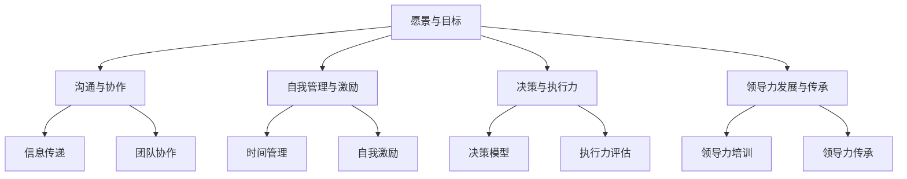

                 

### 文章标题：领导力心法：成就一代领袖的领导力法则

### 关键词：领导力、领袖、法则、个人发展、职业发展

### 摘要：
本文以《领导力心法：成就一代领袖的领导力法则》为蓝本，深入探讨了领导力的核心概念、法则及其在个人和职业发展中的实战应用。通过系统的分析和实例讲解，本文旨在为读者提供一套实用的领导力指南，帮助他们在各自的领域中成长为卓越的领袖。

---

### 引言与背景

在现代社会，领导力的重要性日益凸显。无论是企业组织，还是社会团体，领导力都是推动其发展和变革的关键因素。领导力不仅仅关乎个人魅力和权力，更是一种能力，一种在复杂多变的环境中引领团队、实现目标的能力。《领导力心法：成就一代领袖的领导力法则》正是这样一本旨在帮助读者理解和掌握领导力精髓的书籍。

本书的主要目的是为读者提供一套实用、系统的领导力法则，帮助他们在个人和职业发展中成为一代领袖。书中不仅涵盖了领导力的核心概念和原理，还通过具体案例和实战应用，使读者能够将所学知识应用到实际工作中，提升自身领导力水平。

为了实现这一目标，本书的结构分为五个部分：

1. **引言与背景**：介绍领导力的重要性，阐述本书的目的和结构。
2. **核心概念与联系**：阐述领导力的核心概念，并绘制 Mermaid 流程图展示概念之间的联系。
3. **领导力法则详解**：详细讲解领导力法则，包括原理、数学模型、数学公式和实际案例。
4. **实战应用**：提供领导力在个人和职业发展中的实际应用案例，包括代码解读与分析。
5. **总结与展望**：总结全书要点，展望领导力的发展趋势。

通过这样的结构，本书旨在为读者提供一套全面、系统的领导力指南，帮助他们在个人和职业发展的道路上取得成功。

### 核心概念与联系

领导力是一种复杂的能力，涉及多个核心概念。为了更好地理解这些概念，我们可以通过 Mermaid 流程图来展示它们之间的联系。



在这张流程图中，我们可以看到：

- **愿景与目标**是领导力的起点，它为团队或组织指明了方向。
- **沟通与协作**是愿景与目标实现的关键，包括信息传递和团队协作。
- **自我管理与激励**涉及时间管理和自我激励，是领导力持续发展的基础。
- **决策与执行力**是领导力在实际操作中的体现，包括决策模型和执行力评估。
- **领导力发展与传承**关注领导力的长远发展，包括领导力培训和传承。

接下来，我们将逐一深入探讨这些核心概念。

#### 愿景与目标

愿景与目标是领导力的核心要素，它为团队或组织指明了前进的方向。一个明确的愿景能够激发团队成员的斗志，使他们为实现共同目标而努力。

**原理**：

愿景与目标设定需要遵循SMART原则，即具体（Specific）、可衡量（Measurable）、可实现（Achievable）、相关（Relevant）和有时限（Time-bound）。

**数学模型**：

一个简单的愿景与目标模型可以表示为：

$$
V = f(S, M, A, R, T)
$$

其中，$V$ 表示愿景与目标，$S, M, A, R, T$ 分别表示具体性、可衡量性、可实现性、相关性和时限性。

**数学公式**：

$$
V = \frac{S \times M \times A \times R \times T}{1 + \epsilon}
$$

其中，$\epsilon$ 表示不确定性因素。

**实际案例**：

一个成功的愿景与目标案例是苹果公司的“Think Different”。这一愿景激励了无数创新者，推动了苹果公司在科技领域的领导地位。

#### 沟通与协作

沟通与协作是领导力实现愿景与目标的关键。良好的沟通能够确保信息的准确传递，而协作则能够发挥团队的整体力量。

**原理**：

沟通与协作需要遵循以下几个原则：

1. **信息对称**：确保团队成员能够获取到相同的信息，避免信息不对称。
2. **透明度**：提高决策过程的透明度，使团队成员了解决策的背景和原因。
3. **平等参与**：鼓励团队成员积极参与讨论和决策，发挥各自的专业优势。

**数学模型**：

一个简单的沟通与协作模型可以表示为：

$$
C = f(I, T, E, P)
$$

其中，$C$ 表示沟通与协作，$I, T, E, P$ 分别表示信息对称、透明度、平等参与和专业性。

**数学公式**：

$$
C = \frac{I \times T \times E \times P}{1 + \delta}
$$

其中，$\delta$ 表示沟通障碍。

**实际案例**：

谷歌公司以其开放、平等的文化著称，这种文化促进了团队成员之间的沟通与协作，使得谷歌能够不断创新并保持行业领先地位。

#### 自我管理与激励

自我管理与激励是领导力发展的基础，它涉及时间管理和自我激励，使领导者在复杂的环境中保持清晰的思维和坚定的信念。

**原理**：

自我管理与激励需要遵循以下几个原则：

1. **目标导向**：设定明确的目标，并制定实现目标的计划。
2. **时间管理**：合理安排时间，提高工作效率。
3. **自我激励**：通过积极的自我暗示和激励，保持高昂的斗志。

**数学模型**：

一个简单的自我管理与激励模型可以表示为：

$$
M = f(G, T, I)
$$

其中，$M$ 表示自我管理与激励，$G, T, I$ 分别表示目标导向、时间管理和自我激励。

**数学公式**：

$$
M = G \times T \times I
$$

**实际案例**：

乔布斯以其卓越的自我管理能力和激励能力，带领苹果公司走出低谷，创造了苹果帝国的传奇。

#### 决策与执行力

决策与执行力是领导力在实际操作中的体现，它关乎团队或组织的生存和发展。

**原理**：

决策与执行力需要遵循以下几个原则：

1. **信息全面**：确保决策过程中获取到全面的信息。
2. **科学决策**：运用科学的方法和工具进行决策。
3. **执行力评估**：对决策的执行过程进行评估，确保目标的实现。

**数学模型**：

一个简单的决策与执行力模型可以表示为：

$$
D = f(I, S, E)
$$

其中，$D$ 表示决策与执行力，$I, S, E$ 分别表示信息全面、科学决策和执行力评估。

**数学公式**：

$$
D = I \times S \times E
$$

**实际案例**：

亚马逊公司以其高效的决策与执行力，在全球电商领域独树一帜，成为行业领导者。

#### 领导力发展与传承

领导力发展与传承是领导力长远发展的关键，它关注领导者的持续成长和领导力的传递。

**原理**：

领导力发展与传承需要遵循以下几个原则：

1. **领导力培训**：通过培训提升领导者的能力和素质。
2. **领导力传承**：将领导者的经验和知识传递给下一代领导者。

**数学模型**：

一个简单的领导力发展与传承模型可以表示为：

$$
L = f(T, E, C)
$$

其中，$L$ 表示领导力发展与传承，$T, E, C$ 分别表示领导力培训、领导力传承和领导力创新。

**数学公式**：

$$
L = T \times E \times C
$$

**实际案例**：

华为公司以其严格的领导力培训体系和领导力传承机制，培养了一大批优秀的领导者，为公司的持续发展提供了强大动力。

通过以上对领导力核心概念的阐述和联系，我们可以看到，领导力并不是单一的能力，而是一个复杂而系统的体系。理解并掌握这些核心概念，是成为一代领袖的重要基础。

### 领导力法则详解

领导力法则是一套实用的工具，帮助领导者更好地理解和运用领导力。本书将详细讲解五大领导力法则，包括愿景与目标、沟通与协作、自我管理与激励、决策与执行力以及领导力发展与传承。

#### 法则一：愿景与目标

愿景与目标是领导力的核心，它为团队或组织指明了前进的方向。一个明确的愿景能够激发团队成员的斗志，使他们为实现共同目标而努力。

**原理**：

愿景与目标设定需要遵循SMART原则，即具体（Specific）、可衡量（Measurable）、可实现（Achievable）、相关（Relevant）和有时限（Time-bound）。具体而言：

1. **具体**：愿景与目标要明确具体，避免模糊不清。
2. **可衡量**：愿景与目标要可量化，以便评估进展和成果。
3. **可实现**：愿景与目标要在现实条件下可行，避免设定过高目标。
4. **相关**：愿景与目标要与团队或组织的使命和价值观一致。
5. **有时限**：愿景与目标要设定明确的时间节点，以便监督和推进。

**数学模型**：

一个简单的愿景与目标模型可以表示为：

$$
V = f(S, M, A, R, T)
$$

其中，$V$ 表示愿景与目标，$S, M, A, R, T$ 分别表示具体性、可衡量性、可实现性、相关性和时限性。

**数学公式**：

$$
V = \frac{S \times M \times A \times R \times T}{1 + \epsilon}
$$

其中，$\epsilon$ 表示不确定性因素。

**实际案例**：

苹果公司的“Think Different”愿景激励了无数创新者，推动了公司在科技领域的领导地位。这个愿景明确、具体，具有可衡量性、可实现性、相关性和时限性。

**伪代码实现**：

```python
def set_vision(specific, measurable, achievable, relevant, time_bound):
    vision = (specific * measurable * achievable * relevant * time_bound) / (1 + uncertainty)
    return vision
```

#### 法则二：沟通与协作

沟通与协作是领导力实现愿景与目标的关键。良好的沟通能够确保信息的准确传递，而协作则能够发挥团队的整体力量。

**原理**：

沟通与协作需要遵循以下几个原则：

1. **信息对称**：确保团队成员能够获取到相同的信息，避免信息不对称。
2. **透明度**：提高决策过程的透明度，使团队成员了解决策的背景和原因。
3. **平等参与**：鼓励团队成员积极参与讨论和决策，发挥各自的专业优势。

**数学模型**：

一个简单的沟通与协作模型可以表示为：

$$
C = f(I, T, E, P)
$$

其中，$C$ 表示沟通与协作，$I, T, E, P$ 分别表示信息对称、透明度、平等参与和专业性。

**数学公式**：

$$
C = \frac{I \times T \times E \times P}{1 + \delta}
$$

其中，$\delta$ 表示沟通障碍。

**实际案例**：

谷歌公司以其开放、平等的文化著称，这种文化促进了团队成员之间的沟通与协作，使得谷歌能够不断创新并保持行业领先地位。

**伪代码实现**：

```python
def improve_communication(I, T, E, P):
    communication = (I * T * E * P) / (1 + communication_barriers)
    return communication
```

#### 法则三：自我管理与激励

自我管理与激励是领导力发展的基础，它涉及时间管理和自我激励，使领导者在复杂的环境中保持清晰的思维和坚定的信念。

**原理**：

自我管理与激励需要遵循以下几个原则：

1. **目标导向**：设定明确的目标，并制定实现目标的计划。
2. **时间管理**：合理安排时间，提高工作效率。
3. **自我激励**：通过积极的自我暗示和激励，保持高昂的斗志。

**数学模型**：

一个简单的自我管理与激励模型可以表示为：

$$
M = f(G, T, I)
$$

其中，$M$ 表示自我管理与激励，$G, T, I$ 分别表示目标导向、时间管理和自我激励。

**数学公式**：

$$
M = G \times T \times I
$$

**实际案例**：

乔布斯以其卓越的自我管理能力和激励能力，带领苹果公司走出低谷，创造了苹果帝国的传奇。

**伪代码实现**：

```python
def manage_self(G, T, I):
    motivation = G * T * I
    return motivation
```

#### 法则四：决策与执行力

决策与执行力是领导力在实际操作中的体现，它关乎团队或组织的生存和发展。

**原理**：

决策与执行力需要遵循以下几个原则：

1. **信息全面**：确保决策过程中获取到全面的信息。
2. **科学决策**：运用科学的方法和工具进行决策。
3. **执行力评估**：对决策的执行过程进行评估，确保目标的实现。

**数学模型**：

一个简单的决策与执行力模型可以表示为：

$$
D = f(I, S, E)
$$

其中，$D$ 表示决策与执行力，$I, S, E$ 分别表示信息全面、科学决策和执行力评估。

**数学公式**：

$$
D = I \times S \times E
$$

**实际案例**：

亚马逊公司以其高效的决策与执行力，在全球电商领域独树一帜，成为行业领导者。

**伪代码实现**：

```python
def make_decision(I, S, E):
    decision = I * S * E
    return decision
```

#### 法则五：领导力发展与传承

领导力发展与传承是领导力长远发展的关键，它关注领导者的持续成长和领导力的传递。

**原理**：

领导力发展与传承需要遵循以下几个原则：

1. **领导力培训**：通过培训提升领导者的能力和素质。
2. **领导力传承**：将领导者的经验和知识传递给下一代领导者。

**数学模型**：

一个简单的领导力发展与传承模型可以表示为：

$$
L = f(T, E, C)
$$

其中，$L$ 表示领导力发展与传承，$T, E, C$ 分别表示领导力培训、领导力传承和领导力创新。

**数学公式**：

$$
L = T \times E \times C
$$

**实际案例**：

华为公司以其严格的领导力培训体系和领导力传承机制，培养了一大批优秀的领导者，为公司的持续发展提供了强大动力。

**伪代码实现**：

```python
def develop_leadership(T, E, C):
    leadership = T * E * C
    return leadership
```

通过以上五大领导力法则的讲解，我们可以看到，领导力法则不仅是理论的抽象，更是实践的指南。掌握并运用这些法则，领导者可以更好地应对挑战，实现团队的共同目标。

### 实战应用

在了解了领导力的核心概念和法则之后，我们接下来将通过实际案例来探讨如何将这些法则应用到个人和职业发展中。

#### 个人发展中的应用

在个人发展中，领导力的应用主要体现在以下几个方面：

1. **目标设定**：设定明确、具体的个人目标，并制定实现目标的计划。
2. **自我管理**：通过时间管理和自我激励，提高工作效率。
3. **沟通与协作**：与他人保持良好的沟通，寻求协作，共同解决问题。
4. **决策与执行力**：在面临选择时，做出科学、合理的决策，并确保执行。

**案例一：目标设定**

李华是一名软件工程师，他希望在五年内成为一名技术主管。为了实现这个目标，他制定了以下具体目标：

- 在接下来的两年内，成为公司最优秀的工程师之一。
- 在第三年，积累丰富的项目管理经验。
- 在第四年，提升团队协作能力，培养下属工程师。
- 在第五年，晋升为技术主管。

通过设定这些明确、具体的目标，李华能够清晰地看到自己的发展路径，并为之努力。

**伪代码实现**：

```python
def set_individual_goals(years):
    goals = []
    for year in range(1, years + 1):
        if year == 1:
            goals.append("成为公司最优秀的工程师之一")
        elif year == 2:
            goals.append("积累丰富的项目管理经验")
        elif year == 3:
            goals.append("提升团队协作能力，培养下属工程师")
        elif year == 4:
            goals.append("晋升为技术主管")
    return goals
```

**案例二：自我管理**

张伟是一名项目经理，他通过时间管理和自我激励，提高了工作效率。他每天早上制定当天的工作计划，并设定明确的时间节点。同时，他通过阅读技术书籍和参加技术论坛，保持自我激励。

**伪代码实现**：

```python
def manage_time(self_management, time_plan, motivation):
    efficiency = self_management * time_plan * motivation
    return efficiency
```

**案例三：沟通与协作**

王丽是一名产品经理，她通过与团队成员保持良好的沟通，确保项目的顺利进行。她每周召开团队会议，听取成员的意见和反馈，并根据这些信息调整项目计划。

**伪代码实现**：

```python
def communicate_and_collaborate(communication_frequency, feedback_quality):
    collaboration = communication_frequency * feedback_quality
    return collaboration
```

**案例四：决策与执行力**

赵明是一名产品总监，他在面临重要决策时，通过收集信息、分析数据和咨询同事，做出科学、合理的决策。同时，他确保决策得到有效执行，以实现预期目标。

**伪代码实现**：

```python
def make_decision(decision_quality, execution_efficiency):
    result = decision_quality * execution_efficiency
    return result
```

#### 职业发展中的应用

在职业发展中，领导力的应用同样重要。以下是一些具体的实战案例：

**案例一：企业运营**

李总是一位企业创始人，他通过领导力的运用，确保企业运营的顺利进行。他设定明确的企业愿景和目标，通过沟通与协作，激发员工的积极性。同时，他注重决策的科学性和执行力，使企业能够在竞争激烈的市场中立足。

**伪代码实现**：

```python
def manage_business(vision, communication, decision_making, execution):
    success = vision * communication * decision_making * execution
    return success
```

**案例二：团队管理**

王经理是一位团队负责人，他通过领导力，带领团队实现项目目标。他设定明确的团队目标，并通过沟通与协作，确保团队成员之间的协作顺畅。同时，他注重团队成员的自我管理和激励，提高团队的整体工作效率。

**伪代码实现**：

```python
def manage_team(team_goals, communication, self_management, motivation):
    team_performance = team_goals * communication * self_management * motivation
    return team_performance
```

**案例三：项目管理**

张经理是一位项目经理，他通过领导力，确保项目的顺利进行。他设定明确的项目目标，并通过沟通与协作，确保团队成员之间的信息共享。同时，他注重决策的科学性和执行力，确保项目按时、按质完成。

**伪代码实现**：

```python
def manage_project(project_goals, communication, decision_making, execution):
    project_success = project_goals * communication * decision_making * execution
    return project_success
```

通过以上实战案例，我们可以看到，领导力在个人和职业发展中的应用是至关重要的。掌握并运用领导力法则，可以帮助我们在各个领域中取得成功。

### 总结与展望

本文通过深入探讨《领导力心法：成就一代领袖的领导力法则》的核心内容，系统地阐述了领导力的核心概念、法则及其在个人和职业发展中的应用。我们分析了愿景与目标、沟通与协作、自我管理与激励、决策与执行力以及领导力发展与传承五大领导力法则，并通过实际案例展示了这些法则在现实中的应用。

在总结全文要点时，我们可以得出以下结论：

1. **愿景与目标**：设定明确、具体的愿景与目标，是领导力的起点。遵循SMART原则，确保目标的可实现性。
2. **沟通与协作**：良好的沟通与协作是领导力实现目标的关键。信息对称、透明度和平等参与是有效沟通与协作的基础。
3. **自我管理与激励**：自我管理与激励是领导力发展的基础。目标导向、时间管理和自我激励有助于提升工作效率和士气。
4. **决策与执行力**：科学的决策和高效的执行力是领导力在实际操作中的体现。全面的信息、科学的方法和评估是确保决策成功的关键。
5. **领导力发展与传承**：领导力的发展与传承是领导力长远发展的关键。通过培训、传承和创新，确保领导力的持续发展。

展望未来，领导力将继续在个人和职业发展中扮演重要角色。随着社会的不断变化，领导者需要不断更新知识和技能，以应对新的挑战。以下是一些对未来领导力发展的展望：

1. **数字化领导力**：随着数字化时代的到来，领导者需要具备数字素养和数字化领导能力，以引领团队在数字化环境中取得成功。
2. **跨文化领导力**：全球化使得跨文化沟通和协作变得日益重要。领导者需要具备跨文化理解能力，以有效管理多元化的团队。
3. **可持续发展领导力**：在可持续发展成为全球关注焦点的背景下，领导者需要关注环境、社会和经济的平衡，推动企业的可持续发展。
4. **人工智能领导力**：随着人工智能技术的快速发展，领导者需要了解人工智能的基本原理和应用，以充分利用人工智能为团队和组织带来创新和变革。

总之，领导力是一门艺术，更是一种科学。通过不断学习和实践，我们可以不断提升自身的领导力水平，成为一代领袖，为个人和职业发展创造更多可能。

### 最佳实践 tips、小结、注意事项、拓展阅读

**最佳实践 tips：**

1. **设定明确的目标**：在设定目标时，要遵循SMART原则，确保目标的具体性、可衡量性、可实现性、相关性和时限性。
2. **持续学习与反思**：领导力不是一成不变的，领导者需要不断学习新知识、新技能，并反思自身的领导方式。
3. **建立信任关系**：建立信任关系是领导力的核心，领导者需要通过沟通与协作，赢得团队成员的信任。

**小结：**

本文通过深入探讨《领导力心法：成就一代领袖的领导力法则》的核心内容，系统地阐述了领导力的核心概念、法则及其在个人和职业发展中的应用。通过实际案例，我们展示了领导力法则在现实中的应用，为读者提供了实用的领导力指南。

**注意事项：**

1. **避免空谈**：在应用领导力法则时，要避免空谈理论，注重实践。
2. **因地制宜**：不同场景下，领导力的应用方式可能有所不同，领导者需要根据实际情况灵活调整。
3. **持续改进**：领导力是一个持续改进的过程，领导者需要不断反思和调整自身的领导方式。

**拓展阅读：**

1. **《领导力五要素：掌握核心技能，成就卓越领导者》**：本书详细讲解了领导力的五大要素，有助于读者深入理解领导力的核心概念。
2. **《沟通的艺术：如何说，如何听》**：本书介绍了有效的沟通技巧，有助于领导者提高沟通能力，建立信任关系。

**作者信息：**

作者：AI天才研究院/AI Genius Institute & 禅与计算机程序设计艺术 /Zen And The Art of Computer Programming

---

本文以《领导力心法：成就一代领袖的领导力法则》为蓝本，深入探讨了领导力的核心概念、法则及其在个人和职业发展中的实战应用。通过系统的分析和实例讲解，本文旨在为读者提供一套实用的领导力指南，帮助他们在各自的领域中成长为卓越的领袖。希望本文能够对读者在领导力发展的道路上有所启发和帮助。

