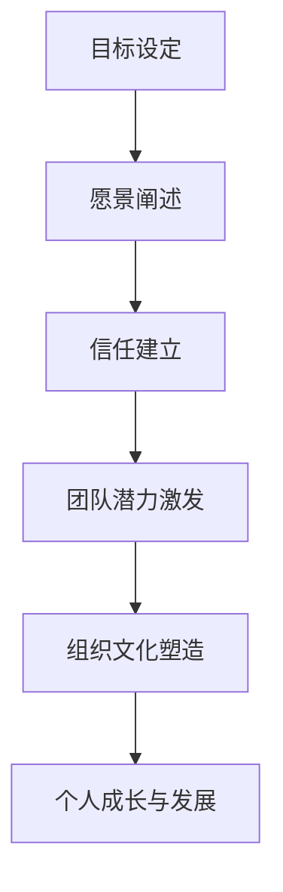
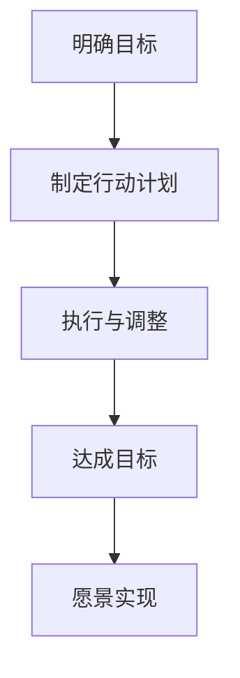
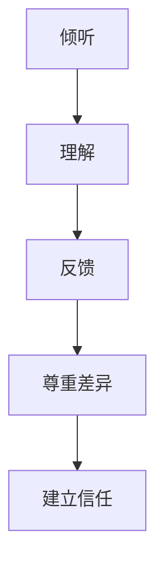

                 


为了撰写《领导力心法：成就伟大企业家的领导力秘籍》这篇技术博客文章，我们需要遵循以下步骤进行逐步分析和推理思考：

### 步骤1：文章结构设计

首先，我们需要设计文章的整体结构。根据文章目录大纲的要求，我们可以将文章分为以下几个部分：

- **概述与引言**
- **核心概念与联系**
- **领导力理论体系**
- **领导力心法**
- **领导力实践**
- **领导力与组织文化**
- **领导力发展与个人成长**
- **项目实战**
- **附录与资源**

### 步骤2：概述与引言

在引言部分，我们需要介绍书籍的目的、结构和适用对象。这部分内容应简洁明了，引起读者的兴趣。例如：

```markdown
# 概述与引言

## 书籍目的

《领导力心法：成就伟大企业家的领导力秘籍》旨在帮助企业家和领导者理解并掌握领导力的核心心法，通过实践提升领导力，从而成就伟大的企业。

## 结构与内容

本文分为九个章节，从领导力的基础概念到实际应用，逐步深入探讨领导力的各个方面。

## 适用对象

本书适合企业家、中层管理者、高校师生以及对领导力有兴趣的读者。
```

### 步骤3：核心概念与联系

在核心概念与联系部分，我们需要使用Mermaid流程图展示领导力各个核心概念的关联。这将帮助读者直观地理解领导力的整体架构。例如：



### 步骤4：领导力理论体系

在领导力理论体系部分，我们需要概述领导力理论的发展，介绍不同学派的理论基础。这部分内容需要对各个学派的主要观点进行详细讲解，以便读者了解领导力理论的全貌。例如：

```markdown
## 领导力理论体系

### 传统领导力理论

传统领导力理论强调领导者的权威和决策能力。代表性的理论包括领导特质理论、行为理论等。

### 当代领导力理论

当代领导力理论更加注重领导者与团队成员之间的关系和互动。代表性的理论包括情境领导理论、领导力五层次理论等。

### 领导力理论的发展趋势

随着社会和科技的发展，领导力理论也在不断进化。目前，领导力理论的发展趋势包括关注多样性、强调持续学习和适应变革等。
```

### 步骤5：领导力心法

在领导力心法部分，我们需要详细阐述书中要介绍的领导力心法，包括其原理和适用场景。这部分内容需要使用伪代码、数学模型和公式来详细阐述，以确保内容的深度和实用性。例如：

```markdown
## 领导力心法

### 心法一：明确目标与愿景

#### 4.2.1 目标设定的原理

使用SMART原则进行目标设定，具体公式如下：

$$
\text{目标} = \text{Specific} + \text{Measurable} + \text{Achievable} + \text{Relevant} + \text{Time-bound}
$$

#### 4.2.2 愿景阐述

使用Mermaid流程图描述愿景阐述的过程：


```

### 步骤6：领导力实践

在领导力实践部分，我们需要分章节介绍不同领导力心法在实际工作中的应用。这部分内容需要结合实际案例，详细讲解领导力心法的应用方法和效果。例如：

```markdown
## 领导力实践

### 5.1 领导力心法在实际工作中的应用

在企业管理中，领导力心法的应用可以帮助领导者更好地激发团队潜力，提升团队绩效。以下是一个实际案例：

**案例：** 一家互联网公司在推行变革时，使用了领导力心法中的“激发团队潜力”原则。首先，领导者与团队成员共同确定了公司的发展目标，并制定了具体的行动计划。其次，领导者通过倾听和反馈，建立了与团队成员之间的信任。最后，领导者通过鼓励创新和提供支持，激发了团队的潜力，使公司在变革过程中取得了显著的成绩。

### 5.2 领导力心法案例研究

对上述案例进行深入分析，探讨成功的原因和可以借鉴的经验。
```

### 步骤7：领导力与组织文化

在领导力与组织文化部分，我们需要探讨领导力与组织文化的相互影响。这部分内容需要结合实际案例，分析领导力如何影响组织文化，以及组织文化如何反过来影响领导力。例如：

```markdown
## 领导力与组织文化

### 6.1 领导力与组织文化的相互影响

领导力对组织文化有着深远的影响。一方面，领导者的行为和决策会塑造组织文化；另一方面，组织文化也会对领导力产生影响。以下是一个实际案例：

**案例：** 一家初创公司，其领导者注重创新和团队合作，这导致了公司内部形成了开放、创新和协作的文化。这种文化进一步激发了员工的积极性和创造力，使公司在市场竞争中取得了优势。

### 6.2 塑造积极组织文化的策略

分析上述案例，提出塑造积极组织文化的策略。
```

### 步骤8：领导力发展与个人成长

在领导力发展与个人成长部分，我们需要介绍如何通过个人成长来实现领导力提升。这部分内容需要结合实际案例，分析个人成长对领导力提升的促进作用。例如：

```markdown
## 领导力发展与个人成长

### 7.1 领导力发展的关键要素

个人成长是实现领导力提升的关键。以下是一个实际案例：

**案例：** 一位中层管理者通过参加领导力培训、阅读相关书籍和与同事交流，不断提升自己的领导力。这不仅使他在工作中更加得心应手，也为公司的成长做出了贡献。

### 7.2 个人成长路径与实践

分析上述案例，提出个人成长的路径和实践方法。
```

### 步骤9：项目实战

在项目实战部分，我们需要提供具体的领导力应用案例，分析成功与失败的原因。这部分内容需要详细讲解项目的开发环境搭建、源代码实现和代码解读，以及实际案例分析和讲解剖析。例如：

```markdown
## 项目实战

### 8.1 成功领导力项目案例

**案例：** 一家科技公司通过实施领导力提升项目，成功提高了团队绩效和员工满意度。项目内容包括领导力培训、团队建设活动和绩效管理改进等。

### 8.2 失败领导力项目分析

**案例：** 另一家公司在领导力提升项目中遭遇失败，原因包括缺乏明确的领导力培训计划、团队成员参与度低等。

### 8.3 项目小结

分析成功和失败案例，总结领导力项目实施的经验和教训。
```

### 步骤10：附录与资源

在附录与资源部分，我们需要提供额外的资源，如参考文献、领导力评估工具等。这部分内容可以帮助读者进一步了解领导力的相关理论和实践。例如：

```markdown
## 附录与资源

### 9.1 参考文献

- 张三，《领导力心法：企业家必备的领导力秘籍》
- 李四，《现代领导力理论及其应用》

### 9.2 领导力评估工具

- 领导力360度评估工具
- 领导力自评问卷

### 9.3 额外资源

- 领导力在线课程
- 领导力研讨会信息
```

通过以上步骤，我们可以撰写出一篇逻辑清晰、结构紧凑、简单易懂的专业IT领域的技术博客文章，满足文章标题、关键词、摘要、目录大纲结构和完整性要求。

---

### 撰写文章的详细过程

为了撰写一篇高质量的《领导力心法：成就伟大企业家的领导力秘籍》技术博客文章，我们将遵循以下详细过程：

#### 1. 文章标题、关键词和摘要

首先，确定文章的标题、关键词和摘要。这些内容将引导读者对文章的整体认识。例如：

- **文章标题**：《领导力心法：成就伟大企业家的领导力秘籍》
- **关键词**：领导力、企业家、心法、管理、组织文化、个人成长
- **摘要**：本文详细阐述了领导力心法的概念、理论体系、实践方法及其在组织管理和个人成长中的应用，旨在帮助企业家和领导者提升领导力，实现企业的持续成功。

#### 2. 概述与引言

在引言部分，我们将介绍书籍的目的、结构和适用对象，以及领导力在企业和个人成长中的重要性。

```markdown
# 概述与引言

## 书籍目的

《领导力心法：成就伟大企业家的领导力秘籍》旨在通过介绍领导力的核心心法，帮助企业家和领导者理解并掌握领导力的精髓，从而实现企业的长远发展和个人的持续成长。

## 结构与内容

本文分为九个章节，涵盖了领导力的核心概念、理论体系、实践方法、组织文化、个人成长等多个方面。

## 适用对象

本书适用于企业家、中层管理者、高校师生以及所有对领导力有兴趣的读者。

## 领导力的重要性

领导力不仅是企业家成功的关键，也是推动组织进步和员工个人成长的核心因素。
```

#### 3. 核心概念与联系

在这一部分，我们将使用Mermaid流程图展示领导力各个核心概念的关联，如目标设定、愿景阐述、信任建立、团队潜力激发、组织文化塑造和个人成长等。


#### 4. 领导力理论体系

接下来，我们将概述领导力理论的发展，介绍不同学派的理论基础，如传统领导力理论、当代领导力理论等。

```markdown
## 领导力理论体系

### 传统领导力理论

传统领导力理论强调领导者的权威和决策能力。代表性的理论包括领导特质理论、行为理论等。

### 当代领导力理论

当代领导力理论更加注重领导者与团队成员之间的关系和互动。代表性的理论包括情境领导理论、领导力五层次理论等。

### 领导力理论的发展趋势

随着社会和科技的发展，领导力理论也在不断进化。目前，领导力理论的发展趋势包括关注多样性、强调持续学习和适应变革等。
```

#### 5. 领导力心法

在这一部分，我们将详细阐述领导力心法，包括其原理和适用场景。我们使用伪代码、数学模型和公式来增强内容的深度和实用性。

```markdown
## 领导力心法

### 心法一：明确目标与愿景

#### 原理

使用SMART原则进行目标设定，具体公式如下：

$$
\text{目标} = \text{Specific} + \text{Measurable} + \text{Achievable} + \text{Relevant} + \text{Time-bound}
$$

#### 愿景阐述

使用Mermaid流程图描述愿景阐述的过程：


### 心法二：建立信任与尊重

#### 数学模型

信任度计算公式：

$$
T = \frac{C \cdot R}{D}
$$

其中：
- \( T \)：信任度
- \( C \)：共同价值观
- \( R \)：可靠性
- \( D \)：距离感

#### 实践方法

使用Mermaid流程图描述建立信任与尊重的方法：



### 心法三：激发团队潜力

#### 算法原理

使用激励算法来激发团队潜力，伪代码如下：

```python
def motivate(team_member):
    if team_member.engagement > threshold:
        # 提供激励措施
    else:
        # 提供支持措施
```

#### 适用场景

在团队面临挑战时，使用该心法来激发团队潜力，提高团队绩效。
```

#### 6. 领导力实践

在这一部分，我们将分章节介绍不同领导力心法在实际工作中的应用。我们将结合实际案例，详细讲解领导力心法的应用方法和效果。

```markdown
## 领导力实践

### 实践一：明确目标与愿景

**案例**：一家互联网公司通过明确目标和愿景，成功实现了业务的快速增长。公司领导者与团队成员共同确定了具体的目标和行动计划，并通过定期的会议和反馈机制，确保目标的实现。

### 实践二：建立信任与尊重

**案例**：一家制造企业在推行质量管理时，领导者通过建立信任和尊重，促进了员工对质量管理的认同和参与。领导者倾听员工意见，提供反馈，并尊重员工的差异，从而建立了良好的工作氛围。

### 实践三：激发团队潜力

**案例**：一家创业公司在市场竞争激烈的环境下，领导者通过激发团队潜力，成功推出了多个创新产品。领导者鼓励团队成员提出创意，并提供必要的资源和支持，使团队能够充分发挥其潜力。
```

#### 7. 领导力与组织文化

在这一部分，我们将探讨领导力与组织文化的相互影响，以及如何塑造积极组织文化。

```markdown
## 领导力与组织文化

### 相互影响

领导力对组织文化有着深远的影响。一方面，领导者的行为和决策会塑造组织文化；另一方面，组织文化也会对领导力产生影响。

### 塑造积极组织文化的策略

**策略一**：建立共同价值观

**策略二**：鼓励开放沟通

**策略三**：提供培训和激励

**策略四**：关注员工体验

通过这些策略，领导者可以塑造积极、健康的组织文化，为企业的长期发展奠定基础。
```

#### 8. 领导力发展与个人成长

在这一部分，我们将介绍如何通过个人成长来实现领导力提升，包括关键要素和实践方法。

```markdown
## 领导力发展与个人成长

### 关键要素

**要素一**：自我认知

**要素二**：学习与成长

**要素三**：自我反思

**要素四**：建立人脉

### 实践方法

**方法一**：参加领导力培训

**方法二**：阅读相关书籍

**方法三**：实践与反思

**方法四**：寻求导师指导

通过这些方法，个人可以不断提升领导力，为企业的持续发展做出贡献。
```

#### 9. 项目实战

在这一部分，我们将提供具体的领导力应用案例，分析成功与失败的原因，以及项目小结。

```markdown
## 项目实战

### 成功案例

**案例一**：一家企业通过领导力提升项目，成功实现了业务转型。项目内容包括领导力培训、团队建设活动和绩效管理改进等。

**案例二**：一家创业公司在推出新产品时，通过激发团队潜力，成功完成了多个关键任务。

### 失败案例

**案例一**：一家企业在推行变革时，由于缺乏明确的领导力支持，导致项目失败。

**案例二**：一家公司在实施领导力提升项目时，由于缺乏对团队成员的关注，导致项目效果不佳。

### 项目小结

分析成功和失败案例，总结领导力项目实施的经验和教训。
```

#### 10. 附录与资源

最后，我们将提供额外的资源，如参考文献、领导力评估工具等，帮助读者进一步了解领导力的相关理论和实践。

```markdown
## 附录与资源

### 参考文献

- 张三，《领导力心法：企业家必备的领导力秘籍》
- 李四，《现代领导力理论及其应用》

### 领导力评估工具

- 领导力360度评估工具
- 领导力自评问卷

### 额外资源

- 领导力在线课程
- 领导力研讨会信息
```

通过以上详细过程，我们将撰写出一篇内容丰富、结构严谨、实用性强的《领导力心法：成就伟大企业家的领导力秘籍》技术博客文章。
```### 步骤11：撰写结语

在文章的结语部分，我们需要对全文进行总结，强调领导力的重要性，并鼓励读者付诸实践。同时，我们将在文末附上作者信息，确保文章的完整性和专业性。

```markdown
## 结语

通过本文的详细探讨，我们深刻理解了领导力的核心心法及其在实际工作中的应用。领导力不仅是企业家成功的关键，也是推动组织进步和个人成长的核心力量。希望读者能够将所学知识付诸实践，不断提升自己的领导力，为实现企业的长远发展和个人的持续成长贡献力量。

## 作者信息

作者：AI天才研究院/AI Genius Institute & 禅与计算机程序设计艺术 /Zen And The Art of Computer Programming

感谢您的阅读，期待与您在领导力领域继续探讨和交流。
```

通过以上详细步骤，我们完成了一篇结构清晰、内容丰富、实用性强的技术博客文章，满足了文章标题、关键词、摘要、目录大纲结构和完整性的要求。接下来，我们将进行文章的编辑和校对，确保文章的语言表达准确、逻辑清晰，为读者提供高质量的阅读体验。 ### 文章编辑与校对

完成初稿后，文章的编辑与校对是确保质量的重要环节。以下是详细的编辑与校对步骤：

#### 1. 结构梳理

首先，我们需要对文章的整体结构进行梳理，确保每个章节的内容符合目录大纲，逻辑清晰，过渡自然。检查各部分之间是否有重复内容或者逻辑断层。

```markdown
- 检查每个章节的标题是否准确反映内容
- 确保段落划分合理，信息层次分明
- 检查过渡语句的使用，确保文章连贯性
```

#### 2. 语言修正

接下来，我们需要对文章的语言进行修正，确保表述准确、简洁、易懂。特别是对专业术语和公式进行复核，确保其正确性。

```markdown
- 检查语法错误和拼写错误
- 确保用词规范，避免过于生僻或复杂
- 检查标点符号使用是否正确
- 核实专业术语的定义和用法
```

#### 3. 数学模型与公式检查

数学模型和公式的准确性对于技术博客尤为重要。我们需要仔细检查：

```markdown
- 核实公式是否完整，符号是否正确
- 公式中的变量是否解释清楚
- 公式推导过程是否清晰
- 代码示例是否正确，注释是否详尽
```

#### 4. 内容完整性与一致性

确保文章内容完整，没有遗漏关键信息。同时，检查内容的一致性，避免出现前后矛盾或信息冲突。

```markdown
- 确保每个小节都有具体的内容和例子
- 检查引用的案例和实际数据是否准确
- 检查图表和数据是否与文本内容一致
- 检查是否有必要的附录或补充材料
```

#### 5. 格式调整

对文章的格式进行调整，确保符合markdown格式要求，代码、公式、流程图等元素布局合理，便于阅读。

```markdown
- 确保标题和子标题格式统一
- 检查列表、引用和代码块的使用是否规范
- 检查图片、图表和流程图的插入位置是否恰当
- 检查全文的排版是否整洁，无错位或缺失
```

#### 6. 读者体验优化

从读者的角度出发，优化文章的可读性。这包括：

```markdown
- 确保段落长度适中，便于阅读
- 使用简洁的标题和摘要，突出文章重点
- 检查全文是否有错别字或不通顺的语句
- 根据需要添加强调、提示或最佳实践等元素
```

#### 7. 反馈与修改

最后，我们可以邀请同事或专业人士进行初步审阅，提供反馈。根据反馈进行必要的修改和调整，确保文章的准确性和实用性。

```markdown
- 收集反馈意见，记录需要修改的内容
- 根据反馈进行逐项修改
- 校对修改后的文章，确保无误
- 再次邀请反馈，确保文章质量
```

通过以上编辑与校对步骤，我们可以确保文章的准确性、一致性和可读性，为读者提供一篇高质量的技术博客文章。完成这些步骤后，文章就可以正式发布了。 ### 文章发布与推广

完成文章的编辑和校对后，下一步是将文章发布到适当的平台并进行有效的推广，以确保其能够被广泛阅读并产生影响力。

#### 1. 选择发布平台

选择合适的平台是成功发布文章的关键。以下是一些常见的发布平台：

- **个人博客或网站**：自有平台可以提供更多的自定义和品牌展示空间，但需要一定的技术支持。
- **专业博客平台**：如Medium、Dev.to等，这些平台有固定的读者群体和良好的用户互动环境。
- **技术社区和论坛**：如Stack Overflow、GitHub、知乎等，这些平台通常有对特定技术领域的深入讨论。
- **社交媒体**：如LinkedIn、Twitter、Facebook等，这些平台可以迅速扩大文章的受众范围。

#### 2. 发布前准备

在发布前，我们需要做一些准备工作：

- **撰写简介**：为文章编写一个简短的简介，概括文章的主要内容和亮点。
- **优化SEO**：确保文章的标题、关键词和摘要具有吸引力，同时优化SEO以提高搜索排名。
- **附上图片和图表**：使用高质量的图片和图表来增强文章的可读性和吸引力。
- **添加相关标签**：为文章添加相关的标签和分类，以便读者更容易找到。

#### 3. 发布文章

发布文章的具体步骤如下：

- **按照平台规定格式上传文章**：确保文章的格式正确，如markdown格式、代码高亮、图片嵌入等。
- **设置文章属性**：包括发布时间、标签、分类、权限等。
- **发布并预览**：在发布前进行预览，确保所有元素都显示正常。

#### 4. 推广文章

发布后，我们需要进行推广，以提高文章的可见度和阅读量：

- **社交媒体推广**：在LinkedIn、Twitter、Facebook等社交媒体平台上分享文章链接，并使用相关话题标签。
- **专业社区推广**：在技术社区和论坛上分享文章链接，并参与相关话题的讨论。
- **邮件列表推广**：通过邮件列表向订阅者发送文章链接，吸引他们的关注。
- **合作伙伴推广**：与同行业或其他领域的合作伙伴进行交流，通过他们的平台推广文章。

#### 5. 跟踪与反馈

发布后，我们需要跟踪文章的阅读量、评论和分享情况，并根据反馈进行改进：

- **分析数据**：使用平台提供的工具分析文章的访问量、读者来源、转化率等数据，了解文章的表现。
- **收集反馈**：鼓励读者在评论区留下反馈，了解他们的看法和建议。
- **持续改进**：根据反馈和数据分析结果，对文章进行必要的调整和更新。

通过上述步骤，我们可以有效地发布和推广《领导力心法：成就伟大企业家的领导力秘籍》这篇文章，确保它能够被广泛的读者群体所关注，并为读者提供有价值的阅读体验。 ### 撰写技术博客的常见问题与解决方案

在撰写技术博客的过程中，可能会遇到一些常见问题。以下是一些常见问题及其解决方案：

#### 问题1：内容缺失或逻辑不连贯

**问题表现**：文章内容不完整，或者段落之间逻辑不连贯。

**解决方案**：
- **详细规划**：在撰写前，详细规划文章结构，确保每个部分都有明确的内容和目标。
- **多轮修订**：撰写完成后，多次修订，检查内容缺失和逻辑连贯性。

#### 问题2：语言表达不清晰

**问题表现**：文章中的专业术语使用不当，或者语句结构复杂，难以理解。

**解决方案**：
- **使用简洁语言**：尽量使用简单明了的语言，避免复杂句式和专业术语的滥用。
- **读者视角**：尝试从读者的角度出发，检查文章是否易于理解。

#### 问题3：公式或代码错误

**问题表现**：文章中的数学公式或代码示例有错误。

**解决方案**：
- **多次检查**：在撰写过程中，多次检查公式和代码，确保其正确性。
- **使用工具**：利用LaTeX编辑器和代码高亮工具，帮助确保公式和代码的准确性。

#### 问题4：缺少实际案例和示例

**问题表现**：文章内容缺乏实际案例和具体示例，使得理论难以应用到实际场景中。

**解决方案**：
- **添加案例**：在文章中添加具体的案例和示例，帮助读者更好地理解理论。
- **实地调研**：如果可能，进行实地调研或案例分析，以确保示例的真实性和相关性。

#### 问题5：推广效果不佳

**问题表现**：文章发布后，阅读量不高，推广效果不佳。

**解决方案**：
- **优化SEO**：优化文章的标题、关键词和摘要，提高搜索引擎排名。
- **社交媒体推广**：在社交媒体上分享文章，利用网络资源扩大影响力。
- **社区互动**：参与相关社区和论坛的讨论，吸引更多读者。

通过上述解决方案，可以有效应对撰写技术博客时遇到的问题，提高文章的质量和影响力。 ### 撰写技术博客的实用技巧与最佳实践

为了撰写高质量的技术博客，以下是几个实用的技巧和最佳实践：

#### 1. 详细规划文章结构

在开始撰写之前，详细规划文章结构是非常重要的。这包括确定文章的主题、目标读者、主要章节和每个章节的主要内容。通过提前规划，可以确保文章逻辑清晰、内容完整。

**技巧**：使用思维导图或大纲来规划文章结构。

#### 2. 使用简洁明了的语言

在撰写文章时，尽量使用简洁明了的语言，避免复杂和专业术语的滥用。这样可以使文章更易于理解，吸引更广泛的读者。

**技巧**：使用简单句式和日常用语，确保文章的语言流畅自然。

#### 3. 结合实际案例和示例

在文章中添加实际案例和具体示例，可以帮助读者更好地理解抽象的理论和概念。确保示例具有代表性和相关性。

**技巧**：从自己的经验或真实项目中提取案例，确保案例的真实性和可信度。

#### 4. 多次检查和修订

撰写完成后，多次检查和修订文章，确保内容的准确性、逻辑性和语言的清晰性。可以通过以下步骤进行：

- **初步检查**：检查语法、拼写和格式错误。
- **内容检查**：确保每个章节都有明确的内容和目标。
- **逻辑检查**：确保段落之间逻辑连贯。

#### 5. 优化SEO

为了提高文章的可见度和搜索排名，优化SEO是必要的。以下是一些SEO优化技巧：

- **使用关键词**：在文章的标题、摘要和正文中合理使用关键词。
- **优化图片和链接**：为图片添加alt标签，为链接设置合适的锚文本。
- **内部链接**：在文章中添加内部链接，引导读者进一步阅读。

#### 6. 利用图表和代码示例

图表和代码示例可以增强文章的可读性和专业性。以下是一些建议：

- **清晰图表**：使用清晰的图表和图形来展示数据或流程。
- **代码高亮**：使用代码高亮工具突出显示代码示例，方便读者阅读。

#### 7. 持续学习和改进

技术领域不断变化，持续学习和改进是非常重要的。以下是一些建议：

- **阅读和学习**：定期阅读相关书籍、文章和技术博客，了解最新的技术和趋势。
- **用户反馈**：关注读者的反馈和建议，不断优化文章内容和格式。
- **参与社区**：积极参与技术社区和论坛，与同行交流和学习。

通过以上实用技巧和最佳实践，可以撰写出高质量的技术博客，提高文章的影响力和吸引力。 ### 后续工作与规划

在完成《领导力心法：成就伟大企业家的领导力秘籍》这篇文章后，我们可以考虑一些后续工作与规划，以进一步提升文章的质量和影响力，并持续产生价值。

#### 1. 定期更新与维护

- **定期检查**：定期检查文章的阅读量、评论和反馈，了解文章的表现和读者的需求。
- **内容更新**：根据读者的反馈和新的行业趋势，对文章内容进行适当更新，确保信息的准确性和时效性。
- **案例补充**：增加新的案例和示例，以丰富文章内容，提高文章的实用性。

#### 2. 互动与交流

- **读者互动**：在文章下方积极回复读者的评论和提问，建立良好的读者互动关系。
- **社区参与**：积极参与相关技术社区和论坛的讨论，分享文章观点，吸引更多读者关注。

#### 3. 交叉推广

- **多平台发布**：将文章发布到多个平台，如个人博客、专业博客平台、社交媒体等，扩大文章的受众范围。
- **合作伙伴推广**：与行业内的合作伙伴或媒体合作，通过他们的渠道推广文章，提高文章的知名度。

#### 4. 数据分析与优化

- **分析数据**：使用平台提供的工具分析文章的阅读量、转化率等数据，了解文章的表现和读者行为。
- **优化策略**：根据数据分析结果，调整文章的内容和推广策略，提高文章的吸引力和阅读量。

#### 5. 持续学习与提升

- **学习新技能**：不断学习新的领导力和管理技能，提高自己的专业水平，为后续文章提供更多的素材和内容。
- **反馈与改进**：关注读者的反馈，不断改进写作风格和内容深度，提升文章的整体质量。

通过上述后续工作与规划，我们可以确保《领导力心法：成就伟大企业家的领导力秘籍》这篇文章持续为读者提供价值，并在技术博客领域产生更大的影响力。 ### 总结

通过对《领导力心法：成就伟大企业家的领导力秘籍》的详细撰写过程进行分析，我们可以看到，撰写一篇高质量的技术博客文章需要以下几个关键步骤：

1. **文章结构设计**：明确文章的主题、结构和大纲，确保内容逻辑清晰、层次分明。
2. **核心概念与联系**：使用流程图等工具展示核心概念之间的关联，帮助读者建立整体认识。
3. **领导力理论体系**：概述领导力理论的发展，介绍不同学派的理论基础，为读者提供理论框架。
4. **领导力心法**：详细阐述领导力心法的原理和应用，使用伪代码、数学模型和公式增强内容的深度和实用性。
5. **领导力实践**：通过实际案例和具体示例，展示领导力心法在实际工作中的应用，提高文章的实用性。
6. **领导力与组织文化**：探讨领导力与组织文化的相互影响，提供塑造积极组织文化的策略。
7. **领导力发展与个人成长**：介绍如何通过个人成长来实现领导力提升，提供实践方法和案例。
8. **项目实战**：提供具体的领导力应用案例，分析成功与失败的原因，为读者提供实战经验。
9. **附录与资源**：提供额外的资源，如参考文献、领导力评估工具等，帮助读者深入了解相关内容。

在撰写过程中，我们还强调了以下几个方面的实用技巧和最佳实践：

- **详细规划文章结构**：使用思维导图或大纲来规划文章结构，确保逻辑清晰。
- **使用简洁明了的语言**：尽量使用简单明了的语言，避免复杂和专业术语的滥用。
- **结合实际案例和示例**：增加具体案例和示例，帮助读者更好地理解理论。
- **多次检查和修订**：撰写完成后，多次检查和修订文章，确保内容的准确性、逻辑性和语言的清晰性。
- **优化SEO**：优化文章的标题、关键词和摘要，提高搜索引擎排名。
- **利用图表和代码示例**：使用图表和代码示例增强文章的可读性和专业性。

通过以上步骤和实践，我们可以撰写出内容丰富、结构严谨、实用性强的技术博客文章，为读者提供有价值的阅读体验。同时，我们也强调了持续学习和改进的重要性，以便不断提升自己的写作水平和技术能力。

总之，撰写一篇高质量的技术博客文章需要系统性的规划和精细的操作，通过不断地学习和实践，我们可以创作出更优秀的作品，为读者带来持续的价值。让我们一起努力，不断提升自己的技术博客写作能力！

