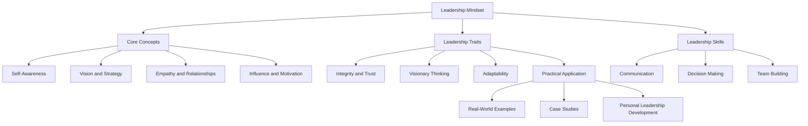

                 


### Introduction to Leadership Mindset

"Leadership Mindset: The Leader's Code for Great Companies" embarks on a journey to demystify the essence of leadership by breaking down the components that make a great leader. The book aims to provide a comprehensive guide for aspiring and current leaders, offering insights into the principles, traits, and skills that define effective leadership. 

**Background Introduction**:

Leadership has been a topic of interest for scholars, business leaders, and individuals for centuries. Historically, leadership was viewed as a position of power and control, where authority was the primary tool for influence. However, modern research and practice have shifted towards understanding leadership as a dynamic process involving relationships, influence, and motivation.

The purpose of this book is to provide a framework for understanding leadership through a mindset perspective. A leadership mindset is not just about holding a title or position; it's about cultivating a set of qualities and behaviors that drive success and create positive impacts within organizations. This mindset is crucial for leaders who aspire to build great companies and foster cultures of innovation, collaboration, and growth.

**Core Concepts and Relationships**:

To grasp the leadership mindset, it's essential to understand the core concepts and their interrelationships. The following Mermaid diagram illustrates the fundamental components of the leadership mindset and how they interact:



**Core Concepts and Theories of Leadership**:

The core concepts of the leadership mindset are rooted in established leadership theories. Understanding these theories provides a foundation for applying the mindset in practice. Here's a brief overview of the key theories:

- **Transformational Leadership**: Transformational leadership focuses on inspiring and motivating followers to achieve their full potential. It involves creating a vision, setting clear goals, and leading by example. The leader's role is to elevate the followers' level of performance through inspiration and personal development.

  ```python
  # Pseudo-code for Transformational Leadership
  def transformational Leadership():
      create Vision()
      set Clear Goals()
      lead By Example()
      inspire Followers()
      develop Followers()
  ```

- **Servant Leadership**: Servant leadership prioritizes the growth and well-being of individuals within an organization. The leader's primary goal is to serve others, helping them achieve their personal and professional goals. This approach fosters a collaborative and supportive work environment.

  ```python
  # Pseudo-code for Servant Leadership
  def servant Leadership():
      listen To Followers()
      prioritize Their Needs()
      support Their Growth()
      foster Collaboration()
  ```

- **Situational Leadership**: Situational leadership is a model that suggests different leadership styles are appropriate for different situations. The leader assesses the readiness and needs of followers to determine the most effective approach. This model emphasizes flexibility and adaptability.

  ```python
  # Pseudo-code for Situational Leadership
  def situational Leadership():
      assess Followers' Readiness()
      choose Appropriate Leadership Style()
      adapt To Changing Situations()
  ```

### The Importance of Leadership Mindset in Great Companies

The leadership mindset is a crucial element in building great companies. Leaders with a strong mindset are capable of navigating complex challenges, driving innovation, and creating a positive organizational culture. Here's why the leadership mindset is essential for great companies:

- **Driving Innovation**: Leaders with a visionary mindset can inspire their teams to innovate and think outside the box. By fostering a culture of creativity and collaboration, these leaders enable their organizations to stay ahead of the curve and maintain a competitive edge.

  ```python
  # Pseudo-code for Driving Innovation
  def drive Innovation():
      cultivate Creative Culture()
      encourage Collaboration()
      set Clear Goals for Innovation()
      support Experimental Projects()
  ```

- **Building a Positive Culture**: A positive organizational culture is the foundation of a great company. Leaders with a mindset focused on empathy and relationships can build a supportive and inclusive culture where employees feel valued and motivated to contribute their best.

  ```python
  # Pseudo-code for Building a Positive Culture
  def build Positive Culture():
      prioritize Employee Well-being()
      foster Inclusion and Diversity()
      promote Open Communication()
      recognize and reward Contributions()
  ```

- **Navigating Change**: Change is inevitable in today's fast-paced business environment. Leaders with an adaptable mindset can effectively manage and navigate change, ensuring their organizations can thrive in dynamic and uncertain conditions.

  ```python
  # Pseudo-code for Navigating Change
  def navigate Change():
      communicate Clearly()
      involve Employees in the Process()
      adapt Leadership Style as Needed()
      provide Support and Resources()
  ```

In conclusion, the leadership mindset is a fundamental aspect of building great companies. By cultivating a mindset focused on self-awareness, vision, empathy, influence, and adaptability, leaders can drive innovation, build a positive culture, and navigate change successfully. The following sections of this book will delve deeper into each of these core concepts and provide practical guidance for developing a leadership mindset in both individuals and organizations.

