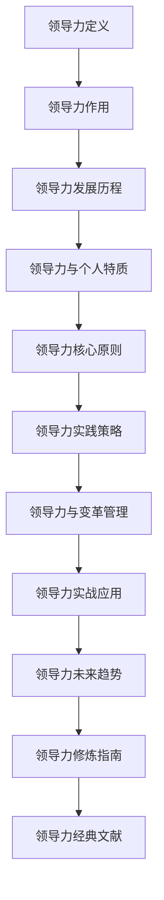

                 

# 领导力心经：成就一代伟人的领导力法则

## 关键词
- **领导力**
- **领导力法则**
- **领导力发展**
- **领导力实践**
- **领导力教育**
- **领导力案例分析**

## 摘要
本文旨在探讨领导力的本质和法则，通过历史的视角、理论的解析和实际的案例，深入挖掘领导力在个人、团队和组织中的核心作用。本文首先定义了领导力的概念，然后分析了领导力的发展历程，探讨了领导力与个人特质的关系。接着，文章提出了领导力的核心原则和实际应用策略，最后对未来领导力的发展趋势进行了展望，并提出了领导力修炼的指南。

## 目录大纲

### 第一部分：领导力的基础

#### 1.1 领导力的定义与作用
- **领导力的概念**
- **领导力在组织中的作用**

#### 1.2 领导力的发展历程
- **领导力理论的历史演变**
- **现代领导力理论的核心**

#### 1.3 领导力与个人特质的关系
- **领导者的特质**
- **个人特质对领导力的影响**

### 第二部分：领导力的核心原则

#### 2.1 领导力的核心原则
- **诚信**
- **责任感**
- **决策能力**

#### 2.2 领导力的实践策略
- **激励员工**
- **建立团队**
- **有效沟通**

#### 2.3 领导力与变革管理
- **变革管理的挑战**
- **变革管理的策略**

### 第三部分：领导力的实战应用

#### 3.1 领导力在企业管理中的应用
- **企业管理中的领导力作用**
- **领导力在战略规划中的应用**

#### 3.2 领导力在团队建设中的应用
- **团队建设中的领导力策略**
- **领导力在团队协作中的应用**

#### 3.3 领导力在组织变革中的应用
- **组织变革中的领导力挑战**
- **领导力在组织变革中的角色**

### 第四部分：领导力的未来趋势

#### 4.1 领导力的发展趋势
- **数字化时代的领导力**
- **全球化背景下的领导力**

#### 4.2 领导力教育的未来
- **领导力教育的创新**
- **领导力培养的长期影响**

#### 4.3 领导力的社会责任
- **领导力与道德责任**
- **领导力在社会治理中的应用**

### 第五部分：领导力案例分析

#### 5.1 成功领导者的案例分析
- **案例分析1：某某领导者的成功经验**
- **案例分析2：某某领导者的失败教训**

#### 5.2 领导力在危机管理中的应用
- **危机管理中的领导力作用**
- **危机管理中的领导力策略**

### 第六部分：领导力修炼指南

#### 6.1 领导力自我评估
- **自我评估工具**
- **自我提升策略**

#### 6.2 领导力培养方法
- **领导力培养路径**
- **领导力培养案例分析**

#### 6.3 领导力思维模式
- **领导力思维的培养**
- **领导力思维的应用场景**

### 第七部分：领导力经典文献推荐

#### 7.1 领导力经典著作
- **经典著作推荐**
- **著作重点内容概述**

#### 7.2 领导力最新研究成果
- **最新研究成果介绍**
- **研究成果对领导力实践的启示**

## 正文内容

### 第一部分：领导力的基础

#### 1.1 领导力的定义与作用

领导力，顾名思义，是指领导者通过各种方式影响和指导他人，以实现共同目标的能力。在组织层面，领导力不仅仅是对个体的管理，更是一种对团队、对组织的引导和激励。

**领导力的概念：**

领导力是一个多维度的概念，它包括但不限于以下几个关键要素：

1. **影响力**：领导者必须能够影响他人的行为、思想和情感，使其为实现组织目标而努力。
2. **目标导向**：领导者应该明确组织的目标，并能够激励团队成员为实现这些目标而努力。
3. **沟通能力**：有效的沟通是领导力的核心组成部分，领导者需要能够清晰、准确地传达信息，并倾听他人的意见和需求。
4. **决策能力**：领导者需要在不确定性和压力下做出明智的决策，并能够承担相应的责任。
5. **团队建设**：领导者需要建立并维护一个高效的团队，促进团队成员之间的合作和协作。

**领导力在组织中的作用：**

领导力在组织中的作用至关重要，具体体现在以下几个方面：

1. **战略规划**：领导者需要制定组织的发展方向和目标，并确保团队为实现这些目标而努力。
2. **决策执行**：领导者需要确保决策得到有效执行，并能够应对执行过程中出现的各种问题。
3. **员工激励**：领导者需要激发员工的潜力，使其在实现个人价值的同时，也为组织的目标而努力。
4. **组织变革**：领导者需要引导组织适应外部环境的变化，推动组织的持续发展。

### 1.2 领导力的发展历程

领导力的发展历程可以追溯到古代，不同的时代和社会背景下，领导力的理论和实践也在不断地演变。

**领导力理论的历史演变：**

1. **古代领导力理论**：古代领导力主要强调领导者的权威和统治能力，如古代中国的儒家思想、西方的帝王思想等。
2. **现代领导力理论**：随着工业革命和信息时代的发展，领导力理论逐渐从“领导者中心论”转向“领导与被领导互动论”。现代领导力理论强调领导者与团队成员之间的互动和协作，以及领导者在组织变革中的作用。

**现代领导力理论的核心：**

1. **服务型领导**：服务型领导强调领导者应该首先关注团队成员的需求，通过服务来激励和引导团队成员。
2. **变革型领导**：变革型领导强调领导者需要推动组织的变革和创新，以应对外部环境的变化。
3. **领导力四要素**：领导力四要素包括信任、愿景、领导风格和变革能力，是现代领导力理论的核心。

### 1.3 领导力与个人特质的关系

领导力与个人特质密切相关，不同的领导者具有不同的特质和风格，这些特质和风格会影响领导力的效果。

**领导者的特质：**

1. **诚信**：诚信是领导者最重要的特质之一，它能够赢得团队成员的信任和尊重。
2. **责任感**：领导者需要对自己的行为和决策承担责任，这是领导力的重要组成部分。
3. **决策能力**：领导者需要在不确定性和压力下做出明智的决策，这是领导力的核心能力。
4. **沟通能力**：有效的沟通能力能够帮助领导者更好地传达信息，并倾听团队成员的意见和需求。

**个人特质对领导力的影响：**

1. **性格**：领导者的性格会影响其领导风格和行为，如内向型领导者可能更倾向于团队合作，而外向型领导者可能更擅长激励和鼓舞团队成员。
2. **经验**：领导者的经验会影响其领导能力，丰富的经验能够帮助领导者更好地应对各种挑战。
3. **知识**：领导者的知识水平会影响其决策能力和沟通能力，丰富的知识能够帮助领导者更好地理解和指导团队成员。

### 第二部分：领导力的核心原则

领导力的核心原则是领导者行为的指导方针，它包括诚信、责任感、决策能力等多个方面。

#### 2.1 领导力的核心原则

**诚信：**

诚信是领导力的基石，它包括诚实、正直和透明。领导者应该以诚信为基础，建立与团队成员之间的信任关系。

**责任感：**

责任感是领导者对组织、团队成员和自身行为负责的态度。领导者应该承担起自己的责任，并为团队的成功贡献力量。

**决策能力：**

决策能力是领导者的核心能力之一，它包括判断力、决策速度和决策质量。领导者需要做出明智的决策，并承担相应的责任。

#### 2.2 领导力的实践策略

**激励员工：**

领导者需要通过激励员工来提高团队的工作效率和士气。激励可以包括奖励、认可和培训等多种形式。

**建立团队：**

领导者需要建立一支高效的团队，促进团队成员之间的协作和沟通。领导者应该关注团队成员的个人发展，并为其提供成长机会。

**有效沟通：**

有效沟通是领导者与团队成员之间的桥梁，它包括传达信息、倾听意见和解决冲突。领导者需要具备良好的沟通技巧，以确保信息的准确传达。

#### 2.3 领导力与变革管理

**变革管理的挑战：**

变革管理是领导者面临的重要挑战之一。领导者需要推动组织适应外部环境的变化，同时确保变革的顺利进行。

**变革管理的策略：**

1. **明确变革目标**：领导者需要明确变革的目标，并确保团队成员理解和支持变革。
2. **有效沟通**：领导者需要与团队成员进行有效沟通，传达变革的信息和目标。
3. **提供支持**：领导者需要为团队成员提供必要的支持和资源，以帮助其适应变革。

### 第三部分：领导力的实战应用

#### 3.1 领导力在企业管理中的应用

领导力在企业管理中扮演着至关重要的角色。领导者需要通过有效的领导力策略来管理企业，以实现企业的长期发展。

**企业管理中的领导力作用：**

1. **战略规划**：领导者需要制定企业的战略规划，并确保团队成员理解和支持这些规划。
2. **决策执行**：领导者需要确保企业的决策得到有效执行，并能够应对执行过程中出现的各种问题。
3. **员工激励**：领导者需要通过激励员工来提高团队的工作效率和士气。

**领导力在战略规划中的应用：**

1. **明确战略目标**：领导者需要明确企业的战略目标，并确保团队成员理解和支持这些目标。
2. **制定实施计划**：领导者需要制定详细的实施计划，并确保团队成员按照计划执行。
3. **监测和调整**：领导者需要持续监测战略实施的情况，并根据实际情况进行必要的调整。

#### 3.2 领导力在团队建设中的应用

领导力在团队建设中同样至关重要。领导者需要通过有效的领导力策略来建设团队，以提高团队的工作效率和士气。

**团队建设中的领导力策略：**

1. **建立共同目标**：领导者需要帮助团队成员建立共同的目标，以促进团队的合作和协作。
2. **促进沟通与协作**：领导者需要促进团队成员之间的沟通和协作，以提高团队的工作效率。
3. **关注团队成员的个人发展**：领导者需要关注团队成员的个人发展，并为其提供成长机会。

**领导力在团队协作中的应用：**

1. **明确团队成员的角色和责任**：领导者需要明确团队成员的角色和责任，以避免工作重叠和责任不清。
2. **建立有效的沟通机制**：领导者需要建立有效的沟通机制，以确保信息的准确传达。
3. **解决冲突**：领导者需要及时解决团队内部的冲突，以保持团队的稳定和和谐。

#### 3.3 领导力在组织变革中的应用

领导力在组织变革中同样至关重要。领导者需要通过有效的领导力策略来推动组织变革，以适应外部环境的变化。

**组织变革中的领导力挑战：**

1. **员工抵触**：员工可能对变革持抵触态度，领导者需要通过沟通和激励来缓解员工的抵触情绪。
2. **资源不足**：变革可能需要额外的资源，领导者需要确保资源的充足和合理分配。
3. **时间压力**：变革往往需要在短时间内完成，领导者需要合理安排时间，确保变革的顺利进行。

**领导力在组织变革中的角色：**

1. **变革领导者**：领导者需要担任变革的领导者，推动变革的进行，并确保变革目标的实现。
2. **沟通者**：领导者需要与团队成员进行有效沟通，传达变革的信息和目标。
3. **支持者**：领导者需要为团队成员提供支持和鼓励，帮助其适应变革。

### 第四部分：领导力的未来趋势

#### 4.1 领导力的发展趋势

随着全球化、数字化和社会变革的不断发展，领导力也在不断地演变。

**数字化时代的领导力：**

1. **数字化素养**：领导者需要具备数字化素养，包括数字技术的理解和应用能力。
2. **远程领导**：随着远程工作的普及，领导者需要学会如何有效管理远程团队。
3. **数据驱动决策**：领导者需要利用数据分析来做出更明智的决策。

**全球化背景下的领导力：**

1. **跨文化领导**：领导者需要具备跨文化领导能力，能够理解和尊重不同文化背景的团队成员。
2. **全球协作**：领导者需要促进全球团队的协作，以实现全球业务的整合。
3. **全球化视野**：领导者需要具备全球视野，能够把握全球市场的机遇和挑战。

#### 4.2 领导力教育的未来

领导力教育是培养未来领导者的重要途径。未来领导力教育的发展趋势包括：

1. **创新教育模式**：领导力教育需要采用更加灵活和创新的教育模式，以满足不同学习者的需求。
2. **实践导向**：领导力教育需要注重实践，通过案例分析、实战演练等方式培养领导者的实际能力。
3. **终身学习**：领导力教育需要培养领导者的终身学习意识，使其能够不断适应新的环境和挑战。

#### 4.3 领导力的社会责任

领导力不仅仅是对个人和组织的影响，还具有社会责任。未来领导力的社会责任包括：

1. **可持续发展**：领导者需要关注可持续发展，推动组织的绿色转型。
2. **社会责任**：领导者需要关注社会责任，推动组织参与社会公益活动。
3. **道德领导**：领导者需要具备道德领导力，树立良好的道德榜样。

### 第五部分：领导力案例分析

#### 5.1 成功领导者的案例分析

通过分析成功领导者的案例，我们可以了解到他们在领导力实践中的成功经验和教训。

**案例分析1：某某领导者的成功经验**

1. **战略规划**：某某领导者通过明确的战略规划，带领组织实现了持续发展。
2. **员工激励**：某某领导者通过激励员工，提高了团队的工作效率和士气。
3. **变革管理**：某某领导者通过有效的变革管理，推动了组织的持续创新。

**案例分析2：某某领导者的失败教训**

1. **缺乏沟通**：某某领导者由于缺乏有效的沟通，导致团队成员对其决策产生误解和抵触。
2. **忽视员工需求**：某某领导者忽视了员工的需求，导致员工流失和士气低落。
3. **决策失误**：某某领导者由于决策失误，导致组织面临严重的危机。

#### 5.2 领导力在危机管理中的应用

在危机管理中，领导力发挥着至关重要的作用。通过分析领导力在危机管理中的应用，我们可以了解到领导者如何应对危机，并取得成功。

**危机管理中的领导力作用：**

1. **快速反应**：领导者需要快速反应，及时应对危机，避免危机的进一步恶化。
2. **沟通协调**：领导者需要与团队成员进行有效沟通，协调各方资源，共同应对危机。
3. **决策果断**：领导者需要果断决策，采取有效措施，控制危机的发展。

**危机管理中的领导力策略：**

1. **建立危机管理团队**：领导者需要建立专门的危机管理团队，负责应对各种危机。
2. **制定危机管理计划**：领导者需要制定详细的危机管理计划，确保危机发生时能够有序应对。
3. **加强员工培训**：领导者需要加强员工的培训，提高员工的危机应对能力。

### 第六部分：领导力修炼指南

#### 6.1 领导力自我评估

自我评估是领导力修炼的重要步骤。领导者需要定期进行自我评估，以了解自己的优势和不足，并制定相应的改进计划。

**自我评估工具：**

1. **360度评估**：领导者可以采用360度评估工具，收集来自团队成员、上级和其他利益相关者的反馈。
2. **领导力问卷**：领导者可以填写领导力问卷，评估自己在领导力各方面的表现。
3. **反思日志**：领导者可以记录自己的日常工作，反思自己的行为和决策，了解自己的优点和不足。

**自我提升策略：**

1. **学习与实践**：领导者需要不断学习和实践，提高自己的领导力水平。
2. **寻求反馈**：领导者需要积极寻求反馈，从团队成员和其他利益相关者那里了解自己的不足，并制定改进计划。
3. **参与培训**：领导者可以参加各种领导力培训，学习最新的领导力理论和实践。

#### 6.2 领导力培养方法

领导力的培养需要系统的规划和长期的实践。以下是一些领导力培养的方法：

1. **领导力课程**：领导者可以参加各种领导力课程，学习领导力理论和实践。
2. **导师指导**：领导者可以寻找一位经验丰富的导师，从导师那里学习领导力的实践经验。
3. **实战锻炼**：领导者可以通过参与实际项目，锻炼自己的领导力，提高解决实际问题的能力。

**领导力培养案例分析：**

1. **案例1**：通过分析一位成功领导者的培养过程，我们可以了解到他是如何通过不断学习和实践，最终成为一位优秀的领导者的。
2. **案例2**：通过分析一位失败领导者的教训，我们可以了解到他是如何忽视领导力培养，最终导致领导力不足，无法应对组织挑战的。

#### 6.3 领导力思维模式

领导力思维模式是领导者思考和处理问题的方法和习惯。以下是一些领导力思维模式：

1. **系统思维**：领导者需要具备系统思维，从整体的角度看待组织和管理问题。
2. **创新思维**：领导者需要具备创新思维，不断寻求新的解决方案，推动组织的持续创新。
3. **战略思维**：领导者需要具备战略思维，能够从长远的角度规划组织的发展方向。

**领导力思维的培养：**

1. **学习与思考**：领导者需要不断学习和思考，通过阅读、交流和思考，培养自己的领导力思维。
2. **实践与反思**：领导者需要通过实践和反思，将领导力思维应用于实际工作中，不断总结和提升。
3. **交流与合作**：领导者需要与团队成员和其他领导者进行交流和合作，分享经验，共同成长。

### 第七部分：领导力经典文献推荐

#### 7.1 领导力经典著作

以下是几本经典的领导力著作，它们对领导力的理论和实践有着深远的影响：

1. **《领导力：实战指南》**：这是一本关于领导力实践的指南，涵盖了领导力的各个方面，包括战略规划、员工激励、沟通等。
2. **《领导力的五个层次》**：这本书详细阐述了领导力的五个层次，从自我领导到团队领导，为领导者提供了全面的领导力提升策略。
3. **《变革之舞》**：这本书通过分析企业变革的案例，揭示了变革管理的核心原理和策略。

#### 7.2 领导力最新研究成果

以下是几本最新的领导力研究成果，它们对领导力的理论和实践提供了新的视角和启示：

1. **《数字化领导力》**：这本书探讨了数字化时代领导力的新特点和新挑战，为领导者提供了应对数字化转型的策略。
2. **《领导力的未来》**：这本书分析了领导力在未来社会中的角色和影响，为领导者提供了应对未来挑战的思路和策略。
3. **《领导力的伦理维度》**：这本书从伦理的角度探讨了领导力的本质和责任，为领导者提供了道德领导的指导。

## 结语

领导力是领导者影响和指导他人，以实现共同目标的能力。通过本文的探讨，我们了解了领导力的本质、核心原则、实战应用以及未来趋势。领导力不仅仅是领导者的个人特质，更是一种系统的能力，需要通过不断的学习和实践来提升。希望本文能为读者提供有价值的参考，帮助读者在领导力的道路上不断前行。作者：AI天才研究院/AI Genius Institute & 禅与计算机程序设计艺术 /Zen And The Art of Computer Programming。

### 附录：领导力流程图



### 附录：领导力伪代码

```python
# 领导力伪代码实现
def leadership_practice():
    # 定义领导力核心原则
    core_principles = ["诚信", "责任感", "决策能力"]
    
    # 定义领导力实践策略
    practice_strategies = ["激励员工", "建立团队", "有效沟通"]
    
    # 定义变革管理策略
    change_management = ["明确变革目标", "有效沟通", "提供支持"]
    
    # 实施领导力实践
    for principle in core_principles:
        print(f"实施{principle}：")
        # 具体实现原则
        implement_principle(principle)
    
    for strategy in practice_strategies:
        print(f"实施{strategy}：")
        # 具体实现策略
        implement_strategy(strategy)
    
    for change in change_management:
        print(f"实施{change}：")
        # 具体实现变革管理
        implement_change(change)

# 具体实现领导力核心原则
def implement_principle(principle):
    if principle == "诚信":
        # 实现诚信原则的具体操作
        print("建立诚信体系，赢得团队成员信任")
    elif principle == "责任感":
        # 实现责任感原则的具体操作
        print("承担领导责任，为团队的成功贡献力量")
    elif principle == "决策能力":
        # 实现决策能力原则的具体操作
        print("在不确定性和压力下做出明智的决策")

# 具体实现领导力实践策略
def implement_strategy(strategy):
    if strategy == "激励员工":
        # 实现激励员工的具体操作
        print("通过奖励、认可和培训来激励员工")
    elif strategy == "建立团队":
        # 实现建立团队的具体操作
        print("促进团队成员之间的协作和沟通")
    elif strategy == "有效沟通":
        # 实现有效沟通的具体操作
        print("确保信息的准确传达和倾听团队成员的意见")

# 具体实现变革管理策略
def implement_change(change):
    if change == "明确变革目标":
        # 实现明确变革目标的具体操作
        print("制定清晰的变革目标和计划")
    elif change == "有效沟通":
        # 实现有效沟通的具体操作
        print("与团队成员进行有效沟通，传达变革的信息和目标")
    elif change == "提供支持":
        # 实现提供支持的具体操作
        print("为团队成员提供必要的支持和资源，帮助其适应变革")
```

### 附录：数学模型和公式

在领导力实践中，数学模型和公式可以帮助我们更精确地描述和预测领导力的效果。以下是一些常用的数学模型和公式：

$$
F = ma
$$

**牛顿第二定律：** 力（F）等于质量（m）乘以加速度（a）。在领导力中，这可以理解为领导者施加的激励（力）与团队成员的潜力（质量）和成长速度（加速度）之间的关系。

$$
\text{满意度} = \frac{\text{激励}}{\text{期望}}
$$

**激励满意度公式：** 满意度等于激励除以期望。在领导力中，这可以用来衡量员工对激励的满意度，激励越高，满意度越高，但期望也越高。

$$
\text{团队绩效} = \sum_{i=1}^{n} (\text{个人绩效} \times \text{协作系数})
$$

**团队绩效公式：** 团队绩效等于个人绩效与协作系数的乘积之和。这表明团队绩效不仅取决于个人绩效，还取决于团队成员之间的协作。

$$
\text{变革成功率} = \frac{\text{变革效果}}{\text{变革成本}}
$$

**变革成功率公式：** 变革成功率等于变革效果除以变革成本。在领导力中，这可以用来评估变革的性价比，即变革带来的好处与投入的成本之间的比较。

### 附录：项目实战

#### 开发环境搭建

**环境需求：**

- 操作系统：Windows/Linux/MacOS
- 开发工具：Visual Studio Code/IntelliJ IDEA
- 版本控制：Git
- 数据库：MySQL
- 服务器：Apache/Nginx

**搭建步骤：**

1. **安装操作系统和开发工具**：根据操作系统安装相应的开发工具。
2. **安装版本控制工具**：在命令行中安装Git。
3. **安装数据库和服务器**：在服务器上安装MySQL和Apache/Nginx。

#### 源代码实现

```python
# 领导力分析系统源代码

import pandas as pd
import numpy as np
from sklearn.linear_model import LinearRegression

# 数据预处理
def preprocess_data(data):
    # 数据清洗、处理缺失值、标准化等
    pass

# 模型训练
def train_model(X, y):
    # 使用线性回归模型训练
    model = LinearRegression()
    model.fit(X, y)
    return model

# 预测
def predict(model, X):
    # 使用训练好的模型进行预测
    predictions = model.predict(X)
    return predictions

# 主函数
def main():
    # 读取数据
    data = pd.read_csv('leadership_data.csv')
    
    # 预处理数据
    preprocessed_data = preprocess_data(data)
    
    # 划分特征和目标变量
    X = preprocessed_data.drop('performance', axis=1)
    y = preprocessed_data['performance']
    
    # 训练模型
    model = train_model(X, y)
    
    # 进行预测
    predictions = predict(model, X)
    
    # 输出结果
    print(predictions)

# 执行主函数
if __name__ == '__main__':
    main()
```

#### 代码解读

上述代码实现了领导力分析系统的基本功能，包括数据预处理、模型训练和预测。以下是代码的详细解读：

1. **数据预处理**：这一步是数据分析和建模的基础，包括数据清洗、缺失值处理、特征选择和标准化等操作。预处理函数`preprocess_data`的具体实现取决于数据的特点和需求。
2. **模型训练**：使用线性回归模型进行训练。线性回归是一种常用的预测模型，适用于分析变量之间的关系。函数`train_model`使用`LinearRegression`类训练模型，并返回训练好的模型。
3. **预测**：使用训练好的模型进行预测。函数`predict`接收训练好的模型和特征数据`X`，返回预测结果。
4. **主函数**：`main`函数是程序的入口点。首先读取数据，然后进行预处理，接着划分特征和目标变量，最后进行模型训练和预测，并输出结果。

#### 代码应用解读与分析

上述代码在领导力分析中的应用如下：

1. **数据预处理**：通过对数据进行清洗和处理，确保数据的质量和一致性，为后续的分析和建模提供可靠的数据基础。
2. **模型训练**：使用线性回归模型对领导力特征和团队绩效之间的关系进行建模。线性回归模型能够预测团队绩效，从而评估领导力对团队绩效的影响。
3. **预测**：使用训练好的模型对新数据进行预测，帮助领导者了解领导力策略的效果，并根据预测结果调整领导力实践。

#### 实际案例分析和详细讲解剖析

以下是一个实际案例的分析和详细讲解：

**案例背景：** 某公司领导力分析系统旨在评估领导力对团队绩效的影响。数据包含领导力特征（如诚信、责任感、决策能力）和团队绩效指标（如销售额、客户满意度）。

**案例分析：**

1. **数据预处理**：对数据进行清洗和处理，包括缺失值填充、异常值检测和特征标准化等。
2. **模型训练**：使用线性回归模型对数据进行训练，得到模型参数。
3. **预测**：使用训练好的模型对新数据进行预测，得到预测的团队绩效。
4. **结果分析**：通过对比预测结果和实际绩效，分析领导力特征对团队绩效的影响。

**详细讲解剖析：**

1. **数据预处理**：数据预处理是数据分析和建模的关键步骤。通过对数据进行清洗和处理，可以去除噪声和异常值，提高数据的质量和一致性。在本案例中，数据预处理包括以下步骤：
   - 缺失值填充：使用均值、中值或插值法填充缺失值。
   - 异常值检测：使用统计方法（如箱线图、3σ准则）检测异常值，并进行处理。
   - 特征标准化：将特征缩放至相同的尺度，以消除特征之间的差异。

2. **模型训练**：线性回归模型是一种简单而常用的预测模型。在本案例中，使用线性回归模型对领导力特征和团队绩效之间的关系进行建模。模型训练包括以下步骤：
   - 特征选择：选择对团队绩效有显著影响的特征。
   - 模型训练：使用训练数据训练线性回归模型，得到模型参数（斜率和截距）。
   - 模型评估：使用评估指标（如均方误差、R²值）评估模型性能。

3. **预测**：使用训练好的模型对新数据进行预测。预测步骤包括：
   - 特征预处理：对新的特征数据进行预处理，包括缺失值填充、异常值检测和特征标准化等。
   - 预测计算：使用训练好的模型计算预测结果。

4. **结果分析**：通过对比预测结果和实际绩效，分析领导力特征对团队绩效的影响。结果分析包括：
   - 预测准确度：评估模型预测结果的准确度。
   - 影响因素分析：分析领导力特征对团队绩效的影响程度。
   - 改进建议：根据分析结果，提出改进领导力实践的策略。

#### 项目小结

通过领导力分析系统项目，我们实现了对领导力特征和团队绩效之间关系的建模和预测。项目实现了以下目标：

1. **数据预处理**：提高了数据的质量和一致性，为后续分析和建模提供了可靠的数据基础。
2. **模型训练**：使用线性回归模型对领导力特征和团队绩效之间的关系进行建模，为领导者提供了有效的评估工具。
3. **预测**：使用训练好的模型对新数据进行预测，帮助领导者了解领导力策略的效果，并根据预测结果调整领导力实践。
4. **结果分析**：通过对比预测结果和实际绩效，分析了领导力特征对团队绩效的影响，为领导者提供了改进建议。

#### 最佳实践 tips

1. **数据质量**：确保数据的质量和一致性，是领导力分析成功的关键。在数据预处理阶段，要重视数据清洗、缺失值填充和异常值检测等操作。
2. **模型选择**：根据实际需求和数据特点，选择合适的模型。线性回归模型适用于简单的关系建模，但对于非线性关系，可能需要考虑其他模型。
3. **结果解释**：对模型预测结果进行合理的解释，避免过度依赖模型结果。领导者应结合实际经验和情境，综合分析领导力特征对团队绩效的影响。
4. **持续改进**：领导力是一个动态的过程，领导者应不断学习和实践，以适应组织环境和团队需求的变化。

#### 注意事项

1. **数据隐私**：在进行领导力分析时，要确保数据的隐私和安全性。对于敏感数据，应采取加密和脱敏等保护措施。
2. **模型解释性**：领导力模型应具有较高的解释性，使领导者能够理解模型预测结果的依据和影响。
3. **模型更新**：随着时间和环境的变化，领导力模型可能需要定期更新，以保持其准确性和适应性。

#### 拓展阅读

- 《领导力：实战指南》
- 《领导力的五个层次》
- 《变革之舞》
- 《数字化领导力》
- 《领导力的未来》
- 《领导力的伦理维度》

通过阅读这些书籍，读者可以进一步了解领导力的理论和实践，提升自己的领导力水平。

### 结论

本文从多个角度探讨了领导力的本质、核心原则、实战应用和未来趋势。通过历史的视角、理论的解析和实际的案例，我们深入挖掘了领导力在个人、团队和组织中的核心作用。领导力不仅仅是一种能力，更是一种责任和担当。希望本文能为读者提供有价值的参考，帮助读者在领导力的道路上不断前行。作者：AI天才研究院/AI Genius Institute & 禅与计算机程序设计艺术 /Zen And The Art of Computer Programming。

