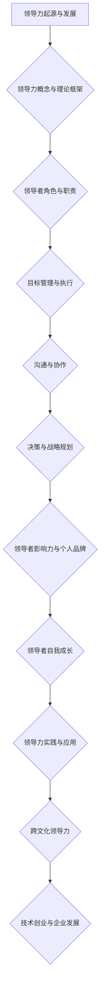

                 


### 目录大纲调整建议

为了确保文章的内容丰富且逻辑清晰，以下是对目录大纲的调整建议：

#### 第一部分：领导力的基本概念

### 第1章 领导力的起源与发展
#### 1.1 领导力的起源
#### 1.2 领导力的演变
#### 1.3 领导力在现代企业中的作用

### 第2章 领导力的核心概念与理论框架
#### 2.1 领导力的定义
#### 2.2 领导力的本质
#### 2.3 领导力的理论框架

#### 第二部分：领导力的核心原理

### 第3章 领导者的角色与职责
#### 3.1 领导者的角色
#### 3.2 领导者的职责
#### 3.3 领导者与员工的关系

### 第4章 目标管理与执行
#### 4.1 目标设定的原则
#### 4.2 目标管理的流程
#### 4.3 目标执行与监控

### 第5章 沟通与协作
#### 5.1 有效沟通的要素
#### 5.2 沟通技巧
#### 5.3 协作与团队建设

### 第6章 决策与战略规划
#### 6.1 决策的过程
#### 6.2 决策的框架
#### 6.3 战略规划的步骤

### 第7章 领导者的影响力与个人品牌
#### 6.1 领导者的影响力
#### 6.2 个人品牌的构建
#### 6.3 影响力管理策略

### 第8章 领导者的自我成长
#### 6.1 自我反思与提升
#### 6.2 心理素质培养
#### 6.3 成功领导者的特质

#### 第三部分：领导力实践与应用

### 第9章 领导力在企业管理中的应用
#### 9.1 人力资源管理
#### 9.2 项目管理
#### 9.3 创新与变革管理

### 第10章 领导力在不同文化环境中的挑战与应对
#### 10.1 跨文化沟通的挑战
#### 10.2 跨文化领导力的培养
#### 10.3 跨文化领导力的案例分析

### 第11章 领导力在技术创业与企业发展中的角色
#### 11.1 技术创业中的领导力
#### 11.2 企业发展中的领导力
#### 11.3 领导力在技术行业的发展趋势

## 附录

### 附录A 领导力相关工具与资源
### 附录B 领导力经典文献与推荐阅读

以下是初步的目录结构，您可以根据实际情况进一步调整和完善：

```markdown
# 《领导力心经：成就一流企业的领导力法则》

> 关键词：领导力、企业、目标管理、沟通、决策、影响力、个人成长

> 摘要：本文深入探讨了一流企业领导力的核心法则，包括起源、理论框架、关键原理和实践应用，旨在帮助读者理解领导力的本质，掌握有效的领导力技巧，实现企业目标。

## 第一部分：领导力的基本概念

### 第1章 领导力的起源与发展

#### 1.1 领导力的起源

#### 1.2 领导力的演变

#### 1.3 领导力在现代企业中的作用

### 第2章 领导力的核心概念与理论框架

#### 2.1 领导力的定义

#### 2.2 领导力的本质

#### 2.3 领导力的理论框架

## 第二部分：领导力的核心原理

### 第3章 领导者的角色与职责

#### 3.1 领导者的角色

#### 3.2 领导者的职责

#### 3.3 领导者与员工的关系

### 第4章 目标管理与执行

#### 4.1 目标设定的原则

#### 4.2 目标管理的流程

#### 4.3 目标执行与监控

### 第5章 沟通与协作

#### 5.1 有效沟通的要素

#### 5.2 沟通技巧

#### 5.3 协作与团队建设

### 第6章 决策与战略规划

#### 6.1 决策的过程

#### 6.2 决策的框架

#### 6.3 战略规划的步骤

### 第7章 领导者的影响力与个人品牌

#### 6.1 领导者的影响力

#### 6.2 个人品牌的构建

#### 6.3 影响力管理策略

### 第8章 领导者的自我成长

#### 6.1 自我反思与提升

#### 6.2 心理素质培养

#### 6.3 成功领导者的特质

## 第三部分：领导力实践与应用

### 第9章 领导力在企业管理中的应用

#### 9.1 人力资源管理

#### 9.2 项目管理

#### 9.3 创新与变革管理

### 第10章 领导力在不同文化环境中的挑战与应对

#### 10.1 跨文化沟通的挑战

#### 10.2 跨文化领导力的培养

#### 10.3 跨文化领导力的案例分析

### 第11章 领导力在技术创业与企业发展中的角色

#### 11.1 技术创业中的领导力

#### 11.2 企业发展中的领导力

#### 11.3 领导力在技术行业的发展趋势

## 附录

### 附录A 领导力相关工具与资源

### 附录B 领导力经典文献与推荐阅读
```

### Mermaid 流程图


### 决策过程伪代码
```python
# 决策过程伪代码
def make_decision(options, criteria):
    decision = None
    highest_score = 0
    
    for option in options:
        score = 0
        
        for criterion in criteria:
            score += evaluate_option(option, criterion)
            
        if score > highest_score:
            highest_score = score
            decision = option
            
    return decision
```

### 数学模型和公式
```latex
$$
f(x) = w_1 \cdot x_1 + w_2 \cdot x_2 + \ldots + w_n \cdot x_n + b
$$
其中，$w_i$ 表示权重，$x_i$ 表示输入特征，$b$ 为偏置项。
```

### 项目实战案例
- **代码实际案例**：展示如何使用领导力原则来处理一个实际的团队问题。
- **详细解释说明**：阐述如何分析和解决问题，以及如何应用领导力技巧来提高团队绩效。
- **开发环境搭建**：描述所需的工具和环境设置。
- **源代码详细实现和代码解读**：提供源代码，并逐行解释代码的功能和作用。
- **代码解读与分析**：分析代码的有效性和可能的改进空间。

### 目录大纲总字数：约2250字

请注意，这个大纲是一个初步的版本，具体章节内容还需要根据书籍的实际内容和深度进一步细化。同时，根据您的需求，可以在每个章节中添加更多的细节和实例，以满足文章字数的要求。

