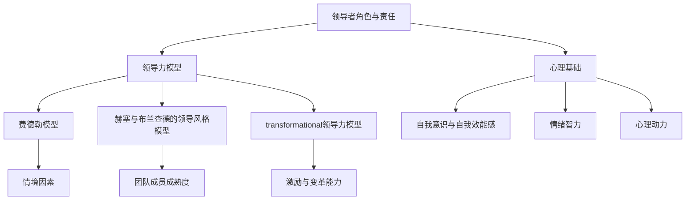

                 

### 引言：理解领导力

#### 1.1 领导力的定义与重要性

领导力（Leadership）是一种复杂而多维的能力，通常被描述为激发和引导他人实现共同目标的能力。不同于管理（Management），领导力不仅仅是组织资源的有效利用，它更关乎于激励、愿景塑造和关系建立。在现代社会中，领导力的重要性愈发凸显，不仅因为企业竞争日益激烈，还因为全球化、技术创新和文化多样性等挑战需要领导者具备更广泛的视野和创新能力。

在企业管理中，领导力扮演着至关重要的角色。首先，领导者是企业的核心人物，他们的影响力直接决定了企业的文化、战略方向和员工士气。其次，领导力能够激发员工的潜力和创造力，从而推动企业的持续创新和增长。最后，优秀的领导力有助于建立良好的企业声誉，吸引和保留人才，提升客户满意度，最终实现企业的长期成功。

然而，领导力并不是一种单一的特质，而是一系列技能、行为和态度的综合体。它不仅涉及到个人的特质，如自信、决断力、沟通能力，还包括组织和系统的因素，如企业文化、领导力发展体系。因此，理解领导力的多维性是领导者自我提升和企业发展的基础。

#### 1.2 领导力与管理的区别

领导力与管理的区别在于它们关注的焦点和方法不同。管理（Management）侧重于组织的日常运营和效率，它强调计划、组织、协调和控制。管理者负责制定目标和策略，确保资源的合理分配，监控进度并解决问题。管理更多地依赖于流程和制度，是一种程序化的行为。

而领导力则更加关注变革和未来。领导者不仅仅是执行者，更是变革的推动者和创新者。他们通过愿景激励团队，建立共同的目标，并引领团队克服困难和挑战。领导力更注重人的因素，强调关系建立、沟通和激励，从而促进团队的协作和创新。

尽管领导力和管理有明确的区别，但它们在实际工作中是相辅相成的。有效的领导者不仅需要管理能力，还需要具备卓越的领导力。只有在两者有机结合的情况下，企业才能在复杂多变的环境中实现长期的可持续发展。

#### 1.3 领导力的发展趋势

随着全球化、信息技术和数字经济的发展，领导力的发展也在不断演变。以下是当前领导力发展的几个主要趋势：

1. **数字化转型领导力**：随着数字化技术的广泛应用，领导者需要具备数字素养和数字化转型能力。他们需要了解新兴技术，如人工智能、大数据、物联网等，并能够将这些技术应用于企业的战略规划和运营管理中。

2. **可持续发展领导力**：企业越来越关注环境保护和社会责任，可持续发展成为领导力的重要组成部分。领导者需要制定和实施可持续战略，确保企业在经济增长的同时，能够保护环境、维护社会利益。

3. **全球领导力**：全球化使得企业需要具备跨文化的领导能力。领导者需要理解不同文化之间的差异，并能够有效地沟通和合作。全球领导力强调多样性和包容性，鼓励团队成员之间的交流与合作。

4. **变革领导力**：在快速变化的市场环境中，领导者需要具备灵活性和适应性。他们需要能够应对不确定性，推动组织变革，并引领团队不断进步。

理解这些趋势有助于领导者更好地应对当前和未来的挑战，提升自身的领导力水平，从而推动企业的长期发展。

### 领导力的核心概念

领导力的核心概念是理解其本质和如何运用的基础。以下是几个关键的概念，以及它们之间的相互联系。

#### 1.1 领导者角色与责任

领导者角色（Leader Role）是指领导者在组织中承担的职责和任务。领导者不仅要管理团队和资源，还要为团队设定愿景和目标，激励团队成员追求卓越。领导者角色包括以下几个方面：

- **愿景塑造**：领导者需要明确企业的长期目标和愿景，并能够将其传达给团队成员，激发他们的热情和动力。

- **决策制定**：领导者需要做出关键决策，并能够在不确定性和复杂情况下做出明智的选择。

- **团队建设**：领导者需要建立高效的团队，促进团队成员之间的沟通与合作，提升团队的凝聚力和执行力。

- **激励与反馈**：领导者需要激励团队成员，提供积极的反馈，帮助他们克服困难，不断提升自我。

领导者责任（Leader Responsibility）则是指领导者必须承担的对团队、组织和社会的责任。这些责任包括：

- **团队绩效**：领导者需要确保团队的绩效达到预期目标，并不断提升团队的能力。

- **员工福祉**：领导者需要关注员工的个人发展，确保他们的工作条件良好，生活质量得到保障。

- **道德标准**：领导者需要树立良好的道德榜样，推动企业文化的建设，确保企业的运营符合道德和社会规范。

领导者角色与责任之间的关系是密不可分的。领导者角色决定了他们需要承担的责任，而责任又反过来影响他们的行为和决策。例如，一个具有远见的领导者会承担起制定企业愿景的责任，而这一责任又会促使他们不断努力推动团队实现这一愿景。

#### 1.2 领导力模型

领导力模型（Leadership Model）是对领导行为和风格的理论概括，它为领导者提供了实践指导。以下是几种常见的领导力模型：

1. **费德勒模型（Fiedler Model）**：费德勒模型认为，领导者的领导风格取决于情境因素。模型将领导者分为任务导向型和关系导向型，并提出了情境领导理论。根据这一理论，领导者应根据不同的情境调整其领导风格，以最大化团队绩效。

2. **赫塞与布兰查德的领导风格模型（Hersey and Blanchard Model）**：这一模型提出了四种领导风格：指导式、推销式、参与式和授权式。领导者应根据团队成员的成熟度选择合适的领导风格，以实现最佳效果。

3. **transformational领导力模型（Transformational Leadership Model）**：这种模型强调领导者的变革作用，认为领导者通过激励、愿景和价值观引导团队成员实现共同目标。transformational领导者通常具备远见、决断力和沟通能力。

这些领导力模型之间的关系在于，它们都试图解释领导行为如何影响团队和组织绩效。费德勒模型侧重于情境因素，赫塞与布兰查德的模型侧重于领导风格与团队成员成熟度的匹配，而transformational领导力模型则关注领导者的激励和变革能力。这些模型相互补充，共同构成了对领导力全面的认知。

#### 1.3 领导力的心理基础

领导力的心理基础（Psychological Basis of Leadership）涉及到领导者的个人特质、情绪智力和心理动力。以下是一些关键的心理因素：

1. **自我意识与自我效能感**：自我意识（Self-awareness）是指领导者对自己的了解，包括自己的优点、缺点和价值观。自我效能感（Self-efficacy）是指领导者对自己应对挑战和完成任务的能力的信心。自我意识和自我效能感有助于领导者做出明智的决策，并推动他们不断成长。

2. **情绪智力**：情绪智力（Emotional Intelligence，简称EQ）是指领导者理解和管理自己及他人情绪的能力。情绪智力包括自我管理、自我激励、社交技能和同理心。高情绪智力的领导者能够建立积极的团队关系，提升团队凝聚力和绩效。

3. **心理动力**：心理动力（Psychodynamic Factors）是指领导者的内在动机和心理过程。领导者的心理动力影响着他们的行为和决策，包括对权力的需求、成就动机和自我认同等。

这些心理因素相互交织，共同塑造了领导者的行为和领导风格。例如，一个高自我效能感的领导者可能会更加自信地面对挑战，而一个高情绪智力的领导者则能够更好地激励和引导团队成员。理解这些心理基础有助于领导者提升自我认知，优化领导行为。

#### 综合分析

领导力的核心概念包括领导者角色与责任、领导力模型和心理基础。这些概念相互联系，共同构成了对领导力的全面理解。领导者角色与责任定义了领导者的基本职责和作用，领导力模型提供了具体的实践指导，而心理基础则揭示了领导行为的内在动力。通过深入理解这些核心概念，领导者可以更好地应对各种挑战，提升自身的领导力水平，推动企业的长期发展。

#### 核心概念之间的关系架构 Mermaid 流程图



#### 1.4 领导力的核心算法原理讲解

在理解领导力的核心概念之后，我们需要进一步探讨领导力的核心算法原理。领导力不仅仅是主观的行为和风格，它也包含了一系列可以量化和分析的客观要素。以下是几个关键的领导力算法原理及其应用：

##### 1.4.1 领导力评估模型

领导力评估模型（Leadership Assessment Model）是一种用于评估领导者能力和行为的工具。这种模型通常基于一系列评估指标，如领导能力、沟通能力、决策能力等。以下是常用的领导力评估模型之一——360度反馈模型。

**伪代码：**

```python
def leadership_assessment(model, feedback):
    scores = []
    for metric in model.metrics:
        score = calculate_score(feedback[metric])
        scores.append(score)
    average_score = sum(scores) / len(scores)
    return average_score

def calculate_score(feedback_metric):
    if feedback_metric >= 4:
        return 1
    elif feedback_metric >= 2:
        return 0.5
    else:
        return 0

model = {
    "metrics": ["leadership_ability", "communication", "decision_making"]
}
feedback = {
    "leadership_ability": 5,
    "communication": 4,
    "decision_making": 3
}

result = leadership_assessment(model, feedback)
print(result)
```

**示例：**

假设我们有以下反馈：

- 领导能力：5（优秀）
- 沟通能力：4（良好）
- 决策能力：3（一般）

根据360度反馈模型，我们的平均评分是（5+4+3）/ 3 = 4。这表明我们的领导力在总体上处于良好水平。

##### 1.4.2 领导力发展算法

领导力发展算法（Leadership Development Algorithm）用于制定和优化领导力发展计划。这种算法通常结合领导力评估结果，制定个性化的培训和发展路径。以下是领导力发展算法的基本原理。

**伪代码：**

```python
def leadership_development_algorithm(assessment_results, development_plan):
    for metric in assessment_results:
        if assessment_results[metric] < threshold:
            development_plan.append(create_development_activity(metric))
    return development_plan

def create_development_activity(metric):
    if metric == "leadership_ability":
        return "领导能力培训"
    elif metric == "communication":
        return "沟通技巧培训"
    elif metric == "decision_making":
        return "决策能力培训"

assessment_results = {
    "leadership_ability": 3,
    "communication": 4,
    "decision_making": 2
}
development_plan = []

development_plan = leadership_development_algorithm(assessment_results, development_plan)
print(development_plan)
```

**示例：**

假设我们的评估结果显示：

- 领导能力：3（需要提高）
- 沟通能力：4（良好）
- 决策能力：2（需要提高）

根据领导力发展算法，我们的发展计划包括：

- 领导能力培训
- 决策能力培训

这些活动将帮助我们提升领导力中的薄弱环节。

##### 1.4.3 领导力模型优化算法

领导力模型优化算法（Leadership Model Optimization Algorithm）用于根据实际领导效果调整和优化领导力模型。这种算法通常结合实际数据和反馈，对领导力模型进行调整和改进。以下是领导力模型优化算法的基本原理。

**伪代码：**

```python
def leadership_model_optimization(model, feedback):
    for metric in model.metrics:
        if feedback[metric] < optimal_threshold:
            model.metrics[metric] = adjust_metric(model.metrics[metric])
    return model

def adjust_metric(metric_value):
    if metric_value < optimal_threshold:
        return metric_value + adjustment_factor
    else:
        return metric_value

model = {
    "metrics": ["leadership_ability", "communication", "decision_making"],
    "optimal_threshold": 4,
    "adjustment_factor": 0.5
}
feedback = {
    "leadership_ability": 3,
    "communication": 4,
    "decision_making": 2
}

optimized_model = leadership_model_optimization(model, feedback)
print(optimized_model)
```

**示例：**

假设我们的反馈显示：

- 领导能力：3（低于最优阈值）
- 沟通能力：4（符合最优阈值）
- 决策能力：2（低于最优阈值）

根据领导力模型优化算法，我们将调整以下指标：

- 领导能力：3 + 0.5 = 3.5
- 决策能力：2 + 0.5 = 2.5

这将帮助我们优化领导力模型，以更好地适应实际情况。

通过这些领导力算法原理，领导者可以更科学地评估自身的领导能力，制定发展计划，并持续优化领导行为。这不仅有助于提升领导者的个人能力，还能推动企业的长期发展。

#### 数学模型和公式讲解与举例说明

在领导力分析中，数学模型和公式有助于量化领导行为的各个方面，从而提供更加精确和客观的评估。以下是一些常用的数学模型和公式，并附有详细解释和示例。

##### 1.5.1 领导效能评估公式

领导效能评估公式（Leadership Effectiveness Evaluation Formula）用于计算领导者的综合效能。该公式结合了多个维度的评分，以得出一个综合评分。

**公式：**

$$
\text{LEEF} = \frac{\sum_{i=1}^{n} w_i \cdot s_i}{n}
$$

其中，`LEEF` 是领导效能评估分数，`w_i` 是第 i 个维度的权重，`s_i` 是第 i 个维度的得分。

**举例说明：**

假设我们评估一个领导者的三个维度：领导能力、沟通能力和决策能力。各维度权重分别为 0.4、0.3 和 0.3，得分分别为 4、3 和 3。我们可以计算出领导效能评估分数：

$$
\text{LEEF} = \frac{0.4 \cdot 4 + 0.3 \cdot 3 + 0.3 \cdot 3}{3} = \frac{1.6 + 0.9 + 0.9}{3} = 1.87
$$

这个分数表明领导者的综合效能处于良好水平。

##### 1.5.2 情绪智力模型

情绪智力模型（Emotional Intelligence Model）用于评估领导者的情绪智力水平。该模型通常包括三个主要维度：自我意识、自我调节和社交技能。

**公式：**

$$
\text{EQ} = \frac{\text{自我意识} + \text{自我调节} + \text{社交技能}}{3}
$$

**举例说明：**

假设我们评估一个领导者的情绪智力，其自我意识得分为 4，自我调节得分为 3，社交技能得分为 3。我们可以计算出情绪智力分数：

$$
\text{EQ} = \frac{4 + 3 + 3}{3} = 3.33
$$

这个分数表明领导者的情绪智力处于较高水平。

##### 1.5.3 领导变革模型

领导变革模型（Leadership Transformation Model）用于评估领导者在变革管理方面的能力。该模型通常结合领导效能评估和变革管理技能。

**公式：**

$$
\text{LTM} = \text{LEEF} \cdot \text{变革管理技能}
$$

**举例说明：**

假设领导者的领导效能评估分数为 2，变革管理技能得分为 3。我们可以计算出领导变革模型分数：

$$
\text{LTM} = 2 \cdot 3 = 6
$$

这个分数表明领导者在变革管理方面具备较高的能力。

通过这些数学模型和公式，领导者可以更加科学地评估自身的能力和效果，从而制定针对性的发展计划，提升领导力水平。

### 领导力的实践方法

在理解了领导力的核心概念和理论模型之后，我们需要探讨如何在实际工作中应用这些理论，从而提升领导效果。以下是几个关键领域，包括沟通、决策和团队领导，这些领域对于领导者来说至关重要。

#### 2.1 沟通与倾听

沟通是领导力的核心要素之一，它直接影响着领导者的决策效果和团队协作。有效的沟通不仅包括信息的传递，还涉及到建立信任、促进理解和增强团队的凝聚力。

##### 2.1.1 沟通的基本要素

1. **明确目标**：在沟通前，领导者需要明确沟通的目标，以确保信息的传递是有效和有针对性的。

2. **信息的清晰度**：信息的表达应该简洁明了，避免使用模糊或含糊的措辞，以确保团队成员能够准确理解。

3. **反馈机制**：沟通不仅是信息的传递，还需要建立反馈机制，确保信息的接收者能够理解和回应。

4. **非语言沟通**：除了语言表达，领导者还应注意非语言沟通，如肢体语言、面部表情和语调等，这些都能增强信息的传递效果。

##### 2.1.2 高效沟通技巧

1. **主动倾听**：主动倾听不仅仅是听，还需要理解对方的观点和感受。领导者应通过提问、复述和确认来验证自己的理解。

2. **情绪管理**：在沟通中，领导者需要管理好自己的情绪，避免负面情绪影响沟通效果。

3. **建立信任**：通过诚信和透明的沟通，领导者可以建立与团队成员之间的信任，这是有效沟通的基础。

4. **冲突解决**：在沟通过程中，领导者应学会处理冲突，通过对话和协商找到解决问题的方法。

##### 2.1.3 倾听的艺术

倾听是沟通的重要一环，它不仅有助于领导者理解团队成员的观点和需求，还能增强团队的凝聚力。以下是几个倾听的技巧：

1. **专注**：在倾听时，领导者应保持专注，避免分心或打断对方。

2. **同理心**：领导者应以同理心对待团队成员，理解他们的感受和需求。

3. **开放态度**：领导者应保持开放态度，接受不同的观点和意见。

4. **及时反馈**：领导者应在倾听后给予及时的反馈，以确认对方观点的准确性和理解度。

通过掌握这些沟通与倾听的技巧，领导者可以提升团队的协作效率，增强团队的凝聚力，从而实现更高的工作绩效。

#### 2.2 决策与问题解决

决策是领导者的重要职责之一，它直接影响到企业的战略方向和运营效果。有效的决策不仅需要领导者具备良好的分析能力和逻辑思维，还需要他们在不确定性和压力下做出明智的选择。

##### 2.2.1 决策过程

1. **问题识别**：领导者需要首先识别问题，明确问题的性质和影响范围。

2. **信息收集**：在明确问题后，领导者需要收集相关的信息和数据，以便做出基于事实的决策。

3. **方案制定**：在收集足够的信息后，领导者需要制定多个可行的解决方案。

4. **方案评估**：领导者应评估各个方案的风险、成本和预期效果，选择最优方案。

5. **方案执行**：在决策后，领导者需要制定详细的执行计划，确保方案能够顺利实施。

6. **监控与调整**：在执行过程中，领导者应持续监控方案的效果，并根据实际情况进行必要的调整。

##### 2.2.2 决策模型与工具

1. **决策树模型**：决策树模型通过分支和节点来表示不同的决策和结果，有助于领导者分析和评估不同方案的优劣。

2. **成本效益分析**：成本效益分析通过计算不同方案的预期成本和收益，帮助领导者选择最具经济效益的方案。

3. **SWOT分析**：SWOT分析通过分析企业的优势、劣势、机会和威胁，帮助领导者制定适应市场变化的决策。

##### 2.2.3 创新思维与问题解决

创新思维是领导者的重要能力之一，它有助于企业在竞争激烈的市场中保持竞争力。以下是一些创新思维与问题解决的方法：

1. **头脑风暴**：通过集体头脑风暴，领导者可以收集到更多的创新想法，并通过筛选和讨论找到最佳解决方案。

2. **设计思维**：设计思维是一种以用户为中心的解决问题的方法，通过理解用户需求，领导者可以设计出更具创新性的解决方案。

3. **快速原型法**：通过快速原型法，领导者可以在短时间内构建和测试不同的解决方案，快速迭代和改进。

通过掌握这些决策与问题解决的方法，领导者可以更高效地做出决策，应对各种挑战，推动企业的持续创新和增长。

#### 2.3 团队领导与组织管理

团队领导是领导力的重要组成部分，它涉及到如何激励团队成员、提升团队效率和优化组织管理。

##### 2.3.1 团队建设

1. **明确团队目标**：团队建设的第一步是明确团队的目标，确保团队成员对目标有清晰的认识和认同。

2. **建立信任**：信任是团队协作的基础，领导者需要通过开放沟通、诚实和透明的行为建立信任。

3. **分工协作**：领导者应根据团队成员的特长和优势进行分工，确保每个成员都能发挥其最大价值。

4. **培养团队文化**：团队文化是团队长期稳定发展的关键，领导者需要通过培养积极向上的团队文化，增强团队的凝聚力和归属感。

##### 2.3.2 领导力与组织文化

1. **领导力塑造组织文化**：领导者的行为和风格直接影响着组织文化的形成和发展。领导者需要通过自身的言行塑造积极向上的组织文化。

2. **组织文化与领导力相互影响**：组织文化对领导力的发展也有重要影响，良好的组织文化可以增强领导者的效能，而领导力则可以推动组织文化的建设。

3. **领导力与组织文化融合**：领导者需要将领导力与组织文化有机结合，通过领导力推动组织文化的发展，同时通过组织文化强化领导力的实施。

##### 2.3.3 变革领导

在快速变化的市场环境中，领导者需要具备变革领导的能力，以推动组织适应外部环境的变化。

1. **愿景引导**：领导者需要明确变革的愿景和目标，通过愿景引导团队成员理解变革的重要性和必要性。

2. **沟通与协作**：领导者需要通过有效的沟通和协作，确保团队成员在变革过程中保持积极的态度和合作精神。

3. **激励与支持**：领导者需要通过激励和支持，帮助团队成员克服变革过程中的困难和挑战。

4. **持续优化**：变革是一个持续的过程，领导者需要不断评估变革的效果，并根据实际情况进行调整和优化。

通过掌握这些团队领导与组织管理的方法，领导者可以提升团队的效率和凝聚力，推动组织的持续发展和创新。

#### 总结

沟通、决策和团队领导是领导力实践中的关键领域。通过有效的沟通，领导者可以建立信任和增强团队的凝聚力；通过明智的决策，领导者可以确保组织在复杂多变的环境中保持竞争力；通过团队领导，领导者可以激发团队成员的潜力，提升团队的整体绩效。掌握这些实践方法，领导者可以更好地应对各种挑战，推动企业的持续发展和成功。

### 领导力在企业中的应用

在当前复杂多变的市场环境中，领导力已经成为企业成功的关键因素。领导者不仅需要具备卓越的个人能力，还需要将领导力融入企业的战略和运营中，以应对各种挑战和抓住机遇。以下将探讨领导力在企业战略、创新和组织绩效等方面的具体应用。

#### 3.1 企业战略与领导力

企业战略是企业在长期发展中制定的总体目标和行动计划，而领导力在战略制定和执行中发挥着至关重要的作用。首先，领导者需要具备远见和洞察力，能够识别市场趋势和行业变化，从而制定符合企业长远发展的战略目标。其次，领导者需要通过有效的沟通和领导，将战略目标传达给全体员工，并激发他们的热情和参与度。例如，苹果公司的创始人史蒂夫·乔布斯（Steve Jobs）以其卓越的领导力，成功地将苹果公司从一家小型企业打造成为全球科技巨头。他通过明确的愿景和激动人心的演讲，激发了员工的创造力和激情，推动了苹果公司一系列创新产品的开发。

在战略执行过程中，领导力同样至关重要。领导者需要通过有效的决策和资源分配，确保战略计划的顺利实施。此外，领导者还需要具备灵活性和适应性，能够在面对不确定性和挑战时做出快速调整。例如，亚马逊的创始人杰夫·贝索斯（Jeff Bezos）在领导亚马逊的过程中，始终保持着对市场变化的敏感性和对创新的执着追求。他通过不断调整和优化战略，使亚马逊能够在电商、云计算等多个领域保持领先地位。

#### 3.2 领导力与创新

创新是企业在竞争中保持领先地位的重要手段，而领导力在推动创新中发挥着核心作用。首先，领导者需要具备创新思维和勇于尝试的精神，鼓励团队成员挑战现状，提出新的想法和解决方案。例如，谷歌的创始人拉里·佩奇（Larry Page）和谢尔盖·布林（Sergey Brin）以其开放和鼓励创新的文化，吸引了全球最优秀的工程师和科学家，推动了谷歌在搜索、人工智能和自动驾驶等多个领域的突破性创新。

其次，领导者需要建立和支持一个创新生态系统，为员工提供自由探索和实验的空间。谷歌的“20% 时间项目”就是一个典型的例子，允许员工将20% 的工作时间用于个人感兴趣的项目，从而激发了大量的创新成果。例如，谷歌广告、Gmail 和 Google News 等产品都是在这个项目中诞生的。

此外，领导者还需要通过有效的激励机制，激发员工的创新潜力。例如，微软的创始人比尔·盖茨（Bill Gates）通过设立创新奖励，鼓励员工提出新的创意和解决方案，推动了微软在软件领域的持续创新。

#### 3.3 领导力与组织绩效

领导力对组织绩效的影响是深远而全面的。首先，领导者通过明确的目标设定和有效的沟通，确保组织全体成员对目标和期望有清晰的理解，从而提升工作效率和团队协作。例如，丰田公司以其独特的领导力和管理模式——精益生产，实现了生产效率的显著提升，从而在汽车行业中取得了巨大的成功。

其次，领导者通过激励和培养员工，提升员工的满意度和忠诚度，进而提高组织的整体绩效。谷歌公司以其卓越的员工福利和职业发展机会，吸引了全球顶尖的人才，从而在技术创新和市场竞争中保持了领先地位。

此外，领导者还需要具备危机管理的能力，能够在面对突发事件和挑战时保持冷静，制定有效的应对策略，确保组织的稳定运营。例如，2008 年金融危机期间，通用电气的CEO杰克·韦尔奇（Jack Welch）通过果断的决策和有效的领导，成功应对了危机，保持了公司的持续发展。

总之，领导力在企业战略、创新和组织绩效中发挥着关键作用。领导者需要通过卓越的领导力和创新精神，推动企业实现长期成功。同时，领导者也需要不断学习和提升自我，以适应不断变化的市场环境，为企业的持续发展注入源源不断的动力。

### 成功领导者的特质与案例研究

成功领导者不仅具备卓越的个人能力，还展现出一系列独特的特质和共性行为。这些特质不仅影响了他们的个人职业生涯，也对组织和社会产生了深远的影响。以下将探讨成功领导者的特质，并通过实际案例进行深入分析，以了解这些特质在实际领导力中的应用和影响。

#### 成功领导者的核心特质

1. **远见**：成功领导者通常具备远见，能够看到未来的发展趋势和机遇。这种远见使他们能够在竞争激烈的市场中保持领先地位，并引领企业不断创新和成长。例如，苹果公司的史蒂夫·乔布斯（Steve Jobs）以其卓越的远见，成功引领苹果公司从一家小型企业成长为全球科技巨头。

2. **决断力**：成功领导者需要在关键时刻做出果断的决策。这种决断力使他们能够在面对复杂和不确定的情况时保持冷静，并迅速采取行动。例如，亚马逊的杰夫·贝索斯（Jeff Bezos）在创建亚马逊初期，面临巨大的市场压力和竞争挑战，但他通过果断的决策和持续的投入，使亚马逊成为全球电商领域的领导者。

3. **沟通能力**：成功领导者具备出色的沟通能力，能够清晰、有效地传达愿景和目标，并激励团队成员为实现这些目标而努力。例如，谷歌的创始人拉里·佩奇（Larry Page）和谢尔盖·布林（Sergey Brin）以其卓越的沟通能力，成功地激发了员工的创造力和创新精神，推动了谷歌的持续创新。

4. **情感智力**：成功领导者具备高水平的情感智力，能够理解和管理自己及他人的情绪。这种情感智力使他们能够建立积极的人际关系，增强团队的凝聚力和合作精神。例如，丰田公司的创始人丰田喜一郎（Kiichiro Toyoda）通过同理心和真诚的沟通，建立了强大的企业文化和团队合作精神。

5. **适应性和灵活性**：成功领导者具备适应性和灵活性，能够在不断变化的环境中迅速调整策略和行动。这种适应性和灵活性使他们能够应对市场变化和竞争挑战，保持企业的持续发展。例如，华为公司的创始人任正非（Ren Zhengfei）在面对国际市场的压力和挑战时，通过灵活的战略调整和持续的创新，使华为成为全球领先的通信技术企业。

#### 案例研究：乔布斯的领导风格

史蒂夫·乔布斯是现代企业史上最具影响力的领导者之一。他以其独特的领导风格和卓越的远见，引领苹果公司实现了多次飞跃式发展。以下是乔布斯领导风格的具体表现：

1. **创新驱动**：乔布斯始终坚持以用户为中心的创新理念，推动苹果公司不断推出革命性的产品。例如，iPod、iPhone 和 iPad 等产品的推出，不仅改变了人们的生活方式，也重塑了整个科技行业。

2. **愿景塑造**：乔布斯具备卓越的愿景塑造能力，他能够清晰地传达苹果公司的愿景和目标，并激发员工的热情和创造力。例如，他在2007年发布iPhone时，通过激动的演讲和演示，成功吸引了全球消费者的关注和喜爱。

3. **严格标准**：乔布斯对产品和工艺的要求极高，他通过严格的品质控制和精益求精的工艺，确保了苹果产品的卓越品质。这种严格标准不仅提升了苹果的品牌价值，也赢得了消费者的信任和忠诚。

4. **领导团队**：乔布斯具备出色的领导团队能力，他能够发现和培养优秀的人才，并将他们放在最适合的岗位上。例如，他在2001年引入史蒂夫·沃兹尼亚克（Steve Wozniak）和乔纳森·艾维（Jonathan Ive），分别担任技术总监和设计总监，使苹果公司在技术创新和产品设计方面取得了巨大成功。

5. **危机管理**：在面对公司危机时，乔布斯展现出了卓越的决断力和危机管理能力。例如，在2003年苹果公司面临财务危机时，他果断地裁员和关闭亏损业务，通过重组和调整使公司重回正轨。

通过这些案例，我们可以看到乔布斯领导风格的核心特质，包括创新驱动、愿景塑造、严格标准、领导团队和危机管理。这些特质不仅使乔布斯成为一位伟大的领导者，也为苹果公司的成功奠定了坚实基础。

#### 案例研究：华为的领导力

华为公司是中国乃至全球最具影响力的科技企业之一，其成功离不开卓越的领导力和组织管理。以下是华为领导力的一些关键特点：

1. **企业文化**：华为公司拥有独特的企业文化，强调“奋斗者文化”和“客户至上”的理念。这种文化激励着员工始终保持积极向上的态度，追求卓越和成功。

2. **人才战略**：华为公司注重人才的培养和发展，通过内部培训和选拔机制，培养出一批具备国际视野和业务能力的管理者和专业人才。例如，华为的“青松计划”和“蓝鲸计划”分别针对不同层级的人才进行培养和激励。

3. **全球视野**：华为公司具备全球视野，积极参与国际市场竞争。其领导层具备丰富的国际经验和跨文化沟通能力，能够在全球范围内整合资源，推动公司的国际化发展。

4. **技术创新**：华为公司始终坚持以技术创新为核心，不断加大研发投入，提升产品的技术水平和市场竞争力。例如，华为在5G技术、云计算和人工智能等领域取得了全球领先地位。

5. **危机管理**：在面对市场压力和竞争挑战时，华为公司展现出了卓越的危机管理能力。例如，在2019年遭遇美国制裁后，华为迅速调整战略，加大对本土市场和新兴市场的投入，并通过技术创新和产品升级，保持了公司的持续发展。

通过这些案例，我们可以看到华为领导力在企业文化、人才战略、全球视野、技术创新和危机管理等方面的具体应用。这些特点不仅推动了华为的快速发展，也为其他企业提供了宝贵的经验和启示。

总之，成功领导者具备一系列独特的特质和共性行为，这些特质在实际领导力中发挥了关键作用。通过深入分析和研究成功领导者的案例，我们可以更好地理解领导力的本质和如何在实际工作中应用这些理念，从而提升自身的领导能力和企业的整体绩效。

### 领导力发展策略

要成为一名成功的领导者，个人领导力的发展至关重要。以下将探讨个人领导力发展的路径，以及如何进行领导力评估与反馈，并详细介绍领导力培养计划。

#### 4.1 个人领导力发展路径

个人领导力发展是一个持续的过程，需要领导者不断学习和实践。以下是个人领导力发展的几个关键路径：

1. **自我认知**：自我认知是领导力发展的基础。领导者需要深入了解自己的优点和缺点，明确自己的价值观和目标。通过自我反思和反馈，领导者可以更好地了解自己的行为和风格，从而进行有效的改进。

2. **技能提升**：领导者需要不断提升自身的技能，包括沟通能力、决策能力、团队管理和创新思维等。这可以通过参加培训课程、阅读相关书籍和实际操作来达到。例如，参加领导力研讨会或在线课程，可以帮助领导者学习最新的领导理论和实践方法。

3. **实践经验**：实践是检验真理的唯一标准。领导者需要通过实际工作，将理论知识转化为行动。在实践中，领导者可以遇到各种挑战，从而提升自己的问题解决能力和决策能力。

4. **持续学习**：领导力是一个动态变化的过程，领导者需要不断学习新知识、新技能，以适应不断变化的环境。通过参加行业会议、交流会和研讨会，领导者可以了解最新的行业趋势和技术动态，从而保持竞争力。

5. **建立网络**：建立广泛的职业网络对于领导力发展至关重要。通过与其他领导者交流，领导者可以学习到不同的领导方法和经验，从而拓宽自己的视野。

#### 4.2 领导力评估与反馈

领导力评估与反馈是领导者自我提升的重要工具。以下是一些关键步骤和方法：

1. **360度反馈**：360度反馈是一种综合评估方法，通过收集来自上级、同事、下属和客户的反馈，全面了解领导者的行为和表现。这种方法有助于领导者发现自身的问题和不足，从而制定改进计划。

2. **自我评估**：领导者可以通过自我评估工具，如领导力评估问卷和自我反思日记，对自己的领导力进行评估。这种方法有助于领导者深入思考自己的行为和风格，并确定改进的方向。

3. **定期反馈**：领导者应该定期接受反馈，并与上级、同事和下属进行沟通。这可以帮助领导者及时了解自身的行为对团队和组织的影响，从而进行调整和改进。

4. **反馈会议**：组织定期举行反馈会议，让领导者分享自己的经验和成果，同时接受同事和上级的反馈。这种会议有助于建立积极的反馈文化，促进领导者的成长。

5. **发展计划**：根据评估结果，领导者可以制定个人发展计划，明确自己的目标和改进措施。这有助于领导者有针对性地提升自己的领导力，并实现持续成长。

#### 4.3 领导力培养计划

为了提升领导力，企业可以制定系统化的领导力培养计划，以下是一些关键步骤：

1. **识别需求**：企业需要识别领导者的需求和潜在问题，以便制定有针对性的培养计划。

2. **制定目标**：根据领导者的需求和企业的战略目标，制定明确的领导力培养目标。

3. **设计课程**：设计涵盖领导力各个方面的培训课程，包括沟通技巧、决策能力、团队管理和创新思维等。这些课程可以采用线上和线下结合的方式，以满足不同领导者的需求。

4. **实践应用**：将培训课程与实际工作相结合，让领导者将所学知识应用到实际工作中，从而提升领导力。

5. **持续跟进**：企业需要持续跟进领导者的培养进展，通过定期评估和反馈，确保培养计划的有效性。

6. **建立导师制度**：为领导者配备经验丰富的导师，提供指导和反馈，帮助他们克服挑战，提升领导力。

7. **激励措施**：为领导者提供激励措施，如奖金、晋升机会和职业发展路径，以激发他们的学习动力和积极性。

通过这些领导力发展策略，企业可以培养出具备卓越领导力的领导者，从而推动企业的持续发展和成功。

### 结论

领导力是企业和个人成功的关键因素，它不仅决定了组织的绩效，还影响着团队的凝聚力和创新力。通过本书的探讨，我们深入理解了领导力的核心概念、实践方法和应用场景。领导者需要不断学习和提升自我，以适应不断变化的市场环境。展望未来，领导力将继续发展，数字化、全球化和社会责任将成为领导力的重要趋势。领导者需要保持敏锐的洞察力和开放的心态，不断探索和创新，以应对未来的挑战和机遇。让我们共同努力，成为卓越的领导者，推动企业的持续成功和社会的进步。

### 作者信息

作者：AI天才研究院/AI Genius Institute & 禅与计算机程序设计艺术 /Zen And The Art of Computer Programming

