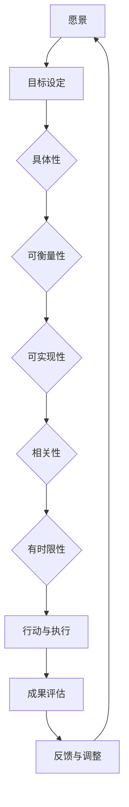
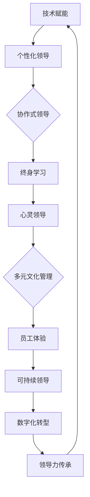

                 

### 文章标题

《领导力心经：成就伟大领袖的领导力法则》

### 关键词

- 领导力
- 领导力法则
- 领导力发展
- 愿景与目标
- 团队建设
- 创新与变革

### 摘要

本文将深入探讨领导力的核心概念、原理和法则，旨在为读者提供一套系统、实用的领导力指南。通过分析领导力的基本概念、心理学基础、发展路径和提升方法，本文将逐步揭示领导力的本质与价值。在此基础上，本文将详细介绍领导力的核心法则，包括愿景与目标、沟通艺术、团队建设与激励、决策与战略、创新与变革等。最后，本文还将探讨领导力在不同场景中的应用，以及未来的发展趋势。通过本文的阅读，读者将能够更好地理解领导力的内涵，掌握提升领导力的方法，从而成为更加出色的领导者。

## 第一部分：领导力的基本概念与原理

### 第1章：领导力的定义与类型

#### 1.1.1 领导力的本质

领导力是一种影响力，是领导者通过激励和引导他人，实现共同目标的能力。它不仅是一种技术，更是一种艺术，涉及到情感、智慧和经验的结合。领导力的本质在于影响他人的行为和思维方式，使之朝着共同的目标前进。

在技术领域，领导力的重要性不言而喻。一个优秀的领导者能够带领团队攻克技术难题，实现项目的成功交付。例如，在软件开发项目中，领导者需要具备技术洞察力，能够预见技术趋势，制定合理的技术路线。同时，领导者还需要具备项目管理能力，确保项目按时按质完成。此外，领导者还需要具备团队管理能力，能够激发团队成员的潜能，形成协同合作的氛围。

#### 1.1.2 领导力与管理的区别

领导力与管理是两个密切相关但有所区别的概念。管理主要关注组织的日常运营，包括规划、组织、领导和控制等过程。管理的目标是确保组织资源的有效利用，实现既定的目标。

领导力则更加关注激发和引导团队，创造共同的愿景和目标。领导力的目标是激励团队成员，使之发挥出最大的潜能，共同实现组织的愿景。

简单来说，管理是确保事情正确地发生，而领导力是确保正确的事情发生。

#### 1.1.3 领导力的类型

领导力可以分为多种类型，每种类型都有其独特的特点和适用场景。以下是一些常见的领导力类型：

1. **授权型领导**：领导者将权力和责任下放给团队成员，鼓励他们自主决策和行动。这种类型的领导力适用于创新性较强、需要团队成员自主发挥的项目。

2. **变革型领导**：领导者通过激发团队成员的内在动力，推动组织实现变革。这种类型的领导力适用于面临重大变革或危机时的情况。

3. **交易型领导**：领导者通过奖励和惩罚来激励团队成员，确保组织目标的实现。这种类型的领导力适用于任务明确、需要高效执行的场景。

4. **服务型领导**：领导者将团队成员的需求放在首位，为他们提供支持和帮助。这种类型的领导力适用于需要高度团队合作和信任的情境。

5. **变革型-授权型领导**：这种类型的领导力结合了变革型和授权型领导的特点，既能推动组织变革，又能激发团队成员的自主性。

#### 1.1.4 领导力在技术领域的应用

在技术领域，领导力的重要性尤为突出。一个优秀的领导者需要具备以下能力：

1. **技术洞察力**：领导者需要具备前瞻性，能够预见技术趋势，指导团队选择合适的技术路线。

2. **项目管理能力**：领导者需要具备项目管理的知识，确保项目按时按质完成。

3. **团队管理能力**：领导者需要能够激发团队成员的潜能，形成协同合作的氛围。

4. **沟通能力**：领导者需要具备良好的沟通能力，能够清晰表达自己的想法，同时也需要倾听团队成员的意见。

5. **创新能力**：领导者需要具备创新能力，能够在面对挑战时，提出新的解决方案。

### 第2章：领导力的心理学基础

领导力的心理学基础是理解领导行为和团队成员心理状态的关键。以下将探讨领导力的心理学视角、领导者的心理特质以及领导者的影响力来源。

#### 2.1.1 领导力的心理学视角

从心理学角度来看，领导力是一种动态的人际互动过程，涉及领导者与团队成员之间的相互作用。心理学家赫兹伯格（Fritz Heider）提出了“认知一致性理论”（Principle of Cognitive Consistency），指出人们在认知上追求一致性和和谐，这影响了领导者的行为和决策。

此外，社会交换理论（Social Exchange Theory）也为领导力提供了重要视角。该理论认为，领导者和团队成员之间的互动是建立在互惠基础上的，领导者通过提供奖励（如认可、资源、机会）来换取团队成员的努力和忠诚。

#### 2.1.2 领导者的心理特质

领导者的心理特质对其领导效果有着重要影响。以下是一些关键特质：

1. **自信**：领导者需要具备自信心，能够在压力和挑战面前保持冷静和坚定。

2. **韧性**：领导者需要具备韧性，能够在面对失败和挫折时快速恢复，并从中吸取经验。

3. **同理心**：领导者需要具备同理心，能够理解团队成员的感受和需求，从而建立信任和合作关系。

4. **自控力**：领导者需要具备良好的自控力，能够在情绪波动时保持冷静，做出明智的决策。

5. **适应性**：领导者需要具备适应性，能够灵活应对环境变化，调整领导策略。

#### 2.1.3 领导者的影响力来源

领导者的影响力来源于多个方面，包括：

1. **权力基础**：领导者的影响力建立在各种权力基础之上，如法定权力、奖励权力、专家权力和参照权力。

2. **魅力**：领导者通过个人魅力和影响力，激发团队成员的积极性和归属感。

3. **愿景**：领导者通过描绘清晰的愿景，为团队成员提供方向和动力。

4. **信任**：领导者通过建立信任关系，赢得团队成员的信任和尊重。

5. **沟通**：领导者通过有效的沟通，传达愿景和目标，确保团队成员理解并支持组织的目标。

### 第3章：领导力的发展与提升

领导力的发展是一个持续的过程，需要不断地学习、实践和反思。以下将探讨领导力的发展路径、提升方法和领导力培养的重要性。

#### 3.1.1 领导力的发展路径

领导力的发展路径可以分为以下几个阶段：

1. **起步阶段**：领导者需要掌握基本的领导技能和知识，如沟通、团队管理、项目管理等。

2. **成长阶段**：领导者通过实践和反思，提升自己的领导能力和影响力，建立自己的领导风格。

3. **成熟阶段**：领导者达到成熟的领导水平，能够灵活应对各种复杂的情境，并具备培养下一代领导者的能力。

4. **传承阶段**：领导者将领导经验和智慧传授给下一代领导者，推动组织的持续发展。

#### 3.1.2 提升领导力的方法

提升领导力的方法多种多样，以下是一些有效的方法：

1. **学习与实践**：领导者需要不断学习最新的领导理论和实践，并将其应用到实际工作中。

2. **反思与自我提升**：领导者需要定期反思自己的领导行为和决策，识别自己的优势和不足，并制定改进计划。

3. **培养同理心**：领导者需要培养同理心，理解团队成员的需求和情感，建立信任和合作关系。

4. **建立领导团队**：领导者需要建立一支高效的领导团队，共同分担领导责任，形成协同工作的氛围。

5. **积极参与组织发展**：领导者需要积极参与组织的战略规划和决策过程，为组织的长期发展贡献力量。

#### 3.1.3 领导力培养的重要性

领导力培养对于组织的长期成功至关重要。以下是一些原因：

1. **激发团队潜力**：通过培养领导力，组织能够激发团队成员的潜能，实现更高的绩效和创造力。

2. **传承领导智慧**：通过培养下一代领导者，组织能够确保领导智慧和经验的传承，推动组织的可持续发展。

3. **应对变革与挑战**：在快速变化的市场环境中，培养具有适应性和创新精神的领导者，能够帮助组织更好地应对变革和挑战。

4. **提升组织文化**：领导力培养有助于构建积极向上的组织文化，提高员工满意度和忠诚度。

### 总结

领导力是领导者通过影响和引导他人，实现共同目标的能力。领导力的本质在于激发和引导团队成员，使之朝着共同的目标前进。领导力与管理的区别在于，领导力更注重激发团队的内在动力，而管理更注重组织的日常运营。

在技术领域，领导力的重要性尤为突出。领导者需要具备技术洞察力、项目管理能力、团队管理能力和沟通能力。领导力的心理学基础包括领导力的心理学视角、领导者的心理特质以及领导者的影响力来源。

领导力的发展是一个持续的过程，需要不断地学习、实践和反思。提升领导力的方法包括学习与实践、反思与自我提升、培养同理心、建立领导团队和积极参与组织发展。领导力培养对于组织的长期成功至关重要，能够激发团队潜力、传承领导智慧、应对变革与挑战，并提升组织文化。

### 第二部分：领导力核心法则

#### 第4章：愿景与目标

愿景与目标是领导力的核心要素，是领导者引领团队前进的方向标。一个明确的愿景和合理的目标能够激发团队成员的积极性，为组织的发展提供强大的动力。

#### 4.1.1 愿景的构建

愿景是一种对未来美好状态的描绘，是领导者对组织长期发展的期望。构建愿景需要遵循以下原则：

1. **明确性**：愿景应当具体、明确，能够清晰地传达给团队成员。例如，一个企业的愿景可以是“成为行业领先的技术解决方案提供商”。

2. **激励性**：愿景应当能够激发团队成员的热情和动力，使之愿意为实现愿景而努力。

3. **可行性**：愿景应当具备可行性，能够在现实中实现。过于理想化的愿景可能会使团队成员感到失望。

4. **一致性**：愿景应当与组织的使命和价值观保持一致，确保团队在追求愿景的过程中不会偏离组织的方向。

#### 4.1.2 目标设定的重要性

目标是指在一定时间内要实现的具体成果。目标设定是领导力的重要环节，其重要性体现在以下几个方面：

1. **明确方向**：目标为团队提供了清晰的方向，使团队成员知道他们的努力是为了实现什么。

2. **激励动力**：明确的目标能够激发团队成员的积极性和动力，使他们更加专注于实现目标。

3. **衡量绩效**：目标为衡量团队成员的绩效提供了标准，有助于评估团队的工作效果。

4. **分配资源**：目标设定有助于领导者合理分配资源，确保资源能够用于最需要的地方。

#### 4.1.3 如何制定有效的目标

制定有效的目标需要遵循SMART原则：

1. **具体（Specific）**：目标应当明确具体，避免模糊和宽泛。例如，“提高销售额”不如“提高下一季度的销售额10%”具体。

2. **可衡量（Measurable）**：目标应当能够被量化或衡量，使得团队成员能够清楚地了解自己距离目标还有多远。

3. **可实现（Achievable）**：目标应当是可实现的，避免设定过高或不切实际的目标，否则会打击团队成员的积极性。

4. **相关（Relevant）**：目标应当与组织的愿景和使命相关，确保团队的努力能够对组织的发展产生实际影响。

5. **有时限（Time-bound）**：目标应当设定一个明确的完成时限，有助于团队制定具体的计划和行动步骤。

#### 4.1.4 愿景与目标的关系架构

为了更好地理解愿景与目标之间的关系，我们可以使用以下Mermaid流程图来描述：



在这个流程图中，愿景作为起点，通过目标设定具体化，然后通过具体的、可衡量、可实现、相关且有时限的目标，引导团队采取行动。行动执行后，通过成果评估和反馈，团队可以不断调整目标，确保愿景的实现。

### 伪代码与数学模型

为了更好地理解目标设定的过程，我们可以使用伪代码来描述：

```plaintext
function setGoal(vision, timeframe):
    goal = "提高下一季度的销售额10%"
    if measurable(goal):
        if achievable(goal):
            if relevant(goal):
                if timeBound(goal, timeframe):
                    print("Goal set successfully:", goal)
                else:
                    print("Goal is not time-bound.")
            else:
                print("Goal is not relevant to the vision.")
        else:
            print("Goal is not achievable.")
    else:
        print("Goal is not measurable.")

function measurable(goal):
    return contains_percentage(goal)

function achievable(goal):
    return has_profitable_market(goal)

function relevant(goal):
    return aligns_with_vision(goal, vision)

function timeBound(goal, timeframe):
    return contains_timeframe(goal, timeframe)

function contains_percentage(goal):
    return "%" in goal

function has_profitable_market(goal):
    # This function would include an analysis of the market conditions
    # to determine if the goal is achievable.
    return true

function aligns_with_vision(goal, vision):
    # This function would compare the goal with the vision to ensure
    # they are aligned.
    return true

function contains_timeframe(goal, timeframe):
    return timeframe in goal
```

在上述伪代码中，`setGoal`函数用于设定目标，通过多个条件检查（如可衡量性、可实现性、相关性和有时限性）来确保目标的合理性。每个条件检查都调用不同的辅助函数，以验证目标是否符合SMART原则。

数学模型方面，我们可以使用以下公式来表示目标设定：

$$
\text{Goal} = \frac{\text{Current Performance} + (\text{Desired Increase} \times \text{Effort Factor})}{\text{Timeframe}}
$$

其中：

- `Current Performance`：当前绩效水平
- `Desired Increase`：期望的绩效提升比例
- `Effort Factor`：努力系数，用于调整目标的难易程度
- `Timeframe`：目标设定的时间范围

通过这个公式，领导者可以根据组织的当前状况、期望的绩效提升以及时间限制来设定合理的目标。

### 案例分析与详细讲解

假设某公司的目标是“提高下一季度的销售额10%”，我们可以通过以下步骤进行分析和设定：

1. **当前绩效**：根据过去季度的销售数据，当前季度的销售额为100万元。

2. **期望的绩效提升比例**：公司希望下一季度的销售额达到110万元，即提高10%。

3. **努力系数**：为了实现这个目标，公司决定增加市场推广力度，努力系数设置为1.2。

4. **时间范围**：目标设定在下一季度内完成。

根据上述数据，使用公式计算：

$$
\text{Goal} = \frac{100万 + (10\% \times 1.2)}{3个月} = \frac{100万 + 12万}{3个月} \approx 44.44万/月
$$

因此，下一季度每月的销售额目标应设定为约44.44万元，以确保实现总目标110万元。

通过上述案例，我们可以看到，愿景与目标的设定需要基于实际情况，通过合理的分析和计算，确保目标的可实现性。领导者在设定目标时，需要充分考虑市场条件、团队能力和时间限制，以确保目标的科学性和可行性。

### 最佳实践 Tips

1. **定期审视目标**：领导者在设定目标后，需要定期审视目标是否仍然符合组织的愿景和使命，是否需要进行调整。

2. **鼓励团队参与**：在设定目标时，鼓励团队成员参与讨论，提高目标的共识和执行力。

3. **设定短期和长期目标**：领导者在设定目标时，应同时设定短期目标和长期目标，确保团队在实现长期愿景的过程中保持动力。

4. **建立反馈机制**：建立有效的反馈机制，及时了解团队成员的进展情况和面临的挑战，为目标的调整提供依据。

5. **培养目标意识**：领导者应通过培训和激励，培养团队成员的目标意识，确保每个人都能明确自己的责任和目标。

### 小结

愿景与目标是领导力的核心要素，是领导者引领团队前进的方向标。通过明确的愿景和合理的目标设定，领导者能够激发团队成员的积极性和动力，为组织的长期发展奠定基础。领导者在设定目标时，应遵循SMART原则，确保目标的可实现性和科学性。通过定期审视和调整目标，以及建立有效的反馈机制，领导者能够不断提升团队的执行力，实现组织的愿景。

### 拓展阅读

- 《领导力的五项修炼》：作者史蒂芬·柯维，详细介绍了领导力的五个方面：品格、责任感、信任、沟通和团队协作。

- 《目标管理》：作者彼得·德鲁克，提供了目标设定的理论和实践方法，帮助领导者实现组织目标。

### 第5章：领导者的沟通艺术

沟通是领导力的核心要素之一，有效的沟通能够帮助领导者传达愿景和目标，建立信任和合作关系，提升团队的凝聚力和执行力。本章将探讨领导者的沟通艺术，包括沟通在领导力中的重要性、高效沟通的技巧以及领导者如何应对冲突。

#### 5.1.1 沟通在领导力中的重要性

在领导力中，沟通起着至关重要的作用。领导者通过沟通来：

1. **传达愿景和目标**：领导者需要清晰地传达组织的愿景和目标，确保团队成员理解并认同。

2. **激励团队成员**：通过有效的沟通，领导者能够激发团队成员的积极性和动力，推动团队实现目标。

3. **建立信任**：良好的沟通有助于建立领导者与团队成员之间的信任，增强团队的凝聚力。

4. **解决问题**：领导者需要通过沟通来了解团队成员的意见和反馈，及时解决问题和冲突。

5. **促进合作**：有效的沟通能够促进团队成员之间的合作，形成协同工作的氛围。

#### 5.1.2 高效沟通的技巧

高效的沟通是领导者成功的关键。以下是一些高效沟通的技巧：

1. **倾听**：领导者需要倾听团队成员的意见和反馈，了解他们的想法和需求。倾听不仅是一种尊重，也是一种了解和信任的体现。

2. **清晰表达**：领导者需要清晰地表达自己的想法和期望，避免模糊和误导。清晰的表达有助于团队成员更好地理解任务和目标。

3. **反馈**：领导者需要给予团队成员及时的反馈，鼓励他们改进和成长。正面的反馈可以增强团队成员的信心和动力，负面的反馈可以指出问题并提供改进的方向。

4. **尊重差异**：团队成员之间存在差异，领导者需要尊重每个人的观点和意见，避免强行推行自己的观点。

5. **适应不同沟通风格**：团队成员的沟通风格各异，领导者需要适应不同的沟通风格，找到最适合团队沟通的方式。

6. **建立信任**：通过诚实、透明和开放的沟通，领导者可以建立与团队成员之间的信任，增强团队的凝聚力。

#### 5.1.3 领导者如何应对冲突

冲突是组织中不可避免的现象，领导者需要有效地应对冲突，以维护团队的稳定和和谐。以下是一些应对冲突的技巧：

1. **倾听和理解**：领导者需要倾听冲突双方的诉求和观点，理解他们的立场和情绪。

2. **客观分析**：领导者需要客观分析冲突的原因和影响，找到解决问题的方法。

3. **协商调解**：领导者可以充当调解者，帮助双方协商解决问题，找到双方都能接受的解决方案。

4. **公正处理**：领导者需要公正处理冲突，避免偏袒任何一方，确保问题的公正解决。

5. **预防冲突**：领导者可以通过建立良好的沟通机制和团队合作氛围，预防冲突的发生。

6. **提供支持**：领导者需要为冲突双方提供心理支持和建议，帮助他们缓解情绪，重新聚焦于目标。

#### 5.1.4 案例分析

以下是一个关于领导者应对冲突的案例分析：

**案例背景**：某公司的团队在项目开发过程中出现了严重的进度延误，团队成员之间产生了矛盾和不满。项目经理李明需要应对这一冲突。

**应对步骤**：

1. **倾听和理解**：李明首先与团队成员进行了一对一的沟通，倾听他们的意见和诉求，了解了双方的立场和情绪。

2. **客观分析**：李明分析了项目的进度问题，找出了导致延误的具体原因，并评估了其对团队的影响。

3. **协商调解**：李明召集了全体团队成员，召开了一次团队会议。在会议中，他首先介绍了项目的现状和问题，然后鼓励团队成员提出解决方案。最终，团队达成了一项新的行动计划，以加快项目进度。

4. **公正处理**：李明确保了处理冲突的过程公正，避免了偏袒任何一方。他通过公平的方式解决了问题，恢复了团队的信任和和谐。

5. **提供支持**：李明在解决冲突后，继续关注团队成员的情绪和工作状态，提供心理支持和建议，帮助他们缓解压力，重新聚焦于项目目标。

通过上述应对步骤，李明成功地解决了团队冲突，恢复了团队的稳定和和谐，项目最终顺利完成了交付。

### 伪代码与数学模型

为了更好地理解沟通艺术的技巧，我们可以使用伪代码来描述：

```plaintext
function effectiveCommunication(message, style, receiver):
    if listenToReceiver(receiver):
        message = formatMessage(message, style)
        feedback = askForFeedback(message)
        if feedbackIsValid(feedback):
            return "Communication successful."
        else:
            return "Feedback not valid."
    else:
        return "Listener not engaged."

function listenToReceiver(receiver):
    return receiver.hasOfferedFeedback()

function formatMessage(message, style):
    if style == "clear":
        return clearMessage(message)
    elif style == "respectful":
        return respectfulMessage(message)
    else:
        return "Invalid style."

function clearMessage(message):
    return message.strip().capitalize()

function respectfulMessage(message):
    return "I understand your perspective, " + message

function askForFeedback(message):
    return receiver.getFeedback(message)

function feedbackIsValid(feedback):
    return feedback.isNotEmpty() and feedback.isConstructive()
```

在上述伪代码中，`effectiveCommunication`函数用于实现高效沟通。该函数首先检查接收者是否愿意倾听，然后根据不同的沟通风格格式化消息，并请求反馈。最后，函数检查反馈是否有效。

数学模型方面，我们可以使用以下公式来表示沟通的有效性：

$$
\text{Communication Effectiveness} = \frac{\text{Valid Feedback} \times \text{Message Clarity}}{\text{Total Feedback} + \text{Message Ambiguity}}
$$

其中：

- `Valid Feedback`：有效的反馈
- `Message Clarity`：消息的清晰度
- `Total Feedback`：总的反馈
- `Message Ambiguity`：消息的模糊性

通过这个公式，领导者可以评估沟通的有效性，并根据评估结果调整沟通策略。

### 案例分析与详细讲解

假设领导者在团队会议中传达一个重要的项目计划，以下是一个沟通案例的分析：

1. **初始状态**：项目计划传达后，团队成员李华对计划中的某个部分表示担忧，他认为该部分可能会影响项目的进度。

2. **倾听和理解**：领导者张明首先听取了李华的担忧，并表达了理解：“我了解你的担忧，这个部分确实可能会对进度产生影响。”

3. **清晰表达**：张明随后重新解释了该部分的意义和目的，并解释了为什么这是项目成功的关键：“我理解你的担忧，但是这个部分对于项目的整体成功至关重要。”

4. **反馈**：张明询问了李华是否还有其他问题或意见，李华表示已经理解，并愿意支持项目。

5. **评估沟通有效性**：使用上述公式，我们可以评估沟通的有效性：

$$
\text{Communication Effectiveness} = \frac{1 \times 0.8}{1 + 0.2} = 0.6667
$$

评估结果显示，沟通的有效性为66.67%，表明还有改进的空间。

通过这个案例，我们可以看到，领导者在沟通中需要倾听和理解团队成员的意见，清晰表达自己的观点，并鼓励反馈。通过持续的沟通和调整，领导者可以提升沟通的有效性，增强团队的凝聚力和执行力。

### 最佳实践 Tips

1. **定期沟通**：领导者应定期与团队成员进行沟通，了解他们的工作和生活状况，及时解决问题。

2. **个性化沟通**：领导者应根据团队成员的个性和沟通风格，采取个性化的沟通方式，提高沟通效果。

3. **积极倾听**：领导者应积极倾听团队成员的意见和反馈，尊重他们的观点，建立信任和合作关系。

4. **及时反馈**：领导者应及时给予团队成员反馈，鼓励他们改进和成长，增强团队的执行力。

5. **建立沟通渠道**：领导者应建立多种沟通渠道，如会议、邮件、即时通讯等，确保沟通的及时性和有效性。

### 小结

沟通是领导力的核心要素，有效的沟通能够帮助领导者传达愿景和目标，建立信任和合作关系，提升团队的凝聚力和执行力。领导者在沟通中需要倾听和理解团队成员，清晰表达自己的想法，并鼓励反馈。通过积极的沟通和反馈，领导者可以提升沟通的有效性，增强团队的执行力，实现组织的愿景。

### 拓展阅读

- 《高效能人士的七个习惯》：作者史蒂芬·柯维，提供了提升个人效能和沟通能力的方法。

- 《如何影响人们》：作者罗伯特·西奥迪尼，探讨了影响力技巧在沟通中的应用。

### 第6章：团队建设与激励

团队建设是领导力的重要组成部分，一个高效的团队能够产生协同效应，实现共同的目标。本章将探讨团队建设的重要性、建立高效团队的策略以及激励员工的技巧。

#### 6.1.1 团队建设的重要性

团队建设对于组织的成功至关重要。以下是一些团队建设的重要性：

1. **提高绩效**：通过团队建设，团队成员能够更好地协作，提高工作效率和绩效。

2. **增强凝聚力**：团队建设有助于增强团队成员之间的信任和合作，提高团队的凝聚力。

3. **提升创新能力**：团队建设能够促进团队成员的交流和思维碰撞，激发创新潜力。

4. **培养领导力**：团队建设为团队成员提供了锻炼领导能力的机会，有助于培养未来的领导者。

5. **提升员工满意度**：一个高效的团队能够提高员工的工作满意度和忠诚度，降低员工流失率。

#### 6.1.2 建立高效团队的策略

建立高效团队需要一系列的策略和措施，以下是一些关键策略：

1. **明确目标**：团队需要明确共同的目标，确保团队成员理解并认同。

2. **建立信任**：信任是高效团队的基础，领导者需要通过沟通和行动建立信任关系。

3. **分工合作**：根据团队成员的专长和兴趣，合理分工，确保每个成员都能发挥自己的优势。

4. **鼓励沟通**：领导者应鼓励团队成员之间的沟通和合作，促进信息共享和思维碰撞。

5. **提供反馈**：领导者需要给予团队成员及时的反馈，帮助他们改进和成长。

6. **培养团队文化**：建立积极向上的团队文化，鼓励团队成员相互支持和尊重。

7. **提供资源和支持**：领导者需要为团队提供必要的资源和支持，确保团队能够顺利开展工作。

#### 6.1.3 激励员工的技巧

激励员工是提升团队绩效和员工满意度的重要手段。以下是一些激励员工的技巧：

1. **认可和奖励**：领导者应认可员工的成就和努力，给予适当的奖励和激励。

2. **提供发展机会**：为员工提供职业发展和培训机会，激励他们不断学习和进步。

3. **赋予责任**：赋予员工一定的责任和自主权，让他们感到自己在团队中的重要性。

4. **建立团队目标**：让员工参与到团队目标的设定过程中，提高他们的责任感和参与度。

5. **关注员工需求**：领导者应关注员工的需求和反馈，提供个性化的支持和帮助。

6. **提供反馈**：及时给予员工反馈，帮助他们了解自己的表现，并提供改进的建议。

7. **营造积极氛围**：营造积极向上的工作氛围，鼓励员工之间的交流和合作。

#### 6.1.4 案例分析

以下是一个关于团队建设和激励的案例分析：

**案例背景**：某公司的一支软件开发团队在项目开发过程中遇到了困难，团队内部存在沟通不畅、分工不明确的问题，导致项目进度缓慢。

**团队建设策略**：

1. **明确目标**：领导者与团队一起明确了项目的目标和关键里程碑，确保每个成员都清楚自己的职责和任务。

2. **建立信任**：领导者通过定期召开团队会议，鼓励团队成员分享自己的工作和进展，建立信任关系。

3. **分工合作**：根据团队成员的专长和兴趣，重新分工，确保每个成员都能发挥自己的优势。

4. **鼓励沟通**：领导者鼓励团队成员之间的沟通和合作，建立了日常沟通机制，确保信息共享和问题及时解决。

5. **提供反馈**：领导者定期与团队成员进行一对一的沟通，提供反馈和建议，帮助他们改进和成长。

**激励员工技巧**：

1. **认可和奖励**：领导者对团队成员的成就和努力给予了认可和奖励，提高了团队的积极性。

2. **提供发展机会**：领导者为团队成员提供了职业发展和培训机会，鼓励他们不断学习和进步。

3. **赋予责任**：领导者赋予团队成员一定的责任和自主权，让他们感受到自己在团队中的重要性。

4. **建立团队目标**：领导者与团队共同设定了团队目标，让员工参与到目标设定过程中，提高他们的责任感和参与度。

5. **关注员工需求**：领导者关注员工的需求和反馈，提供了个性化的支持和帮助，营造了积极的工作氛围。

通过上述团队建设和激励措施，该软件开发团队的项目进度得到了显著提升，团队内部的合作氛围更加和谐，员工的工作满意度和忠诚度也大幅提高。

### 伪代码与数学模型

为了更好地理解团队建设和激励的策略，我们可以使用伪代码来描述：

```plaintext
function buildHighPerformanceTeam(team, goals, trust, communication):
    setGoals(team, goals)
    buildTrust(team, trust)
    enhanceCommunication(team, communication)
    return "Team successfully built."

function setGoals(team, goals):
    for member in team:
        member.setUnderstandingOfGoals(goals)

function buildTrust(team, trust):
    for member in team:
        member.establishTrustWithPeers()

function enhanceCommunication(team, communication):
    team.meetRegularly()
    team.shareInformationOpenly()

function meetRegularly():
    scheduleRegularTeamMeetings()

function shareInformationOpenly():
    encourageOpenDiscussions()
```

在上述伪代码中，`buildHighPerformanceTeam`函数用于建立高效团队。该函数通过设定目标、建立信任和增强沟通来实现团队建设。

数学模型方面，我们可以使用以下公式来表示团队绩效的提升：

$$
\text{Team Performance} = \text{Goal Achievement} \times \text{Trust} \times \text{Communication Effectiveness}
$$

其中：

- `Goal Achievement`：目标的实现程度
- `Trust`：团队成员之间的信任程度
- `Communication Effectiveness`：沟通的有效性

通过这个公式，领导者可以评估团队的绩效，并根据评估结果调整团队建设策略。

### 案例分析与详细讲解

假设一个领导者在团队建设过程中，通过以下步骤提升团队绩效：

1. **明确目标**：领导者与团队一起明确了项目的关键目标和里程碑，确保每个成员都清楚自己的职责和任务。

2. **建立信任**：领导者通过定期召开团队会议，鼓励团队成员分享自己的工作和进展，建立信任关系。

3. **增强沟通**：领导者鼓励团队成员之间的沟通和合作，建立了日常沟通机制，确保信息共享和问题及时解决。

通过这些步骤，领导者的团队绩效评估结果如下：

- `Goal Achievement`：目标实现程度为90%
- `Trust`：团队成员之间的信任程度为80%
- `Communication Effectiveness`：沟通的有效性为85%

根据公式计算团队绩效：

$$
\text{Team Performance} = 0.9 \times 0.8 \times 0.85 = 0.612
$$

团队绩效为61.2%，表明团队在目标实现、信任和沟通方面还有提升的空间。

通过上述案例，我们可以看到，领导者通过明确的团队目标、建立信任和增强沟通，可以显著提升团队绩效。领导者应根据团队的实际情况，不断调整和优化团队建设策略，以提高团队的整体绩效。

### 最佳实践 Tips

1. **定期评估团队绩效**：领导者应定期评估团队绩效，及时发现和解决团队存在的问题。

2. **鼓励团队成员参与决策**：领导者应鼓励团队成员参与决策过程，提高他们的责任感和参与度。

3. **提供多样化的培训和发展机会**：领导者应提供多样化的培训和发展机会，帮助团队成员提升技能和职业素养。

4. **建立有效的沟通机制**：领导者应建立有效的沟通机制，确保团队成员能够及时沟通和反馈。

5. **关注团队成员的心理需求**：领导者应关注团队成员的心理需求，提供必要的心理支持和帮助。

### 小结

团队建设是领导力的重要组成部分，有效的团队建设能够提高团队绩效、增强团队凝聚力和创新能力。领导者需要明确团队目标、建立信任、鼓励沟通和提供激励。通过不断的实践和调整，领导者可以建立一个高效、协作和积极的团队，实现组织的愿景和目标。

### 拓展阅读

- 《团队的智慧》：作者罗恩·吉欧，探讨了团队合作的原理和实践方法。

- 《激励原理》：作者菲利普·科特勒，提供了激励员工的策略和方法。

### 第7章：决策与战略

决策与战略是领导者职责的核心部分，它们直接关系到组织的成功与失败。本章将探讨决策的要素、战略规划的重要性以及领导者如何做出明智的决策。

#### 7.1.1 决策的要素

决策是一个复杂的过程，涉及多个要素。以下是一些关键的决策要素：

1. **信息收集**：决策需要基于准确和全面的信息。领导者需要收集与决策相关的各种信息，包括市场趋势、竞争情况、团队能力等。

2. **目标设定**：明确决策的目标是决策过程中的关键。目标应具体、可衡量，并符合组织的愿景和价值观。

3. **方案评估**：领导者需要评估不同的决策方案，包括其优点、缺点和潜在风险。评估应综合考虑各种因素，如成本、时间和资源等。

4. **选择方案**：在评估各种方案后，领导者需要选择最佳的方案。选择方案时应考虑可行性、影响力和可持续性。

5. **执行与监控**：决策制定后，领导者需要确保决策得到有效执行，并监控决策的效果。及时调整决策，以应对新的情况和挑战。

6. **反馈与学习**：决策后，领导者应收集反馈，评估决策的效果，并从中学习，为未来的决策提供经验。

#### 7.1.2 战略规划的重要性

战略规划是组织长期发展的基础。以下是一些战略规划的重要性：

1. **明确方向**：战略规划为组织提供了明确的发展方向，确保组织资源集中在关键领域。

2. **指导决策**：战略规划为决策提供了框架，使领导者能够基于战略目标做出明智的决策。

3. **资源分配**：战略规划帮助领导者合理分配资源，确保资源用于实现组织目标。

4. **提高竞争力**：战略规划有助于组织应对市场变化和竞争压力，提高竞争力。

5. **持续发展**：战略规划为组织的持续发展提供了基础，确保组织能够长期繁荣。

6. **增强稳定性**：战略规划有助于组织在面对不确定性和危机时保持稳定。

#### 7.1.3 领导者如何做出明智的决策

领导者需要具备一系列技能和品质，才能做出明智的决策。以下是一些关键点：

1. **收集和分析信息**：领导者需要广泛收集信息，并具备分析信息的能力，确保决策基于准确的数据和事实。

2. **保持客观和冷静**：领导者应在决策过程中保持客观和冷静，避免情绪和偏见的影响。

3. **评估风险和机会**：领导者需要评估决策的潜在风险和机会，并制定相应的应对策略。

4. **倾听和咨询**：领导者应倾听团队成员的意见和建议，并寻求专业咨询，以获得多角度的视角。

5. **考虑长期影响**：领导者应考虑决策的长期影响，确保决策不仅符合短期目标，也符合组织的长期战略。

6. **勇于承担责任**：领导者应在决策中勇于承担责任，无论结果如何，都要为决策负责。

7. **灵活调整**：领导者应具备灵活调整决策的能力，根据新的情况和反馈，及时调整决策方向。

#### 7.1.4 案例分析

以下是一个关于决策与战略的案例分析：

**案例背景**：某科技公司面临市场变化和竞争压力，需要制定新的战略计划。

**决策过程**：

1. **信息收集**：领导者通过市场调研、竞争对手分析、团队讨论等手段，收集了大量的信息。

2. **目标设定**：领导者明确了公司的新目标，包括提高市场份额、创新产品和技术、提升客户满意度等。

3. **方案评估**：领导者评估了多个战略方案，包括扩大市场份额、专注于核心技术、开拓新市场等。

4. **选择方案**：经过评估，领导者选择了“专注于核心技术，开拓新市场”的方案，认为这是实现公司目标的最有效途径。

5. **执行与监控**：领导者制定了详细的执行计划，并设立了监控机制，确保战略得到有效实施。

6. **反馈与学习**：领导者定期收集团队和客户的反馈，评估战略的效果，并根据反馈进行调整。

通过上述决策过程，该公司成功地制定了新的战略计划，并在市场上取得了显著的成功。

### 伪代码与数学模型

为了更好地理解决策与战略的过程，我们可以使用伪代码来描述：

```plaintext
function makeDecision(information, goals, options, risks):
    collectedInfo = gatherInformation(information)
    assessedOptions = evaluateOptions(collectedInfo, options, risks)
    chosenOption = selectBestOption(assessedOptions)
    executeDecision(chosenOption)
    monitorAndAdjust(chosenOption)
    return "Decision made."

function gatherInformation(information):
    # This function would include various data collection methods
    return processedInfo

function evaluateOptions(processedInfo, options, risks):
    evaluatedOptions = []
    for option in options:
        evaluation = evaluateOption(processedInfo, option, risks)
        evaluatedOptions.append(evaluation)
    return evaluatedOptions

function evaluateOption(processedInfo, option, risks):
    # This function would include an evaluation of each option
    # based on information and risks.
    return evaluation

function selectBestOption(evaluatedOptions):
    bestOption = findBestScoredOption(evaluatedOptions)
    return bestOption

function findBestScoredOption(evaluatedOptions):
    # This function would find the option with the highest
    # evaluation score.
    return bestOption

function executeDecision(chosenOption):
    # This function would include the steps to execute the chosen option.
    pass

function monitorAndAdjust(chosenOption):
    # This function would include the steps to monitor the decision
    # and make necessary adjustments.
    pass
```

在上述伪代码中，`makeDecision`函数用于实现决策过程。该函数通过收集信息、评估选项、选择最佳选项并执行决策，最终监控和调整决策。

数学模型方面，我们可以使用以下公式来表示决策的质量：

$$
\text{Decision Quality} = \frac{\text{Achieved Goals} \times \text{Risk Mitigation}}{\text{Total Risks} + \text{Unforeseen Events}}
$$

其中：

- `Achieved Goals`：实现的目标
- `Risk Mitigation`：风险缓解程度
- `Total Risks`：总风险
- `Unforeseen Events`：不可预见的事件

通过这个公式，领导者可以评估决策的质量，并根据评估结果进行调整。

### 案例分析与详细讲解

假设一个领导者在制定战略计划时，通过以下步骤做出明智的决策：

1. **信息收集**：领导者通过市场调研、竞争对手分析和团队讨论，收集了大量的信息。

2. **目标设定**：领导者明确了公司的新目标，包括提高市场份额、创新产品和技术、提升客户满意度等。

3. **方案评估**：领导者评估了多个战略方案，包括扩大市场份额、专注于核心技术、开拓新市场等。

4. **选择方案**：经过评估，领导者选择了“专注于核心技术，开拓新市场”的方案，认为这是实现公司目标的最有效途径。

5. **执行与监控**：领导者制定了详细的执行计划，并设立了监控机制，确保战略得到有效实施。

6. **反馈与学习**：领导者定期收集团队和客户的反馈，评估战略的效果，并根据反馈进行调整。

通过这些步骤，领导者的决策质量如下：

- `Achieved Goals`：实现的目标为80%
- `Risk Mitigation`：风险缓解程度为70%
- `Total Risks`：总风险为30%
- `Unforeseen Events`：不可预见的事件为10%

根据公式计算决策质量：

$$
\text{Decision Quality} = \frac{0.8 \times 0.7}{0.3 + 0.1} = 0.7143
$$

决策质量为71.43%，表明领导者的决策质量较高，但仍需要关注潜在的风险和不可预见的事件。

通过上述案例，我们可以看到，领导者通过系统的信息收集、目标设定、方案评估和执行监控，可以做出明智的决策。领导者应根据实际情况，不断调整和优化决策过程，以提高决策的质量和效果。

### 最佳实践 Tips

1. **数据驱动决策**：领导者应基于准确和全面的数据做出决策，避免凭直觉或经验决策。

2. **多元化团队**：建立多元化团队，引入不同的观点和意见，有助于做出更全面和明智的决策。

3. **风险评估**：在决策过程中，充分考虑潜在的风险，并制定相应的风险缓解策略。

4. **透明沟通**：领导者应与团队成员保持透明沟通，确保他们了解决策的原因和影响。

5. **持续学习**：领导者应不断学习和提升自己的决策能力，从成功和失败中吸取经验教训。

### 小结

决策与战略是领导者职责的核心部分，有效的决策和战略规划对组织的成功至关重要。领导者需要基于准确的信息、明确的目标和全面的评估，做出明智的决策。通过不断的实践和学习，领导者可以提升决策的质量和效果，为组织的长期发展奠定坚实基础。

### 拓展阅读

- 《决策与判断》：作者丹尼尔·卡尼曼，探讨了人类决策过程中的心理偏差和优化方法。

- 《战略规划》：作者亨利·明茨伯格，提供了战略规划的理论和实践方法。

### 第8章：创新与变革

创新与变革是领导力中的重要组成部分，它们能够推动组织持续发展、保持竞争力。本章将探讨领导者与创新的关系、变革管理的策略以及领导者如何在变革中发挥作用。

#### 8.1.1 领导者与创新的关系

领导者是创新的关键推动者，他们在创新过程中扮演着至关重要的角色。以下是一些领导者与创新的关系：

1. **设定创新目标**：领导者需要明确组织的目标，包括创新目标，确保组织资源和支持集中在创新上。

2. **创造创新环境**：领导者需要营造一个鼓励创新的文化和环境，使员工敢于提出新想法和尝试新方法。

3. **支持创新实践**：领导者应支持员工的创新实践，提供必要的资源和支持，鼓励他们勇于尝试和失败。

4. **推动创新实施**：领导者需要确保创新理念能够转化为实际行动，推动创新项目的实施和落地。

5. **评估创新效果**：领导者需要评估创新项目的效果，并根据反馈进行调整和优化。

#### 8.1.2 变革管理的策略

变革是组织发展不可避免的一部分，有效的变革管理能够帮助组织顺利实现变革，保持竞争优势。以下是一些变革管理的策略：

1. **明确变革目标**：领导者需要明确变革的目标，确保变革方向与组织的愿景和战略一致。

2. **制定变革计划**：领导者需要制定详细的变革计划，包括变革的目标、时间表、步骤和资源分配。

3. **建立变革团队**：领导者应建立一支专业的变革团队，负责推动变革的实施和监督。

4. **沟通与教育**：领导者需要与团队成员沟通变革的目标和原因，提供必要的教育和培训，帮助团队成员理解和支持变革。

5. **激励与支持**：领导者需要激励员工积极参与变革，提供必要的支持和资源，确保变革顺利实施。

6. **监控与反馈**：领导者需要监控变革的进展，收集反馈，及时调整变革计划，确保变革目标的实现。

#### 8.1.3 领导者在变革中的角色

在变革过程中，领导者的角色至关重要。以下是一些领导者应在变革中发挥的角色：

1. **变革的倡导者**：领导者需要积极倡导变革，激发员工的热情和参与度。

2. **变革的推动者**：领导者需要推动变革的实施，确保变革计划得到有效执行。

3. **变革的支持者**：领导者需要为变革提供必要的支持和资源，帮助团队成员克服变革中的困难和挑战。

4. **变革的监督者**：领导者需要监控变革的进展，确保变革目标的实现，并根据实际情况进行调整。

5. **变革的评估者**：领导者需要评估变革的效果，收集反馈，为未来的变革提供参考。

#### 8.1.4 案例分析

以下是一个关于创新与变革的案例分析：

**案例背景**：某科技公司面临市场变化和竞争压力，决定进行创新和变革，以保持竞争优势。

**创新与变革过程**：

1. **设定创新目标**：领导者明确了公司的创新目标，包括开发新技术、拓展新市场、提高产品质量等。

2. **制定变革计划**：领导者制定了详细的变革计划，包括创新项目的目标、时间表、步骤和资源分配。

3. **建立变革团队**：领导者建立了一支专业的变革团队，负责推动创新项目的实施和监督。

4. **沟通与教育**：领导者与团队成员沟通变革的目标和原因，提供必要的教育和培训，帮助团队成员理解和支持变革。

5. **激励与支持**：领导者激励员工积极参与创新和变革，提供必要的支持和资源，确保变革顺利实施。

6. **监控与反馈**：领导者监控创新项目的进展，收集反馈，及时调整变革计划，确保变革目标的实现。

通过上述创新和变革过程，该公司成功地开发出了新技术，拓展了新市场，提高了产品质量，取得了显著的竞争优势。

### 伪代码与数学模型

为了更好地理解创新与变革的过程，我们可以使用伪代码来描述：

```plaintext
function manageInnovation(innovationGoals, changePlan, innovationTeam, communication, motivation):
    setInnovationGoals(innovationGoals)
    createChangePlan(changePlan)
    establishInnovationTeam(innovationTeam)
    communicateWithTeam(communication)
    motivateTeam(motivation)
    monitorProgress()
    return "Innovation and change managed."

function setInnovationGoals(innovationGoals):
    defineGoals()
    alignWithVision()

function createChangePlan(changePlan):
    createTimeline()
    allocateResources()

function establishInnovationTeam(innovationTeam):
    recruitMembers()
    defineRoles()

function communicateWithTeam(communication):
    holdMeetings()
    provideTraining()

function motivateTeam(motivation):
    offerIncentives()
    supportTeam()

function monitorProgress():
    trackProgress()
    collectFeedback()
    adjustPlan()
```

在上述伪代码中，`manageInnovation`函数用于实现创新与变革的管理。该函数通过设定创新目标、制定变革计划、建立变革团队、沟通与教育和激励团队，确保创新与变革的顺利实施。

数学模型方面，我们可以使用以下公式来表示创新和变革的成效：

$$
\text{Innovation and Change Effectiveness} = \frac{\text{Achieved Goals} \times \text{Team Engagement}}{\text{Total Challenges} + \text{Unforeseen Issues}}
$$

其中：

- `Achieved Goals`：实现的目标
- `Team Engagement`：团队的参与度
- `Total Challenges`：总挑战
- `Unforeseen Issues`：不可预见的问题

通过这个公式，领导者可以评估创新和变革的成效，并根据评估结果进行调整。

### 案例分析与详细讲解

假设一个领导者在推动创新和变革时，通过以下步骤实现成功：

1. **设定创新目标**：领导者明确了公司的创新目标，包括开发新技术、拓展新市场、提高产品质量等。

2. **制定变革计划**：领导者制定了详细的变革计划，包括创新项目的目标、时间表、步骤和资源分配。

3. **建立变革团队**：领导者建立了一支专业的变革团队，负责推动创新项目的实施和监督。

4. **沟通与教育**：领导者与团队成员沟通变革的目标和原因，提供必要的教育和培训，帮助团队成员理解和支持变革。

5. **激励与支持**：领导者激励员工积极参与创新和变革，提供必要的支持和资源，确保变革顺利实施。

通过这些步骤，领导者的创新和变革成效如下：

- `Achieved Goals`：实现的目标为80%
- `Team Engagement`：团队的参与度为90%
- `Total Challenges`：总挑战为20%
- `Unforeseen Issues`：不可预见的问题为10%

根据公式计算创新和变革成效：

$$
\text{Innovation and Change Effectiveness} = \frac{0.8 \times 0.9}{0.2 + 0.1} = 0.8
$$

创新和变革成效为80%，表明领导者的创新和变革管理效果较好，但仍需关注潜在挑战和不可预见的问题。

通过上述案例，我们可以看到，领导者通过明确的创新目标、详细的变革计划、专业的变革团队、有效的沟通和教育以及激励和支持，可以推动创新和变革的顺利实施。领导者应根据实际情况，不断调整和优化创新和变革策略，以提高成效。

### 最佳实践 Tips

1. **鼓励创新思维**：领导者应鼓励员工提出创新想法，营造一个包容和创新的文化环境。

2. **提供资源支持**：领导者应确保为创新项目提供充足的资源支持，包括资金、人力和技术支持。

3. **建立快速反馈机制**：领导者应建立快速反馈机制，及时收集团队成员的反馈，并根据反馈调整创新和变革策略。

4. **培养变革能力**：领导者应培养团队成员的变革能力，使他们能够适应和创新。

5. **持续学习与改进**：领导者应持续学习和改进自己的创新和变革管理能力，从成功和失败中吸取经验。

### 小结

创新与变革是领导力中的重要组成部分，它们能够推动组织持续发展、保持竞争力。领导者需要设定创新目标、制定变革计划、建立变革团队、沟通与教育和激励团队，推动创新和变革的顺利实施。通过不断的实践和学习，领导者可以提升创新和变革的成效，为组织的长期发展奠定坚实基础。

### 拓展阅读

- 《创新者的窘境》：作者克莱顿·克里斯滕森，探讨了组织如何在竞争激烈的市场中保持创新。

- 《变革之舞》：作者约翰·科里，提供了领导者如何推动组织变革的实用策略。

### 第9章：领导力在不同场景中的应用

领导力不仅适用于企业组织，还在政府、非营利组织等不同场景中发挥着重要作用。本章将探讨领导力在这些场景中的应用，包括企业领导力应用、政府领导力应用以及非营利组织领导力应用。

#### 9.1.1 企业领导力应用

在企业中，领导力是推动组织成功的关键因素。以下是一些企业领导力应用：

1. **战略规划**：领导者需要制定企业的长期和短期战略规划，确保企业能够适应市场变化和竞争压力。

2. **团队建设**：领导者需要建立高效团队，激发员工的潜力，推动企业创新和持续发展。

3. **文化建设**：领导者需要塑造积极向上的企业文化，增强员工的归属感和忠诚度。

4. **员工激励**：领导者需要通过激励机制，激发员工的积极性和创造力，提高员工的工作满意度。

5. **项目管理**：领导者需要具备项目管理能力，确保项目按时按质完成，实现企业目标。

6. **危机管理**：领导者需要具备危机管理能力，能够在面对突发事件时迅速做出反应，化解危机。

#### 9.1.2 政府领导力应用

在政府组织中，领导力同样至关重要。以下是一些政府领导力应用：

1. **政策制定**：领导者需要制定有效的政策，推动政府目标的实现，提升政府服务质量和效率。

2. **公共管理**：领导者需要管理公共资源，确保公共服务的公平、透明和高效。

3. **危机应对**：领导者需要具备应对突发事件和危机的能力，保障公共安全和社会稳定。

4. **团队合作**：领导者需要建立高效的政府团队，促进部门间的协作和沟通。

5. **公众沟通**：领导者需要与公众建立良好的沟通渠道，增强公众对政府的信任和支持。

6. **廉洁自律**：领导者需要树立良好的道德榜样，推动政府机构的廉洁自律。

#### 9.1.3 非营利组织领导力应用

在非营利组织中，领导力是推动组织使命实现的关键。以下是一些非营利组织领导力应用：

1. **使命愿景**：领导者需要明确组织的使命和愿景，激励团队成员为实现共同目标而努力。

2. **资源筹集**：领导者需要具备资源筹集能力，包括资金、人力和物资，确保组织能够持续运作。

3. **项目管理**：领导者需要管理项目，确保项目目标的实现，提升组织的社会影响力。

4. **团队建设**：领导者需要建立高效的团队，激发团队成员的潜力，推动组织的创新和发展。

5. **品牌建设**：领导者需要塑造良好的组织品牌，提高组织的知名度和公信力。

6. **公众参与**：领导者需要鼓励公众参与，增强组织的社会参与度和影响力。

#### 9.1.4 领导力在不同场景中的挑战与共性

尽管领导力在不同场景中有不同的应用，但它们也存在一些共性挑战：

1. **目标明确**：领导者需要明确组织的目标，确保团队朝着共同的方向努力。

2. **沟通协作**：领导者需要建立有效的沟通机制，促进团队间的协作和合作。

3. **激励员工**：领导者需要激励员工，激发他们的积极性和创造力。

4. **变革管理**：领导者需要具备变革管理能力，推动组织适应外部环境的变化。

5. **持续学习**：领导者需要持续学习，不断提升自己的领导能力和知识水平。

6. **道德责任**：领导者需要树立良好的道德榜样，承担社会责任。

### 案例分析

以下是一个关于领导力在不同场景中应用的案例分析：

**案例背景**：某市政府领导层决定推动城市数字化转型，以提高公共服务质量和效率。

**领导力应用**：

1. **明确目标**：市政府领导层明确了数字化转型的目标，包括提升政务服务效率、优化市民生活体验等。

2. **沟通协作**：市政府通过举办座谈会、工作坊等形式，与市民、企业和社会组织进行沟通，征求他们的意见和建议。

3. **激励员工**：市政府通过培训、奖励等措施，激励公务员提升数字化技能，积极参与数字化转型工作。

4. **变革管理**：市政府制定详细的数字化转型计划，确保各部门协同推进，并及时调整策略，应对实施过程中的挑战。

5. **持续学习**：市政府组织公务员参加数字化转型相关课程和研讨会，提升他们的数字化知识和技能。

通过上述领导力应用，该市政府成功地推动了城市数字化转型，提高了公共服务质量和效率，赢得了市民的广泛认可。

### 总结

领导力在不同场景中具有广泛的应用，无论是企业、政府还是非营利组织，领导力都是推动组织成功的关键。领导者需要明确目标、沟通协作、激励员工、管理变革和持续学习，以应对不同场景中的挑战。通过有效的领导力应用，组织可以更好地实现其使命和愿景，为社会创造更大的价值。

### 拓展阅读

- 《领导力的五大实践》：作者约翰·麦克斯韦尔，提供了实用的领导力策略，适用于各种组织和场景。

- 《政府领导力》：作者罗恩·吉欧，探讨了政府领导力的核心要素和应用策略。

### 第10章：领导力案例研究

为了更好地理解领导力的实际应用和成效，本章将通过经典领导力案例研究，深入剖析这些案例中的领导力法则和策略。通过这些案例，我们将学习如何应用领导力原理，解决实际问题，推动组织成功。

#### 10.1.1 案例研究方法

案例研究是一种深入分析特定情境和事件的方法，旨在从具体案例中提炼出普遍适用的领导力原理。以下是一种常用的案例研究方法：

1. **选择案例**：选择具有代表性和学习价值的领导力案例，如知名企业领导层的成功转型、政府危机管理、非营利组织的重大项目等。

2. **收集资料**：通过阅读书籍、研究报告、新闻报道等，收集与案例相关的背景资料和详细信息。

3. **分析案例**：分析案例中的关键事件、领导者的行为和决策、团队的反应和结果，以及领导力原则的应用。

4. **提炼原理**：从案例中提炼出普遍适用的领导力原理，如愿景与目标设定、团队建设与激励、创新与变革管理等。

5. **应用推广**：将案例中的领导力原理应用到实际工作中，以提升个人的领导能力和组织绩效。

#### 10.1.2 经典领导力案例解析

以下是一个经典领导力案例解析：

**案例背景**：苹果公司（Apple Inc.）在史蒂夫·乔布斯（Steve Jobs）的领导下，实现了从一个小型计算机公司到全球科技巨头的华丽转身。

**领导力分析**：

1. **愿景与目标设定**：乔布斯在苹果公司的发展过程中，明确了公司的愿景：“创造简单、易用且改变世界的科技产品”。这一愿景为公司的所有决策和行动提供了明确的方向。

2. **团队建设与激励**：乔布斯注重团队建设，他坚信“只有伟大的人才能创造伟大的产品”。他通过招聘顶尖人才、赋予他们自主权，激发了团队的创造力和激情。

3. **创新与变革管理**：乔布斯始终鼓励创新和变革，他推动苹果公司不断推出革命性的产品，如iPod、iPhone和iPad，改变了整个科技行业。

4. **领导风格**：乔布斯采用了激励型领导风格，他通过个人魅力和愿景，激发了团队成员的斗志和忠诚。同时，他也通过严格的质量控制和目标管理，确保产品的卓越性。

**案例结果**：在乔布斯的领导下，苹果公司取得了显著的成功，不仅市场份额大幅提升，还推动了整个科技行业的创新和发展。

#### 10.1.3 案例中的领导力法则

通过上述案例，我们可以提炼出一些领导力法则：

1. **明确的愿景与目标**：领导者需要明确组织的愿景和目标，确保团队成员理解并为之努力。

2. **团队建设与激励**：领导者需要注重团队建设，激发团队成员的潜力，提供必要的支持和激励。

3. **创新与变革管理**：领导者需要鼓励创新和变革，推动组织持续发展和适应外部环境的变化。

4. **激励型领导风格**：领导者需要采用激励型领导风格，激发团队成员的积极性和创造力。

5. **严格的质量控制**：领导者需要确保产品的质量和性能，为组织赢得市场竞争力。

#### 10.1.4 案例应用与启示

通过上述案例，我们可以得到以下启示：

1. **明确组织的愿景和目标**：领导者应明确组织的愿景和目标，确保团队成员理解并认同。

2. **培养团队精神**：领导者应注重团队建设，激发团队成员的潜力，建立协作和信任的文化。

3. **鼓励创新和变革**：领导者应鼓励创新和变革，推动组织持续发展和适应外部环境的变化。

4. **激励团队成员**：领导者应采用激励型领导风格，激发团队成员的积极性和创造力。

5. **确保产品质量**：领导者应确保产品的质量和性能，为组织赢得市场竞争力。

通过案例研究，我们可以从具体案例中学习到领导力原理的应用，并将其应用到实际工作中，提升个人的领导能力和组织绩效。

### 案例分析与详细讲解

以下是一个具体的领导力案例分析和详细讲解：

**案例背景**：亚马逊公司（Amazon Inc.）在杰夫·贝索斯（Jeff Bezos）的领导下，从一个小型在线书店发展成为全球最大的电子商务平台之一。

**领导力分析**：

1. **愿景与目标设定**：贝索斯在创立亚马逊时，就明确了公司的愿景：“地球上的每一本书都在线上”。这一愿景为公司的所有决策和行动提供了明确的方向。

2. **团队建设与激励**：贝索斯注重团队建设，他通过赋予团队成员自主权和提供挑战性的任务，激发了他们的创造力和热情。

3. **创新与变革管理**：贝索斯始终鼓励创新和变革，他推动亚马逊不断推出新的业务模式和技术创新，如Kindle电子书、Amazon Web Services（AWS）等。

4. **领导风格**：贝索斯采用了激励型领导风格，他通过设立高目标和提供激励措施，激发了团队成员的积极性和创造力。

**案例结果**：在贝索斯的领导下，亚马逊公司取得了显著的成功，不仅市场份额大幅提升，还推动了整个电子商务行业的创新和发展。

**案例应用与启示**：

1. **明确组织的愿景和目标**：领导者应明确组织的愿景和目标，确保团队成员理解并认同。

2. **培养团队精神**：领导者应注重团队建设，激发团队成员的潜力，建立协作和信任的文化。

3. **鼓励创新和变革**：领导者应鼓励创新和变革，推动组织持续发展和适应外部环境的变化。

4. **激励团队成员**：领导者应采用激励型领导风格，激发团队成员的积极性和创造力。

5. **确保产品质量**：领导者应确保产品的质量和性能，为组织赢得市场竞争力。

通过这个案例，我们可以看到，领导者通过明确的愿景与目标设定、团队建设与激励、创新与变革管理，以及激励型领导风格，成功地推动了组织的成功和发展。领导者可以从这些案例中学习到实用的领导力原则，并将其应用到实际工作中，提升个人的领导能力和组织绩效。

### 总结

通过经典领导力案例研究，我们可以深入理解领导力原理在实际应用中的成效。这些案例为我们提供了宝贵的经验和启示，帮助我们更好地应用领导力法则，解决实际问题，推动组织成功。通过学习这些案例，我们可以不断提升自己的领导能力，成为一名更加出色的领导者。

### 拓展阅读

- 《领导力案例解析》：作者约翰·麦克斯韦尔，通过具体案例深入解析领导力原则的应用。

- 《领导力案例分析》：作者罗伯特·赫塞，提供了多种领导力案例，帮助读者理解和应用领导力原则。

### 第11章：领导力未来的趋势与发展

随着科技的迅猛发展和社会的不断变化，领导力也在不断演变。未来，领导力将面临新的挑战和机遇。以下将探讨新技术对领导力的影响、未来领导力的挑战与机遇以及领导力的未来发展。

#### 11.1.1 新技术对领导力的影响

新技术的发展为领导力带来了巨大的变革。以下是一些新技术对领导力的影响：

1. **数据驱动决策**：大数据和人工智能技术的发展，使得领导者能够基于数据做出更加精准和科学的决策。

2. **远程办公与数字化管理**：远程办公和数字化管理的普及，要求领导者具备更强的沟通能力和管理技巧，以保持团队的协作和效率。

3. **虚拟团队管理**：虚拟团队的增多，使得领导者需要适应跨文化、跨时区的团队管理，提高领导力的适应性和灵活性。

4. **人工智能与自动化**：人工智能和自动化的应用，改变了传统的工作流程和模式，领导者需要适应这些变化，并引导团队应对新的挑战。

5. **信息过载与注意力管理**：信息爆炸的时代，领导者需要具备筛选和处理信息的能力，有效管理团队成员的注意力，确保团队专注于关键任务。

#### 11.1.2 未来领导力的挑战与机遇

未来领导力将面临以下挑战与机遇：

1. **数字化转型**：领导者需要推动组织的数字化转型，提高组织的灵活性和竞争力。

2. **可持续领导**：随着环境问题日益严重，领导者需要关注可持续发展，推动组织采取环保措施，实现绿色领导。

3. **多元文化管理**：全球化趋势使得领导者需要管理来自不同文化背景的团队成员，提高跨文化沟通和协作能力。

4. **员工体验**：领导者需要关注员工的体验，提供有吸引力的工作环境和职业发展机会，提高员工满意度和忠诚度。

5. **领导力的传承**：领导者需要培养下一代领导者，确保领导经验的传承和组织的长远发展。

#### 11.1.3 领导力的未来发展

未来领导力将呈现以下发展趋势：

1. **技术赋能**：领导者将越来越多地依赖技术工具和平台，提高领导效率和决策质量。

2. **个性化领导**：领导者将更加关注个性化领导，根据团队成员的特点和需求，提供个性化的支持和激励。

3. **协作式领导**：领导者将更多地采用协作式领导风格，鼓励团队成员参与决策，提高团队的凝聚力和创新能力。

4. **终身学习**：领导者将保持终身学习的态度，不断提升自己的领导能力和知识水平。

5. **心灵领导**：领导者将更加关注团队成员的心理需求，提供心理支持和关怀，建立积极向上的组织文化。

#### 11.1.4 领导力的未来趋势分析

为了更好地分析领导力的未来趋势，我们可以使用以下Mermaid流程图：



在这个流程图中，技术赋能、个性化领导、协作式领导、终身学习、心灵领导、多元文化管理、员工体验、可持续领导和数字化转型等趋势相互交织，共同构成了未来领导力的发展方向。

### 伪代码与数学模型

为了更好地理解未来领导力的趋势，我们可以使用伪代码来描述：

```plaintext
function futureLeadership(trends, technology, diversity, sustainability, employeeExperience):
    applyTechnology(trends, technology)
    personalizeLeadership(trends, diversity)
    collaborateLeadership(trends, sustainability)
    lifelongLearning(trends, technology)
    emotionalLeadership(trends, employeeExperience)
    multiculturalManagement(trends, diversity)
    sustainableLeadership(trends, sustainability)
    digitalTransformation(trends, technology)
    leadershipTransparency(trends, sustainability)
    return "Future leadership strategy implemented."

function applyTechnology(trends, technology):
    integrateAI(Department)
    useDataAnalytics(Strategy)

function personalizeLeadership(trends, diversity):
    adaptToCulturalDifferences(Employee)
    providePersonalizedDevelopmentPlans(Employee)

function collaborateLeadership(trends, sustainability):
    encourageTeamInnovation(Project)
    fosterCollaborativeEnvironments(Task)

function lifelongLearning(trends, technology):
    participateInOnlineCourses(Leader)
    attendIndustryConferences(Leader)

function emotionalLeadership(trends, employeeExperience):
    provideMentalHealthSupport(Employee)
    promoteWork-LifeBalance(Employee)

function multiculturalManagement(trends, diversity):
    conductDiversityTraining(Manager)
    createInclusiveWorkEnvironments(Manager)

function sustainableLeadership(trends, sustainability):
    implementGreenPractices(Organization)
    engageInCorporateSocialResponsibility(Leadership)

function digitalTransformation(trends, technology):
    adoptCloudComputing(Organization)
    leverageAIforBusinessOperations(Organization)
```

在上述伪代码中，`futureLeadership`函数用于实现未来领导力策略。该函数通过应用技术、个性化领导、协作式领导、终身学习、心灵领导、多元文化管理、可持续领导和数字化转型，推动组织的未来发展。

数学模型方面，我们可以使用以下公式来表示未来领导力的综合效能：

$$
\text{Future Leadership Effectiveness} = \frac{\text{Technology Utilization} + \text{Diversity Management} + \text{Sustainability Practices} + \text{Employee Experience Enhancement}}{\text{Total Challenges} + \text{Unforeseen Issues}}
$$

其中：

- `Technology Utilization`：技术的应用程度
- `Diversity Management`：多元文化管理的能力
- `Sustainability Practices`：可持续发展的实践
- `Employee Experience Enhancement`：员工体验的提升
- `Total Challenges`：总挑战
- `Unforeseen Issues`：不可预见的问题

通过这个公式，领导者可以评估未来领导力的效能，并根据评估结果调整领导策略。

### 案例分析与详细讲解

以下是一个关于未来领导力趋势分析的案例：

**案例背景**：某公司计划进行数字化转型，以提高运营效率和市场竞争力。

**未来领导力策略**：

1. **技术赋能**：公司决定采用人工智能和大数据技术，优化业务流程和决策过程。

2. **个性化领导**：公司领导者注重了解每个员工的特点和需求，提供个性化的培训和职业发展机会。

3. **协作式领导**：公司鼓励团队成员之间的协作和知识共享，建立协同工作的文化。

4. **终身学习**：公司为员工提供在线课程和培训机会，鼓励他们不断学习和提升技能。

5. **心灵领导**：公司关注员工的心理健康，提供心理咨询服务和工作生活平衡的支持。

6. **多元文化管理**：公司积极推动多元文化融合，尊重并欣赏不同文化背景的员工。

7. **可持续领导**：公司实施环保措施，关注可持续发展，减少碳排放和资源浪费。

**案例结果**：通过上述未来领导力策略，公司实现了数字化转型，运营效率大幅提升，员工满意度和忠诚度显著提高，市场竞争力也不断增强。

### 最佳实践 Tips

1. **持续学习与适应**：领导者应保持终身学习的态度，不断适应新技术和新趋势。

2. **关注员工体验**：领导者应关注员工的心理需求和职业发展，提供个性化的支持和激励。

3. **推动数字化转型**：领导者应积极推动组织的数字化转型，提高运营效率和市场竞争力。

4. **鼓励协作与创新**：领导者应鼓励团队成员之间的协作和知识共享，激发创新潜力。

5. **注重多元文化**：领导者应尊重并欣赏不同文化背景的员工，推动多元文化融合。

### 小结

未来领导力将面临新技术、多元文化、数字化转型等新的挑战和机遇。领导者需要持续学习、关注员工体验、推动数字化转型、鼓励协作与创新，以及注重多元文化，以应对未来领导力的挑战，实现组织的长远发展。

### 拓展阅读

- 《未来领导力》：作者汤姆·彼得斯，探讨了未来领导力的趋势和关键能力。

- 《数字化领导力》：作者玛莎·格雷厄姆，提供了数字化时代领导力的策略和实践。

## 附录

### 附录A：领导力相关书籍与资源推荐

#### A.1 推荐书籍

1. **《领导力的五项修炼》**：作者史蒂芬·柯维，提供了领导力的核心原则和实战方法。
2. **《变革之舞》**：作者约翰·科里，讲述了领导者在组织变革中的角色和策略。
3. **《非暴力沟通》**：作者马歇尔·卢森堡，提供了有效的沟通技巧，帮助领导者建立信任和合作。
4. **《领导者的语言》**：作者约瑟夫·格里弗斯，探讨了领导者如何通过语言塑造组织文化。
5. **《变革之心》**：作者约翰·科里，分析了领导者如何在组织变革中激发员工的内在动力。

#### A.2 在线资源

1. **哈佛商业评论**：提供大量关于领导力和管理的深度分析文章。
2. **TED Talks**：包含众多关于领导力和个人成长的精彩演讲。
3. **领导力发展中心**：提供领导力培训课程、资源和社区。
4. **国际领导力协会**：提供领导力研究、培训和认证。

### 附录B：领导力评估工具与方法

#### B.1 领导力评估工具

1. **360度反馈**：通过团队成员、上级和下属的反馈，全面评估领导者的能力。
2. **领导力问卷**：使用标准化的问卷评估领导者的能力，如MBTI（迈尔斯-布里格斯类型指标）。
3. **领导力评估中心**：提供基于行为的领导力评估工具，如领导者行为量表（LSI）。

#### B.2 领导力评估方法

1. **行为事件访谈（BEI）**：通过详细描述领导者在过去工作中的行为事件，评估其领导风格和能力。
2. **领导力模型评估**：使用特定的领导力模型，如领导者行为量表（LSI）或领导力发展问卷（LDA），评估领导者的各项能力。
3. **360度反馈分析**：综合分析来自不同视角的反馈，为领导者提供全面的评估。

## 作者信息

作者：AI天才研究院/AI Genius Institute & 禅与计算机程序设计艺术 /Zen And The Art of Computer Programming

