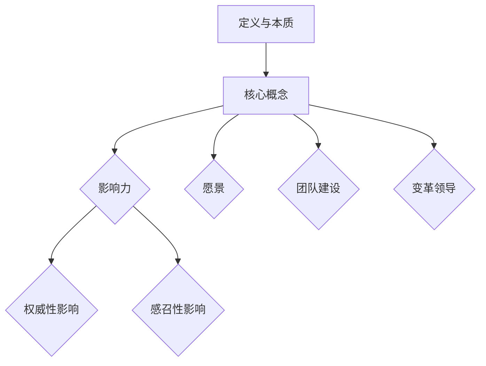
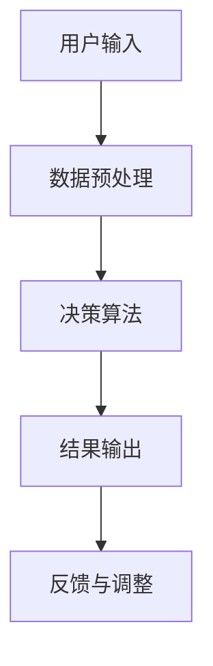
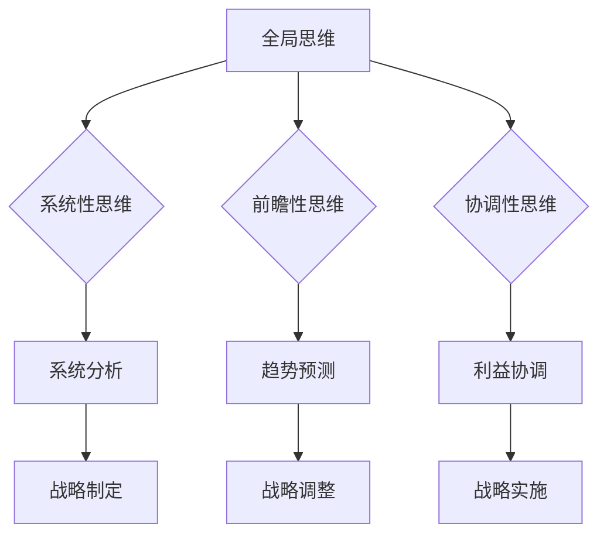
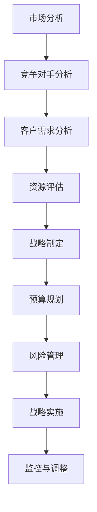

                 


### 概述与背景

#### 文章标题：《领导力思维：改变世界格局的领导力修炼法则》

领导力，作为一种独特的力量，能够推动个体、团队和组织不断向前发展。在现代商业社会中，领导力的重要性愈发凸显。本文旨在探讨领导力的核心概念、思维模式、实践应用以及未来发展，通过逐步分析推理，揭示领导力在各个层面的内在联系和运作机制。

#### 关键词：

- 领导力思维
- 领导力修炼
- 战略规划
- 创新思维
- 团队建设
- 国际化领导
- 社会治理

#### 摘要：

本文通过深入剖析领导力的核心概念与原理，探讨了领导力的思维模式，包括全局思维、创新思维和团队建设。在此基础上，本文进一步探讨了领导力在实践中的应用，包括组织管理、国际化背景下的应用以及社会治理中的领导力策略。最后，本文展望了未来领导力的发展趋势，并提出了领导力思维的修炼与提升方法。通过本文的探讨，读者可以全面理解领导力思维的精髓，掌握领导力修炼的法则。

## 第一部分：领导力的核心概念与原理

### 第1章：领导力的定义与本质

领导力，顾名思义，是一种引领、指导和激励他人共同实现目标的能力。然而，领导力并非仅仅是一种简单的管理技能，它更是一种深层次的思维方式和价值观。在这个复杂多变的世界中，领导力的重要性不言而喻。

#### 背景介绍

领导力的概念起源于人类社会的早期。在古代，领导者通常是部落的首领或国家的君主，他们通过权威和武力来维持社会的秩序和稳定。然而，随着社会的发展，领导力的内涵和外延也在不断扩展。现代领导力不仅关注个人的权力和地位，更强调领导者的责任和使命。

#### 核心概念与联系

为了更好地理解领导力，我们可以将其核心概念划分为以下几个方面：

1. **影响力**：领导力的核心在于影响力，即领导者通过言行和决策来影响他人。影响力可以分为权威性影响和感召性影响。权威性影响源于领导者的职位和权力，而感召性影响则源于领导者的个人魅力和价值观。

2. **愿景**：领导力的重要组成部分是愿景，即领导者对未来的设想和规划。一个明确的愿景可以激发团队成员的斗志和创造力，使他们愿意为共同的目标而努力。

3. **团队建设**：领导力不仅仅是领导者个人的能力，更依赖于团队的合作。领导者需要通过有效的团队建设，激发团队成员的潜力，实现团队的整体绩效。

4. **变革领导**：在快速变化的现代社会中，领导力还需要具备变革领导的能力。领导者需要具备前瞻性思维，引领团队适应和应对变化。

#### Mermaid 流程图



#### 核心算法原理讲解

领导力并非一个简单的算法，而是一种复杂的决策过程。以下是一个简化的领导力决策流程：

```pseudo
function 领导力决策(目标, 环境, 资源):
    1. 确定愿景：根据目标和环境，明确团队或组织的愿景。
    2. 分析资源：评估当前资源，确定可行的方案。
    3. 制定策略：根据愿景和资源，制定具体的行动计划。
    4. 激励团队：通过沟通和激励，使团队成员理解并支持愿景。
    5. 执行计划：根据行动计划，实施具体的行动。
    6. 监控与调整：对执行过程进行监控，并根据实际情况进行调整。
    7. 反馈与总结：对执行结果进行反馈和总结，为下一次决策提供参考。
```

#### 数学模型和公式

在领导力决策中，可以使用一些简单的数学模型来评估不同方案的风险和收益。以下是一个简单的决策树模型：

$$
\text{决策树模型} = (\text{方案1}, \text{收益1}, \text{风险1}) \cup (\text{方案2}, \text{收益2}, \text{风险2})
$$

其中，收益和风险可以用数值来表示，决策树模型可以帮助领导者比较不同方案的优势和劣势。

#### 举例说明

假设一个公司的领导者需要决定是否进行新产品开发。通过评估市场调研数据和现有资源，领导者可以制定两个方案：

1. **方案1**：开发一款具有创新功能的产品，预期收益为100万元，风险为50万元。
2. **方案2**：对现有产品进行改进，预期收益为50万元，风险为20万元。

根据决策树模型，领导者可以计算出两个方案的期望收益和风险：

$$
\text{方案1的期望收益} = 100 \times 0.5 = 50 \text{万元}
$$

$$
\text{方案1的风险} = 50 \times 0.5 = 25 \text{万元}
$$

$$
\text{方案2的期望收益} = 50 \times 0.8 = 40 \text{万元}
$$

$$
\text{方案2的风险} = 20 \times 0.2 = 4 \text{万元}
$$

通过比较两个方案的期望收益和风险，领导者可以做出更加明智的决策。

#### 项目实战

在领导力决策的实际应用中，我们可以通过开发一个简单的决策支持系统来帮助领导者做出更加科学的决策。以下是一个简单的决策支持系统架构：



用户可以通过输入目标和环境信息，系统会根据预定的决策算法生成不同的方案，并将结果输出给用户。用户可以根据反馈进行调整，优化决策过程。

#### 最佳实践 tips

1. **充分了解环境**：领导者在做出决策时，需要充分了解当前的环境和趋势，以便制定符合实际的决策。
2. **重视团队建设**：领导者需要通过有效的团队建设，激发团队成员的潜力，提高团队的整体绩效。
3. **持续学习和反思**：领导者需要不断学习和反思，以提高自身的领导力水平。

### 小结

领导力是一种复杂的决策过程，它涉及到多个层面的因素。通过逐步分析和推理，我们可以更好地理解领导力的核心概念和运作机制。在接下来的章节中，我们将进一步探讨领导力的思维模式和实践应用，帮助读者掌握领导力的精髓。

## 第二部分：领导力思维模式

### 第2章：全局思维与战略规划

全局思维，亦称宏观思维，是一种从整体的角度看待问题的思维方式。在领导力中，全局思维尤为重要，因为它可以帮助领导者把握大局，制定长远的战略规划。

#### 背景介绍

在现代社会，企业和组织面临着越来越多的复杂性和不确定性。全局思维作为一种战略思维，能够帮助领导者从宏观层面审视问题，发现潜在的机会和风险，从而制定更加科学和有效的战略。

#### 核心概念与联系

全局思维的核心概念包括以下几个方面：

1. **系统性**：全局思维强调系统性的思考，即从整体和系统的角度看待问题，理解各部分之间的相互关系。
2. **前瞻性**：全局思维要求领导者具备前瞻性，能够预见未来的发展趋势和变化，提前做出应对。
3. **协调性**：全局思维强调协调各个方面的利益，实现整体最优。

全局思维与战略规划之间的关系紧密相连。战略规划是一个长期的过程，需要领导者具备全局思维，从整体上规划组织的未来发展。

#### Mermaid 流程图



#### 核心算法原理讲解

全局思维的实现需要一系列的算法和工具，以下是一个简化的全局思维算法流程：

```pseudo
function 全局思维(问题, 数据):
    1. 数据收集：收集与问题相关的各种数据。
    2. 系统分析：分析各部分之间的相互关系，构建系统的整体视图。
    3. 趋势预测：利用历史数据和趋势分析工具，预测未来的发展趋势。
    4. 利益协调：分析各利益相关方的需求和利益，寻求平衡。
    5. 方案评估：根据系统分析和趋势预测，评估不同方案的优缺点。
    6. 决策制定：根据方案评估结果，制定具体的决策和行动计划。
    7. 实施与监控：执行决策，并持续监控和调整。
```

#### 数学模型和公式

在全局思维中，可以使用一些数学模型来分析和预测。以下是一个简单的趋势预测模型：

$$
\text{未来值} = \text{当前值} + (\text{增长率} \times \text{时间})
$$

其中，当前值、增长率和时间可以根据历史数据进行估算。

#### 举例说明

假设一个公司的领导者需要预测未来三年的销售增长率。通过收集过去五年的销售数据，领导者可以使用趋势预测模型进行预测：

1. **第一年**：当前值为100万元，增长率为10%。
2. **第二年**：当前值为110万元，增长率为10%。
3. **第三年**：当前值为121万元，增长率为10%。

根据趋势预测模型，未来三年的销售增长率分别为：

$$
\text{第一年增长率} = 100 + (0.1 \times 1) = 110 \text{万元}
$$

$$
\text{第二年增长率} = 110 + (0.1 \times 2) = 121 \text{万元}
$$

$$
\text{第三年增长率} = 121 + (0.1 \times 3) = 133.1 \text{万元}
$$

通过预测，领导者可以提前制定相应的销售策略。

#### 项目实战

在实际项目中，全局思维的应用可以帮助领导者制定长远的战略规划。以下是一个战略规划的项目框架：



领导者可以通过这个框架，从市场、竞争对手、客户需求、资源等多个方面进行全面分析，制定出科学有效的战略规划。

#### 最佳实践 tips

1. **多角度分析**：在全局思维中，领导者需要从多个角度进行问题分析，确保决策的全面性和科学性。
2. **持续学习**：领导者需要不断学习新的知识和技能，提高自身的全局思维能力。
3. **重视团队协作**：全局思维的实现需要团队协作，领导者需要培养团队成员的全局思维。

### 小结

全局思维是一种重要的领导力思维模式，它可以帮助领导者从宏观层面审视问题，制定长远的战略规划。通过逐步分析和推理，我们可以更好地理解全局思维的核心概念和运作机制。在接下来的章节中，我们将进一步探讨领导力思维中的创新思维和变革领导，帮助读者全面掌握领导力思维。

## 第三部分：领导力在实践中的应用

### 第3章：创新思维与变革领导

在快速变化的现代社会，创新思维和变革领导成为领导者不可或缺的能力。创新思维能够激发团队的创新活力，推动组织不断进步；而变革领导则能够引领组织应对外部环境的挑战，实现持续发展。

#### 背景介绍

随着科技的不断进步和市场环境的快速变化，企业和组织面临着前所未有的挑战。创新思维和变革领导成为领导者应对这些挑战的关键能力。通过创新思维，领导者可以激发团队的创造力，推出新的产品和服务；而通过变革领导，领导者可以推动组织进行系统性变革，适应新的市场环境。

#### 核心概念与联系

创新思维和变革领导的核心概念包括以下几个方面：

1. **创新思维**：创新思维是一种从不同角度思考问题的能力，它能够激发团队的创造力，推动组织的创新和发展。
2. **变革领导**：变革领导是一种推动组织进行系统性变革的能力，它能够帮助组织应对外部环境的挑战，实现持续发展。

创新思维和变革领导之间存在着紧密的联系。创新思维是变革领导的基础，只有具备创新思维，领导者才能推动组织进行有效的变革。而变革领导则是创新思维的具体实践，通过变革领导，领导者可以将创新思维转化为实际的行动和成果。

#### Mermaid 流程图

```mermaid
graph TD
    A[创新思维] --> B{创造力激发}
    A --> C{问题解决}
    A --> D{思维拓展}
    B --> E[团队协作]
    C --> F[原型设计]
    D --> G[思维碰撞}
    E --> H[创新成果]
    F --> I[产品迭代}
    G --> J[创新文化}
    H --> K[市场反馈]
    I --> L[持续创新]
    J --> M[组织变革}
    K --> N[效果评估}
    L --> O[变革领导]
    M --> P[组织适应}
    N --> Q[变革成功}
```

#### 核心算法原理讲解

创新思维和变革领导的实现需要一系列的算法和工具。以下是一个简化的创新思维和变革领导流程：

```pseudo
function 创新思维(问题, 团队):
    1. 问题分析：对问题进行深入分析，理解问题的本质和背景。
    2. 思维拓展：从不同角度思考问题，拓展思维空间。
    3. 原型设计：根据思维拓展的结果，设计问题的原型解决方案。
    4. 团队协作：组织团队进行讨论和碰撞，优化原型解决方案。
    5. 市场反馈：将原型解决方案推向市场，收集反馈。
    6. 产品迭代：根据市场反馈，对产品进行迭代和优化。

function 变革领导(组织, 环境):
    1. 变革分析：对组织当前状态和外部环境进行深入分析。
    2. 变革规划：制定具体的变革计划和行动方案。
    3. 团队协作：组织团队进行变革实施，确保变革的顺利进行。
    4. 效果评估：对变革效果进行评估，根据评估结果进行调整。
    5. 持续优化：根据评估结果，持续优化变革方案。

```

#### 数学模型和公式

在创新思维和变革领导中，可以使用一些数学模型来评估和创新。以下是一个简单的创新评估模型：

$$
\text{创新指数} = \frac{\text{创新成果}}{\text{投入资源}}
$$

其中，创新成果和投入资源可以通过定量和定性的方法进行评估。

#### 举例说明

假设一个公司的领导者需要推动一项新产品的研发。通过创新思维和变革领导，领导者可以制定以下流程：

1. **问题分析**：确定新产品需要解决的市场需求。
2. **思维拓展**：从不同角度思考产品设计和功能。
3. **原型设计**：设计产品的原型，并进行内部测试。
4. **团队协作**：组织团队成员进行讨论和优化，完善产品原型。
5. **市场反馈**：将产品原型推向市场，收集用户反馈。
6. **产品迭代**：根据用户反馈，对产品进行迭代和优化。

通过这个流程，领导者可以推动新产品的研发，实现持续创新。

#### 项目实战

在实际项目中，创新思维和变革领导的应用可以帮助组织实现持续创新和变革。以下是一个创新和变革项目案例：

1. **市场分析**：分析当前市场环境和竞争对手情况。
2. **客户需求**：了解客户需求和市场趋势。
3. **创新设计**：根据客户需求和市场趋势，设计创新产品。
4. **团队协作**：组织团队进行讨论和优化，完善创新产品。
5. **市场推广**：将创新产品推向市场，进行推广和销售。
6. **效果评估**：对创新产品进行效果评估，并根据评估结果进行优化。

通过这个项目，公司可以实现持续创新和变革，提升市场竞争力。

#### 最佳实践 tips

1. **鼓励创新**：领导者需要鼓励团队成员提出创新想法，并给予支持。
2. **变革计划**：领导者需要制定详细的变革计划，确保变革的顺利进行。
3. **持续学习**：领导者需要不断学习和掌握新的知识和技能，提高自身的创新能力和变革领导力。

### 小结

创新思维和变革领导是领导者应对快速变化环境的关键能力。通过逐步分析和推理，我们可以更好地理解创新思维和变革领导的核心概念和运作机制。在接下来的章节中，我们将进一步探讨领导力在团队建设中的关键作用，帮助读者全面掌握领导力实践。

## 第四部分：领导力思维的修炼与提升

### 第4章：自我认知与领导力成长

自我认知是领导力成长的基础，它帮助领导者理解自己的价值观、优势和劣势，从而更好地发挥领导力。自我认知不仅涉及个人层面的反思和提升，还包括在团队和组织层面的应用，以实现领导力的全面提升。

#### 背景介绍

在领导力的实践中，自我认知是一个持续的过程，它要求领导者不断地审视自己，认识自己的行为模式、思维方式以及情感反应。自我认知不仅有助于领导者个人的成长，还能够促进团队和组织的发展。通过自我认知，领导者可以更好地理解自己的价值观和行为准则，从而在面对挑战和变化时保持清晰和坚定的方向。

#### 核心概念与联系

自我认知的核心概念包括以下几个方面：

1. **自我反思**：自我反思是领导者自我认知的重要方法，它帮助领导者从过去的经验中学习，识别自己的行为模式，理解自己的情感和思维过程。
2. **自我评估**：自我评估是通过设定目标和衡量标准来评估自己的表现，从而识别自己的优势和劣势。
3. **自我提升**：自我提升是通过对自己的认知和评估，制定个人发展计划，不断学习和成长。
4. **情商**：情商是领导者自我认知的重要组成部分，它涉及领导者对自我情感和他人情感的理解和管理。

自我认知与领导力成长之间的联系在于，只有通过深入的自我认知，领导者才能明确自己的领导风格和价值观，从而在领导实践中更好地适应不同的情境和挑战。

#### Mermaid 流程图

```mermaid
graph TD
    A[自我认知] --> B{自我反思}
    A --> C{自我评估}
    A --> D{自我提升}
    A --> E{情商管理}
    B --> F[经验学习]
    C --> G[优势识别}
    C --> H[劣势识别}
    D --> I[目标设定}
    D --> J[学习成长}
    E --> K{情感理解}
    E --> L{情感管理}
```

#### 核心算法原理讲解

自我认知的算法原理可以通过以下步骤来描述：

```pseudo
function 自我认知(领导者):
    1. 自我反思：领导者回顾自己的行为和决策，分析其背后的动机和结果。
    2. 自我评估：领导者设定个人目标和标准，对照目标评估自己的表现。
    3. 优势识别：通过自我评估和他人反馈，领导者识别自己的优势。
    4. 劣势识别：领导者识别自己在哪些方面需要改进。
    5. 目标设定：根据优势识别和劣势识别，领导者设定个人发展目标。
    6. 学习成长：领导者通过学习新的知识和技能，不断提升自己。
    7. 情感管理：领导者学会理解和管理自己的情感，以及他人的情感。
```

#### 数学模型和公式

在自我认知中，可以使用一些简单的数学模型来衡量自我评估的结果。以下是一个自我评估的简单模型：

$$
\text{自我评估指数} = \frac{\text{目标达成度}}{\text{目标设定值}}
$$

其中，目标达成度和目标设定值可以通过定性和定量方法进行评估。

#### 举例说明

假设一位领导者通过自我反思和自我评估，发现自己在团队沟通方面存在不足。为了提升这一能力，领导者可以设定以下目标：

1. **目标设定**：每月至少参与两次团队沟通会议，并提出有建设性的建议。
2. **行为改变**：在会议前准备充分，了解团队成员的需求和期望。
3. **反馈收集**：在会议结束后，主动寻求团队成员的反馈，了解自己的改进效果。
4. **持续优化**：根据反馈结果，调整自己的沟通策略，不断提升沟通效果。

通过这样的过程，领导者可以逐步提升自己的团队沟通能力。

#### 项目实战

在实际项目中，自我认知的应用可以帮助领导者更好地理解自己和团队，从而实现有效的领导。以下是一个自我认知在项目领导中的应用案例：

1. **项目启动**：领导者与团队共同讨论项目目标，明确项目的重要性和预期成果。
2. **自我反思**：领导者定期回顾自己在项目中的表现，分析成功和失败的原因。
3. **自我评估**：领导者对照项目目标和标准，评估自己在项目中的贡献和不足。
4. **反馈与调整**：领导者根据评估结果，调整自己的领导策略，并在团队中分享反思和经验。
5. **持续学习**：领导者通过参加培训和学习新的领导技巧，不断提升自己的领导力。

通过这样的实践，领导者可以不断提升自己的领导力，并在项目中取得更好的成果。

#### 最佳实践 tips

1. **定期反思**：领导者应养成定期反思的习惯，通过反思来识别自己的优势和不足。
2. **寻求反馈**：领导者应主动寻求他人的反馈，特别是团队成员的反馈，以更全面地了解自己的表现。
3. **持续学习**：领导者应不断学习新的知识和技能，以适应快速变化的环境和需求。

### 小结

自我认知是领导力成长的关键，它帮助领导者理解自己的价值观、优势和劣势，从而在领导实践中更好地发挥自己的能力。通过逐步分析和推理，我们可以更好地理解自我认知的核心概念和运作机制。在接下来的章节中，我们将探讨领导力在团队建设中的应用，帮助读者更全面地掌握领导力的实践方法。

## 第五部分：领导力思维的未来趋势

### 第5章：未来领导力的发展趋势

随着科技的进步和社会的变迁，领导力也在不断演变，未来领导力将呈现出新的特点和趋势。在这一章中，我们将探讨未来领导力的发展趋势，包括新兴技术的应用、全球化背景下的领导力变革以及未来领导力的发展方向。

#### 背景介绍

未来领导力的发展趋势受到多种因素的影响，包括全球化、数字化、人工智能等新兴技术的发展，以及社会文化变革等。在这些因素的共同作用下，领导力将更加注重灵活性和适应性，更加依赖数据驱动的决策，并且需要具备跨文化沟通和合作的能力。

#### 核心概念与联系

未来领导力的核心概念包括以下几个方面：

1. **技术领导力**：随着新兴技术的不断发展，领导者需要具备技术领导力，能够理解和应用新技术，推动组织的数字化转型。
2. **全球领导力**：全球化使得领导力不再局限于特定的地理区域，领导者需要具备跨文化的理解和沟通能力，能够在全球范围内领导团队。
3. **数据领导力**：数据已成为重要的战略资源，领导者需要具备数据领导力，能够利用数据分析做出科学决策。
4. **可持续领导力**：随着环境保护和可持续发展成为全球关注的焦点，领导者需要具备可持续领导力，能够在组织内部推动可持续发展的实践。

这些核心概念相互联系，共同构成了未来领导力的发展趋势。

#### Mermaid 流程图

```mermaid
graph TD
    A[未来领导力] --> B{技术领导力}
    A --> C{全球领导力}
    A --> D{数据领导力}
    A --> E{可持续领导力}
    B --> F[数字化转型]
    C --> G[跨文化沟通}
    D --> H[数据分析}
    E --> I[可持续发展}
    F --> J[创新驱动}
    G --> K[全球协作}
    H --> L{决策支持}
    I --> M{社会责任}
```

#### 核心算法原理讲解

未来领导力的实现需要一系列的算法和工具，以下是一个简化的未来领导力算法流程：

```pseudo
function 未来领导力(组织, 环境):
    1. 环境分析：分析外部环境的变化趋势，包括技术发展、全球化背景和社会文化变革。
    2. 技术评估：评估新兴技术对组织的影响，确定技术的应用方向。
    3. 数据整合：收集和分析数据，利用数据驱动决策。
    4. 全球协作：建立跨文化沟通机制，推动全球范围内的团队协作。
    5. 可持续发展：制定可持续发展策略，推动组织在环境保护和社会责任方面的实践。
    6. 创新驱动：鼓励创新思维，推动组织的持续创新。
    7. 决策支持：利用数据分析工具，提供决策支持。
    8. 反馈与调整：对领导力实践进行持续反馈和调整，以适应环境变化。
```

#### 数学模型和公式

在领导力思维的未来趋势中，可以使用一些数学模型来分析和预测。以下是一个简单的创新驱动模型：

$$
\text{创新指数} = \frac{\text{创新成果}}{\text{投入资源}}
$$

其中，创新成果和投入资源可以通过定量和定性的方法进行评估。

#### 举例说明

假设一个公司的领导者需要推动数字化转型，以下是领导者的步骤：

1. **环境分析**：分析行业趋势和竞争对手的数字化转型情况。
2. **技术评估**：评估适合公司的新兴技术，如人工智能、大数据等。
3. **数据整合**：建立数据收集和分析体系，利用数据驱动决策。
4. **全球协作**：与全球合作伙伴建立合作关系，共同推进数字化转型。
5. **创新驱动**：鼓励员工提出创新方案，推动组织的持续创新。
6. **反馈与调整**：根据市场反馈和实际效果，调整数字化转型策略。

通过这个流程，领导者可以有效地推动组织的数字化转型，提升组织的竞争力。

#### 项目实战

在实际项目中，未来领导力的应用可以帮助组织更好地应对外部环境的变化。以下是一个未来领导力项目案例：

1. **项目启动**：明确项目目标，包括数字化转型的具体目标和预期成果。
2. **技术评估**：评估适合项目的关键技术，并制定技术实施计划。
3. **数据整合**：建立数据收集和分析平台，确保数据的有效利用。
4. **全球协作**：与全球合作伙伴建立联系，共同推进项目的国际化。
5. **创新驱动**：鼓励团队提出创新方案，并实施创新项目。
6. **反馈与调整**：根据项目进展和实际效果，进行持续反馈和调整。

通过这样的实践，领导者可以有效地推动组织的数字化转型和创新发展。

#### 最佳实践 tips

1. **持续学习**：领导者需要不断学习新的知识和技能，以适应未来领导力的要求。
2. **跨部门协作**：领导者需要推动跨部门协作，建立高效的团队协作机制。
3. **数据驱动决策**：领导者应利用数据分析，做出科学和有效的决策。

### 小结

未来领导力将面临更多的挑战和机遇，领导者需要具备前瞻性和适应性，能够利用新兴技术和全球化背景推动组织的持续发展。通过逐步分析和推理，我们可以更好地理解未来领导力的发展趋势和核心概念。在未来的领导实践中，领导者需要不断学习和适应，以应对不断变化的环境和挑战。

### 结尾

《领导力思维：改变世界格局的领导力修炼法则》通过对领导力的核心概念、思维模式、实践应用以及未来趋势的深入探讨，揭示了领导力在现代社会中的重要性。本文从多个角度分析了领导力的本质和运作机制，帮助读者全面理解和掌握领导力思维。

领导者需要具备全局思维、创新思维和变革领导能力，以适应快速变化的环境。通过自我认知和持续学习，领导者可以不断提升自己的领导力，并在团队和组织中发挥更大的作用。未来领导力的发展趋势将受到新兴技术、全球化背景和社会文化变革的影响，领导者需要具备前瞻性和适应性。

在领导实践中，领导者应注重团队建设、数据驱动决策和跨部门协作，以推动组织的持续发展和创新。通过不断学习和反思，领导者可以不断提升自身的领导能力，实现个人和组织的共同成长。

总之，领导力是一种复杂的决策过程，它需要领导者具备多方面的能力和素质。通过本文的探讨，我们希望读者能够更好地理解领导力思维的精髓，掌握领导力修炼的法则，成为卓越的领导者。

### 作者信息

作者：AI天才研究院/AI Genius Institute & 禅与计算机程序设计艺术 /Zen And The Art of Computer Programming

AI天才研究院致力于推动人工智能领域的研究与应用，为全球范围内的企业提供先进的人工智能解决方案。禅与计算机程序设计艺术则关注计算机编程和人工智能领域的哲学和艺术，通过深入探讨计算机编程的原理和艺术性，提升程序员的编程水平和创造力。两位作者结合各自领域的专业知识和实践经验，共同撰写了本文，旨在为读者提供高质量的领导力思维探讨。

