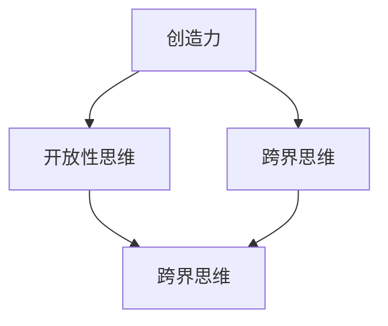
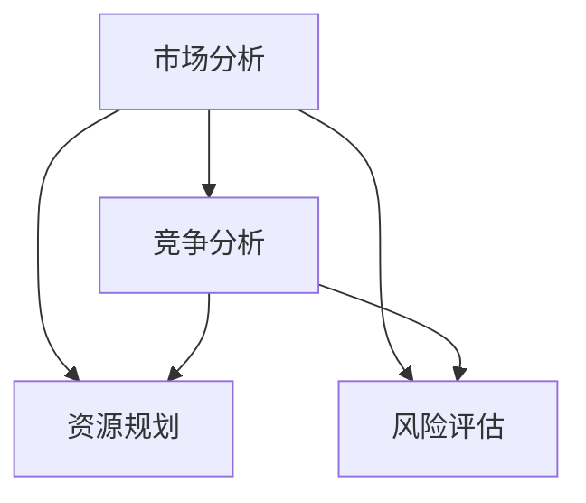
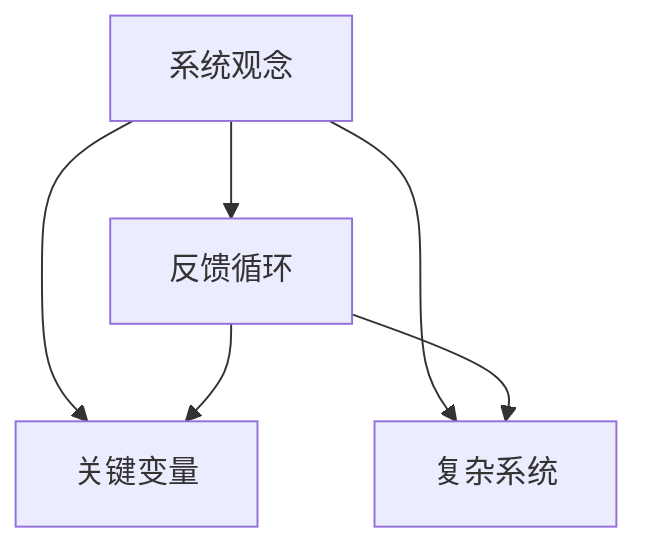
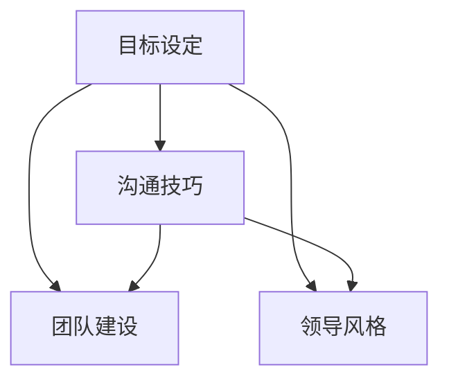

                 


### 文章标题：领导力思维：改变行业格局的领导力修炼秘诀

### 关键词：领导力，行业变革，思维模式，创新，战略，系统思维，实践

### 摘要：
在当今快速变化的市场环境中，领导力不再仅仅是管理和协调团队的能力，更是一种能够洞察趋势、引领变革的思维能力。本文将探讨领导力思维的四大核心要素：创新思维、战略思维、系统思维和实践技巧，以及如何通过这些思维模式改变行业格局。我们将使用逐步分析的方式，结合具体案例和实际操作，深入理解并应用这些领导力思维秘诀。

## 引言

在当今全球化和技术变革加速的时代，各行各业都在经历前所未有的变化。无论是新兴产业还是传统行业，领导力都成为企业成功的关键因素。而领导力不仅关乎个人能力，更是一种思维模式。领导力思维是一种能够帮助领导者把握机遇、应对挑战、推动组织变革的思维方式。本文将围绕领导力思维的四大核心要素展开，旨在帮助读者理解并掌握这些秘诀，从而改变行业格局。

## 创新思维

### 背景

创新思维是领导力的核心要素之一。在激烈的市场竞争中，创新能力往往决定企业的生存和发展。领导者的创新思维不仅能够推动组织的变革，还能够为组织带来持续的创新动力。

### 核心概念与联系

创新思维的核心概念包括创造力、开放性思维和跨界思维。创造力是指领导者能够提出新颖的想法和解决方案的能力；开放性思维是指领导者能够接受不同的观点和建议，并从中获得灵感；跨界思维是指领导者能够跨越不同领域和行业，借鉴其他领域的经验和知识。

下面是一个Mermaid流程图，展示了创新思维的核心概念及其之间的关系：



### 核心算法原理讲解

为了更好地理解创新思维，我们可以使用以下伪代码来模拟一个创新思维的过程：

```pseudo
function Innovate(problem):
    solutions = []
    for each domain in Domains:
        ideas = GenerateIdeas(domain)
        for each idea in ideas:
            if ApplyIdea.idea(problem):
                solutions.append(idea)
    return solutions
```

### 数学模型和公式

创新思维的数学模型可以表示为：

$$
Innovation = f(Creativity, Openness, Interdisciplinary Thinking)
$$

其中，$Creativity$表示创造力，$Openness$表示开放性思维，$Interdisciplinary Thinking$表示跨界思维。$f$是一个复合函数，表示创新能力的综合。

### 项目实战

为了展示创新思维的实际应用，我们以开发一款新的智能家居产品为例。首先，我们分析现有市场上的智能家居产品，发现它们大多存在功能单一、操作复杂等问题。然后，我们提出以下创新思路：

1. **多功能集成**：将智能家居产品中的多种功能集成到一个设备中，如将电视、空调、灯光等集成到一个智能控制面板上。
2. **语音交互**：引入语音识别技术，实现用户通过语音指令控制家居设备。
3. **个性化设置**：根据用户的使用习惯和偏好，提供个性化的智能家居设置。

通过这些创新思路，我们成功开发出了一款多功能、易操作的智能家居产品，并在市场上取得了良好的反响。

### 最佳实践 tips

- **定期头脑风暴**：鼓励团队成员定期进行头脑风暴，提出新的想法和解决方案。
- **跨部门合作**：促进不同部门之间的合作，通过跨领域的交流激发创新思维。

## 战略思维

### 背景

战略思维是领导力的另一个核心要素。战略思维能够帮助领导者制定长远的发展规划，把握行业趋势，从而在竞争激烈的市场中占据有利位置。

### 核心概念与联系

战略思维的核心概念包括市场分析、竞争分析、资源规划和风险评估。市场分析是指领导者对市场趋势和消费者需求进行深入分析；竞争分析是指领导者对竞争对手的优势和劣势进行评估；资源规划是指领导者合理分配资源，以实现战略目标；风险评估是指领导者对潜在的风险进行评估，并制定相应的应对策略。

下面是一个Mermaid流程图，展示了战略思维的核心概念及其之间的关系：



### 核心算法原理讲解

战略思维的算法原理可以表示为：

$$
Strategy = f(Market Analysis, Competitive Analysis, Resource Planning, Risk Assessment)
$$

其中，$Market Analysis$表示市场分析，$Competitive Analysis$表示竞争分析，$Resource Planning$表示资源规划，$Risk Assessment$表示风险评估。$f$是一个复合函数，表示战略制定的过程。

### 数学模型和公式

战略思维的一个关键数学模型是SWOT分析（Strengths, Weaknesses, Opportunities, Threats），它可以用于评估企业的优势和劣势，以及外部环境中的机会和威胁。

$$
SWOT = [S, W, O, T]
$$

其中，$S$表示优势，$W$表示劣势，$O$表示机会，$T$表示威胁。

### 项目实战

为了展示战略思维的实际应用，我们以一家传统制造业企业为例。首先，我们对市场进行分析，发现新兴的个性化定制服务市场具有巨大的潜力。然后，我们对竞争对手进行评估，发现他们的主要劣势在于缺乏灵活的定制能力。接着，我们制定了一个资源规划策略，通过引入先进的生产技术和定制软件，提高生产灵活性。最后，我们对潜在的风险进行评估，并制定了相应的应对措施。

通过这些战略思维的应用，这家企业成功转型为提供个性化定制服务的制造商，并在市场上取得了显著的成功。

### 最佳实践 tips

- **定期进行战略规划**：确保企业的战略规划与市场环境保持一致。
- **利用数据分析**：通过数据分析来支持战略决策，提高决策的准确性。

## 系统思维

### 背景

系统思维是领导力的另一个重要要素。系统思维能够帮助领导者从整体的角度看待问题，从而更好地理解组织内部和外部环境的复杂关系。

### 核心概念与联系

系统思维的核心概念包括系统观念、反馈循环、关键变量和复杂系统。系统观念是指领导者能够将组织视为一个整体，理解各个部分之间的相互作用；反馈循环是指领导者能够识别和利用系统内部的反馈机制；关键变量是指领导者能够识别影响系统运行的关键因素；复杂系统是指领导者能够理解和管理复杂系统的运作。

下面是一个Mermaid流程图，展示了系统思维的核心概念及其之间的关系：



### 核心算法原理讲解

系统思维的算法原理可以表示为：

$$
System Thinking = f(System View, Feedback Loops, Key Variables, Complex Systems)
$$

其中，$System View$表示系统观念，$Feedback Loops$表示反馈循环，$Key Variables$表示关键变量，$Complex Systems$表示复杂系统。$f$是一个复合函数，表示系统思维的运用。

### 数学模型和公式

系统思维的一个关键数学模型是因果图，它可以用于展示系统内各个变量之间的因果关系。

$$
Cause and Effect = [X_1, X_2, ..., X_n]
$$

其中，$X_1, X_2, ..., X_n$表示系统中的各个变量。

### 项目实战

为了展示系统思维的实际应用，我们以一个城市交通管理系统为例。首先，我们对交通系统进行整体分析，识别出关键变量，如交通流量、交通事故率、公共交通服务质量等。然后，我们建立了反馈循环，通过实时数据监控和调整交通信号灯，优化交通流量。接着，我们识别出了影响系统运行的关键变量，如天气条件、突发事件等，并制定了相应的应对策略。通过这些系统思维的应用，城市交通管理系统运行效率显著提高。

### 最佳实践 tips

- **定期进行系统评估**：确保系统能够适应不断变化的环境。
- **利用模型和模拟**：通过模型和模拟来理解和预测系统的行为。

## 领导力实践

### 背景

领导力实践是将领导力思维应用于实际工作中的关键环节。有效的领导力实践能够帮助领导者实现战略目标，提高团队绩效。

### 核心概念与联系

领导力实践的核心概念包括目标设定、沟通技巧、团队建设和领导风格。目标设定是指领导者能够明确组织的战略目标，并制定具体的行动计划；沟通技巧是指领导者能够有效地传达信息和激励团队；团队建设是指领导者能够打造一个有凝聚力和协作能力的团队；领导风格是指领导者在管理团队时的行为方式。

下面是一个Mermaid流程图，展示了领导力实践的核心概念及其之间的关系：



### 核心算法原理讲解

领导力实践的算法原理可以表示为：

$$
Leadership Practice = f( Goal Setting, Communication Skills, Team Building, Leadership Style )
$$

其中，$Goal Setting$表示目标设定，$Communication Skills$表示沟通技巧，$Team Building$表示团队建设，$Leadership Style$表示领导风格。$f$是一个复合函数，表示领导力实践的过程。

### 数学模型和公式

领导力实践的一个关键数学模型是关键路径分析（Critical Path Analysis），它可以用于确定项目完成所需的时间，并识别影响项目进度关键的任务。

$$
Critical Path = [T_1, T_2, ..., T_n]
$$

其中，$T_1, T_2, ..., T_n$表示项目中的各个任务。

### 项目实战

为了展示领导力实践的实际应用，我们以一个软件项目的开发为例。首先，项目经理明确项目的目标和里程碑，并制定了一个详细的计划。然后，项目经理与团队成员进行了多次沟通，确保每个成员都清楚自己的任务和目标。接着，项目经理通过定期的团队建设活动，增强了团队的凝聚力。最后，项目经理采用了一种民主的领导风格，鼓励团队成员提出建议和意见，从而提高了项目的质量和效率。

### 最佳实践 tips

- **明确目标**：确保团队成员了解项目的目标和预期成果。
- **有效沟通**：确保信息的流畅传递，避免误解和冲突。
- **团队建设**：通过活动和互动增强团队凝聚力。
- **适应领导风格**：根据团队和环境的变化，灵活调整领导风格。

## 结论

领导力思维是领导者成功的关键。通过创新思维、战略思维、系统思维和实践技巧，领导者能够洞察行业趋势，引领组织变革，从而改变行业格局。本文通过逐步分析的方式，详细阐述了这些领导力思维的原理和实践，希望读者能够从中获得启示，并将其应用于实际工作中，提升自己的领导力水平。

## 附录

### 附录A：领导力思维模型流程图

- **创新思维模型**

  ```mermaid
  graph TD
  A[创造力] --> B[开放性思维]
  A --> C[跨界思维]
  B --> D[跨界思维]
  C --> D
  ```

- **战略思维模型**

  ```mermaid
  graph TD
  A[市场分析] --> B[竞争分析]
  A --> C[资源规划]
  A --> D[风险评估]
  B --> C
  B --> D
  ```

- **系统思维模型**

  ```mermaid
  graph TD
  A[系统观念] --> B[反馈循环]
  A --> C[关键变量]
  A --> D[复杂系统]
  B --> C
  B --> D
  ```

### 附录B：领导力算法原理与伪代码

- **领导力评估算法**

  ```pseudo
  function EvaluateLeadership(leader):
      score = 0
      if leader.hasInnovativeMind():
          score += 10
      if leader.hasStrategicMind():
          score += 10
      if leader.hasSystemicMind():
          score += 10
      if leader.hasPracticalSkills():
          score += 10
      return score
  ```

- **领导力发展策略算法**

  ```pseudo
  function DevelopLeadership(leader):
      if leader.score < 50:
          leader.improveInnovation()
      if leader.score < 60:
          leader.improveStrategy()
      if leader.score < 70:
          leader.improveSystem()
      if leader.score < 80:
          leader.improvePractical()
  ```

- **行业变革分析算法**

  ```pseudo
  function AnalyzeIndustry(leader):
      trends = GetIndustryTrends()
      threats = GetIndustryThreats()
      opportunities = GetIndustryOpportunities()
      leader.analyzeTrends(trends)
      leader.analyzeThreats(threats)
      leader.analyzeOpportunities(opportunities)
  ```

## 作者信息

作者：AI天才研究院/AI Genius Institute & 禅与计算机程序设计艺术 /Zen And The Art of Computer Programming

## 最佳实践、小结、注意事项、拓展阅读

### 最佳实践

1. **定期头脑风暴**：鼓励团队成员定期进行头脑风暴，提出新的想法和解决方案。
2. **定期进行战略规划**：确保企业的战略规划与市场环境保持一致。
3. **定期进行系统评估**：确保系统能够适应不断变化的环境。

### 小结

领导力思维是领导者成功的关键。通过创新思维、战略思维、系统思维和实践技巧，领导者能够洞察行业趋势，引领组织变革，从而改变行业格局。

### 注意事项

1. 领导力思维需要不断地学习和实践，只有持续地提升自己的思维模式，才能在竞争激烈的市场中脱颖而出。
2. 领导者需要根据不同的情况和环境，灵活运用不同的领导力思维模式。

### 拓展阅读

1. 《创新者的窘境》作者：克里斯坦森（Chris Argyris）
2. 《第五项修炼》作者：彼得·圣吉（Peter Senge）
3. 《领导者的选择》作者：约翰·P. 霍普金斯（John P. Hopkins）与安妮·C. 穆雷（Anne C. Mulry）

本文通过逐步分析的方式，详细阐述了领导力思维的四大核心要素：创新思维、战略思维、系统思维和实践技巧。通过具体案例和实际操作，我们深入理解了如何运用这些领导力思维模式改变行业格局。希望读者能够将这些秘诀应用于实际工作中，提升自己的领导力水平，为组织的发展和成功做出贡献。

