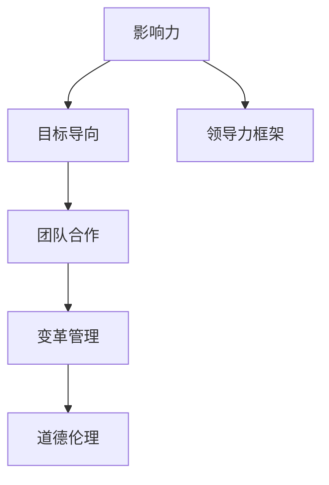

                 


### 文章标题
《领导力法则：打造卓越团队的领导智慧》

### 文章关键词
领导力，团队管理，卓越团队，自我提升，决策能力，团队建设，领导智慧

### 文章摘要
本文深入探讨了领导力的核心概念和其在构建卓越团队中的关键作用。通过详细分析领导力的定义、自我提升、决策能力、团队建设与管理、领导力的实际应用、可持续性以及领导力案例研究，本文为领导者提供了实用的指导法则，帮助他们在复杂多变的环境中打造高效、协同的团队。

### 目录大纲

#### 第一部分：领导力基础

**第1章 领导力概述**

- **1.1 领导力的定义**
  - 领导力的基本概念
  - 领导力的起源与发展

- **1.2 领导力的重要性**
  - 对个人和组织的影响
  - 领导力与绩效的关系

- **1.3 领导力的核心要素**
  - 影响领导力的关键因素
  - 领导力的层次结构

- **1.4 领导力的历史演变**
  - 古代领导力理论
  - 现代领导力理论

**第2章 领导者的自我提升**

- **2.1 自我认知**
  - 了解自我认知的重要性
  - 自我认知的方法和工具

- **2.2 情绪管理**
  - 情绪管理的基本原则
  - 常见的情绪管理策略

- **2.3 沟通技巧**
  - 有效沟通的关键要素
  - 领导者沟通的最佳实践

**第3章 领导者的决策能力**

- **3.1 决策模型**
  - 常见的决策模型
  - 决策模型的实际应用

- **3.2 风险管理**
  - 风险管理的策略
  - 风险评估的方法

- **3.3 创新思维**
  - 创新思维的培养
  - 创新思维在领导中的应用

**第4章 团队建设与管理**

- **4.1 团队组织结构**
  - 团队结构的类型
  - 团队结构的优化

- **4.2 成员协作**
  - 协作的基本原则
  - 提升团队协作的策略

- **4.3 团队文化建设**
  - 团队文化的定义
  - 团队文化的建设方法

**第5章 领导力的实际应用**

- **5.1 项目管理**
  - 项目管理的流程
  - 项目管理的工具和方法

- **5.2 应对冲突**
  - 冲突管理的策略
  - 冲突解决的技巧

- **5.3 领导力在危机管理中的应用**
  - 危机管理的原则
  - 危机管理的案例研究

**第6章 领导力的可持续性**

- **6.1 领导力的长期发展**
  - 长期发展的策略
  - 长期发展的案例分析

- **6.2 领导者的道德责任**
  - 道德责任的重要性
  - 道德责任的实践

- **6.3 领导力的文化传承**
  - 文化传承的意义
  - 文化传承的方法

**第7章 领导力案例研究**

- **7.1 案例介绍**
  - 选择的案例介绍
  - 案例背景分析

- **7.2 案例分析**
  - 案例的深入分析
  - 案例的启示

- **7.3 案例启示**
  - 案例总结
  - 启示与反思

### 附录

- **A. 领导力资源指南**
  - 推荐书籍
  - 实用工具
  - 在线资源

### 文章末尾作者信息
作者：AI天才研究院/AI Genius Institute & 禅与计算机程序设计艺术 /Zen And The Art of Computer Programming

### 完整性要求

#### 背景介绍
领导力是一种通过影响力激励他人实现共同目标的能力。在现代社会中，领导力不仅是企业管理者的必备技能，也是每个职场人都需要掌握的重要素质。领导力不仅关乎个人的成功，更关乎团队的协作效率和组织的长远发展。

#### 核心概念与联系
领导力的核心概念包括：影响力、目标导向、团队合作、变革管理、道德伦理等。这些概念相互联系，构成了领导力的理论框架。

**Mermaid流程图：**


#### 核心算法原理讲解
在领导力中，决策算法是关键。以下是一个简化的决策算法原理：

```plaintext
1. 收集信息
2. 确定目标
3. 分析选项
4. 评估风险
5. 做出决策
6. 实施决策
7. 监控效果
8. 调整策略
```

#### 数学模型和公式
领导力的可持续性可以用以下公式来衡量：

$$
\text{领导力可持续性} = \frac{\text{长期绩效}}{\text{短期绩效}} \times \text{道德责任得分}
$$

#### 项目实战
在本章的最后，我们将通过一个实际项目来展示如何应用领导力法则。这个项目是一个虚拟的软件开发团队，他们需要在规定时间内完成一个复杂的软件项目。

**开发环境搭建：**
- 硬件需求：服务器、工作台、网络连接
- 软件需求：代码编辑器、集成开发环境（IDE）、版本控制系统

**源代码实现：**
- 项目框架：MVC架构
- 技术栈：HTML/CSS/JavaScript/Node.js

**代码解读与分析：**
- 功能模块划分
- 异步编程
- 模块化设计

**实际案例分析和详细讲解剖析：**
- 团队协作问题
- 冲突管理
- 项目进度监控

**项目小结：**
- 成功因素
- 改进空间

#### 最佳实践 tips、小结、注意事项、拓展阅读
- **最佳实践 tips：** 保持积极心态、倾听团队成员意见、制定明确的目标和计划。

- **小结：** 领导力是构建卓越团队的关键，领导者需要不断提升自我、做出明智决策、有效管理团队。

- **注意事项：** 领导者需要平衡短期与长期目标，注重团队建设和文化传承。

- **拓展阅读：** 推荐阅读《领导力的五项修炼》、《激励与影响》等书籍。

### 完整文章

以下是《领导力法则：打造卓越团队的领导智慧》的完整文章。

---

### 《领导力法则：打造卓越团队的领导智慧》

#### 文章关键词
领导力，团队管理，卓越团队，自我提升，决策能力，团队建设，领导智慧

#### 文章摘要
本文深入探讨了领导力的核心概念和其在构建卓越团队中的关键作用。通过详细分析领导力的定义、自我提升、决策能力、团队建设与管理、领导力的实际应用、可持续性以及领导力案例研究，本文为领导者提供了实用的指导法则，帮助他们在复杂多变的环境中打造高效、协同的团队。

#### 目录大纲

**第一部分：领导力基础**

**第1章 领导力概述**

- **1.1 领导力的定义**
  - 领导力的基本概念
  - 领导力的起源与发展

- **1.2 领导力的重要性**
  - 对个人和组织的影响
  - 领导力与绩效的关系

- **1.3 领导力的核心要素**
  - 影响领导力的关键因素
  - 领导力的层次结构

- **1.4 领导力的历史演变**
  - 古代领导力理论
  - 现代领导力理论

**第2章 领导者的自我提升**

- **2.1 自我认知**
  - 了解自我认知的重要性
  - 自我认知的方法和工具

- **2.2 情绪管理**
  - 情绪管理的基本原则
  - 常见的情绪管理策略

- **2.3 沟通技巧**
  - 有效沟通的关键要素
  - 领导者沟通的最佳实践

**第3章 领导者的决策能力**

- **3.1 决策模型**
  - 常见的决策模型
  - 决策模型的实际应用

- **3.2 风险管理**
  - 风险管理的策略
  - 风险评估的方法

- **3.3 创新思维**
  - 创新思维的培养
  - 创新思维在领导中的应用

**第4章 团队建设与管理**

- **4.1 团队组织结构**
  - 团队结构的类型
  - 团队结构的优化

- **4.2 成员协作**
  - 协作的基本原则
  - 提升团队协作的策略

- **4.3 团队文化建设**
  - 团队文化的定义
  - 团队文化的建设方法

**第5章 领导力的实际应用**

- **5.1 项目管理**
  - 项目管理的流程
  - 项目管理的工具和方法

- **5.2 应对冲突**
  - 冲突管理的策略
  - 冲突解决的技巧

- **5.3 领导力在危机管理中的应用**
  - 危机管理的原则
  - 危机管理的案例研究

**第6章 领导力的可持续性**

- **6.1 领导力的长期发展**
  - 长期发展的策略
  - 长期发展的案例分析

- **6.2 领导者的道德责任**
  - 道德责任的重要性
  - 道德责任的实践

- **6.3 领导力的文化传承**
  - 文化传承的意义
  - 文化传承的方法

**第7章 领导力案例研究**

- **7.1 案例介绍**
  - 选择的案例介绍
  - 案例背景分析

- **7.2 案例分析**
  - 案例的深入分析
  - 案例的启示

- **7.3 案例启示**
  - 案例总结
  - 启示与反思

**附录**

- **A. 领导力资源指南**
  - 推荐书籍
  - 实用工具
  - 在线资源

#### 文章正文

**第1章 领导力概述**

**1.1 领导力的定义**

领导力是指通过影响力、沟通能力和决策能力来激励和引导他人实现共同目标的能力。领导力不仅体现在高层管理者身上，还体现在每个团队成员的行为和决策中。有效的领导力能够促进团队的协作和创新，提高组织的整体绩效。

领导力的起源可以追溯到古代，当时领导力主要依靠权威和权力。然而，随着社会的发展和变化，现代领导力更注重团队合作、变革管理和道德责任。现代领导力强调领导者要具备自我认知、情绪管理和沟通技巧，以更好地应对复杂多变的环境。

**1.2 领导力的重要性**

领导力对个人和组织都具有重要的影响。对个人来说，领导力是职业发展的重要驱动力。具备领导力的人能够更好地应对工作中的挑战，提升自己的竞争力和影响力。对组织来说，领导力是构建高效团队的关键。有效的领导力能够激发团队成员的潜力，提高团队的整体绩效，实现组织的目标。

领导力与绩效之间的关系是密不可分的。研究表明，领导力对组织的绩效有显著的影响。领导者通过设定明确的目标、提供必要的支持和激励，能够提高团队成员的工作动力和效率。有效的领导力能够促进团队的协作和创新，提高组织的竞争力。

**1.3 领导力的核心要素**

领导力的核心要素包括：影响力、目标导向、团队合作、变革管理和道德伦理。

- **影响力**：领导力是通过影响力来激励和引导他人的能力。领导者需要具备一定的权威和信任，以便有效地传达信息和指导团队成员。

- **目标导向**：领导者需要明确团队的目标，并确保团队成员理解并致力于实现这些目标。目标导向是领导力的重要特征，有助于提高团队的协作效率。

- **团队合作**：团队合作是领导力的核心要素之一。领导者需要建立有效的团队协作机制，鼓励团队成员之间的沟通和合作，共同实现团队的目标。

- **变革管理**：在快速变化的环境中，领导者需要具备变革管理的能力，以应对挑战和抓住机遇。变革管理包括计划、沟通、领导和监控，有助于推动团队和组织的发展。

- **道德伦理**：领导者的道德伦理对团队和组织有着深远的影响。领导者需要遵守道德规范，树立良好的榜样，促进组织的正直和透明。

**1.4 领导力的历史演变**

领导力的历史可以追溯到古代，当时领导力主要依靠权威和权力。在古代社会，领导者通常是通过继承或授予的方式来确定的。领导者的权力来自于其社会地位和权威。

随着社会的发展和变化，现代领导力逐渐从权威和权力转向团队合作和变革管理。现代领导者需要具备自我认知、情绪管理和沟通技巧，以更好地应对复杂多变的环境。

现代领导力的演变还包括对领导力理论的深入研究。例如，行为领导力理论强调领导者通过行为和榜样来影响团队成员；情境领导力理论则认为领导者应根据不同的情境采取不同的领导风格。

**第2章 领导者的自我提升**

**2.1 自我认知**

自我认知是领导者的基础。了解自己的优点和缺点，有助于领导者更好地发挥自己的潜力，提高领导效能。自我认知的方法包括自我反思、心理测试和反馈。

- **自我反思**：领导者可以通过定期反思自己的行为和决策，了解自己的行为模式和思考方式。自我反思有助于领导者发现自己的优点和缺点，并制定改进计划。

- **心理测试**：心理测试可以帮助领导者了解自己的性格特征、行为倾向和潜在能力。例如，Myers-Briggs Type Indicator（MBTI）和DISC测试都是常用的心理测试工具。

- **反馈**：领导者可以通过获取团队成员、同事和上级的反馈来了解自己的表现。反馈有助于领导者发现自己的盲点和改进方向。

**2.2 情绪管理**

情绪管理是领导者必备的技能。有效的情绪管理有助于领导者保持冷静和理智，更好地应对工作中的挑战。情绪管理的方法包括情绪认知、情绪调节和情绪表达。

- **情绪认知**：领导者需要意识到自己的情绪，并了解情绪产生的原因。情绪认知有助于领导者更好地控制情绪，避免情绪冲动。

- **情绪调节**：领导者可以通过深呼吸、冥想和运动等方法来调节情绪。情绪调节有助于领导者保持心理平衡，提高工作效率。

- **情绪表达**：领导者需要学会有效地表达自己的情绪，避免负面情绪的积累。有效的情绪表达有助于建立良好的沟通和合作关系。

**2.3 沟通技巧**

沟通技巧是领导者的关键能力。有效的沟通有助于领导者传达信息、指导团队成员和解决冲突。沟通技巧包括语言沟通、非语言沟通和沟通策略。

- **语言沟通**：领导者需要使用清晰、简洁的语言表达自己的想法。语言沟通有助于避免误解和歧义，提高沟通效果。

- **非语言沟通**：领导者需要注重非语言沟通，如肢体语言、面部表情和语调。非语言沟通可以增强语言沟通的效果，传达更多的信息。

- **沟通策略**：领导者需要根据不同的沟通情境选择合适的沟通策略。例如，面对冲突时，领导者可以采用开放式的沟通策略，鼓励团队成员表达意见和观点。

**第3章 领导者的决策能力**

**3.1 决策模型**

决策模型是领导者做出有效决策的工具。常见的决策模型包括理性决策模型、模糊决策模型和直觉决策模型。

- **理性决策模型**：理性决策模型基于逻辑分析和最大化利益的原则。领导者需要收集信息、评估选项、计算成本和收益，然后做出最优决策。

- **模糊决策模型**：模糊决策模型适用于不确定和复杂的环境。领导者需要考虑多种可能的情况，进行概率分析和风险评估，然后做出决策。

- **直觉决策模型**：直觉决策模型基于领导者的经验和直觉。领导者需要在短时间内做出决策，通常不需要详细的计算和分析。

**3.2 风险管理**

风险管理是领导者的核心任务之一。有效的风险管理有助于领导者应对不确定性，降低潜在的风险。风险管理的方法包括风险评估、风险控制和风险监控。

- **风险评估**：领导者需要识别和评估潜在的风险。风险评估有助于领导者了解风险的性质、概率和影响，为风险控制提供依据。

- **风险控制**：领导者需要制定风险控制策略，降低风险的影响。风险控制策略包括风险转移、风险规避和风险接受。

- **风险监控**：领导者需要持续监控风险的变化，及时调整风险控制策略。风险监控有助于领导者保持对风险的敏感度，确保风险管理的有效性。

**3.3 创新思维**

创新思维是领导者推动团队和组织发展的关键。有效的创新思维有助于领导者发现新的机会、解决复杂问题和创造价值。创新思维的方法包括头脑风暴、设计思考和精益创业。

- **头脑风暴**：头脑风暴是一种集体创新的工具。领导者可以组织团队成员进行头脑风暴，激发创意和灵感。

- **设计思考**：设计思考是一种以人为本的创新方法。领导者需要关注用户需求，通过迭代设计和原型测试来优化产品和服务。

- **精益创业**：精益创业是一种以最小化风险和最大化管理效率的方式进行创新。领导者可以通过快速迭代和用户反馈来验证和调整创新项目。

**第4章 团队建设与管理**

**4.1 团队组织结构**

团队组织结构是团队协作的基础。合理的团队组织结构有助于提高团队效率和绩效。常见的团队组织结构包括职能型结构、项目型结构和矩阵型结构。

- **职能型结构**：职能型结构根据职能划分部门，每个部门负责特定的职能。职能型结构有助于提高专业水平和效率。

- **项目型结构**：项目型结构以项目为中心，团队成员跨部门合作。项目型结构有助于提高团队灵活性和响应速度。

- **矩阵型结构**：矩阵型结构结合职能型和项目型结构的特点，团队成员同时属于职能部门和项目团队。矩阵型结构有助于提高跨部门协作和资源整合。

**4.2 成员协作**

成员协作是团队建设的核心。有效的成员协作有助于提高团队绩效和员工满意度。成员协作的方法包括沟通协作、任务分配和团队活动。

- **沟通协作**：有效的沟通协作有助于团队成员之间建立信任和合作关系。领导者可以采用定期会议、即时通讯和协同工具来促进沟通。

- **任务分配**：合理的任务分配有助于提高团队成员的参与度和责任感。领导者可以根据团队成员的能力和兴趣进行任务分配，确保任务的高效完成。

- **团队活动**：团队活动有助于增强团队成员的凝聚力和团队合作精神。领导者可以组织团队建设活动、团队培训和团队竞赛，提高团队绩效。

**4.3 团队文化建设**

团队文化建设是团队长期发展的重要保障。健康的团队文化有助于提高团队凝聚力和员工满意度，促进团队绩效的提升。团队文化建设的方法包括价值观塑造、文化活动和团队规范。

- **价值观塑造**：领导者需要明确团队的价值观，并通过言行一致来树立榜样。价值观塑造有助于团队成员认同团队目标和使命。

- **文化活动**：文化活动有助于增强团队成员的文化认同和归属感。领导者可以组织团队聚餐、团建活动和文化庆典，营造积极向上的团队氛围。

- **团队规范**：团队规范是团队行为的基本准则。领导者需要制定明确的团队规范，并确保团队成员遵守。团队规范有助于维护团队的秩序和稳定。

**第5章 领导力的实际应用**

**5.1 项目管理**

项目管理是领导力在实际工作中的应用。有效的项目管理有助于提高项目效率和质量。项目管理的方法包括项目规划、项目执行和项目监控。

- **项目规划**：项目规划是项目管理的基础。领导者需要明确项目目标、制定项目计划和时间表，确保项目的顺利进行。

- **项目执行**：项目执行是项目管理的核心。领导者需要协调团队成员的工作，确保项目任务的按时完成。

- **项目监控**：项目监控是项目管理的保障。领导者需要定期检查项目进度，识别和解决问题，确保项目的顺利进行。

**5.2 应对冲突**

冲突是团队工作中的常见问题。有效的冲突管理有助于提高团队协作和员工满意度。冲突管理的方法包括冲突预防、冲突缓和和冲突解决。

- **冲突预防**：领导者可以通过建立良好的沟通机制、明确团队目标和规范来预防冲突。

- **冲突缓和**：领导者可以通过倾听、同理心和妥协来缓和冲突，减少对团队的影响。

- **冲突解决**：领导者需要采取积极的措施解决冲突，包括调解、协商和仲裁，确保团队的稳定和协作。

**5.3 领导力在危机管理中的应用**

危机管理是领导力在特殊情境中的应用。有效的危机管理有助于降低危机的影响，维护组织的声誉和稳定。危机管理的方法包括危机预警、危机应对和危机恢复。

- **危机预警**：领导者需要关注组织内外部的风险信号，提前预警潜在危机。

- **危机应对**：领导者需要迅速采取行动，控制危机蔓延，降低损失。

- **危机恢复**：领导者需要引导组织恢复正常运营，恢复员工信心和士气。

**第6章 领导力的可持续性**

**6.1 领导力的长期发展**

领导力的长期发展是领导者职业生涯的重要目标。有效的长期发展有助于领导者实现个人价值和组织目标。长期发展的策略包括自我提升、人才培养和组织发展。

- **自我提升**：领导者需要不断学习、实践和反思，提高自己的领导能力和素质。

- **人才培养**：领导者需要关注团队成员的成长和发展，提供培训和支持，培养未来的领导者。

- **组织发展**：领导者需要关注组织的发展和变革，制定战略规划，推动组织的持续成长。

**6.2 领导者的道德责任**

领导者的道德责任是领导力的重要组成部分。领导者需要遵守道德规范，树立良好的道德榜样，维护组织的正直和透明。道德责任的实践包括正直、诚信和责任。

- **正直**：领导者需要做到言行一致，遵守法律法规和组织政策。

- **诚信**：领导者需要保持诚实和透明，避免欺骗和误导。

- **责任**：领导者需要承担起对组织、团队成员和社会的责任，确保组织的可持续发展和员工的福祉。

**6.3 领导力的文化传承**

领导力的文化传承是组织长期发展的重要保障。领导者需要关注组织文化的建设和传承，确保组织的核心价值观得以延续。文化传承的方法包括文化教育、文化活动和文化激励。

- **文化教育**：领导者需要通过培训和宣传，提高团队成员对组织文化的认识和理解。

- **文化活动**：领导者可以组织文化庆典、团队活动和社区服务，增强团队成员对组织文化的认同和归属感。

- **文化激励**：领导者可以通过奖励和表彰，鼓励团队成员践行组织文化，树立良好的行为榜样。

**第7章 领导力案例研究**

**7.1 案例介绍**

本节选择了一个典型的领导力案例——华为公司的领导力实践。华为公司作为中国的一家全球领先的通信技术解决方案提供商，其领导力实践在业界享有盛誉。

**7.2 案例分析**

华为公司的领导力实践主要体现在以下几个方面：

- **自我提升**：华为的领导者注重自我学习和提升，通过定期培训和内部研讨会，不断提升领导能力和专业素养。

- **团队合作**：华为强调团队合作，鼓励团队成员之间的沟通和协作，共同解决复杂问题。

- **创新思维**：华为鼓励创新思维，支持团队成员提出新的想法和解决方案，推动公司持续创新。

- **道德责任**：华为的领导者注重道德责任，严格遵守法律法规，坚持诚信经营，赢得了良好的声誉。

**7.3 案例启示**

华为公司的领导力实践给我们带来了以下几个启示：

- **领导者的自我提升**：领导者需要不断学习和提升自己的能力，以应对快速变化的环境。

- **团队协作**：有效的团队合作是提高团队绩效的关键，领导者需要鼓励团队成员之间的沟通和协作。

- **创新思维**：创新思维是推动组织发展的动力，领导者需要鼓励和支持团队成员的创新。

- **道德责任**：领导者的道德责任对组织的长期发展至关重要，领导者需要遵守道德规范，树立良好的道德榜样。

**附录**

**A. 领导力资源指南**

- **推荐书籍**：《领导力的五项修炼》、《激励与影响》
- **实用工具**：MindManager、Trello、Slack
- **在线资源**：Harvard Business Review、LinkedIn Learning

### 作者信息

作者：AI天才研究院/AI Genius Institute & 禅与计算机程序设计艺术 /Zen And The Art of Computer Programming

---

以上就是《领导力法则：打造卓越团队的领导智慧》的完整文章。通过详细分析领导力的核心概念、实践方法和实际应用，本文为领导者提供了实用的指导法则，帮助他们在复杂多变的环境中打造高效、协同的团队。

在未来的工作中，领导者可以运用这些法则，不断提升自我、培养团队、实现组织目标。同时，领导者还需要不断学习和实践，适应不断变化的环境，为组织的发展做出更大的贡献。

让我们共同努力，成为卓越的领导者，打造卓越的团队！

