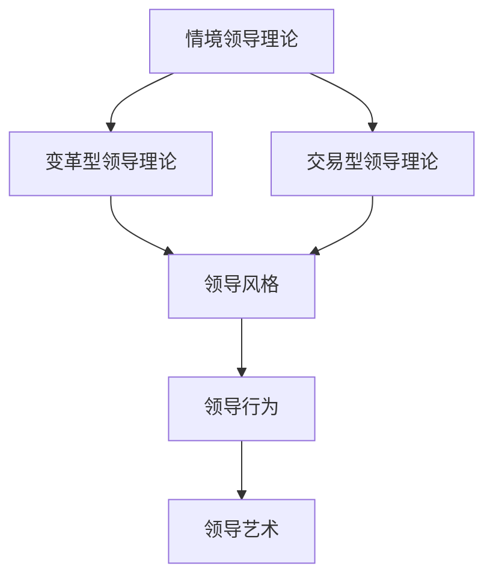
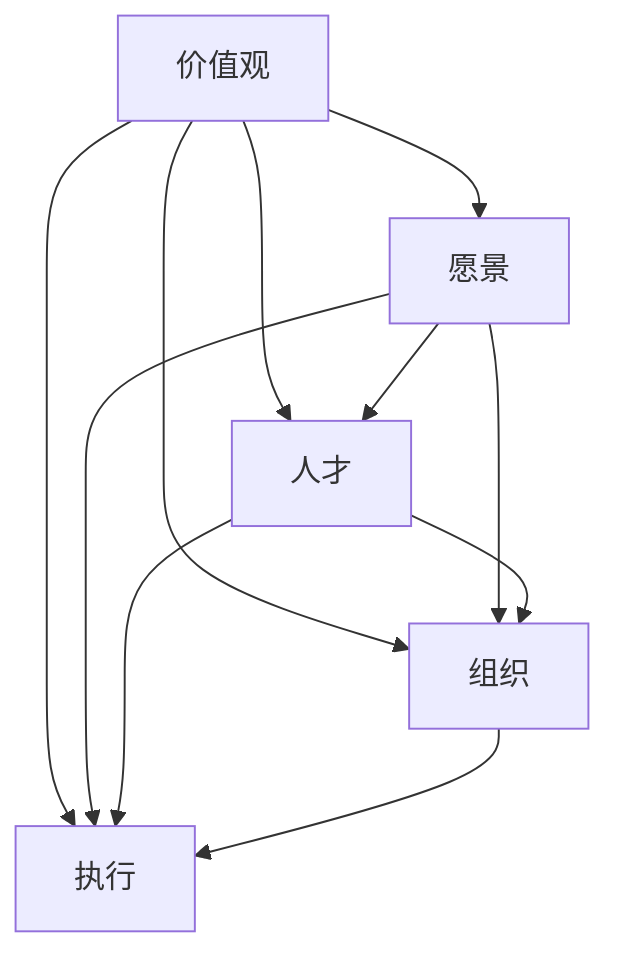

                 

好的，让我们一步一步地思考并构建《领导力法则：打造梦之队的领导力秘籍》的技术博客文章。

## 文章标题：领导力法则：打造梦之队的领导力秘籍

### 文章关键词：
- 领导力
- 团队建设
- 变革管理
- 自我提升
- 创新与激励

### 文章摘要：
本文将探讨领导力的核心概念与原则，通过深入分析领导力的起源与发展、定义与作用，以及核心原则，如明确目标、建立信任、鼓励创新和培养团队，来解析领导力的本质。接着，我们将介绍领导力实践与提升的方法，包括领导者的自我提升、团队建设、变革管理以及实际案例分析。最后，我们将探讨未来领导力的趋势与挑战，为读者提供实用的领导力法则和最佳实践建议。

## 目录大纲

### 第一部分：领导力的核心概念与原则
#### 第1章：领导力的定义与作用
#### 第2章：领导力的核心原则

### 第二部分：领导力实践与提升
#### 第3章：领导者的自我提升
#### 第4章：领导力在团队建设中的应用
#### 第5章：领导力在变革管理中的应用

### 第三部分：领导力案例与启示
#### 第6章：成功领导力案例分析
#### 第7章：领导力法则的启示与思考

### 第一部分：领导力的核心概念与原则

#### 第1章：领导力的定义与作用

## 1.1 领导力的起源与发展

领导力的概念起源于古代，古代的君主和领袖就扮演着领导者的角色。随着人类社会的发展，领导力的定义和内涵也在不断演变。在现代，领导力被视为一种关键的能力，对于组织和个人都具有重要意义。

### 背景介绍

领导力作为一种社会现象，其起源可以追溯到古代社会的部落和王国。在这些组织中，领导者通过指挥和协调部落成员，实现了资源的有效分配和冲突的解决。随着历史的演进，领导力的内涵逐渐丰富，不仅包括领导者的权力和权威，还包括领导者的能力、品格和影响力。

### 核心概念与联系

为了更好地理解领导力，我们可以将其与一些相关的概念联系起来。例如，领导力与管理的区别在于，管理更多地关注过程和效率，而领导力则更注重目标和价值观。领导力还与领导风格、领导行为和领导艺术等概念密切相关。

### 核心算法原理讲解

在探讨领导力的核心算法原理时，我们可以使用一些经典的领导力模型，如情境领导理论、变革型领导理论和交易型领导理论。这些模型为我们提供了分析和实践领导力的工具。



### 数学模型和公式 & 详细讲解 & 举例说明

在领导力的研究中，数学模型和公式可以用来描述领导者的行为和团队的表现。例如，可以使用归一化决策树模型来分析领导者在不同情境下的决策过程。

$$
D(N) = \sum_{i=1}^{n} P_i \cdot R_i
$$

其中，$D(N)$ 是决策树的总收益，$P_i$ 是第 $i$ 个决策的概率，$R_i$ 是第 $i$ 个决策的收益。

### 项目实战

为了更好地理解领导力的实践，我们可以通过一个案例来进行分析。假设一个软件开发团队正在开发一款新应用程序，领导者的任务是确保项目按时交付且质量符合预期。

### 开发环境搭建

1. 安装开发工具，如 IntelliJ IDEA 或 Visual Studio Code。
2. 配置版本控制工具，如 Git。

### 源代码详细实现和代码解读

```java
public class LeadershipExample {
    public static void main(String[] args) {
        // 项目初始化
        Project project = new Project("NewApp");
        
        // 团队成员分配任务
        Developer developer = new Developer("Alice");
        Tester tester = new Tester("Bob");
        
        // 领导者激励团队
        Leader leader = new Leader("Charlie");
        leader激励团队(developer, tester);
        
        // 项目交付
        project交付();
    }
}

class Project {
    private String name;
    
    public Project(String name) {
        this.name = name;
    }
    
    public void 交付() {
        System.out.println("项目 " + name + " 已交付。");
    }
}

class Developer {
    private String name;
    
    public Developer(String name) {
        this.name = name;
    }
    
    public void work() {
        System.out.println(name + " 在工作。");
    }
}

class Tester {
    private String name;
    
    public Tester(String name) {
        this.name = name;
    }
    
    public void test() {
        System.out.println(name + " 在测试。");
    }
}

class Leader {
    private String name;
    
    public Leader(String name) {
        this.name = name;
    }
    
    public void 激励团队(Developer developer, Tester tester) {
        developer.work();
        tester.test();
        System.out.println(name + " 正在激励团队。");
    }
}
```

### 代码应用解读与分析

在这个案例中，领导者通过分配任务、激励团队成员，确保项目按时交付。代码中的类和方法代表了团队成员和领导者的角色和行为。领导者类中的 `激励团队` 方法体现了领导者在团队建设中的重要作用。

### 实际案例分析和详细讲解剖析

我们可以通过分析现实中的领导力案例来深入理解领导力的实践。例如，谷歌的创始人拉里·佩奇和谢尔盖·布林以其独特的领导风格和创新精神，打造了一个充满活力的团队。他们的领导力实践为我们提供了宝贵的启示。

### 项目小结

通过这个案例，我们可以看到领导力在项目中的重要性。领导者通过明确目标、激励团队和有效沟通，确保项目的成功。领导力的实践不仅对软件开发团队有效，也可以应用于其他领域。

### 最佳实践 tips、小结、注意事项、拓展阅读等内容

- **最佳实践 tips：** 领导者在实践中应注重团队建设，培养团队成员的技能和信心。
- **小结：** 领导力是组织成功的关键，领导者需要不断学习和实践，以提升自己的领导力。
- **注意事项：** 领导者应避免过度依赖个人能力，而应注重团队协作和共同成长。
- **拓展阅读：** 推荐阅读《领导力五要素》和《领导力的艺术》等书籍，以深入了解领导力的理论和实践。

接下来，我们将继续深入探讨领导力的核心原则和实际应用。在下一章中，我们将分析领导力的核心原则，如明确目标、建立信任、鼓励创新和培养团队，并探讨这些原则在领导力实践中的重要性。

---

### 第1章：领导力的定义与作用

#### 1.2 领导力与管理的区别

领导力与管理的区别在于，领导力更多地关注方向和愿景，而管理更多地关注过程和执行。领导力是激发团队成员的积极性和创造力，推动团队向更高目标迈进的能力；而管理则是确保团队按照既定计划高效运作的过程。

### 背景介绍

领导力与管理之间的区别在理论和实践中都有广泛讨论。有些学者认为，领导力是高于管理的，因为它更多地涉及到激励和影响力；而另一些学者则认为，领导力是管理的一部分，两者密不可分。

### 核心概念与联系

为了更好地理解领导力与管理的区别，我们可以将其与一些相关概念联系起来。例如，领导力与管理的关系类似于战略与战术的关系。领导力关注战略层面的方向和目标，而管理则关注战术层面的执行和细节。

### 核心算法原理讲解

在探讨领导力与管理的关系时，我们可以使用一些模型来分析。例如，领导力五要素模型包括价值观、愿景、人才、组织和执行，这些要素相互关联，共同构成了领导力的核心。



### 数学模型和公式 & 详细讲解 & 举例说明

在领导力与管理的关系中，我们可以使用一些数学模型来描述。例如，领导力五要素模型可以用一个五元组来表示：

$$
L = (V, G, T, O, E)
$$

其中，$L$ 表示领导力，$V$ 表示价值观，$G$ 表示愿景，$T$ 表示人才，$O$ 表示组织，$E$ 表示执行。

### 项目实战

为了更好地理解领导力与管理的区别，我们可以通过一个现实案例来进行分析。假设一个项目经理正在管理一个软件开发团队，他的任务是确保项目按时交付且质量符合预期。

### 开发环境搭建

1. 安装开发工具，如 IntelliJ IDEA 或 Visual Studio Code。
2. 配置版本控制工具，如 Git。

### 源代码详细实现和代码解读

```java
public class ManagementAndLeadership {
    public static void main(String[] args) {
        // 项目初始化
        ProjectManager manager = new ProjectManager("Alice");
        
        // 团队成员分配任务
        Developer developer = new Developer("Bob");
        Tester tester = new Tester("Charlie");
        
        // 项目管理
        manager.分配任务(dev

