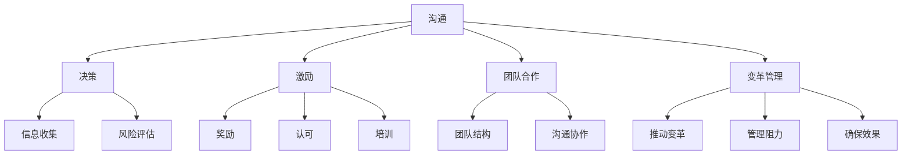
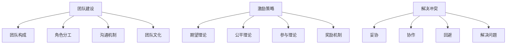
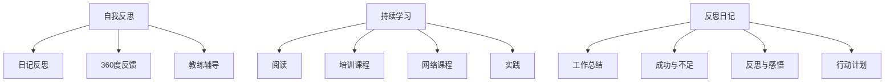

                 

### 文章标题：领导力法则：打造王者之师的领导力秘诀

#### 关键词：
- 领导力
- 团队建设
- 沟通技巧
- 决策能力
- 个人发展

#### 摘要：
本文深入探讨领导力的核心概念、理论发展、个人特质，以及实战技巧。通过解析领导力与团队建设、沟通技巧、决策能力等关键领域的联系，为读者提供构建王者之师的领导力秘诀。文章还探讨了领导力的持续提升路径，以及领导力在可持续发展中的作用。旨在帮助读者全面理解领导力的本质，提升领导力水平，打造高效团队。

---

### 《领导力法则：打造王者之师的领导力秘诀》目录大纲

#### 第一部分：领导力的核心概念

#### 第1章：领导力的定义与重要性
- **1.1 领导力的本质**：介绍领导力的定义、特征和与管理的区别。
- **1.2 领导力的作用**：分析领导力对个人、团队和企业的影响。
- **1.3 领导力的五大核心技能**：介绍沟通、决策、激励、团队合作和变革管理的核心技能。
- **1.4 领导力的Mermaid流程图**：绘制领导力框架的Mermaid图，展示各核心技能之间的关系。

#### 第2章：领导力理论的发展与演变
- **2.1 古典领导力理论**：回顾弗雷德里克·泰勒的科学管理理论、马斯洛的需求层次理论等。
- **2.2 行为领导力理论**：探讨领导行为对下属影响的研究，如领导行为风格理论。
- **2.3 变革型领导力理论**：分析领导者的变革动机、团队建设能力等。
- **2.4 服务型领导力理论**：阐述领导者如何服务下属，提升团队效能。

#### 第3章：领导力与个人特质
- **3.1 领导者的个性特质**：探讨领导者的自信、好奇心、坚韧等个性特质。
- **3.2 领导者的心理素质**：分析领导者的情绪智商、压力管理能力等。
- **3.3 领导者的职业道德**：探讨领导者的诚信、责任感等职业道德。

#### 第二部分：领导力的实战技巧

#### 第4章：团队建设与领导力
- **4.1 团队建设的核心要素**：分析团队的构成、角色分工、沟通机制等。
- **4.2 激励团队的策略**：介绍激励理论，如期望理论、公平理论等。
- **4.3 解决团队冲突的方法**：探讨冲突管理策略，如妥协、协作等。
- **4.4 团队领导的Mermaid流程图**：绘制团队领导流程的Mermaid图，展示团队建设的关键步骤。

#### 第5章：沟通技巧与领导力
- **5.1 沟通的基础技巧**：介绍有效沟通的障碍、倾听技巧、清晰表达等。
- **5.2 领导者如何传达愿景**：分析领导者如何通过沟通传递组织愿景和目标。
- **5.3 领导者如何进行反馈**：探讨正面反馈和负面反馈的技巧。
- **5.4 沟通技巧的伪代码实现**：使用伪代码展示有效沟通的关键步骤。

#### 第6章：领导力与决策
- **6.1 决策理论**：介绍决策的类型、过程和模型。
- **6.2 风险评估与决策**：探讨如何评估决策的风险和不确定性。
- **6.3 决策制定的伪代码**：使用伪代码展示决策制定的过程。
- **6.4 领导者的决策风格**：分析领导者如何影响决策的结果。

#### 第7章：变革领导力与组织发展
- **7.1 变革的必要性**：探讨组织变革的原因和影响。
- **7.2 变革领导力模型**：介绍领导者在变革中的角色和责任。
- **7.3 变革过程的步骤**：分析组织变革的典型过程，如规划、实施、评估等。
- **7.4 变革领导力的案例研究**：分析真实案例，探讨变革领导力的实践。

#### 第三部分：领导力的持续提升

#### 第8章：自我提升与领导力
- **8.1 自我反思与领导力**：探讨领导者如何通过自我反思提升领导力。
- **8.2 持续学习与领导力**：介绍领导者如何持续学习，提升自己的知识和技能。
- **8.3 反思日记与领导力**：介绍领导者如何通过反思日记进行自我提升。
- **8.4 自我提升的Mermaid流程图**：绘制自我提升流程的Mermaid图，展示提升步骤。

#### 第9章：领导力发展的路径
- **9.1 领导力发展的阶段**：分析领导者发展的不同阶段和特点。
- **9.2 领导力发展的策略**：探讨如何制定和实施领导力发展计划。
- **9.3 培养继任者的方法**：介绍如何培养和选拔组织内部的继任者。
- **9.4 领导力发展的案例研究**：分析领导者如何通过实践提升领导力。

#### 第10章：领导力与可持续发展
- **10.1 领导力与可持续发展的重要性**：探讨领导力在可持续发展中的作用。
- **10.2 可持续发展的领导力模型**：介绍领导力如何推动可持续发展。
- **10.3 可持续发展的实践案例**：分析领导者如何通过实践推动可持续发展。
- **10.4 领导力与可持续发展的未来趋势**：展望领导力与可持续发展的未来方向。

#### 附录
- **附录A：领导力工具与方法**：介绍常用的领导力工具和方法，如360度评估、领导力问卷等。
- **附录B：领导力发展资源**：推荐领导力书籍、文章、课程等资源。
- **附录C：领导力测试**：提供领导力自测工具，帮助读者评估自己的领导力水平。

---

### 文章开始：

#### 引言

领导力，作为管理和领导的核心概念，自人类文明起源以来就一直占据着重要的地位。无论是在企业、政府、教育还是非营利组织中，领导力都扮演着至关重要的角色。有效的领导力不仅能够激发团队的潜力，提升工作效率，还能为组织带来持久的竞争优势。然而，领导力并非一成不变，而是随着时代的发展和社会的变迁不断演进。

本文旨在深入探讨领导力的核心概念、理论发展、个人特质以及实战技巧，帮助读者全面理解领导力的本质，提升自身的领导力水平。文章将从多个角度分析领导力的各个方面，包括领导力的定义与重要性、领导力理论的发展与演变、领导力与个人特质，以及领导力的实战技巧等。此外，文章还将探讨领导力的持续提升路径，以及领导力在可持续发展中的作用。

通过本文的阅读，读者将能够掌握以下关键知识点：
1. 领导力的定义、特征和重要性。
2. 领导力理论的发展与演变。
3. 领导者的个性特质和心理素质。
4. 领导力的实战技巧，如团队建设、沟通技巧、决策能力和变革领导力。
5. 领导力的持续提升路径和可持续发展的重要性。

接下来，我们将逐步深入探讨这些主题，希望通过一步一步的分析推理，帮助读者构建起对领导力的全面理解。

---

### 第一部分：领导力的核心概念

#### 第1章：领导力的定义与重要性

##### 1.1 领导力的本质

领导力，顾名思义，是一种引导和激励他人实现共同目标的能力。它与传统的管理有所不同，管理更多关注于流程、制度和规范，而领导力则更强调人际互动、价值观的传播和愿景的实现。在组织中，领导者不仅仅是发号施令的决策者，更是团队的引领者和支持者。

首先，我们来看一下领导力的定义。领导力可以被视为一种综合能力，它包括了沟通、决策、激励、团队合作和变革管理等多个方面。根据美国著名管理学家约翰·科特（John Kotter）的观点，领导力是“激发他人的热情和信心，共同实现目标的能力”。

领导力的特征主要包括：
- **愿景**：领导者能够清晰地描绘未来的蓝图，并激励团队成员共同追求。
- **影响力**：领导者不仅仅依赖于职位权力，更重要的是通过个人魅力、价值观和领导风格影响他人。
- **适应性**：领导者需要具备快速适应变化的能力，能够在不同的环境中灵活调整领导策略。
- **诚信**：诚信是领导力的基石，领导者必须赢得团队成员的信任和尊重。

与管理的区别：
管理侧重于规划、组织、领导和控制，以确保组织目标的实现。而领导力则更多地关注于激发团队的潜力、推动变革和创新，以及建立长期的企业文化。

##### 1.2 领导力的作用

领导力在个人、团队和企业层面都发挥着至关重要的作用。

在个人层面，领导力有助于个人成长和发展。通过有效的领导，个人能够提升自己的沟通能力、决策能力和解决问题的能力。此外，领导力还能增强个人的自信心和自尊心，为个人职业发展奠定坚实基础。

在团队层面，领导力是团队凝聚力和效率的关键。一位优秀的领导者能够激发团队成员的积极性和创造力，形成协同合作的氛围。通过有效的激励和沟通，领导者能够确保团队成员目标一致，共同努力实现团队目标。

在企业层面，领导力直接影响企业的竞争力和可持续发展。一位具有战略眼光和创新思维的领导者能够带领企业迎接市场挑战，抓住机遇，实现持续增长。同时，领导力还能塑造企业的文化，形成独特的核心竞争力。

##### 1.3 领导力的五大核心技能

要成为一名成功的领导者，必须掌握五大核心技能：沟通、决策、激励、团队合作和变革管理。

**沟通**：沟通是领导力的基础。有效的沟通能够确保信息的准确传递，减少误解和冲突。领导者需要具备良好的倾听技巧、表达能力和跨文化沟通能力。

**决策**：决策是领导者的重要职责。领导者需要能够快速做出决策，并在面对不确定性时保持冷静和果断。决策制定过程通常涉及风险评估、信息收集和选择最佳方案。

**激励**：激励是激发团队成员积极性和创造力的关键。领导者需要了解团队成员的需求和动机，运用适当的激励策略，如奖励、认可和培训等。

**团队合作**：团队合作是实现团队目标的关键。领导者需要建立有效的团队结构，确保团队成员之间的沟通和协作，并协调解决团队冲突。

**变革管理**：在快速变化的市场环境中，领导者需要具备变革管理能力。这包括推动组织变革、管理变革过程中的阻力，以及确保变革的持续效果。

##### 1.4 领导力的Mermaid流程图

为了更好地展示领导力的五大核心技能之间的关系，我们可以使用Mermaid流程图进行描述。

通过这个流程图，我们可以清晰地看到沟通、决策、激励、团队合作和变革管理五大核心技能之间的相互联系。这些技能共同构成了领导力的框架，帮助领导者实现组织的愿景和目标。

---

在本章中，我们深入探讨了领导力的定义与重要性，分析了领导力的特征与管理的区别，介绍了领导力的五大核心技能，并使用了Mermaid流程图展示了这些技能之间的关系。在下一章中，我们将回顾领导力理论的发展与演变，探讨不同领导力理论的核心观点和实践应用。

---

### 第二部分：领导力理论的发展与演变

#### 第2章：领导力理论的发展与演变

##### 2.1 古典领导力理论

领导力理论的发展可以追溯到20世纪初，当时的管理学家开始对领导力进行系统的研究。古典领导力理论主要包括弗雷德里克·泰勒的科学管理理论、马斯洛的需求层次理论等。

**弗雷德里克·泰勒的科学管理理论**：
泰勒是科学管理理论的奠基人，他主张通过科学的方法来研究和分析工作流程，以提高生产效率。泰勒认为，领导者应该通过标准化工作流程和科学的方法来管理员工，从而实现组织的目标。

**马斯洛的需求层次理论**：
马斯洛的需求层次理论认为，人的需求可以分为生理需求、安全需求、社交需求、尊重需求和自我实现需求。领导者需要了解员工的需求，并根据需求层次的不同来激励和引导员工。

##### 2.2 行为领导力理论

行为领导力理论侧重于研究领导者的行为对下属的影响。这一理论的主要观点是，领导者的行为风格直接影响团队成员的工作表现和满意度。

**领导行为风格理论**：
领导行为风格理论将领导行为分为任务导向型和关系导向型。任务导向型领导者更多关注工作任务的完成，而关系导向型领导者则更多关注团队成员的关系和情感。研究表明，不同的领导风格对团队绩效和员工满意度有不同的影响。

##### 2.3 变革型领导力理论

变革型领导力理论强调领导者在推动组织变革中的角色和责任。这一理论认为，领导者不仅是组织变革的推动者，更是变革过程中的模范和激励者。

**变革型领导者的特征**：
变革型领导者通常具有以下特征：
- **远见卓识**：能够看到未来的趋势和机会，并制定明确的变革目标。
- **激励能力**：能够激发团队成员的积极性和创造力，推动变革的实施。
- **模范作用**：通过自身的行动和价值观来引导团队成员，推动变革的持续。

##### 2.4 服务型领导力理论

服务型领导力理论认为，领导者应该以服务下属为中心，关注团队成员的需求和成长。这一理论强调领导者与团队成员之间的相互关系，以及领导者如何通过服务来提升团队效能。

**服务型领导者的特征**：
服务型领导者通常具有以下特征：
- **倾听能力**：能够倾听团队成员的意见和建议，关注团队成员的需求。
- **支持能力**：为团队成员提供必要的资源和支持，帮助他们实现个人和团队目标。
- **团队合作**：鼓励团队成员之间的合作和沟通，建立积极的团队文化。

##### 2.5 领导力理论的综合应用

不同的领导力理论在实践中有不同的应用场景。古典领导力理论适用于标准化和流程化的组织环境，而行为领导力理论则更适合复杂和不确定的环境。变革型领导力理论在推动组织变革和创新发展中具有重要作用，而服务型领导力理论则有助于提升团队凝聚力和员工满意度。

在实际应用中，领导者需要根据组织的需求和环境，灵活运用不同的领导力理论。通过综合应用不同的领导力理论，领导者可以更好地应对挑战，实现组织的持续发展。

##### 2.6 领导力理论的发展趋势

随着社会和科技的发展，领导力理论也在不断演进。未来的领导力理论将更加注重以下方面：

- **数字化领导力**：在数字化时代，领导者需要具备数字化思维和技能，能够应对数字化转型的挑战。
- **可持续领导力**：随着可持续发展的呼声越来越高，领导者需要关注环境保护和社会责任，推动组织的可持续发展。
- **全球领导力**：在全球化的背景下，领导者需要具备跨文化沟通和管理能力，能够引领全球团队实现共同目标。

总之，领导力理论的发展与演变是一个不断探索和创新的过程。通过不断学习和实践，领导者可以不断提升自身的领导力水平，为组织的未来发展做好准备。

---

在本章中，我们回顾了领导力理论的发展与演变，从古典领导力理论到行为领导力理论，再到变革型领导力理论和服务型领导力理论，我们看到了领导力理论的多样性和复杂性。在下一章中，我们将探讨领导力与个人特质之间的关系，分析领导者的个性特质、心理素质和职业道德。

---

### 第三部分：领导力的实战技巧

#### 第4章：团队建设与领导力

##### 4.1 团队建设的核心要素

团队建设是领导力的重要实践领域，一个高效的团队能够带来巨大的协同效应，从而提升整个组织的绩效。要实现团队建设，需要关注以下几个核心要素：

**团队的构成**：
一个团队通常由不同背景、技能和经验的人组成。这种多样性能够带来丰富的思想和创新，但也可能带来沟通和协调的挑战。因此，领导者需要了解每个成员的背景和特长，并充分发挥每个人的优势。

**角色分工**：
明确每个成员的角色和责任是团队建设的基础。领导者需要确保每个成员都清楚自己的职责，并了解团队的整体目标。这有助于提高团队的工作效率，避免职责重叠和责任不清的问题。

**沟通机制**：
有效的沟通是团队协作的关键。领导者需要建立畅通的沟通渠道，确保信息能够及时、准确地传递。这包括定期召开会议、使用即时通讯工具、设置反馈机制等。

**团队文化**：
团队文化是团队的灵魂，它决定了团队成员的行为和态度。领导者需要塑造积极的团队文化，鼓励合作、创新和责任感。团队文化需要通过日常的互动和行为来传递和强化。

##### 4.2 激励团队的策略

激励是领导者的重要职责之一。有效的激励能够激发团队成员的积极性和创造力，从而提升团队绩效。以下是一些常见的激励策略：

**期望理论**：
期望理论认为，个体的行为取决于他们对结果的期望和期望的价值。领导者可以通过设定明确的期望值，并确保团队成员了解达成目标的好处，来激励他们。

**公平理论**：
公平理论指出，个体会根据自己的投入与回报与他人进行比较，从而判断是否公平。领导者需要确保团队成员感受到公平，避免产生不满和抵触情绪。

**参与理论**：
参与理论强调个体的参与感和自主性。领导者可以通过让团队成员参与决策和项目规划，提高他们的参与感和责任感。

**奖励机制**：
奖励机制是激励团队的一种有效方式。奖励可以是金钱的，也可以是精神的，如表扬、晋升和培训等。领导者需要根据团队成员的贡献和需求，设计合适的奖励机制。

##### 4.3 解决团队冲突的方法

团队冲突是不可避免的，但有效的冲突管理能够帮助团队更好地解决问题，提升团队凝聚力。以下是一些解决团队冲突的方法：

**妥协**：
妥协是解决冲突的一种常见方法。通过妥协，各方都可以在一定程度上满足自己的需求，从而达成共识。

**协作**：
协作是一种通过沟通和合作来解决冲突的方法。领导者需要创造一个开放和包容的沟通环境，鼓励团队成员提出自己的观点，并通过协商找到共同点。

**回避**：
回避是一种暂时性的解决冲突的方法。在某些情况下，直接面对冲突可能会加剧矛盾，领导者可以选择暂时回避，待情绪稳定后再进行解决。

**解决问题**：
解决问题是通过分析问题的根本原因，提出解决方案并实施的方法。领导者需要引导团队成员共同分析问题，并提出可行的解决方案。

##### 4.4 团队领导的Mermaid流程图

为了更好地展示团队建设的核心要素和领导力技巧，我们可以使用Mermaid流程图进行描述。

通过这个流程图，我们可以清晰地看到团队建设的核心要素和领导力技巧之间的关系。这些要素和技巧共同构成了团队建设的基础，帮助领导者打造高效的团队。

---

在本章中，我们探讨了团队建设的核心要素、激励团队的策略和解决团队冲突的方法。团队建设是领导力的重要实践领域，通过有效的团队建设，领导者可以提升团队绩效，实现组织的战略目标。在下一章中，我们将继续探讨领导力的另一重要方面——沟通技巧。

---

### 第四部分：领导力的持续提升

#### 第8章：自我提升与领导力

##### 8.1 自我反思与领导力

自我反思是领导力提升的重要途径之一。通过反思，领导者可以深入思考自己的行为、决策和领导风格，发现自身的优点和不足，并制定改进措施。以下是一些自我反思的方法：

**日记反思**：
领导者可以每天或每周写日记，记录自己的工作经历、感受和思考。这种方法有助于领导者清晰地看到自己的行为模式，发现潜在的问题。

**360度反馈**：
通过收集来自同事、下属和上级的反馈，领导者可以获得全面的自我评价。这种方法有助于领导者了解自己在不同情境下的表现，发现自己的盲点。

**教练辅导**：
与专业的教练进行一对一辅导，可以帮助领导者深入探讨自己的领导力问题，并制定个性化的提升计划。

##### 8.2 持续学习与领导力

持续学习是领导者不断提升自己的关键。以下是一些持续学习的方法：

**阅读**：
阅读是获取新知识和观点的有效途径。领导者可以通过阅读书籍、文章和行业报告，了解最新的领导力理论和实践。

**培训课程**：
参加专业的领导力培训课程，可以帮助领导者系统学习领导力的各个方面，并获得实际操作的指导。

**网络课程**：
利用在线学习平台，领导者可以随时随地进行学习，掌握最新的领导力知识和技能。

**实践**：
理论知识需要通过实践来巩固和应用。领导者可以在实际工作中尝试新的领导力方法，不断反思和调整，以提升自己的领导力水平。

##### 8.3 反思日记与领导力

反思日记是一种简单而有效的自我提升工具。以下是一个反思日记的基本框架：

**1. 工作总结**：回顾当天或一周的工作，总结完成的任务、遇到的挑战和学到的经验。

**2. 成功与不足**：分析自己在工作中的成功经验和不足之处，思考如何改进。

**3. 反思与感悟**：记录对工作的反思和感悟，思考自己的价值观和领导理念。

**4. 行动计划**：制定下一步的行动计划，包括改进措施、学习目标和实践计划。

通过反思日记，领导者可以不断地反思自己的行为和决策，从而提升自己的领导力水平。

##### 8.4 自我提升的Mermaid流程图

为了更好地展示自我提升的步骤和方法，我们可以使用Mermaid流程图进行描述。

通过这个流程图，我们可以清晰地看到自我提升的各个步骤和方法之间的关系。这些步骤和方法共同构成了领导者持续提升的路径，帮助领导者不断提升自己的领导力水平。

---

在本章中，我们探讨了自我反思、持续学习和反思日记在领导力提升中的作用。自我提升是领导力发展的重要一环，通过不断地反思和学习，领导者可以不断提升自己的能力和素质，更好地应对挑战和实现目标。在下一章中，我们将探讨领导力发展的路径和策略。

---

### 第五部分：领导力发展的路径

#### 第9章：领导力发展的路径

##### 9.1 领导力发展的阶段

领导力发展是一个持续的过程，通常可以分为以下几个阶段：

**1. 初学者阶段**：
在这个阶段，领导者刚开始接触领导力概念，需要学习和理解基本的理论和实践知识。他们可能会感到不确定和困惑，需要通过学习和实践来建立自信心。

**2. 践行者阶段**：
在践行者阶段，领导者开始将学到的领导力知识应用到实际工作中，通过实践来提高自己的领导能力。他们可能会面临各种挑战和困难，需要不断调整和改进自己的领导方法。

**3. 成熟阶段**：
在成熟阶段，领导者已经具备了一定的领导经验和技能，能够有效地应对各种复杂的领导情境。他们能够灵活运用不同的领导策略，并根据实际情况做出正确的决策。

**4. 精英阶段**：
在精英阶段，领导者不仅具备卓越的领导能力，还能够对领导力进行深入思考和系统总结。他们能够将自己的领导经验传授给他人，推动整个组织的领导力提升。

##### 9.2 领导力发展的策略

要实现领导力的发展，领导者需要制定和实施有效的策略。以下是一些关键策略：

**1. 制定个人发展计划**：
领导者应该根据自己的发展阶段和目标，制定个人发展计划。这个计划应该包括学习目标、实践目标和反馈机制，以确保领导力不断提升。

**2. 寻求反馈和指导**：
领导者应该主动寻求来自同事、下属和上级的反馈，以便了解自己的优势和不足。同时，领导者可以寻求专业教练或导师的指导，获得更深入的建议和指导。

**3. 实践和反思**：
领导力的发展需要通过实践来检验和提升。领导者应该将学到的知识和技能应用到实际工作中，并在实践中不断反思和调整，以实现持续的改进。

**4. 培养继任者**：
领导者应该关注组织内部的继任者培养，帮助年轻领导者提升领导能力。这不仅有助于传承领导经验，还能为组织的未来发展打下坚实基础。

##### 9.3 培养继任者的方法

培养继任者是领导力发展的重要任务，以下是一些有效的方法：

**1. 角色示范**：
领导者应该通过自身的行动和决策，展示卓越的领导能力。这可以激励年轻领导者学习榜样，提升自己的领导能力。

**2. 实践机会**：
领导者应该为年轻领导者提供实践机会，让他们在实际工作中锻炼领导能力。这可以通过项目负责、团队管理等方式实现。

**3. 反馈与指导**：
领导者应该为年轻领导者提供反馈和指导，帮助他们识别自己的优势和不足，并制定改进计划。

**4. 培训与发展**：
领导者可以安排年轻领导者参加各种培训和发展项目，如领导力课程、工作坊等，以提升他们的知识和技能。

##### 9.4 领导力发展的案例研究

以下是一个领导力发展的案例研究，以展示领导力发展路径和实践：

**案例背景**：
某公司的项目经理李明在初学者阶段，通过参加领导力培训课程，学习了基本的领导力理论和实践知识。在践行者阶段，他通过实际项目管理，不断应用和实践学到的知识，逐渐提高了自己的领导能力。在成熟阶段，他能够有效地管理项目团队，并在公司内部获得认可。在精英阶段，他不仅成为公司的领导力导师，还帮助其他年轻领导者提升领导能力。

**发展阶段和实践**：
- 初学者阶段：李明通过阅读领导力书籍和参加培训课程，学习了领导力的基本理论。
- 践行者阶段：李明在实际项目管理中，不断反思和调整自己的领导方法，逐步提高领导能力。
- 成熟阶段：李明成功领导多个重要项目，并在公司内部获得高度评价。
- 精英阶段：李明成为公司的领导力导师，帮助其他年轻领导者提升领导能力。

**结论**：
通过这个案例，我们可以看到领导力发展是一个持续的过程，领导者需要通过不断学习和实践，不断提升自己的领导能力。同时，领导者还应该关注继任者的培养，为组织的未来发展奠定坚实基础。

---

在本章中，我们探讨了领导力发展的阶段和策略，以及培养继任者的方法。领导力发展是一个持续的过程，需要领导者不断学习和实践，以不断提升自己的能力。在下一章中，我们将探讨领导力与可持续发展的关系。

---

### 第五部分：领导力与可持续发展

#### 第10章：领导力与可持续发展

##### 10.1 领导力与可持续发展的重要性

可持续发展已经成为全球范围内的重要议题。领导力在推动可持续发展中扮演着关键角色。有效的领导力不仅能够帮助企业实现经济目标，还能够推动环境保护和社会责任的实现。

**领导力对环境保护的影响**：
领导力在环境保护方面的影响主要体现在以下几个方面：

- **制定环保政策**：领导者需要在组织内制定环保政策，确保环境保护措施得到落实。
- **推动绿色技术**：领导者需要鼓励和支持绿色技术的研发和应用，推动企业的可持续发展。
- **管理环境风险**：领导者需要识别和管理环境风险，确保企业的经营活动不会对环境造成不可逆转的损害。

**领导力对社会责任的影响**：
领导力在社会责任方面的影响主要体现在以下几个方面：

- **制定社会责任战略**：领导者需要制定社会责任战略，确保企业在经济、环境和社会三个方面实现平衡发展。
- **促进员工福祉**：领导者需要关注员工的福祉，提供良好的工作环境和发展机会，提高员工的工作满意度和忠诚度。
- **支持社区发展**：领导者需要积极参与社区发展项目，为社会贡献企业力量。

##### 10.2 可持续发展的领导力模型

为了有效地推动可持续发展，领导力需要具备以下几个方面的特点：

**1. 长远视角**：
领导者需要有长远的可持续发展视角，不仅关注企业的短期利益，还要考虑企业的长期发展和社会责任。

**2. 战略思维**：
领导者需要具备战略思维，能够制定和实施可持续发展的战略规划，确保企业在经济、环境和社会三个方面的协调发展。

**3. 创新能力**：
领导者需要具备创新能力，能够推动绿色技术和环保措施的应用，促进企业的可持续发展。

**4. 激励能力**：
领导者需要具备激励能力，能够激发团队成员的积极性和创造力，推动可持续发展的实现。

**5. 沟通能力**：
领导者需要具备沟通能力，能够与利益相关者进行有效沟通，传递企业的可持续发展愿景和目标。

##### 10.3 可持续发展的实践案例

以下是一个可持续发展的实践案例，展示了领导力在推动可持续发展中的重要作用：

**案例背景**：
某国际知名企业致力于推动可持续发展，其领导者采取了一系列措施来实现这一目标：

- **制定可持续发展战略**：企业领导者制定了长期的可持续发展战略，明确了环保、社会责任和经济效益的目标。
- **推动绿色技术**：企业领导者积极推动绿色技术的研发和应用，减少能源消耗和环境污染。
- **支持员工发展**：企业领导者关注员工的职业发展，提供培训和晋升机会，提高员工的工作满意度和忠诚度。
- **参与社区发展**：企业领导者积极参与社区发展项目，为社会贡献企业力量。

**实践效果**：
通过这些措施，企业实现了经济效益、环境保护和社会责任的协调发展，成为行业中的可持续发展典范。

##### 10.4 领导力与可持续发展的未来趋势

随着全球环境和社会问题的日益严重，领导力在可持续发展中的作用将越来越重要。以下是一些未来领导力与可持续发展的发展趋势：

**1. 数字化领导力**：
数字化技术的快速发展要求领导者具备数字化领导力，能够运用数字工具和平台推动可持续发展。

**2. 绿色领导力**：
绿色领导力将逐渐成为领导力的核心，领导者需要具备环保意识和绿色理念，推动企业实现绿色转型。

**3. 可持续领导力**：
可持续领导力将更加注重企业的长期发展和社会责任，领导者需要具备战略眼光和创新能力，推动企业的可持续发展。

**4. 全球领导力**：
全球领导力将越来越重要，领导者需要具备跨文化沟通和管理能力，能够引领全球团队实现共同目标。

总之，领导力在可持续发展中扮演着关键角色。通过有效的领导力，企业可以推动环境保护、社会责任和经济效益的协调发展，实现可持续发展目标。未来，领导力将继续在推动可持续发展中发挥重要作用。

---

在本章中，我们探讨了领导力与可持续发展的重要性，介绍了可持续发展的领导力模型，并分析了领导力在可持续发展实践中的具体应用。在下一章中，我们将提供一些领导力工具与方法，帮助读者更好地提升领导力。

---

### 附录

#### 附录A：领导力工具与方法

在提升领导力的过程中，掌握一些实用的工具和方法是至关重要的。以下是一些常用的领导力工具和方法：

**1. 360度评估**：
360度评估是一种全面的评估方法，通过收集来自同事、下属和上级的反馈，对领导者的能力进行全面评估。这种方法有助于领导者了解自己的优势和不足，并制定改进计划。

**2. 领导力问卷**：
领导力问卷是一种评估领导者能力的方法，通过一系列问题来评估领导者的沟通能力、决策能力、团队合作能力等。这种方法简单易行，有助于领导者识别自己的弱点和需要提升的领域。

**3. 反思日记**：
反思日记是一种自我反思的工具，领导者可以通过记录自己的工作经历、感受和思考，深入分析自己的行为和决策。这种方法有助于领导者不断改进自己的领导风格，提升领导力水平。

**4. 沟通模型**：
沟通模型是一种用于分析和改进沟通技巧的工具。通过了解沟通模型的不同部分，如信息发送、信息接收、反馈等，领导者可以更好地理解沟通的过程，并提高沟通效果。

**5. 决策制定框架**：
决策制定框架是一种用于制定决策的方法。通过明确决策目标、收集信息、评估备选方案、制定决策和实施决策等步骤，领导者可以更科学地制定决策，提高决策质量。

**6. 团队建设活动**：
团队建设活动是一种用于增强团队凝聚力和协作能力的工具。通过组织团队游戏、角色扮演、团队挑战等活动，领导者可以促进团队成员之间的沟通和合作，提高团队绩效。

#### 附录B：领导力发展资源

为了帮助读者进一步提升领导力，以下是一些推荐的书籍、文章和课程：

**书籍**：
- 《领导力的五个层次》（作者：史蒂芬·柯维）
- 《变革型领导力》（作者：约翰·科特）
- 《非暴力沟通》（作者：马歇尔·卢森堡）
- 《影响力》（作者：罗伯特·西奥迪尼）

**文章**：
- 《哈佛商业评论》上的领导力专题文章
- 《领导力与组织行为杂志》上的最新研究成果
- 《LinkedIn》上知名领导者的分享和心得

**课程**：
- 《领导力发展课程》：提供系统化的领导力知识和技能
- 《MBA领导力课程》：涵盖战略管理、变革领导力和组织行为等多个方面
- 《在线领导力课程》：灵活安排学习时间，适合忙碌的领导者

#### 附录C：领导力测试

为了帮助读者评估自己的领导力水平，以下是一个简单的领导力测试：

**1. 你如何描述自己的领导风格？**
- **任务导向型**：你更关注任务的完成和效率。
- **关系导向型**：你更关注团队成员的关系和情感。

**2. 你在面对冲突时如何处理？**
- **妥协**：你倾向于通过妥协来解决问题。
- **协作**：你倾向于通过合作和沟通来解决问题。

**3. 你如何激励团队成员？**
- **奖励**：你通过奖励来激励团队成员。
- **认可**：你通过认可和赞赏来激励团队成员。

**4. 你如何进行决策？**
- **理性决策**：你通过分析数据和备选方案来做出决策。
- **直觉决策**：你更多依赖直觉和经验来做出决策。

根据以上问题的回答，你可以初步了解自己的领导力特点和需要提升的领域。如果需要更全面的评估，建议使用专业的领导力评估工具。

---

在本章中，我们提供了领导力工具与方法，推荐了领导力发展资源，并提供了一个简单的领导力测试，帮助读者评估和提升自己的领导力水平。通过持续的学习和实践，读者可以不断提升自己的领导力，为组织的发展和个人的成长奠定坚实基础。最后，感谢读者对本文的阅读，希望本文能对您在领导力发展道路上有所启发和帮助。

---

### 作者信息

**作者：AI天才研究院/AI Genius Institute & 禅与计算机程序设计艺术 /Zen And The Art of Computer Programming**

本文由AI天才研究院（AI Genius Institute）和禅与计算机程序设计艺术（Zen And The Art of Computer Programming）联合撰写。AI天才研究院致力于推动人工智能技术的发展和应用，培养下一代人工智能领域的领导者。禅与计算机程序设计艺术则专注于将哲学和计算机科学的结合，探索编程的艺术和智慧。作者团队凭借深厚的专业知识和丰富的实践经验，旨在为广大读者提供高质量的技术文章和深度思考。

