                 


### 引言：领导力的重要性与本书目标

在当今竞争激烈和快速变化的环境中，领导力已经成为企业成功的关键因素。无论是企业家、项目经理、团队领导，还是企业高层管理者，都需要具备出色的领导力来应对各种挑战。本书旨在探讨领导力的核心理论、实践方法和提升途径，帮助读者理解领导力的本质，掌握有效的领导技巧，从而打造一支王者之师。

首先，让我们明确什么是领导力。领导力并非仅仅是职位赋予的权力，而是一种影响力，一种激发他人潜能、共同实现目标的能力。有效的领导力可以促进团队协作，提升员工士气，推动组织发展。因此，理解领导力的重要性是本书的第一步。

本书的目标是：
1. **系统性地介绍领导力的基本理论**：包括魅力型领导、变革型领导和授权型领导等，帮助读者建立领导力的理论基础。
2. **深入探讨领导力的实践方法**：通过团队建设、沟通技巧、决策制定等具体实践，帮助读者将理论知识应用到实际工作中。
3. **提供领导力提升的策略**：包括自我提升和持续学习，帮助读者不断提升自己的领导力水平。
4. **分析特殊情境下的领导力实践**：包括危机管理、跨文化管理和远程领导等，帮助读者应对各种复杂情境。
5. **探讨领导力与企业文化的关系**：帮助读者理解领导力如何影响企业文化，并学会塑造积极的企业文化。

接下来，我们将逐一探讨这些主题，通过逐步分析推理，深入挖掘领导力的精髓。

## 1. 领导力基本理论

领导力理论的多样性和复杂性反映了其在不同情境下的应用和变化。在本节中，我们将介绍三种重要的领导力理论：魅力型领导、变革型领导和授权型领导。这些理论为我们理解领导力的本质提供了不同的视角。

### 1.1 魅力型领导

#### 1.1.1 魅力型领导的概念与特征

魅力型领导（Charismatic Leadership）最早由伯恩斯（James MacGregor Burns）提出，是指领导者通过个人魅力、愿景和价值观来激发追随者的热情和信任，从而实现共同目标的一种领导风格。

魅力型领导具有以下特征：

1. **个人魅力**：魅力型领导者拥有独特的个人特质，如自信、魅力和吸引力，能够吸引和激励追随者。
2. **愿景和价值观**：魅力型领导者能够提出明确、有吸引力的愿景和价值观，激励追随者为之奋斗。
3. **情感联结**：魅力型领导者能够与追随者建立深厚的情感联系，增强团队的凝聚力和忠诚度。
4. **变革推动者**：魅力型领导者往往被视为变革的推动者，他们在组织变革中扮演关键角色。

#### 1.1.2 魅力型领导的优点与挑战

魅力型领导具有以下优点：

1. **激发创新和变革**：魅力型领导者的愿景和价值观可以激发团队成员的创新思维，推动组织的变革和发展。
2. **增强团队凝聚力**：通过情感联结，魅力型领导者能够增强团队的凝聚力和忠诚度，提高团队的整体绩效。
3. **快速应对变化**：魅力型领导者通常具有敏锐的洞察力和快速决策的能力，能够迅速应对外部环境的变化。

然而，魅力型领导也存在一些挑战：

1. **过度依赖**：团队成员可能过度依赖魅力型领导者，缺乏自主性和创新能力。
2. **权威滥用**：魅力型领导者有时可能滥用权威，导致团队中其他成员的声音被忽视。
3. **领导力转移困难**：当魅力型领导者离开组织时，可能会导致领导力的转移困难，影响团队稳定性。

### 1.2 变革型领导

#### 1.2.1 变革型领导的概念与原理

变革型领导（Transformational Leadership）由伯恩斯进一步发展，强调领导者通过启发和激励追随者，实现组织和个人的共同发展。

变革型领导的核心原理包括：

1. **激励追随者**：变革型领导者通过提供有意义的目标和价值观，激发追随者的内在动机，提高其工作热情。
2. **个性化关怀**：变革型领导者关注每个追随者的需求和成长，提供个性化的指导和支持。
3. **道德示范**：变革型领导者以身作则，树立高尚的道德榜样，增强团队的信任和尊重。

#### 1.2.2 变革型领导的实践策略

变革型领导在实践中可以采取以下策略：

1. **愿景沟通**：明确表达愿景和目标，确保团队成员理解并认同变革的方向。
2. **激励和激励**：运用激励手段，如奖励、表彰和认可，激发团队成员的积极性和创造力。
3. **个性化发展**：关注团队成员的个人需求，提供培训和发展机会，支持其职业成长。
4. **团队建设**：加强团队协作，建立积极的团队文化，增强团队的凝聚力和归属感。

### 1.3 授权型领导

#### 1.3.1 授权型领导的概念与核心要素

授权型领导（Empowering Leadership）强调领导者通过赋予团队成员权力和自主权，促进其成长和发展，实现组织目标。

授权型领导的核心要素包括：

1. **信任和尊重**：领导者信任并尊重团队成员的能力和判断力，给予他们充分的自主权。
2. **权力下放**：领导者将决策权和管理权下放给团队成员，让他们参与到决策过程中。
3. **支持与资源**：领导者为团队成员提供必要的支持和资源，帮助他们实现目标。

#### 1.3.2 授权型领导的实践案例

授权型领导的实践案例包括：

1. **项目团队管理**：领导者将项目的决策权和执行权交给团队成员，让他们自主制定项目计划和进度，提高团队的创新和执行力。
2. **员工培训与发展**：领导者为员工提供培训和发展机会，鼓励他们不断提升自己的技能和知识，实现个人和组织的共同成长。
3. **跨部门协作**：领导者打破部门界限，促进跨部门协作，让团队成员在不同部门间流动，增强团队的多元性和协作能力。

通过以上对魅力型领导、变革型领导和授权型领导的分析，我们可以看到不同领导力理论在实践中的应用和效果。这些理论不仅为领导力研究提供了丰富的视角，也为实际工作提供了有力的指导。

### 领导力基本理论架构图

为了更好地理解这三种领导力理论之间的联系和区别，我们可以使用Mermaid流程图来展示它们的核心概念和关系。

```mermaid
graph TD
    A[魅力型领导] --> B[个人魅力]
    A --> C[愿景和价值观]
    A --> D[情感联结]
    A --> E[变革推动者]
    
    B --> F[自信]
    B --> G[魅力]
    B --> H[吸引力]
    
    C --> I[明确目标]
    C --> J[价值观传递]
    
    D --> K[信任]
    D --> L[尊重]
    
    E --> M[创新思维]
    E --> N[快速决策]
    
    B --> O[缺点：过度依赖]
    B --> P[缺点：权威滥用]
    B --> Q[缺点：领导力转移困难]
    
    C --> R[优点：激发创新和变革]
    C --> S[优点：增强团队凝聚力]
    C --> T[优点：快速应对变化]
    
    B --> U[变革型领导]
    B --> V[激励追随者]
    B --> W[个性化关怀]
    B --> X[道德示范]
    
    U --> Y[愿景沟通]
    U --> Z[激励和激励]
    U --> AA[个性化发展]
    U --> BB[团队建设]
    
    B --> CC[授权型领导]
    B --> DD[信任和尊重]
    B --> EE[权力下放]
    B --> FF[支持与资源]
    
    CC --> GG[项目团队管理]
    CC --> HH[员工培训与发展]
    CC --> II[跨部门协作]
    
    subgraph 魅力型领导
        B
        C
        D
        E
        F
        G
        H
        I
        J
        K
        L
        M
        N
        O
        P
        Q
        R
        S
        T
    end

    subgraph 变革型领导
        U
        V
        W
        X
        Y
        Z
        AA
        BB
    end

    subgraph 授权型领导
        CC
        DD
        EE
        FF
        GG
        HH
        II
    end
```



通过这个流程图，我们可以清晰地看到三种领导力理论的核心概念和它们之间的联系。魅力型领导强调个人魅力和情感联结，变革型领导强调愿景和价值观的传递，而授权型领导则强调信任和尊重以及权力下放。这些理论不仅独立存在，还可以相互结合，形成更加全面的领导力策略。

### 1.4 领导力理论的联系与区别

在理解了魅力型领导、变革型领导和授权型领导的基本概念后，我们需要进一步探讨这些领导力理论之间的联系与区别。

首先，从理论基础来看，三种领导力理论都强调领导者的影响力，即领导者通过个人魅力、愿景和价值观来影响和激励追随者。但是，它们在具体实施过程中有所不同。

魅力型领导注重领导者的个人特质和情感联结，强调领导者的个人魅力和愿景的传递。这种领导力风格通常在危机管理和变革初期发挥作用，能够快速激发团队成员的积极性和创造力。

变革型领导则更加注重领导者的愿景和价值观的传递，以及激励和个性化关怀。变革型领导者的目标是通过变革实现组织和个人的共同发展。这种领导力风格适用于组织内部变革和持续改进，能够促进组织的创新和成长。

授权型领导则侧重于信任和尊重，以及权力下放和支持与资源。授权型领导者的目标是激发团队成员的自主性和创新能力，实现组织的长远发展。这种领导力风格适用于项目团队管理和跨部门协作，能够提高团队的协作效率和创新能力。

从实际应用来看，魅力型领导、变革型领导和授权型领导都有其适用的场景。例如，魅力型领导在危机管理和初创企业中非常有效；变革型领导在组织变革和创新中具有重要作用；授权型领导在项目管理和跨部门协作中能够显著提高团队的效率和创新能力。

然而，需要注意的是，不同的领导力理论并不是相互独立的，它们可以相互结合，形成更加全面的领导力策略。例如，在项目团队管理中，领导者可以采用变革型领导和授权型领导的结合策略，通过传递愿景和价值观、激励团队成员，同时信任和尊重团队成员的决策权，从而实现项目的成功。

### 1.5 领导力理论的实际应用案例分析

为了更深入地理解魅力型领导、变革型领导和授权型领导在实际应用中的效果，我们可以通过一些具体案例来分析。

#### 案例一：魅力型领导的成功应用

一个典型的魅力型领导案例是苹果公司的史蒂夫·乔布斯（Steve Jobs）。乔布斯以其独特的个人魅力和强烈的愿景，成功引领苹果公司走出低谷，实现了一系列技术创新和产品成功。他的愿景和价值观不仅激励了苹果的员工，也吸引了无数消费者。在乔布斯的领导下，苹果推出了iPod、iPhone和iPad等一系列革命性产品，彻底改变了消费电子市场。

乔布斯的魅力型领导风格体现在以下几个方面：

1. **个人魅力**：乔布斯以其独特的穿着和演讲风格，吸引了全球的关注。他的自信和魅力激发了员工的热情和信任。
2. **愿景和价值观**：乔布斯提出了“让技术更简单、更美丽”的愿景，并将其转化为具体的产品和用户体验。这种愿景和价值观深深植根于员工的心中，激发了他们的创造力。
3. **情感联结**：乔布斯与员工建立了深厚的情感联系，他关注每个员工的需求和成长，提供了个性化的指导和支持。

尽管魅力型领导有其优点，但也存在挑战。例如，当乔布斯在2008年离开苹果公司后，公司经历了一段调整期，领导力的转移和团队的凝聚力都受到了影响。这表明，魅力型领导者离职时，领导力的转移和团队的稳定性是一个重要的挑战。

#### 案例二：变革型领导在组织变革中的应用

另一个典型的变革型领导案例是谷歌的前CEO埃里克·施密特（Eric Schmidt）。在施密特的领导下，谷歌成功地进行了多次重大变革，包括成立谷歌X实验室，推动创新项目的研发，如自动驾驶汽车和智能家居等。施密特通过以下策略实现了组织的变革：

1. **愿景沟通**：施密特清晰地传达了谷歌的愿景，即通过技术创新推动世界的发展。这种愿景激发了员工的热情和创造力。
2. **激励和激励**：施密特通过提供具有竞争力的薪酬和福利，以及提供培训和发展机会，激励员工不断追求卓越。
3. **个性化发展**：施密特关注每个员工的需求和成长，提供了个性化的指导和支持，鼓励员工发挥自己的特长。
4. **团队建设**：施密特通过组织跨部门协作项目，促进了团队之间的沟通和合作，增强了团队的凝聚力和创新能力。

变革型领导在谷歌的成功应用，不仅推动了组织的创新和成长，也为其他企业提供了宝贵的经验和启示。通过变革型领导，组织可以在快速变化的市场环境中保持竞争力，实现持续发展。

#### 案例三：授权型领导在项目团队管理中的应用

一个成功的授权型领导案例是亚马逊的创始人杰夫·贝索斯（Jeff Bezos）。贝索斯通过授权型领导风格，激励了亚马逊的员工，推动了公司的快速成长和多元化发展。以下是贝索斯在项目团队管理中应用授权型领导的几个方面：

1. **信任和尊重**：贝索斯信任员工的能力和判断力，给予他们充分的自主权和决策权。他尊重员工的意见和建议，鼓励他们积极参与决策过程。
2. **权力下放**：贝索斯将决策权和管理权下放给各个团队，让他们自主制定项目计划和进度。这种权力下放策略提高了团队的效率和创新能力。
3. **支持与资源**：贝索斯为团队提供必要的支持和资源，确保他们能够实现目标。他鼓励团队之间进行跨部门协作，分享最佳实践和资源。

通过授权型领导，亚马逊在电子商务、云计算、人工智能等多个领域取得了显著成就，成为全球领先的高科技企业。

这些案例表明，魅力型领导、变革型领导和授权型领导在不同的情境下都有其独特的应用和效果。了解并掌握这些领导力理论，并结合实际情境灵活运用，可以帮助领导者更好地应对各种挑战，实现组织的目标。

### 1.6 魅力型领导、变革型领导和授权型领导的核心算法原理与伪代码

为了深入理解魅力型领导、变革型领导和授权型领导的核心算法原理，我们可以通过伪代码来描述它们的基本逻辑和操作步骤。这些伪代码将帮助我们明确这些领导力理论在实际应用中的具体实现方式。

#### 魅力型领导的核心算法原理与伪代码

魅力型领导的核心在于通过个人魅力、愿景和价值观来激发追随者的热情和信任。以下是魅力型领导算法的伪代码描述：

```plaintext
算法名称：魅力型领导算法

输入：领导者，追随者，愿景，价值观
输出：激发追随者的热情和信任

魅力型领导算法步骤：
1. 领导者展示个人魅力，包括自信、魅力和吸引力。
2. 领导者传达明确的愿景和价值观，确保追随者理解并认同。
3. 领导者与追随者建立情感联结，增强团队的凝聚力和忠诚度。
4. 领导者作为变革推动者，推动团队的创新和变革。

伪代码：
function 魅力型领导(领导者, 追随者, 愿景, 价值观):
    领导者展示个人魅力
    领导者传达愿景和价值观
    领导者与追随者建立情感联结
    领导者推动团队创新和变革
    return 激发追随者的热情和信任
end function
```

#### 变革型领导的核心算法原理与伪代码

变革型领导的核心在于通过愿景和价值观的传递、激励和个性化关怀来推动组织的变革和发展。以下是变革型领导算法的伪代码描述：

```plaintext
算法名称：变革型领导算法

输入：领导者，追随者，愿景，价值观
输出：推动组织的变革和发展

变革型领导算法步骤：
1. 领导者明确组织的愿景和价值观，确保追随者理解并认同。
2. 领导者通过激励手段，如奖励和认可，激发追随者的积极性和创造力。
3. 领导者提供个性化的关怀和指导，关注追随者的需求和成长。
4. 领导者推动组织的变革，通过团队建设和跨部门协作实现组织目标。

伪代码：
function 变革型领导(领导者, 追随者, 愿景, 价值观):
    领导者传达愿景和价值观
    领导者激励追随者
    领导者提供个性化关怀
    领导者推动组织变革
    return 推动组织的变革和发展
end function
```

#### 授权型领导的核心算法原理与伪代码

授权型领导的核心在于通过信任、尊重、权力下放和支持与资源来激发团队成员的自主性和创新能力。以下是授权型领导算法的伪代码描述：

```plaintext
算法名称：授权型领导算法

输入：领导者，团队成员，项目目标
输出：激发团队成员的自主性和创新能力

授权型领导算法步骤：
1. 领导者信任团队成员的能力和判断力，给予他们充分的自主权。
2. 领导者尊重团队成员的意见和建议，鼓励他们参与决策过程。
3. 领导者将决策权和管理权下放给团队成员，让他们自主制定计划和执行。
4. 领导者为团队成员提供必要的支持和资源，确保他们能够实现目标。

伪代码：
function 授权型领导(领导者, 团队成员, 项目目标):
    领导者信任团队成员
    领导者尊重团队成员
    领导者下放决策权
    领导者提供支持与资源
    return 激发团队成员的自主性和创新能力
end function
```

通过这些伪代码，我们可以清晰地看到魅力型领导、变革型领导和授权型领导的核心算法原理和操作步骤。这些算法不仅帮助我们理解这些领导力理论的基本逻辑，也为实际应用提供了具体的指导和参考。

### 1.7 领导力基本理论的总结

在了解了魅力型领导、变革型领导和授权型领导的基本概念、特征和实践策略后，我们可以对领导力基本理论进行总结。

首先，魅力型领导强调领导者通过个人魅力、愿景和价值观来激发追随者的热情和信任，实现团队的变革和成长。其优点在于能够快速激发团队的积极性和创造力，但缺点在于可能存在过度依赖和领导力转移困难。

其次，变革型领导注重通过愿景和价值观的传递、激励和个性化关怀来推动组织的变革和发展。其优点在于能够促进组织的创新和成长，缺点在于可能需要较长时间才能见效。

最后，授权型领导侧重于通过信任、尊重、权力下放和支持与资源来激发团队成员的自主性和创新能力。其优点在于能够提高团队的效率和创新能力，缺点在于领导者需要具备较高的信任度和授权能力。

总之，不同的领导力理论适用于不同的情境和目标。在实际应用中，领导者可以根据具体情境，灵活运用这些领导力理论，形成适合自己的领导风格，从而实现组织的目标和团队的成长。在下一节中，我们将进一步探讨领导力实践的方法和策略。

## 2. 领导力实践

在理解了领导力基本理论后，接下来我们将探讨领导力在实际工作中的应用。有效的领导力实践不仅需要坚实的理论基础，更需要具体的操作方法和策略。在本节中，我们将重点讨论团队建设、沟通技巧和决策制定这三个关键领域。

### 2.1 团队建设

团队建设是领导力实践中的重要环节，它关系到团队的协作效率和工作氛围。有效的团队建设可以帮助团队成员更好地理解彼此，建立信任，共同追求团队目标。

#### 2.1.1 团队建设的核心要素

团队建设的核心要素包括：

1. **共同目标**：团队需要明确共同的目标，确保所有成员都朝同一个方向努力。
2. **信任和尊重**：团队成员之间需要建立信任和尊重，这是团队协作的基础。
3. **沟通与协作**：有效的沟通和协作能够提高团队的工作效率，减少误解和冲突。
4. **多样化**：团队中的多样化可以带来不同的观点和想法，促进创新。
5. **个人发展**：团队建设还应关注成员的个人发展，提供培训和发展机会。

#### 2.1.2 团队建设的实践策略

团队建设的实践策略可以包括以下方面：

1. **团队活动**：通过组织团队建设活动，如团队拓展训练、团队晚宴和团队旅行等，增强团队成员之间的互动和了解。
2. **定期的团队会议**：定期举行团队会议，讨论团队目标、工作进度和成员反馈，确保团队信息畅通。
3. **共同解决问题**：鼓励团队成员共同面对和解决问题，培养团队合作精神。
4. **反馈与认可**：定期给予团队成员反馈和认可，鼓励他们的努力和进步。
5. **个性化关怀**：关注每个成员的需求，提供个性化的支持和帮助。

#### 案例分析

以一家软件开发公司为例，该公司通过以下措施进行团队建设：

1. **共同目标**：公司明确了“提供高质量软件解决方案”的共同目标，确保所有员工都朝这个方向努力。
2. **团队活动**：公司定期组织团队拓展训练和团队旅行，增强员工之间的互动和信任。
3. **定期的团队会议**：每周举行一次团队会议，讨论项目进度、技术问题和员工反馈。
4. **共同解决问题**：在遇到技术难题时，公司鼓励团队成员共同探讨解决方案，提高团队解决问题的能力。
5. **反馈与认可**：公司建立了反馈和认可机制，定期给予员工反馈和认可，鼓励他们的努力和进步。

通过这些团队建设措施，该公司不仅提高了团队协作效率，还增强了员工的凝聚力和忠诚度，从而提升了整体绩效。

### 2.2 沟通技巧

沟通技巧是领导力实践中的另一个关键领域。有效的沟通不仅能够确保团队成员理解任务和目标，还能减少误解和冲突，提高团队的整体效率和满意度。

#### 2.2.1 有效沟通的基本原则

有效沟通的基本原则包括：

1. **明确表达**：确保信息传达清晰明确，避免模糊和歧义。
2. **倾听**：倾听是有效沟通的重要部分，领导者需要给予团队成员充分的发言机会，理解他们的观点和需求。
3. **开放式沟通**：鼓励团队成员提出问题和反馈，建立开放、透明的沟通环境。
4. **非言语沟通**：注意使用肢体语言、面部表情和语调等非言语沟通方式，确保信息传达的一致性。
5. **及时反馈**：及时给予团队成员反馈，帮助他们了解自己的表现和改进方向。

#### 2.2.2 沟通技巧在领导力中的应用

沟通技巧在领导力中的应用体现在以下几个方面：

1. **任务分配**：在分配任务时，领导者需要清晰明确地传达任务要求，确保团队成员理解任务的目标和期望。
2. **团队会议**：在团队会议中，领导者需要有效引导讨论，确保会议目标的实现，并给予团队成员发言的机会。
3. **员工反馈**：领导者需要定期与员工进行一对一的沟通，了解他们的工作情况和需求，提供反馈和指导。
4. **冲突解决**：在团队中发生冲突时，领导者需要运用沟通技巧，倾听双方的观点，找到合理的解决方案。

#### 案例分析

在一个项目团队中，团队领导通过以下方式应用沟通技巧：

1. **明确表达**：在项目启动时，领导明确了项目的目标、任务分配和进度要求，确保团队成员理解任务的具体内容。
2. **倾听**：在团队会议中，领导鼓励团队成员提出问题和建议，认真倾听他们的观点，并给予反馈。
3. **开放式沟通**：领导建立了开放式沟通渠道，鼓励团队成员随时提出问题和反馈，提高了团队的透明度和信任感。
4. **及时反馈**：领导定期与团队成员进行一对一的沟通，了解他们的工作进展和需求，提供及时的反馈和指导。

通过有效沟通，这个团队在项目实施过程中减少了误解和冲突，提高了协作效率和项目成功率。

### 2.3 决策制定

决策制定是领导力实践中的另一个重要环节，它关系到团队的目标实现和资源利用。有效的决策制定需要领导者具备清晰的思路和科学的方法。

#### 2.3.1 决策制定的过程

决策制定的过程通常包括以下几个阶段：

1. **问题识别**：明确需要解决的问题或决策的目标。
2. **信息收集**：收集与决策相关的信息，包括数据、意见和反馈。
3. **方案评估**：分析不同的决策方案，评估其优势和劣势。
4. **方案选择**：选择最优的决策方案。
5. **方案实施**：将决策方案付诸实施。
6. **反馈与调整**：对决策的实施效果进行反馈，并根据反馈进行调整。

#### 2.3.2 决策制定中的领导力因素

在决策制定过程中，领导力因素起着至关重要的作用，包括：

1. **愿景和目标**：领导者需要明确团队的愿景和目标，确保决策与整体目标一致。
2. **信息收集和分析**：领导者需要具备信息收集和分析的能力，确保决策依据充分。
3. **判断力和决策能力**：领导者需要具备良好的判断力和决策能力，能够快速做出正确的决策。
4. **沟通和协作**：领导者需要有效沟通和协作，确保决策过程透明，减少误解和冲突。
5. **承担责任**：领导者需要承担责任，勇于面对决策带来的后果。

#### 案例分析

在一个创业公司中，领导者通过以下步骤进行决策制定：

1. **问题识别**：公司面临市场竞争加剧和客户需求变化的问题，需要做出相应的调整。
2. **信息收集**：领导者收集了市场数据、客户反馈和员工建议，分析了当前的市场环境和公司状况。
3. **方案评估**：领导者评估了多个方案，包括产品升级、市场拓展和团队重组等。
4. **方案选择**：经过评估，领导者选择了产品升级和市场拓展方案，认为这两个方案能够更好地应对市场变化。
5. **方案实施**：领导者制定了详细的实施计划，并分配了相应的任务和资源。
6. **反馈与调整**：在实施过程中，领导者定期收集反馈，并根据反馈进行调整，确保决策的实施效果。

通过有效的决策制定，公司成功应对了市场变化，提高了市场竞争力。

总之，团队建设、沟通技巧和决策制定是领导力实践中的关键领域。有效的团队建设可以提高团队的协作效率和凝聚力；有效的沟通技巧可以减少误解和冲突，提高团队的整体绩效；有效的决策制定可以帮助团队实现目标，优化资源利用。在实际工作中，领导者需要根据具体情境，灵活运用这些实践方法，不断提升自己的领导力水平。

### 2.4 团队建设的详细解读

团队建设是一个复杂而持续的过程，它不仅涉及团队成员之间的互动和协作，还包括组织文化和价值观的塑造。有效的团队建设可以提升团队的凝聚力、增强协作能力，从而实现更高的绩效。以下是对团队建设核心要素和策略的详细解读。

#### 2.4.1 核心要素

1. **共同目标**：共同目标是团队建设的基石。一个明确的共同目标可以帮助团队成员集中精力，统一行动方向。领导者需要确保每个团队成员都理解并认同团队目标，并将其融入到自己的工作中。

   **示例**：在一个软件开发团队中，共同目标可能是“在三个月内完成一个新的产品功能”。这个目标不仅明确了团队的短期任务，也为团队成员提供了清晰的方向。

2. **信任和尊重**：信任和尊重是团队协作的基础。团队成员需要相互信任，相信对方的能力和承诺。同时，领导者需要尊重每个成员的意见和贡献，营造一个开放和包容的工作氛围。

   **示例**：在一个跨部门团队中，项目经理定期组织团队会议，鼓励团队成员分享他们的观点和问题。这种开放的氛围促进了团队成员之间的信任和理解。

3. **沟通与协作**：有效的沟通和协作是团队成功的关键。团队成员需要保持良好的沟通，确保信息畅通，减少误解和冲突。此外，领导者需要鼓励协作，促进团队内部的知识共享和资源整合。

   **示例**：在一个市场营销团队中，团队成员每周举行一次会议，讨论项目的进展和挑战。这种定期的沟通机制有助于团队保持同步，及时解决问题。

4. **多样化**：多样化可以带来不同的观点和想法，促进创新和解决问题的多样化。团队成员的多样化包括性别、年龄、文化背景和专业技能等。

   **示例**：在一个国际化团队中，多样化的背景和观点有助于团队在全球市场环境中更好地理解和适应不同的客户需求。

5. **个人发展**：个人发展是团队建设的重要组成部分。团队成员需要有机会学习和成长，提升自己的技能和知识。领导者可以通过提供培训、指导和支持来支持团队成员的个人发展。

   **示例**：在一个技术团队中，公司定期举办技术研讨会和培训课程，帮助团队成员不断学习和提升自己的技能。

#### 2.4.2 实践策略

1. **团队活动**：通过组织各种团队活动，如团队拓展训练、团队建设工作坊和团建旅行等，增强团队成员之间的互动和了解。

   **示例**：在一次团队拓展训练中，团队成员通过共同完成任务，加深了彼此的了解，增强了团队的凝聚力。

2. **定期的团队会议**：定期举行团队会议，讨论团队目标、工作进度和成员反馈。这种会议机制有助于团队成员保持同步，及时发现和解决问题。

   **示例**：一个产品开发团队每周举行一次团队会议，讨论项目的进展、遇到的问题以及下一步的计划。

3. **共同解决问题**：鼓励团队成员共同面对和解决问题，培养团队合作精神。

   **示例**：在一个开发团队中，当遇到技术难题时，团队成员会集体讨论解决方案，通过团队合作找到最佳方案。

4. **反馈与认可**：建立反馈和认可机制，定期给予团队成员反馈和认可，鼓励他们的努力和进步。

   **示例**：在每月的团队会议上，领导者会表彰表现优秀的团队成员，并给予他们公开认可。

5. **个性化关怀**：关注每个成员的需求，提供个性化的支持和帮助。

   **示例**：在一个项目团队中，领导者会根据团队成员的不同需求，提供个性化的培训和发展机会。

通过以上核心要素和策略的详细解读，我们可以看到团队建设不仅仅是组织活动或举行会议，而是一个全面的过程，需要领导者在多个层面进行投入和引导。有效的团队建设可以显著提升团队的绩效和满意度，为组织的成功奠定基础。

### 2.5 沟通技巧的详细解读

沟通技巧在领导力实践中至关重要，它决定了信息能否准确传达、团队成员是否理解任务目标，以及团队协作是否顺畅。以下是对沟通技巧核心原则和实际应用的详细解读。

#### 2.5.1 有效沟通的基本原则

1. **明确表达**：明确表达是有效沟通的基础。领导者需要确保信息传达清晰、明确，避免使用模糊或含糊的语言。

   **示例**：在一次项目启动会上，项目经理详细阐述了项目的目标、任务和时间表，确保团队成员对项目的理解一致。

2. **倾听**：倾听是有效沟通的关键环节。领导者需要给予团队成员充分的发言机会，理解他们的观点和需求。

   **示例**：在一个团队讨论中，领导者耐心地听取了每位成员的意见，并在必要时进行补充和澄清。

3. **开放式沟通**：开放式沟通鼓励团队成员提出问题和反馈，建立透明和开放的沟通环境。

   **示例**：在一个研发团队中，领导者建立了定期的开放式反馈机制，鼓励成员在任何时间提出问题或建议。

4. **非言语沟通**：非言语沟通包括肢体语言、面部表情和语调等，这些因素在沟通中同样重要。

   **示例**：在一次重要会议中，领导者通过开放的肢体语言和积极的语调，传达了自信和鼓励的态度。

5. **及时反馈**：及时反馈可以帮助团队成员了解自己的表现，并据此进行调整和改进。

   **示例**：在一个销售团队中，领导者在每次销售会议后，都会给予团队成员及时的反馈，帮助他们了解客户的反馈和市场动态。

#### 2.5.2 沟通技巧在领导力中的应用

1. **任务分配**：在任务分配时，领导者需要运用有效的沟通技巧，确保团队成员理解任务的具体要求。

   **示例**：在分配一个新项目时，项目经理详细说明了项目的目标、任务分配和时间表，确保团队成员理解任务的要求和期望。

2. **团队会议**：在团队会议中，领导者需要运用沟通技巧，引导讨论，确保会议目标的实现。

   **示例**：在一次团队会议上，领导者通过设定明确的目标和议程，确保会议的讨论有序且高效。

3. **员工反馈**：在提供员工反馈时，领导者需要运用沟通技巧，确保反馈的公正性和建设性。

   **示例**：在一次员工绩效评估中，领导者通过具体的事例和积极的反馈，帮助员工了解自己的表现和改进方向。

4. **冲突解决**：在冲突发生时，领导者需要运用沟通技巧，倾听双方的观点，找到合理的解决方案。

   **示例**：在一个团队中，当发生冲突时，领导者通过组织冲突讨论会，听取双方的意见，并引导双方找到共同点，达成解决方案。

#### 2.5.3 实际案例分析

以一家初创公司为例，该公司通过以下方式运用沟通技巧：

1. **明确表达**：在项目启动时，首席执行官详细阐述了公司的愿景、目标和项目要求，确保所有员工都理解公司的方向和项目的目标。

2. **倾听**：在团队会议中，首席执行官鼓励员工提出问题和建议，耐心倾听他们的意见，并给予积极的反馈。

3. **开放式沟通**：公司建立了定期的开放式沟通渠道，如员工反馈邮件和在线讨论板，鼓励员工在任何时间提出问题和建议。

4. **非言语沟通**：首席执行官在会议中通过开放的肢体语言和鼓励的语调，传达了积极和支持的态度。

5. **及时反馈**：首席执行官定期与员工进行一对一的沟通，了解他们的工作进展和需求，提供及时的反馈和指导。

通过有效运用沟通技巧，这家初创公司不仅提高了团队的协作效率，还增强了员工的满意度和忠诚度，从而推动了公司的发展。

总之，有效沟通技巧在领导力实践中至关重要。通过明确表达、倾听、开放式沟通、非言语沟通和及时反馈，领导者可以确保信息准确传达，团队协作顺畅，从而实现组织的目标。

### 2.6 决策制定的详细解读

决策制定是领导力实践中的关键环节，它直接影响组织的方向、资源和效率。有效的决策制定需要领导者具备清晰的思路、全面的信息和科学的评估方法。以下是对决策制定过程的详细解读，包括各阶段的步骤和领导力因素。

#### 2.6.1 决策制定的过程

1. **问题识别**：明确需要解决的问题或决策的目标。这是决策制定的第一步，也是最为重要的一步。

   **示例**：在一个公司中，当市场变化导致销售额下降时，领导者需要识别出问题的本质，是市场需求变化、产品问题还是营销策略不当。

2. **信息收集**：收集与决策相关的信息，包括数据、意见和反馈。这一步骤的目的是确保决策依据充分，减少决策的风险。

   **示例**：领导者可以通过市场调研、客户反馈和内部数据分析，收集与销售额下降相关的信息，以便更全面地了解问题的原因。

3. **方案评估**：分析不同的决策方案，评估其优势和劣势。这一步骤需要领导者具备良好的判断力和分析能力。

   **示例**：领导者可以根据收集到的信息，制定多个解决方案，如产品升级、市场拓展或营销策略调整，并对每个方案进行评估。

4. **方案选择**：选择最优的决策方案。这一步骤要求领导者具备决策能力和执行力。

   **示例**：在评估多个方案后，领导者选择了产品升级和市场拓展方案，认为这两个方案能够更有效地解决销售额下降的问题。

5. **方案实施**：将决策方案付诸实施。这一步骤需要领导者确保资源的合理分配和团队的协作。

   **示例**：领导者制定了详细的实施计划，包括任务分配、时间表和资源调配，并确保团队按照计划执行。

6. **反馈与调整**：对决策的实施效果进行反馈，并根据反馈进行调整。这一步骤有助于不断优化决策，提高组织的适应能力。

   **示例**：在实施新产品升级和市场拓展方案后，领导者定期收集市场反馈和团队反馈，根据反馈进行必要的调整。

#### 2.6.2 决策制定中的领导力因素

1. **愿景和目标**：领导者需要明确组织的愿景和目标，确保决策与整体目标一致。

   **示例**：在一个公司中，领导者的愿景可能是“成为行业领导者”，因此在做出决策时，他们会优先考虑如何实现这一愿景。

2. **信息收集和分析**：领导者需要具备信息收集和分析的能力，确保决策依据充分。

   **示例**：领导者可以通过市场调研、数据分析等手段，收集与决策相关的信息，并进行分析，以便做出更科学的决策。

3. **判断力和决策能力**：领导者需要具备良好的判断力和决策能力，能够快速做出正确的决策。

   **示例**：在面临紧急情况时，领导者需要快速判断形势，并做出决策，以确保组织的利益。

4. **沟通和协作**：领导者需要有效沟通和协作，确保决策过程透明，减少误解和冲突。

   **示例**：在制定决策时，领导者需要与团队成员进行充分的沟通，确保他们理解决策的背景和原因。

5. **承担责任**：领导者需要承担责任，勇于面对决策带来的后果。

   **示例**：在决策失败时，领导者需要勇于承担责任，并从中吸取教训，以防止类似问题再次发生。

#### 2.6.3 实际案例分析

以一家制造公司为例，该公司在面临生产效率低下的问题时，通过以下步骤进行决策制定：

1. **问题识别**：领导者发现生产效率低下的问题，并明确这是由于生产线瓶颈和员工技能不足导致的。

2. **信息收集**：领导者收集了相关的生产数据、员工技能水平以及行业最佳实践。

3. **方案评估**：领导者制定了多个解决方案，包括改进生产线、增加培训和引入自动化设备。

4. **方案选择**：在评估后，领导者选择了改进生产线和增加培训方案，认为这两个方案能够更有效地提高生产效率。

5. **方案实施**：领导者制定了详细的实施计划，包括生产线改进的时间表、培训课程的设计和自动化设备的采购。

6. **反馈与调整**：在实施过程中，领导者定期收集反馈，并根据反馈进行调整。例如，根据员工的反馈，调整了培训课程的内容，提高了培训效果。

通过有效的决策制定，该公司成功解决了生产效率低下的问题，提高了整体运营效率。

总之，决策制定是一个复杂而重要的过程，它需要领导者具备清晰的思路、全面的信息和科学的评估方法。通过问题识别、信息收集、方案评估、方案选择、方案实施和反馈调整，领导者可以做出明智的决策，推动组织的发展。在下一节中，我们将探讨如何通过自我提升和持续学习来增强领导力。

### 2.7 自我提升的策略与实践

自我提升是领导力发展的重要环节，它要求领导者持续学习、反思和改进，以适应不断变化的环境和挑战。以下是一些自我提升的策略和实践，帮助领导者不断提升自己的领导力水平。

#### 2.7.1 自我提升的途径

1. **持续学习**：领导者需要保持学习的热情，不断更新知识和技能。可以通过以下途径进行学习：

   - **参加培训课程**：参加行业内的培训课程和研讨会，了解最新的行业趋势和最佳实践。
   - **阅读专业书籍**：阅读专业书籍和学术论文，深入理解领导力理论和实践。
   - **在线学习**：利用在线课程和资源，如Coursera、edX等平台，学习新的技能和知识。

2. **反思与自我评估**：领导者需要定期进行自我反思和评估，了解自己的优势和不足。可以通过以下方式进行：

   - **定期回顾**：定期回顾自己的工作，分析成功和失败的原因，总结经验教训。
   - **收集反馈**：主动收集团队成员和其他利益相关者的反馈，了解自己的表现和影响。

3. **寻求导师和指导**：找到一位导师或指导者，他们可以提供宝贵的经验和建议，帮助领导者成长。

4. **参与社区和社交网络**：加入专业社区和社交网络，与同行交流，分享经验和学习资源。

#### 2.7.2 自我提升的方法与技巧

1. **设定个人目标**：为自我提升设定明确的目标，这些目标应与职业发展和个人成长相关。例如，提高沟通技巧、掌握新技能或提升领导力水平。

2. **制定学习计划**：制定详细的学习计划，包括学习内容、时间和方法。确保计划可行，并持续跟踪进度。

3. **实践与反思**：将学到的知识和技能应用到实际工作中，通过实践检验学习效果。在实践过程中，不断反思和调整，以优化自己的领导风格和行为。

4. **培养自我意识**：了解自己的优点和缺点，培养自我意识，以便更好地发挥自己的优势，改进不足。

5. **保持积极态度**：自我提升是一个持续的过程，需要领导者保持积极的态度，面对挑战和失败。通过积极的心态，领导者可以更好地应对变化和困难。

#### 2.7.3 持续学习的意义

持续学习对领导力发展具有重要意义，它不仅可以帮助领导者保持专业竞争力，还能提高决策能力、增强团队凝聚力和推动组织创新。以下是一些具体原因：

1. **适应变化**：随着市场的快速变化和技术的不断进步，领导者需要不断更新知识和技能，以适应新的环境和挑战。
2. **提升决策能力**：通过持续学习，领导者可以获取更多的信息和分析工具，提高决策的质量和效率。
3. **增强团队凝聚力**：领导者通过学习和分享新的知识和经验，可以增强团队成员之间的信任和合作，提高团队的凝聚力。
4. **推动组织创新**：持续学习鼓励领导者探索新的想法和方法，推动组织的创新和成长。

总之，自我提升是领导力发展的重要组成部分。通过持续学习、反思和实践，领导者可以不断提升自己的能力，成为更有效的领导者，推动组织取得成功。

### 2.8 持续学习的策略与实践

为了实现领导力的持续提升，领导者需要制定并执行有效的学习策略和实践方法。以下是一些具体的策略和实践，帮助领导者不断提升自己的知识和技能。

#### 2.8.1 学习策略

1. **制定个人学习计划**：领导者应根据自己的职业发展和个人兴趣，制定一个详细的学习计划。该计划应包括学习目标、学习内容、时间安排和学习方法。

   **示例**：一位项目经理可能设定以下学习计划：
   - 目标：提升项目管理能力
   - 学习内容：项目管理课程、敏捷开发方法、风险管理
   - 时间安排：每月参加一次项目管理课程，每季度阅读一本相关书籍
   - 学习方法：在线课程、研讨会、书籍阅读

2. **利用多种学习资源**：领导者应充分利用各种学习资源，如在线课程、专业书籍、学术论文、行业报告和专家讲座等。

   **示例**：可以通过以下方式获取学习资源：
   - 加入专业协会和在线论坛，获取行业最新动态和经验分享
   - 订阅专业杂志和期刊，了解行业趋势和技术创新
   - 参加行业会议和研讨会，与专家面对面交流

3. **设定学习目标**：设定具体的、可衡量的学习目标，有助于领导者明确学习方向，并保持学习动力。

   **示例**：一位技术领导者可能设定以下学习目标：
   - 目标：掌握人工智能和机器学习的基本概念和技术
   - 完成在线课程《机器学习基础》
   - 阅读三本关于人工智能的书籍

#### 2.8.2 学习实践

1. **实践应用**：将学到的知识和技能应用到实际工作中，通过实践来检验学习效果。

   **示例**：一位销售经理可能通过以下方式将所学知识应用到实践中：
   - 在销售策略中加入客户关系管理的最新方法
   - 实施新的销售技巧，如情感销售和个性化沟通
   - 分析销售数据，调整销售策略以应对市场变化

2. **定期回顾与反馈**：定期回顾自己的学习进度和成果，并收集反馈，以便不断改进学习方法。

   **示例**：一位领导者可以采取以下步骤进行定期回顾和反馈：
   - 每月进行一次自我评估，记录学习进展和成果
   - 定期与导师或同事交流，获取他们的反馈和建议
   - 根据反馈调整学习计划和方法

3. **建立学习小组**：与其他领导者或团队成员组成学习小组，共同学习、讨论和分享经验。

   **示例**：一位领导者可以创建以下学习小组：
   - 目标：提高领导力和管理能力
   - 小组成员：项目经理、销售经理、人力资源经理
   - 活动内容：每月举行一次研讨会，分享最新的管理知识和经验，讨论实际工作中的挑战和解决方案

通过制定个人学习计划、利用多种学习资源、设定学习目标、实践应用、定期回顾与反馈以及建立学习小组，领导者可以不断提升自己的领导力水平，成为更有效的领导者。

### 2.9 特殊情境下的领导力

领导力不仅体现在日常工作中，更在特殊情境下展现其重要价值。这些特殊情境包括危机管理、跨文化管理和远程领导等。在这一节中，我们将探讨这些特殊情境下的领导力实践，并分析领导者如何应对这些挑战。

#### 2.9.1 危机管理

危机管理是领导者面临的重要挑战之一。在危机中，领导者需要迅速做出决策，保持团队的冷静和信心，同时确保组织的持续运作。以下是危机管理的几个关键要素：

1. **快速响应**：在危机发生时，领导者需要迅速做出反应，及时采取行动。

   **示例**：一家公司突然遭遇供应链中断，领导者需要立即召开紧急会议，分析问题根源，制定应对措施。

2. **沟通与透明**：保持与团队成员和其他利益相关者的沟通，确保信息透明，减少恐慌和误解。

   **示例**：在危机中，领导者需要通过邮件、电话会议和公告等方式，及时向团队成员传达最新情况，确保他们了解决策和行动。

3. **制定应急计划**：在平时制定应急计划，以便在危机发生时迅速执行。

   **示例**：一家公司可以制定详细的危机应对计划，包括应急预案、关键联系人名单和沟通渠道。

4. **保持团队稳定**：在危机中，领导者需要保持团队的稳定，鼓励团队成员保持积极的态度，共同应对挑战。

   **示例**：领导者可以通过表彰和奖励在危机中表现出色的团队成员，增强团队的凝聚力和士气。

#### 2.9.2 跨文化管理

跨文化管理是全球化企业面临的重要挑战。在跨文化环境中，领导者需要尊重和理解不同文化的差异，促进团队的合作和沟通。以下是跨文化管理的几个关键要素：

1. **文化敏感度**：领导者需要具备文化敏感度，了解不同文化的价值观和行为习惯。

   **示例**：在跨国团队中，领导者需要了解团队成员来自的不同文化，避免因为文化差异导致的误解和冲突。

2. **尊重多样性**：领导者需要尊重团队的多样性，鼓励团队成员表达自己的观点，促进创新和合作。

   **示例**：在跨国团队会议中，领导者可以采用轮流发言的方式，确保每个团队成员都有机会表达自己的意见。

3. **建立共同目标**：在跨文化团队中，领导者需要明确共同目标，确保团队成员理解并认同。

   **示例**：领导者可以通过设立跨文化团队项目，明确项目目标和成果，促进团队成员的合作。

4. **提供文化培训**：为团队成员提供文化培训，帮助他们更好地适应和融入不同文化。

   **示例**：公司可以组织跨文化培训课程，邀请文化专家进行讲解，提高团队成员的文化敏感度和沟通能力。

#### 2.9.3 远程领导

远程领导是现代工作环境中常见的一种领导模式。在远程团队中，领导者需要克服地域和时间的限制，确保团队的协作和绩效。以下是远程领导的几个关键要素：

1. **建立信任**：在远程团队中，建立信任至关重要。领导者需要通过透明和积极的沟通来建立信任。

   **示例**：领导者可以通过定期的一对一沟通和团队会议，了解团队成员的工作进展和需求，增强团队凝聚力。

2. **明确目标和期望**：在远程团队中，明确目标和期望是确保团队协作的关键。

   **示例**：领导者需要明确远程团队的目标和任务，制定详细的计划和时间表，确保团队成员了解自己的职责和期望。

3. **利用技术工具**：利用现代化的技术工具，如视频会议软件、协作平台和项目管理工具，确保远程团队的协作和沟通。

   **示例**：领导者可以采用Zoom、Slack等工具，组织在线会议和协作，提高团队的效率和沟通效果。

4. **鼓励自主性和责任感**：在远程团队中，领导者需要鼓励团队成员的自主性和责任感。

   **示例**：领导者可以通过设立明确的任务目标和里程碑，鼓励团队成员自主完成任务，提高工作质量和效率。

总之，特殊情境下的领导力要求领导者具备灵活的思维和高效的执行能力。通过快速响应危机、尊重跨文化差异和有效远程领导，领导者可以确保团队在特殊情境下保持稳定和高效，实现组织的目标。

### 2.10 危机管理的详细解读

危机管理是领导力实践中的一项关键能力，特别是在突发事件和紧急情况下，领导者的决策和行动往往直接关系到组织的生存和发展。以下是对危机管理核心要素、原则和实践的详细解读，帮助领导者更好地应对各种危机情境。

#### 2.10.1 危机管理的核心要素

1. **快速响应**：在危机发生时，领导者需要迅速做出反应，采取紧急措施以减轻危机的影响。

   **核心要素解读**：快速响应是危机管理的关键，时间就是生命。领导者需要具备敏锐的洞察力和快速决策的能力，确保在危机初期就能采取有效措施。

2. **沟通与透明**：保持与团队成员和其他利益相关者的沟通，确保信息透明，减少恐慌和误解。

   **核心要素解读**：危机中的信息传递至关重要。领导者需要建立有效的沟通机制，确保信息的及时、准确传达，以增强团队和利益相关者的信心。

3. **制定应急计划**：在平时制定应急计划，以便在危机发生时迅速执行。

   **核心要素解读**：预防胜于治疗。领导者需要根据组织的具体情况，制定详细的应急计划，包括应急预案、关键联系人名单和沟通渠道，以应对各种可能的危机。

4. **保持团队稳定**：在危机中，领导者需要保持团队的稳定，鼓励团队成员保持积极的态度，共同应对挑战。

   **核心要素解读**：团队的稳定性是危机管理的基础。领导者需要通过有效的激励和关怀，增强团队的凝聚力，确保团队成员在危机中能够保持高昂的斗志和协作精神。

#### 2.10.2 危机管理的原则

1. **预防为主**：在危机管理中，预防措施至关重要。

   **原则解读**：领导者需要预见潜在危机，采取预防措施，以减少危机发生的概率和影响。例如，定期进行风险评估和应急演练，确保组织具备应对危机的能力。

2. **及时响应**：在危机发生时，领导者需要迅速采取行动，及时响应。

   **原则解读**：危机管理的关键在于迅速采取行动，以减轻危机的影响。领导者需要具备快速决策和行动的能力，确保危机得到及时解决。

3. **全员参与**：危机管理不仅是领导者的责任，也是全体员工的责任。

   **原则解读**：领导者需要鼓励全体员工参与危机管理，建立全员参与的危机应对机制。通过培训和宣传，提高员工的风险意识和应对能力，确保危机发生时，每个员工都能发挥作用。

4. **持续改进**：危机管理是一个持续的过程，需要不断改进和优化。

   **原则解读**：领导者需要从每次危机中吸取教训，总结经验，不断改进危机管理策略和流程，提高组织的危机应对能力。

#### 2.10.3 危机管理的实践

1. **制定详细的应急预案**：

   **实践步骤**：
   - **识别潜在危机**：分析组织面临的各种潜在危机，如自然灾害、市场危机、技术故障等。
   - **评估危机影响**：评估每个潜在危机可能带来的影响，包括人员伤亡、经济损失和声誉损害等。
   - **制定应急预案**：针对每个潜在危机，制定详细的应急预案，包括应急响应步骤、资源调配、关键联系人等。
   - **演练和测试**：定期进行应急预案的演练和测试，确保团队成员熟悉应急操作流程，提高应对能力。

2. **建立危机沟通机制**：

   **实践步骤**：
   - **确定沟通渠道**：建立有效的沟通渠道，如紧急电话会议、邮件、即时通讯工具等，确保信息畅通。
   - **制定沟通计划**：明确沟通的时间和内容，确保在危机发生时，能够及时、准确地传递信息。
   - **培训沟通技能**：为团队成员提供沟通技能培训，确保他们能够在危机中有效传达信息和应对媒体询问。

3. **培养危机管理团队**：

   **实践步骤**：
   - **组建危机管理团队**：组建一支专业的危机管理团队，包括领导者、各部门负责人和关键岗位员工。
   - **明确职责和权限**：为团队成员明确职责和权限，确保在危机发生时，每个成员都清楚自己的角色和任务。
   - **定期培训和实践**：定期对危机管理团队进行培训和模拟演练，提高其危机应对能力和团队协作水平。

4. **总结和反思**：

   **实践步骤**：
   - **危机后的总结**：在危机结束后，及时召开总结会议，回顾危机管理的全过程，总结经验和教训。
   - **改进应急预案**：根据总结的经验和教训，改进应急预案，优化危机管理流程。
   - **持续改进**：将危机管理作为一项长期工作，持续改进和优化，不断提高组织的危机应对能力。

通过以上对危机管理的详细解读，我们可以看到，有效的危机管理不仅需要领导者具备快速响应、沟通透明、预防为主和持续改进等核心要素和原则，还需要通过制定应急预案、建立沟通机制、培养危机管理团队和总结反思等实践方法，确保组织能够在各种危机情境下保持稳定和高效。

### 2.11 跨文化管理的详细解读

跨文化管理在全球化背景下变得尤为重要。随着国际交流的日益频繁，企业需要在不同文化背景下运作，这要求领导者具备跨文化管理能力，以促进团队合作、提升组织绩效。以下是对跨文化管理核心要素、原则和实践的详细解读，帮助领导者更好地应对跨文化环境中的挑战。

#### 2.11.1 跨文化管理的核心要素

1. **文化敏感度**：

   **核心要素解读**：文化敏感度是指领导者对不同文化的价值观、行为规范和沟通方式的敏感性和理解能力。在跨文化团队中，领导者需要尊重和理解团队成员的不同文化背景，避免因文化差异导致的误解和冲突。

2. **尊重多样性**：

   **核心要素解读**：尊重多样性是跨文化管理的基础。领导者需要认识到团队中不同文化的价值和贡献，鼓励团队成员表达自己的观点，促进创新和合作。

3. **建立共同目标**：

   **核心要素解读**：在跨文化团队中，共同目标是团队协作的纽带。领导者需要明确共同目标，确保团队成员理解并认同，从而增强团队的凝聚力和协作精神。

4. **提供文化培训**：

   **核心要素解读**：为团队成员提供文化培训，帮助他们更好地适应和融入不同文化。这包括介绍不同文化的价值观、行为规范和沟通方式，提高团队成员的文化敏感度和沟通能力。

#### 2.11.2 跨文化管理的原则

1. **预防为主**：

   **原则解读**：跨文化管理需要预防为主，即在跨文化团队运作前，领导者需要预见潜在的文化冲突，采取预防措施，以减少冲突的发生。这包括制定文化融合策略、提供文化培训等。

2. **沟通透明**：

   **原则解读**：在跨文化团队中，沟通透明至关重要。领导者需要建立有效的沟通渠道，确保信息的及时、准确传达，以增强团队和利益相关者的信心。

3. **平等参与**：

   **原则解读**：领导者需要确保跨文化团队中的每个成员都有平等的参与机会，鼓励他们表达自己的观点和建议，促进团队的多元化和创新。

4. **持续优化**：

   **原则解读**：跨文化管理是一个持续的过程，需要不断优化和改进。领导者需要从每次跨文化合作中吸取经验教训，不断调整管理策略，提高跨文化管理的效果。

#### 2.11.3 跨文化管理的实践

1. **制定文化融合策略**：

   **实践步骤**：
   - **分析文化差异**：领导者需要深入了解团队成员的不同文化背景，分析可能存在的文化差异和冲突。
   - **制定文化融合策略**：根据文化差异，制定相应的文化融合策略，如制定文化规范、开展文化培训等。
   - **实施文化融合计划**：将文化融合策略付诸实施，确保团队成员能够逐步适应和融合。

2. **提供文化培训**：

   **实践步骤**：
   - **设计培训课程**：根据团队成员的文化背景和需求，设计针对性的文化培训课程，包括文化价值观、行为规范和沟通技巧等。
   - **组织培训活动**：定期组织文化培训活动，邀请文化专家进行讲解，提高团队成员的文化敏感度和沟通能力。
   - **反馈与改进**：在培训后收集反馈，根据反馈调整培训内容和方法，持续提升培训效果。

3. **建立沟通机制**：

   **实践步骤**：
   - **确定沟通渠道**：建立有效的沟通渠道，如定期团队会议、邮件和即时通讯工具等，确保信息畅通。
   - **制定沟通计划**：明确沟通的时间和内容，确保在跨文化团队中，每个成员都有平等的发言机会。
   - **培养沟通技能**：为团队成员提供沟通技能培训，提高他们的沟通能力和跨文化沟通技巧。

4. **鼓励多元化**：

   **实践步骤**：
   - **认可多元价值**：领导者需要公开认可和尊重团队成员的不同文化背景和价值，促进团队的多元化和包容性。
   - **促进知识分享**：鼓励团队成员分享自己的文化经验和知识，促进团队内部的多样性和创新。
   - **设立多元目标**：在团队目标设定中，考虑团队成员的多元背景和需求，确保目标的多元性和可实现性。

通过以上对跨文化管理的详细解读，我们可以看到，有效的跨文化管理需要领导者具备文化敏感度、尊重多样性、建立共同目标和提供文化培训等核心要素和原则，并通过制定文化融合策略、提供文化培训、建立沟通机制和鼓励多元化等实践方法，确保跨文化团队能够高效运作，实现组织的战略目标。

### 2.12 远程领导的详细解读

在远程工作日益普及的今天，远程领导成为领导者面临的新挑战。远程领导不仅需要解决沟通和协作的问题，还需确保团队的效率和绩效。以下是对远程领导核心要素、原则和实践的详细解读，帮助领导者更好地管理远程团队。

#### 2.12.1 远程领导的核心要素

1. **建立信任**：

   **核心要素解读**：远程领导的首要任务是建立信任。由于团队成员无法面对面交流，领导者需要通过透明和积极的沟通来建立信任。这包括定期的一对一沟通、团队会议和明确的期望设定。

2. **明确目标和期望**：

   **核心要素解读**：在远程团队中，明确的目标和期望是确保团队协作的关键。领导者需要为团队成员设定清晰的目标，并确保他们理解任务的期望和交付标准。

3. **利用技术工具**：

   **核心要素解读**：远程领导需要利用各种技术工具，如视频会议软件、协作平台和项目管理工具，确保远程团队的沟通和协作。这些工具有助于团队成员保持同步，提高工作效率。

4. **鼓励自主性和责任感**：

   **核心要素解读**：在远程团队中，领导者需要鼓励团队成员的自主性和责任感。通过设定明确的任务目标和里程碑，领导者可以激发团队成员的自我驱动力，提高工作质量和效率。

#### 2.12.2 远程领导的原则

1. **沟通透明**：

   **原则解读**：远程领导要求沟通透明。领导者需要建立有效的沟通渠道，确保信息的及时、准确传达。定期的一对一沟通和团队会议是维持团队信任和协作的重要手段。

2. **平等参与**：

   **原则解读**：在远程团队中，领导者需要确保每个成员都有平等的参与机会。通过鼓励团队成员发表意见和参与决策，领导者可以促进团队的多样性和创新。

3. **灵活管理**：

   **原则解读**：远程领导需要灵活管理。领导者需要根据团队成员的地理位置和工作时间，灵活安排工作计划和会议时间，确保团队的高效协作。

4. **持续支持**：

   **原则解读**：远程领导要求领导者持续支持团队成员。通过提供必要的资源、培训和支持，领导者可以确保团队成员在远程工作中能够充分发挥自己的潜力。

#### 2.12.3 远程领导的实践

1. **建立信任**：

   **实践步骤**：
   - **定期的一对一沟通**：领导者应定期与团队成员进行一对一沟通，了解他们的工作进展和个人需求，提供反馈和支持。
   - **团队会议**：定期组织团队会议，讨论项目进展、问题和解决方案，确保团队成员之间的沟通和协作。
   - **透明的工作流程**：设定明确的工作目标和期望，确保团队成员了解自己的任务和职责，提高工作透明度。

2. **明确目标和期望**：

   **实践步骤**：
   - **设定清晰的团队目标**：领导者需要为团队设定清晰的目标，并确保每个成员理解目标的重要性。
   - **制定详细的任务计划**：为每个任务设定明确的交付标准和时间表，确保团队成员了解任务的具体要求和期望。
   - **定期检查进度**：定期检查团队成员的工作进度，提供反馈和指导，确保任务按时完成。

3. **利用技术工具**：

   **实践步骤**：
   - **选择合适的协作工具**：根据团队的具体需求，选择合适的协作工具，如Slack、Zoom、Trello等，确保团队成员能够高效沟通和协作。
   - **组织在线会议**：定期组织在线会议，讨论项目的进展和挑战，确保团队成员之间的同步和协作。
   - **共享资源**：通过协作平台共享文档、资源和信息，确保团队成员能够随时访问所需资料。

4. **鼓励自主性和责任感**：

   **实践步骤**：
   - **设定里程碑**：为团队和成员设定里程碑，鼓励自主完成任务，提高自我驱动力。
   - **提供自主决策权**：为团队成员提供足够的自主决策权，让他们能够根据自己的判断进行工作。
   - **认可和奖励**：对表现出色的团队成员给予认可和奖励，鼓励他们继续努力。

通过以上对远程领导的详细解读，我们可以看到，远程领导不仅需要建立信任、明确目标和期望、利用技术工具和鼓励自主性和责任感，还需要通过具体的实践步骤，确保远程团队能够高效运作，实现组织的战略目标。

### 2.13 领导力与企业文化

企业文化是组织的灵魂，它决定了组织的价值观、行为规范和工作氛围。有效的企业文化能够激发员工的积极性，提高工作效率，推动组织的发展。领导力与企业文化密切相关，领导者的行为和决策直接影响企业文化的塑造。以下是对领导力与企业文化之间关系的详细探讨，以及如何塑造积极的企业文化。

#### 2.13.1 领导力与企业文化的关系

1. **领导力塑造企业文化**：

   **关系解读**：领导者的行为和价值观直接影响企业文化的形成。魅力型领导通过个人魅力和价值观传递，塑造积极的企业文化；变革型领导通过推动组织变革，塑造适应新环境的企业文化；授权型领导通过信任和尊重，塑造自主性和创新性的企业文化。

2. **企业文化影响领导力**：

   **关系解读**：企业文化对领导力也有重要影响。一个开放、创新和协作的企业文化可以激发领导者的潜力，推动他们采用更有效的领导风格；反之，一个保守、僵化和官僚的企业文化可能会限制领导者的创新和变革能力。

3. **领导力与企业文化的互动**：

   **关系解读**：领导力和企业文化之间存在互动关系。领导者的行为可以塑造企业文化，而企业文化又会反过来影响领导力。例如，一个积极的企业文化可以鼓励领导者采用更多的变革型领导和授权型领导风格，从而推动组织的持续发展和创新。

#### 2.13.2 塑造积极的企业文化的策略

1. **明确核心价值观**：

   **策略解读**：领导者需要明确企业的核心价值观，并将其融入到企业的日常运营和员工行为中。这有助于形成一致的企业文化，确保员工和企业目标一致。

   **示例**：一家公司可以将其核心价值观定为“客户至上、创新驱动、团队合作”，并通过日常培训和沟通，确保员工理解和践行这些价值观。

2. **领导者的榜样作用**：

   **策略解读**：领导者需要以身作则，成为企业文化的榜样。他们的行为和决策应该体现企业的核心价值观，从而影响员工的行为和态度。

   **示例**：一位领导者可以通过积极参与社区活动、关注员工的成长和发展，以及公正处理员工问题，树立良好的榜样形象。

3. **建立有效的沟通机制**：

   **策略解读**：领导者需要建立有效的沟通机制，确保信息畅通，增强员工之间的信任和理解。

   **示例**：公司可以通过定期举办员工大会、团队建设活动和内部沟通平台，促进员工之间的沟通和交流。

4. **奖励和认可**：

   **策略解读**：领导者需要通过奖励和认可机制，激励员工践行企业文化。

   **示例**：公司可以设立“企业文化大使”奖项，表彰那些在企业文化建设中表现出色的员工，鼓励更多员工积极参与。

5. **持续改进**：

   **策略解读**：企业文化需要不断改进和优化，以适应组织的发展和市场环境的变化。

   **示例**：领导者可以定期评估企业文化的影响，并根据评估结果调整和优化企业文化策略。

通过明确核心价值观、领导者的榜样作用、建立有效的沟通机制、奖励和认可以及持续改进等策略，领导者可以塑造积极的企业文化，激发员工的潜能，推动组织的持续发展和创新。

### 2.14 塑造积极企业文化的最佳实践

为了塑造积极的企业文化，领导者可以借鉴以下最佳实践，这些实践已在多个成功组织中得到应用和验证。

#### 2.14.1 培养开放沟通的文化

**实践解读**：开放沟通是企业文化的基石。领导者应鼓励员工自由表达观点，不论意见是否与领导者的预期一致。这可以通过以下措施实现：

1. **定期员工反馈会议**：定期举行员工反馈会议，让员工提出意见和建议。
2. **匿名反馈渠道**：设立匿名反馈渠道，如员工意见箱或在线反馈平台，确保员工可以放心地表达自己的看法。
3. **领导者倾听**：领导者应认真倾听员工的反馈，并积极回应，以展示对企业文化的重视。

**示例**：一家科技公司通过每周一次的员工反馈会议，让员工自由发言，讨论工作问题和发展建议。领导者认真倾听并采纳了许多员工的建设性意见，提高了员工的工作满意度和参与度。

#### 2.14.2 强化团队协作

**实践解读**：团队协作有助于增强企业文化的凝聚力。领导者应鼓励团队合作，确保团队成员能够共同解决问题，分享知识和经验。

1. **跨部门项目**：定期组织跨部门项目，促进不同部门之间的交流和合作。
2. **团队建设活动**：定期举行团队建设活动，如团队拓展训练和团队晚宴，增强团队凝聚力。
3. **协作工具**：利用协作工具，如Slack、Trello等，确保团队成员能够高效沟通和协作。

**示例**：一家广告公司在每个季度都会组织跨部门项目，让市场、创意和技术部门共同参与。通过这些项目，团队成员不仅学会了如何更好地合作，还增强了跨部门的沟通和理解。

#### 2.14.3 奖励和认可

**实践解读**：奖励和认可是激励员工的重要手段，有助于强化企业文化的核心价值观。领导者应通过多种形式表彰员工的优秀表现，以激发员工的积极性。

1. **绩效奖金**：根据员工的工作绩效，发放绩效奖金或晋升机会。
2. **公开表彰**：在公司的内部会议或活动中，公开表彰优秀员工，增强他们的荣誉感和归属感。
3. **非财务奖励**：提供非财务奖励，如灵活工作时间、额外休假等，以满足员工的不同需求。

**示例**：一家互联网公司设有“月度之星”奖项，每月评选出表现最突出的员工，并在公司内部进行公开表彰。这不仅激励了员工，还增强了公司的凝聚力和士气。

#### 2.14.4 持续学习和培训

**实践解读**：持续学习和培训有助于提升员工的专业能力和企业文化意识。领导者应鼓励员工不断学习和成长，以适应快速变化的工作环境。

1. **内部培训**：定期组织内部培训课程，提升员工的技能和知识。
2. **外部培训**：为员工提供外部培训和学习机会，如参加行业会议、培训课程等。
3. **知识分享**：鼓励员工分享自己的学习和工作经验，促进团队内部的交流和知识共享。

**示例**：一家医疗科技公司在每年都会为员工提供多次内部培训课程，并支持员工参加行业会议和外部培训。通过这些培训和学习机会，员工不仅提升了专业技能，还增强了对企业文化的认同。

通过以上最佳实践，领导者可以积极塑造和强化企业文化，激发员工的潜能，推动组织的持续发展和创新。

### 2.15 塑造积极企业文化的小结

在塑造积极企业文化的过程中，领导者需要关注以下几个方面：

1. **明确核心价值观**：确保所有员工都理解并认同企业的核心价值观，并将其融入到日常工作中。
2. **领导者的榜样作用**：领导者应以身作则，成为企业文化的榜样，通过行为和决策展示企业的价值观。
3. **建立有效的沟通机制**：确保信息畅通，增强员工之间的信任和理解，鼓励员工自由表达观点。
4. **奖励和认可**：通过多种形式的奖励和认可，激励员工践行企业文化，提高工作积极性和满意度。
5. **持续学习和培训**：鼓励员工不断学习和成长，提升专业能力，适应快速变化的工作环境。

总之，塑造积极企业文化是一个持续的过程，需要领导者的长期关注和努力。通过明确核心价值观、领导者的榜样作用、建立有效的沟通机制、奖励和认可以及持续学习和培训，领导者可以成功塑造积极的企业文化，推动组织的持续发展和创新。

### 2.16 注意事项与拓展阅读

在塑造积极企业文化时，领导者需要特别注意以下几点：

1. **避免文化过度标准化**：尽管核心价值观和企业文化的重要性不可忽视，但过度标准化可能导致企业文化变得僵化，失去灵活性。领导者应鼓励多样性和创新，让企业文化在保持一致性的同时，也能适应不同情境和需求。

2. **持续监督和反馈**：企业文化的塑造是一个动态过程，需要领导者的持续监督和反馈。定期评估企业文化的影响，并根据评估结果进行调整和优化，确保企业文化能够持续适应组织的发展。

3. **员工参与**：企业文化不仅需要领导者的推动，还需要员工的参与和认同。领导者应鼓励员工积极参与企业文化的建设和实践，通过员工反馈和建议，不断改进和完善企业文化。

拓展阅读：

- **《企业文化的力量》**：作者詹姆斯·P·罗宾斯，详细探讨了企业文化对组织绩效的影响，以及如何塑造积极的企业文化。
- **《企业文化的秘密》**：作者杰里米·卢卡，分析了企业文化如何塑造员工的价值观和行为，以及如何通过文化变革推动组织发展。
- **《领导者的影响力》**：作者约翰·P.科特和詹姆斯·L.赫斯克特，探讨了领导力如何影响企业文化，以及如何通过领导力塑造积极的企业文化。

通过拓展阅读，领导者可以深入了解企业文化的重要性，以及如何通过有效的策略和实践，塑造积极的企业文化。

### 2.17 结论：领导力的未来趋势与挑战

在快速变化的时代，领导力的重要性日益凸显。本文通过系统地探讨领导力的基本理论、实践方法和提升途径，深入分析了魅力型领导、变革型领导和授权型领导等核心概念，以及这些理论在团队建设、沟通技巧和决策制定等实际应用中的效果。同时，我们也探讨了在危机管理、跨文化管理和远程领导等特殊情境下的领导力实践，以及如何通过自我提升和持续学习来增强领导力。

随着全球化、数字化和自动化的加速推进，领导力面临着前所未有的挑战和机遇。未来的领导力将更加注重创新、灵活性和可持续性。以下是领导力的未来趋势和挑战：

**趋势：**

1. **数字领导力**：随着技术的快速发展，领导者需要具备数字素养，能够应对数字化带来的变革，并利用数据分析来做出更明智的决策。
2. **人文关怀**：在强调效率和生产力的同时，领导者需要更加注重员工的情感需求，建立以人为本的企业文化。
3. **跨学科领导**：未来的领导者需要具备跨学科的知识和技能，能够整合不同的观点和资源，推动组织的创新和变革。

**挑战：**

1. **适应快速变化**：在技术变革和市场环境变化的压力下，领导者需要具备快速适应和调整的能力。
2. **文化融合**：全球化带来了多元文化的碰撞，领导者需要有效地管理和融合不同文化，促进团队合作。
3. **领导力传承**：随着老一代领导者的退休，新一代领导者需要迅速接班，确保组织的持续发展。

总之，领导力的未来将更加复杂和多元。领导者需要不断学习和提升自己的能力，以应对不断变化的挑战和机遇。通过积极塑造和强化企业文化，推动团队协作和持续创新，领导者可以带领组织走向成功，实现长期的可持续发展。

### 2.18 附录：领导力相关资源与工具

为了帮助读者进一步了解和提升领导力，以下是一些推荐的书籍、课程和工具。

#### 书籍推荐

1. **《领导力的五个层次》**：作者约翰·C. 麦克斯韦尔，详细阐述了领导力的五个层次，以及如何从基础层逐步提升到顶峰层。
2. **《变革之舞》**：作者约翰·P. 科特，探讨了领导者在组织变革中的作用和策略，以及如何成功地推动变革。
3. **《影响力》**：作者罗伯特·西奥迪尼，深入分析了影响力的六个原则，以及如何运用这些原则来提升领导力。

#### 课程推荐

1. **Coursera上的《领导力和管理基础》**：由杜克大学提供，涵盖了领导力的基本理论和实践方法。
2. **edX上的《变革型领导力》**：由麻省理工学院提供，介绍了变革型领导力的核心原理和应用。
3. **Udemy上的《领导力与个人发展》**：提供了多个关于领导力发展的课程，包括沟通技巧、决策制定和团队管理等。

#### 工具推荐

1. **Slack**：一款团队协作工具，可以用于实时沟通和文件共享。
2. **Trello**：一款项目管理工具，可以帮助团队跟踪任务进度和协作。
3. **Asana**：一款任务管理工具，适用于项目规划和团队协作。

通过这些书籍、课程和工具，读者可以深入了解领导力的理论和实践，提升自己的领导力水平。

### 作者信息

**作者：AI天才研究院/AI Genius Institute & 禅与计算机程序设计艺术 /Zen And The Art of Computer Programming**

