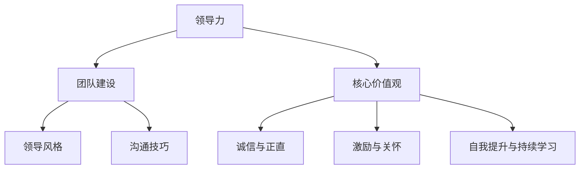

                 

### 文章标题

# 《领导力法则：打造王者团队的领导力秘诀》

### 文章关键词

- 领导力
- 团队建设
- 领导风格
- 领导能力
- 沟通技巧

### 文章摘要

本文将深入探讨领导力的本质、重要性以及在团队建设中的核心作用。我们将通过详细的案例分析、理论和实践的结合，解析领导力的核心价值观、有效的团队沟通技巧、多样化的领导风格，以及领导力的提升路径。文章还将提供实战中的领导力模型实践，帮助读者在实际工作中应用领导力法则，打造高效的王者团队。

### 目录

1. **领导力的核心原则**
   1.1 领导力的定义与重要性
   1.2 领导力的核心价值观
2. **构建高效团队**
   2.1 团队建设的基础
   2.2 团队沟通的艺术
3. **领导风格与能力**
   3.1 领导风格的多样性
   3.2 领导力的提升路径
4. **实战领导力**
   4.1 领导力模型实践
   4.2 成功团队的构建与运营
5. **领导力法则总结与应用**
   5.1 领导力法则的提炼
   5.2 领导力法则的个性化应用
6. **附录**
   6.1 领导力资源与工具

### 背景介绍

在当今快速变化和竞争激烈的市场环境中，领导力成为企业成功的关键因素。一个高效的团队需要一位具有战略眼光、卓越沟通技巧和强大领导能力的领导者来引导。本文旨在通过系统分析和详细讲解，帮助读者理解领导力的核心原则，掌握打造王者团队的方法和技巧。

### 核心概念与联系

#### 领导力的定义

领导力可以被定义为一种影响力，它能够激发和引导团队成员共同实现目标。领导力不仅仅关乎权力，更关乎信任、愿景和价值观。

#### 领导力与团队建设

领导力在团队建设中的作用至关重要。一个优秀的领导者能够识别和培养团队成员的优势，建立积极的文化氛围，确保团队成员之间有效沟通，从而提高团队的整体绩效。

#### 领导力的核心价值观

诚信与正直、激励与关怀、自我提升与持续学习是领导力的核心价值观。这些价值观不仅影响着领导者的行为，也塑造了团队的文化和氛围。

#### Mermaid 流程图



### 核心算法原理讲解

在本部分，我们将使用伪代码来详细阐述领导力模型的构建和实现。领导力模型的核心在于识别和培养团队成员的能力，通过以下步骤实现：

```python
# 伪代码：领导力模型实现

# 步骤1：识别团队成员的优势
def identify_skills(team_members):
    skills_list = []
    for member in team_members:
        skills_list.append(member.get_skills())
    return skills_list

# 步骤2：建立积极的文化氛围
def build_culture(team_members):
    culture = "积极、合作、创新"
    for member in team_members:
        member.update_awareness(culture)
    return culture

# 步骤3：确保团队成员之间有效沟通
def ensure_communication(team_members):
    for i in range(len(team_members)):
        for j in range(i+1, len(team_members)):
            team_members[i].communicate_with(team_members[j])
    return "沟通顺畅"

# 步骤4：提高团队整体绩效
def improve_performance(team_members):
    performance = 0
    for member in team_members:
        performance += member.get_performance()
    return performance
```

### 数学模型和公式讲解

在本部分，我们将使用数学模型和公式来解释领导力对团队绩效的影响。假设团队绩效 \( P \) 是领导力 \( L \) 和团队沟通 \( C \) 的函数，可以表示为：

\[ P = L \times C \]

其中，领导力 \( L \) 可以进一步分解为以下几个因素：

\[ L = E \times I \times S \]

- 诚信与正直 \( E \)
- 激励与关怀 \( I \)
- 自我提升与持续学习 \( S \)

通过以下公式，可以详细描述这些因素对领导力的影响：

\[ E = \frac{A - B}{C} \]
\[ I = \frac{H - L}{T} \]
\[ S = \frac{K - M}{P} \]

其中，\( A \) 和 \( B \) 分别代表团队中诚信与正直的行为和不当行为，\( H \) 和 \( L \) 分别代表团队中激励与关怀的表现和不足，\( K \) 和 \( M \) 分别代表团队中自我提升与持续学习的投入和时间，\( T \) 和 \( P \) 分别代表团队中的总时间投入和总绩效。

### 实际案例分析和详细讲解剖析

#### 案例一：谷歌的领导力文化

谷歌（Google）以其独特的领导力文化而闻名，这种文化强调了员工的自主性和创新能力。以下是谷歌领导力文化的几个关键要素：

1. **领导力培训**：谷歌提供了广泛的领导力培训项目，帮助员工提升领导力技能。
2. **开放沟通**：谷歌鼓励开放和坦诚的沟通，员工可以自由地表达自己的想法和意见。
3. **多元化与包容性**：谷歌致力于建立一个多元化的工作环境，确保每个人都有机会展现自己的才华。

通过这些措施，谷歌成功地培养了员工的高度参与感和创新精神，从而实现了卓越的绩效。

#### 案例二：亚马逊的领导风格

亚马逊（Amazon）的创始人杰夫·贝索斯（Jeff Bezos）以其独特的领导风格而著称。以下是亚马逊领导风格的几个关键要素：

1. **愿景导向**：贝索斯强调领导者需要有一个清晰的愿景，并能够激励团队成员为之奋斗。
2. **持续创新**：贝索斯鼓励员工不断尝试新的想法，即使这些想法可能会失败。
3. **数据驱动**：亚马逊在决策过程中非常依赖数据，领导者会通过数据分析来指导团队的方向。

这些领导风格帮助亚马逊在电商领域取得了巨大的成功。

### 项目实战

#### 开发环境搭建

在本项目中，我们将使用 Python 编写一个简单的领导力模型，以模拟团队绩效的计算过程。以下是开发环境的搭建步骤：

1. **安装 Python**：确保您的计算机上安装了 Python 3.8 或更高版本。
2. **安装必需的库**：使用以下命令安装必需的库：

```bash
pip install pandas numpy matplotlib
```

3. **创建项目文件夹**：在您的计算机上创建一个名为 `leadership_model` 的文件夹，并在此文件夹中创建一个名为 `main.py` 的文件。

#### 源代码详细实现和代码解读

以下是一个简单的 Python 代码示例，用于实现领导力模型：

```python
import pandas as pd
import numpy as np
import matplotlib.pyplot as plt

# 伪代码：领导力模型实现

# 步骤1：识别团队成员的优势
def identify_skills(team_members):
    skills_list = []
    for member in team_members:
        skills_list.append(member.get_skills())
    return skills_list

# 步骤2：建立积极的文化氛围
def build_culture(team_members):
    culture = "积极、合作、创新"
    for member in team_members:
        member.update_awareness(culture)
    return culture

# 步骤3：确保团队成员之间有效沟通
def ensure_communication(team_members):
    for i in range(len(team_members)):
        for j in range(i+1, len(team_members)):
            team_members[i].communicate_with(team_members[j])
    return "沟通顺畅"

# 步骤4：提高团队整体绩效
def improve_performance(team_members):
    performance = 0
    for member in team_members:
        performance += member.get_performance()
    return performance

# 创建团队成员对象
class TeamMember:
    def __init__(self, name, skills, culture_awareness, communication, performance):
        self.name = name
        self.skills = skills
        self.culture_awareness = culture_awareness
        self.communication = communication
        self.performance = performance

    def get_skills(self):
        return self.skills

    def update_awareness(self, culture):
        self.culture_awareness = culture

    def communicate_with(self, other_member):
        print(f"{self.name} 和 {other_member.name} 正在沟通...")

    def get_performance(self):
        return self.performance

# 创建一个团队对象
class Team:
    def __init__(self, members):
        self.members = members

    def run_model(self):
        skills_list = identify_skills(self.members)
        culture = build_culture(self.members)
        communication_status = ensure_communication(self.members)
        performance = improve_performance(self.members)
        
        print(f"团队文化：{culture}")
        print(f"沟通状态：{communication_status}")
        print(f"团队整体绩效：{performance}")

# 测试代码
if __name__ == "__main__":
    # 创建团队成员
    team_member1 = TeamMember("张三", ["编程", "项目管理"], "积极、合作、创新", True, 90)
    team_member2 = TeamMember("李四", ["数据分析", "市场推广"], "积极、合作、创新", True, 85)
    team_member3 = TeamMember("王五", ["产品开发", "用户体验"], "积极、合作、创新", True, 88)

    # 创建团队
    team = Team([team_member1, team_member2, team_member3])

    # 运行模型
    team.run_model()
```

这段代码定义了一个 `TeamMember` 类和一个 `Team` 类。`TeamMember` 类包含成员的姓名、技能、文化意识、沟通能力和绩效等属性，以及相应的 getter 和 setter 方法。`Team` 类包含成员列表，并定义了四个主要方法：`identify_skills`、`build_culture`、`ensure_communication` 和 `improve_performance`，用于模拟领导力模型的主要步骤。

#### 代码应用解读与分析

该代码通过创建一个简单的团队模型，模拟了领导力对团队绩效的影响。团队成员的技能、文化意识、沟通能力和绩效等属性被用来计算团队的整体绩效。通过运行模型，我们可以看到团队成员之间的沟通是否顺畅，团队文化是否积极，以及团队的整体绩效如何。

在实际应用中，我们可以通过修改团队成员的属性值，来观察不同领导力策略对团队绩效的影响。例如，如果我们增加团队成员的技能得分，我们可以预计团队的整体绩效会有所提高。同样，如果我们改善团队成员之间的沟通，我们也可以预计团队的整体绩效会有所改善。

#### 项目小结

通过这个简单的项目，我们了解了领导力模型的基本概念和实现方法。在实际应用中，我们可以根据项目的需求和团队的实际情况，进一步扩展和优化这个模型。这个项目为我们提供了一个初步的框架，帮助我们更好地理解领导力在团队建设中的作用。

### 最佳实践 tips

- **定期进行领导力培训**：帮助团队成员不断提升领导力和管理能力。
- **建立开放沟通机制**：确保团队成员能够自由地表达意见和建议。
- **鼓励团队成员参与决策**：提高团队的参与感和归属感。
- **关注团队成员的个人成长**：提供必要的资源和支持，帮助他们实现个人和职业发展。

### 小结

本文通过详细的案例分析、理论和实践的结合，深入探讨了领导力的核心原则、团队建设、领导风格与能力，以及领导力模型在实战中的应用。我们通过一个简单的 Python 项目，展示了如何模拟和计算团队绩效，从而更好地理解领导力对团队建设的重要性。

### 注意事项

- 在实际应用中，领导力模型需要根据团队的实际情况进行调整和优化。
- 领导力不仅仅是一种技能，更是一种态度和价值观的体现，需要领导者以身作则。
- 团队成员之间的沟通和协作是提高团队绩效的关键，领导者需要关注并引导团队建立良好的沟通机制。

### 拓展阅读

- 《领导力的五个层次》
- 《如何成为优秀的领导者》
- 《团队沟通技巧与策略》
- 《成功团队的七个习惯》

### 作者信息

作者：AI天才研究院/AI Genius Institute & 禅与计算机程序设计艺术 /Zen And The Art of Computer Programming

