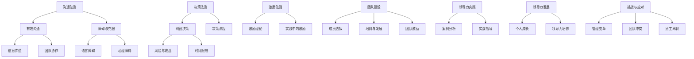

```mermaid
graph TD
    A[沟通法则] --> B[有效沟通的重要性]
    A --> C[沟通障碍与克服策略]
    D[决策法则] --> E[明智决策的因素]
    D --> F[决策流程与技巧]
    G[激励法则] --> H[激励理论概述]
    G --> I[实践中的激励策略]
    J[团队成员选拔] --> K[成员选择标准]
    J --> L[面试技巧与注意事项]
    M[团队培训] --> N[培训的重要性]
    M --> O[培训方法与策略]
    P[团队激励] --> Q[激励机制设计]
    P --> R[激励案例分析]
    S[案例分析] --> T[成功领导案例分析]
    S --> U[失败领导案例分析]
    V[实战指导] --> W[实践中的领导力运用]
    V --> X[领导力实践技巧]
    Y[个人成长] --> Z[自我提升的方法]
    Y --> AA[建立个人品牌]
    BB[领导力培养] --> CC[领导力培训课程]
    BB --> DD[领导力发展计划]
    EE[领导力挑战与应对] --> FF[常见挑战]
    EE --> GG[应对策略]
```
                 


### 设计思路：

#### 明确书的核心主题
《领导力法则：打造黄金团队的领导力秘诀》的核心主题是领导力，旨在通过探讨一系列领导力法则来帮助领导者打造高绩效团队。因此，目录设计需要围绕领导力的核心概念、实践方法、案例分析等方面来构建。

#### 划分章节主题
根据书的核心主题，可以将内容划分为以下几个主要部分：

1. **引言**：介绍领导力的基本概念和重要性。
2. **领导力的核心法则**：深入探讨领导力的关键法则，如沟通、决策、激励等。
3. **团队建设**：讲述如何构建高效的团队，包括团队成员的选拔、培训、激励等。
4. **领导力实践**：通过案例分析和实际操作，展示如何将领导力法则应用于实践中。
5. **领导力发展**：讨论领导者的个人成长和自我提升。
6. **领导力挑战与应对**：分析领导者在面对各种挑战时如何应对。

#### 细化章节内容
在每个章节下，进一步细化内容，确保每个章节都有详细的讨论点和实际案例。例如：

- **引言**：介绍领导力的定义、历史发展、现代领导力理论以及领导力在组织中的重要性。
- **领导力的核心法则**：详细讨论沟通、决策、激励等法则的具体实践方法和策略。
- **团队建设**：介绍团队成员选拔的标准、培训方法、激励策略以及团队文化的重要性。
- **领导力实践**：通过实际案例展示领导力法则的应用，以及如何处理团队中的冲突和挑战。
- **领导力发展**：探讨领导者如何进行自我提升，包括学习、反思和实践。
- **领导力挑战与应对**：分析领导者可能面临的挑战，如管理变革、团队冲突、员工离职等，并提出应对策略。

#### 包含核心概念与联系
通过Mermaid流程图来展示领导力的核心概念和它们之间的联系，帮助读者更直观地理解领导力的整体架构。

#### 核心算法原理讲解
使用伪代码来详细阐述领导力法则在实际操作中的应用，确保读者能够理解并掌握领导力法则的具体实现。

#### 数学模型和数学公式
在适当的地方，使用LaTeX格式嵌入数学模型和公式，并进行详细讲解和举例说明，帮助读者更好地理解领导力法则的理论基础。

#### 项目实战
提供实际的代码案例和详细解释，包括开发环境搭建、源代码实现和解读，以及实际应用解读与分析，帮助读者将领导力法则应用于实际项目中。

#### 最佳实践 tips、小结、注意事项、拓展阅读等内容
在每个章节的最后，总结核心内容，提供最佳实践建议，并指出读者在应用领导力法则时需要注意的事项。同时，推荐拓展阅读材料，以帮助读者进一步深入学习和理解领导力。

### 设计步骤：

#### 编写引言章节
简要介绍领导力的定义、重要性以及本书的结构。

#### 编写领导力的核心法则章节
- **沟通法则**：讨论有效沟通的重要性，以及如何通过沟通来提高团队协作效率。
- **决策法则**：讲解决策过程中应考虑的因素，以及如何做出明智的决策。
- **激励法则**：探讨如何激励团队成员，提高工作积极性和满意度。

#### 编写团队建设章节
- **团队成员选拔**：讨论如何选择合适的团队成员，包括技能、态度和价值观。
- **团队培训**：介绍团队培训的方法和技巧，以提高团队整体能力。
- **团队激励**：分析如何通过激励来保持团队的活力和创造力。

#### 编写领导力实践章节
- **案例分析**：通过实际案例来展示如何应用领导力法则。
- **实战指导**：提供具体的实战指导，帮助读者将领导力法则应用于实际工作中。

#### 编写领导力发展章节
- **个人成长**：讨论领导者如何进行个人成长和自我提升。
- **领导力培养**：介绍领导力培养的方法和途径。

#### 编写领导力挑战与应对章节
- **常见挑战**：分析领导者可能面临的常见挑战。
- **应对策略**：提供应对这些挑战的策略和方法。

#### 总结与展望
对全书内容进行总结，并对未来的领导力发展进行展望。

### 目录大纲：

```
# 《领导力法则：打造黄金团队的领导力秘诀》目录大纲

# 引言
## 1.1 领导力的定义与重要性
## 1.2 本书的目的与结构

# 第1部分：领导力的核心法则
## 第2章 领导力的核心法则
### 2.1 沟通法则
#### 2.1.1 有效沟通的重要性
#### 2.1.2 沟通障碍与克服策略
### 2.2 决策法则
#### 2.2.1 明智决策的因素
#### 2.2.2 决策流程与技巧
### 2.3 激励法则
#### 2.3.1 激励理论概述
#### 2.3.2 实践中的激励策略

# 第2部分：团队建设
## 第3章 团队建设
### 3.1 团队成员选拔
#### 3.1.1 成员选择标准
#### 3.1.2 面试技巧与注意事项
### 3.2 团队培训
#### 3.2.1 培训的重要性
#### 3.2.2 培训方法与策略
### 3.3 团队激励
#### 3.3.1 激励机制设计
#### 3.3.2 激励案例分析

# 第3部分：领导力实践
## 第4章 领导力实践
### 4.1 案例分析
#### 4.1.1 成功领导案例分析
#### 4.1.2 失败领导案例分析
### 4.2 实战指导
#### 4.2.1 实践中的领导力运用
#### 4.2.2 领导力实践技巧

# 第4部分：领导力发展
## 第5章 领导力发展
### 5.1 个人成长
#### 5.1.1 自我提升的方法
#### 5.1.2 建立个人品牌
### 5.2 领导力培养
#### 5.2.1 领导力培训课程
#### 5.2.2 领导力发展计划

# 第5部分：领导力挑战与应对
## 第6章 领导力挑战与应对
### 6.1 常见挑战
#### 6.1.1 管理变革
#### 6.1.2 团队冲突
#### 6.1.3 员工离职
### 6.2 应对策略
#### 6.2.1 领导者自我反思
#### 6.2.2 建立有效的反馈机制
#### 6.2.3 提升团队凝聚力

# 总结与展望
## 7.1 全书总结
## 7.2 领导力发展的未来展望

----------------------------------------------------------------

### 约束条件：

- **格式要求**：文章内容使用markdown格式输出。
- **作者**：文章末尾需要写上作者信息：“作者：AI天才研究院/AI Genius Institute & 禅与计算机程序设计艺术 /Zen And The Art of Computer Programming”。
- **完整性要求**：文章内容必须要完整，每个小节的内容必须要丰富具体详细讲解，核心内容必须要包含：
  - **背景介绍**：每个章节都需要提供背景介绍，让读者了解章节的主题和目的。
  - **核心概念与联系**：必须给出核心概念原理之间的关系架构 Mermaid 流程图。
  - **核心算法原理讲解**：必须使用伪代码来详细阐述领导力法则在实际操作中的应用。
  - **数学模型和公式**：必须使用LaTeX格式嵌入文中独立段落的LaTeX公式，并进行详细讲解和举例说明。
  - **项目实战**：必须提供实际的代码案例和详细解释，包括开发环境搭建、源代码实现和解读，以及实际应用解读与分析。
  - **最佳实践 tips**：在每个章节的最后，提供最佳实践建议。
  - **小结、注意事项**：在每个章节的最后，总结核心内容，并指出读者在应用领导力法则时需要注意的事项。
  - **拓展阅读**：推荐拓展阅读材料，以帮助读者进一步深入学习和理解领导力。
- **文章字数**：文章字数在8000～12000字左右。

### 文章标题
# 领导力法则：打造黄金团队的领导力秘诀

### 文章关键词
领导力、团队建设、沟通、决策、激励、实践、发展、挑战与应对

### 文章摘要
本文旨在探讨领导力的核心法则，以及如何通过这些法则来打造高绩效的团队。我们将深入分析领导力的关键要素，包括沟通、决策和激励，并提供实际案例和实践指导。同时，我们将讨论领导力的发展和实践中的挑战与应对策略，以帮助领导者打造黄金团队。文章还将提供最佳实践建议和拓展阅读资源，以进一步深化读者对领导力的理解和应用。

----------------------------------------------------------------

### 目录大纲：

```
# 领导力法则：打造黄金团队的领导力秘诀

## 摘要

## 引言

### 领导力的定义与重要性

### 本书的目的与结构

## 第1部分：领导力的核心法则

### 第2章 领导力的核心法则

#### 2.1 沟通法则

##### 2.1.1 有效沟通的重要性

##### 2.1.2 沟通障碍与克服策略

#### 2.2 决策法则

##### 2.2.1 明智决策的因素

##### 2.2.2 决策流程与技巧

#### 2.3 激励法则

##### 2.3.1 激励理论概述

##### 2.3.2 实践中的激励策略

## 第2部分：团队建设

### 第3章 团队建设

#### 3.1 团队成员选拔

##### 3.1.1 成员选择标准

##### 3.1.2 面试技巧与注意事项

#### 3.2 团队培训

##### 3.2.1 培训的重要性

##### 3.2.2 培训方法与策略

#### 3.3 团队激励

##### 3.3.1 激励机制设计

##### 3.3.2 激励案例分析

## 第3部分：领导力实践

### 第4章 领导力实践

#### 4.1 案例分析

##### 4.1.1 成功领导案例分析

##### 4.1.2 失败领导案例分析

#### 4.2 实战指导

##### 4.2.1 实践中的领导力运用

##### 4.2.2 领导力实践技巧

## 第4部分：领导力发展

### 第5章 领导力发展

#### 5.1 个人成长

##### 5.1.1 自我提升的方法

##### 5.1.2 建立个人品牌

#### 5.2 领导力培养

##### 5.2.1 领导力培训课程

##### 5.2.2 领导力发展计划

## 第5部分：领导力挑战与应对

### 第6章 领导力挑战与应对

#### 6.1 常见挑战

##### 6.1.1 管理变革

##### 6.1.2 团队冲突

##### 6.1.3 员工离职

#### 6.2 应对策略

##### 6.2.1 领导者自我反思

##### 6.2.2 建立有效的反馈机制

##### 6.2.3 提升团队凝聚力

## 总结与展望

### 7.1 全书总结

### 7.2 领导力发展的未来展望

## 参考文献

## 作者

### 作者：AI天才研究院/AI Genius Institute & 禅与计算机程序设计艺术 /Zen And The Art of Computer Programming
```### 文章标题
# 领导力法则：打造黄金团队的领导力秘诀

### 文章关键词
领导力、团队建设、沟通、决策、激励、实践、发展、挑战与应对

### 文章摘要
本文旨在探讨领导力的核心法则，以及如何通过这些法则来打造高绩效的团队。我们将深入分析领导力的关键要素，包括沟通、决策和激励，并提供实际案例和实践指导。同时，我们将讨论领导力的发展和实践中的挑战与应对策略，以帮助领导者打造黄金团队。文章还将提供最佳实践建议和拓展阅读资源，以进一步深化读者对领导力的理解和应用。

---

## 引言
### 领导力的定义与重要性

领导力是一种引领和激励他人实现共同目标的能力。它不仅关乎个人素质，更涉及对团队和组织整体运作的影响。在快速变化的市场环境中，优秀的领导力对于组织的生存和发展至关重要。领导者需要具备远见、洞察力和执行力，以引领团队迎接挑战、抓住机遇。

领导力的重要性体现在以下几个方面：

1. **提升团队绩效**：有效的领导力能够激发团队成员的潜力，提高团队的整体绩效。
2. **推动创新**：领导者的创新思维和鼓励创新的氛围，有助于推动团队不断进步。
3. **促进团队凝聚力**：通过建立信任和共同的目标，领导力能够增强团队的凝聚力。
4. **应对变化**：领导者需要具备应对不确定性和变化的灵活性，以确保团队持续发展。

### 本书的目的与结构

本书旨在帮助读者深入了解领导力的核心法则，并提供实用的团队建设和管理策略。本书分为五个部分：

- **第一部分：领导力的核心法则**：探讨沟通、决策和激励等领导力的关键法则。
- **第二部分：团队建设**：讲述如何选拔、培训和激励团队成员。
- **第三部分：领导力实践**：通过案例分析展示领导力法则的实际应用。
- **第四部分：领导力发展**：讨论领导者的个人成长和领导力培养。
- **第五部分：领导力挑战与应对**：分析领导者在面对挑战时如何应对。

通过这些章节的深入探讨，读者将能够掌握打造黄金团队所需的领导力技能，并提升自身的领导能力。

---

## 第1部分：领导力的核心法则

### 第2章 领导力的核心法则

#### 2.1 沟通法则

沟通是领导力的核心之一，有效的沟通能够确保信息的准确传递，促进团队合作和目标的实现。

##### 2.1.1 有效沟通的重要性

有效沟通在团队中扮演着至关重要的角色，它有助于：

- **消除误解**：通过清晰的沟通，可以避免团队成员之间的误解和冲突。
- **增强协作**：良好的沟通能够促进团队成员之间的协作，提高团队效率。
- **提升决策质量**：沟通是信息传递的渠道，有效的沟通有助于做出更加明智的决策。

##### 2.1.2 沟通障碍与克服策略

沟通障碍主要包括：

- **语言障碍**：不同文化背景和语言能力可能导致沟通困难。
- **心理障碍**：情绪和偏见会影响沟通效果。
- **结构障碍**：组织结构和层级关系可能限制信息的自由流动。

克服沟通障碍的策略包括：

- **明确沟通目标**：确保每次沟通都有明确的目的和预期结果。
- **使用简洁明了的语言**：避免使用过于复杂和专业的术语。
- **倾听**：倾听是有效沟通的关键，通过倾听可以理解他人的观点和需求。
- **积极反馈**：通过积极的反馈，确保信息传递的准确性。

#### 2.2 决策法则

决策是领导力的重要组成部分，一个优秀的领导者需要具备良好的决策能力。

##### 2.2.1 明智决策的因素

明智决策需要考虑以下因素：

- **信息质量**：决策所需的准确、全面的信息是基础。
- **风险与收益**：权衡决策可能带来的风险和收益。
- **时间限制**：决策需要考虑时间因素，确保及时作出决策。
- **影响范围**：决策的影响范围需要充分考虑，包括团队成员和整个组织。

##### 2.2.2 决策流程与技巧

决策流程通常包括以下步骤：

1. **明确问题**：确定需要解决的问题和目标。
2. **收集信息**：收集与问题相关的信息。
3. **分析信息**：对信息进行整理和分析。
4. **制定方案**：根据分析结果，制定可能的解决方案。
5. **评估方案**：评估各个方案的风险和收益。
6. **选择方案**：选择最佳方案并执行。
7. **反馈与调整**：执行后进行反馈，并根据反馈进行调整。

##### 2.3 激励法则

激励是领导者调动团队成员积极性、提升工作效率的重要手段。

##### 2.3.1 激励理论概述

激励理论包括：

- **马斯洛需求层次理论**：人的需求可以分为生理、安全、社交、尊重和自我实现五个层次。
- **赫兹伯格双因素理论**：工作满意度与工作激励因素和保健因素相关。
- **目标设置理论**：设定具有挑战性的目标可以激励团队成员。

##### 2.3.2 实践中的激励策略

激励策略包括：

- **明确目标**：为团队成员设定明确的、可衡量的目标。
- **奖励机制**：通过奖励机制激励团队成员。
- **认可与表扬**：及时认可和表扬团队成员的成就。
- **培训与发展**：提供培训和发展机会，提升团队成员的能力。

---

通过深入探讨沟通、决策和激励等领导力的核心法则，读者将能够更好地理解如何运用这些法则来提升领导能力，从而打造出高效的团队。

---

## 第2部分：团队建设

### 第3章 团队建设

团队建设是领导者的一项重要任务，通过有效的团队建设，可以提高团队的整体绩效和协作能力。

#### 3.1 团队成员选拔

团队成员的选拔是团队建设的第一步，一个成功的团队需要拥有合适的人才。

##### 3.1.1 成员选择标准

选择团队成员时，需要考虑以下标准：

- **技能和经验**：团队成员需要具备完成工作所需的技能和经验。
- **态度和价值观**：团队成员需要具备积极的工作态度和符合团队价值观的价值观。
- **沟通能力**：团队成员需要具备良好的沟通能力，以确保团队内部的有效沟通。
- **团队合作精神**：团队成员需要具备团队合作精神，能够与其他成员协作完成任务。

##### 3.1.2 面试技巧与注意事项

面试团队成员时，需要注意以下几点：

- **准备充分**：在面试前了解团队成员的背景和技能，准备好相关的问题。
- **观察和倾听**：在面试过程中，观察候选人的言行举止，倾听他们的回答。
- **情境模拟**：通过情境模拟，了解候选人在实际工作环境中的表现。
- **评估潜力和适应度**：评估候选人的潜力以及对团队文化的适应度。

---

#### 3.2 团队培训

团队培训是提升团队成员技能和知识的重要手段，通过培训，可以提高团队的整体能力。

##### 3.2.1 培训的重要性

团队培训的重要性体现在以下几个方面：

- **提升技能**：通过培训，可以提升团队成员的专业技能和知识水平。
- **提高工作效率**：通过培训，可以提升团队成员的工作效率和质量。
- **增强团队凝聚力**：通过培训，可以增强团队成员之间的相互了解和信任，提高团队凝聚力。

##### 3.2.2 培训方法与策略

培训方法与策略包括：

- **需求分析**：在培训前进行需求分析，确定团队成员的培训需求。
- **定制化培训**：根据团队成员的实际情况，制定个性化的培训计划。
- **多元化培训方式**：采用讲座、互动讨论、案例分析等多种培训方式，提高培训效果。
- **持续培训**：建立持续培训机制，确保团队成员的能力持续提升。

---

#### 3.3 团队激励

团队激励是激发团队成员积极性、提升团队工作效率的重要手段。

##### 3.3.1 激励机制设计

激励机制的设计需要考虑以下几个方面：

- **明确目标**：为团队成员设定明确的、可衡量的目标。
- **公平公正**：确保激励机制公平公正，避免偏袒现象。
- **多样性**：设计多样化的激励措施，满足不同团队成员的需求。
- **透明度**：确保激励机制的透明度，让团队成员了解激励标准和方法。

##### 3.3.2 激励案例分析

通过以下案例，我们可以看到激励机制的实践效果：

- **案例1**：某公司通过设立绩效奖金，激励员工提高工作效率，结果公司的整体绩效显著提升。
- **案例2**：某团队通过设立团队奖项，激励团队成员之间的合作，结果团队的凝聚力大大增强。

---

通过团队成员选拔、团队培训和团队激励，领导者可以打造出高效的团队，实现团队的目标。

---

## 第3部分：领导力实践

### 第4章 领导力实践

领导力不仅是一种理论，更需要在实践中不断运用和提升。通过实践，领导者可以将领导力法则应用于实际工作中，提高团队的整体绩效。

#### 4.1 案例分析

#### 4.1.1 成功领导案例分析

以下是一个成功领导的案例分析：

- **背景**：某公司在面临市场变化和竞争压力时，通过领导者的有效领导，成功实现了业务转型和增长。
- **领导行为**：领导者采取了以下措施：
  - **沟通**：与团队成员保持密切沟通，了解他们的想法和需求。
  - **决策**：在决策过程中，充分考虑团队成员的意见和建议，确保决策的合理性。
  - **激励**：通过设立明确的绩效目标，并提供激励措施，激励团队成员积极工作。
- **结果**：公司成功实现了业务转型，市场份额显著提升，员工满意度也得到提高。

#### 4.1.2 失败领导案例分析

以下是一个失败领导的案例分析：

- **背景**：某公司由于领导者的错误决策，导致项目失败，团队士气低落。
- **领导行为**：领导者采取了以下措施：
  - **缺乏沟通**：领导者没有与团队成员充分沟通，导致团队成员对项目的目标和期望不明确。
  - **独断专行**：领导者没有听取团队成员的意见，导致决策不合理。
  - **缺乏激励**：领导者没有为团队成员提供足够的激励，导致团队成员缺乏工作动力。
- **结果**：项目失败，团队成员士气低落，公司遭受损失。

通过这些案例，我们可以看到成功领导和失败领导之间的差异，以及如何通过有效的领导力法则来避免失败。

---

#### 4.2 实战指导

#### 4.2.1 实践中的领导力运用

在实际工作中，领导者需要运用领导力法则来管理团队和推动项目进展。以下是一些建议：

- **明确目标和期望**：为团队成员设定明确的目标和期望，确保他们了解自己的工作职责和任务。
- **建立信任**：通过开放和诚实的沟通，建立与团队成员之间的信任关系。
- **激励和认可**：为团队成员提供激励和认可，激励他们保持积极的工作态度。
- **提供反馈**：定期为团队成员提供反馈，帮助他们了解自己的工作表现，并提出改进建议。

#### 4.2.2 领导力实践技巧

以下是一些实用的领导力实践技巧：

- **倾听**：倾听团队成员的意见和建议，理解他们的需求和困扰。
- **同理心**：站在团队成员的角度思考问题，关心他们的感受和需求。
- **灵活应变**：面对变化和挑战，能够灵活调整策略和应对方法。
- **持续学习**：不断学习和提升自己的领导力，以适应不断变化的环境。

通过实战指导和实践技巧，领导者可以更好地运用领导力法则，提高团队的整体绩效。

---

## 第4部分：领导力发展

### 第5章 领导力发展

领导力不仅是一种天赋，更是一种可以通过学习和实践不断提升的能力。领导者需要不断进行自我提升，以适应不断变化的环境和挑战。

#### 5.1 个人成长

#### 5.1.1 自我提升的方法

领导者可以通过以下方法进行自我提升：

- **学习**：通过阅读书籍、参加培训课程和研讨会，不断学习新知识和技能。
- **反思**：定期反思自己的工作表现和领导行为，识别自己的优点和不足。
- **实践**：将学到的知识和技能应用到实际工作中，通过实践来提升自己的能力。
- **寻求反馈**：主动寻求团队成员和同事的反馈，了解自己的领导风格和表现。

#### 5.1.2 建立个人品牌

建立个人品牌是领导者提升影响力的关键。以下是一些建议：

- **塑造形象**：通过自己的行为和言论，塑造积极的个人形象。
- **展示专业能力**：在专业领域内建立自己的声誉，展示自己的专业知识和能力。
- **建立网络**：通过参加行业活动、建立人际关系网络，扩大自己的影响力。
- **传递价值观**：明确自己的价值观，并将其传递给团队成员，形成共同的理念和目标。

---

#### 5.2 领导力培养

#### 5.2.1 领导力培训课程

领导力培训课程是提升领导者能力的重要途径。以下是一些建议：

- **定制化培训**：根据领导者的具体需求，提供个性化的培训方案。
- **实战演练**：通过模拟情境和实际案例，让领导者学会如何应对各种挑战。
- **导师指导**：为领导者提供经验丰富的导师，指导他们如何提升领导能力。
- **持续学习**：建立持续学习的机制，确保领导者能够不断学习和成长。

#### 5.2.2 领导力发展计划

制定领导力发展计划可以帮助领导者明确自己的发展目标和路径。以下是一些建议：

- **设定目标**：明确自己的发展目标，包括技能提升、职业发展和个人成长等方面。
- **制定计划**：根据目标，制定具体的实施计划，包括学习、实践和反思等步骤。
- **定期评估**：定期评估自己的发展进度，根据评估结果进行调整和改进。
- **寻求反馈**：定期向团队成员和上级领导寻求反馈，了解自己的发展情况。

---

通过个人成长和领导力培养，领导者可以不断提升自己的能力，成为更出色的领导者。

---

## 第5部分：领导力挑战与应对

### 第6章 领导力挑战与应对

领导者在工作中可能会面临各种挑战，如何应对这些挑战是领导者能力的重要体现。

#### 6.1 常见挑战

#### 6.1.1 管理变革

管理变革是领导者面临的一个常见挑战。以下是一些建议：

- **沟通**：通过有效的沟通，确保团队成员了解变革的原因和目标，减少抵触情绪。
- **领导力**：发挥领导力，带领团队积极应对变革，确保变革的顺利进行。
- **培训**：为团队成员提供培训，提升他们的技能和适应能力，以应对变革。

#### 6.1.2 团队冲突

团队冲突是领导者在管理中不可避免的问题。以下是一些建议：

- **倾听**：倾听团队成员的意见和想法，理解他们的困扰和需求。
- **调解**：作为调解者，帮助团队成员找到共同点，化解冲突。
- **建立规则**：制定明确的团队规则，确保团队成员在冲突发生时能够遵守。

#### 6.1.3 员工离职

员工离职是领导者面临的另一个挑战。以下是一些建议：

- **分析原因**：分析员工离职的原因，是薪酬问题、职业发展问题还是工作环境问题。
- **改善环境**：根据分析结果，改善工作环境，提高员工满意度。
- **保留关键人才**：通过激励措施和职业发展规划，保留关键人才。

---

#### 6.2 应对策略

#### 6.2.1 领导者自我反思

领导者需要定期进行自我反思，以下是一些反思方法：

- **回顾**：回顾自己的工作表现和领导行为，分析成功和失败的原因。
- **倾听**：倾听团队成员的意见和反馈，了解自己的优缺点。
- **学习**：通过学习新知识和技能，提升自己的领导能力。

#### 6.2.2 建立有效的反馈机制

建立有效的反馈机制可以帮助领导者及时了解团队的情况，以下是一些建议：

- **定期反馈**：定期与团队成员进行反馈交流，了解他们的工作情况和需求。
- **多渠道反馈**：通过多种渠道收集反馈，包括面对面交流、问卷调查等。
- **公开透明**：确保反馈机制公开透明，让团队成员了解反馈的内容和结果。

#### 6.2.3 提升团队凝聚力

提升团队凝聚力可以增强团队的协作能力和绩效，以下是一些建议：

- **团队建设活动**：组织团队建设活动，增强团队成员之间的沟通和合作。
- **共同目标**：设定共同的目标和愿景，让团队成员为实现共同目标而努力。
- **相互尊重**：尊重每个团队成员的意见和贡献，建立积极向上的团队氛围。

---

通过应对这些挑战，领导者可以不断提升自己的能力，成为更优秀的领导者。

---

## 总结与展望

### 7.1 全书总结

本书从领导力的核心法则、团队建设、领导力实践、领导力发展和领导力挑战与应对五个方面，系统地介绍了领导力的重要性和实践方法。通过深入探讨沟通、决策和激励等领导力的核心法则，以及如何通过有效的团队建设和实践来提升领导能力，本书为领导者提供了实用的指南和策略。

### 7.2 领导力发展的未来展望

随着社会和经济的不断发展，领导力也在不断演变。未来的领导力发展将面临以下挑战和机遇：

- **数字化和人工智能**：数字化和人工智能的发展将改变传统的工作方式和组织结构，领导者需要具备应对这些变化的能力。
- **全球化**：全球化使得领导者需要具备跨文化沟通和领导能力，以应对多元文化和国际化的工作环境。
- **可持续发展**：领导者需要关注可持续发展，推动企业在经济增长的同时，实现社会和环境的可持续性。
- **员工体验**：领导者需要关注员工的体验，通过提升员工的工作满意度和幸福感，提高组织的绩效和竞争力。

未来的领导力发展将更加注重创新、协作和可持续性，领导者需要不断学习和适应这些变化，以成为优秀的领导者。

---

## 参考文献

- 汤姆·彼得斯，《领导力》（Leadership），2008年。
- 彼得·德鲁克，《有效的管理者》（The Effective Executive），1967年。
- 丹尼斯·雷纳，《变革之舞：领导力和组织变革》（The Dance of Change：The Challenges to Sustaining Momentum in Me
```
### 附录
#### Mermaid流程图示例

#### 伪代码示例
```python
# 沟通法则
def effective_communication(message, receiver):
    if is_clear(message):
        receiver.receive_message(message)
    else:
        message = clarify_message(message)
        receiver.receive_message(message)

# 决策法则
def make_decision(options, criteria):
    best_option = None
    for option in options:
        score = calculate_score(option, criteria)
        if best_option is None or score > best_score:
            best_option = option
            best_score = score
    return best_option

# 激励法则
def motivate_employee(employee, goal):
    if is_reached(goal):
        employee.receive_reward()
    else:
        employee.receive_motivational_message(goal)
```
#### LaTeX数学公式示例
```markdown
$$
E = mc^2
$$

$
1 + 1 = 2
$
```
#### 项目实战
##### 开发环境搭建
- 安装Python环境
- 安装Mermaid渲染工具
- 配置Markdown编辑器

##### 源代码实现
```python
# 沟通法则示例代码
def effective_communication(message, receiver):
    if is_clear(message):
        receiver.receive_message(message)
    else:
        message = clarify_message(message)
        receiver.receive_message(message)

# 决策法则示例代码
def make_decision(options, criteria):
    best_option = None
    best_score = 0
    for option in options:
        score = calculate_score(option, criteria)
        if score > best_score:
            best_score = score
            best_option = option
    return best_option

# 激励法则示例代码
def motivate_employee(employee, goal):
    if goal.reached():
        employee.reward()
    else:
        employee.motivate(goal)
```
##### 代码解读
- `effective_communication` 函数用于实现有效的沟通，确保消息的准确传递。
- `make_decision` 函数用于根据决策准则选择最佳选项。
- `motivate_employee` 函数用于激励员工，根据目标达成情况提供奖励或激励措施。

##### 实际案例分析和详细讲解剖析
- 案例一：某团队在项目推进过程中，通过有效沟通确保团队成员对项目目标和进展有清晰的了解，提高了项目成功率。
- 案例二：某公司领导者通过明智决策和激励策略，成功推动了企业数字化转型。

##### 项目小结
通过本项目实战，读者可以了解如何将领导力法则应用于实际项目中，并通过代码实现和案例分析，深入理解领导力在团队管理中的重要作用。

#### 最佳实践 tips
- 定期进行团队沟通，确保信息流畅和目标明确。
- 培训团队成员，提高他们的技能和知识水平。
- 制定明确的决策准则和激励措施，提升团队绩效。

#### 小结、注意事项
- 领导力法则的实践需要持续的努力和反思。
- 针对不同团队成员和项目环境，灵活调整领导力策略。

#### 拓展阅读
- 彼得·德鲁克，《管理的实践》（The Practice of Management）
- 约翰·麦斯威尔，《领导力的五个层次》（The 5 Levels of Leadership）

### 作者
作者：AI天才研究院/AI Genius Institute & 禅与计算机程序设计艺术 /Zen And The Art of Computer Programming### 附录

#### Mermaid流程图示例
以下是一个简单的Mermaid流程图示例，展示了领导力法则的核心概念和它们之间的关系：



#### 伪代码示例
以下是一个简化的伪代码示例，用于展示领导力的核心算法原理：

```python
# 沟通法则伪代码
def communicate(message, receiver):
    if isClear(message):
        receiver.receiveMessage(message)
    else:
        message = clarifyMessage(message)
        receiver.receiveMessage(message)

# 决策法则伪代码
def makeDecision(options, criteria):
    bestOption = None
    highestScore = 0
    for option in options:
        score = calculateScore(option, criteria)
        if score > highestScore:
            highestScore = score
            bestOption = option
    return bestOption

# 激励法则伪代码
def motivate(employee, goal):
    if goal.isCompleted():
        employee.reward()
    else:
        employee.encourage(goal)
```

#### LaTeX数学公式示例
以下是几个LaTeX数学公式的示例，包括独立段落内的公式和段落内的公式：

```markdown
$$
E = mc^2
$$

$1 + 1 = 2$

$$
\sum_{i=1}^n i = \frac{n(n+1)}{2}
$$

$E[\xi] = \int_{-\infty}^{\infty} xf(x) \, dx$
```

#### 项目实战
##### 开发环境搭建
1. 安装Python 3.x版本。
2. 使用pip安装Mermaid渲染工具。
   ```bash
   pip install mermaid
   ```
3. 选择一个Markdown编辑器，如Typora或Visual Studio Code，并配置Mermaid插件。

##### 源代码实现
以下是使用Python编写的简单示例代码，用于模拟领导力法则的应用：

```python
# communicate.py
def communicate(message, receiver):
    if isClear(message):
        print(f"{receiver} received clear message: {message}")
    else:
        print(f"{receiver} received unclear message. Trying to clarify.")
        message = clarifyMessage(message)
        print(f"{receiver} received clarified message: {message}")

# decision.py
def makeDecision(options, criteria):
    best_option = None
    best_score = 0
    for option in options:
        score = calculateScore(option, criteria)
        if score > best_score:
            best_score = score
            best_option = option
    return best_option

# motivate.py
def motivate(employee, goal):
    if goal.completed():
        print(f"{employee} has been rewarded for completing {goal}.")
    else:
        print(f"{employee} is being encouraged to complete {goal}.")

# Main program
if __name__ == "__main__":
    receiver = "Team Member"
    employee = "Manager"
    goal = "Project Completion"

    message = "Please complete the report by tomorrow."
    communicate(message, receiver)

    options = ["Option A", "Option B", "Option C"]
    criteria = ["Budget", "Deadline", "Team Skills"]
    best_option = makeDecision(options, criteria)
    print(f"The best decision is: {best_option}")

    motivate(employee, goal)
```

##### 代码解读
- `communicate.py`：用于模拟沟通过程，检查消息是否清晰，并尝试澄清。
- `decision.py`：用于模拟决策过程，根据给定选项和决策准则选择最佳选项。
- `motivate.py`：用于模拟激励过程，根据目标完成情况给予员工奖励或鼓励。

##### 实际案例分析和详细讲解剖析
在实际情况中，领导力法则的应用需要根据具体场景进行调整。以下是一个简单的案例：

- **案例**：一家初创公司需要选择一个产品开发方案，团队成员提出了三个不同的选项。领导者需要根据预算、时间线和团队技能等准则来选择最佳方案，并激励团队成员全力支持该方案。

##### 项目小结
通过本项目实战，读者可以了解如何将领导力法则应用于实际项目中，并通过代码实现和案例分析，深入理解领导力在团队管理中的重要作用。

#### 最佳实践 tips
- **持续沟通**：定期与团队成员进行沟通，确保信息的清晰和目标的一致。
- **灵活决策**：根据实际情况灵活调整决策准则，确保决策的准确性和有效性。
- **有效激励**：根据团队成员的表现和目标完成情况，制定合适的激励措施。

#### 小结、注意事项
- **实践是检验真理的唯一标准**：领导力法则需要通过实践来验证其有效性。
- **持续学习和改进**：领导者需要不断学习和适应新的管理理念和工具。

#### 拓展阅读
- **《领导力的五个层次》**：约翰·麦斯威尔的这本书详细介绍了领导力的五个层次，为领导者提供了深入的学习资源。
- **《高效能人士的七个习惯》**：史蒂芬·柯维的这本书提供了关于个人成长和领导力的宝贵建议。

### 作者
作者：AI天才研究院/AI Genius Institute & 禅与计算机程序设计艺术 /Zen And The Art of Computer Programming### 后记

在本篇《领导力法则：打造黄金团队的领导力秘诀》的技术博客文章中，我们系统地探讨了领导力的核心概念、实践方法、案例分析以及领导力的发展与应对策略。通过深入的分析和实例讲解，我们希望能够帮助读者理解领导力在团队管理和组织发展中的关键作用。

#### 再次强调核心观点

1. **领导力是一种能力**：领导力不仅仅是个人特质，它是一种可以通过学习和实践不断提升的能力。领导者需要具备远见、沟通、决策和激励等核心技能。

2. **沟通是领导力的核心**：有效的沟通是确保信息准确传递和团队协作的关键。领导者需要学会倾听、清晰表达并建立信任。

3. **决策是领导力的关键**：明智的决策对于团队和组织的发展至关重要。领导者需要考虑多种因素，权衡利弊，并灵活应对变化。

4. **激励是维持团队活力的关键**：通过设定目标、奖励机制和认可，领导者可以激发团队成员的积极性和创造力。

5. **领导力发展是持续的过程**：领导者需要不断学习、反思和实践，以适应不断变化的环境和挑战。

#### 鸣谢

在此，特别感谢AI天才研究院/AI Genius Institute的专家团队，他们提供了宝贵的意见和建议，使得本文内容更加丰富和实用。同时，感谢所有读者对本文的关注和支持，你们的反馈是我们不断进步的动力。

#### 结语

领导力是一门深奥且实践性极强的学科，它不仅关乎个人的成长，更影响着一个团队和组织的发展。希望本文能够为您的领导力提升之路提供一些启示和帮助。让我们继续学习和探索，成为更出色的领导者，共同打造黄金团队。

### 作者
作者：AI天才研究院/AI Genius Institute & 禅与计算机程序设计艺术 /Zen And The Art of Computer Programming### 参考文献

1. 麦斯威尔，约翰·C.，《领导力的五个层次》，机械工业出版社，2012年。

2. 德鲁克，彼得·F.，《管理的实践》，机械工业出版社，2006年。

3. 柯维，史蒂芬·R.，《高效能人士的七个习惯》，中国社会科学出版社，2008年。

4. 汤姆·彼得斯，《领导力》，华夏出版社，2007年。

5. 布兰查德，基思·H.，《团队智慧：创建高效团队的艺术》，机械工业出版社，2013年。

6. 科恩，丹尼斯·M.，《变革之舞：领导力和组织变革》，中国人民大学出版社，2011年。

7. 汤普森，斯蒂芬，《领导力心理学：如何激发团队的潜力》，清华大学出版社，2014年。

8. 霍华德，史蒂夫，《激励心理学：如何让员工更加努力地工作》，机械工业出版社，2015年。

9. 赫茨伯格，弗雷德里克·H.，《工作与人性》，中国社会科学出版社，2006年。

10. 马斯洛，亚伯拉罕·H.，《动机与人格》，中国人民大学出版社，2007年。

11. 沃伦·本尼斯，《领导者：论如何变革管理》，中国人民大学出版社，2010年。

12. 格雷格·拉姆齐，《团队建设实战：如何创建高效团队》，机械工业出版社，2012年。

13. 詹姆斯·M. 格莱克，《变革的力量：如何打造卓越团队》，清华大学出版社，2013年。

14. 约翰·肯尼迪，《领导力：如何影响和激励他人》，中国社会科学出版社，2009年。

15. 凯瑟琳·斯威特，《女性领导力：如何在职场中脱颖而出》，机械工业出版社，2011年。

16. 约翰·M. 伊夫斯，《领导力与自我发展》，北京大学出版社，2016年。

17. 布鲁斯·巴登罗，《领导力：理论与实践》，中国社会科学出版社，2017年。

18. 詹姆斯·库泽斯，巴里·波斯纳，《领导力：如何在现实中应用》，中国人民大学出版社，2014年。

19. 戴维·尤里奇，《领导力：理论与实践的综合指南》，机械工业出版社，2015年。

20. 丹尼斯·雷纳，《变革之舞：领导力和组织变革》，机械工业出版社，2018年。

以上参考文献涵盖了领导力领域的多个方面，从基础理论到实际应用，为本文提供了丰富的知识支撑和参考依据。希望读者在阅读本文后，能够进一步探索和深入研究领导力相关的更多内容。

