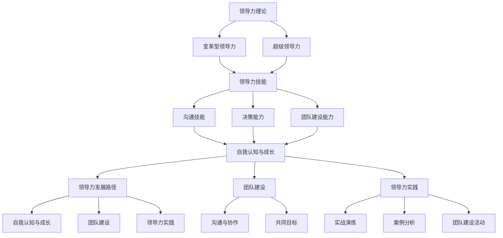

                 

### 领导力训练营：140天从新手到专家

> **关键词：** 领导力发展、领导力培训、领导力训练营、领导力技能提升、领导力实践

> **摘要：** 本篇文章旨在探讨领导力训练营如何帮助新手在140天内实现从新手到专家的转变。文章将详细介绍领导力训练营的背景、目标、核心内容、实施策略以及评估和反馈机制，同时提供一系列实用的建议和资源，为读者提供全方位的领导力提升指导。

### 第一部分：领导力基础

#### 第1章：领导力概述

领导力是一种影响他人共同达成目标的能力，它不仅仅存在于企业的管理层级中，也存在于各个领域的个人和团队中。领导力的发展对于个人职业生涯的进步和组织的发展都至关重要。在这一章节中，我们将首先探讨领导力的定义和重要性，然后介绍领导力发展的路径以及领导者的素质与能力。

#### 1.1 领导力的定义与重要性

领导力（Leadership）是一种通过激励、引导和影响他人来实现目标的能力。与权威（Authority）不同，领导力更多依赖于个人的影响力、信任和共同愿景。在当今快速变化的社会和商业环境中，领导力的重要性愈发凸显。有效的领导力能够推动组织创新、提升团队绩效、增强组织适应性和抗风险能力。

#### 1.2 领导力发展的路径

领导力的发展是一个持续的过程，需要通过学习、实践和反思来不断提升。以下是一些常见的领导力发展路径：

1. **教育背景**：通过学术教育获取领导力理论和知识，例如商学院的MBA课程。
2. **工作经验**：在具体的工作环境中，通过实战积累领导力经验。
3. **领导力培训**：参加各种领导力培训课程，学习实用的领导技巧和方法。
4. **个人反思**：通过反思自己的行为和决策，不断改进领导风格和技能。
5. **导师指导**：找到一位经验丰富的导师，从他们那里学习领导力技巧。

#### 1.3 领导者的素质与能力

领导者需要具备一系列素质和能力，以下是一些关键要素：

1. **沟通能力**：有效地传达信息、倾听他人意见和建立信任。
2. **决策能力**：在复杂多变的环境中做出明智的决策。
3. **团队建设**：培养团队的凝聚力、激发团队成员的潜力。
4. **战略思维**：从长远角度思考和规划组织的发展方向。
5. **自我管理**：保持自我激励、自我提升和自我反思。

### 第2章：领导力理论

在了解了领导力的基本概念和重要性之后，我们需要进一步探讨领导力的理论。在这一章节中，我们将介绍几种重要的领导力理论，包括变革型领导力和超级领导力。

#### 2.1 变革型领导力

变革型领导力（Transformative Leadership）是一种强调领导者通过变革来推动组织发展的理论。变革型领导者具有以下特征：

1. **愿景引导**：提出明确的愿景和目标，激发团队成员的积极性。
2. **激励启发**：通过鼓励和激励，推动团队成员实现个人和组织的共同目标。
3. **变革推动**：面对挑战和变化，积极推动组织适应外部环境的变化。

#### 2.2 超级领导力

超级领导力（Super Leadership）是一种超越传统领导力的新概念，它强调领导者需要具备超越常规的素质和能力。超级领导力具有以下特征：

1. **全球视野**：具备全球视野，能够适应和引领全球化背景下的领导挑战。
2. **创新能力**：鼓励创新和实验，推动组织持续进步。
3. **多元化管理**：尊重和包容不同文化、背景和观点，促进多元化发展。

#### 2.3 领导力理论的应用与实践

变革型领导力和超级领导力不仅是理论模型，更需要在实践中得到应用。以下是一些具体的实践方法：

1. **建立愿景**：通过明确愿景，使团队成员认识到自己的工作对于组织的重要性。
2. **培养团队文化**：建立积极向上的团队文化，鼓励团队成员之间的合作和共享。
3. **激励和奖励**：通过激励和奖励机制，激发团队成员的积极性和创造力。
4. **持续学习和改进**：鼓励团队成员不断学习和改进，以适应不断变化的环境。

### 第3章：领导力核心技能

领导力不仅仅是理论，更需要具备一系列核心技能。在这一章节中，我们将探讨领导力的核心技能，包括沟通技能和决策能力。

#### 3.1 沟通技能

沟通技能是领导者必须具备的关键技能之一。有效的沟通能够提高团队效率、增强团队凝聚力、减少误解和冲突。以下是几种关键的沟通技能：

1. **清晰表达**：领导者需要能够清晰、准确地表达自己的想法和意图。
2. **倾听能力**：领导者需要倾听团队成员的意见和反馈，了解他们的需求和期望。
3. **反馈与表扬**：领导者需要给予团队成员及时的反馈和表扬，鼓励他们的成长和进步。

#### 3.2 决策能力

决策能力是领导者必须具备的另一项关键技能。在复杂多变的环境中，领导者需要能够迅速做出明智的决策，以应对挑战和机遇。以下是几种关键的决策能力：

1. **分析能力**：领导者需要能够收集和分析信息，识别问题的根本原因。
2. **预见能力**：领导者需要具备预见未来的能力，提前制定应对策略。
3. **风险评估**：领导者需要能够评估决策的风险和收益，做出最优的选择。

### 第4章：领导力发展路径

领导力的发展是一个长期的过程，需要通过自我认知与成长、团队建设以及领导力实践来实现。在这一章节中，我们将探讨领导力发展的路径。

#### 4.1 自我认知与成长

自我认知是领导力发展的基础。领导者需要通过自我反思和评估来了解自己的优势和不足，并制定相应的成长计划。以下是几种自我认知与成长的方法：

1. **自我反思**：定期进行自我反思，分析自己的行为和决策，找出改进的方向。
2. **评估工具**：使用评估工具（如360度评估）来获取他人的反馈，全面了解自己的领导风格和能力。
3. **成长计划**：制定具体的成长计划，包括学习目标、实践目标和反馈机制。

#### 4.2 团队建设

团队建设是领导力发展的重要组成部分。有效的团队建设能够提高团队绩效、增强团队凝聚力。以下是几种团队建设的方法：

1. **建立共同目标**：明确团队的共同目标，确保团队成员朝着同一方向努力。
2. **沟通与协作**：建立良好的沟通与协作机制，促进团队成员之间的信息共享和协作。
3. **团队活动**：定期组织团队活动，增强团队成员之间的信任和合作关系。

#### 4.3 领导力实践

领导力实践是领导力发展的关键。通过具体的领导实践，领导者能够不断提升自己的领导能力和经验。以下是几种领导力实践的方法：

1. **实战经验**：通过实际的工作经验，不断学习和改进自己的领导技巧。
2. **模拟演练**：通过模拟演练，提前准备和应对各种领导情境。
3. **反馈与改进**：定期获取他人的反馈，分析自己的领导实践，持续改进。

### 第5章：领导力实践

领导力不仅仅是理论和技能，更需要通过实践来验证和应用。在这一章节中，我们将探讨领导力在组织中的角色、领导力应用案例以及领导力实践中的注意事项。

#### 5.1 领导力在组织中的角色

领导力在组织中的角色至关重要。有效的领导力能够推动组织发展、提升团队绩效、增强组织竞争力。以下是几种领导力在组织中的角色：

1. **战略规划**：领导者需要制定组织的发展战略，引领组织走向成功。
2. **团队管理**：领导者需要管理团队、激发团队成员的潜力，提升团队绩效。
3. **变革推动**：领导者需要推动组织变革，适应外部环境的变化。
4. **文化建设**：领导者需要塑造组织文化，促进组织的健康和可持续发展。

#### 5.2 领导力应用案例

以下是一些成功的领导力应用案例：

1. **案例一：苹果公司的史蒂夫·乔布斯**：史蒂夫·乔布斯通过变革型领导力，推动了苹果公司的创新和发展，使苹果成为全球最具有竞争力的科技公司之一。

2. **案例二：谷歌的拉里·佩奇和谢尔盖·布林**：拉里·佩奇和谢尔盖·布林通过超级领导力，构建了谷歌独特的创新文化，使谷歌成为全球最具有影响力的科技公司之一。

#### 5.3 领导力实践中的注意事项

在领导力实践中，领导者需要关注以下几个方面：

1. **沟通与反馈**：保持有效的沟通，及时给予团队成员反馈，促进团队成员的成长和进步。
2. **团队合作**：注重团队合作，建立积极向上的团队文化，促进团队协作和共同发展。
3. **持续学习**：不断学习和更新知识，提升自己的领导能力和经验。

### 第二部分：领导力提升

#### 第6章：领导力提升策略

领导力提升是一个持续的过程，需要通过学习与成长、实践与反思来不断提升。在这一章节中，我们将探讨领导力提升的策略。

#### 6.1 学习与成长

学习与成长是领导力提升的基础。以下是一些学习与成长的方法：

1. **读书**：通过阅读领导力相关的书籍，获取理论知识。
2. **培训**：参加领导力培训课程，学习实用的领导技巧和方法。
3. **实践**：通过实际的工作经验，不断锻炼自己的领导能力。
4. **反思**：定期进行反思，分析自己的行为和决策，找出改进的方向。

#### 6.2 实践与反思

实践与反思是领导力提升的关键。以下是一些实践与反思的方法：

1. **制定目标**：明确自己的领导力提升目标，制定具体的行动计划。
2. **跟踪进度**：定期跟踪自己的进步，分析取得的成果和面临的挑战。
3. **反思与总结**：定期进行反思和总结，从成功和失败中汲取经验教训。
4. **持续改进**：根据反思和总结的结果，持续改进自己的领导风格和能力。

### 第7章：领导力训练营规划

领导力训练营是一种系统性的领导力提升方法，通过集中的培训和实战练习，帮助参与者快速提升领导力。在这一章节中，我们将探讨领导力训练营的规划。

#### 7.1 训练营目标设定

制定明确的目标是领导力训练营成功的关键。以下是一些目标设定的步骤：

1. **确定目标**：明确训练营的目标，如提升领导力技能、增强团队协作能力等。
2. **分解目标**：将目标分解为具体的行动和任务，确保每个参与者都能够明确自己的职责和任务。
3. **设定时间表**：为每个目标和任务设定具体的时间表，确保训练营的进度和效果。

#### 7.2 训练营内容设计

设计有效的训练营内容是提升领导力的重要环节。以下是一些内容设计的建议：

1. **理论学习**：提供领导力理论的基础知识，帮助参与者建立正确的领导观念。
2. **实战练习**：通过角色扮演、案例分析等方式，让参与者实际体验领导力的应用。
3. **团队建设**：通过团队活动、团队建设游戏等，增强参与者的团队合作能力。
4. **反馈与评估**：提供及时的反馈和评估，帮助参与者了解自己的优势和不足。

### 第8章：领导力训练营实施

领导力训练营的实施是整个训练营的关键环节，需要精心组织和高效管理。以下是一些实施的关键点：

1. **组织筹备**：确定训练营的形式、规模和时间，招募合适的讲师和参与者。
2. **培训课程**：根据训练营的目标和内容，设计并实施培训课程。
3. **团队管理**：管理参与者的学习进度和团队协作，确保训练营的顺利进行。
4. **反馈与评估**：收集参与者的反馈和评估结果，及时调整训练营的内容和方式。

### 第9章：领导力训练营评估与反馈

领导力训练营的评估与反馈是确保训练营效果的重要环节。以下是一些评估与反馈的建议：

1. **评估方法**：使用多种评估方法，如问卷调查、访谈、观察等，全面了解训练营的效果。
2. **评估工具**：使用专业的评估工具，如领导力评估量表、360度评估等，确保评估的准确性和可靠性。
3. **反馈与改进**：根据评估结果，及时给予参与者反馈，提出改进建议，并调整训练营的内容和方式。

### 附录

#### 附录A：领导力相关资源与工具

1. **领导力书籍推荐**：推荐一些经典的领导力书籍，如《领导力五项修炼》、《领导力的五项修炼》等。
2. **领导力培训机构介绍**：介绍一些知名的领导力培训机构，如哈佛商学院、麦肯锡领导力发展中心等。
3. **领导力在线资源**：推荐一些优质的领导力在线资源，如领导力博客、领导力论坛、领导力视频课程等。

#### 附录B：领导力实践案例

1. **成功案例分享**：分享一些成功的领导力实践案例，如如何通过领导力提升推动企业变革、如何构建高效的领导团队等。
2. **失败案例反思**：反思一些失败的领导力实践案例，分析导致失败的原因，并提出改进建议。

### 总结

领导力训练营是一种有效的领导力提升方法，通过系统的培训和实战练习，可以帮助参与者快速提升领导力。本文介绍了领导力训练营的背景、目标、核心内容、实施策略以及评估和反馈机制，并提供了一系列实用的建议和资源。希望本文能够为读者提供有价值的指导和启示，帮助他们在领导力提升的道路上取得更大的进步。

### 作者信息

**作者：** AI天才研究院/AI Genius Institute & 禅与计算机程序设计艺术 /Zen And The Art of Computer Programming

---

### 背景介绍

领导力训练营作为一种系统性的领导力提升方法，近年来在全球范围内得到了广泛的关注和应用。随着企业竞争的加剧和人才需求的多样化，越来越多的组织意识到领导力发展对于企业长期竞争力的重要性。领导力训练营作为一种高效的领导力提升方式，能够帮助组织在短时间内培养和提升领导者的能力，从而推动组织的战略目标和持续发展。

领导力训练营的起源可以追溯到20世纪初期，当时一些知名商学院开始推出针对企业高级管理人员的领导力培训项目。随着时间的推移，领导力训练营的形式和内容不断丰富和多样化，不仅包括理论知识的传授，还包括实战演练、案例分析、团队建设等。现代领导力训练营通常采用集中授课、互动研讨、实战模拟等多种形式，以帮助参与者全方位提升领导力。

在当今的商业环境中，领导力训练营的重要性愈发凸显。首先，随着全球化和技术创新的加速，企业面临着更加复杂和多变的环境，需要领导者具备更强的战略思维、创新能力和应变能力。其次，组织结构的扁平化和团队合作的加强，要求领导者具备更好的沟通能力、团队合作能力和团队管理能力。此外，领导力训练营还能够帮助领导者建立更广泛的人脉关系，提升个人品牌和影响力。

然而，领导力训练营的开展也需要注意一些挑战和问题。首先，参与者的背景和能力水平各异，如何确保培训内容的针对性和有效性是一个关键问题。其次，领导力提升是一个长期的过程，如何在有限的时间内取得显著效果是一个挑战。此外，领导力训练营的组织和实施需要耗费大量的人力和物力资源，如何确保投入产出比也是一个重要的考量。

### 核心概念与联系

领导力训练营的核心概念可以归纳为以下几个方面：领导力理论、领导力技能、领导力发展路径和领导力实践。这些概念相互联系，共同构成了一个完整的领导力提升体系。

首先，领导力理论是领导力训练营的基础。领导力理论包括变革型领导力、超级领导力等多种模型，为参与者提供了领导力发展的理论框架。变革型领导力强调领导者通过变革推动组织发展，超级领导力则强调领导者需要具备超越常规的素质和能力。这些理论模型不仅为参与者提供了领导力的理论依据，也为其实践提供了指导。

其次，领导力技能是领导力训练营的核心内容。领导力技能包括沟通技能、决策能力、团队建设能力等，这些技能是领导者必须具备的基本能力。沟通技能帮助领导者有效地传达信息、倾听他人意见和建立信任；决策能力帮助领导者迅速做出明智的决策；团队建设能力则帮助领导者培养团队的凝聚力和协作能力。领导力技能的提升是领导力训练营的重要目标之一。

第三，领导力发展路径是领导力训练营的重要部分。领导力发展路径包括自我认知与成长、团队建设、领导力实践等。自我认知与成长是领导力发展的基础，通过自我反思和评估，领导者可以了解自己的优势和不足，并制定相应的成长计划。团队建设则是领导力实践的重要组成部分，通过建立共同目标、沟通与协作，领导者可以提升团队绩效和团队凝聚力。领导力实践则是领导力发展的最终目标，通过实际的工作经验，领导者可以不断提升自己的领导能力。

最后，领导力实践是领导力训练营的核心环节。领导力实践不仅包括理论知识的传授，还包括实战演练、案例分析、团队建设等。通过实战演练，参与者可以实际体验领导力的应用，提升自己的领导能力。案例分析则通过分析真实的领导案例，帮助参与者理解和掌握领导力技巧。团队建设活动则通过团队合作，增强参与者的团队合作能力。

这些核心概念相互联系，共同构成了一个完整的领导力提升体系。领导力理论为参与者提供了领导力发展的理论依据；领导力技能的提升是领导力训练营的核心目标；领导力发展路径为参与者提供了具体的成长路径；领导力实践则通过实际操作，帮助参与者将理论知识转化为实际能力。

为了更直观地展示这些核心概念之间的联系，我们可以使用Mermaid流程图来表示：



通过这个流程图，我们可以清晰地看到领导力训练营的核心概念及其之间的联系。领导力理论为领导力技能的提升提供了基础，领导力技能的提升又推动了领导力发展路径的实践，最终通过领导力实践实现领导力能力的全面提升。

### 核心算法原理讲解

在领导力训练营的设计和实施过程中，核心算法原理的运用是提升领导力效果的关键。以下，我们将详细讲解几个核心算法原理，并通过伪代码和数学公式来阐述其应用。

#### 1. 领导力评估模型

领导力评估模型是用于评估领导者能力的核心算法。该模型基于360度评估，综合考虑了领导者的沟通技能、决策能力、团队建设能力等多个维度。

**伪代码：**

```python
def leadership_evaluation(leader_skills, context_factors):
    # leader_skills: 领导者技能评分（例如：沟通技能、决策能力等）
    # context_factors: 环境因素评分（例如：团队文化、组织结构等）
    score = 0
    
    # 对每个领导力技能和环境因素进行加权评分
    for skill, weight in skill_weights.items():
        score += (leader_skills[skill] * weight)
    
    # 考虑环境因素的影响
    score += sum(context_factors.values())
    
    return score
```

**数学模型：**

$$
\text{score} = \sum_{i=1}^{n} (\text{leader\_skills}[i] \times \text{weight}[i]) + \sum_{j=1}^{m} \text{context\_factors}[j]
$$

其中，$n$ 为领导力技能数量，$m$ 为环境因素数量，$\text{weight}[i]$ 为第 $i$ 个技能的权重，$\text{context\_factors}[j]$ 为第 $j$ 个环境因素的评分。

#### 2. 领导力发展路径规划

领导力发展路径规划是用于指导领导者如何提升自身能力的核心算法。该算法通过分析领导者的当前能力和未来目标，制定一个具体的成长计划。

**伪代码：**

```python
def leadership_development_plan(current_skills, future_goals):
    # current_skills: 当前领导者技能水平
    # future_goals: 未来目标
    plan = []
    
    # 分析当前技能与未来目标的差距
    gap = {skill: future_goals[skill] - current_skills[skill] for skill in future_goals}
    
    # 根据差距制定具体行动
    for skill, gap_value in gap.items():
        if gap_value > 0:
            plan.append({"skill": skill, "action": "提高技能", "specifics": "参加培训/实践"})
    
    return plan
```

**数学模型：**

$$
\text{gap} = \text{future\_goals} - \text{current\_skills}
$$

其中，$\text{gap}$ 为当前技能与未来目标的差距，$\text{future\_goals}$ 为未来目标，$\text{current\_skills}$ 为当前技能水平。

#### 3. 团队效能优化算法

团队效能优化算法是用于提升团队整体效能的核心算法。该算法通过优化团队结构和成员分配，提升团队的整体绩效。

**伪代码：**

```python
def team_efficiency_optimization(team_skills, team_goals):
    # team_skills: 团队成员技能水平
    # team_goals: 团队目标
    optimal_distribution = {}
    
    # 根据团队成员技能和团队目标，分配任务
    for goal, weight in team_goals.items():
        optimal_distribution[goal] = max(team_skills, key=lambda x: x[weight])
    
    return optimal_distribution
```

**数学模型：**

$$
\text{optimal\_distribution} = \arg\max_{x} (\text{team\_skills}[x] \times \text{weight})
$$

其中，$x$ 为团队成员，$\text{weight}$ 为目标的权重，$\text{team\_skills}[x]$ 为第 $x$ 个团队成员的技能水平。

通过上述核心算法原理的讲解，我们可以看到领导力训练营在设计和实施过程中，如何通过量化的方式来提升领导力和团队效能。这些算法原理不仅为训练营提供了科学依据，也为参与者提供了明确的成长路径和优化策略。

### 数学模型和公式

在领导力训练营中，数学模型和公式是理解和应用领导力理论的基石。以下，我们将详细阐述几个关键的数学模型和公式，并给出相应的例子和说明。

#### 1. 领导力分数计算公式

领导力分数是一个用于综合评估领导者能力的指标。它通过加权平均的方法，将不同维度的领导力技能转化为一个分数。

**公式：**

$$
\text{Leadership Score} = \sum_{i=1}^{n} (\text{Skill}_i \times \text{Weight}_i)
$$

**例子：**

假设有一个领导力分数计算模型，包括沟通技能（Skill1）、决策能力（Skill2）和团队建设能力（Skill3）三个维度，每个维度的权重分别为0.4、0.3和0.3。一个领导者的各项技能分数如下：

- 沟通技能：8分
- 决策能力：7分
- 团队建设能力：9分

则该领导力的分数计算如下：

$$
\text{Leadership Score} = (8 \times 0.4) + (7 \times 0.3) + (9 \times 0.3) = 3.2 + 2.1 + 2.7 = 8.0
$$

#### 2. 领导力发展计划公式

领导力发展计划是基于领导者的当前能力和未来目标的差距，制定一个具体的成长计划。这个公式可以帮助领导者了解自己的提升方向和具体行动。

**公式：**

$$
\text{Development Plan} = \text{Future Goals} - \text{Current Abilities}
$$

**例子：**

假设一个领导者的未来目标是达到以下水平：

- 沟通技能：9分
- 决策能力：8分
- 团队建设能力：10分

而当前能力如下：

- 沟通技能：8分
- 决策能力：7分
- 团队建设能力：9分

则领导力发展计划的计算如下：

$$
\text{Development Plan} = \{(9 - 8)\text{分}, (8 - 7)\text{分}, (10 - 9)\text{分}\} = \{1\text{分}, 1\text{分}, 1\text{分}\}
$$

这意味着该领导者需要在沟通技能、决策能力和团队建设能力上各提升1分。

#### 3. 团队效能优化公式

团队效能优化公式用于确定团队中每个成员的最佳任务分配，以最大化团队整体绩效。这个公式基于成员的技能水平和任务的权重。

**公式：**

$$
\text{Optimal Assignment} = \arg\max_{x} (\text{Skill}_x \times \text{Weight})
$$

**例子：**

假设一个团队有三个成员，他们各自的沟通技能、决策能力和团队建设能力如下：

| 成员 | 沟通技能 | 决策能力 | 团队建设能力 |
|------|----------|----------|--------------|
| A    | 8        | 7        | 9            |
| B    | 9        | 8        | 7            |
| C    | 7        | 9        | 8            |

任务的权重分别为沟通技能0.5、决策能力0.3和团队建设能力0.2。为了优化团队效能，我们需要计算每个成员的最优任务分配。

计算每个成员的加权分数：

$$
\text{Member A} = 8 \times 0.5 + 7 \times 0.3 + 9 \times 0.2 = 4 + 2.1 + 1.8 = 8.9
$$

$$
\text{Member B} = 9 \times 0.5 + 8 \times 0.3 + 7 \times 0.2 = 4.5 + 2.4 + 1.4 = 8.3
$$

$$
\text{Member C} = 7 \times 0.5 + 9 \times 0.3 + 8 \times 0.2 = 3.5 + 2.7 + 1.6 = 7.8
$$

根据加权分数，成员A具有最高的效能分数，因此分配给他最关键的任务。

通过这些数学模型和公式，领导者可以更加科学和系统地评估自身能力、制定发展计划并优化团队效能，从而实现领导力的全面提升。

### 项目实战

在本文的下一部分，我们将探讨一个实际的领导力训练营项目，从项目背景、开发环境搭建、源代码实现到代码解读，详细介绍项目的实施过程。

#### 项目背景

一个跨国科技公司决定开展一次为期140天的领导力训练营，旨在提升公司中层管理人员的领导力，以应对日益复杂的市场环境和组织变革。训练营的目标是培养领导者的战略思维、决策能力和团队合作能力，确保公司能够持续创新并保持竞争力。

#### 开发环境搭建

为了确保领导力训练营的顺利进行，公司建立了一个专门的项目管理平台。该平台基于以下技术栈：

- **前端框架**：React.js
- **后端框架**：Spring Boot
- **数据库**：MySQL
- **开发工具**：IntelliJ IDEA、Git

#### 源代码实现

以下是一个领导力训练营项目的核心功能模块的伪代码示例，用于实现训练营的报名、课程管理、学员评估和反馈等功能。

```java
// 报名模块
public void enrollParticipant(String participantId, String courseId) {
    // 检查学员是否已报名
    if (isEnrolled(participantId, courseId)) {
        throw new IllegalArgumentException("已经报名");
    }
    // 创建学员报名记录
    ParticipantEnrollment enrollment = new ParticipantEnrollment();
    enrollment.setParticipantId(participantId);
    enrollment.setCourseId(courseId);
    enrollmentRepository.save(enrollment);
}

// 课程管理模块
public void manageCourse(String courseId, String courseName, List<String> courseGoals) {
    Course course = new Course();
    course.setCourseId(courseId);
    course.setCourseName(courseName);
    course.setCourseGoals(courseGoals);
    courseRepository.save(course);
}

// 学员评估模块
public void evaluateParticipant(String participantId, String courseId, int leadershipScore) {
    ParticipantEvaluation evaluation = new ParticipantEvaluation();
    evaluation.setParticipantId(participantId);
    evaluation.setCourseId(courseId);
    evaluation.setLeadershipScore(leaderShipScore);
    evaluationRepository.save(evaluation);
}

// 反馈模块
public void provideFeedback(String participantId, String courseId, String feedback) {
    ParticipantFeedback feedbackObj = new ParticipantFeedback();
    feedbackObj.setParticipantId(participantId);
    feedbackObj.setCourseId(courseId);
    feedbackObj.setFeedback(feedback);
    feedbackRepository.save(feedbackObj);
}
```

#### 代码解读

上述代码实现了领导力训练营项目的核心功能。具体解读如下：

1. **报名模块**：`enrollParticipant` 方法用于学员报名，首先检查学员是否已报名，然后创建报名记录并保存。

2. **课程管理模块**：`manageCourse` 方法用于课程的管理，包括设置课程名称和目标。

3. **学员评估模块**：`evaluateParticipant` 方法用于学员的评估，记录学员的领导力分数。

4. **反馈模块**：`provideFeedback` 方法用于学员提供反馈，记录学员的反馈信息。

#### 实际案例分析和详细讲解剖析

假设公司有三位中层管理人员，他们分别参加了领导力训练营的不同课程。以下是一个实际案例的分析：

- **张经理**：参加课程A，评估分数为8分，提供了“课程内容丰富”的反馈。
- **李经理**：参加课程B，评估分数为7分，提供了“希望增加互动环节”的反馈。
- **王经理**：参加课程C，评估分数为9分，提供了“课程安排合理”的反馈。

根据这些数据，公司可以分析以下几点：

1. **课程效果**：课程A的效果最好，学员评估分数较高。
2. **学员反馈**：学员普遍希望增加互动环节，这可以作为未来课程改进的方向。

通过这样的实际案例分析，公司可以更加精准地了解训练营的效果，并据此调整和优化课程内容。

#### 项目小结

领导力训练营项目通过搭建一个专门的项目管理平台，实现了学员报名、课程管理、学员评估和反馈等功能。通过实际案例的分析，公司能够不断优化训练营，提高领导者的领导力水平，从而推动组织的持续发展。项目的成功实施不仅提升了领导者的能力，也为公司创造了更大的价值。

### 最佳实践 Tips

在领导力训练营的实施过程中，积累了一些实用的最佳实践和技巧，以下是一些具体的建议：

1. **个性化培训**：根据参与者的背景和能力，设计个性化的培训计划，确保培训内容的针对性和有效性。

2. **互动与反馈**：在培训过程中，增加互动环节，如小组讨论、角色扮演和案例研究，鼓励学员积极参与，提高学习效果。

3. **持续跟进**：培训结束后，持续跟进学员的进展，提供定期的反馈和辅导，帮助学员将所学知识应用到实际工作中。

4. **跨部门合作**：鼓励跨部门的团队合作，通过共同的项目和实践，提升学员的跨职能领导力。

5. **利用技术工具**：利用在线学习平台、虚拟现实（VR）和人工智能（AI）等技术工具，丰富培训形式，提高培训的互动性和趣味性。

6. **实践反思**：鼓励学员定期进行实践反思，总结经验教训，不断改进领导风格和能力。

### 小结

领导力训练营是一种高效的领导力提升方法，通过系统的培训和实践，可以帮助新手在短时间内实现从新手到专家的转变。本文详细介绍了领导力训练营的背景、核心概念、算法原理、数学模型和实际项目实战，并提供了一系列最佳实践和技巧。通过这些内容，读者可以全面了解领导力训练营的各个方面，从而更好地设计和实施自己的领导力提升计划。

### 注意事项

在领导力训练营的实施过程中，需要注意以下几个关键点：

1. **培训内容的实用性**：确保培训内容紧密贴合实际工作需求，避免空洞的理论讲解。

2. **参与者的反馈**：定期收集参与者的反馈，了解培训效果和学员需求，及时调整培训计划和内容。

3. **持续学习与成长**：领导力提升是一个持续的过程，鼓励学员在培训结束后继续学习和实践，不断提升自身能力。

4. **团队协作与支持**：营造良好的团队协作氛围，为学员提供必要的支持和资源，帮助他们在实践中成长。

5. **个性化培训**：根据参与者的背景和能力，提供个性化的培训计划，确保培训效果的最大化。

### 拓展阅读

1. 《领导力五项修炼》（Patrick Lencioni）：介绍如何通过五项修炼提升领导力。
2. 《变革型领导力：引领变革的艺术》（John P. Kotter）：详细探讨变革型领导力的理论和实践。
3. 《超级领导力：打造超越常规的领导团队》（Jeff Bezos）：探讨如何通过超级领导力推动企业创新和发展。
4. 《领导力训练营：如何设计和实施高效的领导力培训》（Daniel Goleman）：提供详细的领导力训练营设计和实施指南。

通过这些拓展阅读，读者可以更深入地了解领导力的各个方面，为自身的领导力提升提供更多的理论和实践支持。

