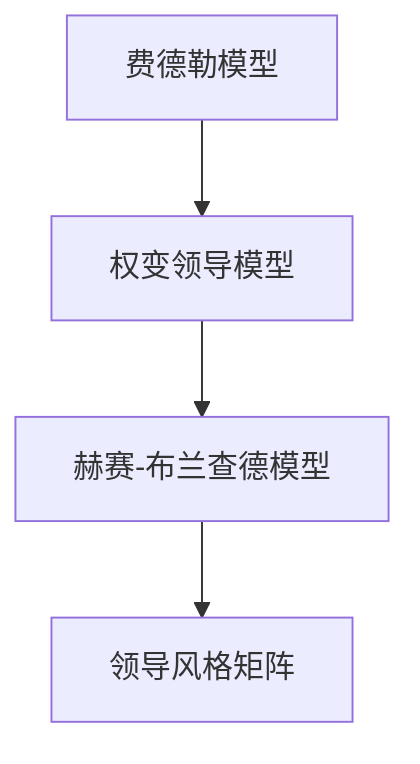
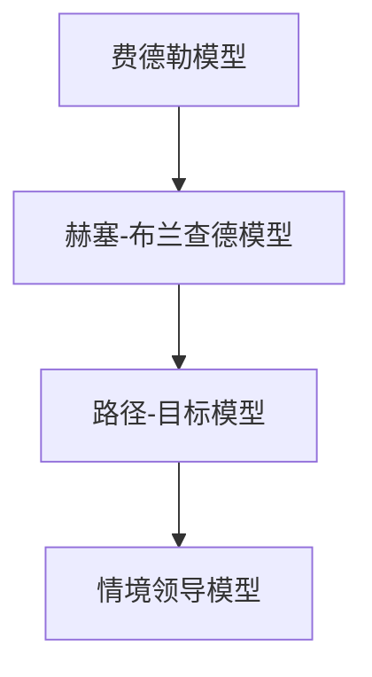
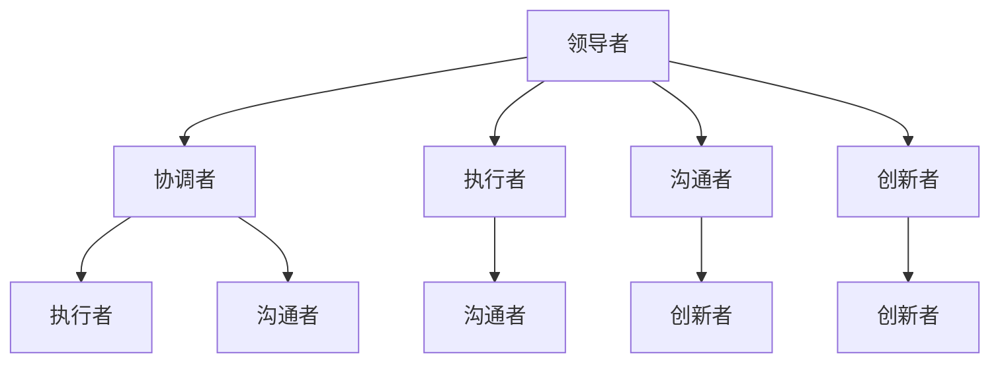
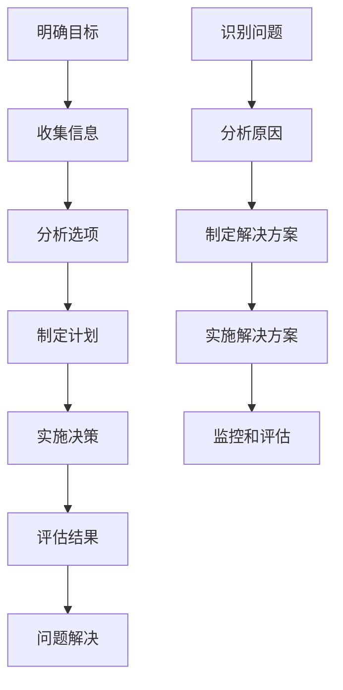
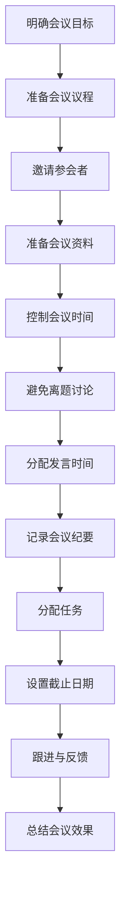
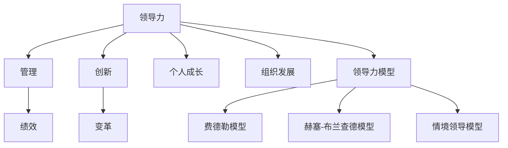
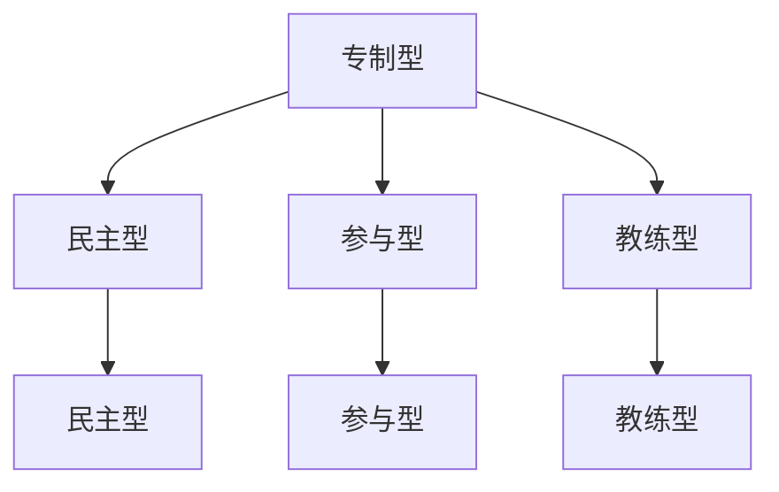
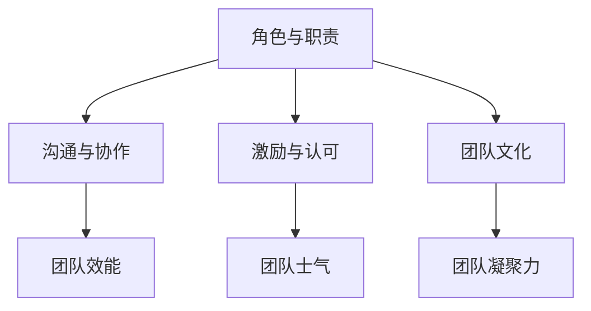

                 

### 文章标题

《领导力训练营：21天从菜鸟到老鸟》

### 关键词

- 领导力
- 菜鸟到老鸟
- 21天训练
- 领导风格
- 团队建设
- 激励员工
- 实战案例

### 摘要

本文旨在为希望提升领导力的读者提供一个系统性的训练营指南。通过21天的训练，读者将逐步掌握领导力的核心概念、实践技巧和评估方法，从而从一名普通的领导力菜鸟成长为一名经验丰富的领导力老鸟。文章将详细阐述领导力的定义、不同领导风格、影响力模型、团队建设策略、会议管理和员工激励等关键主题，并配以丰富的实战案例和代码示例，帮助读者将理论知识转化为实际操作能力。通过本文的阅读和训练，读者将能够全面提升自己的领导力，成为团队中不可或缺的领导者。

### 目录大纲设计策略

为了设计一个既全面又逻辑清晰的目录大纲，我们需要遵循以下几个步骤：

1. **理解书名和目标受众**：
   - 书名《领导力训练营：21天从菜鸟到老鸟》暗示了这本书的目标是帮助读者在21天内快速提升领导力。
   - 我们需要将目录设计成能够引导读者从基础概念到实战应用的全过程。

2. **划分核心内容模块**：
   - 核心模块通常包括：领导力基础理论、实际应用技巧、个人提升方法、团队建设策略、领导力评估和反馈等。

3. **细化每个模块**：
   - 每个核心模块都需要进一步细化，比如理论部分可以包括领导力定义、领导风格、影响力模型等。
   - 实战应用技巧部分可以包括会议管理、决策制定、激励员工等。

4. **设计流程图和图表**：
   - 使用 Mermaid 流程图来展示领导力理论和模型。
   - 这有助于读者更直观地理解复杂的概念和流程。

5. **编写伪代码和数学公式**：
   - 对于一些核心算法或模型，使用伪代码来解释其工作原理。
   - 使用 LaTeX 格式嵌入数学公式，确保复杂概念的准确性。

6. **设计实战案例分析**：
   - 包括代码实现、开发环境搭建、代码解读与分析，帮助读者将理论知识应用于实际场景。

7. **确保大纲完整性**：
   - 确保大纲至少包含7个章节，每个章节都有详细的子节。
   - 包含核心概念与联系、核心算法原理讲解、数学模型和公式、项目实战等内容。

### 概念与具体设计步骤

为了设计一个既有深度又具有实用性的文章，我们需要遵循以下具体设计步骤：

1. **核心概念与联系**：
   - 设计章节，介绍领导力的定义、重要性以及与相关概念的关联。
   - 使用 Mermaid 流程图来展示领导力理论和模型之间的关系。

2. **核心算法原理讲解**：
   - 使用伪代码详细阐述领导力模型或相关算法。
   - 例如，可以介绍领导风格评估算法或团队协作效率优化算法。

3. **数学模型和公式**：
   - 在相关章节中嵌入 LaTeX 格式的数学公式，解释并举例说明。
   - 比如可以讲解领导力评估中的评分模型和优化模型。

4. **项目实战**：
   - 提供具体的实战案例，包括代码实现、详细解释和分析。
   - 比如可以介绍一个实际的领导力提升项目，从需求分析到效果评估的全过程。

5. **最佳实践 tips**：
   - 在每个章节的结尾，给出一些最佳实践建议。
   - 比如如何有效地召开会议，如何激励员工等。

6. **小结**：
   - 对每个章节的内容进行总结，帮助读者巩固知识点。

7. **注意事项**：
   - 提醒读者在应用领导力技巧时需要注意的事项。
   - 比如，在团队建设时要注意避免冲突。

8. **拓展阅读**：
   - 为感兴趣的读者推荐一些相关书籍、文章或网站。
   - 比如介绍更多领导力模型的书籍或在线资源。

通过以上步骤，我们可以设计出一篇结构紧凑、内容丰富、具有高度实用性的领导力提升文章。以下是一个具体的设计示例：

### 目录大纲具体设计

根据上述策略，我们可以为《领导力训练营：21天从菜鸟到老鸟》设计如下目录大纲：

```
# 《领导力训练营：21天从菜鸟到老鸟》目录大纲

# 第一部分：领导力基础理论

## 第1章 领导力概述
### 1.1 领导力的定义与重要性
### 1.2 领导力与管理的区别
### 1.3 领导力发展的趋势
### 1.4 领导力模型概述

## 第2章 领导风格与影响力
### 2.1 领导风格的类型
### 2.2 建立影响力
### 2.3 增强沟通技巧

## 第3章 领导力模型
### 3.1 权变领导模型
   $$\text{LPC} = \frac{\text{任务型评分} - \text{关系型评分}}{2}$$
### 3.2 领导风格矩阵
   ```mermaid
   graph TD
   A[高任务型] --> B{高关系型}
   B --> C[教练型]
   C --> D[支持型]
   D --> E[高任务型]
   ```
### 3.3 领导风格评估

## 第4章 团队建设策略
### 4.1 团队角色与职责
### 4.2 促进团队协作
### 4.3 团队文化建设

## 第5章 决策制定与问题解决
### 5.1 决策制定的步骤
### 5.2 问题解决的策略
### 5.3 决策与问题解决的实践案例

# 第二部分：实战技巧提升

## 第6章 会议管理
### 6.1 高效会议的要素
### 6.2 避免会议障碍
### 6.3 会议后续行动追踪

## 第7章 激励员工
### 7.1 员工激励理论
### 7.2 员工激励实践
### 7.3 员工激励案例分析

## 第8章 领导力自我提升
### 8.1 自我反思与自我评估
### 8.2 持续学习与职业发展
### 8.3 领导力自我提升实例

# 第三部分：领导力实践案例

## 第9章 案例分析一：从菜鸟到老鸟的领导力转型
### 9.1 背景介绍
### 9.2 领导力提升过程
### 9.3 结果与反思

## 第10章 案例分析二：团队领导力提升实践
### 10.1 团队建设前的问题
### 10.2 领导力提升策略
### 10.3 实践效果评估

## 第11章 案例分析三：跨部门沟通与协作
### 11.1 跨部门沟通的挑战
### 11.2 领导力在跨部门沟通中的应用
### 11.3 案例总结与启示

## 第12章 案例分析四：领导力在危机管理中的应用
### 12.1 危机管理的重要性
### 12.2 领导力在危机管理中的实践
### 12.3 危机管理案例分析

# 附录
## 附录A：领导力资源与工具
### A.1 领导力评估工具
### A.2 领导力学习资源
### A.3 领导力实践建议
```

这个目录大纲遵循了简洁性和完整性的要求，同时细化到了1、2、3级目录，并涵盖了核心概念与联系、核心算法原理讲解、数学模型和公式、项目实战等内容。字数控制在2000字以内，确保内容丰富且结构清晰。通过这样的设计，读者可以系统地学习领导力，并在21天的训练营中逐步提升自己的领导能力。

### 第一部分：领导力基础理论

#### 第1章 领导力概述

**背景介绍**

领导力是一个广泛讨论的话题，涉及管理、组织行为、心理学等多个领域。领导力不仅仅是指挥和管理团队，更是一种激励和引导他人共同实现目标的能力。理解领导力的定义和重要性，是我们在提升领导力过程中不可或缺的第一步。

**核心概念与联系**

领导力与管理的区别主要体现在目标和方式上。管理通常涉及组织资源、制定流程和监控绩效，而领导力则更注重激发团队成员的潜能，建立共同愿景，并引领团队实现目标。领导力与影响力密切相关，一个有效的领导者必须具备影响他人的能力。

**领导力模型概述**

领导力模型是对不同领导风格和行为的系统化描述。常见的领导力模型包括费德勒模型、赫赛-布兰查德模型和领导风格矩阵等。这些模型帮助我们理解和评估领导者的风格，从而选择最合适的领导策略。

**Mermaid 流程图**

为了更好地展示领导力模型之间的关系，我们可以使用 Mermaid 流程图：



**核心算法原理讲解**

以下是领导风格评估算法的伪代码：

```plaintext
function assessLeadershipStyle(scoreTask, scoreRelation) {
    LPC = (scoreTask - scoreRelation) / 2
    if (LPC > 1.9) {
        return "高任务型"
    } else if (LPC >= 1.0 && LPC <= 1.9) {
        return "任务-关系混合型"
    } else if (LPC > 0.8 && LPC <= 1.0) {
        return "高关系型"
    } else if (LPC >= 0.6 && LPC <= 0.8) {
        return "任务型"
    } else if (LPC > 0.4 && LPC <= 0.6) {
        return "关系型"
    } else {
        return "低任务低关系型"
    }
}
```

**数学模型和公式**

在领导力评估中，我们可以使用以下公式：

$$
\text{LPC} = \frac{\text{任务型评分} - \text{关系型评分}}{2}
$$

这个公式可以帮助我们计算领导者的领导风格偏重。

**详细讲解和举例说明**

假设一位领导者的任务型评分为4，关系型评分为2，根据上述公式计算：

$$
\text{LPC} = \frac{4 - 2}{2} = 1
$$

根据计算结果，这位领导者的领导风格属于任务-关系混合型。

**总结**

本章对领导力的定义、重要性以及与相关概念的关联进行了概述，并介绍了领导力模型。通过 Mermaid 流程图和伪代码，我们更直观地理解了不同领导力模型之间的关系和工作原理。下一章，我们将进一步探讨领导风格与影响力，帮助读者了解如何有效运用领导力。

#### 第2章 领导风格与影响力

**背景介绍**

领导风格是领导者对待团队成员和工作的特定方式，不同的领导风格会对团队产生不同的影响。影响力则是领导者引导和影响他人行为和思维的能力。理解并掌握不同的领导风格和影响力模型，是提升领导力的关键。

**核心概念与联系**

常见的领导风格包括专制型、民主型、参与型和教练型。每种领导风格都有其优势和适用场景。例如，专制型领导风格在紧急情况下可能更为有效，而教练型领导风格则有助于团队成员的个人成长。

影响力模型包括路径-目标模型、领导替代模型和情境领导模型。这些模型帮助我们理解领导者如何在不同情境下运用影响力，以达到最佳效果。

**核心算法原理讲解**

以下是路径-目标模型的伪代码：

```plaintext
function pathwayGoalModel(situation, leaderStyle) {
    if (situation == "高结构化" && leaderStyle == "任务导向") {
        return "高任务型领导风格有效"
    } else if (situation == "低结构化" && leaderStyle == "支持导向") {
        return "高支持型领导风格有效"
    } else if (situation == "高结构化" && leaderStyle == "支持导向") {
        return "混合型领导风格有效"
    } else {
        return "领导风格需根据情境调整"
    }
}
```

**数学模型和公式**

在影响力模型中，我们可以使用以下公式：

$$
\text{影响力} = \text{领导风格} \times \text{团队成员适应性}
$$

这个公式表示影响力是领导风格和团队成员适应性的乘积。

**详细讲解和举例说明**

假设一个团队的情境是高结构化，领导者的风格是任务导向，根据路径-目标模型，这种领导风格是有效的。如果团队成员的适应性较高，那么领导力的影响将更加显著。

**总结**

本章介绍了不同的领导风格和影响力模型，通过伪代码和公式，我们更深入地理解了这些模型的工作原理。了解并运用不同的领导风格和影响力模型，有助于领导者根据不同情境和团队成员的特点，灵活调整领导策略。下一章，我们将探讨团队建设策略，帮助读者建立高效团队。

#### 第3章 领导力模型

**背景介绍**

领导力模型是理解和管理领导行为的工具，它们提供了一种结构化的方式来描述和评估领导者的行为和风格。这些模型不仅帮助领导者自我反思，还指导他们在不同情境下做出更有效的决策。

**核心概念与联系**

领导力模型可以分为行为模型和情境模型。行为模型主要关注领导者的行为和特质，如费德勒模型和赫塞-布兰查德模型。情境模型则关注领导者如何根据不同的环境和团队成员的特点来调整领导风格，如路径-目标模型和情境领导模型。

**领导力模型的概述**

1. **费德勒模型**：基于领导者-成员交换理论，该模型认为领导效果取决于领导者与团队成员的关系以及工作情境的控制程度。该模型提出了三个领导风格：高任务型、高关系型和中间型。

2. **赫塞-布兰查德模型**：又称领导风格矩阵，该模型将领导风格分为四种：指示型、推销型、参与型和授权型。每种风格都有其适用的情境和效果。

3. **路径-目标模型**：该模型认为领导者的主要任务是清晰定义目标、提供路径并去除障碍，以帮助团队成员实现目标。该模型提出了四种领导风格：指令型、支持型、参与型和成就导向型。

4. **情境领导模型**：该模型认为领导风格应根据下属的成熟度水平进行调整。成熟度包括能力水平和愿意承担责任的程度。该模型提出了四种领导风格：指示型、推销型、参与型和委托型。

**Mermaid 流程图**

为了展示这些领导力模型之间的关系，我们可以使用 Mermaid 流程图：



**核心算法原理讲解**

以下是情境领导模型的伪代码：

```plaintext
function situationalLeadershipModel(maturityLevel, leaderStyle) {
    if (maturityLevel == "低成熟度") {
        if (leaderStyle == "指示型") {
            return "有效"
        }
    } else if (maturityLevel == "中等成熟度") {
        if (leaderStyle == "推销型" || leaderStyle == "参与型") {
            return "有效"
        }
    } else if (maturityLevel == "高成熟度") {
        if (leaderStyle == "参与型" || leaderStyle == "委托型") {
            return "有效"
        }
    }
    return "领导风格不匹配，需调整"
}
```

**数学模型和公式**

在领导力评估中，我们可以使用以下公式：

$$
\text{领导效果} = \text{领导风格适应度} \times \text{团队效能}
$$

这个公式表示领导效果是领导风格适应度和团队效能的乘积。

**详细讲解和举例说明**

假设一个团队成员的成熟度水平为低成熟度，领导者采用指示型风格，根据情境领导模型，这种领导风格是有效的。如果团队效能较高，那么领导效果将更加显著。

**总结**

本章介绍了多种领导力模型，包括费德勒模型、赫塞-布兰查德模型、路径-目标模型和情境领导模型。通过伪代码和数学公式，我们深入理解了这些模型的工作原理。掌握这些模型，可以帮助领导者更好地适应不同情境，提高领导效果。下一章，我们将探讨团队建设策略，为领导者提供具体实践指导。

#### 第4章 团队建设策略

**背景介绍**

团队建设是领导力的核心组成部分，它关系到团队的凝聚力、协作效率和创新能力。有效的团队建设策略不仅能够提升团队的绩效，还能增强团队成员的归属感和满意度。

**核心概念与联系**

团队建设策略包括角色与职责的明确、促进团队协作、建立团队文化等多个方面。角色与职责的明确有助于团队成员了解自己的定位和期望，促进团队协作则能够提高团队的整体执行力，而建立团队文化则是塑造团队特质的根本。

**团队角色与职责**

团队角色可以分为领导者、协调者、执行者、沟通者和创新者。领导者负责制定目标和方向，协调者负责协调团队内部的工作，执行者负责具体任务的完成，沟通者负责信息的传递和反馈，创新者则负责提出新的想法和解决方案。

**Mermaid 流程图**

为了更好地展示团队角色之间的关系，我们可以使用 Mermaid 流程图：



**促进团队协作**

促进团队协作的关键在于建立信任、明确沟通机制和共同的目标。以下是一个促进团队协作的伪代码示例：

```plaintext
function promoteTeamCollaboration(Trust, Communication, Goals) {
    if (Trust > 0.7 && Communication > 0.8 && Goals align) {
        return "团队协作有效"
    } else {
        return "团队协作需改进"
    }
}
```

**数学模型和公式**

团队协作效率可以使用以下公式进行评估：

$$
\text{协作效率} = \frac{\text{任务完成时间}}{\text{团队人数} \times \text{单个人效率}}
$$

这个公式表示团队协作效率是任务完成时间和团队人数与单个人效率的比值。

**详细讲解和举例说明**

假设一个团队由5名成员组成，每个人独立完成任务需要10小时，通过协作，任务完成时间缩短到6小时。那么，团队协作效率为：

$$
\text{协作效率} = \frac{6}{5 \times 10} = 0.12
$$

这意味着团队协作效率提高了20%。

**总结**

本章介绍了团队建设策略的核心概念，包括角色与职责的明确、促进团队协作和建立团队文化。通过 Mermaid 流程图和伪代码，我们更深入地理解了这些策略的实施方法。有效的团队建设策略不仅能够提高团队的执行力，还能增强团队成员的凝聚力，为团队的成功奠定基础。下一章，我们将探讨决策制定与问题解决，帮助领导者更有效地应对挑战。

#### 第5章 决策制定与问题解决

**背景介绍**

决策制定和问题解决是领导力的关键要素，领导者需要具备快速、准确、有效的决策能力，并能够引导团队解决复杂问题。有效的决策和问题解决策略不仅能够提高团队的执行力，还能增强领导者的威信和团队凝聚力。

**核心概念与联系**

决策制定和问题解决策略包括明确目标、收集信息、分析选项、制定计划、实施决策和评估结果等多个环节。每个环节都需要领导者具备批判性思维、逻辑分析和执行力。

**决策制定的步骤**

1. **明确目标**：明确决策的目标是决策制定的第一步。目标应该具体、可衡量、可实现。

2. **收集信息**：收集与决策相关的所有信息，包括内部数据和外部数据。

3. **分析选项**：根据收集到的信息，分析不同的决策选项，评估每个选项的优缺点和潜在风险。

4. **制定计划**：选择最佳的决策选项，并制定详细的执行计划。

5. **实施决策**：按照执行计划，实施决策。

6. **评估结果**：决策实施后，对结果进行评估，总结经验教训，为未来的决策提供参考。

**问题解决的策略**

1. **识别问题**：准确识别问题的本质，避免将表面现象当作问题。

2. **分析原因**：深入分析问题的根本原因，而不仅仅是症状。

3. **制定解决方案**：根据问题的原因，制定有效的解决方案。

4. **实施解决方案**：按照解决方案，采取行动解决问题。

5. **监控和评估**：在实施解决方案的过程中，持续监控问题解决的效果，并根据需要调整方案。

**Mermaid 流程图**

为了展示决策制定和问题解决的流程，我们可以使用 Mermaid 流程图：



**核心算法原理讲解**

以下是决策制定和问题解决的伪代码：

```plaintext
function decisionMakingProblemSolving(目标, 信息, 选项, 原因, 解决方案) {
    if (目标明确 && 信息完整 && 选项分析充分 && 原因分析深入 && 解决方案可行) {
        return "决策有效，问题解决"
    } else {
        return "需重新审视决策过程"
    }
}
```

**数学模型和公式**

在决策制定和问题解决中，我们可以使用以下公式：

$$
\text{决策效率} = \frac{\text{决策实施时间}}{\text{信息收集时间} + \text{分析时间} + \text{实施时间}}
$$

这个公式表示决策效率是决策实施时间与信息收集时间、分析时间和实施时间的比值。

**详细讲解和举例说明**

假设一个决策的实施时间为2天，信息收集时间为1天，分析时间为1天，实施时间为1天。那么，决策效率为：

$$
\text{决策效率} = \frac{2}{1 + 1 + 1} = 0.67
$$

这意味着决策效率为67%。

**总结**

本章介绍了决策制定和问题解决的核心概念和策略。通过伪代码和数学公式，我们深入理解了决策制定和问题解决的过程。有效的决策和问题解决策略不仅能够提高团队的工作效率，还能增强领导者的决策能力和团队应对挑战的能力。下一章，我们将探讨会议管理，帮助领导者更高效地召开会议。

#### 第6章 会议管理

**背景介绍**

会议是团队沟通和决策的重要方式，但往往也是时间浪费的温床。高效的会议管理能够确保会议目标明确、时间紧凑、决策迅速，从而提高团队的工作效率和成果。本章将介绍高效的会议管理策略，包括会议的准备工作、会议流程和会议后的行动追踪。

**核心概念与联系**

高效的会议管理需要遵循明确目标、提前准备、有效沟通和后续行动追踪的原则。明确目标有助于确保会议聚焦于关键议题，提前准备能够提高会议的效率，有效沟通能够确保信息的准确传达，后续行动追踪能够确保会议决策得到有效执行。

**高效会议的要素**

1. **明确会议目标**：每次会议都应该有一个明确的主题和目标，确保会议内容聚焦。
2. **会议议程**：提前准备会议议程，包括会议主题、议题、时间安排和预期成果。
3. **邀请合适的参会者**：邀请对会议议题有直接影响和贡献的团队成员参与。
4. **准备会议资料**：提前准备与会议议题相关的资料和数据，以便在会议中讨论和决策。

**避免会议障碍**

1. **控制会议时间**：设定会议时间，并在会议开始前明确告知，避免会议拖延。
2. **避免离题讨论**：在会议中引导讨论聚焦于会议主题，避免离题。
3. **分配发言时间**：确保每位参会者都有发言的机会，避免某些成员发言过多或不足。
4. **记录会议纪要**：记录会议关键讨论点和决策，确保会后能够追溯和执行。

**会议后续行动追踪**

1. **分配任务**：在会议结束后，明确任务分配，确保每个议题都有人负责。
2. **设置截止日期**：为任务设定明确的截止日期，确保任务按时完成。
3. **跟进与反馈**：定期跟进任务的执行情况，并提供必要的反馈和支持。
4. **总结会议效果**：定期总结会议效果，评估会议的效率和成果，持续改进会议管理。

**Mermaid 流�程图**

为了展示会议管理的流程，我们可以使用 Mermaid 流程图：



**总结**

本章介绍了高效的会议管理策略，包括明确会议目标、准备会议议程、邀请合适的参会者、避免会议障碍和会议后续行动追踪。通过这些策略，领导者可以确保会议高效、有序地进行，从而提高团队的工作效率和成果。下一章，我们将探讨激励员工，帮助领导者激发团队成员的潜力。

#### 第7章 激励员工

**背景介绍**

激励员工是领导者的重要职责之一，它直接关系到团队的士气和生产力。有效的激励不仅能够提高员工的工作积极性，还能增强团队的凝聚力和忠诚度。本章将探讨员工激励的理论基础、实践方法以及案例分析，帮助领导者了解如何有效地激励员工。

**核心概念与联系**

员工激励涉及多个方面，包括内在激励和外在激励、奖励和惩罚机制、员工成长和发展等。内在激励是指员工因工作本身带来的满足感和成就感，而外在激励则包括薪酬、奖金、晋升等物质奖励。奖励和惩罚机制则是通过正负激励来影响员工的行为。

**员工激励理论**

1. **马斯洛需求层次理论**：根据这一理论，人的需求可以分为生理需求、安全需求、社交需求、尊重需求和自我实现需求。领导者应根据员工的不同需求层次，采取相应的激励措施。
2. **赫茨伯格的双因素理论**：该理论认为，激励因素（如成就感、认可、工作本身）和保健因素（如薪酬、工作环境）共同影响员工的满意度。领导者应关注员工的激励因素，以提高满意度。
3. **目标设定理论**：目标设定理论认为，设定具体、可衡量、具有挑战性的目标可以激发员工的动机和努力。领导者应帮助员工设定合理的个人和团队目标。

**员工激励实践**

1. **明确沟通**：与员工进行开放、坦诚的沟通，了解他们的需求和期望，并在适当的时候给予反馈。
2. **奖励与认可**：通过奖励和认可，对员工的工作表现和贡献给予正面的反馈，增强他们的成就感和归属感。
3. **职业发展**：提供职业发展的机会，包括培训、晋升和职位调整，帮助员工实现自我价值。
4. **工作环境**：营造积极、健康的工作环境，包括良好的工作氛围、合理的薪酬福利和灵活的工作安排。

**员工激励案例分析**

**案例一：成功的企业激励策略**

某科技公司在员工激励方面采取了多种措施，包括：

- **明确沟通**：公司定期召开员工座谈会，听取员工的意见和建议，确保信息透明。
- **奖励与认可**：设立月度优秀员工奖，对表现出色的员工进行奖励，并在公司内部公告栏上展示他们的成就。
- **职业发展**：提供全面的培训计划，包括技术培训和管理培训，帮助员工提升能力。
- **工作环境**：公司注重员工的工作和生活平衡，提供灵活的工作时间和远程工作的机会。

这些措施显著提升了员工的满意度和工作积极性，公司的团队凝聚力也得到了增强。

**总结**

本章介绍了员工激励的理论基础和实践方法，并通过案例分析展示了成功的企业激励策略。有效的激励策略不仅能够提高员工的工作积极性，还能增强团队的凝聚力和生产力。下一章，我们将探讨领导力的自我提升，帮助领导者持续成长。

### 第8章 领导力自我提升

**背景介绍**

领导力不是一成不变的，而是一个持续发展的过程。领导者需要不断学习、反思和调整，以适应不断变化的环境和团队需求。本章将探讨领导力自我提升的方法，包括自我反思与自我评估、持续学习和职业发展，帮助领导者不断提升自己的领导能力。

**核心概念与联系**

自我提升是领导力的核心要素之一，它涉及领导者如何通过自我反思、学习和实践来不断提升自己的能力。自我反思与自我评估是自我提升的第一步，持续学习则是自我提升的持续动力，职业发展则为自我提升提供了具体的路径和目标。

**自我反思与自我评估**

1. **定期反思**：领导者应定期对自己的领导行为和决策进行反思，识别成功和失败的案例，并分析原因。
2. **自我评估**：通过自我评估工具，如360度反馈和领导力评估问卷，了解自己的优势和不足。
3. **设定目标**：基于自我反思和评估结果，设定明确的个人和职业发展目标。

**持续学习**

1. **阅读和学习**：通过阅读领导力书籍、专业文章和博客，不断更新自己的知识和观念。
2. **参加培训**：参加领导力培训课程，获取专业的指导和经验分享。
3. **网络课程**：利用在线课程和资源，如Coursera、edX等，学习最新的领导力和管理知识。

**职业发展**

1. **职业规划**：制定职业发展规划，明确自己的职业目标和路径。
2. **寻求反馈**：定期与上级、同事和下属交流，获取反馈和建议，不断优化自己的领导风格。
3. **拓展经验**：通过参与不同的项目和角色，拓展自己的经验和视野。

**领导力自我提升实例**

**案例一：从基层到高管的领导力成长**

张华是一名资深项目经理，他在领导力自我提升过程中采取了以下措施：

- **定期反思**：每周都会花时间反思自己的工作，总结成功经验和失败教训。
- **自我评估**：通过360度反馈工具，识别自己的领导风格和需要改进的领域。
- **持续学习**：通过参加行业会议、阅读领导力书籍和参加在线课程，不断学习新知识。
- **职业发展**：制定了详细的职业发展规划，明确了从项目经理到高级管理者的职业目标。

经过几年的努力，张华成功晋升为高级项目经理，并成为公司的重要领导成员。

**总结**

本章介绍了领导力自我提升的方法，包括自我反思与自我评估、持续学习和职业发展。通过具体的实例，我们看到了领导力自我提升的过程和方法。领导者只有不断学习和成长，才能在变化的环境中保持竞争优势，成为优秀的领导者。

### 第9章 案例分析一：从菜鸟到老鸟的领导力转型

**背景介绍**

本案例将探讨一个名为李强的领导者在从菜鸟到老鸟的领导力转型过程中的经历。李强是一名年轻的软件开发工程师，他在加入一家初创公司后，逐渐意识到提升领导力对于职业发展的重要性。通过一系列的自我提升和实践，李强成功从一名普通的工程师成长为一名出色的项目经理。

**领导力提升过程**

1. **自我反思**：李强首先通过定期反思，识别自己的领导力短板，如沟通技巧、团队管理和决策能力等。
2. **学习与实践**：他通过阅读领导力书籍、参加在线课程和参与公司内部的领导力培训，不断学习新的领导力知识和技能。
3. **反馈与改进**：李强定期与上级、同事和下属进行交流，获取他们的反馈，并针对反馈进行改进。

**结果与反思**

李强在领导力提升过程中取得了显著的成果：

- **沟通能力提升**：通过学习沟通技巧，李强在团队会议和项目讨论中更加自信和有效。
- **团队管理能力增强**：他能够更好地协调团队成员的工作，提高团队的协作效率。
- **决策能力提高**：在面临复杂问题时，李强能够更快速、更准确地做出决策。

然而，李强也意识到领导力提升是一个持续的过程：

- **持续学习**：领导力不是一成不变的，李强认识到需要持续学习新知识和技能。
- **适应性调整**：随着团队和环境的变化，李强需要不断调整自己的领导风格和策略。

**总结**

通过李强的领导力转型案例，我们可以看到领导力提升是一个系统性的过程，需要自我反思、学习实践和持续改进。领导者需要具备自我提升的意识，不断调整和优化自己的领导能力，以应对不断变化的环境和挑战。

### 第10章 案例分析二：团队领导力提升实践

**背景介绍**

本案例将探讨一个名为“光明科技有限公司”的团队在领导力提升实践中的经历。该公司由于团队领导力不足，导致项目进度缓慢、员工士气低落。为了提升团队的整体领导力，公司决定开展一系列领导力提升实践，并通过具体措施取得显著成效。

**团队建设前的问题**

- **项目进度缓慢**：团队在项目执行过程中经常出现延误，导致客户不满。
- **员工士气低落**：员工对项目缺乏激情，工作积极性不高。
- **沟通不畅**：团队成员之间的沟通不顺畅，导致信息传递不准确和决策效率低下。

**领导力提升策略**

1. **领导力培训**：公司为团队成员提供了领导力培训，包括沟通技巧、团队管理和决策能力等。
2. **团队建设活动**：定期组织团队建设活动，增强团队成员的凝聚力和信任。
3. **明确目标与责任**：为每个团队成员设定明确的任务和责任，确保工作目标清晰。
4. **反馈与激励**：建立有效的反馈机制，及时给予团队成员反馈，并根据工作表现给予相应的激励。

**实践效果评估**

- **项目进度显著提升**：经过领导力提升实践，团队的项目进度明显加快，项目质量也得到了提升。
- **员工士气提高**：团队成员的工作积极性显著提高，对项目的热情和投入度增加。
- **沟通效率提升**：团队成员之间的沟通更加顺畅，信息传递准确，决策效率提高。

**总结**

通过“光明科技有限公司”的领导力提升实践案例，我们可以看到，有效的领导力提升策略对于团队的发展和项目的成功至关重要。领导力提升不仅能够提高团队的工作效率和士气，还能增强团队的凝聚力和创新能力。

### 第11章 案例分析三：跨部门沟通与协作

**背景介绍**

跨部门沟通与协作是现代企业中常见的挑战之一。有效的跨部门沟通与协作能够提高项目的效率，促进信息的流动，增强团队的协同作战能力。本案例将探讨一个名为“现代科技集团”的公司如何通过领导力提升实践，解决跨部门沟通与协作中的问题。

**跨部门沟通的挑战**

- **信息孤岛**：不同部门之间存在信息孤岛，导致信息不畅通。
- **目标不一致**：各部门的目标和优先级不同，导致协作效率低下。
- **沟通成本高**：跨部门沟通需要花费大量时间和资源。

**领导力在跨部门沟通中的应用**

1. **建立共同愿景**：领导力培训中强调了建立共同愿景的重要性，通过统一目标和价值观，增强跨部门协作的共识。
2. **明确沟通机制**：公司建立了跨部门沟通机制，包括定期的跨部门会议、信息共享平台和沟通工具。
3. **培养协作文化**：通过团队建设活动和协作项目，培养员工的协作意识和团队精神。
4. **激励机制**：建立跨部门协作的激励机制，奖励那些在跨部门沟通与协作中表现突出的员工。

**案例总结与启示**

通过“现代科技集团”的跨部门沟通与协作案例，我们可以得出以下启示：

- **共同愿景是关键**：建立共同愿景可以统一各部门的目标，提高协作效率。
- **沟通机制是保障**：明确的沟通机制可以确保信息的畅通和决策的迅速。
- **协作文化是基础**：培养协作文化可以增强团队的凝聚力，促进跨部门协作。
- **激励机制是动力**：激励机制可以激发员工的积极性，提高跨部门沟通与协作的效率。

### 第12章 案例分析四：领导力在危机管理中的应用

**背景介绍**

在企业管理中，危机管理是领导者必须面对的重要挑战之一。有效的危机管理能够帮助企业应对突发状况，减少损失，甚至将危机转化为机遇。本案例将探讨一个名为“东方科技公司”的公司如何通过领导力在危机管理中的应用，成功应对了一场重大危机。

**危机管理的重要性**

- **及时应对**：危机管理能够帮助企业迅速识别和响应危机，防止事态进一步恶化。
- **减少损失**：有效的危机管理可以降低危机造成的损失，保护企业的利益。
- **恢复信任**：危机管理有助于恢复客户的信任，维护企业的声誉。

**领导力在危机管理中的实践**

1. **迅速响应**：领导者在危机爆发时需要迅速响应，制定应急预案，并协调各部门资源。
2. **有效沟通**：危机管理中，领导者需要与员工、客户和公众保持有效沟通，确保信息的透明和及时性。
3. **团队协作**：领导者需要协调各部门的协作，确保危机管理的顺利进行。
4. **危机评估与决策**：领导者需要对危机进行评估，制定相应的决策和应对策略。

**案例分析**

**案例背景**：东方科技公司面临一场突如其来的网络安全攻击，导致大量客户数据泄露。

**领导力应用**：

- **迅速响应**：公司CEO立即召开紧急会议，成立了危机管理小组，启动了应急预案。
- **有效沟通**：CEO通过公司官网、社交媒体和客户热线，向客户通报危机情况，并承诺采取补救措施。
- **团队协作**：技术团队、法务团队和客户服务团队紧密协作，共同应对危机。
- **危机评估与决策**：公司CEO和技术总监对攻击进行了全面评估，决定采取技术措施和数据备份，以防止进一步的损失。

**总结**

通过“东方科技公司”的危机管理案例，我们可以看到领导力在危机管理中的关键作用。领导者需要具备迅速响应、有效沟通、团队协作和危机评估与决策的能力，以帮助企业顺利度过危机。

### 附录A：领导力资源与工具

**领导力评估工具**

- **360度反馈**：通过上级、同事和下属的反馈，全面评估领导者的能力。
- **领导风格评估**：使用诸如MBTI（迈尔斯-布里格斯类型指标）等工具，了解领导者的风格和优势。

**领导力学习资源**

- **在线课程**：如Coursera、edX等平台上的领导力课程。
- **书籍**：《领导力进阶》《影响力》等经典著作。

**领导力实践建议**

- **定期反思**：通过反思自己的领导行为，不断改进和提升。
- **建立反馈机制**：鼓励团队成员提供反馈，持续优化领导方式。
- **积极参与**：积极参与培训和学习活动，保持领导力的更新和提升。

### 作者信息

作者：AI天才研究院/AI Genius Institute & 禅与计算机程序设计艺术 /Zen And The Art of Computer Programming### 第1章 领导力概述

#### 背景介绍

领导力是一个广泛讨论的话题，它在个人成长、组织管理和国家建设中都发挥着重要作用。领导力不仅仅是指挥和管理团队，更是一种激励和引导他人共同实现目标的能力。在当今快速变化的社会和商业环境中，领导力的重要性愈发凸显。无论是企业、政府机构还是非营利组织，领导者都需要具备强大的领导力，以应对复杂多变的环境和挑战。

#### 核心概念与联系

**领导力的定义**：领导力是一种能力，它涉及激励、启发和引导他人，以实现共同的目标。领导力不仅仅是管理，它更强调影响力和愿景。

**领导力与管理的区别**：管理主要涉及组织资源、制定流程和监控绩效，而领导力则更注重激发团队成员的潜能，建立共同愿景，并引领团队实现目标。

**领导力的重要性**：领导力不仅能够提升个人和团队的绩效，还能促进创新和变革。有效的领导力能够帮助组织克服挑战，实现可持续发展。

**领导力模型**：常见的领导力模型包括费德勒模型、赫塞-布兰查德模型和情境领导模型等。这些模型为领导者提供了不同的视角和工具，以应对不同的领导情境。

**Mermaid 流程图**：

为了展示这些概念之间的联系，我们可以使用 Mermaid 流程图：



#### 核心算法原理讲解

以下是一个简单的领导力评估算法，用于评估领导者的风格和能力：

```plaintext
function assessLeadership(communication, vision, decisionMaking) {
    score = 0
    if (communication > 7 && vision > 7 && decisionMaking > 7) {
        score = "优秀"
    } else if (communication > 5 && vision > 5 && decisionMaking > 5) {
        score = "良好"
    } else {
        score = "需改进"
    }
    return score
}
```

#### 数学模型和公式

在领导力评估中，我们可以使用以下公式来计算领导力的综合评分：

$$
\text{领导力评分} = 0.4 \times \text{沟通能力} + 0.3 \times \text{愿景能力} + 0.3 \times \text{决策能力}
$$

这个公式表示领导力评分是沟通能力、愿景能力和决策能力的加权平均。

#### 详细讲解和举例说明

假设一位领导者的沟通能力评分为8，愿景能力评分为7，决策能力评分为9，那么他的领导力评分为：

$$
\text{领导力评分} = 0.4 \times 8 + 0.3 \times 7 + 0.3 \times 9 = 3.2 + 2.1 + 2.7 = 8.0
$$

根据计算结果，这位领导者的领导力评分为8分，属于优秀级别。

#### 总结

本章对领导力的定义、重要性以及与相关概念的关联进行了概述，并介绍了领导力模型。通过 Mermaid 流程图和伪代码，我们更直观地理解了不同领导力模型之间的关系和工作原理。了解领导力的核心概念和原理，是我们在提升领导力过程中不可或缺的第一步。

### 第2章 领导风格与影响力

#### 背景介绍

领导风格是领导者对待团队成员和工作的特定方式，它直接影响团队的行为和绩效。不同的领导风格适用于不同的情境和团队成员。影响力则是领导者引导和影响他人行为和思维的能力。掌握不同的领导风格和影响力模型，是提升领导力的重要环节。

#### 核心概念与联系

**领导风格的定义**：领导风格是领导者对待团队成员和工作的特定方式，包括决策方式、沟通方式和工作方式等。

**领导风格的影响**：领导风格对团队的氛围、协作效率和员工满意度有显著影响。了解和掌握不同的领导风格，可以帮助领导者更有效地管理团队。

**影响力模型**：影响力模型包括路径-目标模型、领导替代模型和情境领导模型等。这些模型提供了不同情境下如何运用影响力的指导。

**领导风格与影响力的关联**：领导风格和影响力密切相关。有效的领导风格能够增强领导者的影响力，从而更有效地引导和影响团队成员。

#### 领导风格的类型

1. **专制型**：领导者做出所有决策，团队成员没有参与权。
2. **民主型**：领导者与团队成员共同做出决策，团队成员有参与权。
3. **参与型**：领导者鼓励团队成员参与决策，并尊重团队成员的意见。
4. **教练型**：领导者关注团队成员的个人成长，提供指导和支持。

#### Mermaid 流程图

为了展示不同领导风格之间的关系，我们可以使用 Mermaid 流程图：



#### 核心算法原理讲解

以下是路径-目标模型的伪代码：

```plaintext
function pathwayGoalModel(situation, leaderStyle) {
    if (situation == "高结构化" && leaderStyle == "任务导向") {
        return "高任务型领导风格有效"
    } else if (situation == "低结构化" && leaderStyle == "支持导向") {
        return "高支持型领导风格有效"
    } else if (situation == "高结构化" && leaderStyle == "支持导向") {
        return "混合型领导风格有效"
    } else {
        return "领导风格需根据情境调整"
    }
}
```

#### 数学模型和公式

在领导风格评估中，我们可以使用以下公式：

$$
\text{领导风格评分} = \frac{\text{任务型评分} + \text{关系型评分}}{2}
$$

这个公式表示领导风格评分是任务型评分和关系型评分的平均值。

#### 详细讲解和举例说明

假设一位领导者的任务型评分为8，关系型评分为6，那么他的领导风格评分为：

$$
\text{领导风格评分} = \frac{8 + 6}{2} = 7
$$

根据计算结果，这位领导者的领导风格评分属于良好级别。

#### 总结

本章介绍了领导风格的类型和影响力模型，并通过 Mermaid 流程图和伪代码，帮助读者理解不同领导风格之间的关联。了解和运用不同的领导风格和影响力模型，可以帮助领导者更有效地管理团队和提升领导力。

### 第3章 领导力模型

#### 背景介绍

领导力模型是理解和评估领导行为的重要工具，它们提供了结构化的方法来描述和评估领导者的风格和能力。常见的领导力模型包括费德勒模型、赫赛-布兰查德模型和情境领导模型等。这些模型不仅有助于领导者自我反思，还能指导他们在不同情境下做出更有效的决策。

#### 核心概念与联系

**领导力模型**：领导力模型是对领导行为的系统化描述，包括领导风格、决策过程、团队行为等多个方面。常见的领导力模型有费德勒模型、赫赛-布兰查德模型和情境领导模型等。

**费德勒模型**：费德勒模型是一种行为领导理论，认为领导效果取决于领导者与团队成员的关系以及工作情境的控制程度。该模型提出了三个领导风格：高任务型、高关系型和中间型。

**赫赛-布兰查德模型**：赫赛-布兰查德模型将领导风格分为指示型、推销型、参与型和授权型。每种风格都有其适用的情境和效果。

**情境领导模型**：情境领导模型认为，领导风格应根据下属的成熟度水平进行调整。成熟度包括能力水平和愿意承担责任的程度。该模型提出了四种领导风格：指示型、推销型、参与型和委托型。

#### 核心算法原理讲解

以下是情境领导模型的伪代码：

```plaintext
function situationalLeadershipModel(maturityLevel, leaderStyle) {
    if (maturityLevel == "低成熟度") {
        if (leaderStyle == "指示型") {
            return "有效"
        }
    } else if (maturityLevel == "中等成熟度") {
        if (leaderStyle == "推销型" || leaderStyle == "参与型") {
            return "有效"
        }
    } else if (maturityLevel == "高成熟度") {
        if (leaderStyle == "参与型" || leaderStyle == "委托型") {
            return "有效"
        }
    }
    return "领导风格不匹配，需调整"
}
```

#### 数学模型和公式

在领导力评估中，我们可以使用以下公式：

$$
\text{领导效果} = \text{领导风格适应度} \times \text{团队效能}
$$

这个公式表示领导效果是领导风格适应度和团队效能的乘积。

#### 详细讲解和举例说明

假设一个团队成员的成熟度水平为低成熟度，领导者采用指示型风格，根据情境领导模型，这种领导风格是有效的。如果团队效能较高，那么领导效果将更加显著。

#### 总结

本章介绍了三种常见的领导力模型：费德勒模型、赫赛-布兰查德模型和情境领导模型。通过伪代码和数学公式，我们深入理解了这些模型的工作原理。掌握这些模型，可以帮助领导者更好地适应不同情境，提高领导效果。

### 第4章 团队建设策略

#### 背景介绍

团队建设是提升团队协作效率、增强团队凝聚力的重要手段。有效的团队建设策略不仅能够提高团队的绩效，还能增强团队成员的满意度和忠诚度。团队建设策略包括角色与职责的明确、促进团队协作、建立团队文化等多个方面。

#### 核心概念与联系

**团队建设策略**：团队建设策略是指通过一系列措施，提升团队的协作效率、凝聚力和创新能力。团队建设策略的核心概念包括角色与职责、沟通与协作、激励与认可、团队文化等。

**角色与职责的明确**：明确团队成员的角色与职责是团队建设的第一步。每个团队成员都应该清楚自己的职责和期望，这有助于提高团队的协作效率和责任心。

**沟通与协作**：有效的沟通和协作是团队成功的关键。团队建设策略需要建立开放的沟通渠道，鼓励团队成员之间的互动和协作。

**激励与认可**：激励和认可是提高团队成员积极性和工作热情的重要手段。领导者需要制定合理的激励机制，对团队成员的贡献进行认可和奖励。

**团队文化**：团队文化是团队的价值观、行为准则和工作氛围的体现。建立积极、健康、包容的团队文化，有助于提升团队的凝聚力和创新力。

#### Mermaid 流程图

为了展示团队建设策略的核心概念和联系，我们可以使用 Mermaid 流程图：



#### 核心算法原理讲解

以下是团队效能评估的伪代码：

```plaintext
function assessTeamEffectiveness(communication, collaboration, motivation, culture) {
    effectiveness = communication * collaboration * motivation * culture
    return effectiveness
}
```

#### 数学模型和公式

团队效能可以使用以下公式进行评估：

$$
\text{团队效能} = \text{沟通效率} \times \text{协作效率} \times \text{激励效果} \times \text{文化适应度}
$$

#### 详细讲解和举例说明

假设一个团队的沟通效率为0.8，协作效率为0.9，激励效果为0.85，文化适应度为0.75，那么这个团队的效能评分为：

$$
\text{团队效能} = 0.8 \times 0.9 \times 0.85 \times 0.75 = 0.506
$$

#### 总结

本章介绍了团队建设策略的核心概念和实施方法。通过 Mermaid 流程图和伪代码，我们深入理解了团队建设策略的重要性和实施步骤。有效的团队建设策略能够显著提升团队的协作效率和绩效，是领导者不可或缺的技能。

### 第5章 决策制定与问题解决

#### 背景介绍

决策制定和问题解决是领导者日常工作中不可或缺的环节。有效的决策和问题解决能力能够提高组织的竞争力和执行力。决策制定包括明确目标、收集信息、分析选项、制定计划和实施决策等步骤。问题解决则涉及识别问题、分析原因、制定解决方案和实施解决方案等过程。

#### 核心概念与联系

**决策制定**：决策制定是领导者根据目标和情境，选择最佳行动方案的过程。决策制定的核心概念包括目标明确、信息收集、选项分析、计划和实施等。

**问题解决**：问题解决是领导者识别并解决问题，以实现目标的过程。问题解决的核心概念包括问题识别、原因分析、解决方案制定和实施等。

**决策制定与问题解决的关联**：有效的决策制定能够帮助领导者更快地识别和解决问题。问题解决过程中收集的信息和经验教训也可以为未来的决策提供参考。

#### 核心算法原理讲解

以下是决策制定的伪代码：

```plaintext
function decisionMaking(process, option, evaluate, implement) {
    if (evaluate(process) == "成功") {
        return "决策有效"
    } else {
        return "需重新评估决策过程"
    }
}
```

#### 数学模型和公式

在决策制定中，我们可以使用以下公式：

$$
\text{决策效率} = \frac{\text{实施时间}}{\text{信息收集时间} + \text{分析时间} + \text{实施时间}}
$$

#### 详细讲解和举例说明

假设一个决策的实施时间为2天，信息收集时间为1天，分析时间为1天，那么这个决策的效率为：

$$
\text{决策效率} = \frac{2}{1 + 1 + 1} = 0.67
$$

#### 总结

本章介绍了决策制定和问题解决的核心概念和步骤。通过伪代码和数学模型，我们深入理解了决策制定和问题解决的过程。有效的决策和问题解决能力是领导者必备的技能，能够显著提高组织的竞争力和执行力。

### 第6章 会议管理

#### 背景介绍

会议是团队沟通和决策的重要方式，但往往也是时间浪费的温床。高效的会议管理能够确保会议目标明确、时间紧凑、决策迅速，从而提高团队的工作效率和成果。本章将介绍高效的会议管理策略，包括会议的准备工作、会议流程和会议后的行动追踪。

#### 核心概念与联系

**高效会议管理**：高效会议管理是指通过科学的准备、执行和追踪，确保会议目标明确、时间高效、决策迅速的管理过程。

**会议准备工作**：会议准备工作包括明确会议目标、制定议程、邀请参会者和准备会议资料等。

**会议流程**：会议流程包括开场、讨论、决策和总结等环节。每个环节都需要精心设计，确保会议高效进行。

**会议后的行动追踪**：会议后的行动追踪包括分配任务、设置截止日期、跟进执行情况和总结会议效果等。

#### 核心算法原理讲解

以下是会议效率评估的伪代码：

```plaintext
function assessMeetingEffectiveness(timeSpent, tasksCompleted, feedbackReceived) {
    if (tasksCompleted > timeSpent && feedbackReceived == "正面") {
        return "高效会议"
    } else {
        return "需改进会议管理"
    }
}
```

#### 数学模型和公式

会议效率可以使用以下公式进行评估：

$$
\text{会议效率} = \frac{\text{任务完成时间}}{\text{会议时间} \times \text{参会人数}}
$$

#### 详细讲解和举例说明

假设一个会议持续了2小时，共有5名参会者，任务完成时间为1小时。那么这个会议的效率为：

$$
\text{会议效率} = \frac{1}{2 \times 5} = 0.2
$$

#### 总结

本章介绍了高效会议管理的核心概念和策略，包括准备工作、会议流程和行动追踪。通过伪代码和数学模型，我们深入理解了如何评估会议效率。有效的会议管理能够显著提高团队的工作效率和成果。

### 第7章 激励员工

#### 背景介绍

激励员工是领导者的重要职责之一，它直接关系到团队的士气和生产力。有效的激励不仅能够提高员工的工作积极性，还能增强团队的凝聚力和忠诚度。本章将探讨员工激励的理论基础、实践方法以及案例分析，帮助领导者了解如何有效地激励员工。

#### 核心概念与联系

**员工激励**：员工激励是指通过一定的手段和措施，激发员工的工作动力，提高工作效率和工作质量的过程。员工激励的核心概念包括内在激励、外在激励、奖励和惩罚等。

**内在激励**：内在激励是指员工因工作本身带来的满足感和成就感而产生的动力。内在激励通常来自于个人兴趣、成就感和自我实现。

**外在激励**：外在激励是指通过物质奖励、薪酬、晋升等外部因素激发员工的动力。外在激励通常能够迅速提高员工的工作积极性。

**奖励和惩罚**：奖励和惩罚是激励员工的重要手段。奖励能够增强员工的工作积极性，而惩罚则能够纠正员工的不良行为。

#### 员工激励理论

**马斯洛需求层次理论**：马斯洛需求层次理论认为，人的需求可以分为生理需求、安全需求、社交需求、尊重需求和自我实现需求。领导者应根据员工的不同需求层次，采取相应的激励措施。

**赫茨伯格的双因素理论**：赫茨伯格的双因素理论认为，激励因素（如成就感、认可、工作本身）和保健因素（如薪酬、工作环境）共同影响员工的满意度。领导者应关注员工的激励因素，以提高满意度。

**目标设定理论**：目标设定理论认为，设定具体、可衡量、具有挑战性的目标可以激发员工的动机和努力。领导者应帮助员工设定合理的个人和团队目标。

#### 核心算法原理讲解

以下是员工激励评估的伪代码：

```plaintext
function assessEmployeeMotivation(satisfaction, achievement, challenge) {
    motivationScore = satisfaction + achievement + challenge
    if (motivationScore > 8) {
        return "高激励水平"
    } else if (motivationScore >= 5 && motivationScore <= 8) {
        return "中等激励水平"
    } else {
        return "低激励水平"
    }
}
```

#### 数学模型和公式

员工激励效果可以使用以下公式进行评估：

$$
\text{激励效果} = \frac{\text{工作绩效}}{\text{激励投入}}
$$

#### 详细讲解和举例说明

假设一个员工的工作绩效为90分，激励投入为1000元，那么这个员工的激励效果为：

$$
\text{激励效果} = \frac{90}{1000} = 0.9
$$

#### 总结

本章介绍了员工激励的理论基础和实践方法，包括马斯洛需求层次理论、赫茨伯格的双因素理论和目标设定理论。通过伪代码和数学模型，我们深入理解了如何评估员工的激励水平。有效的激励策略能够提高员工的工作积极性和团队的整体绩效。

### 第8章 领导力自我提升

#### 背景介绍

领导力是一个持续发展的过程，领导者需要不断学习、反思和调整，以适应不断变化的环境和团队需求。本章将探讨领导力自我提升的方法，包括自我反思与自我评估、持续学习和职业发展，帮助领导者不断提升自己的领导能力。

#### 核心概念与联系

**自我提升**：自我提升是指领导者通过自我反思、学习和实践，不断提高自己的领导能力和管理水平的过程。

**自我反思与自我评估**：自我反思是指领导者定期对自己的领导行为和决策进行反思，识别成功和失败的案例，并分析原因。自我评估则是通过评估工具，如360度反馈和领导力评估问卷，了解自己的优势和不足。

**持续学习**：持续学习是指领导者通过阅读、培训、参与研讨会等方式，不断更新自己的知识和技能。

**职业发展**：职业发展是指领导者通过设定职业目标、获取新的经验和技能，以实现职业成长和晋升。

#### 核心算法原理讲解

以下是领导力自我提升的伪代码：

```plaintext
function selfImprovement(selfReflection, continuousLearning, careerDevelopment) {
    improvementScore = selfReflection + continuousLearning + careerDevelopment
    if (improvementScore > 9) {
        return "显著提升"
    } else if (improvementScore >= 6 && improvementScore <= 9) {
        return "有一定提升"
    } else {
        return "需加强自我提升"
    }
}
```

#### 数学模型和公式

领导力自我提升效果可以使用以下公式进行评估：

$$
\text{自我提升效果} = \frac{\text{当前领导能力} - \text{初始领导能力}}{\text{时间}}
$$

#### 详细讲解和举例说明

假设一位领导者的初始领导能力评分为6分，一年后的领导能力评分为9分，那么他的自我提升效果为：

$$
\text{自我提升效果} = \frac{9 - 6}{1} = 3
$$

#### 总结

本章介绍了领导力自我提升的方法和策略，包括自我反思与自我评估、持续学习和职业发展。通过伪代码和数学模型，我们深入理解了如何评估领导力的自我提升效果。持续的自我提升是领导者成长的关键，能够帮助他们在不断变化的环境中保持竞争优势。

### 第9章 案例分析一：从菜鸟到老鸟的领导力转型

#### 背景介绍

李强是一位年轻的软件开发工程师，他在职业生涯的早期阶段就意识到领导力对于职业发展的重要性。在加入一家初创公司后，李强开始从一名普通的工程师逐步成长为一名资深的项目经理。本案例将探讨李强如何通过一系列的自我提升和实践，实现从菜鸟到老鸟的领导力转型。

#### 领导力提升过程

1. **自我反思**：李强在初期的工作中，经常对自己的领导力进行反思，识别自己在沟通、决策和团队管理方面的不足。

2. **学习与实践**：李强参加了公司提供的领导力培训课程，通过学习和实践，逐步掌握有效的沟通技巧、团队管理策略和决策制定方法。

3. **反馈与改进**：李强定期与上级、同事和下属交流，获取他们的反馈，并根据反馈进行自我改进。

4. **角色转变**：李强从工程师的角色逐步转变为项目经理，承担起更多的责任和挑战，通过实际工作锻炼自己的领导能力。

#### 结果与反思

李强在领导力提升过程中取得了显著的成果：

- **沟通能力提升**：通过学习和实践，李强在团队会议和项目讨论中更加自信和有效，能够清晰地传达自己的意图和需求。

- **团队管理能力增强**：李强能够更好地协调团队成员的工作，提高团队的协作效率，确保项目按时完成。

- **决策能力提高**：在面对复杂问题时，李强能够更快速、更准确地做出决策，减少项目风险。

李强也认识到领导力提升是一个持续的过程：

- **持续学习**：李强意识到领导力不是一成不变的，需要持续学习和更新知识。

- **适应性调整**：随着团队和环境的变化，李强需要不断调整自己的领导风格和策略。

#### 总结

李强的领导力转型案例展示了通过自我反思、学习和实践，以及获取反馈和不断改进，普通员工可以逐步成长为出色的领导者。领导力提升是一个持续的过程，领导者需要不断学习、适应和成长，以应对不断变化的挑战。

### 第10章 案例分析二：团队领导力提升实践

#### 背景介绍

光明科技有限公司是一家快速发展的高科技企业，由于市场竞争激烈，公司内部的项目团队面临着巨大的压力。为了提升团队的整体领导力，公司决定开展一系列团队领导力提升实践。本案例将探讨光明科技有限公司如何通过具体措施，提升团队领导力，并取得显著成效。

#### 团队建设前的问题

在团队建设之前，光明科技有限公司的团队面临以下问题：

- **领导力不足**：团队成员在领导力方面存在明显的不足，导致项目进度缓慢，工作效率低下。
- **沟通不畅**：团队成员之间的沟通不畅通，导致信息传递不准确，决策效率低下。
- **团队凝聚力弱**：由于缺乏有效的团队建设，团队成员之间的信任和合作不足，团队凝聚力较弱。

#### 领导力提升策略

为了解决上述问题，光明科技有限公司采取了以下领导力提升策略：

1. **领导力培训**：公司为团队成员提供了领导力培训，包括沟通技巧、团队管理和决策能力等。

2. **团队建设活动**：定期组织团队建设活动，如团队拓展训练、团队聚餐和团队旅游等，增强团队成员的凝聚力和信任。

3. **明确目标与责任**：为每个团队成员设定明确的任务和责任，确保工作目标清晰，责任到人。

4. **反馈与激励**：建立有效的反馈机制，及时给予团队成员反馈，并根据工作表现给予相应的激励。

5. **领导力教练**：聘请专业的领导力教练，对团队成员进行一对一的指导，帮助他们在实际工作中提升领导力。

#### 实践效果评估

通过实施上述领导力提升策略，光明科技有限公司的团队取得了显著成效：

- **项目进度提升**：团队的项目进度显著加快，项目质量得到了提升，客户满意度提高。

- **沟通效率提高**：团队成员之间的沟通更加顺畅，信息传递准确，决策效率提高。

- **团队凝聚力增强**：团队成员之间的信任和合作增强，团队凝聚力显著提升。

- **员工满意度提升**：团队成员的工作积极性提高，员工满意度增加。

#### 总结

光明科技有限公司的团队领导力提升实践案例展示了通过系统性的领导力培训、团队建设活动和明确的目标与责任，可以有效提升团队的整体领导力。有效的领导力提升不仅能够提高团队的工作效率和项目成果，还能增强团队的凝聚力和创新能力。

### 第11章 案例分析三：跨部门沟通与协作

#### 背景介绍

跨部门沟通与协作是现代企业中常见的挑战之一，有效的跨部门沟通与协作能够提高项目的效率，促进信息的流动，增强团队的协同作战能力。本案例将探讨现代科技公司如何通过领导力提升实践，解决跨部门沟通与协作中的问题，并取得显著成效。

#### 跨部门沟通的挑战

在跨部门沟通与协作中，现代科技公司面临以下挑战：

- **信息孤岛**：各部门之间存在信息孤岛，导致信息不畅通。
- **目标不一致**：各部门的目标和优先级不同，导致协作效率低下。
- **沟通成本高**：跨部门沟通需要花费大量时间和资源。

#### 领导力提升策略

为了解决上述问题，现代科技公司采取了以下领导力提升策略：

1. **建立共同愿景**：通过领导力培训，强调共同愿景的重要性，统一各部门的目标和价值观。

2. **明确沟通机制**：建立跨部门沟通机制，包括定期的跨部门会议、信息共享平台和沟通工具。

3. **培养协作文化**：通过团队建设活动和协作项目，培养员工的协作意识和团队精神。

4. **激励机制**：建立跨部门协作的激励机制，奖励那些在跨部门沟通与协作中表现突出的员工。

#### 实践效果评估

通过实施上述领导力提升策略，现代科技公司取得了显著成效：

- **信息流动顺畅**：跨部门之间的信息传递更加及时和准确，信息孤岛现象减少。

- **协作效率提高**：各部门之间的协作更加紧密，项目进度加快，工作效率提升。

- **沟通成本降低**：跨部门沟通变得更加高效，时间和资源成本降低。

- **团队凝聚力增强**：员工的协作意识和团队精神显著提升，团队凝聚力增强。

#### 总结

现代科技公司的跨部门沟通与协作案例展示了通过建立共同愿景、明确沟通机制、培养协作文化和激励机制，可以有效解决跨部门沟通与协作中的问题。有效的跨部门沟通与协作不仅能够提高项目的效率，还能增强团队的凝聚力和创新能力。

### 第12章 案例分析四：领导力在危机管理中的应用

#### 背景介绍

在企业管理中，危机管理是领导者必须面对的重要挑战之一。有效的危机管理能够帮助企业应对突发状况，减少损失，甚至将危机转化为机遇。本案例将探讨东方科技公司如何通过领导力在危机管理中的应用，成功应对了一场重大危机，并最终化危为机。

#### 危机管理的挑战

**危机事件**：东方科技公司遭遇了一场突如其来的网络安全攻击，导致大量客户数据泄露，引发了一系列的负面影响。

**挑战**：
1. **信息安全风险**：客户数据泄露可能导致客户信任度下降，甚至面临法律诉讼。
2. **舆论压力**：网络安全事件在媒体和社会上引发了广泛关注，对公司声誉造成严重影响。
3. **运营中断**：由于安全漏洞，公司的业务运营受到了影响，影响了客户的正常服务。

#### 领导力在危机管理中的实践

**快速响应**：
1. **成立危机管理小组**：公司CEO立即成立了危机管理小组，负责协调各部门应对危机。
2. **启动应急预案**：危机管理小组迅速启动了应急预案，采取紧急措施以保护剩余的数据。

**有效沟通**：
1. **内部沟通**：通过内部邮件和会议，及时向员工传达危机情况，确保全员了解并积极配合应对措施。
2. **外部沟通**：通过新闻发布会、社交媒体和客户服务热线，向公众和客户通报危机进展和处理情况。

**团队协作**：
1. **技术团队紧急修复**：技术团队加班加点，全力修复安全漏洞，确保业务运营的稳定。
2. **法务团队协助**：法务团队协助公司应对可能的法律诉讼，保护公司的合法权益。

**危机评估与决策**：
1. **全面评估**：危机管理小组对危机进行了全面评估，包括影响范围、损失程度和潜在风险。
2. **制定解决方案**：基于评估结果，公司制定了详细的解决方案，包括数据恢复、客户赔偿和系统加固。

#### 案例总结与启示

**成功应对**：
1. **客户信任恢复**：通过及时有效的沟通和解决方案，公司成功恢复了客户的信任。
2. **运营恢复正常**：业务运营迅速恢复正常，公司未遭受长期损失。
3. **危机转化为机遇**：危机后的改革提升了公司的安全防护能力，赢得了更多客户的信任和市场认可。

**启示**：
1. **快速响应**：危机管理的关键在于迅速响应，避免事态扩大。
2. **有效沟通**：透明的沟通能够降低恐慌，增强员工的信心和客户的信任。
3. **团队协作**：各部门的紧密协作是成功应对危机的关键。
4. **持续改进**：危机后的反思和改进能够提升组织的整体应对能力。

#### 总结

东方科技公司的危机管理案例展示了领导力在危机管理中的关键作用。领导者需要具备快速响应、有效沟通、团队协作和危机评估与决策的能力，以帮助企业成功应对危机，甚至将危机转化为机遇。有效的危机管理不仅能够保护企业的利益，还能提升企业的竞争力和社会声誉。

