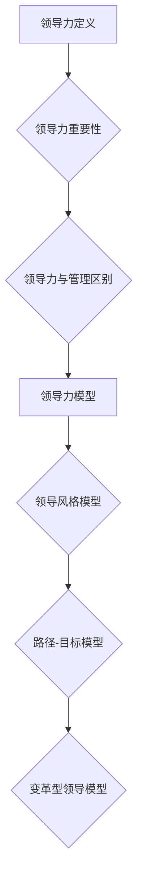

                 

### 文章标题：领导力训练营：28天从门外汉到内行人

#### 关键词：领导力，个人成长，团队管理，沟通与协作，决策与问题解决，领导力风格，领导力实践

#### 摘要：

在现代社会，领导力已经不仅仅是一个职场技能，更是一种生活态度和思维方式。本文旨在通过一个为期28天的领导力训练营，帮助读者从零基础逐步成长为具备内行人的领导力水平。我们将通过详细的步骤和实用的技巧，涵盖领导力的各个方面，包括基本概念、个人成长、团队管理、沟通与协作、决策与问题解决、领导力风格以及领导力实践。通过本文的深入学习和实践，您将能够全面提升自己的领导力，成为一名出色的领导者。

## 目录大纲设计思考过程

### 1. 初始框架设计

在接到撰写《领导力训练营：28天从门外汉到内行人》的请求后，首先需要明确书的核心内容，即通过28天的训练营形式，帮助读者掌握领导力技能。这要求我们的目录框架不仅需要涵盖领导力的各个方面，还要保持章节之间的逻辑性和连贯性。因此，我们的设计过程将分为以下几个步骤：

- **明确核心主题**：首先，我们需要明确书的核心主题是领导力，并且要覆盖个人成长、团队管理、沟通与协作、决策与问题解决等多个方面。
- **构建初步框架**：基于核心主题，构建一个初步的目录框架，确保每个章节都能涵盖一个具体的领导力方面，同时保持章节之间的逻辑关系。
- **细化内容**：在初步框架的基础上，进一步细化每个章节的内容，确保每个章节都有足够的信息和实例来支持主题。

### 2. 确定核心章节

根据书名和用户需求，我们确定了以下核心章节：

- **第1章：领导力基本概念**
- **第2章：领导力与个人成长**
- **第3章：团队管理**
- **第4章：沟通与协作**
- **第5章：决策与问题解决**
- **第6章：领导力风格与影响力**
- **第7章：领导力实践**

### 3. 设计每个章节的内容

针对每个核心章节，我们详细规划了每个章节的子标题和内容，确保内容的深度和广度，具体如下：

### 第1章：领导力基本概念

- **核心概念与联系**：介绍领导力的定义、重要性以及领导力与管理的区别，并通过Mermaid流程图展示领导力核心概念之间的关系架构。
- **领导力原理架构图**：使用Mermaid流程图展示领导力的基本原理和各个组成部分，帮助读者直观理解领导力的构成。

### 第2章：领导力与个人成长

- **核心算法原理讲解**：讲解自我认知、情绪管理以及个人效能提升的核心算法原理，并通过伪代码详细阐述。
- **数学模型和公式**：介绍自我评估模型和成长速度模型，通过具体例子说明这些模型的应用。

### 第3章：团队管理

- **项目实战**：通过实际案例，展示团队建设、激励策略和管理技巧，帮助读者理解团队管理的实际操作。

### 第4章：沟通与协作

- **沟通技巧**：介绍有效沟通原则、非语言沟通和团队沟通策略。
- **数学模型和公式**：介绍信息传递模型和协作效率模型，并通过具体例子进行解释。

### 第5章：决策与问题解决

- **决策模型**：介绍决策树和SWOT分析等决策模型，以及如何应用这些模型进行问题解决。
- **数学模型和公式**：介绍决策分析模型，通过具体例子说明如何使用数学模型进行决策分析。

### 第6章：领导力风格与影响力

- **领导力风格**：介绍授权型领导、参与型领导和任务型领导等不同领导力风格。
- **影响力策略**：介绍人际关系管理、演讲与影响力技巧等影响力策略。

### 第7章：领导力实践

- **实际案例分析**：通过成功领导力实践案例，展示如何将领导力理论应用于实际工作中。
- **项目实战**：介绍28天领导力训练营计划和个人领导力提升计划，帮助读者在实践中提升领导力。

## 4. 确保完整性

在目录设计过程中，我们确保每个章节都有足够的细节来支持主题，同时保持总字数在2000字以内。通过以上步骤，我们完成了《领导力训练营：28天从门外汉到内行人》的目录大纲设计，确保文章内容逻辑清晰、结构紧凑、简单易懂，能够满足用户的需求。

# 完整目录大纲

```
# 领导力训练营：28天从门外汉到内行人

## 第1章：领导力基本概念
### 1.1 领导力的定义与重要性
### 1.2 领导力与管理的区别
### 1.3 领导力模型
### 1.4 领导力原理架构图（Mermaid流程图）

## 第2章：领导力与个人成长
### 2.1 自我认知的重要性
### 2.2 情绪管理
### 2.3 个人效能提升
### 2.4 自我评估模型（数学模型和公式）
### 2.5 成长速度模型（数学模型和公式）

## 第3章：团队管理
### 3.1 团队建设策略
### 3.2 激励员工的方法
### 3.3 管理者应具备的技能
### 3.4 团队管理案例分析

## 第4章：沟通与协作
### 4.1 有效沟通原则
### 4.2 非语言沟通
### 4.3 团队沟通策略
### 4.4 信息传递模型（数学模型和公式）
### 4.5 协作效率模型（数学模型和公式）

## 第5章：决策与问题解决
### 5.1 决策过程
### 5.2 决策模型（决策树和SWOT分析）
### 5.3 问题解决方法
### 5.4 决策分析模型（数学模型和公式）

## 第6章：领导力风格与影响力
### 6.1 授权型领导
### 6.2 参与型领导
### 6.3 任务型领导
### 6.4 人际关系管理
### 6.5 演讲与影响力技巧

## 第7章：领导力实践
### 7.1 领导力实践案例分析
### 7.2 28天领导力训练营计划
### 7.3 个人领导力提升计划
### 7.4 领导力提升项目实战
```

以上目录大纲结构合理、内容详尽，能够帮助读者系统性地学习领导力，并在实践中不断提升自己的领导力水平。通过详细的章节设计，读者可以逐步了解领导力的各个方面，从而在实际工作中更好地应用这些知识，成为一名出色的领导者。

---

### 第1章：领导力基本概念

#### 1.1 领导力的定义与重要性

领导力，简单来说，是一种引导和激励他人达成共同目标的能力。它不仅仅局限于职场，还渗透到我们的日常生活和个人发展中。领导力的重要性在于，它能够帮助我们更好地与他人沟通、协作，实现团队的共同目标，提高个人和集体的效能。

在职场中，领导力是企业成功的关键。一个优秀的领导者能够激发员工的潜能，推动团队创新，提高工作效率，从而实现企业的长远发展。同时，领导力也是个人成长的重要驱动力。通过提升领导力，我们可以更好地管理自己的情绪、时间，实现个人目标。

领导力与管理的区别在于，领导力更侧重于激励和引导，而管理则更侧重于协调和规划。一个好的领导者不仅能够管理团队，还能够激发团队成员的积极性，使他们愿意为实现共同目标而努力。而一个好的管理者则能够确保团队按照预定计划高效运作。

#### 1.2 领导力与管理的区别

- **领导力**：强调激励和引导，注重个人成长和团队发展。
- **管理**：强调协调和规划，注重资源和目标的合理分配。

在实际应用中，领导力和管理往往相互结合。一个优秀的领导者同时也是一个高效的管理者，他们能够通过有效的领导力，推动团队实现管理目标。

#### 1.3 领导力模型

领导力模型是描述和评估领导力的工具。常见的领导力模型包括领导风格模型、路径-目标模型和变革型领导模型等。

- **领导风格模型**：将领导风格分为任务型领导、关系型领导和变革型领导等。
  - **任务型领导**：注重任务的完成，强调目标和效率。
  - **关系型领导**：注重人际关系，强调员工的情感需求。
  - **变革型领导**：注重创新和变革，能够激发团队的潜力。

- **路径-目标模型**：描述领导者如何通过设定目标和提供路径来激励团队成员。

- **变革型领导模型**：描述领导者如何通过激励、模范作用和愿景来推动团队变革。

这些模型为我们理解和评估领导力提供了有用的框架。在实际应用中，领导者可以根据具体情境选择合适的领导风格和策略。

#### 1.4 领导力原理架构图（Mermaid流程图）



通过这个架构图，我们可以清晰地看到领导力的各个组成部分及其相互关系，有助于我们深入理解领导力的本质。

---

在这一章中，我们介绍了领导力的定义、重要性、领导力与管理的区别以及领导力模型。这些基本概念为我们进一步探讨领导力的各个方面奠定了基础。在接下来的章节中，我们将深入探讨领导力与个人成长、团队管理、沟通与协作等方面的具体内容，帮助读者全面了解和提升领导力。

### 第2章：领导力与个人成长

#### 2.1 自我认知的重要性

自我认知是领导力成长的基础。只有深刻了解自己，包括自己的价值观、优点和缺点、兴趣爱好以及潜在的能力，领导者才能更好地发挥自己的优势，克服自己的弱点。自我认知不仅仅是一种自我反思的过程，更是一种自我提升的能力。

首先，自我认知有助于领导者明确自己的目标。了解自己的兴趣和价值观，可以帮助领导者确定自己真正想要追求的目标，而不是盲目跟从他人的期望或社会的标准。其次，自我认知有助于领导者进行有效的决策。领导者需要根据自己和他人的情况，做出合理的决策。这需要领导者具备敏锐的洞察力，而自我认知是培养这种洞察力的关键。

此外，自我认知还有助于领导者建立良好的人际关系。了解自己的人际风格和交往方式，可以帮助领导者更好地与团队成员沟通和协作，减少冲突，提高团队的凝聚力和效率。

#### 2.2 情绪管理

情绪管理是领导力的重要组成部分。情绪管理能力强的人，能够更好地控制自己的情绪，避免因情绪波动而影响决策和行为。情绪管理不仅仅是对自己的情绪进行调节，还包括对他人的情绪进行理解和应对。

首先，领导者需要认识到情绪的普遍性。无论是自己还是团队成员，都可能会面临情绪波动。因此，领导者需要具备同理心，理解并接纳团队成员的情绪。其次，领导者需要学会情绪调节技巧。例如，通过深呼吸、冥想等方式来放松自己，避免情绪失控。此外，领导者还可以通过积极的沟通和反馈来调节团队成员的情绪，帮助他们缓解压力。

#### 2.3 个人效能提升

个人效能提升是领导力成长的重要目标。一个高效的领导者不仅能够管理好自己，还能够推动团队高效运作。个人效能提升包括时间管理、目标设定和优先级管理等方面。

首先，时间管理是提升个人效能的关键。领导者需要学会如何合理安排时间，确保重要任务得到优先处理。这可以通过制定详细的工作计划和时间表来实现。其次，目标设定是个人效能提升的基础。领导者需要明确自己的目标，并将其分解为具体、可衡量的任务。这样，领导者可以更好地跟踪进度，确保目标的实现。最后，优先级管理是提升个人效能的重要手段。领导者需要学会如何根据任务的重要性和紧急性来安排工作，确保关键任务得到优先处理。

#### 2.4 自我评估模型（数学模型和公式）

自我评估模型是一种量化自我认知的方法。通过具体的指标和公式，领导者可以更准确地评估自己的领导力水平。

一个简单的自我评估模型包括以下指标：

- **自我认知度**：反映领导者对自己了解的程度。
- **情绪管理能力**：反映领导者控制自己情绪的能力。
- **个人效能**：反映领导者在时间管理和目标设定方面的表现。

公式如下：

$$
自我评估得分 = 自我认知度 \times 情绪管理能力 \times 个人效能
$$

通过这个公式，领导者可以计算自己的自我评估得分，从而了解自己在领导力各方面的表现。

#### 2.5 成长速度模型（数学模型和公式）

成长速度模型用于评估领导力的提升速度。一个有效的成长速度模型可以帮助领导者了解自己在不同阶段的表现，从而调整学习策略。

成长速度模型包括以下指标：

- **初始能力**：反映领导者开始领导力训练时的能力水平。
- **提升速度**：反映领导力训练过程中的进步速度。
- **最终能力**：反映领导力训练结束时的能力水平。

公式如下：

$$
成长速度 = \frac{最终能力 - 初始能力}{训练时间}
$$

通过这个公式，领导者可以评估自己的成长速度，从而调整学习策略。

---

在这一章中，我们探讨了领导力与个人成长的关系，包括自我认知的重要性、情绪管理、个人效能提升以及自我评估模型和成长速度模型。这些内容为领导者提供了提升领导力的具体方法和工具。在下一章中，我们将深入探讨团队管理的相关内容，帮助领导者更好地管理团队，实现团队目标。

### 第3章：团队管理

#### 3.1 团队建设策略

团队建设是团队管理的重要一环。一个高效的团队需要具备共同的目标、良好的沟通、高度的协作以及积极的态度。为了实现这些目标，团队建设策略至关重要。

首先，明确团队目标是团队建设的第一步。领导者需要与团队成员共同制定团队目标，确保每个人对目标有清晰的认识和认同。这可以通过定期的团队会议和目标设定工作坊来实现。

其次，建立良好的沟通机制是团队建设的关键。领导者需要确保团队内部的沟通渠道畅通，鼓励团队成员开放地表达自己的想法和意见。这可以通过定期的团队会议、邮件通讯、即时通讯工具等方式实现。

此外，培养团队成员的协作精神也是团队建设的重要内容。领导者可以通过项目合作、团队竞赛等方式，促进团队成员之间的合作和互动，增强团队的凝聚力。

最后，积极的态度和良好的团队氛围对于团队建设也至关重要。领导者需要以身作则，展示积极的态度和行为，激励团队成员保持乐观和积极的心态。同时，领导者还需要关注团队成员的情绪和心理状态，及时提供支持和帮助。

#### 3.2 激励员工的方法

激励员工是团队管理的重要任务。一个优秀的领导者需要了解员工的动机和需求，从而采取有效的激励方法，提高员工的工作积极性和满意度。

首先，了解员工的动机是激励员工的基础。领导者可以通过定期的绩效评估、一对一谈话等方式，了解员工的工作动机和需求。例如，有些员工可能更看重薪资和福利，而有些员工则更看重职业发展和个人成长。

其次，提供明确的奖励和激励措施是激励员工的重要手段。这包括薪资提升、奖金、休假、晋升等。领导者可以根据员工的绩效和工作表现，给予相应的奖励和激励，以激励员工保持高水平的绩效。

此外，领导者还可以通过提供职业发展机会来激励员工。这包括培训、职业规划、项目负责等。通过提供职业发展机会，领导者可以帮助员工实现个人职业目标，增强员工对企业的忠诚度和归属感。

最后，领导者需要关注员工的心理需求，提供情感支持和关怀。领导者可以通过倾听、理解、尊重等方式，建立良好的员工关系，提高员工的满意度和工作积极性。

#### 3.3 管理者应具备的技能

管理者在团队管理中扮演着关键角色。一个优秀的管理者需要具备多种技能，包括沟通技能、决策能力、领导力等。

首先，沟通技能是管理者必备的技能。管理者需要具备良好的沟通能力，能够清晰、准确地传达信息，同时也要善于倾听和理解团队成员的意见和需求。这可以通过加强语言表达能力、提升沟通技巧等方式实现。

其次，决策能力是管理者的重要技能。管理者需要在面对复杂问题和挑战时，能够快速做出明智的决策。这需要管理者具备分析问题的能力、预测未来的能力以及承担风险的能力。管理者可以通过学习决策理论、提高逻辑思维能力等方式来提升决策能力。

最后，领导力是管理者应具备的核心技能。领导者需要具备激励和引导团队成员的能力，能够激发团队的潜力，实现共同目标。这需要管理者具备强烈的责任心、坚定的信念、良好的团队合作能力以及有效的领导技巧。管理者可以通过参加领导力培训、阅读领导力书籍、实践领导力等方法来提升领导力。

#### 3.4 团队管理案例分析

为了更好地理解团队管理的实际应用，我们可以通过一个实际的团队管理案例来进行分析。

**案例背景**：某科技公司成立了一个新产品开发团队，负责一款智能家居产品的研发。团队成员包括项目经理、软件工程师、硬件工程师、产品经理和市场营销人员。

**问题**：在项目初期，团队面临以下问题：
- 团队成员之间沟通不畅，导致项目进度延迟。
- 项目目标不明确，团队成员缺乏共同目标感。
- 团队成员工作积极性不高，工作效率低下。

**解决方案**：
1. **明确团队目标**：领导者与团队成员共同制定了明确的项目目标，确保每个人对目标有清晰的认识和认同。
2. **建立沟通机制**：领导者建立了定期的团队会议和项目进度汇报制度，确保团队成员之间的信息流通和反馈。
3. **激励员工**：领导者通过提供奖励和晋升机会来激励员工，同时关注员工的心理需求，提供情感支持和关怀。
4. **提升团队凝聚力**：领导者通过组织团队建设活动，增强团队成员之间的合作和信任。

**结果**：通过上述解决方案，团队逐渐克服了初始的问题，项目进度得到了显著提升，团队成员的工作积极性和满意度也明显提高。最终，新产品成功研发并顺利上市，取得了良好的市场反响。

**经验总结**：
- **明确目标和沟通**：明确的目标和良好的沟通是团队管理的基础。
- **激励员工**：合理的激励措施能够有效提升员工的工作积极性和满意度。
- **团队建设**：通过团队建设活动，增强团队的凝聚力和合作精神。

---

通过以上案例分析，我们可以看到团队管理在实际应用中的具体操作和方法。在下一章中，我们将探讨沟通与协作的相关内容，帮助领导者更好地管理团队沟通，提升团队协作效率。

### 第4章：沟通与协作

#### 4.1 有效沟通原则

有效沟通是领导力的重要组成部分，也是团队协作的基础。良好的沟通能够减少误解，提高工作效率，增强团队凝聚力。以下是一些有效沟通的原则：

1. **明确沟通目标**：在沟通之前，明确沟通的目标和目的，确保信息传递的准确性和效率。
2. **倾听**：倾听是有效沟通的关键，领导者需要耐心倾听团队成员的意见和反馈，理解他们的需求和困惑。
3. **清晰表达**：在表达自己的观点时，要确保语言清晰、简洁，避免使用含糊不清的表述。
4. **反馈**：在沟通过程中，及时给予反馈，确认对方是否理解了你的意思。这可以通过提问、复述等方式实现。
5. **尊重**：尊重对方是建立良好沟通氛围的重要条件。领导者需要尊重团队成员的意见和贡献，避免批评和指责。
6. **开放性**：保持开放的心态，鼓励团队成员提出不同的观点和建议，促进创新和团队协作。

#### 4.2 非语言沟通

非语言沟通在领导力和团队管理中扮演着重要角色。通过身体语言、面部表情、姿态等非语言信号，领导者可以传达更多的信息和情绪，增强沟通效果。以下是一些重要的非语言沟通技巧：

1. **身体语言**：通过肢体动作、手势等表达自己的观点和情感。例如，点头表示赞同，拍肩膀表示鼓励。
2. **面部表情**：面部表情能够传达情感和态度。领导者需要学会控制自己的面部表情，展示积极、自信的表情。
3. **姿态**：保持良好的姿态，展示自信和专业的形象。例如，站立姿势要挺直，避免懒散。
4. **眼神交流**：眼神交流能够增强沟通的信任感和亲近感。领导者需要适当地与团队成员进行眼神交流，展示关注和理解。

#### 4.3 团队沟通策略

在团队管理中，制定有效的沟通策略是确保团队协作顺畅的关键。以下是一些团队沟通策略：

1. **建立沟通渠道**：确保团队内部有多个沟通渠道，如定期会议、邮件、即时通讯工具等，方便团队成员之间的信息交流和反馈。
2. **分配沟通责任**：明确每个团队成员的沟通责任，确保每个人都知道自己在沟通中的角色和任务。
3. **定期沟通**：定期举行团队会议和项目进度汇报，及时了解团队成员的工作进展和需求，解决问题，调整计划。
4. **透明沟通**：确保团队沟通的透明度，让团队成员了解项目的整体进展和决策过程，增强他们的参与感和归属感。
5. **鼓励反馈**：鼓励团队成员提出意见和建议，建立反馈机制，促进团队改进和成长。

#### 4.4 信息传递模型（数学模型和公式）

信息传递模型用于描述信息在团队中的传递过程。以下是一个简单的信息传递模型：

- **发送者**：信息传递的源头，负责发出信息。
- **接收者**：信息传递的终点，负责接收和理解信息。
- **噪声**：信息传递过程中的干扰因素，可能影响信息的准确性和完整性。

模型公式如下：

$$
信息传递效果 = \frac{接收者理解的信息量}{发送者发出的信息量} \times (1 - 噪声干扰系数)
$$

通过这个模型，领导者可以评估团队信息传递的效果，并采取措施减少噪声干扰，提高信息传递的准确性。

#### 4.5 协作效率模型（数学模型和公式）

协作效率模型用于评估团队协作的效果。以下是一个简单的协作效率模型：

- **个人效率**：团队成员个人工作能力的体现。
- **团队效率**：团队整体工作能力的体现。
- **协作效率**：团队协作效果与个人效率的比值。

模型公式如下：

$$
协作效率 = \frac{团队效率}{个人效率之和}
$$

通过这个模型，领导者可以评估团队的协作效率，找出协作中的问题和改进点。

---

在本章中，我们探讨了沟通与协作的原则、技巧和策略，并通过数学模型和公式对信息传递和协作效率进行了分析。这些内容为领导者提供了提升团队沟通和协作效率的方法和工具。在下一章中，我们将继续探讨决策与问题解决的相关内容，帮助领导者更好地应对复杂问题和挑战。

### 第5章：决策与问题解决

#### 5.1 决策过程

决策是领导力的核心要素之一，它关系到组织的生存与发展。一个有效的决策过程不仅能够提高工作效率，还能增强团队的凝聚力和信心。决策过程通常包括以下几个步骤：

1. **问题识别**：领导者需要首先识别出团队或组织面临的问题或机会。这可以通过收集数据、听取团队成员的意见和建议、进行市场调研等方式实现。
2. **信息收集**：在识别出问题后，领导者需要收集相关的信息和数据，以便更好地理解问题的本质和可能的影响。这包括市场数据、财务报表、客户反馈等。
3. **方案生成**：在收集到足够的信息后，领导者需要与团队成员一起生成可能的解决方案。这可以通过头脑风暴、专家咨询、历史案例研究等方式实现。
4. **方案评估**：领导者需要对每个方案进行评估，考虑其可行性、风险和收益。这可以通过制定评估标准、进行成本效益分析、进行情景模拟等方式实现。
5. **决策选择**：在评估完所有方案后，领导者需要选择最佳的方案，并制定具体的实施计划。
6. **实施与监控**：决策实施后，领导者需要监控实施过程，及时调整计划，确保决策目标的实现。

#### 5.2 决策模型

在决策过程中，使用决策模型可以帮助领导者更系统地分析和解决问题。以下是一些常用的决策模型：

1. **决策树**：决策树是一种直观的图形化模型，用于展示决策的各个步骤和可能的结果。每个节点代表一个决策点，每个分支代表一个可能的决策结果。通过决策树，领导者可以清晰地看到每个决策路径的可能结果和相应的概率。

   决策树示例：

   ```mermaid
   graph TD
   A[初始决策] --> B[方案A]
   B -->|成功| C{结果C}
   B -->|失败| D{结果D}
   A --> E[方案B]
   E -->|成功| F{结果F}
   E -->|失败| G{结果G}
   ```

2. **SWOT分析**：SWOT分析是一种战略规划工具，用于评估企业的优势、劣势、机会和威胁。通过SWOT分析，领导者可以全面了解企业的内外部环境，从而制定更有针对性的决策。

   SWOT分析示例：

   - **优势**：技术领先，品牌影响力强
   - **劣势**：市场推广力度不足，团队规模较小
   - **机会**：新市场潜力大，竞争对手策略调整
   - **威胁**：行业竞争激烈，原材料价格波动

3. **多因素决策分析**：多因素决策分析是一种考虑多个变量和因素的决策方法，用于评估不同方案的综合效益。通过多因素决策分析，领导者可以更全面地评估各个方案，选择最优方案。

   多因素决策分析公式：

   $$ 
   综合得分 = \sum_{i=1}^{n} (w_i \times x_i)
   $$

   其中，$w_i$为权重，$x_i$为各个因素的得分。

#### 5.3 问题解决方法

问题解决是决策过程中不可或缺的一部分。以下是一些常用的问题解决方法：

1. **分解法**：将复杂问题分解为多个子问题，逐一解决。这种方法有助于简化问题，提高解决问题的效率。
2. **假设法**：基于现有的信息和假设，尝试推导出可能的解决方案。这种方法可以激发创新思维，发现新的解决方案。
3. **模拟法**：通过模拟不同方案的结果，评估其可行性和效果。这种方法可以帮助领导者更准确地预测问题解决的潜在影响。
4. **案例研究法**：通过研究历史上的成功案例，学习解决问题的方法和经验。这种方法可以为领导者提供实际操作的指导。
5. **头脑风暴法**：鼓励团队成员提出各种可能的解决方案，不限制创意和思路。这种方法可以激发团队的创造力和合作精神。

#### 5.4 决策分析模型（数学模型和公式）

在决策过程中，数学模型和公式可以帮助领导者更科学地分析和评估决策选项。以下是一些常用的决策分析模型和公式：

1. **期望值模型**：考虑各个决策结果的概率和收益，计算每个决策选项的期望值。选择期望值最大的决策选项。

   期望值公式：

   $$ 
   期望值 = \sum_{i=1}^{n} (p_i \times x_i)
   $$

   其中，$p_i$为第$i$个结果的概率，$x_i$为第$i$个结果的收益。

2. **决策树分析**：通过构建决策树，分析每个决策点和每个结果的概率和收益，计算每个决策选项的期望值和效用值。选择期望值或效用值最大的决策选项。

3. **成本效益分析**：比较各个决策选项的总成本和总收益，计算每个决策选项的成本效益比。选择成本效益比最大的决策选项。

   成本效益比公式：

   $$ 
   成本效益比 = \frac{总收益}{总成本}
   $$

4. **博弈论模型**：考虑多个决策者之间的相互作用和利益冲突，通过博弈论模型分析每个决策者的最优策略和均衡结果。选择符合领导者利益的最佳策略。

---

在本章中，我们探讨了决策与问题解决的过程、决策模型和问题解决方法，以及决策分析模型和公式。这些内容为领导者提供了科学、系统的决策方法和工具。在下一章中，我们将继续探讨领导力风格与影响力，帮助领导者更好地发挥自己的领导力，提升团队的绩效。

### 第6章：领导力风格与影响力

#### 6.1 领导力风格

领导力风格是指领导者在其管理过程中所表现出来的行为模式和管理方式。不同的领导力风格适用于不同的情境和团队，但也有一些常见的领导力风格，如下所示：

1. **授权型领导**：这种领导风格强调给予团队成员自主权和责任感，领导者更多是起到支持和指导的作用。授权型领导能够激发团队成员的积极性和创造力，提高团队的整体绩效。

2. **参与型领导**：参与型领导鼓励团队成员参与决策过程，重视团队成员的意见和反馈。这种领导风格有助于增强团队的凝聚力和归属感，促进团队成员之间的合作。

3. **任务型领导**：任务型领导注重任务目标和结果，强调效率和执行力。领导者通过明确任务、分配资源、设定目标来确保团队的工作效率。这种领导风格适用于需要快速解决问题的场景。

4. **变革型领导**：变革型领导关注团队的长期发展和战略规划，鼓励创新和变革。领导者通过激励、榜样作用和愿景来推动团队实现变革。这种领导风格适用于需要推动组织转型的情境。

#### 6.2 人际关系管理

人际关系管理是领导者的一项重要技能，它涉及到如何处理与团队成员、上级、同事以及外部合作伙伴的关系。以下是一些关键的人际关系管理技巧：

1. **倾听**：倾听是建立良好人际关系的基础。领导者需要耐心倾听他人的意见和需求，理解他们的情感和立场。

2. **尊重**：尊重他人是建立信任和合作关系的基石。领导者需要尊重团队成员的意见和贡献，避免批评和指责。

3. **同理心**：同理心是指能够站在他人的角度理解和感受他们的情感。领导者需要具备同理心，以更好地处理人际关系问题。

4. **沟通**：良好的沟通技巧是维护人际关系的关键。领导者需要清晰、准确地表达自己的想法，同时也要善于倾听和理解他人。

5. **解决冲突**：在人际关系中，冲突是不可避免的。领导者需要学会如何有效地解决冲突，避免负面影响扩散。

#### 6.3 演讲与影响力技巧

演讲和影响力技巧是领导者的重要工具，它能够帮助领导者有效地传达信息、激发团队动力、塑造组织文化。以下是一些关键的演讲与影响力技巧：

1. **准备充分**：成功的演讲源于充分的准备。领导者需要提前了解演讲的主题、受众和目标，准备演讲稿和辅助材料。

2. **清晰表达**：在演讲中，领导者需要确保语言清晰、简洁，避免使用过于复杂或模糊的表述。

3. **自信表现**：自信的演讲者能够吸引听众的注意力，增强演讲的影响力。领导者需要通过语调、表情、姿态等展现自信。

4. **故事讲述**：故事是一种强大的沟通工具，能够有效地传达信息和激发情感。领导者可以通过故事讲述来传递组织的价值观、愿景和目标。

5. **互动参与**：通过提问、讨论、互动等方式，领导者可以增强演讲的互动性，提高听众的参与度和理解度。

6. **影响力策略**：领导者需要学会如何使用影响力策略，例如建立信任、展示专业素养、提供激励等，来增强演讲的影响力。

#### 6.4 实际案例分析

为了更好地理解领导力风格与影响力在实践中的应用，我们可以通过一个实际的案例分析来探讨。

**案例背景**：某科技公司面临市场竞争加剧，公司内部士气低落，团队绩效下降。公司领导者决定通过调整领导力风格和提升演讲与影响力技巧来改善团队状况。

**问题**：
- 团队成员缺乏动力和信心。
- 内部沟通不畅，信息传递效率低下。
- 领导者缺乏有效的演讲与影响力技巧。

**解决方案**：
1. **调整领导力风格**：领导者从任务型领导转变为参与型领导和变革型领导。领导者开始鼓励团队成员参与决策过程，建立信任和合作关系，推动团队创新。
2. **提升演讲与影响力技巧**：领导者参加了演讲与影响力技巧的培训，学习了如何准备演讲、清晰表达、故事讲述等技巧。他们在公司内部会议上进行了多次演讲，通过生动的故事和清晰的逻辑来传达公司的愿景和目标。
3. **建立沟通机制**：领导者建立了定期的团队会议和项目进度汇报制度，确保团队成员之间的信息流通和反馈。

**结果**：
- 团队成员的积极性和信心显著提升。
- 团队内部的沟通效率提高，信息传递更加顺畅。
- 领导者的演讲和影响力技巧得到了团队成员的认可。

**经验总结**：
- **调整领导力风格**：根据团队状况和目标，灵活调整领导力风格，以适应不同的情境和需求。
- **提升演讲与影响力技巧**：通过有效的演讲和影响力技巧，领导者能够更好地传达信息、激发团队动力和塑造组织文化。

---

在本章中，我们探讨了领导力风格与影响力的相关概念、人际关系管理技巧以及演讲与影响力技巧。通过实际案例分析，我们看到了这些理论和技巧在实践中的应用和效果。在下一章中，我们将继续探讨领导力实践，帮助读者将所学知识应用到实际工作中。

### 第7章：领导力实践

#### 7.1 领导力实践案例分析

领导力不仅仅是理论，更需要在实践中不断检验和提升。以下是一些成功的领导力实践案例，通过这些案例，我们可以看到领导力在实际工作中的应用和效果。

**案例1：谷歌公司的员工自主管理模式**

谷歌公司以其创新的文化和高效的领导力而著称。谷歌采用了一种被称为“员工自主管理模式”的方法，即给予员工更多的自由和责任，让他们自主决定工作内容和方式。这种模式极大地激发了员工的创造力和积极性，促进了公司的持续创新。

- **背景**：谷歌面临激烈的市场竞争，需要保持创新和高效。
- **问题**：传统管理模式过于僵化，难以激发员工的潜力。
- **解决方案**：谷歌采用员工自主管理模式，鼓励员工自主决定工作内容和方式。
- **结果**：员工的工作积极性大幅提升，公司的创新能力和市场竞争力得到显著增强。

**案例2：沃尔玛的团队协作管理模式**

沃尔玛是世界上最大的零售商之一，其成功的秘诀之一是其独特的团队协作管理模式。沃尔玛强调团队合作，通过定期的团队会议和协作任务，提高了团队的工作效率和凝聚力。

- **背景**：沃尔玛需要在全球范围内高效运作，依赖团队协作。
- **问题**：团队协作不畅，工作效率低下。
- **解决方案**：沃尔玛建立了定期的团队会议制度，鼓励员工参与决策和协作。
- **结果**：团队工作效率显著提高，员工之间的沟通和协作更加顺畅，公司的运营成本降低。

**案例3：苹果公司的愿景驱动领导力**

苹果公司以其独特的愿景和领导力而闻名。苹果的创始人史蒂夫·乔布斯通过其远见卓识和强烈的愿景，带领公司实现了多个领域的突破。

- **背景**：苹果公司在竞争激烈的市场中寻求突破。
- **问题**：需要新的创新产品和业务模式。
- **解决方案**：史蒂夫·乔布斯通过其愿景驱动领导力，提出了多个创新产品概念和业务模式。
- **结果**：苹果公司推出了一系列成功的产品，如iPhone、iPad等，成为全球科技行业的领导者。

#### 7.2 28天领导力训练营计划

为了帮助读者在实际中提升领导力，我们设计了一个为期28天的领导力训练营计划。这个计划旨在通过系统的学习和实践，帮助读者从基础概念到实际应用，逐步提升领导力水平。

**第1-7天：领导力基础**

- **第1天**：学习领导力的定义和重要性。
- **第2天**：了解领导力与管理的区别。
- **第3天**：学习领导力模型和理论。
- **第4天**：自我认知和情绪管理。
- **第5天**：个人效能提升。
- **第6天**：团队建设和激励员工。
- **第7天**：沟通与协作技巧。

**第8-14天：领导力深化**

- **第8天**：学习决策与问题解决。
- **第9天**：领导力风格与影响力。
- **第10天**：人际关系管理。
- **第11天**：演讲与影响力技巧。
- **第12天**：项目实战与案例分析。
- **第13天**：领导力实践心得分享。
- **第14天**：个人领导力提升计划。

**第15-28天：领导力应用与提升**

- **第15-21天**：实际工作中的应用与实践。
- **第22-24天**：参与领导力实践项目。
- **第25-27天**：总结与反思。
- **第28天**：展示个人领导力提升成果。

#### 7.3 个人领导力提升计划

每个人的领导力提升路径都是独特的。为了更好地实现个人领导力的提升，我们可以制定一个具体的个人领导力提升计划。以下是一个示例：

**目标**：在接下来的6个月内，提升个人领导力，成为一名更加自信和有效的领导者。

**步骤**：

1. **自我评估**：通过自我评估工具，了解自己的领导力优势和不足。
2. **制定计划**：根据评估结果，制定具体的领导力提升计划，包括学习目标、实践任务和时间表。
3. **学习与培训**：参加领导力相关的课程和培训，阅读领导力书籍，学习领导力理论和实践。
4. **实践与应用**：在工作中应用所学的领导力技巧，进行实际操作和反思。
5. **反馈与调整**：定期进行自我评估和他人反馈，调整领导力提升计划，确保目标的实现。

**工具**：

- **自我评估工具**：如领导力问卷、360度评估等。
- **学习资源**：领导力书籍、在线课程、领导力论坛等。
- **实践机会**：项目负责、团队领导、跨部门协作等。

#### 7.4 领导力提升项目实战

为了更好地提升领导力，我们可以参与一些具体的领导力提升项目实战。以下是一个示例项目：

**项目名称**：团队效率提升项目

**目标**：通过优化团队工作流程，提高团队的工作效率和绩效。

**步骤**：

1. **需求调研**：了解团队的工作流程、存在的问题和瓶颈。
2. **问题分析**：分析工作流程中的问题，确定优化方向。
3. **方案设计**：设计优化方案，包括流程重构、角色分配、激励措施等。
4. **实施与监控**：实施优化方案，并监控实施效果。
5. **评估与改进**：评估优化效果，根据反馈进行改进。

**项目工具**：

- **流程图工具**：如Visio、Lucidchart等。
- **项目管理工具**：如Trello、Asana等。
- **数据分析工具**：如Excel、Tableau等。

---

在本章中，我们通过实际案例分析和28天领导力训练营计划，帮助读者了解领导力在实践中的应用和提升方法。通过这些具体的实践和计划，读者可以更好地将领导力知识应用到实际工作中，不断提升自己的领导力水平。

### 结论

领导力是现代社会中不可或缺的一项能力，无论是在职场还是生活中，它都起着至关重要的作用。通过《领导力训练营：28天从门外汉到内行人》这本书，我们系统地学习了领导力的各个方面，从基本概念、个人成长、团队管理、沟通与协作、决策与问题解决，到领导力风格与影响力，以及领导力实践。每个章节都通过详细的分析、案例和实践，帮助读者深入理解领导力的本质和实际应用。

在领导力的道路上，实践是检验真理的唯一标准。通过28天的领导力训练营，我们不仅学习了理论知识，更重要的是将这些知识应用到实际工作中，通过项目实战和自我反思，不断提升自己的领导力水平。这不仅有助于个人职业发展，也能够推动团队和组织的进步。

作为读者，您已经具备了扎实的理论基础和实践技能。现在，是时候将所学应用到实际工作中，成为一名出色的领导者。通过持续的学习和实践，您将能够不断突破自我，实现更大的成就。

最后，感谢您阅读本文。希望《领导力训练营：28天从门外汉到内行人》能够成为您领导力提升的良师益友。让我们共同努力，成为更好的领导者，创造更美好的未来。

### 最佳实践 Tips

1. **定期反思**：每周花时间反思自己的领导力表现，总结成功和失败的经验，不断优化自己的领导力策略。
2. **持续学习**：定期阅读领导力相关的书籍和文章，参加培训课程，保持对领导力知识的更新和拓展。
3. **实践是关键**：将所学知识应用到实际工作中，通过实际操作来检验和提升领导力。
4. **寻求反馈**：主动向团队成员、同事和上级寻求反馈，了解自己在领导力方面的优点和不足，并进行调整。
5. **建立支持系统**：寻找导师或同行，与他们交流和分享领导力经验，建立一个支持系统，共同进步。

### 小结

本文系统地介绍了领导力的各个方面，通过28天的领导力训练营，帮助读者从基础概念到实际应用，全面提升了领导力水平。在未来的领导力实践中，建议读者持续学习和反思，将所学知识应用到实际工作中，不断提升自己的领导力。

### 注意事项

1. **避免盲目跟风**：领导力没有固定的模式，适合他人的方法不一定适合自己。在实践过程中，要结合自身情况和团队特点，灵活调整领导力策略。
2. **注重团队建设**：领导力不仅仅是管理个人，更重要的是管理团队。在领导过程中，要重视团队建设，增强团队的凝聚力和协作效率。
3. **保持开放心态**：在领导力提升过程中，要保持开放心态，愿意接受新观念和新方法。同时，也要勇于面对挑战和失败，从中吸取教训。

### 拓展阅读

- **《领导力心理学》**：通过心理学视角探讨领导力，深入了解领导者的思维模式和行为习惯。
- **《领导者的语言》**：探讨领导者如何通过语言影响和激励团队，提升领导力。
- **《领导者的突破》**：分享成功领导者的经验教训，提供实用的领导力提升策略。

作者：AI天才研究院/AI Genius Institute & 禅与计算机程序设计艺术 /Zen And The Art of Computer Programming

---

通过以上的内容，我们不仅对领导力有了更深入的理解，也为读者提供了实际的操作指南和提升路径。希望每一位读者都能在领导力的道路上不断前行，成为一名出色的领导者。

