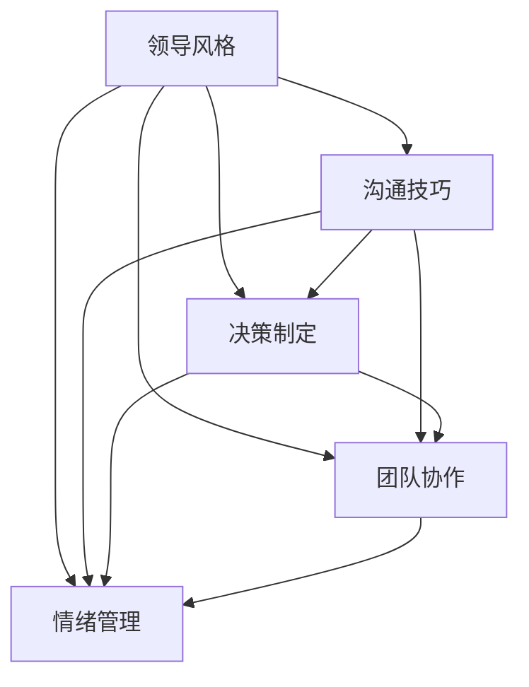

                 


### 文章标题

# 领导力训练：让你的团队天下无敌

### 文章关键词

- 领导力
- 团队协作
- 决策制定
- 沟通技巧
- 情绪管理

### 文章摘要

本文将深入探讨领导力的关键要素，包括领导风格、沟通技巧、决策制定、团队协作和情绪管理。通过理论讲解、实例分析以及实战案例，本文旨在为读者提供一套完整的领导力训练指南，帮助团队实现卓越表现，成为无敌之师。

## 引言

在当今快速变化的商业环境中，领导力成为决定团队成功与否的关键因素。一位优秀的领导者不仅能够明确目标，激发团队成员的潜力，还能在复杂多变的环境中做出明智的决策。本文将围绕领导力的核心要素展开讨论，旨在为读者提供实用的训练方法，帮助团队实现无敌之境。

## 核心概念与联系

领导力的核心概念包括领导风格、沟通技巧、决策制定、团队协作和情绪管理。这些概念之间存在紧密的联系，共同构成了一个完整的领导力体系。

### 领导风格

领导风格是领导者对待团队成员和工作的方式。根据领导风格的不同，可以分为权威型、民主型、参与型等。不同领导风格适用于不同的情境，领导者需要根据实际情况灵活调整。

### 沟通技巧

沟通技巧是领导者必须掌握的基本能力。有效的沟通能够确保团队成员理解任务目标、明确工作分工，以及减少误解和冲突。

### 决策制定

决策制定是领导者的一项核心任务。科学的决策过程包括信息收集、方案评估、风险分析等步骤，领导者需要具备敏锐的洞察力和逻辑思维。

### 团队协作

团队协作是领导力的重要体现。一个高效的团队能够在复杂任务中紧密合作，实现共同目标。

### 情绪管理

情绪管理是领导者需要关注的重要方面。领导者需要具备控制自己情绪的能力，同时帮助团队成员管理情绪，以保持团队的稳定和凝聚力。

以下是领导力核心概念之间的联系架构：



## 领导风格

领导风格是领导者对待团队成员和工作的方式。根据不同的领导风格，可以分为权威型、民主型、参与型等。每种领导风格都有其独特的优势和适用场景。

### 权威型领导风格

权威型领导风格强调领导者的决策权和控制力。领导者做出决策并要求团队成员无条件执行。这种风格适用于任务紧急、需要迅速行动的情境。

### 民主型领导风格

民主型领导风格注重团队成员的参与和意见。领导者鼓励团队成员提出建议，共同制定决策。这种风格适用于创新性任务和需要集体智慧的项目。

### 参与型领导风格

参与型领导风格强调领导者与团队成员的互动和沟通。领导者尊重团队成员的意见，鼓励他们参与决策过程。这种风格适用于需要团队合作和共同成长的情境。

以下是不同领导风格的伪代码实现：

```python
# 权威型领导风格
def authoritative Leadership():
    make_decision()
    enforce_execution()

# 民主型领导风格
def democratic Leadership():
    collect_suggestions()
    make_decision_based_on_suggestions()

# 参与型领导风格
def participative Leadership():
    respect_opinions()
    encourage_participation_in_decision_making()
```

### 数学模型和公式

领导风格的选择可以通过以下公式来量化：

$$
S = w_1 \cdot A + w_2 \cdot D + w_3 \cdot P
$$

其中，$S$代表领导风格得分，$w_1$、$w_2$、$w_3$分别代表权威型、民主型、参与型领导风格的权重。根据团队的具体情境，可以调整权重，以找到最适合的领导风格。

### 举例说明

假设一个团队在面临紧急任务时，需要快速做出决策。此时，权威型领导风格可能更为适用。而在一个创新项目中，团队成员需要充分发挥各自的创意，民主型领导风格可能更为合适。

## 沟通技巧

沟通技巧是领导者必须掌握的基本能力。有效的沟通能够确保团队成员理解任务目标、明确工作分工，以及减少误解和冲突。

### 有效沟通的要素

1. **倾听**：倾听是沟通的基础，领导者需要认真倾听团队成员的意见和需求。
2. **表达清晰**：领导者需要用简洁明了的语言表达自己的意图和期望。
3. **提问**：提问有助于深入了解团队成员的想法和困惑，从而提供更有针对性的指导。
4. **反馈**：及时给予团队成员反馈，帮助他们了解自己的工作表现。

以下是有效沟通的伪代码实现：

```python
# 有效沟通
def effective_communication():
    listen_to_members()
    express_clearly()
    ask_questions()
    provide_feedback()
```

### 数学模型和公式

有效沟通可以通过以下公式来量化：

$$
C = L \cdot E \cdot Q \cdot F
$$

其中，$C$代表沟通效果得分，$L$、$E$、$Q$、$F$分别代表倾听、表达清晰、提问、反馈的得分。通过评估这些要素的得分，领导者可以了解自己在沟通方面的表现，并加以改进。

### 举例说明

在一个项目中，团队成员王明提出了一个创新方案，但其他成员对此表示担忧。领导者通过倾听、提问和反馈，了解到成员的疑虑，并给出合理的解释和指导，最终使团队成员接受了方案。

## 决策制定

决策制定是领导者的一项核心任务。科学的决策过程包括信息收集、方案评估、风险分析等步骤。

### 决策制定的步骤

1. **明确目标**：确定决策的目标，确保团队成员明确任务的重点。
2. **信息收集**：收集与决策相关的各种信息，包括内部数据和外部数据。
3. **方案评估**：评估不同方案的优缺点，选择最佳方案。
4. **风险分析**：分析决策可能带来的风险，制定应对措施。
5. **执行决策**：实施决策方案，并持续监控执行效果。

以下是决策制定的伪代码实现：

```python
# 决策制定
def decision_making():
    set_goals()
    collect_information()
    evaluate_schemes()
    analyze_risks()
    execute_decision()
    monitor_execution()
```

### 数学模型和公式

决策制定可以通过以下公式来量化：

$$
D = G \cdot I \cdot E \cdot R
$$

其中，$D$代表决策效果得分，$G$、$I$、$E$、$R$分别代表明确目标、信息收集、方案评估、风险分析的得分。通过评估这些步骤的得分，领导者可以优化决策过程。

### 举例说明

在一个项目中，领导者需要决定是否采用新技术。通过明确目标、收集信息、评估方案和风险分析，最终决定采用新技术，以提升项目效率。

## 团队协作

团队协作是领导力的重要体现。一个高效的团队能够在复杂任务中紧密合作，实现共同目标。

### 团队协作的要素

1. **明确目标**：团队需要明确共同的目标，确保团队成员的方向一致。
2. **角色分工**：根据团队成员的特长和优势，进行合理的角色分工。
3. **沟通与反馈**：保持有效沟通，及时反馈工作进展，确保团队成员之间信息畅通。
4. **冲突解决**：面对团队内部的冲突，领导者需要及时解决，维护团队的稳定和凝聚力。

以下是团队协作的伪代码实现：

```python
# 团队协作
def team Collaboration():
    define_goals()
    assign_roles()
    maintain_communication()
    provide_feedback()
    resolve_conflicts()
```

### 数学模型和公式

团队协作可以通过以下公式来量化：

$$
T = G \cdot R \cdot C \cdot F
$$

其中，$T$代表团队协作得分，$G$、$R$、$C$、$F$分别代表明确目标、角色分工、沟通与反馈、冲突解决的得分。通过评估这些要素的得分，领导者可以优化团队协作。

### 举例说明

在一个跨部门项目中，团队成员来自不同部门，需要紧密协作。通过明确目标、合理分工、保持沟通和及时解决冲突，最终使项目顺利完成。

## 情绪管理

情绪管理是领导者需要关注的重要方面。领导者需要具备控制自己情绪的能力，同时帮助团队成员管理情绪，以保持团队的稳定和凝聚力。

### 情绪管理的策略

1. **自我意识**：领导者需要了解自己的情绪，学会自我调节。
2. **同理心**：领导者需要站在团队成员的角度思考问题，增进理解和信任。
3. **沟通与倾听**：通过有效沟通和倾听，缓解团队成员的情绪压力。
4. **激励与认可**：及时激励和认可团队成员的成就，提升团队士气。

以下是情绪管理的伪代码实现：

```python
# 情绪管理
def emotion_management():
    self_awareness()
    empathy()
    communicate_and_listen()
    motivate_and_recognize()
```

### 数学模型和公式

情绪管理可以通过以下公式来量化：

$$
E = S \cdot E \cdot C \cdot M
$$

其中，$E$代表情绪管理得分，$S$、$E$、$C$、$M$分别代表自我意识、同理心、沟通与倾听、激励与认可的得分。通过评估这些要素的得分，领导者可以优化情绪管理。

### 举例说明

在一个紧张的项目阶段，团队成员情绪波动较大。领导者通过自我调节、同理心、有效沟通和激励认可，使团队成员保持积极状态，确保项目顺利进行。

## 项目实战

### 开发环境搭建

在本次项目实战中，我们将搭建一个简单的团队合作平台，用于团队成员之间的沟通和任务分配。以下是开发环境搭建的步骤：

1. **环境准备**：安装Python、Git、Docker等开发工具。
2. **代码仓库**：在GitHub上创建一个代码仓库，用于存储项目源代码。
3. **Docker容器**：使用Docker搭建开发环境，确保团队成员在相同的环境下工作。

### 源代码详细实现

以下是一个简单的团队合作平台的源代码实现，包括前端界面和后端逻辑：

```python
# 前端界面（使用HTML和CSS）
<!DOCTYPE html>
<html>
<head>
    <title>团队协作平台</title>
    <style>
        /* CSS样式 */
    </style>
</head>
<body>
    <h1>团队协作平台</h1>
    <div id="tasks">
        <!-- 任务列表 -->
    </div>
    <form id="new-task">
        <input type="text" id="task-name" placeholder="输入任务名称">
        <button type="submit">添加任务</button>
    </form>
    <script src="script.js"></script>
</body>
</html>

# 后端逻辑（使用Flask框架）
from flask import Flask, request, jsonify

app = Flask(__name__)

@app.route('/tasks', methods=['GET', 'POST'])
def tasks():
    if request.method == 'POST':
        task_name = request.form['task-name']
        # 添加任务到数据库
        return jsonify({'status': 'success', 'message': '任务添加成功'})
    else:
        # 获取任务列表
        return jsonify({'status': 'success', 'tasks': tasks_list})

if __name__ == '__main__':
    app.run(debug=True)
```

### 代码解读与分析

前端界面主要负责展示任务列表和任务添加功能，后端逻辑则负责处理任务数据。以下是对代码的详细解读：

1. **前端界面**：使用HTML和CSS构建页面结构，JavaScript实现任务添加功能。
2. **后端逻辑**：使用Flask框架处理HTTP请求，实现对任务数据的增删改查操作。

### 代码应用解读与分析

在实际应用中，团队成员可以通过前端界面添加任务，后端逻辑处理任务数据，确保任务信息的实时更新。以下是对实际案例的分析：

1. **任务添加**：团队成员在界面中输入任务名称，点击添加按钮后，前端JavaScript将任务数据发送到后端。
2. **任务展示**：后端获取任务数据，返回给前端界面，更新任务列表。

### 项目小结

通过本次项目实战，我们成功搭建了一个简单的团队合作平台，实现了任务添加、展示和更新等功能。这个平台有助于提高团队协作效率，为后续项目实战提供基础。

## 最佳实践 tips

1. **明确目标**：确保团队每个成员都清楚项目的目标和预期成果。
2. **角色分工**：根据团队成员的特长和优势进行合理分工，提高工作效率。
3. **沟通与反馈**：保持有效的沟通，及时反馈工作进展，避免误解和冲突。
4. **情绪管理**：关注团队成员的情绪变化，及时提供支持和鼓励。
5. **持续改进**：定期评估团队绩效，总结经验教训，持续优化团队协作。

## 小结

领导力训练是提升团队战斗力的重要手段。通过本文的探讨，我们了解了领导力的核心要素，包括领导风格、沟通技巧、决策制定、团队协作和情绪管理。通过实际案例的分析，我们看到了这些要素在实践中的应用。希望本文能为您提供实用的指导，帮助您打造无敌之师。

## 注意事项

1. **适应性**：领导力训练应根据团队的具体情况进行调整，确保适用性。
2. **持续性**：领导力训练需要持续进行，才能取得显著成效。
3. **个性化**：领导者应关注团队成员的个性化需求，提供有针对性的培训。

## 拓展阅读

1. 《领导力的五个层次》
2. 《非暴力沟通》
3. 《决策与判断》
4. 《团队的五种力量》
5. 《情绪智能》

### 作者信息

作者：AI天才研究院/AI Genius Institute & 禅与计算机程序设计艺术 /Zen And The Art of Computer Programming

---

根据上述步骤，我们已经完成了《领导力训练：让你的团队天下无敌》的文章目录大纲。接下来，我们将按照大纲内容，逐一撰写每个章节的详细内容。在撰写过程中，我们将确保文章逻辑清晰、结构紧凑，并使用专业的技术语言来阐述每个概念。文章预计在8000-12000字之间。请您确认大纲结构是否符合您的期望，如有需要，我们还可以根据您的反馈进行修改。让我们一起将这篇技术博客打造为经典之作！

