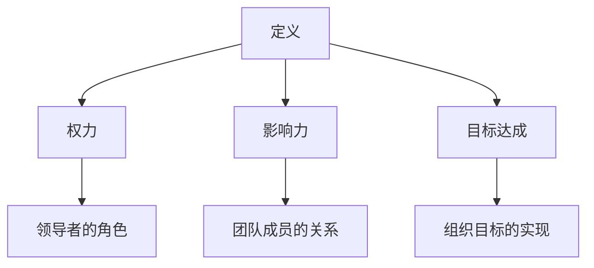

                 

# 《领导力训练：让你的团队战无不胜》

## 关键词
领导力、团队管理、沟通技巧、决策能力、团队建设、变革管理、危机管理

## 摘要
本文旨在探讨领导力在团队管理中的重要性，以及如何通过有效的领导力训练，提升团队的整体执行力与战斗力。文章将从领导力的核心概念、核心能力、实践应用和自我提升四个方面展开，结合实际案例和算法原理，详细解析领导力训练的方法和策略。

## 第一部分：领导力的核心概念

### 第1章：领导力的重要性

#### 1.1 领导力的定义
领导力是一种激励和引导他人达成共同目标的能力。它不仅仅关乎权力的分配，更涉及到影响力的构建、目标的设定和团队的协作。在信息技术快速发展的今天，领导力的重要性愈发凸显，因为一个优秀的领导能够带领团队创新、突破，实现组织的目标。

**Mermaid 流程图：领导力定义与构成**


#### 1.2 领导力的模型
领导力模型有多种，其中权力型、参与型和超级领导是最常见的三种。

- **权力型领导**：依赖职位和权力来影响他人。
- **参与型领导**：鼓励团队成员参与决策，增强团队的凝聚力和创造力。
- **超级领导**：结合权力型和参与型的优点，根据不同情境灵活调整。

**伪代码：领导力模型构建**
```python
def leadership_model(type):
    if type == '权力型':
        return "依赖于职位和权力"
    elif type == '参与型':
        return "鼓励团队成员参与决策"
    elif type == '超级领导':
        return "结合权力型与参与型，灵活调整"
```

## 第二部分：领导力的核心能力

### 第2章：领导力的核心能力

#### 2.1 沟通技巧
沟通技巧是领导力的核心能力之一。有效的沟通能够确保信息的准确传达和理解，减少误解和冲突。

**数学公式：有效沟通的公式**
$$ \text{沟通效果} = \text{信息传达} \times \text{理解接收} $$

**举例说明：有效的沟通技巧案例**
- 在团队会议中，明确表达目标与期望。
- 倾听团队成员的意见与反馈。

#### 2.2 决策能力
决策能力是领导力的关键组成部分。一个优秀的领导者需要具备快速决策和有效执行的能力。

**伪代码：决策能力分析**
```python
def decision_makingituation(context, options, risks):
    best_choice = None
    for option in options:
        risk_analysis = analyze_risks(option, context)
        if risk_analysis['impact'] < risk_threshold:
            best_choice = option
            break
    return best_choice
```

## 第三部分：领导力在实践中的应用

### 第3章：领导力在团队管理中的应用

#### 3.1 团队目标的设定
设定明确的团队目标是团队管理的重要环节。一个清晰的目标能够引导团队成员朝着共同的方向努力。

**目标设定的原则**
1. **具体性**：目标要明确、具体，避免模糊。
2. **可衡量性**：目标要有可量化的指标，便于评估。
3. **可实现性**：目标要具有现实可行性。

**目标设定的流程**
1. **分析现状**：了解团队的现状和需求。
2. **确定目标**：根据现状，设定具体、可衡量和可实现的目标。
3. **沟通与确认**：与团队成员沟通目标，并确认理解一致。

#### 3.2 团队协作
团队协作是领导力的体现，它能够提高团队的效率和创造力。

**团队协作的工具**
- **项目管理工具**：如Trello、JIRA等，帮助团队进行任务分配和进度跟踪。
- **协作平台**：如Slack、Microsoft Teams等，用于沟通和文件共享。

**团队协作的技巧**
1. **明确角色与职责**：每个团队成员都应该清楚自己的角色和职责。
2. **定期沟通**：定期召开会议，确保团队成员之间的信息同步。
3. **鼓励反馈**：鼓励团队成员提出建议和反馈，以不断改进团队协作。

### 第4章：领导力在变革管理中的应用

#### 4.1 变革管理的原理
变革管理是指在组织发生变化时，通过管理手段确保变革顺利进行的过程。

**变革的类型**
- **技术变革**：如引入新的信息系统。
- **组织变革**：如调整组织结构或业务流程。

**变革的过程**
1. **规划**：明确变革的目标、范围和步骤。
2. **准备**：进行变革所需的培训和资源准备。
3. **实施**：按照计划执行变革。
4. **监控与调整**：监控变革的效果，并根据反馈进行调整。

#### 4.2 变革管理的策略
有效的变革管理需要采取一系列策略，以确保变革的成功。

**变革计划的制定**
1. **确定变革领导者**：指定变革负责人，确保变革的推进。
2. **制定变革计划**：包括变革的目标、时间表、资源分配等。
3. **沟通与宣传**：与团队成员沟通变革的原因和益处，争取他们的支持。

**变革执行的策略**
1. **逐步实施**：分阶段进行变革，避免一次性变革造成的影响过大。
2. **激励与奖励**：激励团队成员参与变革，并对变革的成功者给予奖励。
3. **持续监控与反馈**：监控变革的进展，及时调整策略。

#### 4.3 变革管理的挑战与解决
变革管理过程中可能会遇到各种挑战，如抵制变革、沟通不畅等。

**挑战分析**
1. **抵制变革**：团队成员可能因为习惯、恐惧等因素而抵制变革。
2. **沟通不畅**：变革信息传递不畅通，导致团队成员理解不一致。

**解决策略**
1. **增强沟通**：建立有效的沟通机制，确保变革信息的及时传达。
2. **建立信任**：通过透明、开放的沟通建立团队成员之间的信任。
3. **提供培训**：为团队成员提供必要的培训，帮助他们适应变革。

### 第5章：领导力在危机管理中的应用

#### 5.1 危机管理的基本原理
危机管理是指在危机发生时，采取有效的措施来减少危机的影响，并确保组织的持续运作。

**危机的类型**
- **自然灾害**：如地震、洪水等。
- **人为事故**：如数据泄露、系统故障等。

**危机管理的过程**
1. **识别**：及时发现潜在的危机。
2. **评估**：评估危机的影响范围和严重程度。
3. **响应**：采取紧急措施应对危机。
4. **恢复**：在危机结束后，恢复组织的正常运作。

#### 5.2 危机管理的策略
有效的危机管理需要制定一系列策略，以确保在危机发生时能够迅速应对。

**应急预案的制定**
1. **评估风险**：评估组织可能面临的危机类型和风险。
2. **制定预案**：根据评估结果，制定具体的应急预案。
3. **培训与演练**：对团队成员进行应急预案的培训和演练。

**应对策略的选择**
1. **快速响应**：在危机发生时，迅速采取行动。
2. **透明沟通**：与内外部利益相关者保持透明沟通。
3. **持续监控**：在危机结束后，持续监控危机的影响，并根据反馈进行调整。

#### 5.3 危机管理的实践
**案例分析：某公司的数据泄露事件**
- **事件背景**：某公司发生数据泄露事件，客户信息可能受到威胁。
- **应对措施**：
  - **快速响应**：公司立即成立了应急小组，迅速开展调查和应对措施。
  - **透明沟通**：公司通过官网和社交媒体平台，向客户公开事件情况和公司的应对措施。
  - **法律援助**：公司聘请专业律师团队，处理可能产生的法律问题。
- **事件结果**：公司成功遏制了数据泄露的影响，客户信息得到了有效保护。

### 第6章：领导力的自我提升

#### 6.1 自我认知的重要性
自我认知是领导力自我提升的基础。一个优秀的领导者需要清楚地了解自己的优势和劣势。

**自我认知的原理**
- **自我反思**：通过反思自己的行为和决策，发现自身的不足和需要改进的地方。
- **反馈**：通过他人的反馈，了解自己在团队中的表现和影响。

**自我认知的方法**
- **360度反馈**：通过同事、下属和上级的反馈，全面了解自己的领导力表现。
- **心理测评**：通过专业的心理测评工具，了解自己的性格特点和领导力风格。

#### 6.2 自我认知的实践
**自我评估的工具**
- **领导力评估工具**：如MLQ（Multifactor Leadership Questionnaire）等，帮助领导者评估自己的领导力水平。

**自我提升的策略**
- **持续学习**：通过阅读、培训和实践，不断提升自己的知识和技能。
- **角色扮演**：通过角色扮演，模拟领导场景，提高领导力实践能力。

### 第7章：领导力的持续发展

#### 7.1 持续发展的原则
领导力的持续发展需要遵循一系列原则，以确保领导力的不断提升。

**持续发展的理念**
- **终身学习**：领导力不是一成不变的，需要持续学习和适应新的变化。
- **创新思维**：鼓励领导者保持开放和创新的心态，勇于尝试新的方法和思路。

**持续发展的策略**
- **建立学习文化**：在组织中建立学习文化，鼓励团队成员不断学习和成长。
- **提供发展机会**：为领导者提供培训和晋升机会，帮助他们不断提升自己的能力。

#### 7.2 持续发展的实践
**学习与成长**
- **阅读**：定期阅读领导力相关的书籍和文章，了解最新的领导力理论和实践。
- **培训**：参加领导力培训课程，学习先进的领导力工具和方法。

**职业规划**
- **设定目标**：根据个人的兴趣和发展方向，设定明确的职业目标。
- **规划路径**：制定实现目标的路径和计划，包括必要的培训和经验积累。

## 附录：领导力训练工具与方法

### 附录1：领导力测试工具
- **领导力评估工具**：如MLQ（Multifactor Leadership Questionnaire），帮助领导者了解自己的领导力风格和能力。

### 附录2：领导力训练方法
- **培训课程设计**：设计针对性强的领导力培训课程，帮助领导者提升各项能力。
- **案例分享**：通过分享成功的领导力案例，启发和引导领导者思考和实践。

## 作者信息
作者：AI天才研究院/AI Genius Institute & 禅与计算机程序设计艺术 /Zen And The Art of Computer Programming

注意：本文为示例性文章，内容仅供参考。实际文章撰写时，应根据具体要求和实际情况进行调整和补充。文章的字数、结构、细节和深度需要根据实际需求来定制。在撰写过程中，应确保内容的完整性、逻辑性和可读性。在引用公式和算法时，应确保准确无误，并符合学术规范。在实际应用中，领导力训练的具体方法和策略需要根据组织的实际情况和目标进行调整。

