                 


### 引言

在信息技术快速发展的时代，技术专家的角色变得越来越重要。他们凭借深厚的专业知识和技能，推动着技术的进步和创新。然而，随着企业对技术领导力的需求日益增长，许多技术专家面临着从技术专家向管理者转型的挑战。这种转型不仅仅是职位的变化，更是角色、责任和思维方式的一种深刻转变。

本文旨在探讨技术专家如何成功转型为管理者，分析转型过程中可能遇到的问题，并提供一些建议和策略。我们将一步一步地深入探讨这个话题，希望能够为那些渴望在管理领域取得突破的技术专家提供一些有价值的思考。

我们将从以下几个方面展开讨论：

1. **背景介绍**：简要回顾技术专家与管理者的角色定义及其重要性。
2. **核心概念与联系**：深入探讨技术专家转型为管理者所需要掌握的核心概念和原则，并用 Mermaid 流程图展示它们之间的关系。
3. **核心算法原理讲解**：介绍一些管理中的核心算法原理，如项目管理中的关键路径算法，并通过伪代码进行详细阐述。
4. **数学模型和公式**：介绍一些关键的数学模型和公式，如线性规划，并使用 LaTeX 格式进行表示。
5. **项目实战**：通过一个具体的实际项目，展示如何将理论知识应用到实践中，并进行详细讲解。
6. **最佳实践 tips**：总结一些成功转型者的经验，提供实用的建议。
7. **小结**：回顾文章的主要观点，强调转型的重要性，并鼓励技术专家积极面对挑战。

### 背景介绍

在信息技术领域，技术专家通常是那些拥有深厚技术背景、能够解决复杂技术问题的人。他们通常专注于研究、开发和应用新技术，推动公司或组织的技术进步。技术专家的角色不仅包括技术实现，还涉及技术研究和创新，他们常常作为项目的核心成员或领导者，确保技术方案的顺利实施。

然而，随着企业的规模扩大和业务复杂性增加，技术专家需要承担更多的管理职责。管理者不仅要具备深厚的技术知识，还需要具备团队管理、项目管理、决策制定、战略规划等多方面的能力。技术专家向管理者的转型，意味着他们需要从技术实现的细节中抽离出来，更多地关注整个团队或项目的成功。

转型为管理者的重要性体现在以下几个方面：

1. **团队协作**：管理者需要协调不同部门或团队成员的工作，确保项目目标的实现。技术专家转型为管理者后，可以更好地促进团队协作，提高团队的整体效率。

2. **战略规划**：管理者在决策时需要考虑长远利益，制定战略规划。技术专家转型为管理者后，可以将技术视野与战略思考相结合，为企业的发展提供更有力的支持。

3. **领导力培养**：转型为管理者是提升个人领导力的重要途径。通过管理实践，技术专家可以不断学习和成长，提升自己的领导能力和管理素质。

4. **职业发展**：在技术领域达到一定高度后，转型为管理者可以为职业发展提供新的方向和机会。管理者在组织中的地位和影响力通常比技术专家更高，这有助于提升个人的职业成就。

然而，转型并非易事。技术专家在转型过程中可能会遇到一系列挑战，如角色定位不清、管理能力不足、团队冲突等。因此，了解转型的意义和必要性，并提前做好充分的准备，是成功转型的基础。

### 核心概念与联系

在技术专家向管理者的转型过程中，有几个核心概念和原则是不可或缺的。首先，我们需要明确技术专家与管理者的角色定义及其区别。技术专家通常专注于技术研发和实现，而管理者则需要更多地关注团队协作、资源分配、目标制定和执行监控等方面。

接下来，我们可以通过一个 Mermaid 流程图来展示技术专家向管理者转型的主要步骤和关键节点：

```mermaid
graph TD
    A[技术专家] --> B[角色认知]
    B --> C[管理知识学习]
    C --> D[实践应用]
    D --> E[反馈调整]
    E --> F[持续成长]
    A --> G[团队协作]
    G --> H[沟通能力]
    H --> I[领导力培养]
    I --> J[战略思维]
    J --> K[决策制定]
    K --> L[目标实现]
    L --> M[绩效评估]
    M --> N[职业规划]
    N --> O[持续学习]
```



这个流程图清晰地展示了技术专家转型为管理者所需经历的主要阶段和关键能力。接下来，我们详细探讨这些概念和原则：

1. **角色认知**：技术专家首先需要认识到管理者的角色与其过去的技术角色有显著不同。管理者需要具备更广泛的视野和更强的全局意识，他们需要考虑整个团队或项目的成功，而不仅仅是技术细节。

2. **管理知识学习**：技术专家需要通过学习管理知识，如领导力、团队建设、项目管理等，来提升自己的管理能力。这些知识是技术专家转型为管理者的重要基石。

3. **实践应用**：理论学习固然重要，但实际操作同样关键。技术专家需要将所学知识应用到实际工作中，通过实践来提高自己的管理能力。

4. **反馈调整**：在实践中，技术专家需要不断接受反馈，并根据反馈进行相应的调整。这种持续改进的过程有助于他们更好地适应管理者的角色。

5. **持续成长**：转型为管理者不是一次性的任务，而是一个持续的过程。技术专家需要不断学习新知识、新技能，以适应不断变化的工作环境。

6. **团队协作**：管理者需要具备强大的团队协作能力，能够激励团队成员共同为实现目标而努力。

7. **沟通能力**：良好的沟通能力是管理者的必备素质。管理者需要能够清晰地表达自己的想法，同时也要能够倾听团队成员的意见和建议。

8. **领导力培养**：领导力是管理者的重要能力之一。技术专家需要通过实践和反思来不断提升自己的领导力。

9. **战略思维**：管理者需要具备战略思维，能够从整体上考虑组织的发展和目标。

10. **决策制定**：管理者在决策时需要综合考虑各种因素，做出明智的选择。

11. **目标实现**：管理者需要确保团队或项目能够按照既定的目标顺利推进。

12. **绩效评估**：管理者需要定期对团队成员和项目进行绩效评估，以确保目标的实现。

13. **职业规划**：技术专家需要制定清晰的职业规划，为未来的职业发展做好准备。

通过这个流程图，我们可以清晰地看到技术专家向管理者转型的各个步骤及其相互关系。理解这些核心概念和原则，对于技术专家的成功转型至关重要。

### 核心算法原理讲解

在管理过程中，技术专家和管理者会面临各种决策和优化问题。这些问题可以通过一些核心算法原理来求解，例如项目管理中的关键路径算法。关键路径算法可以帮助管理者确定项目中任务的最短完成时间，从而合理安排资源和时间，确保项目按时完成。

关键路径算法的基本原理如下：

1. **定义任务与依赖关系**：首先，我们需要定义项目中的所有任务及其依赖关系。每个任务可以表示为一个节点，节点之间的依赖关系可以用边来表示。

2. **计算最短路径**：接下来，我们需要计算每个节点的最短路径，即从项目的开始到每个节点的最短时间。这可以通过深度优先搜索（DFS）算法来实现。

3. **找出关键路径**：最后，我们需要找出所有节点的最短路径中的最长路径，这条路径即为关键路径。关键路径上的所有任务必须按顺序完成，否则项目将无法按时完成。

以下是关键路径算法的伪代码：

```plaintext
算法：关键路径算法
输入：任务集合 T，任务之间的依赖关系 D
输出：关键路径 CP

初始化：
    时间戳 ts = 0
    节点时间表 timeTable = 空的地图

计算最短路径：
    对于每个任务 t ∈ T：
        timeTable[t].minTime = ∞
        timeTable[t].ts = ts

递归计算最短路径（DFS）：
    对于每个任务 t ∈ T：
        如果 t 没有父节点：
            dfs(t)

函数 dfs(node)：
    如果 node 没有子节点：
        返回
    对于每个子节点 child ∈ node 的子节点：
        dfs(child)
        如果 child 的最短路径时间大于 node 的当前最短路径时间：
            node 的当前最短路径时间 = child 的最短路径时间 + node 与 child 的持续时间

找出关键路径：
    keyPath = 空的列表
    maxTime = 0
    对于每个任务 t ∈ T：
        如果 timeTable[t].minTime > maxTime：
            maxTime = timeTable[t].minTime
            keyPath = t

返回 keyPath
```

通过这个伪代码，我们可以看到关键路径算法的基本框架。在实际应用中，管理者需要根据具体项目的任务和依赖关系，调整算法的输入参数，以便找出项目的关键路径。

### 数学模型和公式

在管理过程中，数学模型和公式可以帮助管理者更好地理解和优化各种管理决策。以下是一些常见的数学模型和公式，以及它们的详细解释和举例说明。

#### 线性规划

线性规划是一种数学优化方法，用于在给定线性约束条件下，最大化或最小化线性目标函数。线性规划的一般形式如下：

$$
\text{maximize} \quad c^T x \\
\text{subject to} \quad Ax \leq b
$$

其中，$c$ 是目标函数的系数向量，$x$ 是决策变量向量，$A$ 是约束条件的系数矩阵，$b$ 是约束条件的常数向量。

**举例说明**：

假设一个公司的生产线需要生产两种产品 A 和 B，每种产品都有不同的利润和生产时间。公司希望在给定的生产时间内，最大化总利润。约束条件如下：

$$
\begin{cases}
2x_1 + 3x_2 \leq 24 \\
x_1 + 2x_2 \leq 18 \\
x_1, x_2 \geq 0
\end{cases}
$$

目标函数为最大化总利润：

$$
\text{maximize} \quad 3x_1 + 2x_2
$$

通过解这个线性规划问题，公司可以确定生产 A 和 B 的最优数量，以实现最大利润。

#### 时间序列分析

时间序列分析用于研究时间序列数据中的趋势、周期性和随机性。常见的时间序列分析方法包括移动平均法、指数平滑法等。

**移动平均法**：

$$
\bar{x}_n = \frac{1}{N} \sum_{i=1}^{N} x_i
$$

其中，$N$ 是移动平均的周期，$x_i$ 是第 $i$ 个时间点的数据。

**举例说明**：

假设一个公司每天记录其销售额，希望使用移动平均法预测未来三天的销售额。给定最近一周的销售额数据如下：

$$
\{x_1, x_2, x_3, x_4, x_5, x_6\} = \{100, 110, 105, 115, 120, 108\}
$$

使用 3 天的移动平均法，我们可以计算未来三天的预测销售额：

$$
\bar{x}_{4} = \frac{1}{3} \sum_{i=1}^{3} x_i = \frac{1}{3} (100 + 110 + 105) = 108
$$

$$
\bar{x}_{5} = \frac{1}{3} \sum_{i=2}^{4} x_i = \frac{1}{3} (110 + 105 + 115) = 109
$$

$$
\bar{x}_{6} = \frac{1}{3} \sum_{i=3}^{5} x_i = \frac{1}{3} (105 + 115 + 120) = 111
$$

#### 决策树分析

决策树是一种直观的决策分析方法，通过一系列分支节点来表示不同决策路径和结果。

**举例说明**：

假设一个公司需要决定是否投资一个新的项目。根据市场情况和公司资源，决策树如下：

```
决策节点：投资新项目
    ├── 是
    │   ├── 市场好
    │   │   └── 投资回报率高
    │   └── 市场差
    │       └── 投资回报率低
    └── 否
        └── 维持现状
```

通过这个决策树，公司可以根据当前的市场状况和资源情况，选择最优的决策路径。

### 项目实战

为了更好地理解管理知识在实际中的应用，我们将通过一个实际项目来展示如何将管理理论转化为具体操作。本项目是一个简单的软件开发项目，目标是开发一个在线购物平台。以下是项目的具体实施步骤和详细讲解。

#### 项目环境搭建

1. **开发环境配置**：在本地计算机上安装以下开发工具和软件：
   - Python 3.8
   - MySQL 8.0
   - Django 3.2
   - Postman

2. **数据库设计**：设计用户表、商品表和订单表，并在 MySQL 中创建相应的数据库和表。

   ```sql
   CREATE DATABASE online_shop;
   USE online_shop;

   CREATE TABLE users (
       id INT AUTO_INCREMENT PRIMARY KEY,
       username VARCHAR(255) NOT NULL,
       password VARCHAR(255) NOT NULL,
       email VARCHAR(255) NOT NULL
   );

   CREATE TABLE products (
       id INT AUTO_INCREMENT PRIMARY KEY,
       name VARCHAR(255) NOT NULL,
       description TEXT,
       price DECIMAL(10, 2) NOT NULL,
       stock INT NOT NULL
   );

   CREATE TABLE orders (
       id INT AUTO_INCREMENT PRIMARY KEY,
       user_id INT NOT NULL,
       product_id INT NOT NULL,
       quantity INT NOT NULL,
       total_price DECIMAL(10, 2) NOT NULL,
       order_date DATETIME NOT NULL,
       FOREIGN KEY (user_id) REFERENCES users(id),
       FOREIGN KEY (product_id) REFERENCES products(id)
   );
   ```

3. **项目结构设计**：创建 Django 项目的目录结构，包括应用程序目录、配置文件、静态文件目录等。

   ```
   online_shop/
   ├── manage.py
   ├── online_shop/
   │   ├── apps/
   │   │   ├── accounts/
   │   │   │   ├── migrations/
   │   │   │   ├── admin.py
   │   │   │   ├── apps.py
   │   │   │   ├── models.py
   │   │   │   ├── tests.py
   │   │   │   ├── views.py
   │   │   ├── products/
   │   │   │   ├── migrations/
   │   │   │   ├── admin.py
   │   │   │   ├── apps.py
   │   │   │   ├── models.py
   │   │   │   ├── tests.py
   │   │   │   ├── views.py
   │   │   └── orders/
   │   │       ├── migrations/
   │   │       ├── admin.py
   │   │       ├── apps.py
   │   │       ├── models.py
   │   │       ├── tests.py
   │   │       ├── views.py
   │   ├── settings.py
   │   ├── urls.py
   │   └── wsgi.py
   ├── static/
   ├── templates/
   ```

4. **安装 Django 应用程序**：在 manage.py 文件中安装应用程序，并运行迁移命令创建数据库表。

   ```shell
   python manage.py startapp accounts
   python manage.py startapp products
   python manage.py startapp orders
   python manage.py makemigrations
   python manage.py migrate
   ```

#### 源代码实现

1. **用户注册与登录**：在 accounts 应用程序中实现用户注册和登录功能。

   ```python
   # accounts/views.py

   from django.shortcuts import render, redirect
   from django.contrib.auth import authenticate, login
   from .forms import UserRegistrationForm, UserLoginForm

   def register(request):
       if request.method == 'POST':
           form = UserRegistrationForm(request.POST)
           if form.is_valid():
               user = form.save()
               login(request, user)
               return redirect('home')
       else:
           form = UserRegistrationForm()
       return render(request, 'register.html', {'form': form})

   def login(request):
       if request.method == 'POST':
           form = UserLoginForm(data=request.POST)
           if form.is_valid():
               user = authenticate(username=form.cleaned_data['username'], password=form.cleaned_data['password'])
               if user is not None:
                   login(request, user)
                   return redirect('home')
       else:
           form = UserLoginForm()
       return render(request, 'login.html', {'form': form})
   ```

2. **商品展示与搜索**：在 products 应用程序中实现商品展示和搜索功能。

   ```python
   # products/views.py

   from django.shortcuts import render
   from .models import Product

   def product_list(request):
       products = Product.objects.all()
       return render(request, 'product_list.html', {'products': products})

   def search_products(request):
       query = request.GET.get('q')
       products = Product.objects.filter(name__icontains=query)
       return render(request, 'search_products.html', {'products': products})
   ```

3. **购物车与订单处理**：在 orders 应用程序中实现购物车和订单处理功能。

   ```python
   # orders/views.py

   from django.shortcuts import render, redirect
   from .models import Order
   from django.contrib.auth.models import User

   def add_to_cart(request, product_id):
       user = User.objects.get(username=request.user.username)
       product = Product.objects.get(id=product_id)
       order, created = Order.objects.get_or_create(user=user, product=product)
       if not created:
           order.quantity += 1
       order.save()
       return redirect('cart')

   def cart(request):
       orders = Order.objects.filter(user=request.user)
       return render(request, 'cart.html', {'orders': orders})

   def checkout(request):
       orders = Order.objects.filter(user=request.user)
       total_price = sum(order.quantity * order.product.price for order in orders)
       return render(request, 'checkout.html', {'orders': orders, 'total_price': total_price})

   def place_order(request):
       orders = Order.objects.filter(user=request.user)
       total_price = sum(order.quantity * order.product.price for order in orders)
       order = Order(user=request.user, total_price=total_price)
       order.save()
       for order in orders:
           order.delete()
       return redirect('order_placed')
   ```

#### 代码解读与分析

1. **用户注册与登录**：用户注册与登录功能是网站的基本功能。在注册页面，用户可以填写用户名、密码和邮箱等信息。注册成功后，用户会被自动登录到系统中。登录页面允许用户输入用户名和密码，通过验证后可以进入系统。

2. **商品展示与搜索**：商品展示页面列出所有商品，用户可以通过浏览页面来查看商品信息。搜索功能允许用户输入关键词，系统会根据关键词搜索出相关的商品，并将结果展示在搜索结果页面。

3. **购物车与订单处理**：购物车功能允许用户将商品添加到购物车，用户可以在购物车中查看和管理已添加的商品。订单处理功能实现用户结算购物车中的商品，生成订单并保存到数据库中。

#### 实际案例分析与详细讲解剖析

1. **用户注册与登录**：在实际项目中，用户注册与登录功能需要考虑安全性问题。例如，用户密码需要进行加密存储，防止泄露。我们使用了 Django 中的 `authenticate` 函数来验证用户身份，并使用 `login` 函数来将用户登录到系统中。

2. **商品展示与搜索**：在实际项目中，商品展示和搜索功能需要实现高效的数据查询。我们使用了 Django ORM 来进行数据库查询，这样可以充分利用数据库的索引功能，提高查询效率。

3. **购物车与订单处理**：在实际项目中，购物车功能需要考虑用户界面的友好性。我们设计了一个简洁明了的购物车界面，用户可以方便地添加、删除和管理商品。订单处理功能需要确保订单数据的准确性，我们在订单生成过程中进行了多次数据验证，确保订单数据的正确性。

#### 项目小结

通过这个实际项目，我们展示了如何将管理理论应用到软件开发项目中。在项目中，我们使用了 Django 框架来快速搭建网站，并实现了用户注册、登录、商品展示、搜索、购物车和订单处理等功能。通过这个项目，我们可以看到管理理论在实际中的应用，以及如何通过合理的管理来提高项目的效率和质量。

### 最佳实践 tips

在技术专家向管理者的转型过程中，一些成功者的经验可以帮助我们更好地应对挑战。以下是一些实用的建议：

1. **提前准备**：在转型之前，提前学习管理相关的知识和技能，如领导力、团队建设、项目管理等。通过阅读相关书籍、参加培训课程或实践，提升自己的管理能力。

2. **建立人脉**：积极建立和管理人际关系网络，与不同领域的专家建立联系。这不仅有助于获取宝贵的经验和资源，还可以在转型过程中得到支持和帮助。

3. **积极沟通**：作为管理者，沟通能力至关重要。学会有效沟通，包括倾听、表达和协调，可以帮助你更好地管理团队和解决冲突。

4. **持续学习**：管理领域不断变化，持续学习是保持竞争力的关键。通过参加研讨会、阅读专业书籍和文献，不断更新自己的知识和技能。

5. **设定目标**：明确自己的职业目标，制定可行的计划，并坚持执行。目标可以为你提供方向和动力，帮助你克服转型过程中的困难。

6. **寻求反馈**：定期向团队成员和上级寻求反馈，了解自己的管理表现，并根据反馈进行调整。这种反馈机制有助于你不断改进和提升自己的管理能力。

### 小结

技术专家向管理者的转型是一项复杂且具有挑战性的任务，但也是一个充满机遇的过程。通过本文的探讨，我们了解了转型的重要性、核心概念与联系、管理中的核心算法原理、数学模型和公式，并通过实际项目展示了管理理论的应用。我们鼓励技术专家们积极面对转型中的挑战，充分利用最佳实践经验，不断学习和成长。

在信息技术飞速发展的时代，技术专家们的领导力和管理能力将决定企业的发展和竞争力。我们希望本文能够为那些渴望在管理领域取得突破的技术专家提供一些有价值的思考和指导。无论你是刚刚开始转型，还是在转型过程中遇到困难，都请相信自己的潜力，勇敢面对挑战，你一定能够成功转型，成为一名出色的管理者。

### 参考文献

1. Tom DeMarco & Timothy Lister. 《软件工艺：程序员的整体性艺术》（Peopleware: Productive Projects and Teams）. Microsoft Press, 1989.

2. Peopleware: Productive Projects and Teams, by Tom DeMarco and Timothy Lister. ISBN 978-1-55860-770-9.

3. Wikipedia. “Project Management.” [Online; accessed 2023]. https://en.wikipedia.org/wiki/Project_management.

4. Wikipedia. “Critical Path Method.” [Online; accessed 2023]. https://en.wikipedia.org/wiki/Critical_path_method.

5. Wikipedia. “Linear Programming.” [Online; accessed 2023]. https://en.wikipedia.org/wiki/Linear_programming.

6. Wikipedia. “Moving Average.” [Online; accessed 2023]. https://en.wikipedia.org/wiki/Moving_average.

7. Wikipedia. “Decision Tree.” [Online; accessed 2023]. https://en.wikipedia.org/wiki/Decision_tree.

8. Agile Management: Creating Competitive Business Strategies. David J. Anderson. Wiley-IEEE Press, 2010.

9. “Scrum Guide.” [Online; accessed 2023]. https://www.scrum.org/resources/scrum-guide.

### 附录

以下是一些与本文主题相关的扩展阅读资源：

1. “管理大师彼得·德鲁克的经典著作：《管理的实践》（The Practice of Management）.”  
   - 地址：https://www.dreicer.com/book/the-practice-of-management/

2. “詹姆斯·M·基尼的《敏捷管理：打造高效团队的五种实践》（Agile Management: Creating Competitive Business Strategies）.”  
   - 地址：https://www.amazon.com/Agile-Management-Strategies-Business-Competitive/dp/0470177392

3. “《项目管理的实践指南》（A Guide to the Project Management Body of Knowledge》第六版（PMBOK® Guide）.”  
   - 地址：https://www.pmi.org/book/pmbok-guide

4. “《敏捷项目管理》（Agile Project Management: Creating Competitive Products）》.”  
   - 地址：https://www.amazon.com/Agile-Project-Management-Creating-Competitive/dp/0321278456

### 致谢

在此，我要感谢所有为本文提供宝贵意见和建议的人。特别感谢我的同事和朋友们，他们在本文的撰写过程中给予了无私的帮助和支持。没有你们的鼓励和支持，我无法完成这篇文章。感谢 AI 天才研究院的团队成员，感谢你们在研究和开发中的辛勤工作和贡献。同时，我也要感谢《禅与计算机程序设计艺术》的作者，他的智慧启发了我对技术和管理交叉领域的思考。

作者：AI 天才研究院/AI Genius Institute & 禅与计算机程序设计艺术 /Zen And The Art of Computer Programming

