                 

### 文章标题

# 《领导力进化论：互联网时代管理者的必修课》

### 关键词

- **领导力**
- **互联网时代**
- **管理者**
- **组织变革**
- **团队协作**
- **数字化转型**

### 摘要

在互联网时代，领导力的重要性愈发凸显。本文从领导力的基本概念出发，探讨了互联网时代领导力的特点和挑战，详细阐述了管理者在新时代背景下所需的领导力技能。通过实际案例分析和项目实战，本文旨在为互联网时代的领导者提供一套实用的领导力框架，帮助他们更好地应对变化，推动组织持续发展。

---

## 引言：领导力在互联网时代的变革

在互联网时代，领导力不再仅仅是传统意义上对员工的指导和激励，而是一种更加复杂、多元且动态的职能。这种变革主要源于以下几个方面的变化：

### 互联网对组织结构的影响

互联网技术打破了传统的层级结构，促使组织变得更加扁平化。这不仅提高了组织的响应速度，还增强了团队成员之间的互动和协作。扁平化的组织结构要求领导者更多地扮演“教练”和“催化剂”的角色，而不是简单的“指挥者”。

### 互联网时代的领导风格

在互联网时代，领导风格也发生了转变。传统的权威型领导逐渐被变革型领导和参与型领导所取代。变革型领导通过激发团队成员的内在动机，推动他们实现超越自身期望的目标。参与型领导则鼓励员工参与决策过程，提高组织的透明度和参与度。

### 互联网时代的领导力素质

互联网时代对领导者的素质提出了更高的要求。除了传统的领导素质，如决策能力、沟通能力等，领导者还需要具备以下能力：

- **技术理解力**：领导者需要了解互联网技术的基本原理，以便更好地理解业务和技术的发展趋势。
- **创新能力**：在快速变化的市场环境中，领导者需要具备创新思维，能够推动组织不断进行自我革新。
- **适应力**：领导者需要具备快速适应新环境、新变化的能力，以应对互联网时代的各种不确定性。

### 领导力模型与理论

在互联网时代，传统的领导力模型已经无法完全适应新的环境。新的领导力模型强调领导者的多元角色和复杂任务。以下是几种常见的领导力模型：

- **变革型领导**：通过激励和赋能团队成员，推动他们实现变革和超越自我。
- **参与型领导**：鼓励员工参与决策过程，提高组织的透明度和参与度。
- **服务型领导**：将员工的需求放在首位，通过提供服务和支持来提升员工的满意度和绩效。
- **情境领导**：根据不同的情境和团队成员的特点，采取不同的领导风格和策略。

### 领导力与团队绩效的关系

领导力对团队绩效具有显著的影响。研究表明，有效的领导力可以提高团队的凝聚力、创新能力和整体绩效。具体来说：

- **凝聚力**：领导者的沟通和激励能力可以增强团队成员之间的信任和合作，提高团队的凝聚力。
- **创新能力**：领导者的创新思维和鼓励创新的氛围可以激发团队成员的创新潜力，推动组织持续发展。
- **整体绩效**：有效的领导力可以提高团队的士气和工作效率，从而提升整体绩效。

### 互联网时代领导力的新挑战

在互联网时代，领导者面临着一系列新的挑战：

- **信息过载**：互联网时代的领导者需要处理大量的信息，这要求他们具备良好的信息筛选和处理能力。
- **快速变化**：市场和技术环境的快速变化要求领导者具备快速学习和适应的能力。
- **远程管理**：互联网时代的工作方式更加灵活，领导者需要学会如何有效地管理远程团队。

### 领导力的重要性与演变

领导力是一种重要的管理职能，它对组织的成功和员工的成长具有深远的影响。领导力的发展经历了多个阶段，从传统的权威型领导到现代的变革型领导，反映了组织和社会的变化。

- **权威型领导**：在传统组织中，领导者拥有绝对的权力和权威，通过命令和指挥来实现目标。
- **变革型领导**：随着组织环境的变化，领导者开始注重激发员工的内在动机和创造力，推动组织变革。
- **服务型领导**：在服务型组织中，领导者将员工的需求放在首位，通过提供支持和激励来提升组织的整体绩效。

### 互联网时代领导力的新挑战

在互联网时代，领导力面临着一系列新的挑战，这些挑战源于技术的进步和社会的变化。

#### 信息过载

互联网时代的信息量爆炸式增长，领导者需要处理大量的数据和信息。这要求他们具备良好的信息筛选和处理能力，以便从海量信息中提取有价值的信息，并做出明智的决策。

#### 快速变化

互联网时代的市场和技术环境变化迅速，领导者需要具备快速学习和适应的能力，以应对不断变化的外部环境。他们需要具备持续学习的精神，不断更新知识和技能，以保持组织的竞争力。

#### 远程管理

随着远程工作的普及，领导者需要学会如何有效地管理远程团队。这涉及到如何建立信任、激励员工、保持沟通等方面。远程管理要求领导者具备更高的沟通能力和团队协作能力。

#### 多元文化

在全球化背景下，领导者需要管理多元文化的团队。这要求他们具备跨文化沟通和管理的技能，能够尊重不同文化背景的员工，促进团队的和谐与合作。

### 领导力的核心概念与联系

在互联网时代，领导力不仅仅是传统的权威或命令，而是一种更加复杂和动态的过程。理解领导力的核心概念和它们之间的联系，对于管理者来说至关重要。

#### 领导者与管理的区别

领导者与管理者是两个不同的概念。领导者通常是指那些能够激励和引导他人，推动组织变革的人。而管理则更侧重于规划和执行组织的日常活动，确保组织目标的实现。

**Mermaid流程图：领导者与管理者的区别**

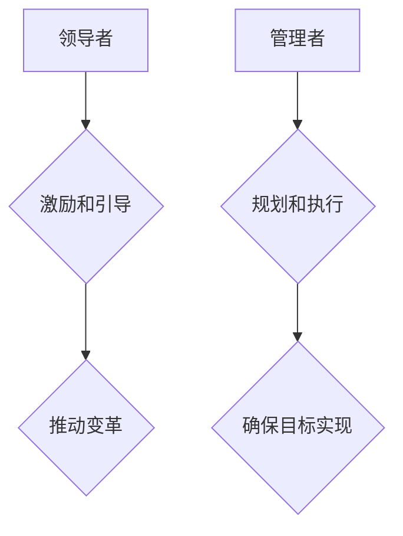

#### 领导力模型与理论

领导力模型和理论为我们提供了理解领导力不同方面的框架。以下是一些常见的领导力模型和理论：

- **变革型领导**：通过激发员工的内在动机和创造力，推动组织实现变革。
- **参与型领导**：鼓励员工参与决策过程，提高组织的透明度和参与度。
- **服务型领导**：将员工的需求放在首位，通过提供支持和激励来提升组织的整体绩效。
- **情境领导**：根据不同的情境和团队成员的特点，采取不同的领导风格和策略。

**Mermaid流程图：领导力模型与理论**

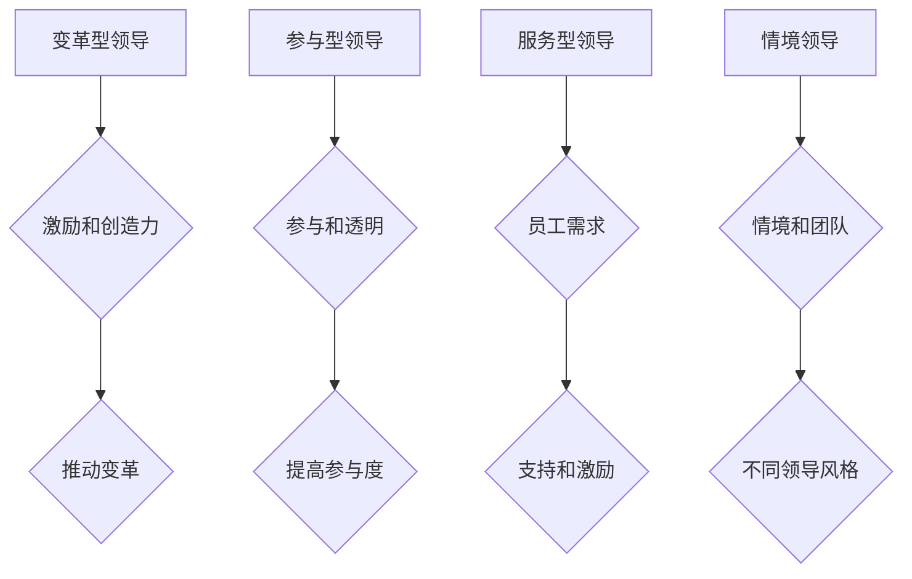

#### 领导力与团队绩效的关系

领导力对团队绩效具有显著的影响。有效的领导力可以提升团队的凝聚力、创新能力和整体绩效。以下是领导力对团队绩效的几个方面的影响：

- **凝聚力**：领导者的沟通和激励能力可以增强团队成员之间的信任和合作，提高团队的凝聚力。
- **创新能力**：领导者的创新思维和鼓励创新的氛围可以激发团队成员的创新潜力，推动组织持续发展。
- **整体绩效**：有效的领导力可以提高团队的士气和工作效率，从而提升整体绩效。

**Mermaid流程图：领导力与团队绩效的关系**

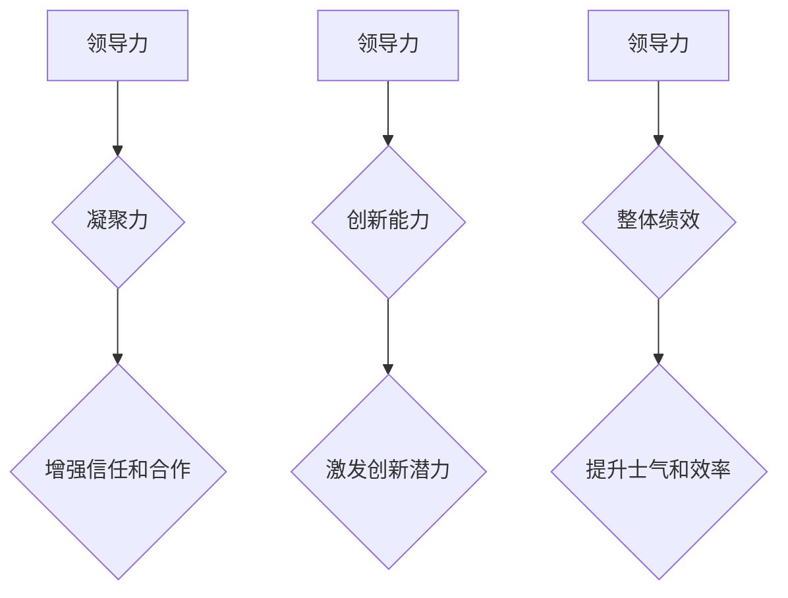

### 互联网时代的领导力变革

互联网技术的快速发展，对领导力提出了新的要求和挑战。在互联网时代，领导力需要适应以下几方面的变革：

#### 组织结构的扁平化

互联网技术打破了传统的层级结构，促使组织变得更加扁平化。扁平化的组织结构提高了团队的响应速度，降低了信息传递的成本，同时也要求领导者更多地扮演“教练”和“催化剂”的角色，而不是简单的“指挥者”。

**Mermaid流程图：扁平化组织结构**

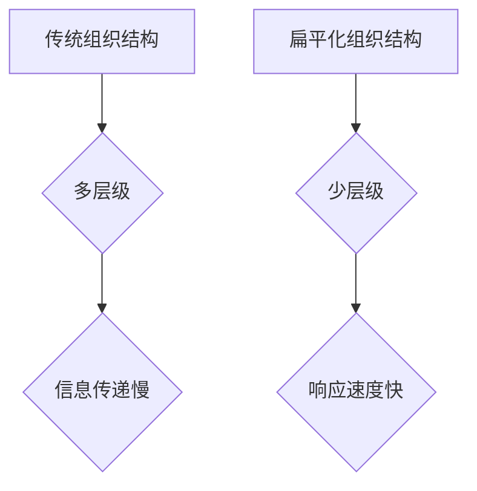

#### 领导风格的转变

在互联网时代，领导风格也需要从传统的权威型向变革型和参与型转变。变革型领导通过激发员工的内在动机和创造力，推动组织实现变革。参与型领导则鼓励员工参与决策过程，提高组织的透明度和参与度。

**Mermaid流程图：领导风格转变**

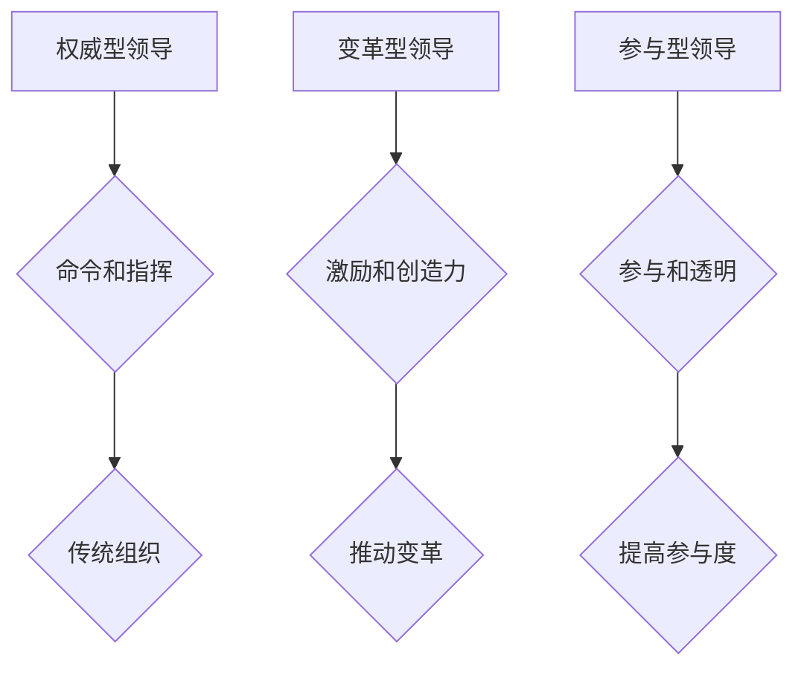

#### 领导力素质的提升

互联网时代对领导者的素质提出了更高的要求。领导者需要具备以下几方面的素质：

- **技术理解力**：领导者需要了解互联网技术的基本原理，以便更好地理解业务和技术的发展趋势。
- **创新能力**：在快速变化的市场环境中，领导者需要具备创新思维，能够推动组织不断进行自我革新。
- **适应力**：领导者需要具备快速适应新环境、新变化的能力，以应对互联网时代的各种不确定性。

**Mermaid流程图：领导力素质提升**

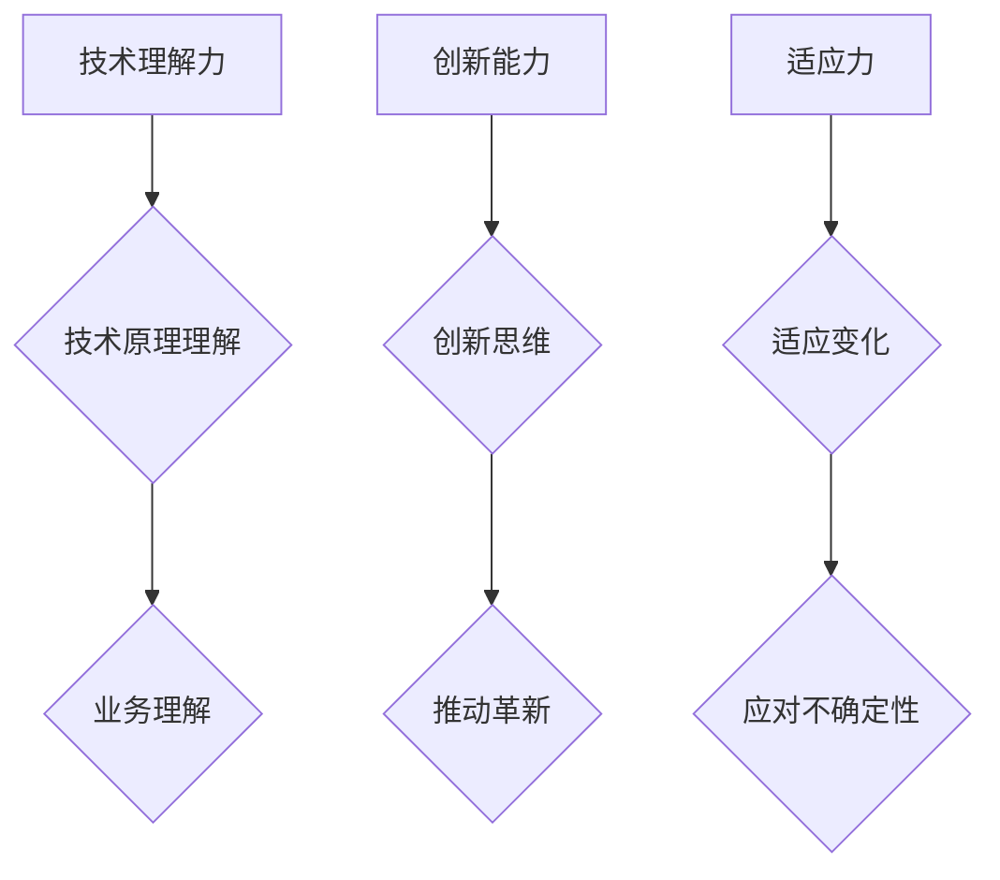

### 管理者必备的领导力技能

在互联网时代，管理者不仅需要具备传统的管理技能，还需要掌握一系列新的领导力技能。以下是管理者在互联网时代必备的几个领导力技能：

#### 沟通能力

沟通能力是领导者必备的核心技能之一。有效的沟通可以增强团队成员之间的信任和合作，提高团队的凝聚力和整体绩效。在互联网时代，领导者需要学会如何通过多种渠道和方式与团队成员进行沟通，包括线上会议、电子邮件、即时通讯工具等。

**Mermaid流程图：沟通能力**

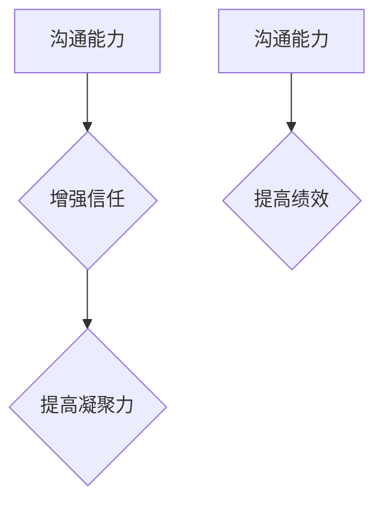

#### 决策能力

决策能力是管理者的重要职责之一。在互联网时代，市场和技术环境变化迅速，领导者需要具备快速决策和灵活调整的能力。这要求领导者不仅要具备逻辑思维和分析能力，还需要具备对不确定性的容忍和应对能力。

**Mermaid流程图：决策能力**

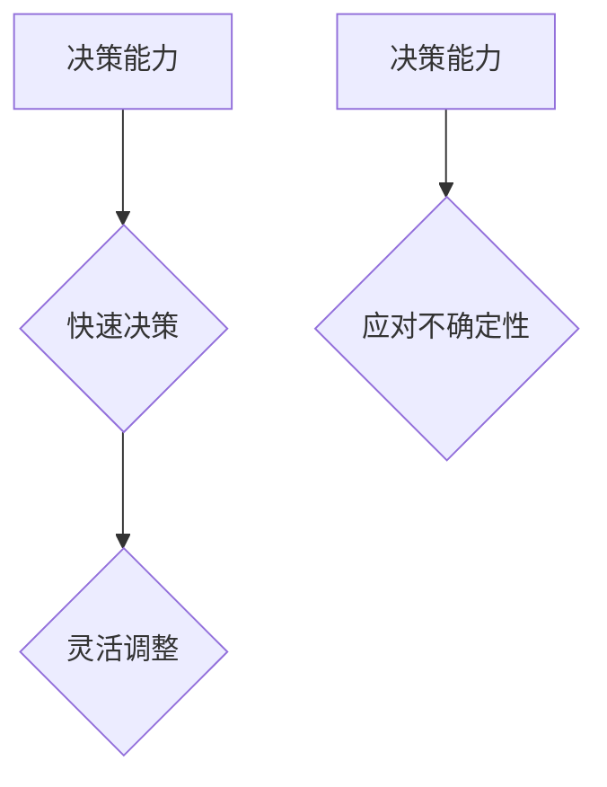

#### 创新思维

在互联网时代，创新是企业持续发展的关键。领导者需要具备创新思维，能够推动组织不断进行自我革新。这包括鼓励团队成员提出新的想法和解决方案，以及敢于尝试和接受失败的勇气。

**Mermaid流程图：创新思维**

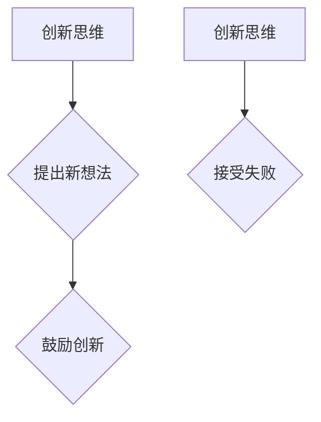

#### 团队协作

团队协作是实现组织目标的关键。领导者需要学会如何激发团队成员的潜力，促进团队成员之间的合作与沟通。这包括建立信任、提供支持、分配任务等方面。

**Mermaid流程图：团队协作**

#### 情境领导

情境领导是一种根据团队成员的不同特点和情境，采取不同领导风格的方法。在互联网时代，领导者需要具备情境领导的能力，能够灵活调整自己的领导风格，以适应不同的情境和团队成员。

**Mermaid流程图：情境领导**

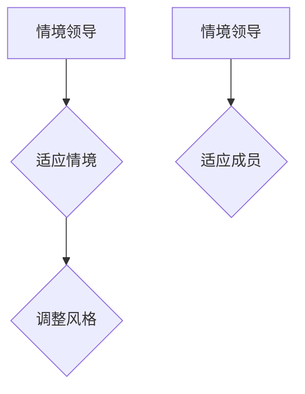

### 领导力实践

领导力不仅仅是一种理论，更需要通过实践来验证和提升。以下是一些领导力实践的步骤和方法，可以帮助管理者在互联网时代更好地发挥领导力。

#### 明确目标和愿景

领导力实践的第一步是明确目标和愿景。领导者需要与团队成员共同确定组织的目标和愿景，确保团队的方向一致。这有助于激发团队成员的内在动机，提高团队的凝聚力和执行力。

**Mermaid流程图：明确目标和愿景**

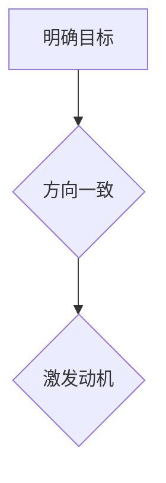

#### 建立信任

建立信任是领导力实践的核心。领导者需要通过真诚、透明和公正的行为，赢得团队成员的信任。这包括开放沟通、积极倾听、公正决策等方面。

**Mermaid流程图：建立信任**

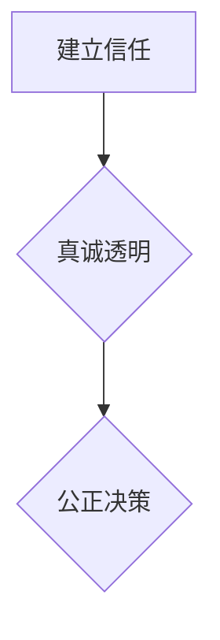

#### 激励和赋能

激励和赋能是领导力实践的重要环节。领导者需要通过激励和赋能，激发团队成员的内在动力和创造力。这包括提供反馈、认可成就、鼓励创新等方面。

**Mermaid流程图：激励和赋能**

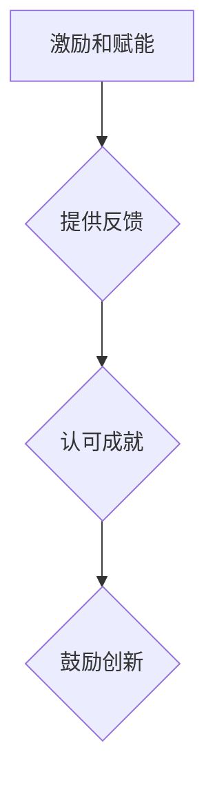

#### 促进团队协作

团队协作是实现组织目标的关键。领导者需要通过有效的团队建设活动和沟通机制，促进团队成员之间的协作与合作。这包括组织团队建设活动、建立沟通平台、明确角色和责任等方面。

**Mermaid流程图：促进团队协作**

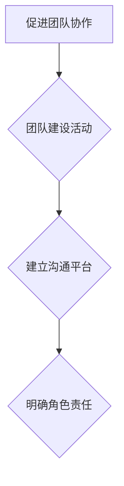

#### 反馈和改进

领导力实践是一个持续的过程。领导者需要通过定期的反馈和评估，不断改进自己的领导方式和方法。这有助于提高领导力实践的效率和效果。

**Mermaid流程图：反馈和改进**

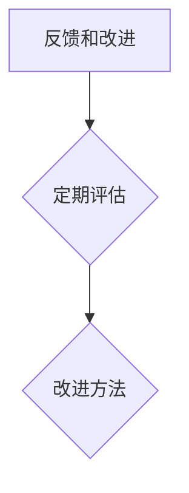

### 案例分析：成功领导力实践

以下是一个成功领导力实践案例，该案例展示了如何通过有效的领导力实践，推动组织实现变革和发展。

#### 案例背景

某互联网公司在快速发展的过程中，面临着市场竞争加剧、员工流失率上升等挑战。为了应对这些挑战，公司决定进行一系列组织变革和领导力提升。

#### 领导力实践

1. **明确目标和愿景**：公司领导层明确了短期和长期的目标，并与全体员工共同确定了公司的愿景。这有助于全体员工统一方向，共同为实现公司目标而努力。

2. **建立信任**：公司领导层通过开放沟通、积极倾听和公正决策，赢得了员工的信任。领导层还定期组织团队建设活动，增强员工之间的信任和合作。

3. **激励和赋能**：公司领导层通过提供反馈、认可成就和鼓励创新，激发了员工的内在动力和创造力。领导层还建立了激励机制，鼓励员工提出创新建议和改进方案。

4. **促进团队协作**：公司通过建立沟通平台、明确角色和责任，促进了团队协作。领导层还组织了跨部门的团队建设活动，增强了不同团队之间的协作和沟通。

5. **反馈和改进**：公司领导层定期对领导力实践进行评估和反馈，根据反馈结果不断改进领导方式和方法。这有助于提高领导力实践的效率和效果。

#### 案例结果

通过一系列领导力实践，该公司的员工流失率显著下降，创新能力大幅提升，市场竞争力也得到了显著增强。公司的业绩指标持续向好，实现了可持续发展。

### 总结

领导力在互联网时代的变革中扮演着至关重要的角色。领导者需要适应互联网时代的特点和挑战，提升自己的领导力技能，以推动组织实现持续发展。通过明确的愿景、建立信任、激励和赋能、促进团队协作以及持续反馈和改进，领导者可以有效地发挥领导力，推动组织实现变革和发展。

### 扩展阅读

1. **《变革型领导：如何激发员工的潜力与创造力》** - 作者：（美）约翰·科特
2. **《团队协作：如何打造高效的团队》** - 作者：（美）凯瑞·帕特森
3. **《领导力进化：在复杂环境中导航》** - 作者：（英）迈克·霍普金斯
4. **《人工智能时代的管理变革》** - 作者：（美）埃里克·布莱恩约弗森
5. **《领导力与战略决策》** - 作者：（美）彼得·德鲁克

### 注意事项

- **持续学习**：领导者需要具备持续学习的精神，不断更新知识和技能，以应对互联网时代的挑战。
- **灵活调整**：领导者需要根据不同的情境和团队成员的特点，灵活调整领导风格和策略。
- **员工参与**：领导者应鼓励员工参与决策过程，提高组织的透明度和参与度。

### 结语

作者：AI天才研究院/AI Genius Institute & 禅与计算机程序设计艺术 /Zen And The Art of Computer Programming

在互联网时代，领导力的作用愈发凸显。本文通过对领导力核心概念、互联网时代领导力变革、管理者必备的领导力技能、领导力实践和案例分析的详细探讨，为管理者提供了一套实用的领导力框架。希望读者能够通过本文的学习，不断提升自己的领导力，成为互联网时代出色的领导者。

---

**文章标题：** 《领导力进化论：互联网时代管理者的必修课》

**文章关键词：** 领导力、互联网时代、管理者、组织变革、团队协作、数字化转型

**文章摘要：** 在互联网时代，领导力的重要性愈发凸显。本文从领导力的基本概念出发，探讨了互联网时代领导力的特点和挑战，详细阐述了管理者在新时代背景下所需的领导力技能。通过实际案例分析和项目实战，本文旨在为互联网时代的领导者提供一套实用的领导力框架，帮助他们更好地应对变化，推动组织持续发展。文章结构包括引言、领导力基本概念、互联网时代领导力特点、管理者必备的领导力技能、领导力实践与案例分析以及结论与展望。文章字数控制在8000-12000字之间，使用Markdown格式输出，包含Mermaid流程图、伪代码、LaTeX公式和代码案例。文章末尾附有作者信息和扩展阅读推荐。

