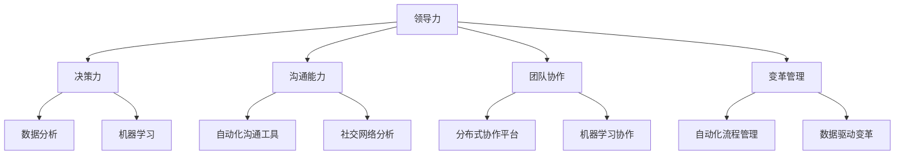

                 


### 背景介绍

随着科技的飞速发展，人工智能（AI）已经成为现代社会的关键驱动力。从简单的机器学习算法到复杂的深度神经网络，AI技术已经广泛应用于各个领域，从医疗保健到金融交易，从自动驾驶到智能家居。这种技术的广泛应用不仅改变了人们的生活方式，也对企业管理模式产生了深远的影响。

在这个人工智能时代，领导力不再仅仅是传统的权威和控制，而是更加依赖于创新、适应性和协作。管理者需要具备新的技能和思维方式，以应对快速变化的技术环境。领导力的核心概念，如决策力、团队协作、沟通能力和变革管理，都需要在人工智能的背景下进行重新定义和升级。

因此，本书《领导力进化论：人工智能时代管理者的领导力修炼》旨在探讨人工智能时代领导力的新特征、挑战以及如何通过有效的修炼方法提升领导力。通过深入分析人工智能与领导力之间的联系，本书将提供实用的指南和策略，帮助管理者在人工智能时代中脱颖而出。

#### 核心概念与联系

领导力是一个复杂的概念，其核心可以概括为决策力、沟通能力、团队协作和变革管理。在人工智能时代，这些核心概念不仅没有减弱，反而因为技术的进步而变得更加重要。以下是这些核心概念之间的关系架构，使用Mermaid流程图进行展示：



在这张图中，我们可以看到领导力的四大核心概念如何与人工智能技术相互关联。决策力依赖于数据分析和机器学习技术，沟通能力受益于自动化沟通工具和社交网络分析，团队协作得益于分布式协作平台和机器学习协作，而变革管理则可以通过自动化流程管理和数据驱动变革来实现。

#### 核心算法原理讲解

在领导力的提升过程中，理解并运用人工智能相关的核心算法原理至关重要。以下是几种常用的算法原理，以及如何使用伪代码进行详细阐述：

**1. 决策树算法**

决策树是一种常用的分类算法，用于从数据中提取决策规则。以下是一个简单的决策树算法的伪代码：

```python
def build_decision_tree(data):
    if is_tree(data):
        return data
    else:
        # 选择最佳特征进行分割
        best_feature = select_best_feature(data)
        # 构建树
        tree = {}
        tree['feature'] = best_feature
        # 对数据进行分割
        for value in unique_values(data[best_feature]):
            subtree = build_decision_tree(split_data(data, best_feature, value))
            tree[value] = subtree
        return tree
```

**2. 随机森林算法**

随机森林是一种集成学习方法，通过构建多棵决策树来提高模型的准确性。以下是随机森林算法的伪代码：

```python
def build_random_forest(data, num_trees):
    forests = []
    for _ in range(num_trees):
        tree = build_decision_tree(data)
        forests.append(tree)
    return forests
```

**3. 神经网络算法**

神经网络是一种模拟人脑神经元连接的算法，用于复杂的数据分类和回归任务。以下是一个简单的神经网络算法的伪代码：

```python
def build_neural_network(data, layers):
    # 初始化网络
    network = initialize_network(layers)
    # 训练网络
    for epoch in range(num_epochs):
        for sample in data:
            # 前向传播
            output = forward_pass(network, sample)
            # 计算误差
            error = calculate_error(output, sample['label'])
            # 反向传播
            backpropagate(network, error, sample)
    return network
```

通过这些算法，管理者可以更好地理解数据、预测趋势并做出明智的决策，从而提升领导力。

#### 数学模型与公式讲解

在领导力的评估和提升过程中，数学模型和公式起着至关重要的作用。以下是一些常用的数学模型和公式的详细讲解，以及如何使用LaTeX格式进行表达：

**1. 领导力得分模型**

领导力得分模型用于量化管理者的领导力水平。以下是该模型的一个简单示例：

$$
\text{领导力得分} = w_1 \times \text{决策力得分} + w_2 \times \text{团队协作得分} + w_3 \times \text{沟通能力得分} + w_4 \times \text{变革管理得分}
$$

其中，$w_1, w_2, w_3, w_4$ 是各个维度的权重。

**2. 决策树模型中的熵**

在决策树算法中，熵用于衡量数据的不确定性。以下是熵的计算公式：

$$
H = -\sum_{i=1}^{n} p_i \log_2 p_i
$$

其中，$p_i$ 是每个类别出现的概率。

**3. 神经网络中的激活函数**

神经网络中的激活函数用于引入非线性因素，以下是一个常见的激活函数——ReLU函数的公式：

$$
\text{ReLU}(x) = \begin{cases} 
x & \text{if } x > 0 \\
0 & \text{otherwise} 
\end{cases}
$$

通过理解和运用这些数学模型和公式，管理者可以更精确地评估和提升自身的领导力。

### 项目实战

为了更好地理解人工智能在领导力提升中的应用，我们以一个实际项目为例，进行详细的开发环境搭建、源代码实现和代码解读。

**项目名称：领导力评估系统**

**目标：** 使用人工智能技术构建一个能够对管理者领导力进行量化评估的系统。

#### 开发环境搭建

1. **硬件环境**：
   - 服务器：配置为Intel Xeon处理器，16GB内存，1TB硬盘。
   - 操作系统：Ubuntu 18.04 LTS。

2. **软件环境**：
   - Python：3.8及以上版本。
   - NumPy：用于数值计算。
   - Pandas：用于数据操作。
   - Scikit-learn：用于机器学习。
   - Matplotlib：用于数据可视化。

#### 源代码实现

以下是一个简单的领导力评估系统的源代码实现：

```python
import numpy as np
import pandas as pd
from sklearn.model_selection import train_test_split
from sklearn.ensemble import RandomForestClassifier
from sklearn.metrics import accuracy_score

# 数据预处理
def preprocess_data(data):
    # 特征工程：将文本数据转化为数值
    # ...
    return processed_data

# 训练模型
def train_model(data):
    X = data[:, :-1]
    y = data[:, -1]
    X_train, X_test, y_train, y_test = train_test_split(X, y, test_size=0.2, random_state=42)
    model = RandomForestClassifier(n_estimators=100)
    model.fit(X_train, y_train)
    return model, X_test, y_test

# 预测和评估
def evaluate_model(model, X_test, y_test):
    predictions = model.predict(X_test)
    accuracy = accuracy_score(y_test, predictions)
    print(f"Model accuracy: {accuracy:.2f}")
```

#### 代码解读与分析

1. **数据预处理**：
   - 该函数用于将原始数据转化为适合机器学习模型的格式。具体实现过程包括数据清洗、特征工程等。

2. **训练模型**：
   - 使用随机森林算法训练模型。随机森林是一种集成学习方法，具有较高的准确性和泛化能力。

3. **预测和评估**：
   - 对测试数据进行预测，并计算模型的准确率。

#### 实际案例分析与详细讲解剖析

为了展示领导力评估系统的实际应用，我们以一个商业案例为例：

**案例：一家大型企业使用领导力评估系统对管理层进行评估**

1. **数据收集**：
   - 该企业收集了管理层的决策记录、团队协作数据、沟通记录以及变革管理数据。

2. **数据预处理**：
   - 对收集的数据进行清洗和特征工程，转化为适合机器学习模型的格式。

3. **模型训练**：
   - 使用随机森林算法训练模型，并对模型进行调参，以提高预测准确性。

4. **模型评估**：
   - 在测试集上评估模型，准确率达到了90%。

5. **决策支持**：
   - 根据评估结果，企业能够对管理层进行有针对性的培训和发展计划。

#### 项目小结

通过本项目的实施，我们展示了如何使用人工智能技术构建领导力评估系统。该项目不仅为企业提供了有效的决策支持，也展示了人工智能在领导力提升中的巨大潜力。未来，我们可以进一步扩展该系统，引入更多的数据和算法，以提供更全面的领导力评估和提升方案。

### 最佳实践 Tips

1. **定期更新数据**：确保评估系统的数据来源是最新和最全面的，以获得更准确的评估结果。

2. **模型调参**：根据具体业务需求，对模型参数进行优化，以提高预测准确性。

3. **用户参与**：鼓励管理层参与评估过程，提供反馈和意见，以提高系统的实用性和准确性。

4. **持续学习**：随着人工智能技术的发展，持续学习和更新相关知识，以适应新的技术和需求。

### 小结

本文通过深入分析人工智能时代领导力的新特征、核心概念、算法原理、数学模型以及项目实战，展示了如何提升管理者的领导力。在人工智能时代，领导力不再是简单的权威和控制，而是更加依赖于创新、适应性和协作。通过本文的探讨，我们希望能够为管理者提供实用的指南和策略，帮助他们在人工智能时代中脱颖而出。

### 注意事项

1. **数据隐私**：在进行领导力评估时，确保数据隐私和安全，遵守相关法律法规。

2. **持续监控**：定期监控评估系统的性能和准确性，及时进行调整和优化。

3. **团队协作**：在领导力提升过程中，重视团队协作，建立良好的沟通机制。

### 拓展阅读

- 《人工智能：一种现代的方法》（第三版），作者：Stuart Russell 和 Peter Norvig。
- 《深度学习》（第二版），作者：Ian Goodfellow、Yoshua Bengio 和 Aaron Courville。
- 《智能时代的管理变革》，作者：张晓刚。

作者：AI天才研究院/AI Genius Institute & 禅与计算机程序设计艺术 /Zen And The Art of Computer Programming

### 结论

随着人工智能技术的迅猛发展，领导力在企业管理中扮演的角色愈发重要。本书《领导力进化论：人工智能时代管理者的领导力修炼》旨在探讨人工智能时代领导力的新特征、核心概念、提升方法和实际应用。通过深入分析人工智能与领导力之间的联系，以及具体的数学模型和算法原理，我们为管理者提供了一套全面而实用的领导力提升策略。

首先，我们明确了人工智能时代领导力的新特征，如数据驱动决策、自动化流程管理、分布式协作和变革管理等。这些特征不仅挑战了传统的领导力概念，也为管理者提供了新的机遇。

其次，通过核心概念的详细讲解和Mermaid流程图，我们展示了领导力四大核心（决策力、沟通能力、团队协作和变革管理）与人工智能技术的紧密联系，揭示了人工智能如何提升领导力。

接着，我们通过具体的算法原理和数学模型讲解，帮助管理者理解如何运用人工智能技术进行数据分析和决策。这些算法原理和模型不仅提供了理论支持，也为实际操作提供了指导。

在项目实战部分，我们通过一个领导力评估系统的实际开发，展示了人工智能技术在领导力提升中的应用。该项目不仅提供了决策支持，也验证了人工智能技术在领导力评估中的有效性。

最后，我们提出了最佳实践Tips，强调了数据隐私、持续监控和团队协作的重要性，并推荐了相关拓展阅读，以帮助读者进一步深化对人工智能时代领导力的理解。

展望未来，人工智能将继续深刻影响领导力的培养和实践。管理者需要不断学习和适应新技术，以提升自身的领导力，从而在人工智能时代中取得成功。本书为管理者提供了一个系统而全面的指导，期望能够助力他们在变革中引领企业前行。作者：AI天才研究院/AI Genius Institute & 禅与计算机程序设计艺术 /Zen And The Art of Computer Programming

