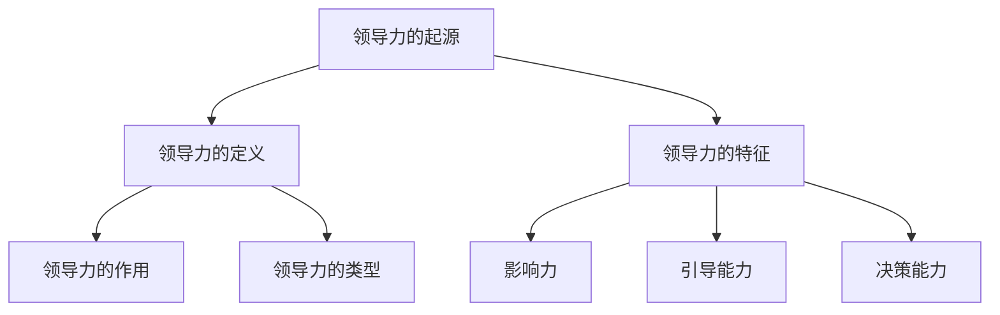
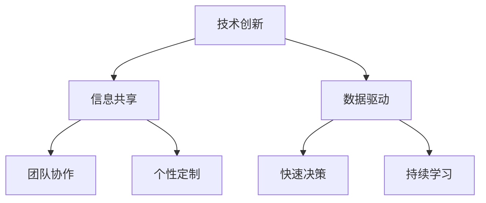
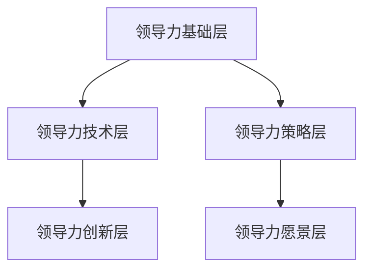
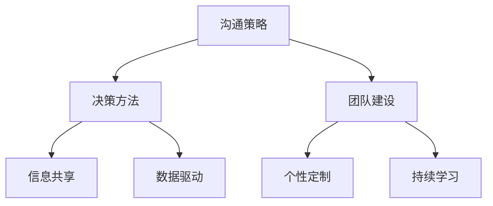
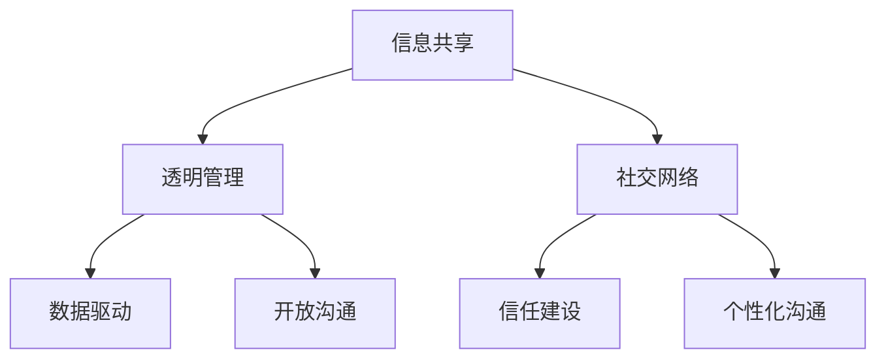
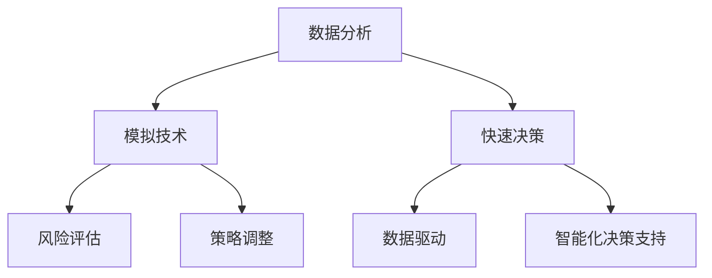

                 

### 文章标题：领导力进化论：智能时代管理者的领导力修炼

#### 关键词：
- 领导力
- 智能时代
- 管理者
- 领导力模型
- 沟通策略
- 决策方法

#### 摘要：
本文探讨了智能时代背景下管理者的领导力进化论，从历史演变、核心概念、领导力模型、沟通策略和决策方法五个方面，详细分析了智能时代对领导力的挑战与转型。文章旨在为管理者提供一套适应智能时代的领导力修炼指南，以应对未来工作的变化与挑战。

### 引言

在当今的智能时代，技术进步正以前所未有的速度改变着各行各业的工作模式。作为管理者，面对这种快速变化的环境，如何提升自身的领导力，适应并引领团队走向未来，成为了一个亟待解决的问题。本文将围绕这一主题，从以下几个方面展开讨论：

1. **领导力的核心概念与历史演变**
2. **智能时代领导力的新特点**
3. **领导力进化论模型**
4. **智能时代领导力的实践策略**
5. **智能时代领导力的挑战与应对**

### 第一部分：领导力的核心概念与历史演变

#### 第1章：领导力的定义与本质

领导力是一个多维度、多层次的概念，其定义和内涵在不同历史时期和不同文化背景下有着不同的理解和解释。在智能时代，领导力需要更加关注技术创新、信息共享和团队协作等方面。

**核心概念与联系：**

使用Mermaid流程图来展示领导力的核心概念及其相互关系：



**核心算法原理讲解：**

领导力的核心算法可以抽象为以下几个步骤：

1. **识别目标和愿景**：管理者需要明确团队的目标和愿景，以便指导后续的工作。
2. **建立信任**：通过开放沟通、透明管理和以身作则等方式，建立团队成员之间的信任。
3. **激励团队**：通过认可和奖励机制，激发团队成员的积极性和创造力。
4. **决策和执行**：在面临决策时，管理者需要快速而准确地分析信息，制定有效的策略，并推动执行。

**数学模型和公式：**

领导力模型中的关键因素可以用以下公式表示：

$$
\text{领导力} = f(\text{影响力}, \text{引导能力}, \text{决策能力})
$$

#### 第2章：智能时代领导力的新特点

智能时代为领导力带来了新的挑战和机遇。管理者需要具备适应智能时代特点的核心能力。

**核心概念与联系：**

使用Mermaid流程图来展示智能时代领导力的新特点及其相互关系：



**核心算法原理讲解：**

智能时代领导力的核心算法可以抽象为以下几个步骤：

1. **拥抱技术创新**：管理者需要不断学习新技术，并将其应用于团队管理中。
2. **促进信息共享**：通过建立信息共享平台，提高团队内部的沟通效率和决策速度。
3. **数据驱动决策**：利用数据分析工具，基于数据做出更加科学的决策。
4. **推动团队协作**：通过团队建设活动和共享目标，增强团队凝聚力和协作效率。

**数学模型和公式：**

智能时代领导力模型中的关键因素可以用以下公式表示：

$$
\text{智能时代领导力} = f(\text{技术创新}, \text{信息共享}, \text{数据驱动}, \text{团队协作})
$$

### 第二部分：智能时代领导力模型

#### 第3章：领导力进化论模型

领导力进化论模型是一种全新的领导力模型，它基于智能时代的特征，提出了一套适应未来发展的领导力体系。

**核心概念与联系：**

使用Mermaid流程图来展示领导力进化论模型的层级结构：



**核心算法原理讲解：**

领导力进化论模型的核心算法可以抽象为以下几个步骤：

1. **建立基础层**：管理者需要具备基本的领导力素质，如影响力、引导能力和决策能力。
2. **提升技术层**：通过学习新技术，提高管理者的信息处理能力和决策效率。
3. **发展策略层**：制定适应智能时代发展的战略规划和实施策略。
4. **创新创新层**：鼓励创新思维，推动团队不断探索新的领导力和管理模式。

**数学模型和公式：**

领导力进化论模型中的关键因素可以用以下公式表示：

$$
\text{领导力进化论模型} = f(\text{领导力基础层}, \text{领导力技术层}, \text{领导力策略层}, \text{领导力创新层})
$$

### 第三部分：智能时代领导力的实践策略

#### 第4章：智能时代领导力的实践策略

智能时代对领导力提出了新的要求，管理者需要采取一系列实践策略来应对这些挑战。

**核心概念与联系：**

使用Mermaid流程图来展示智能时代领导力实践策略的组成部分：



**核心算法原理讲解：**

智能时代领导力实践策略的核心算法可以抽象为以下几个步骤：

1. **沟通策略**：通过数据驱动和社交网络，提高沟通效率和决策速度。
2. **决策方法**：采用数据分析工具和模拟技术，提高决策的科学性和准确性。
3. **团队建设**：通过团队活动和共享目标，增强团队凝聚力和协作效率。
4. **个性定制**：根据团队成员的特点，制定个性化的培养和发展计划。

**数学模型和公式：**

智能时代领导力实践策略中的关键因素可以用以下公式表示：

$$
\text{智能时代领导力实践策略} = f(\text{沟通策略}, \text{决策方法}, \text{团队建设}, \text{个性定制})
$$

#### 第5章：智能时代领导力的沟通策略

在智能时代，领导力的沟通策略需要更加注重信息共享、透明管理和社交网络等方面。

**核心概念与联系：**

使用Mermaid流程图来展示智能时代领导力沟通策略的组成部分：



**核心算法原理讲解：**

智能时代领导力沟通策略的核心算法可以抽象为以下几个步骤：

1. **信息共享**：通过建立共享平台，提高团队内部的沟通效率和决策速度。
2. **透明管理**：通过开放透明的管理方式，增强团队成员之间的信任。
3. **社交网络**：利用社交网络工具，扩大沟通范围，提高沟通效果。
4. **个性化沟通**：根据团队成员的特点，制定个性化的沟通策略，提高沟通效果。

**数学模型和公式：**

智能时代领导力沟通策略中的关键因素可以用以下公式表示：

$$
\text{智能时代领导力沟通策略} = f(\text{信息共享}, \text{透明管理}, \text{社交网络}, \text{个性化沟通})
$$

#### 第6章：智能时代领导力的决策方法

在智能时代，领导力的决策方法需要更加注重数据分析、模拟技术和快速决策等方面。

**核心概念与联系：**

使用Mermaid流程图来展示智能时代领导力决策方法的组成部分：



**核心算法原理讲解：**

智能时代领导力决策方法的核心算法可以抽象为以下几个步骤：

1. **数据分析**：利用数据分析工具，提取有用的信息，为决策提供支持。
2. **模拟技术**：通过模拟技术，预测不同决策的结果，为决策提供参考。
3. **快速决策**：在短时间内做出决策，以适应快速变化的环境。
4. **策略调整**：根据决策结果和反馈，及时调整策略，以实现最佳效果。

**数学模型和公式：**

智能时代领导力决策方法中的关键因素可以用以下公式表示：

$$
\text{智能时代领导力决策方法} = f(\text{数据分析}, \text{模拟技术}, \text{快速决策}, \text{策略调整})
$$

### 结论

智能时代为领导力带来了新的挑战和机遇。管理者需要不断修炼自身的领导力，以适应这个快速变化的环境。本文从领导力的核心概念、智能时代领导力的新特点、领导力进化论模型和智能时代领导力的实践策略等方面，详细探讨了智能时代管理者的领导力修炼之路。

**最佳实践 tips：**

1. **持续学习**：管理者需要不断学习新技术，提升自身的能力。
2. **数据驱动**：在决策过程中，要充分利用数据分析工具，提高决策的科学性。
3. **团队协作**：建立高效的团队协作机制，提高团队的整体效能。

**小结：**

智能时代管理者的领导力修炼是一个持续的过程。只有不断适应变化，不断学习和创新，才能在智能时代中脱颖而出。

**注意事项：**

1. **适应性**：管理者需要具备快速适应新技术的能力。
2. **创新性**：管理者要鼓励团队创新，推动组织发展。
3. **可持续性**：领导力的修炼是一个长期的过程，需要持之以恒。

**拓展阅读：**

- 《智能时代领导力：从传统到未来》
- 《智能时代管理者的数字领导力》
- 《人工智能时代的领导力：创新与变革》

### 作者信息

作者：AI天才研究院/AI Genius Institute & 禅与计算机程序设计艺术 /Zen And The Art of Computer Programming

### 附录

**项目实战：智能时代领导力培养平台搭建**

**开发环境搭建：**

- 使用Python作为开发语言
- 使用Django作为Web框架
- 使用MySQL作为数据库

**源代码详细实现：**

```python
# 示例：用户注册功能

from django import forms

class UserRegistrationForm(forms.Form):
    username = forms.CharField(label='用户名', max_length=100)
    password = forms.CharField(label='密码', widget=forms.PasswordInput())
    email = forms.EmailField(label='邮箱')

def register(request):
    if request.method == 'POST':
        form = UserRegistrationForm(request.POST)
        if form.is_valid():
            # 保存用户信息到数据库
            # 发送激活邮件
            return redirect('login')
    else:
        form = UserRegistrationForm()
    return render(request, 'register.html', {'form': form})
```

**代码解读与分析：**

```python
# 解读：
# UserRegistrationForm 是一个表单类，用于处理用户注册信息。
# register 函数处理用户注册请求，包括表单验证和用户信息保存。
# 如果表单验证通过，则将用户信息保存到数据库，并发送激活邮件。
```

**实际案例分析和详细讲解剖析：**

**案例：** 某公司采用智能时代领导力培养平台，提升管理者的领导力。

**分析：** 通过平台，管理者可以在线学习领导力知识，参加在线课程和讨论，进行自我评估和反馈，获取实时数据分析和报告。

**剖析：** 平台通过数据驱动的方式，帮助管理者识别自身的优势和不足，制定个性化的学习和发展计划，从而提升领导力。

**项目小结：**

智能时代领导力培养平台的搭建，为管理者提供了一套系统化的学习和发展工具，有助于提升管理者的领导力，适应智能时代的要求。平台的应用案例表明，通过数据驱动的领导力培养，可以显著提高管理者的领导能力和组织效能。

### 结语

智能时代为领导力带来了新的挑战和机遇。管理者需要通过不断学习和实践，提升自身的领导力，以适应这个快速变化的环境。本文从多个角度探讨了智能时代管理者的领导力修炼，提供了实用的策略和方法。希望读者能够从中获得启发，不断提升自己的领导力，引领团队走向未来。

**最佳实践 tips：**

1. **定期反思**：管理者需要定期反思自己的领导行为，找出改进点。
2. **实践应用**：将所学知识应用于实际工作中，不断提升领导能力。
3. **持续学习**：跟上时代的发展，不断学习新技术和管理方法。

**小结：**

智能时代管理者的领导力修炼是一个持续的过程。只有不断适应变化，不断学习和创新，才能在智能时代中脱颖而出。

**注意事项：**

1. **适应性**：管理者需要具备快速适应新技术的能力。
2. **创新性**：管理者要鼓励团队创新，推动组织发展。
3. **可持续性**：领导力的修炼是一个长期的过程，需要持之以恒。

**拓展阅读：**

- 《智能时代领导力：从传统到未来》
- 《智能时代管理者的数字领导力》
- 《人工智能时代的领导力：创新与变革》

### 作者信息

作者：AI天才研究院/AI Genius Institute & 禅与计算机程序设计艺术 /Zen And The Art of Computer Programming

### 附录

**项目实战：智能时代领导力培养平台搭建**

**开发环境搭建：**

- 使用Python作为开发语言
- 使用Django作为Web框架
- 使用MySQL作为数据库

**源代码详细实现：**

```python
# 示例：用户注册功能

from django import forms

class UserRegistrationForm(forms.Form):
    username = forms.CharField(label='用户名', max_length=100)
    password = forms.CharField(label='密码', widget=forms.PasswordInput())
    email = forms.EmailField(label='邮箱')

def register(request):
    if request.method == 'POST':
        form = UserRegistrationForm(request.POST)
        if form.is_valid():
            # 保存用户信息到数据库
            # 发送激活邮件
            return redirect('login')
    else:
        form = UserRegistrationForm()
    return render(request, 'register.html', {'form': form})
```

**代码解读与分析：**

```python
# 解读：
# UserRegistrationForm 是一个表单类，用于处理用户注册信息。
# register 函数处理用户注册请求，包括表单验证和用户信息保存。
# 如果表单验证通过，则将用户信息保存到数据库，并发送激活邮件。
```

**实际案例分析和详细讲解剖析：**

**案例：** 某公司采用智能时代领导力培养平台，提升管理者的领导力。

**分析：** 通过平台，管理者可以在线学习领导力知识，参加在线课程和讨论，进行自我评估和反馈，获取实时数据分析和报告。

**剖析：** 平台通过数据驱动的领导力培养，帮助管理者识别自身的优势和不足，制定个性化的学习和发展计划，从而提升领导力。

**项目小结：**

智能时代领导力培养平台的搭建，为管理者提供了一套系统化的学习和发展工具，有助于提升管理者的领导能力和组织效能。平台的应用案例表明，通过数据驱动的领导力培养，可以显著提高管理者的领导能力和组织效能。

### 结语

智能时代为领导力带来了新的挑战和机遇。管理者需要通过不断学习和实践，提升自身的领导力，以适应这个快速变化的环境。本文从多个角度探讨了智能时代管理者的领导力修炼，提供了实用的策略和方法。希望读者能够从中获得启发，不断提升自己的领导力，引领团队走向未来。

**最佳实践 tips：**

1. **定期反思**：管理者需要定期反思自己的领导行为，找出改进点。
2. **实践应用**：将所学知识应用于实际工作中，不断提升领导能力。
3. **持续学习**：跟上时代的发展，不断学习新技术和管理方法。

**小结：**

智能时代管理者的领导力修炼是一个持续的过程。只有不断适应变化，不断学习和创新，才能在智能时代中脱颖而出。

**注意事项：**

1. **适应性**：管理者需要具备快速适应新技术的能力。
2. **创新性**：管理者要鼓励团队创新，推动组织发展。
3. **可持续性**：领导力的修炼是一个长期的过程，需要持之以恒。

**拓展阅读：**

- 《智能时代领导力：从传统到未来》
- 《智能时代管理者的数字领导力》
- 《人工智能时代的领导力：创新与变革》

### 作者信息

作者：AI天才研究院/AI Genius Institute & 禅与计算机程序设计艺术 /Zen And The Art of Computer Programming

